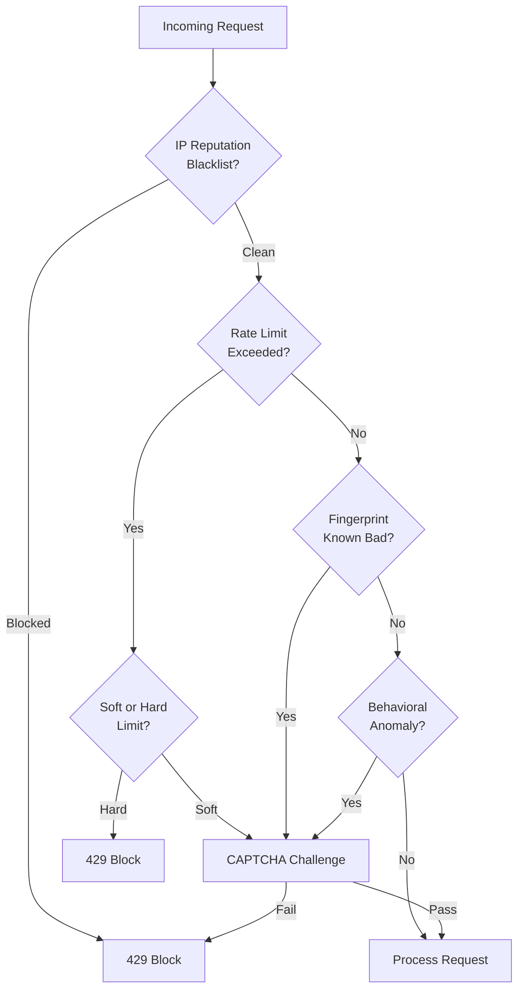

# API Abuse Prevention: Bot Detection, Credential Stuffing, and Fingerprinting

## Why API Abuse Prevention Exists

APIs designed for humans are routinely attacked by automated tools. The economic incentives are clear: credential stuffing campaigns average a 0.1% success rate, but with lists of 100 million credentials, that's 100,000 valid accounts. Account takeovers, inventory hoarding, price scraping, fake account creation, loyalty point fraud, and referral code abuse all rely on automation at a scale no human could achieve.

Unlike traditional security controls, abuse prevention is not binary — it's a probability game. You cannot perfectly distinguish bots from humans without degrading legitimate user experience. The goal is to raise the cost of attacks high enough that attackers move to softer targets.

### Industry Scale

- **Credential stuffing**: 193 billion attacks per year globally (Akamai 2022)
- **Bot traffic**: ~30% of all internet traffic (Imperva 2023)
- **API-specific attacks**: APIs now represent 90% of web attack traffic
- **Account takeover cost**: $12B/year industry-wide (Javelin Strategy 2023)

## First Principles

### The Attacker Economics Model

Every mitigation adds cost for the attacker. The goal is to raise cost above profit:

$$\text{ROI}_{\text{attack}} = \frac{\text{Value per success} \times \text{Success rate}}{\text{Cost per attempt}} - 1$$

An attack is profitable when $\text{ROI} > 0$. Defenses work by:
1. Reducing success rate (MFA, anomaly detection)
2. Increasing cost per attempt (CAPTCHA, rate limiting, fingerprinting)
3. Reducing value per success (limiting exposed data, token scoping)

### Layers of Defense



## Core Mechanics

### Signal Sources for Bot Detection

| Signal | Reliability | Spoofability | Collection Location |
|--------|------------|-------------|-------------------|
| IP address | Low | Easy (proxies) | Server |
| IP reputation (ASN, hosting) | Medium | Moderate | Server |
| Rate patterns | Medium | Moderate | Server |
| User-Agent | Low | Trivial | Server |
| TLS fingerprint (JA3) | Medium | Moderate | Network/CDN |
| HTTP/2 fingerprint | Medium | Hard | Network/CDN |
| Browser APIs (canvas, WebGL) | High | Hard | Client-side JS |
| Mouse/keyboard behavior | High | Very hard | Client-side JS |
| Timing patterns | Medium | Moderate | Server |
| Geolocation velocity | High | Moderate (VPN) | Server |

## Implementation

### IP Reputation and Rate Limiting

```typescript
import { createClient } from 'redis';
import { Request, Response, NextFunction } from 'express';

interface RateLimitConfig {
  windowMs: number;
  maxRequests: number;
  blockDurationMs?: number;
  keyGenerator?: (req: Request) => string;
}

interface RateLimitBucket {
  count: number;
  firstRequest: number;
  blocked?: number;
}

export class RateLimiter {
  private readonly redis: ReturnType<typeof createClient>;

  constructor(redis: ReturnType<typeof createClient>) {
    this.redis = redis;
  }

  /**
   * Sliding window rate limiter using Redis sorted sets.
   * More accurate than fixed windows (no "burst at window boundary" problem).
   */
  async checkSlidingWindow(
    key: string,
    windowMs: number,
    maxRequests: number
  ): Promise<{ allowed: boolean; remaining: number; resetAt: number }> {
    const now = Date.now();
    const windowStart = now - windowMs;

    const pipeline = this.redis.multi();
    // Remove entries outside the window
    pipeline.zRemRangeByScore(key, 0, windowStart);
    // Add current request
    pipeline.zAdd(key, { score: now, value: `${now}-${Math.random()}` });
    // Count requests in window
    pipeline.zCard(key);
    // Set TTL to prevent orphaned keys
    pipeline.expire(key, Math.ceil(windowMs / 1000));

    const results = await pipeline.exec();
    const count = results[2] as number;

    const allowed = count <= maxRequests;
    const remaining = Math.max(0, maxRequests - count);
    const resetAt = now + windowMs;

    return { allowed, remaining, resetAt };
  }

  /**
   * Token bucket algorithm — allows bursting up to bucket capacity.
   */
  async checkTokenBucket(
    key: string,
    capacity: number,
    refillRate: number, // tokens per second
    tokensRequested = 1
  ): Promise<{ allowed: boolean; tokens: number }> {
    const now = Date.now() / 1000;
    const bucketKey = `bucket:${key}`;

    const stored = await this.redis.hGetAll(bucketKey);
    const lastRefill = parseFloat(stored.lastRefill ?? String(now));
    const currentTokens = parseFloat(stored.tokens ?? String(capacity));

    // Calculate refilled tokens
    const elapsed = now - lastRefill;
    const refilled = Math.min(capacity, currentTokens + elapsed * refillRate);

    if (refilled < tokensRequested) {
      await this.redis.hSet(bucketKey, {
        tokens: String(refilled),
        lastRefill: String(now),
      });
      await this.redis.expire(bucketKey, Math.ceil(capacity / refillRate) + 60);
      return { allowed: false, tokens: refilled };
    }

    const newTokens = refilled - tokensRequested;
    await this.redis.hSet(bucketKey, {
      tokens: String(newTokens),
      lastRefill: String(now),
    });
    await this.redis.expire(bucketKey, Math.ceil(capacity / refillRate) + 60);

    return { allowed: true, tokens: newTokens };
  }
}

export function rateLimitMiddleware(
  limiter: RateLimiter,
  config: RateLimitConfig
) {
  const keyGen = config.keyGenerator ?? ((req: Request) => req.ip ?? 'unknown');

  return async (req: Request, res: Response, next: NextFunction) => {
    const key = `rl:${keyGen(req)}`;
    const result = await limiter.checkSlidingWindow(
      key,
      config.windowMs,
      config.maxRequests
    );

    res.setHeader('X-RateLimit-Limit', config.maxRequests);
    res.setHeader('X-RateLimit-Remaining', result.remaining);
    res.setHeader('X-RateLimit-Reset', Math.ceil(result.resetAt / 1000));

    if (!result.allowed) {
      res.setHeader('Retry-After', Math.ceil(config.windowMs / 1000));
      return res.status(429).json({
        error: 'rate_limit_exceeded',
        message: 'Too many requests. Please try again later.',
        retryAfter: Math.ceil(config.windowMs / 1000),
      });
    }

    next();
  };
}
```

### Credential Stuffing Detection

```typescript
interface LoginAttempt {
  ip: string;
  email: string;
  userAgent: string;
  timestamp: number;
  success: boolean;
}

interface CredentialStuffingMetrics {
  uniqueIpsByEmail: number;
  uniqueEmailsByIp: number;
  failureRate: number;
  velocity: number; // attempts per minute
  asn?: string;
  isDatacenterIp: boolean;
}

export class CredentialStuffingDetector {
  private readonly redis: ReturnType<typeof createClient>;
  private readonly windowMs = 3600_000; // 1 hour

  constructor(redis: ReturnType<typeof createClient>) {
    this.redis = redis;
  }

  async recordAttempt(attempt: LoginAttempt): Promise<void> {
    const pipe = this.redis.multi();
    const ts = attempt.timestamp;
    const window = Math.floor(ts / this.windowMs);

    // Track IPs per email
    pipe.sAdd(`cred:email:${attempt.email}:ips:${window}`, attempt.ip);
    pipe.expire(`cred:email:${attempt.email}:ips:${window}`, 7200);

    // Track emails per IP
    pipe.sAdd(`cred:ip:${attempt.ip}:emails:${window}`, attempt.email);
    pipe.expire(`cred:ip:${attempt.ip}:emails:${window}`, 7200);

    // Track failures
    if (!attempt.success) {
      pipe.incr(`cred:failures:${attempt.ip}:${window}`);
      pipe.expire(`cred:failures:${attempt.ip}:${window}`, 7200);
    }

    await pipe.exec();
  }

  async assessRisk(ip: string, email: string): Promise<{
    score: number;
    action: 'allow' | 'challenge' | 'block';
    reasons: string[];
  }> {
    const window = Math.floor(Date.now() / this.windowMs);
    const reasons: string[] = [];
    let score = 0;

    // How many IPs are trying this email?
    const ipsForEmail = await this.redis.sCard(
      `cred:email:${email}:ips:${window}`
    );
    if (ipsForEmail > 10) {
      score += 40;
      reasons.push(`Email targeted by ${ipsForEmail} IPs in past hour`);
    } else if (ipsForEmail > 3) {
      score += 20;
      reasons.push(`Email targeted by ${ipsForEmail} IPs in past hour`);
    }

    // How many emails is this IP trying?
    const emailsForIp = await this.redis.sCard(
      `cred:ip:${ip}:emails:${window}`
    );
    if (emailsForIp > 20) {
      score += 50;
      reasons.push(`IP trying ${emailsForIp} different emails`);
    } else if (emailsForIp > 5) {
      score += 25;
      reasons.push(`IP trying ${emailsForIp} different emails`);
    }

    // Failure count
    const failures = parseInt(
      (await this.redis.get(`cred:failures:${ip}:${window}`)) ?? '0'
    );
    if (failures > 50) {
      score += 30;
      reasons.push(`${failures} failed attempts from IP`);
    } else if (failures > 10) {
      score += 15;
    }

    let action: 'allow' | 'challenge' | 'block';
    if (score >= 70) {
      action = 'block';
    } else if (score >= 30) {
      action = 'challenge';
    } else {
      action = 'allow';
    }

    return { score, action, reasons };
  }
}

// ── Login route with credential stuffing protection ───────────────────────────

export function createLoginHandler(
  detector: CredentialStuffingDetector,
  captchaVerifier: (token: string) => Promise<boolean>
) {
  return async (req: Request, res: Response) => {
    const { email, password, captchaToken } = req.body;
    const ip = req.ip ?? '';

    const risk = await detector.assessRisk(ip, email);

    if (risk.action === 'block') {
      await detector.recordAttempt({
        ip,
        email,
        userAgent: req.headers['user-agent'] ?? '',
        timestamp: Date.now(),
        success: false,
      });
      // Return same error as wrong password to avoid enumeration
      return res.status(401).json({ error: 'Invalid credentials' });
    }

    if (risk.action === 'challenge') {
      if (!captchaToken) {
        return res.status(428).json({
          error: 'captcha_required',
          message: 'Please complete the security challenge',
        });
      }
      const captchaValid = await captchaVerifier(captchaToken);
      if (!captchaValid) {
        return res.status(400).json({ error: 'Invalid CAPTCHA' });
      }
    }

    // Perform actual authentication
    const user = await authenticateUser(email, password);
    const success = user !== null;

    await detector.recordAttempt({
      ip,
      email,
      userAgent: req.headers['user-agent'] ?? '',
      timestamp: Date.now(),
      success,
    });

    if (!success) {
      return res.status(401).json({ error: 'Invalid credentials' });
    }

    return res.json({ token: generateSessionToken(user) });
  };
}

// Placeholder for authentication and token functions
async function authenticateUser(email: string, password: string) {
  return null; // implement actual auth
}
function generateSessionToken(user: any) {
  return 'token'; // implement actual token generation
}
```

### Device Fingerprinting

```typescript
/**
 * Server-side fingerprint from request headers.
 * Stable enough to identify returning clients, not reliable for blocking alone.
 */
export function computeServerSideFingerprint(req: Request): string {
  const { createHash } = require('crypto');

  const components = [
    req.headers['user-agent'] ?? '',
    req.headers['accept'] ?? '',
    req.headers['accept-language'] ?? '',
    req.headers['accept-encoding'] ?? '',
    // HTTP/2 pseudo-header order (if available from proxy)
    req.headers['x-http2-fingerprint'] ?? '',
  ];

  return createHash('sha256')
    .update(components.join('|'))
    .digest('hex')
    .slice(0, 16); // 16 hex chars = 64 bits — sufficient for fingerprint
}

/**
 * JA3 TLS fingerprint extraction (requires Nginx/Cloudflare to pass the header).
 * JA3 = MD5 hash of: TLS version, ciphers, extensions, elliptic curves, EC point formats
 */
export function getTlsFingerprint(req: Request): string | null {
  return (
    req.headers['x-ja3-fingerprint'] as string ??
    req.headers['cf-ja3-fingerprint'] as string ??
    null
  );
}
```

### Client-Side Fingerprinting with FingerprintJS

```typescript
// Client-side code (browser)
// This runs in the user's browser to collect rich device signals

interface FingerprintComponents {
  canvas: string;
  webgl: string;
  fonts: string[];
  screen: { width: number; height: number; colorDepth: number };
  timezone: string;
  language: string;
  plugins: string[];
  cookiesEnabled: boolean;
  doNotTrack: string | null;
  hardwareConcurrency: number;
  deviceMemory: number | null;
}

async function collectFingerprint(): Promise<string> {
  const components: Partial<FingerprintComponents> = {};

  // Canvas fingerprint
  try {
    const canvas = document.createElement('canvas');
    const ctx = canvas.getContext('2d')!;
    ctx.textBaseline = 'top';
    ctx.font = '14px Arial';
    ctx.fillStyle = '#f60';
    ctx.fillRect(125, 1, 62, 20);
    ctx.fillStyle = '#069';
    ctx.fillText('Browser fingerprint', 2, 15);
    ctx.fillStyle = 'rgba(102, 204, 0, 0.7)';
    ctx.fillText('Browser fingerprint', 4, 17);
    components.canvas = canvas.toDataURL();
  } catch {
    components.canvas = 'unsupported';
  }

  // Screen info
  components.screen = {
    width: screen.width,
    height: screen.height,
    colorDepth: screen.colorDepth,
  };

  // Timezone
  components.timezone = Intl.DateTimeFormat().resolvedOptions().timeZone;

  // Hardware signals
  components.hardwareConcurrency = navigator.hardwareConcurrency;
  components.deviceMemory = (navigator as any).deviceMemory ?? null;

  // Stable hash
  const json = JSON.stringify(components);
  const encoder = new TextEncoder();
  const data = encoder.encode(json);
  const hashBuffer = await crypto.subtle.digest('SHA-256', data);
  const hashArray = Array.from(new Uint8Array(hashBuffer));
  return hashArray.map(b => b.toString(16).padStart(2, '0')).join('').slice(0, 32);
}

// Send fingerprint with sensitive requests
async function loginWithFingerprint(email: string, password: string) {
  const fingerprint = await collectFingerprint();

  return fetch('/api/auth/login', {
    method: 'POST',
    headers: {
      'Content-Type': 'application/json',
      'X-Device-Fingerprint': fingerprint,
    },
    body: JSON.stringify({ email, password }),
  });
}
```

### CAPTCHA Integration

```typescript
interface CaptchaVerifier {
  verify(token: string, ip?: string): Promise<{
    success: boolean;
    score?: number; // 0-1 for v3 (1 = definitely human)
    action?: string;
  }>;
}

/**
 * Google reCAPTCHA v3 verifier (score-based, no user interaction).
 * Score < 0.5 is suspicious, < 0.3 is likely bot.
 */
export class RecaptchaV3Verifier implements CaptchaVerifier {
  constructor(
    private readonly secretKey: string,
    private readonly minScore: number = 0.5
  ) {}

  async verify(token: string, ip?: string): Promise<{
    success: boolean;
    score?: number;
    action?: string;
  }> {
    const params = new URLSearchParams({
      secret: this.secretKey,
      response: token,
      ...(ip ? { remoteip: ip } : {}),
    });

    const response = await fetch(
      'https://www.google.com/recaptcha/api/siteverify',
      {
        method: 'POST',
        headers: { 'Content-Type': 'application/x-www-form-urlencoded' },
        body: params.toString(),
      }
    );

    const data = (await response.json()) as {
      success: boolean;
      score: number;
      action: string;
      hostname: string;
    };

    return {
      success: data.success && data.score >= this.minScore,
      score: data.score,
      action: data.action,
    };
  }
}

/**
 * Cloudflare Turnstile verifier (privacy-preserving CAPTCHA alternative).
 */
export class TurnstileVerifier implements CaptchaVerifier {
  constructor(private readonly secretKey: string) {}

  async verify(token: string, ip?: string): Promise<{
    success: boolean;
    score?: number;
  }> {
    const formData = new FormData();
    formData.append('secret', this.secretKey);
    formData.append('response', token);
    if (ip) formData.append('remoteip', ip);

    const response = await fetch(
      'https://challenges.cloudflare.com/turnstile/v0/siteverify',
      { method: 'POST', body: formData }
    );

    const data = (await response.json()) as { success: boolean };
    return { success: data.success };
  }
}

/**
 * hCaptcha verifier.
 */
export class HCaptchaVerifier implements CaptchaVerifier {
  constructor(private readonly secretKey: string) {}

  async verify(token: string, ip?: string): Promise<{ success: boolean }> {
    const params = new URLSearchParams({
      secret: this.secretKey,
      response: token,
      ...(ip ? { remoteip: ip } : {}),
    });

    const response = await fetch(
      'https://hcaptcha.com/siteverify',
      {
        method: 'POST',
        headers: { 'Content-Type': 'application/x-www-form-urlencoded' },
        body: params.toString(),
      }
    );

    const data = (await response.json()) as { success: boolean };
    return { success: data.success };
  }
}
```

### Behavioral Analysis

```typescript
interface BehaviorEvent {
  type: 'mouseMove' | 'keyPress' | 'scroll' | 'click' | 'focus' | 'blur';
  timestamp: number;
  x?: number;
  y?: number;
  key?: string;
}

interface BehaviorAnalysis {
  isLikelyBot: boolean;
  confidence: number;
  signals: string[];
}

/**
 * Analyze behavioral events for bot-like patterns.
 * Bots typically lack natural mouse movement entropy and keystroke timing variance.
 */
export function analyzeBehavior(events: BehaviorEvent[]): BehaviorAnalysis {
  const signals: string[] = [];
  let suspicionScore = 0;

  if (events.length === 0) {
    return { isLikelyBot: true, confidence: 0.9, signals: ['No behavioral events'] };
  }

  const mouseEvents = events.filter(e => e.type === 'mouseMove');
  const keyEvents = events.filter(e => e.type === 'keyPress');

  // Check for linear mouse movement (bots often move in straight lines)
  if (mouseEvents.length >= 3) {
    const linearity = computeMouseLinearity(mouseEvents);
    if (linearity > 0.95) {
      suspicionScore += 30;
      signals.push(`Mouse movement is highly linear (${(linearity * 100).toFixed(1)}%)`);
    }
  } else if (mouseEvents.length === 0) {
    suspicionScore += 20;
    signals.push('No mouse movement detected (form may have been filled programmatically)');
  }

  // Check keystroke timing — humans have variance, bots type at constant speed
  if (keyEvents.length >= 5) {
    const intervals = keyEvents
      .slice(1)
      .map((e, i) => e.timestamp - keyEvents[i].timestamp);
    const mean = intervals.reduce((a, b) => a + b, 0) / intervals.length;
    const variance =
      intervals.reduce((a, b) => a + Math.pow(b - mean, 2), 0) / intervals.length;
    const cv = Math.sqrt(variance) / mean; // Coefficient of variation

    if (cv < 0.05) {
      suspicionScore += 40;
      signals.push(`Keystroke timing has very low variance (CV=${cv.toFixed(3)})`);
    } else if (cv < 0.15) {
      suspicionScore += 15;
      signals.push(`Keystroke timing variance is low (CV=${cv.toFixed(3)})`);
    }
  }

  // Check form fill time — too fast suggests automation
  const formStart = events[0]?.timestamp ?? 0;
  const formEnd = events[events.length - 1]?.timestamp ?? 0;
  const fillDuration = formEnd - formStart;

  if (fillDuration < 1500) { // Less than 1.5 seconds to fill a form
    suspicionScore += 25;
    signals.push(`Form filled in ${fillDuration}ms (unusually fast)`);
  }

  const confidence = Math.min(suspicionScore / 100, 1);
  return {
    isLikelyBot: suspicionScore >= 50,
    confidence,
    signals,
  };
}

function computeMouseLinearity(events: BehaviorEvent[]): number {
  if (events.length < 3) return 0;

  const points = events
    .filter(e => e.x !== undefined && e.y !== undefined)
    .map(e => ({ x: e.x!, y: e.y! }));

  if (points.length < 3) return 0;

  const start = points[0];
  const end = points[points.length - 1];
  const dx = end.x - start.x;
  const dy = end.y - start.y;
  const lineLength = Math.sqrt(dx * dx + dy * dy);

  if (lineLength === 0) return 1;

  // Average distance of intermediate points from the line
  let totalDeviation = 0;
  for (const p of points.slice(1, -1)) {
    const deviation = Math.abs(dy * p.x - dx * p.y + end.x * start.y - end.y * start.x) / lineLength;
    totalDeviation += deviation;
  }

  const avgDeviation = totalDeviation / (points.length - 2);
  return 1 - Math.min(avgDeviation / 100, 1);
}
```

### IP Intelligence and ASN Blocking

```typescript
interface IpIntelligence {
  ip: string;
  asn: string;
  asnOrg: string;
  isHosting: boolean;      // AWS, GCP, Azure, DigitalOcean, etc.
  isVpn: boolean;
  isTor: boolean;
  isProxy: boolean;
  country: string;
  riskScore: number; // 0-100
}

// Known hosting/datacenter ASNs (partial list — use a proper IP intelligence DB in production)
const KNOWN_HOSTING_ASNS = new Set([
  'AS16509', // Amazon AWS
  'AS15169', // Google Cloud
  'AS8075',  // Microsoft Azure
  'AS14061', // DigitalOcean
  'AS20473', // Vultr
  'AS14618', // Amazon AWS (alternate)
  'AS396982', // Google Cloud (alternate)
]);

export async function getIpIntelligence(
  ip: string,
  apiKey: string
): Promise<IpIntelligence> {
  // Use an IP intelligence API (MaxMind, IPinfo, IPQualityScore, etc.)
  const response = await fetch(
    `https://ipqualityscore.com/api/json/ip/${apiKey}/${ip}?strictness=1`
  );
  const data = await response.json() as any;

  return {
    ip,
    asn: data.ASN ?? 'unknown',
    asnOrg: data.organization ?? 'unknown',
    isHosting: data.is_crawler || KNOWN_HOSTING_ASNS.has(data.ASN),
    isVpn: data.vpn ?? false,
    isTor: data.tor ?? false,
    isProxy: data.proxy ?? false,
    country: data.country_code ?? 'unknown',
    riskScore: data.fraud_score ?? 0,
  };
}

export function ipRiskMiddleware(
  getIntel: (ip: string) => Promise<IpIntelligence>,
  options: {
    blockTor?: boolean;
    blockHosting?: boolean;
    blockScore?: number;
    challengeScore?: number;
  }
) {
  return async (req: Request, res: Response, next: NextFunction) => {
    const ip = req.ip ?? '';

    let intel: IpIntelligence;
    try {
      intel = await getIntel(ip);
    } catch {
      // Fail open — don't block legitimate traffic if IP intel is down
      return next();
    }

    if (options.blockTor && intel.isTor) {
      return res.status(403).json({
        error: 'access_denied',
        message: 'Access from Tor exit nodes is not permitted',
      });
    }

    if (intel.riskScore >= (options.blockScore ?? 90)) {
      return res.status(403).json({ error: 'access_denied' });
    }

    if (intel.riskScore >= (options.challengeScore ?? 70)) {
      (req as any).requireCaptcha = true;
    }

    (req as any).ipIntelligence = intel;
    next();
  };
}
```

## Edge Cases and Failure Modes

### 1. Shared IP Addresses

NAT gateways (corporate networks, mobile carriers) can route thousands of users through a single IP. Rate limiting by IP can block legitimate users.

**Mitigation**: Use multi-dimensional rate limiting:
- IP + User-Agent hash
- IP + email (for auth endpoints)
- Session-level tracking post-authentication
- Higher limits for corporate IP ranges (identified by ASN)

### 2. VPN and Tor — Blocking Trade-offs

Blocking all VPN/Tor users blocks legitimate privacy-conscious users, activists, and security researchers. Many financial services block Tor entirely; consumer apps typically don't.

**Risk-based approach**: Score users higher for Tor/VPN, require MFA, limit available actions, but don't outright block unless your threat model requires it.

### 3. Fingerprint Spoofing

Sophisticated bots (using headless Chrome with `puppeteer-extra-plugin-stealth`) can spoof most client-side fingerprints. Server-side signals (JA3, HTTP/2 fingerprints) are harder to spoof.

**Defense**: Layer multiple signals. No single signal is reliable. A bot that passes every individual check still produces an unusual combination of signals.

### 4. CAPTCHA Farms

CAPTCHA solving services use human workers (often in developing countries) to solve CAPTCHAs for ~$0.001/each. High-value attacks simply pay to solve CAPTCHAs.

**Counter**: CAPTCHA is not a complete defense — it's a cost-adder. Combine with anomaly detection, risk scoring, and business logic validation (does this account's behavior make sense?).

### 5. Distributed Attacks

Sophisticated botnets use residential proxies, rotating millions of IPs. Rate limiting per IP fails.

**Counter**: Account-level rate limiting, velocity checks, and behavioral signals are more effective than IP-based controls alone.

## Performance Characteristics

| Check | Latency | Throughput Impact |
|-------|---------|-----------------|
| Redis rate limit check | 0.5-2ms | Negligible |
| IP intelligence API | 10-50ms | High (cache aggressively) |
| Credential stuffing check | 1-3ms | Negligible |
| CAPTCHA verification | 50-200ms | Medium |
| Client-side fingerprint (browser) | 50-200ms | User-side |
| Canvas fingerprinting | 10-50ms | User-side |

**Caching strategy for IP intelligence**:

```typescript
// Cache IP intelligence results — IPs don't change reputation frequently
const IP_CACHE_TTL = 3600; // 1 hour

async function getCachedIpIntel(
  ip: string,
  redis: ReturnType<typeof createClient>,
  fetcher: (ip: string) => Promise<IpIntelligence>
): Promise<IpIntelligence> {
  const cached = await redis.get(`ipintel:${ip}`);
  if (cached) return JSON.parse(cached);

  const intel = await fetcher(ip);
  await redis.setEx(`ipintel:${ip}`, IP_CACHE_TTL, JSON.stringify(intel));
  return intel;
}
```

## Mathematical Foundations

### False Positive vs. False Negative Trade-off

Let $P_{\text{bot}}$ = base rate of bot traffic (e.g., 0.3), $P_{\text{human}} = 1 - P_{\text{bot}}$.

For a detector with sensitivity $\text{TPR}$ (true positive rate) and specificity $\text{TNR}$:

$$\text{Precision} = \frac{\text{TPR} \cdot P_{\text{bot}}}{\text{TPR} \cdot P_{\text{bot}} + (1 - \text{TNR}) \cdot P_{\text{human}}}$$

For $\text{TPR} = 0.95$, $\text{TNR} = 0.99$, $P_{\text{bot}} = 0.3$:

$$\text{Precision} = \frac{0.95 \times 0.3}{0.95 \times 0.3 + 0.01 \times 0.7} = \frac{0.285}{0.292} \approx 0.976$$

97.6% of "bot" detections would be real bots — only 2.4% are false positives (blocked legitimate users). Acceptable. But at $P_{\text{bot}} = 0.01$ (1% of traffic):

$$\text{Precision} = \frac{0.0095}{0.0095 + 0.0099} \approx 0.49$$

Now 51% of detections are false positives. This is why bot mitigation for low-volume attack scenarios requires very high specificity or additional verification steps rather than hard blocks.

## Real-World War Stories

::: info War Story: The Sneaker Bot Arms Race

A major athletic retailer deployed rate limiting by IP for their limited sneaker releases. Bots responded by purchasing residential proxy subscriptions, routing attacks through real home IPs. IP limiting dropped from 95% bot traffic to 45%.

The retailer then added device fingerprinting and behavioral analysis. Bots running headless Chrome with stealth plugins responded by mimicking human mouse movements. After 6 months of iteration: fingerprinting, purchase velocity limits per account, virtual queue with behavioral scoring, and requiring account age > 30 days reduced bot purchasing from 85% of limited inventory to approximately 30%.

The key insight: no single defense works. The goal is raising cost above profit margin. At bot mitigation cost of $0.10/blocked attempt vs. profit of $200/pair resold, bots can absorb enormous friction.
:::

::: info War Story: Credential Stuffing That Bypassed Rate Limiting

A travel booking site limited login attempts to 5 per IP per minute. A credential stuffing attack used a list of 50 million credentials and 2 million residential IPs. With 25 IPs per attack wave, they attempted 125 logins per minute distributed across IPs — well under the per-IP limit.

The detection came from an unusual source: customer service tickets spiked with "I didn't make this booking" reports. The correlation between tickets and the attack was found during incident investigation.

The fix was multi-dimensional: (1) email-level rate limiting (max 10 failed attempts per email per hour), (2) impossible travel detection (login from two countries within 30 minutes), (3) device fingerprint registration for existing accounts. Email-level limiting was the most effective single change — it doesn't matter how many IPs you use if each email can only fail 10 times per hour.
:::

## Decision Framework

### Bot Mitigation Stack by Risk Level

| API Endpoint Risk | Recommended Controls |
|------------------|---------------------|
| Low (public reads) | Rate limit by IP, no CAPTCHA |
| Medium (registration) | Rate limit, CAPTCHA on suspicious IPs |
| High (login) | Rate limit + email-level limits + credential stuffing detection + CAPTCHA on challenge |
| Critical (payments) | All above + device fingerprinting + behavioral analysis + 3D Secure |
| Very High (account takeover risk) | All above + MFA enforcement + impossible travel + security keys |

### CAPTCHA Provider Selection

| Provider | Privacy | UX Friction | Detection Quality | Cost |
|----------|---------|------------|------------------|------|
| reCAPTCHA v2 | Poor | High (checkbox/image) | Good | Free |
| reCAPTCHA v3 | Poor | None (invisible) | Good | Free |
| hCaptcha | Better | High | Good | Free/Paid |
| Cloudflare Turnstile | Good | Low | Good | Free |
| Arkose Labs | Medium | High | Excellent | Enterprise |
| DataDome | Good | Low | Excellent | Enterprise |

For consumer applications: Cloudflare Turnstile (privacy-respecting, low friction, no Google dependency). For high-value targets: enterprise solutions with ML-based detection.

## Advanced Topics

### Graph-Based Account Fraud Detection

Build a graph of accounts and their signals (shared IPs, devices, email patterns). Fraud clusters appear as dense connected components:

```typescript
interface AccountNode {
  accountId: string;
  ips: string[];
  devices: string[];
  emails: string[];
}

// Two accounts are "connected" if they share IP, device, or email pattern
function buildFraudGraph(accounts: AccountNode[]): Map<string, Set<string>> {
  const graph = new Map<string, Set<string>>();

  for (const account of accounts) {
    if (!graph.has(account.accountId)) {
      graph.set(account.accountId, new Set());
    }
  }

  for (let i = 0; i < accounts.length; i++) {
    for (let j = i + 1; j < accounts.length; j++) {
      const a = accounts[i];
      const b = accounts[j];
      const sharedIp = a.ips.some(ip => b.ips.includes(ip));
      const sharedDevice = a.devices.some(d => b.devices.includes(d));

      if (sharedIp || sharedDevice) {
        graph.get(a.accountId)!.add(b.accountId);
        graph.get(b.accountId)!.add(a.accountId);
      }
    }
  }

  return graph;
}
```

Accounts in the same cluster as a known fraudulent account are at elevated risk. This graph traversal approach catches sophisticated attacks that carefully rotate IPs but reuse devices or email patterns.

::: tip
Graph-based fraud detection is powerful but computationally expensive at scale. Run it asynchronously on batch data rather than in the request path. Use it to flag accounts for manual review rather than automatic blocking.
:::
