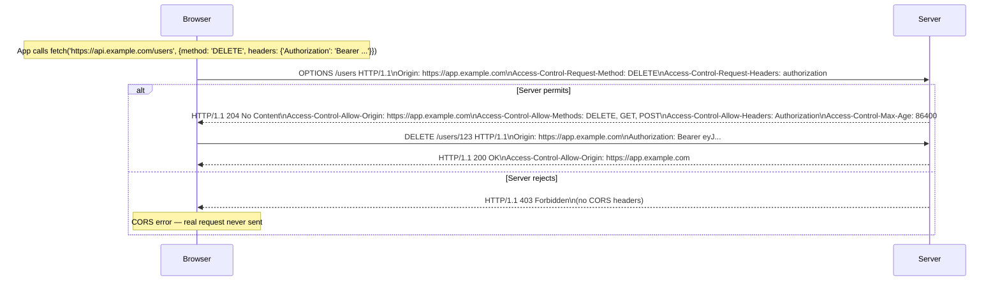

# CORS Deep Dive: Same-Origin Policy, Preflight, and Misconfigurations

## Why CORS Exists

The web is built on a foundation of cross-site resource loading — images, scripts, and stylesheets routinely load from CDNs and third-party hosts. But these "passive" resources should not be able to read your bank account or send authenticated requests on your behalf.

The **Same-Origin Policy (SOP)** is the browser's core security mechanism: JavaScript running on `evil.com` cannot read responses from `bank.com`. CORS (Cross-Origin Resource Sharing) is the controlled escape valve — it lets server operators explicitly permit specific cross-origin access.

Without SOP, any malicious website you visit could make authenticated requests to your email, bank, and corporate intranets using your stored cookies. CORS misconfigurations effectively undo this protection.

### Historical Context

SOP was introduced in Netscape Navigator 2.0 (1995). As web applications became more sophisticated, single-page apps needed to call APIs on different origins. The `document.domain` hack and JSONP were workarounds. CORS was standardized by the W3C in 2014 (RFC 6454) as the proper solution.

## First Principles

### What Is an "Origin"?

An origin is the tuple: **(scheme, host, port)**. Two URLs have the same origin only if ALL three components match exactly.

| URL | Same Origin as `https://api.example.com:443`? | Reason |
|-----|------|--------|
| `https://api.example.com/v2` | Yes | Same scheme, host, port |
| `http://api.example.com` | No | Different scheme |
| `https://www.example.com` | No | Different host |
| `https://api.example.com:8080` | No | Different port |
| `https://sub.api.example.com` | No | Different host |

Port 443 is the default for HTTPS, so `https://example.com` and `https://example.com:443` are the same origin.

### What SOP Blocks

SOP restricts JavaScript's ability to **read** cross-origin responses. It does NOT prevent requests from being sent — it prevents JavaScript from accessing the response body, headers, or status code.

```mermaid
flowchart TD
    A[Page on evil.com] -->|fetch('https://bank.com/account')| B[Browser]
    B -->|SOP check| C{Same origin?}
    C -->|No| D[Request SENT to bank.com]
    D --> E[bank.com responds with account data]
    E --> F{CORS headers present\nand origin allowed?}
    F -->|No| G[Browser BLOCKS response\nJS cannot read it]
    F -->|Yes| H[Browser allows JS to read response]
    D --> I[Side effects already happened\nGET logged, cookies sent]
```

::: warning
SOP blocks reading, not sending. A CSRF attack using a form POST doesn't need to read the response — it just needs the action to happen. CSRF tokens, not CORS, protect against that threat model.
:::

### Simple vs. Preflighted Requests

The browser uses different CORS flows for different request types:

**Simple requests** (no preflight) must meet ALL of:
- Method: `GET`, `HEAD`, or `POST`
- Headers: Only `Accept`, `Accept-Language`, `Content-Language`, `Content-Type`
- Content-Type (if POST): only `application/x-www-form-urlencoded`, `multipart/form-data`, or `text/plain`
- No `ReadableStream` body
- No event listeners on `XMLHttpRequestUpload`

Everything else triggers a **preflight** — an `OPTIONS` request that asks the server for permission before sending the real request.

## Core Mechanics

### Preflight Flow



### Access-Control Headers Reference

| Header | Direction | Purpose |
|--------|-----------|---------|
| `Origin` | Request | The requesting origin |
| `Access-Control-Request-Method` | Preflight Request | The method for the real request |
| `Access-Control-Request-Headers` | Preflight Request | The custom headers for the real request |
| `Access-Control-Allow-Origin` | Response | Allowed origin(s) |
| `Access-Control-Allow-Methods` | Preflight Response | Permitted methods |
| `Access-Control-Allow-Headers` | Preflight Response | Permitted custom headers |
| `Access-Control-Allow-Credentials` | Response | Whether cookies/auth may be sent |
| `Access-Control-Expose-Headers` | Response | Headers readable by JS |
| `Access-Control-Max-Age` | Preflight Response | Preflight cache duration (seconds) |

## Implementation

### Production CORS Middleware (TypeScript/Express)

```typescript
import { Request, Response, NextFunction } from 'express';

export interface CorsOptions {
  /** Allowed origins. Use string[] for fixed list, function for dynamic validation */
  origins: string[] | ((origin: string) => boolean);
  /** Whether to allow credentials (cookies, auth headers). Never combine with wildcard origin */
  allowCredentials?: boolean;
  /** Additional headers clients may send */
  allowHeaders?: string[];
  /** HTTP methods to allow */
  allowMethods?: string[];
  /** Headers to expose to JavaScript beyond safe list */
  exposeHeaders?: string[];
  /** Preflight cache duration in seconds. Max 86400 (24h) in most browsers */
  maxAge?: number;
  /** Whether to pass OPTIONS requests to the next handler (for manual handling) */
  preflightContinue?: boolean;
}

// Headers browsers can read without explicit CORS permission
const SAFE_HEADERS = new Set([
  'cache-control',
  'content-language',
  'content-length',
  'content-type',
  'expires',
  'last-modified',
  'pragma',
]);

const DEFAULT_ALLOW_METHODS = ['GET', 'HEAD', 'POST', 'PUT', 'PATCH', 'DELETE', 'OPTIONS'];
const DEFAULT_ALLOW_HEADERS = [
  'content-type',
  'authorization',
  'x-requested-with',
  'accept',
  'origin',
];

export function cors(options: CorsOptions) {
  const allowOrigin = Array.isArray(options.origins)
    ? (origin: string) => options.origins.includes(origin)
    : options.origins;

  const allowMethods = options.allowMethods ?? DEFAULT_ALLOW_METHODS;
  const allowHeaders = options.allowHeaders ?? DEFAULT_ALLOW_HEADERS;
  const exposeHeaders = (options.exposeHeaders ?? []).filter(
    h => !SAFE_HEADERS.has(h.toLowerCase())
  );
  const maxAge = options.maxAge ?? 3600;
  const credentials = options.allowCredentials ?? false;

  return (req: Request, res: Response, next: NextFunction) => {
    const origin = req.headers['origin'];
    const isPreflight = req.method === 'OPTIONS' &&
      req.headers['access-control-request-method'];

    // No Origin header means same-origin or non-browser request
    if (!origin) {
      return next();
    }

    // Validate the requesting origin
    if (!allowOrigin(origin)) {
      // Do NOT set any CORS headers — browser will block the response
      if (isPreflight) {
        return res.status(403).json({ error: 'CORS: origin not allowed' });
      }
      return next(); // Let the response go through without CORS headers
    }

    // Origin is allowed — set response headers
    res.setHeader('Access-Control-Allow-Origin', origin);

    if (credentials) {
      // CRITICAL: never combine credentials with wildcard
      res.setHeader('Access-Control-Allow-Credentials', 'true');
    }

    if (exposeHeaders.length > 0) {
      res.setHeader('Access-Control-Expose-Headers', exposeHeaders.join(', '));
    }

    // Vary header ensures CDNs cache separately per origin
    res.vary('Origin');

    if (isPreflight) {
      res.setHeader('Access-Control-Allow-Methods', allowMethods.join(', '));
      res.setHeader('Access-Control-Allow-Headers', allowHeaders.join(', '));
      res.setHeader('Access-Control-Max-Age', String(maxAge));

      if (options.preflightContinue) {
        return next();
      }
      return res.status(204).end();
    }

    next();
  };
}

// ── Usage examples ────────────────────────────────────────────────────────────

// Simple fixed origin list
export const productionCors = cors({
  origins: [
    'https://app.example.com',
    'https://admin.example.com',
    'https://example.com',
  ],
  allowCredentials: true,
  exposeHeaders: ['x-request-id', 'x-ratelimit-remaining'],
  maxAge: 86400,
});

// Dynamic origin validation (e.g., multi-tenant SaaS)
export const multiTenantCors = cors({
  origins: (origin: string) => {
    const parsed = new URL(origin);
    // Allow any subdomain of example.com over HTTPS
    return (
      parsed.protocol === 'https:' &&
      (parsed.hostname === 'example.com' ||
        parsed.hostname.endsWith('.example.com'))
    );
  },
  allowCredentials: true,
  maxAge: 3600,
});

// Development mode — allow localhost on any port
export const developmentCors = cors({
  origins: (origin: string) => {
    if (process.env.NODE_ENV !== 'development') return false;
    try {
      const parsed = new URL(origin);
      return (
        parsed.hostname === 'localhost' ||
        parsed.hostname === '127.0.0.1'
      );
    } catch {
      return false;
    }
  },
  allowCredentials: true,
  maxAge: 0, // Don't cache in development
});
```

### CORS for Specific Use Cases

```typescript
// ── Public API (no credentials, any origin) ──────────────────────────────────
// For completely public read-only APIs
export const publicApiCors = cors({
  origins: (_origin: string) => true, // Any origin
  allowCredentials: false, // NEVER set credentials: true with wildcard-style
  exposeHeaders: ['x-ratelimit-limit', 'x-ratelimit-remaining', 'x-ratelimit-reset'],
  maxAge: 86400,
});

// Express equivalent using the 'cors' package (simpler for public APIs):
import corsPackage from 'cors';
app.use('/api/public', corsPackage()); // Sends Access-Control-Allow-Origin: *

// ── Webhook receiver (should reject browser CORS) ─────────────────────────────
// Webhooks come from servers, not browsers. Reject browser cross-origin requests.
export function webhookNoCors() {
  return (req: Request, res: Response, next: NextFunction) => {
    if (req.headers['origin']) {
      // Webhook receivers should not be callable from browser contexts
      return res.status(403).json({ error: 'Browser cross-origin requests not allowed' });
    }
    next();
  };
}
```

### Preflight Response Optimization

Preflight requests add an RTT overhead to every non-simple request. Optimize by:

1. **Maximizing `max-age`**: Cache preflight for 24 hours (browsers cap at 7200 in Firefox, 86400 in Chromium).
2. **Making requests simple**: If you can use `Content-Type: application/json` without custom auth headers, you might be able to avoid preflight. However, `Authorization` headers always trigger preflight — don't sacrifice security to avoid it.
3. **CDN-level CORS**: Cache CORS headers at the CDN edge for even lower latency.

```typescript
// Nginx configuration for CORS with preflight caching
/*
location /api/ {
    if ($request_method = 'OPTIONS') {
        add_header 'Access-Control-Allow-Origin' $http_origin always;
        add_header 'Access-Control-Allow-Methods' 'GET, POST, PUT, DELETE, OPTIONS' always;
        add_header 'Access-Control-Allow-Headers' 'Authorization, Content-Type' always;
        add_header 'Access-Control-Max-Age' 86400 always;
        add_header 'Content-Type' 'text/plain charset=UTF-8';
        add_header 'Content-Length' 0;
        return 204;
    }

    add_header 'Access-Control-Allow-Origin' $http_origin always;
    add_header 'Vary' 'Origin' always;
    proxy_pass http://backend;
}
*/
```

## Common Misconfigurations

### 1. Wildcard with Credentials

```http
Access-Control-Allow-Origin: *
Access-Control-Allow-Credentials: true
```

Browsers reject this combination. More importantly, if a server actually returns this (some do, ignoring the spec), it means any website can make authenticated requests using the visitor's cookies.

**Impact**: Complete authentication bypass. An attacker can steal session data from any user who visits their malicious page.

### 2. Reflecting Origin Without Validation

```typescript
// VULNERABLE: Echoes any origin back
app.use((req, res, next) => {
  res.setHeader('Access-Control-Allow-Origin', req.headers.origin ?? '*');
  res.setHeader('Access-Control-Allow-Credentials', 'true');
  next();
});
```

**Impact**: Equivalent to `Access-Control-Allow-Origin: *` with credentials. The attacker sends `Origin: https://evil.com` and the server echoes it back, granting `evil.com` authenticated access.

### 3. Substring/Regex Matching Too Broadly

```typescript
// VULNERABLE: matches attacker.com too if it's whitelisted
const isAllowed = (origin: string) => origin.includes('example.com');
// evil-example.com, examplecom.attacker.com — all allowed

// Also vulnerable:
const isAllowed2 = (origin: string) => /example\.com/.test(origin);
// Same problem — doesn't anchor at start
```

**Safe version**:
```typescript
const ALLOWED = new Set(['https://example.com', 'https://app.example.com']);
const isAllowed = (origin: string) => ALLOWED.has(origin);
```

### 4. Null Origin

`Origin: null` is sent by:
- `file://` pages
- Data URLs
- Sandboxed iframes
- Redirected cross-site requests

Never whitelist `null`:
```typescript
// VULNERABLE
if (origin === null || origin === 'null') {
  res.setHeader('Access-Control-Allow-Origin', 'null');
}
// Any sandboxed iframe on any site can now make authenticated requests
```

### 5. Trusting HTTP Referer Instead of Origin

`Referer` is user-controlled and can be stripped or forged. `Origin` is also user-controllable at the HTTP layer (not from browsers, but from curl/Postman/scripts). CORS is a browser security mechanism — it doesn't protect against non-browser clients. Server-side CORS validation combined with CSRF tokens and session validation provides defense in depth.

### 6. CORS Headers on Error Responses

Some implementations only add CORS headers to 200 responses. When the backend returns 401, 403, or 500, no CORS headers are present, and the browser treats it as a CORS failure — making debugging impossible.

```typescript
// CRITICAL: Always add CORS headers, including on errors
res.setHeader('Access-Control-Allow-Origin', validatedOrigin);
// THEN return the error response
return res.status(401).json({ error: 'Unauthorized' });
```

## Edge Cases

### Credentialed Requests and Cookies

For `fetch` to send cookies, two things must be true:
1. The request must use `credentials: 'include'`
2. The server must respond with `Access-Control-Allow-Credentials: true`

```typescript
// Client
fetch('https://api.example.com/user', {
  credentials: 'include', // Send cookies
  headers: { 'Content-Type': 'application/json' },
});

// Server must respond with exact origin (not *) and credentials: true
// res.setHeader('Access-Control-Allow-Origin', 'https://app.example.com');
// res.setHeader('Access-Control-Allow-Credentials', 'true');
```

Also: `SameSite=Strict` cookies will NOT be sent on cross-site requests even with CORS. `SameSite=None; Secure` is required for cross-origin cookie access — which should be limited to very specific use cases.

### SharedArrayBuffer and COOP/COEP

`SharedArrayBuffer` and `performance.measureUserAgentSpecificMemory()` require cross-origin isolation, which requires CORS plus two additional headers:

```http
Cross-Origin-Opener-Policy: same-origin
Cross-Origin-Embedder-Policy: require-corp
```

This enables `crossOriginIsolated` mode, which restricts cross-origin requests to only those with explicit `Cross-Origin-Resource-Policy` headers.

### Service Workers and CORS

Service workers intercept fetch requests. A service worker on `https://app.example.com` can intercept and modify outgoing CORS requests, potentially stripping or adding Origin headers. This is rarely an issue in practice but relevant for security audits of PWAs.

## Performance Characteristics

| Scenario | Added Latency | Notes |
|----------|--------------|-------|
| Simple request, CORS headers set | ~0ms | Headers added to existing response |
| Preflighted request, no cache | +1 RTT | ~20-200ms depending on geography |
| Preflighted request, cached | ~0ms | Browser uses cached preflight |
| Preflight cache: Chrome max | 86400s | 24 hours |
| Preflight cache: Firefox max | 86400s | 24 hours |
| Preflight cache: Safari max | 600s | 10 minutes (lower) |

## Mathematical Foundations

### Origin-Based Access Control Formal Model

Let $\mathcal{O}$ be the set of all origins, $\mathcal{O}_{\text{allow}} \subset \mathcal{O}$ be the allowed set. A CORS policy is a function:

$$f: \mathcal{O} \to \{\text{allow}, \text{deny}\}$$

A secure policy requires:

$$\forall o \in \mathcal{O}_{\text{allow}}: \text{owner}(o) = \text{server\_operator}$$

This means we must be able to verify that we trust the operator of every allowed origin. Wildcard (`*`) violates this by setting $\mathcal{O}_{\text{allow}} = \mathcal{O}$ — including origins owned by attackers.

### Preflight Caching Value

Given a preflight RTT of $t$ ms and $r$ API requests per session, the total overhead without caching:

$$T_{\text{no-cache}} = r \cdot t$$

With preflight caching (max-age $= A$ seconds, session duration $= S$ seconds):

$$T_{\text{cached}} = \left\lceil \frac{S}{A} \right\rceil \cdot t$$

For a 1-hour session ($S = 3600$s), 100ms RTT, 1000 API calls, with max-age = 3600s:

$$T_{\text{no-cache}} = 1000 \times 100 = 100{,}000\text{ ms}$$
$$T_{\text{cached}} = 1 \times 100 = 100\text{ ms}$$

A 1000x reduction in preflight overhead.

## Real-World War Stories

::: info War Story: The CORS Wildcard That Exposed Enterprise SSO Tokens

A B2B SaaS company's API had `Access-Control-Allow-Origin: *` combined with `Access-Control-Allow-Credentials: true` — a configuration that modern browsers reject per spec, but their custom internal browser (a Chromium fork) accepted.

The security team discovered this during a pentest when `evil.com` was able to make requests to the API using the employee's SSO session cookies. Because the internal browser was used for all corporate access, every employee was vulnerable to the attack from any intranet site they visited.

The fix was straightforward — validate the origin against a whitelist. The investigation revealed the configuration had been copied from a Stack Overflow answer and had been present for two years. The internal browser's non-standard behavior had masked what would have been caught by standard browser testing.
:::

::: info War Story: The Regex That Matched Too Much

An API used the following origin validation: `/^https:\/\/.*\.company\.com$/`. The intention was to allow all company subdomains. However:

- `https://evil.company.com.attacker.net` — does NOT match (dot in regex is literal due to escaping... wait, the regex had `\.company\.com` so it requires a literal dot before company). Actually this regex was `.*\.company\.com` meaning anything ending in `.company.com`.
- An attacker registered `attackercompany.com` — doesn't match.
- BUT `attacker.company.com` — any subdomain, including a subdomain an attacker could create via subdomain takeover of an abandoned DNS record — matches.

A forgotten DNS record for `dev.company.com` pointing to a decommissioned GitHub Pages site was taken over by an attacker. Since GitHub Pages allows custom domains, the attacker served a malicious page from `dev.company.com`, which passed origin validation and could make credentialed requests to the API.

Lesson: Subdomain wildcards require strong subdomain governance. If you allow `*.company.com`, you must ensure no subdomain can be taken over.
:::

## Decision Framework

### When to Use Each CORS Pattern

| Scenario | Pattern | Why |
|----------|---------|-----|
| Public read API | `Allow-Origin: *`, no credentials | Open access, no user data at risk |
| Single-domain SPA | Specific origin list | Exact match, no attack surface |
| Multi-tenant SaaS | Dynamic origin validation | Customers have different domains |
| Mobile apps | No CORS needed | Native apps don't have SOP |
| Server-to-server | No CORS needed | SOP is a browser mechanism |
| Internal tools | Specific intranet origins | Limit to known internal origins |

### CORS vs. CSRF

These are often confused because they both involve cross-origin requests:

| | CORS | CSRF |
|--|------|------|
| **Protects** | Reading cross-origin responses | State-changing requests with cookies |
| **Mechanism** | Browser blocks response reading | CSRF token in body/header |
| **Threat** | Data exfiltration from JS | Actions performed without user intent |
| **Bypassed by** | Server-side CORS misconfiguration | Missing CSRF validation |
| **Works without browser** | N/A (browser only) | CSRF tokens must be validated server-side |

Both are necessary for web security. CORS is configured on the server to enable legitimate cross-origin access. CSRF tokens are validated to prevent unauthorized state changes.

## Advanced Topics

### CORP, COEP, COOP — The Cross-Origin Isolation Triad

Modern browsers add three headers beyond CORS for deeper cross-origin isolation:

**Cross-Origin-Resource-Policy (CORP)**
Controls whether a resource can be embedded by cross-origin pages:
```http
Cross-Origin-Resource-Policy: same-origin  # Only same-origin can load this
Cross-Origin-Resource-Policy: same-site    # Same site can load this
Cross-Origin-Resource-Policy: cross-origin # Anyone can load this (CDN assets)
```

**Cross-Origin-Embedder-Policy (COEP)**
Requires all subresources to opt into cross-origin sharing:
```http
Cross-Origin-Embedder-Policy: require-corp
```

**Cross-Origin-Opener-Policy (COOP)**
Prevents cross-origin windows from sharing a browsing context group:
```http
Cross-Origin-Opener-Policy: same-origin
```

Together, COOP + COEP enable `crossOriginIsolated` mode required for `SharedArrayBuffer`.

### Private Network Access (PNA)

Chrome's Private Network Access (formerly CORS-RFC1918) adds protection against websites making requests to private network resources (192.168.x.x, 10.x.x.x, localhost). As of Chrome 104, private network requests require a preflight with:

```http
Access-Control-Request-Private-Network: true
```

And the server must respond with:
```http
Access-Control-Allow-Private-Network: true
```

This prevents malicious public websites from attacking devices on your home or corporate network.

```typescript
// Server support for Private Network Access
app.use((req, res, next) => {
  if (req.headers['access-control-request-private-network']) {
    // Only allow if this server is intentionally on a private network
    if (process.env.ALLOW_PRIVATE_NETWORK_ACCESS === 'true') {
      res.setHeader('Access-Control-Allow-Private-Network', 'true');
    }
  }
  next();
});
```

::: tip
For most APIs, Private Network Access headers are not needed. They become relevant only if your server is intentionally accessible on private networks and needs to be called from public web pages — a rare but legitimate scenario for local developer tools and IoT device management UIs.
:::
