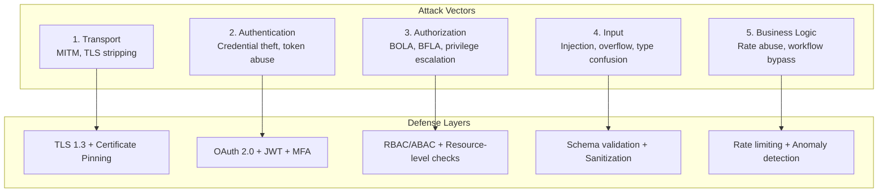
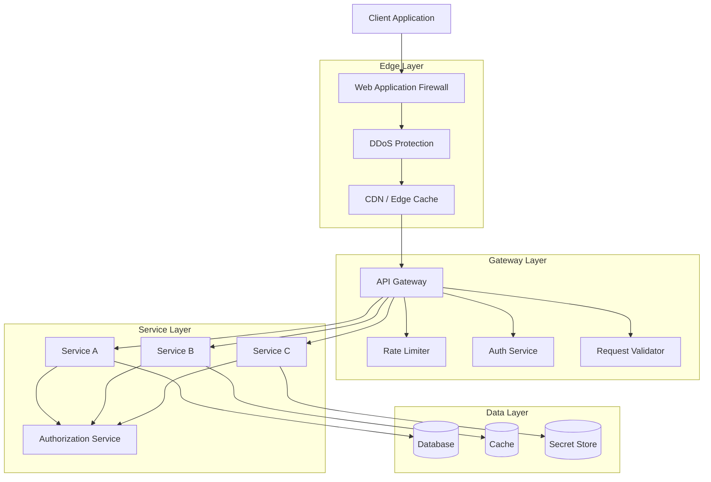

# API Security Overview

## Why It Exists

APIs are the nervous system of modern software. Every mobile app, single-page application, microservice, IoT device, and third-party integration communicates through APIs. This universal connectivity makes APIs the single most attractive attack surface. The OWASP API Security Top 10 (2023) exists because API-specific vulnerabilities differ fundamentally from traditional web application vulnerabilities — broken object-level authorization, mass assignment, and server-side request forgery represent attack classes that do not map to the classic OWASP Web Top 10.

The scale of the problem is staggering. Akamai reported in 2024 that API attacks accounted for 83% of web traffic. Salt Security found that 94% of organizations experienced an API security incident in the previous 12 months. APIs that were "internal only" get exposed through partner integrations, mobile apps, and cloud migrations — and internal APIs are almost always less hardened than public ones.

API security is not a feature you bolt on. It is a design discipline that must be embedded in every layer: transport, authentication, authorization, input validation, output encoding, rate limiting, logging, and monitoring.

## First Principles

### The API Attack Surface Model

Every API endpoint exposes five attack vectors:



### Defense in Depth for APIs

No single security control is sufficient. The defense-in-depth model layers controls so that a failure in one layer is caught by the next:

$$
P(\text{breach}) = \prod_{i=1}^{n} P(\text{bypass layer } i)
$$

If each of 5 layers has a 10% bypass probability:

$$
P(\text{breach}) = 0.1^5 = 0.00001 = 0.001\%
$$

Adding layers has multiplicative security benefit — but only if the layers are independent. Two validation checks that use the same library and fail to the same bug provide no independence.

### OWASP API Security Top 10 (2023)

| Rank | Vulnerability | Impact |
|------|--------------|--------|
| API1 | Broken Object-Level Authorization (BOLA) | Access other users' data |
| API2 | Broken Authentication | Account takeover |
| API3 | Broken Object Property-Level Authorization | Mass assignment, data leakage |
| API4 | Unrestricted Resource Consumption | DoS, cost explosion |
| API5 | Broken Function-Level Authorization (BFLA) | Privilege escalation |
| API6 | Unrestricted Access to Sensitive Business Flows | Bot abuse, scraping |
| API7 | Server-Side Request Forgery (SSRF) | Internal network access |
| API8 | Security Misconfiguration | Various |
| API9 | Improper Inventory Management | Shadow APIs, deprecated endpoints |
| API10 | Unsafe Consumption of APIs | Supply chain attacks |

## Core Mechanics

### API Security Architecture

A production API security architecture involves multiple components working in coordination:



### Authentication Patterns

| Pattern | Use Case | Strengths | Weaknesses |
|---------|----------|-----------|------------|
| API Keys | Server-to-server, simple integrations | Easy to implement | No user context, hard to rotate |
| OAuth 2.0 + JWT | User-facing APIs | Standard, delegated auth | Token size, revocation complexity |
| mTLS | Service mesh, high security | Strongest authentication | Certificate management overhead |
| HMAC Signing | Webhooks, request integrity | Tamper-proof | Shared secret management |

### Authorization Patterns

Authorization must happen at the resource level, not just the API level. The most common vulnerability (BOLA) occurs when an API checks "is the user authenticated?" but not "does this user own this resource?"

```typescript
// BAD: Only checks authentication
app.get('/api/orders/:id', authenticate, async (req, res) => {
  const order = await db.orders.findById(req.params.id);
  res.json(order); // Any authenticated user can access ANY order
});

// GOOD: Checks resource ownership
app.get('/api/orders/:id', authenticate, async (req, res) => {
  const order = await db.orders.findById(req.params.id);
  if (!order) return res.status(404).json({ error: 'Not found' });
  if (order.userId !== req.user.id) return res.status(403).json({ error: 'Forbidden' });
  res.json(order);
});
```

## Implementation

### Comprehensive API Security Middleware Stack

```typescript
// api-security-stack.ts - Production middleware composition
import { Router, Request, Response, NextFunction } from 'express';
import helmet from 'helmet';

interface SecurityConfig {
  rateLimit: {
    windowMs: number;
    maxRequests: number;
    keyGenerator: (req: Request) => string;
  };
  cors: {
    allowedOrigins: string[];
    allowedMethods: string[];
    maxAge: number;
  };
  validation: {
    maxBodySize: string;
    maxUrlLength: number;
    maxHeaderSize: number;
  };
  auth: {
    jwtSecret: string;
    tokenExpiry: string;
    refreshTokenExpiry: string;
  };
}

function createSecurityStack(config: SecurityConfig): Router {
  const router = Router();

  // Layer 1: Security headers
  router.use(helmet({
    contentSecurityPolicy: {
      directives: {
        defaultSrc: ["'self'"],
        scriptSrc: ["'self'"],
        styleSrc: ["'self'", "'unsafe-inline'"],
        imgSrc: ["'self'", 'data:', 'https:'],
        connectSrc: ["'self'"],
        fontSrc: ["'self'"],
        objectSrc: ["'none'"],
        mediaSrc: ["'self'"],
        frameSrc: ["'none'"],
      },
    },
    crossOriginEmbedderPolicy: true,
    crossOriginOpenerPolicy: true,
    crossOriginResourcePolicy: { policy: 'same-origin' },
    hsts: { maxAge: 31536000, includeSubDomains: true, preload: true },
    noSniff: true,
    referrerPolicy: { policy: 'strict-origin-when-cross-origin' },
  }));

  // Layer 2: Request size limits
  router.use((req: Request, res: Response, next: NextFunction) => {
    // Check URL length
    if (req.url.length > config.validation.maxUrlLength) {
      return res.status(414).json({ error: 'URI too long' });
    }

    // Check for suspicious patterns in URL
    const suspiciousPatterns = [
      /\.\.\//,           // Path traversal
      /%00/,              // Null byte
      /<script/i,         // XSS
      /union\s+select/i,  // SQL injection
    ];

    for (const pattern of suspiciousPatterns) {
      if (pattern.test(decodeURIComponent(req.url))) {
        return res.status(400).json({ error: 'Malformed request' });
      }
    }

    next();
  });

  // Layer 3: Request ID tracking
  router.use((req: Request, res: Response, next: NextFunction) => {
    const requestId = req.headers['x-request-id'] as string || crypto.randomUUID();
    res.setHeader('X-Request-ID', requestId);
    (req as any).requestId = requestId;
    next();
  });

  // Layer 4: Security event logging
  router.use((req: Request, res: Response, next: NextFunction) => {
    const startTime = Date.now();

    res.on('finish', () => {
      const duration = Date.now() - startTime;
      const logEntry = {
        timestamp: new Date().toISOString(),
        requestId: (req as any).requestId,
        method: req.method,
        path: req.path,
        status: res.statusCode,
        duration,
        ip: req.ip,
        userAgent: req.headers['user-agent'],
        userId: (req as any).user?.id,
      };

      // Log security-relevant events
      if (res.statusCode === 401 || res.statusCode === 403) {
        console.warn('Security event:', JSON.stringify(logEntry));
      }
    });

    next();
  });

  return router;
}
```

### API Versioning Security

API versioning introduces security concerns: deprecated versions may have known vulnerabilities but still receive traffic.

```typescript
// api-version-security.ts
interface APIVersion {
  version: string;
  status: 'active' | 'deprecated' | 'sunset';
  sunsetDate?: Date;
  securityPatchLevel: string;
  knownVulnerabilities: string[];
}

class APIVersionManager {
  private versions: Map<string, APIVersion> = new Map();

  register(version: APIVersion): void {
    this.versions.set(version.version, version);
  }

  middleware() {
    return (req: Request, res: Response, next: NextFunction) => {
      const requestedVersion = this.extractVersion(req);
      const version = this.versions.get(requestedVersion);

      if (!version) {
        return res.status(400).json({
          error: 'Unknown API version',
          supportedVersions: Array.from(this.versions.keys())
            .filter(v => this.versions.get(v)!.status === 'active'),
        });
      }

      if (version.status === 'sunset') {
        return res.status(410).json({
          error: 'API version has been sunset',
          message: `Version ${version.version} was sunset on ${version.sunsetDate?.toISOString()}`,
          migration: `Please upgrade to the latest active version`,
        });
      }

      if (version.status === 'deprecated') {
        res.setHeader('Deprecation', 'true');
        res.setHeader('Sunset', version.sunsetDate?.toHTTPDate() || '');
        res.setHeader('Link', '</api/v3>; rel="successor-version"');
      }

      if (version.knownVulnerabilities.length > 0) {
        // Log but don't block - give clients time to migrate
        console.warn(
          `Request to API ${version.version} with known vulnerabilities:`,
          version.knownVulnerabilities
        );
      }

      next();
    };
  }

  private extractVersion(req: Request): string {
    // Support URL path versioning: /api/v2/users
    const pathMatch = req.path.match(/\/api\/(v\d+)\//);
    if (pathMatch) return pathMatch[1];

    // Support header versioning: Accept: application/vnd.api.v2+json
    const accept = req.headers.accept || '';
    const headerMatch = accept.match(/vnd\.api\.(v\d+)/);
    if (headerMatch) return headerMatch[1];

    return 'v1'; // Default
  }
}
```

### Security Audit Logging

```typescript
// audit-logger.ts - Immutable security audit trail
interface AuditEvent {
  id: string;
  timestamp: Date;
  eventType: 'auth' | 'authz' | 'data_access' | 'config_change' | 'security_alert';
  severity: 'info' | 'warning' | 'critical';
  actor: {
    id: string;
    type: 'user' | 'service' | 'system';
    ip: string;
    userAgent?: string;
  };
  action: string;
  resource: {
    type: string;
    id: string;
    name?: string;
  };
  result: 'success' | 'failure' | 'error';
  details: Record<string, unknown>;
  requestId: string;
}

class SecurityAuditLogger {
  private buffer: AuditEvent[] = [];
  private readonly FLUSH_INTERVAL_MS = 5000;
  private readonly MAX_BUFFER_SIZE = 1000;

  constructor(private readonly sink: AuditSink) {
    setInterval(() => this.flush(), this.FLUSH_INTERVAL_MS);
  }

  log(event: Omit<AuditEvent, 'id' | 'timestamp'>): void {
    const fullEvent: AuditEvent = {
      ...event,
      id: crypto.randomUUID(),
      timestamp: new Date(),
    };

    this.buffer.push(fullEvent);

    // Flush immediately for critical events
    if (event.severity === 'critical') {
      this.flush();
    }

    // Flush if buffer is full
    if (this.buffer.length >= this.MAX_BUFFER_SIZE) {
      this.flush();
    }
  }

  private async flush(): Promise<void> {
    if (this.buffer.length === 0) return;

    const events = [...this.buffer];
    this.buffer = [];

    try {
      await this.sink.write(events);
    } catch (error) {
      // Re-add events to buffer on failure
      this.buffer.unshift(...events);
      console.error('Audit log flush failed:', error);
    }
  }
}

interface AuditSink {
  write(events: AuditEvent[]): Promise<void>;
}
```

## Edge Cases & Failure Modes

### BOLA (Broken Object-Level Authorization)

The most common and most dangerous API vulnerability. It occurs when the API uses user-supplied resource IDs without verifying the requesting user has access.

```typescript
// Vulnerable pattern - IDOR via sequential IDs
// GET /api/invoices/12345 -> returns invoice 12345 regardless of ownership

// Mitigation 1: Always verify ownership
async function getInvoice(req: Request, res: Response) {
  const invoice = await db.invoices.findOne({
    id: req.params.id,
    userId: req.user.id, // Always scope queries to the authenticated user
  });

  if (!invoice) {
    return res.status(404).json({ error: 'Not found' });
    // Note: return 404, not 403, to avoid confirming resource existence
  }

  return res.json(invoice);
}

// Mitigation 2: Use UUIDs instead of sequential IDs
// UUIDs are not guessable: /api/invoices/550e8400-e29b-41d4-a716-446655440000
```

### Mass Assignment

When an API binds request body directly to a database model, attackers can modify fields they should not access:

```typescript
// VULNERABLE: Direct assignment
app.put('/api/users/:id', async (req, res) => {
  await db.users.update(req.params.id, req.body);
  // Attacker sends: { "name": "hacker", "role": "admin", "verified": true }
});

// SAFE: Explicit allowlist
app.put('/api/users/:id', async (req, res) => {
  const allowedFields = ['name', 'email', 'avatar'];
  const updates: Record<string, unknown> = {};

  for (const field of allowedFields) {
    if (req.body[field] !== undefined) {
      updates[field] = req.body[field];
    }
  }

  await db.users.update(req.params.id, updates);
});
```

### Excessive Data Exposure

APIs that return full database objects leak sensitive fields:

```typescript
// VULNERABLE: Returns everything
app.get('/api/users/:id', async (req, res) => {
  const user = await db.users.findById(req.params.id);
  res.json(user);
  // Response includes: password_hash, ssn, internal_notes, etc.
});

// SAFE: Explicit response shape
interface PublicUserProfile {
  id: string;
  name: string;
  avatar: string;
  joinedAt: string;
}

app.get('/api/users/:id', async (req, res) => {
  const user = await db.users.findById(req.params.id);
  if (!user) return res.status(404).json({ error: 'Not found' });

  const publicProfile: PublicUserProfile = {
    id: user.id,
    name: user.name,
    avatar: user.avatarUrl,
    joinedAt: user.createdAt.toISOString(),
  };

  res.json(publicProfile);
});
```

::: info War Story
In 2018, a social media API returned full user objects including email addresses and phone numbers in the response. The endpoint was rate-limited to 100 requests per minute per API key, but an attacker created 10,000 API keys from disposable email addresses, enabling them to scrape 50M user profiles over a weekend. The fix required three changes: (1) response field filtering to exclude PII, (2) per-IP rate limiting in addition to per-key, and (3) anomaly detection for bulk data access patterns. The incident cost the company $5B in regulatory fines.
:::

## Performance Characteristics

### Security Overhead by Layer

| Security Layer | Latency Added | Throughput Impact | Memory |
|---------------|--------------|-------------------|--------|
| TLS 1.3 handshake | 1 RTT (~50ms) | -5% | 10 KB/conn |
| JWT validation | 0.1-0.5ms | Negligible | < 1 KB |
| Rate limiting (Redis) | 0.5-2ms | Negligible | 100 bytes/key |
| Input validation (Zod) | 0.1-1ms | Negligible | < 1 KB |
| CORS preflight | 0 (cached) | -1% (OPTIONS) | 0 |
| WAF rule evaluation | 1-5ms | -2-5% | 50 KB/rule |
| **Total** | **~55ms first, ~5ms subsequent** | **-10%** | - |

### Cost of Not Securing APIs

The average cost of an API-related data breach in 2024 was $4.88M (IBM). The cost of implementing comprehensive API security is typically 5-10% of development time. The ROI calculation is straightforward:

$$
\text{ROI} = \frac{\text{Expected breach cost} \times P(\text{breach without security}) - \text{Security implementation cost}}{\text{Security implementation cost}}
$$

## Mathematical Foundations

### Token Entropy Requirements

API keys and tokens must have sufficient entropy to prevent brute-force attacks:

$$
\text{Time to brute force} = \frac{2^{\text{entropy bits}}}{\text{guesses per second}}
$$

For a 256-bit token at 1 billion guesses/second:

$$
\text{Time} = \frac{2^{256}}{10^9} \approx 3.7 \times 10^{67} \text{ seconds} \approx 10^{60} \text{ years}
$$

Minimum recommended entropy: 128 bits (32 hex characters, 22 base64 characters).

### Rate Limiting Mathematics

The token bucket algorithm's steady-state behavior:

$$
\text{tokens}(t) = \min(B, \text{tokens}(t-1) + r \cdot \Delta t - c)
$$

Where $B$ is bucket capacity, $r$ is refill rate, and $c$ is consumed tokens. See the [Rate Limiting](./rate-limiting.md) page for deep coverage.

## Decision Framework

### API Security Checklist

| Category | Control | Priority | Effort |
|----------|---------|----------|--------|
| Transport | TLS 1.3, HSTS | Critical | Low |
| Authentication | OAuth 2.0 + PKCE | Critical | Medium |
| Authorization | Per-resource checks | Critical | High |
| Input | Schema validation | Critical | Medium |
| Rate Limiting | Token bucket + Redis | High | Medium |
| Logging | Immutable audit trail | High | Medium |
| Headers | CSP, CORS, security headers | High | Low |
| Versioning | Deprecation policy | Medium | Low |
| Testing | Security scanning in CI | High | Medium |
| Monitoring | Anomaly detection | Medium | High |

### Related Pages

- [Rate Limiting](./rate-limiting.md) — Token bucket, sliding window, Redis implementation
- [Request Signing](./request-signing.md) — HMAC, webhook verification, replay prevention
- [Input Validation](./input-validation.md) — Zod schemas, prototype pollution, ReDoS
- [CORS Deep Dive](./cors-deep-dive.md) — Same-origin policy, preflight, headers
- [CSP Headers](./csp-headers.md) — Content Security Policy directives
- [API Abuse Prevention](./api-abuse-prevention.md) — Bot detection, credential stuffing
- [Least Privilege](../zero-trust/least-privilege.md) — Access control models
- [Continuous Verification](../zero-trust/continuous-verification.md) — Risk-adaptive auth

## Advanced Topics

### API Gateway Security Patterns

Modern API gateways (Kong, Envoy, AWS API Gateway) centralize security concerns:

```typescript
// Gateway-level security configuration (Kong-style)
const gatewayConfig = {
  plugins: [
    {
      name: 'rate-limiting',
      config: {
        second: 10,
        minute: 100,
        hour: 1000,
        policy: 'redis',
        redis_host: 'redis.internal',
      },
    },
    {
      name: 'jwt',
      config: {
        claims_to_verify: ['exp', 'nbf'],
        key_claim_name: 'kid',
        maximum_expiration: 3600,
      },
    },
    {
      name: 'request-transformer',
      config: {
        remove: {
          headers: ['X-Internal-Only'],
          querystring: ['debug', 'verbose'],
        },
      },
    },
    {
      name: 'response-transformer',
      config: {
        remove: {
          headers: ['X-Powered-By', 'Server'],
        },
        add: {
          headers: [
            'X-Content-Type-Options: nosniff',
            'X-Frame-Options: DENY',
          ],
        },
      },
    },
    {
      name: 'bot-detection',
      config: {
        deny: ['Googlebot-Image', 'Baiduspider'],
        allow: ['Googlebot', 'Bingbot'],
      },
    },
  ],
};
```

### GraphQL-Specific Security

GraphQL introduces unique security challenges not present in REST APIs:

1. **Query depth attacks**: Deeply nested queries that cause exponential database joins
2. **Query complexity attacks**: Wide queries that return millions of records
3. **Introspection abuse**: Schema introspection reveals the entire API surface
4. **Batching attacks**: Multiple operations in a single request bypass rate limits

```typescript
// GraphQL security middleware
import { createComplexityLimitRule } from 'graphql-validation-complexity';

const securityRules = {
  // Limit query depth
  maxDepth: 10,

  // Limit query complexity
  complexityLimit: createComplexityLimitRule(1000, {
    scalarCost: 1,
    objectCost: 2,
    listFactor: 10,
  }),

  // Disable introspection in production
  disableIntrospection: process.env.NODE_ENV === 'production',

  // Limit batch size
  maxBatchSize: 5,

  // Query allowlisting (persisted queries)
  persistedQueriesOnly: process.env.NODE_ENV === 'production',
};
```

### API Security Testing Automation

```typescript
// api-security-test.ts - Automated security test suite
import { describe, it, expect } from 'vitest';

describe('API Security Tests', () => {
  describe('Authentication', () => {
    it('rejects requests without authentication', async () => {
      const res = await fetch('/api/users/me');
      expect(res.status).toBe(401);
    });

    it('rejects expired tokens', async () => {
      const expiredToken = createJWT({ exp: Math.floor(Date.now() / 1000) - 3600 });
      const res = await fetch('/api/users/me', {
        headers: { Authorization: `Bearer ${expiredToken}` },
      });
      expect(res.status).toBe(401);
    });

    it('rejects tokens with invalid signature', async () => {
      const tamperedToken = validToken.slice(0, -5) + 'XXXXX';
      const res = await fetch('/api/users/me', {
        headers: { Authorization: `Bearer ${tamperedToken}` },
      });
      expect(res.status).toBe(401);
    });
  });

  describe('Authorization (BOLA)', () => {
    it('prevents accessing other users resources', async () => {
      const user1Token = await loginAs('user1');
      const user2Resource = await createResourceAs('user2');

      const res = await fetch(`/api/resources/${user2Resource.id}`, {
        headers: { Authorization: `Bearer ${user1Token}` },
      });

      // Should return 404 (not 403) to avoid confirming existence
      expect(res.status).toBe(404);
    });
  });

  describe('Input Validation', () => {
    it('rejects SQL injection attempts', async () => {
      const res = await fetch('/api/users?search=\' OR 1=1 --', {
        headers: { Authorization: `Bearer ${validToken}` },
      });
      expect(res.status).toBe(400);
    });

    it('rejects oversized request bodies', async () => {
      const largeBody = 'x'.repeat(10_000_000);
      const res = await fetch('/api/data', {
        method: 'POST',
        body: largeBody,
        headers: {
          Authorization: `Bearer ${validToken}`,
          'Content-Type': 'text/plain',
        },
      });
      expect(res.status).toBe(413);
    });
  });

  describe('Rate Limiting', () => {
    it('enforces rate limits', async () => {
      const requests = Array.from({ length: 110 }, () =>
        fetch('/api/users', {
          headers: { Authorization: `Bearer ${validToken}` },
        })
      );

      const responses = await Promise.all(requests);
      const rateLimited = responses.filter(r => r.status === 429);
      expect(rateLimited.length).toBeGreaterThan(0);
    });
  });

  describe('Security Headers', () => {
    it('sets required security headers', async () => {
      const res = await fetch('/api/health');

      expect(res.headers.get('x-content-type-options')).toBe('nosniff');
      expect(res.headers.get('x-frame-options')).toBe('DENY');
      expect(res.headers.get('strict-transport-security')).toContain('max-age=');
      expect(res.headers.get('content-security-policy')).toBeTruthy();
      expect(res.headers.get('x-powered-by')).toBeNull();
    });
  });
});
```

::: info War Story
A B2B SaaS company had 2,000+ API endpoints accumulated over 7 years. During a security audit, they discovered that 340 endpoints had no authentication checks — they were "internal" endpoints that had been exposed when the monolith was split into microservices. 89 of those endpoints could read or modify customer data. The remediation required a company-wide sprint where every team audited every endpoint. They subsequently implemented an API gateway that required explicit authentication and authorization configuration for every route, with a default-deny policy. Endpoints without security configuration simply returned 403. This "secure by default" approach caught 12 more unprotected endpoints within the first month.
:::
