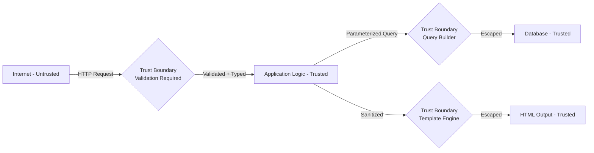
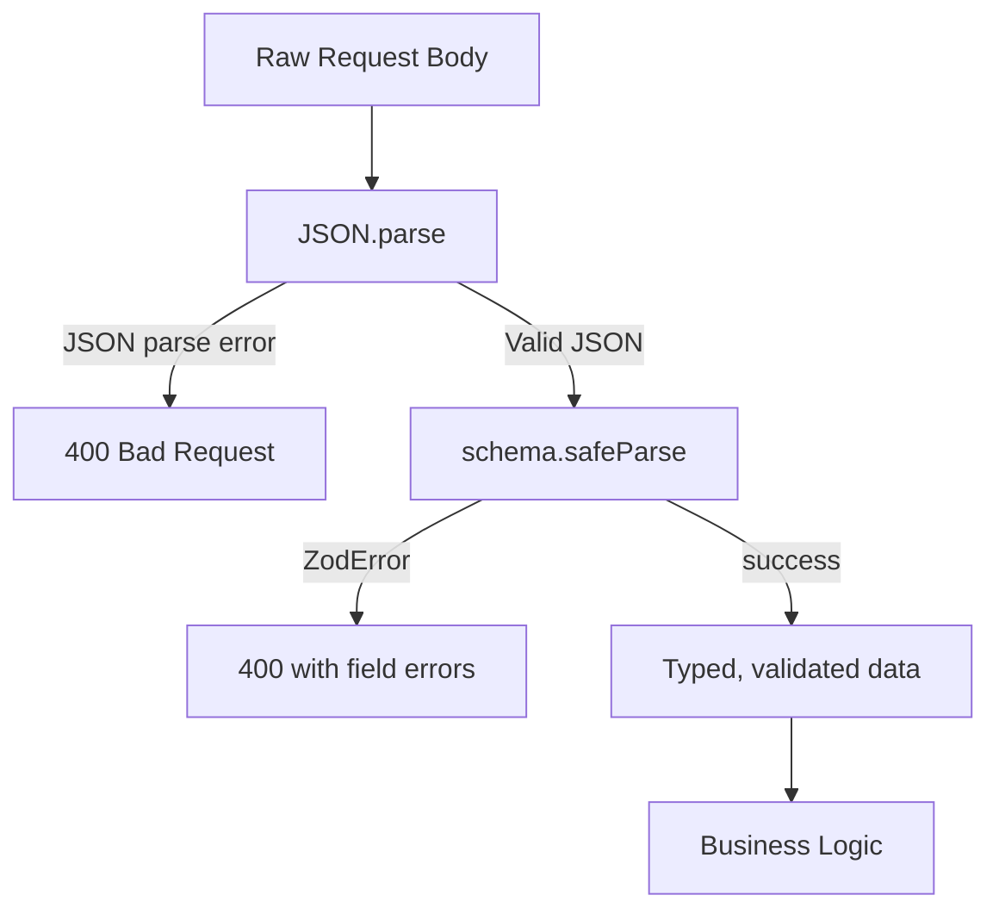

# Input Validation: Zod, Prototype Pollution, ReDoS, and SQL Injection

## Why Input Validation Exists

Every application vulnerability category traces back to one root cause: **treating untrusted input as trusted data**. SQL injection, XSS, command injection, path traversal, ReDoS — all of them exploit the gap between what the application expects and what an attacker sends.

Input validation is the security boundary between the untrusted world (the network) and the trusted world (your application logic). It is not a courtesy feature; it is a mandatory security control.

### Historical Cost of Poor Validation

- **Heartbleed (2014)**: Missing bounds check on a length field. Two bytes of unvalidated input exposed private keys from ~17% of the internet's HTTPS servers.
- **Log4Shell (2021)**: String interpolation in log messages with no validation. CVSS 10.0. Millions of servers compromised.
- **TalkTalk breach (2015)**: SQL injection. 157,000 customer records exposed. £400,000 fine. CEO resigned.

## First Principles

### Trust Boundaries

A trust boundary is any point where data crosses from a less-trusted to a more-trusted context. Every trust boundary crossing must be validated:



### The Three Dimensions of Validation

1. **Type validation**: Is the value the expected type? (string, number, UUID)
2. **Constraint validation**: Does the value satisfy constraints? (length, range, regex)
3. **Business rule validation**: Does the value make sense in context? (date in the future, referenced entity exists)

Security validation must happen at layers 1 and 2 before layer 3 is even attempted.

## Core Mechanics — Zod Schema Validation

Zod provides parse-time type safety with rich constraint composition. The fundamental model is: `unknown input → ZodError | typed output`. Never proceeds to application logic on parse failure.



## Implementation

### Production Zod Schemas

```typescript
import { z } from 'zod';
import { fromZodError } from 'zod-validation-error';

// ── Primitives with security constraints ──────────────────────────────────────

const UserId = z.string().uuid('Invalid user ID format');

const Email = z
  .string()
  .toLowerCase()
  .trim()
  .min(5)
  .max(254) // RFC 5321 maximum
  .email('Invalid email address')
  .refine(
    email => !email.includes('..'),
    'Email contains consecutive dots'
  );

const Password = z
  .string()
  .min(12, 'Password must be at least 12 characters')
  .max(128, 'Password exceeds maximum length')
  .refine(
    p => /[A-Z]/.test(p) && /[a-z]/.test(p) && /[0-9]/.test(p),
    'Password must contain uppercase, lowercase, and digit'
  );

// Prevent ReDoS: fixed set or simple character class, no complex backtracking
const Slug = z
  .string()
  .min(1)
  .max(100)
  .regex(/^[a-z0-9-]+$/, 'Slug must contain only lowercase letters, digits, and hyphens');

// Safe URL — prevents SSRF and javascript: URLs
const SafeUrl = z
  .string()
  .url()
  .refine(url => {
    try {
      const parsed = new URL(url);
      return ['https:', 'http:'].includes(parsed.protocol);
    } catch {
      return false;
    }
  }, 'Only http: and https: URLs are allowed')
  .refine(url => {
    const parsed = new URL(url);
    // Block private IP ranges (SSRF prevention)
    const hostname = parsed.hostname;
    const privatePatterns = [
      /^localhost$/i,
      /^127\./,
      /^10\./,
      /^172\.(1[6-9]|2\d|3[01])\./,
      /^192\.168\./,
      /^::1$/,
      /^fc00:/i,
      /^fe80:/i,
      /^0\.0\.0\.0$/,
      /^metadata\.google\.internal$/i,
      /^169\.254\./,  // AWS metadata
    ];
    return !privatePatterns.some(p => p.test(hostname));
  }, 'URL points to a private/internal address');

// ── Complex schemas ───────────────────────────────────────────────────────────

const PaginationSchema = z.object({
  page: z.coerce.number().int().min(1).max(10_000).default(1),
  limit: z.coerce.number().int().min(1).max(100).default(20),
  sort: z.enum(['asc', 'desc']).default('desc'),
  sortBy: z.enum(['createdAt', 'updatedAt', 'name']).default('createdAt'),
});

const CreateUserSchema = z.object({
  email: Email,
  password: Password,
  name: z
    .string()
    .min(1)
    .max(100)
    .trim()
    .regex(/^[\p{L}\p{M}\s'-]+$/u, 'Name contains invalid characters'),
  role: z.enum(['user', 'admin', 'moderator']).default('user'),
  metadata: z
    .record(z.string().max(100), z.string().max(500))
    .optional()
    .refine(
      m => !m || Object.keys(m).length <= 20,
      'Too many metadata fields'
    ),
});

const SearchSchema = z.object({
  query: z
    .string()
    .min(1)
    .max(200)
    .trim()
    // Strip potentially dangerous SQL-like characters for full-text search
    .transform(q => q.replace(/[;'"\\]/g, '')),
  filters: z
    .object({
      status: z.array(z.enum(['active', 'inactive', 'pending'])).optional(),
      createdAfter: z.coerce.date().optional(),
      createdBefore: z.coerce.date().optional(),
      tags: z.array(z.string().max(50)).max(10).optional(),
    })
    .optional(),
  ...PaginationSchema.shape,
});

type CreateUserInput = z.infer<typeof CreateUserSchema>;
type SearchInput = z.infer<typeof SearchSchema>;

// ── Validation middleware ─────────────────────────────────────────────────────

export function validateBody<T>(schema: z.ZodSchema<T>) {
  return (req: Request, res: Response, next: NextFunction) => {
    const result = schema.safeParse(req.body);
    if (!result.success) {
      const readable = fromZodError(result.error);
      return res.status(400).json({
        error: 'validation_failed',
        message: readable.message,
        details: result.error.errors.map(e => ({
          path: e.path.join('.'),
          message: e.message,
          code: e.code,
        })),
      });
    }
    (req as any).validatedBody = result.data;
    next();
  };
}

export function validateQuery<T>(schema: z.ZodSchema<T>) {
  return (req: Request, res: Response, next: NextFunction) => {
    const result = schema.safeParse(req.query);
    if (!result.success) {
      return res.status(400).json({
        error: 'query_validation_failed',
        details: result.error.errors,
      });
    }
    (req as any).validatedQuery = result.data;
    next();
  };
}
```

### Prototype Pollution Prevention

Prototype pollution occurs when attacker-controlled input assigns properties to `Object.prototype`, affecting all objects in the process. The canonical exploit vector:

```javascript
// If your app does: obj[key] = value
// An attacker sends: {"__proto__": {"admin": true}}
// Now every object has obj.admin === true
```

This enables privilege escalation, bypassing authorization checks, and in some cases, remote code execution (via template engines that render prototype properties).

```typescript
/**
 * Deep merge that prevents prototype pollution.
 * Never merge __proto__, constructor, or prototype keys.
 */
const UNSAFE_KEYS = new Set(['__proto__', 'constructor', 'prototype']);

export function safeMerge<T extends Record<string, unknown>>(
  target: T,
  source: unknown
): T {
  if (!source || typeof source !== 'object' || Array.isArray(source)) {
    return target;
  }

  for (const [key, value] of Object.entries(source as Record<string, unknown>)) {
    if (UNSAFE_KEYS.has(key)) {
      // Log this — it indicates an attack attempt
      console.warn(`Prototype pollution attempt detected: key="${key}"`);
      continue;
    }

    if (
      value !== null &&
      typeof value === 'object' &&
      !Array.isArray(value) &&
      key in target &&
      typeof (target as Record<string, unknown>)[key] === 'object'
    ) {
      safeMerge(
        (target as Record<string, unknown>)[key] as Record<string, unknown>,
        value
      );
    } else {
      (target as Record<string, unknown>)[key] = value;
    }
  }

  return target;
}

/**
 * Safe JSON parsing that prevents prototype pollution.
 * Uses JSON.parse reviver to block dangerous keys.
 */
export function safeJsonParse(json: string): unknown {
  return JSON.parse(json, (key, value) => {
    if (UNSAFE_KEYS.has(key)) {
      throw new SyntaxError(`Forbidden key in JSON: "${key}"`);
    }
    return value;
  });
}

/**
 * Deep-freeze the parsed object to prevent mutation after parsing.
 * Useful for configuration objects.
 */
export function deepFreeze<T>(obj: T): Readonly<T> {
  if (obj === null || typeof obj !== 'object') return obj;

  Object.getOwnPropertyNames(obj).forEach(name => {
    const value = (obj as Record<string, unknown>)[name];
    if (value && typeof value === 'object') {
      deepFreeze(value);
    }
  });

  return Object.freeze(obj);
}

/**
 * Create objects with null prototype to be immune to prototype pollution.
 */
export function createSafeObject(): Record<string, unknown> {
  return Object.create(null);
}

/**
 * Validate that an object has no prototype-polluting keys.
 * Throws if any are found.
 */
export function assertNoPrototypePollution(
  obj: unknown,
  path = ''
): void {
  if (!obj || typeof obj !== 'object') return;

  for (const key of Object.keys(obj as object)) {
    if (UNSAFE_KEYS.has(key)) {
      throw new Error(
        `Prototype pollution key detected at ${path || 'root'}: "${key}"`
      );
    }
    assertNoPrototypePollution(
      (obj as Record<string, unknown>)[key],
      path ? `${path}.${key}` : key
    );
  }
}

// Zod transformer that prevents prototype pollution at schema level
const SafeObjectSchema = z
  .record(z.string(), z.unknown())
  .transform(obj => {
    assertNoPrototypePollution(obj);
    return obj;
  });
```

### ReDoS (Regular Expression Denial of Service)

ReDoS exploits regex engines that use backtracking. A carefully crafted input causes the engine to explore exponential numbers of partial match states before determining there's no match.

```typescript
/**
 * Vulnerable regex patterns and their safe alternatives.
 */

// VULNERABLE: nested quantifiers with overlapping character classes
// Input "aaaaaaaaaaaaaaaaaaaaaaaaaaaaab" causes catastrophic backtracking
const VULNERABLE_EMAIL = /^([a-zA-Z0-9])+@[a-zA-Z0-9]+\.com$/; // Don't use

// SAFE: No overlapping alternatives, no nested quantifiers
const SAFE_EMAIL_BASIC = /^[a-zA-Z0-9._%+-]{1,64}@[a-zA-Z0-9.-]{1,255}\.[a-zA-Z]{2,}$/;

// VULNERABLE: (a+)+ pattern
const VULNERABLE_PATTERN = /(a+)+b/; // Catastrophic on "aaaaaaaaaaaaaaac"

// VULNERABLE: alternation with overlap
const VULNERABLE_ALT = /^(https?|http):/; // Actually fine, but this isn't:
const VULNERABLE_ALT2 = /^(.*)+$/; // Never use .*+

// Safe patterns for common use cases:
const SAFE_UUID = /^[0-9a-f]{8}-[0-9a-f]{4}-[0-9a-f]{4}-[0-9a-f]{4}-[0-9a-f]{12}$/i;
const SAFE_ISO_DATE = /^\d{4}-\d{2}-\d{2}(T\d{2}:\d{2}:\d{2}(\.\d+)?(Z|[+-]\d{2}:\d{2}))?$/;
const SAFE_SLUG = /^[a-z0-9-]{1,100}$/;
const SAFE_HEX = /^[0-9a-f]+$/i;
const SAFE_ALPHANUMERIC = /^[a-zA-Z0-9]+$/;

/**
 * Input length limiting as a ReDoS mitigation.
 * Even exponential backtracking is bounded if input length is bounded.
 */
export function safeRegexTest(
  pattern: RegExp,
  input: string,
  maxLength = 1000
): boolean {
  if (input.length > maxLength) {
    throw new Error(`Input too long for regex validation: ${input.length} > ${maxLength}`);
  }
  return pattern.test(input);
}

/**
 * Timeout-based regex execution using Web Workers or vm.runInNewContext.
 * For cases where you cannot control the regex (user-provided patterns).
 */
export async function safeRegexTestWithTimeout(
  pattern: string,
  flags: string,
  input: string,
  timeoutMs = 100
): Promise<boolean> {
  return new Promise((resolve, reject) => {
    const timer = setTimeout(() => {
      reject(new Error(`Regex evaluation timed out after ${timeoutMs}ms (possible ReDoS)`));
    }, timeoutMs);

    try {
      const result = new RegExp(pattern, flags).test(input);
      clearTimeout(timer);
      resolve(result);
    } catch (err) {
      clearTimeout(timer);
      reject(err);
    }
  });
}

/**
 * Static analysis: detect potentially vulnerable regex patterns.
 * Checks for common ReDoS patterns.
 */
export function analyzeRegexSafety(pattern: RegExp): {
  safe: boolean;
  warnings: string[];
} {
  const src = pattern.source;
  const warnings: string[] = [];

  // Nested quantifiers: (a+)+ or (a*)* or (a+)*
  if (/\([^)]*[+*]\)[+*]/.test(src)) {
    warnings.push('Nested quantifiers detected — potential catastrophic backtracking');
  }

  // Overlapping alternatives: (a|a)
  if (/\(([^)]+)\|(\1)\)/.test(src)) {
    warnings.push('Duplicate alternatives detected');
  }

  // .* with backreferences or anchors nearby can cause backtracking
  if (/\.\*\.\*/.test(src)) {
    warnings.push('Multiple greedy wildcards — consider using atomic groups or possessive quantifiers');
  }

  // (.*)+  is always catastrophic
  if (/\(\.?\*\)[+*]/.test(src) || /\(\.?[+*]\)[+*]/.test(src)) {
    warnings.push('CRITICAL: (.*) + or (.+)+ pattern — catastrophic backtracking guaranteed');
  }

  return { safe: warnings.length === 0, warnings };
}
```

### SQL Injection Prevention

SQL injection remains in OWASP Top 10 every year because it's easy to introduce and devastating to exploit. The defense is parameterized queries — never string concatenation.

```typescript
import { Pool, PoolClient } from 'pg';
import type { QueryResultRow } from 'pg';

/**
 * Type-safe query builder that enforces parameterized queries.
 * Raw SQL is only available via a clearly-marked escape hatch.
 */
export class SafeQueryBuilder {
  private readonly pool: Pool;

  constructor(pool: Pool) {
    this.pool = pool;
  }

  /**
   * Execute a parameterized query. Parameters are never interpolated into SQL.
   */
  async query<T extends QueryResultRow>(
    sql: string,
    params: readonly unknown[] = []
  ): Promise<T[]> {
    // Validate that the number of $N placeholders matches params array
    const placeholderCount = (sql.match(/\$\d+/g) ?? []).length;
    const uniquePlaceholders = new Set(sql.match(/\$\d+/g) ?? []).size;

    if (uniquePlaceholders !== params.length) {
      throw new Error(
        `SQL parameter count mismatch: ${uniquePlaceholders} placeholders, ${params.length} params`
      );
    }

    const result = await this.pool.query<T>(sql, [...params]);
    return result.rows;
  }

  /**
   * Safe dynamic ORDER BY — only allows explicitly whitelisted column names.
   */
  buildOrderBy(
    column: string,
    direction: 'asc' | 'desc',
    allowedColumns: readonly string[]
  ): string {
    if (!allowedColumns.includes(column)) {
      throw new Error(`Column "${column}" is not in the allowed list for ordering`);
    }
    // direction is already typed as 'asc' | 'desc', but double-check
    const dir = direction === 'desc' ? 'DESC' : 'ASC';
    return `ORDER BY "${column}" ${dir}`;
  }

  /**
   * Safe dynamic table selection — only allows whitelisted table names.
   * Quotes the identifier to prevent injection even with whitelisted names.
   */
  quoteIdentifier(name: string, allowedNames: readonly string[]): string {
    if (!allowedNames.includes(name)) {
      throw new Error(`Identifier "${name}" is not in the allowed list`);
    }
    // Escape double quotes within the identifier name
    return `"${name.replace(/"/g, '""')}"`;
  }

  /**
   * Build a safe IN clause with parameterized values.
   */
  buildInClause(
    column: string,
    values: readonly unknown[],
    startIndex: number,
    allowedColumns: readonly string[]
  ): { sql: string; params: unknown[] } {
    if (values.length === 0) {
      return { sql: 'FALSE', params: [] };
    }
    if (values.length > 1000) {
      throw new Error('IN clause with more than 1000 values may cause performance issues');
    }

    const quotedColumn = this.quoteIdentifier(column, allowedColumns);
    const placeholders = values
      .map((_, i) => `$${startIndex + i}`)
      .join(', ');

    return {
      sql: `${quotedColumn} IN (${placeholders})`,
      params: [...values],
    };
  }
}

// ── Practical usage example ───────────────────────────────────────────────────

interface UserSearchParams {
  email?: string;
  role?: string;
  active?: boolean;
  page: number;
  limit: number;
}

async function searchUsers(
  db: SafeQueryBuilder,
  params: UserSearchParams
): Promise<unknown[]> {
  const conditions: string[] = ['1=1'];
  const queryParams: unknown[] = [];
  let paramIndex = 1;

  if (params.email) {
    conditions.push(`u.email ILIKE $${paramIndex++}`);
    queryParams.push(`%${params.email.replace(/[%_\\]/g, '\\$&')}%`); // escape LIKE metacharacters
  }

  if (params.role) {
    // Whitelist roles to prevent injection via parameterized enum-like value
    const allowedRoles = ['user', 'admin', 'moderator'] as const;
    if (!allowedRoles.includes(params.role as any)) {
      throw new Error(`Invalid role: ${params.role}`);
    }
    conditions.push(`u.role = $${paramIndex++}`);
    queryParams.push(params.role);
  }

  if (params.active !== undefined) {
    conditions.push(`u.active = $${paramIndex++}`);
    queryParams.push(params.active);
  }

  const offset = (params.page - 1) * params.limit;
  queryParams.push(params.limit, offset);

  const sql = `
    SELECT u.id, u.email, u.name, u.role, u.created_at
    FROM users u
    WHERE ${conditions.join(' AND ')}
    ORDER BY u.created_at DESC
    LIMIT $${paramIndex++} OFFSET $${paramIndex}
  `;

  return db.query(sql, queryParams);
}

// ── ORM-level protection (Prisma example) ────────────────────────────────────

import { PrismaClient } from '@prisma/client';

const prisma = new PrismaClient();

async function safeUserSearch(email: string, role: string) {
  // Prisma automatically parameterizes all values
  return prisma.user.findMany({
    where: {
      email: { contains: email, mode: 'insensitive' },
      role: role as any, // Prisma will validate against the enum
    },
    select: {
      id: true,
      email: true,
      name: true,
      // Never select: passwordHash, sessionTokens, etc.
    },
  });
}

// ── Raw SQL escape hatch for complex queries ──────────────────────────────────

/**
 * When you must use raw SQL (complex aggregations, CTEs), use Prisma's
 * $queryRaw with Prisma.sql template literal, which enforces parameterization.
 */
async function complexUserStats(orgId: string) {
  const { Prisma } = await import('@prisma/client');

  // Prisma.sql uses tagged template literals — interpolated values are
  // automatically parameterized, NOT string-interpolated
  return prisma.$queryRaw(Prisma.sql`
    SELECT
      DATE_TRUNC('day', created_at) as day,
      COUNT(*) as user_count,
      COUNT(*) FILTER (WHERE role = 'admin') as admin_count
    FROM users
    WHERE org_id = ${orgId}
    GROUP BY 1
    ORDER BY 1 DESC
    LIMIT 30
  `);
}
```

### Second-Order SQL Injection

Second-order injection occurs when safely-stored data is later used unsafely in another query. Example: A username `admin'--` is safely inserted but later used in a query string concatenation.

```typescript
/**
 * Second-order injection prevention:
 * Always parameterize, even when using "trusted" data from the database.
 * Data from the DB is not inherently safe for query construction.
 */
async function updateUserRole(
  db: SafeQueryBuilder,
  userId: string,
  newRole: string
): Promise<void> {
  // VULNERABLE (second-order): userId comes from DB but is user-controlled
  // const sql = `UPDATE users SET role = '${newRole}' WHERE id = '${userId}'`;

  // SAFE: Always parameterize, regardless of data source
  const allowedRoles = ['user', 'admin', 'moderator'];
  if (!allowedRoles.includes(newRole)) {
    throw new Error(`Invalid role: ${newRole}`);
  }

  await db.query(
    `UPDATE users SET role = $1, updated_at = NOW() WHERE id = $2`,
    [newRole, userId]
  );
}
```

## Edge Cases and Failure Modes

### 1. Type Coercion Surprises

JavaScript's loose equality enables injection via type confusion:

```typescript
// Request body: {"userId": {"$ne": null}} (MongoDB injection)
// If validated only as "truthy", this passes

// Zod protection:
const UserIdParam = z.string().uuid(); // Rejects objects, arrays, etc.

// Additional protection for MongoDB:
const MongoSafeString = z
  .string()
  .refine(
    s => !s.startsWith('$'),
    'Value cannot start with $ (potential MongoDB injection)'
  );
```

### 2. Unicode Normalization Attacks

Different Unicode representations of the same character can bypass regex filters:

```typescript
// "ＡＤＭＩＮｉｓｔｒａｔｏｒ" and "administrator" are different bytes
// but normalize to the same string

const SafeUsername = z
  .string()
  .transform(s => s.normalize('NFKC')) // Normalize before validation
  .pipe(z.string().regex(/^[a-zA-Z0-9_-]{3,30}$/));
```

### 3. Zip Bomb / Nested Object Attack

Deeply nested JSON can cause stack overflows during parsing or validation:

```typescript
// {"a":{"a":{"a":{"a": ... 10,000 levels deep}}}}

const MAX_DEPTH = 10;

function checkDepth(obj: unknown, depth = 0): void {
  if (depth > MAX_DEPTH) {
    throw new Error(`Object nesting depth ${depth} exceeds maximum ${MAX_DEPTH}`);
  }
  if (obj && typeof obj === 'object') {
    for (const value of Object.values(obj as object)) {
      checkDepth(value, depth + 1);
    }
  }
}

// Apply before Zod parsing
export function parseWithDepthLimit(json: string): unknown {
  const parsed = JSON.parse(json); // Can throw for malformed JSON
  checkDepth(parsed);
  return parsed;
}
```

### 4. Billion Laughs (XML/YAML)

If your API accepts YAML, the billion laughs attack creates exponentially expanding anchors:

```typescript
import yaml from 'js-yaml';

// NEVER use yaml.load() — it executes code
// ALWAYS use yaml.safeLoad() or configure FAILSAFE_SCHEMA

export function parseYamlSafe(input: string): unknown {
  return yaml.load(input, {
    schema: yaml.FAILSAFE_SCHEMA, // Only strings, no JS objects or functions
    json: true,
  });
}
```

## Performance Characteristics

### Validation Overhead

| Operation | Throughput | Latency (p99) |
|-----------|-----------|--------------|
| Zod simple schema parse | 500,000/s | 0.01 ms |
| Zod complex nested schema | 50,000/s | 0.1 ms |
| Regex match (safe, 100 char input) | 10,000,000/s | 0.0001 ms |
| Regex match (vulnerable, attack input) | 1/s | 10,000 ms |
| SQL parameterization overhead | ~0% | <0.001 ms |

ReDoS can turn a validation call from microseconds to seconds. Input length limits are the cheapest mitigation.

## Mathematical Foundations

### SQL Injection Surface Area

Consider a query template with $k$ string concatenation points, each of which can accept $n$-character input. The total attack surface is:

$$|\text{AttackSurface}| = |\Sigma|^n \times k$$

Where $|\Sigma|$ is the character set size (~95 for printable ASCII). For $k=3$ concatenation points with $n=100$ characters each:

$$|\text{AttackSurface}| = 95^{100} \times 3 \approx 10^{197}$$

Parameterization reduces the SQL injection attack surface to exactly zero, regardless of $k$ and $n$.

### ReDoS Complexity

For the pattern `(a+)+`, the number of states the NFA explores for input `aaa...ac` of length $n$ is:

$$T(n) = \sum_{k=1}^{n} \binom{n}{k} = 2^n - 1$$

This is exponential in the input length. For $n=30$: $2^{30} \approx 10^9$ states — approximately 1 billion operations, taking several seconds. For $n=60$: effectively never completes.

## Real-World War Stories

::: info War Story: Prototype Pollution in a Config Merge Function

A Node.js API gateway used a home-rolled config merge utility to combine default configs with per-tenant overrides. A pentest discovered that sending `{"__proto__": {"isAdmin": true}}` as the tenant override resulted in `req.user.isAdmin === true` for all subsequent requests — without any authentication.

The root cause was `Object.assign(defaults, tenantConfig)` without key filtering. The fix was replacing the merge utility with a safe implementation that explicitly blocks `__proto__`, `constructor`, and `prototype` keys, plus switching to `Object.create(null)` for the merge target.

The vulnerability had been in production for 14 months. No evidence of exploitation was found in logs, but logs themselves only went back 90 days.
:::

::: info War Story: ReDoS in an Email Validation Route

A SaaS product's `/forgot-password` endpoint validated email format with the regex `^([a-z0-9+_-]+\.)*[a-z0-9+_-]+@([a-z0-9-]+\.)+[a-z]{2,}$`. A security researcher discovered that sending 40-character strings of the form `a.a.a.a.a.a.a.a.a.a.a@b` caused each request to consume 100% CPU for 30+ seconds. Five concurrent requests were enough to fully saturate the server.

The endpoint was public (no authentication required), making it trivially exploitable. The fix was two-part: (1) limit email input to 254 characters before regex validation, and (2) replace the vulnerable regex with a simple structural check followed by `zod.string().email()`.

Total downtime: 4 hours during peak traffic. Root cause analysis revealed the vulnerable regex had been copied from a Stack Overflow answer with 2,300 upvotes.
:::

## Decision Framework

### Validation Library Selection

| Library | Type Safety | Performance | Ecosystem | Use Case |
|---------|------------|-------------|-----------|---------|
| Zod | Excellent | Good | Excellent | TypeScript APIs |
| Joi | Good | Good | Excellent | Node.js, JS |
| Yup | Good | Good | Good | Form validation |
| Ajv (JSON Schema) | Medium | Excellent | Excellent | High throughput |
| Vest | Good | Good | Medium | Form UX |

Use Zod for TypeScript projects. Use Ajv when parsing millions of records (it generates JIT-compiled validation code).

### Defense in Depth Checklist

- [ ] Input type validation (Zod/Joi schemas) at every API endpoint
- [ ] Max length limits on all string fields
- [ ] Prototype pollution checks on all merged objects
- [ ] Regex audit — no nested quantifiers, max input length enforced
- [ ] All database queries use parameterization (zero string concatenation)
- [ ] All dynamic SQL identifiers (column names, table names) use whitelists
- [ ] YAML/XML parsers use safe schema (no code execution)
- [ ] File uploads validated for type, size, and content (magic bytes, not extension)
- [ ] JSON depth limits to prevent stack overflow

## Advanced Topics

### Abstract Syntax Tree (AST)-Based Validation

For complex user-provided expressions (search queries, filter formulas), parse them into an AST and validate the AST structure rather than sanitizing strings:

```typescript
interface FilterNode {
  type: 'and' | 'or' | 'not' | 'comparison';
  children?: FilterNode[];
  field?: string;
  operator?: 'eq' | 'ne' | 'gt' | 'lt' | 'gte' | 'lte' | 'contains';
  value?: string | number | boolean;
}

const ALLOWED_FIELDS = new Set(['status', 'createdAt', 'updatedAt', 'name']);

function validateFilterAST(node: FilterNode, depth = 0): void {
  if (depth > 5) throw new Error('Filter expression too deeply nested');

  if (node.type === 'comparison') {
    if (!node.field || !ALLOWED_FIELDS.has(node.field)) {
      throw new Error(`Unknown filter field: ${node.field}`);
    }
  } else {
    for (const child of node.children ?? []) {
      validateFilterAST(child, depth + 1);
    }
  }
}
```

### Content-Type Sniffing Prevention

Never trust the `Content-Type` header alone — validate that the body actually matches the claimed content type:

```typescript
import { fileTypeFromBuffer } from 'file-type';

export async function validateFileType(
  buffer: Buffer,
  allowedMimeTypes: string[]
): Promise<string> {
  const detected = await fileTypeFromBuffer(buffer);
  if (!detected) {
    throw new Error('Could not determine file type from content');
  }
  if (!allowedMimeTypes.includes(detected.mime)) {
    throw new Error(
      `File type "${detected.mime}" not allowed. Allowed: ${allowedMimeTypes.join(', ')}`
    );
  }
  return detected.mime;
}
```

::: tip
Magic byte validation is mandatory for any file upload feature. MIME type from headers is attacker-controlled and meaningless for security decisions.
:::
