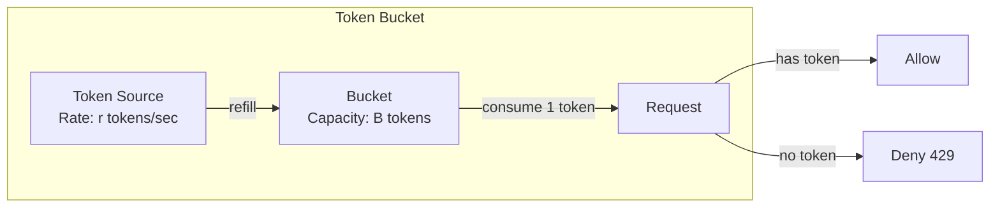
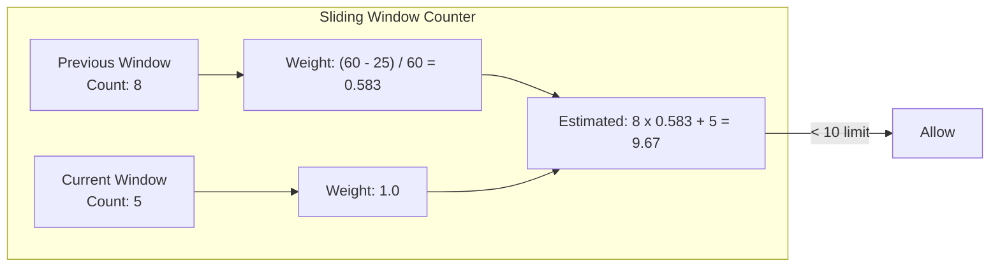

# API Rate Limiting

## Why It Exists

Rate limiting is the gatekeeper that prevents any single client from consuming disproportionate resources. Without it, a single malicious (or buggy) client can exhaust server capacity, degrade service for all users, and run up infrastructure costs. The 2016 Dyn DNS attack demonstrated what happens when rate limiting is absent at the infrastructure level — a botnet sending 1.2 Tbps of traffic brought down Twitter, GitHub, Netflix, and dozens of other services simultaneously.

Rate limiting also serves a business function. API providers like Stripe, GitHub, and Google Cloud enforce rate limits to ensure fair usage, monetize API tiers, and prevent abuse of free tiers. Without rate limits, credential stuffing attacks can test millions of stolen passwords per hour, web scrapers can clone entire databases, and automated bots can buy out inventory before humans see it.

The challenge is implementing rate limiting that is accurate, fast, distributed, and fair. A naive per-server counter fails in a horizontally scaled environment. A centralized counter becomes a bottleneck. The algorithms and architectures in this page solve these problems.

## First Principles

### The Rate Limiting Problem

Rate limiting answers: "Should this request be allowed, given the client's recent request history?"

Formally, for a client $c$ with a limit of $L$ requests per window $W$:

$$
\text{allow}(c, t) = \begin{cases}
\text{true} & \text{if } |\{r \in R_c : t - W < r.t \leq t\}| < L \\
\text{false} & \text{otherwise}
\end{cases}
$$

Where $R_c$ is the set of requests from client $c$ and $r.t$ is the timestamp of request $r$.

The challenge is computing this efficiently without storing every request timestamp.

### Dimensions of Rate Limiting

| Dimension | Examples | Purpose |
|-----------|---------|---------|
| **By identity** | API key, user ID, IP address | Prevent individual abuse |
| **By resource** | Per endpoint, per method | Protect expensive operations |
| **By time** | Per second, per minute, per day | Different burst vs. sustained limits |
| **By cost** | Request weight/complexity | Expensive queries cost more quota |

## Core Mechanics

### Algorithm 1: Token Bucket

The token bucket is the most widely used rate limiting algorithm. It allows bursts up to the bucket capacity while maintaining a steady average rate.



**Parameters**:
- $B$: Bucket capacity (maximum burst size)
- $r$: Refill rate (tokens per second)

**State**: Current token count and last refill timestamp.

**Behavior**:
- Tokens are added at rate $r$, up to maximum $B$
- Each request consumes 1 token (or more for weighted requests)
- If no tokens available, request is rejected

$$
\text{tokens}(t) = \min\left(B, \text{tokens}(t_{\text{last}}) + r \cdot (t - t_{\text{last}})\right)
$$

**Steady state**: Average throughput converges to $r$ requests/second. Maximum burst: $B$ requests.

### Algorithm 2: Sliding Window Log

The sliding window log stores the timestamp of every request and counts requests within the window. It is the most accurate algorithm but has the highest memory cost.

```mermaid
graph TD
    subgraph "Sliding Window Log"
        direction LR
        T1[req@t1] --> T2[req@t2] --> T3[req@t3] --> T4[req@t4]

        WINDOW[Window: t-W to t]
        COUNT["Count requests in window"]
    end

    COUNT -->|count < limit| ALLOW[Allow]
    COUNT -->|count >= limit| DENY[Deny]
```

**Memory cost**: $O(L)$ per client, where $L$ is the rate limit. For 1000 req/min limit across 100K clients, that is 100M timestamps.

### Algorithm 3: Sliding Window Counter

A hybrid that approximates the sliding window using two fixed counters — cheaper than the log, more accurate than the fixed window.

$$
\text{count} = \text{prev\_window\_count} \times \frac{W - (t \mod W)}{W} + \text{current\_window\_count}
$$

This weighted average smooths the boundary between fixed windows, preventing the "double burst" problem.



### Algorithm 4: Leaky Bucket

The leaky bucket processes requests at a fixed rate, queueing excess requests. Unlike token bucket which allows bursts, leaky bucket enforces a smooth output rate.

$$
\text{queue\_length}(t) = \text{queue\_length}(t_{\text{last}}) + \text{arrivals} - r \cdot (t - t_{\text{last}})
$$

If queue length exceeds capacity $Q$, new requests are dropped.

### Algorithm Comparison

| Algorithm | Accuracy | Memory | Burst | Distributed | Complexity |
|-----------|----------|--------|-------|-------------|------------|
| Fixed Window | Low | $O(1)$ | Double burst at boundary | Easy | Simple |
| Sliding Window Log | Exact | $O(L)$ | No | Moderate | Moderate |
| Sliding Window Counter | High | $O(1)$ | Minimal | Easy | Simple |
| Token Bucket | High | $O(1)$ | Controlled burst | Easy | Simple |
| Leaky Bucket | High | $O(Q)$ | Smooth output | Moderate | Moderate |

## Implementation

### Token Bucket with Redis (Production)

```typescript
// token-bucket-redis.ts - Distributed token bucket using Redis + Lua
import { Redis } from 'ioredis';

interface RateLimitConfig {
  keyPrefix: string;
  bucketCapacity: number;  // Max tokens (burst size)
  refillRate: number;       // Tokens per second
  costPerRequest: number;   // Tokens consumed per request (default 1)
}

interface RateLimitResult {
  allowed: boolean;
  remaining: number;
  retryAfter: number | null; // Seconds until a token is available
  limit: number;
  resetAt: Date;
}

// Lua script for atomic token bucket operation
// This MUST be atomic to prevent race conditions in distributed environments
const TOKEN_BUCKET_LUA = `
local key = KEYS[1]
local capacity = tonumber(ARGV[1])
local refill_rate = tonumber(ARGV[2])
local now = tonumber(ARGV[3])
local cost = tonumber(ARGV[4])
local ttl = tonumber(ARGV[5])

-- Get current state
local data = redis.call('HMGET', key, 'tokens', 'last_refill')
local tokens = tonumber(data[1])
local last_refill = tonumber(data[2])

-- Initialize if new
if tokens == nil then
  tokens = capacity
  last_refill = now
end

-- Calculate tokens to add based on elapsed time
local elapsed = math.max(0, now - last_refill)
local new_tokens = elapsed * refill_rate
tokens = math.min(capacity, tokens + new_tokens)

-- Try to consume tokens
local allowed = 0
local retry_after = 0

if tokens >= cost then
  tokens = tokens - cost
  allowed = 1
else
  -- Calculate when enough tokens will be available
  local deficit = cost - tokens
  retry_after = math.ceil(deficit / refill_rate)
end

-- Update state
redis.call('HMSET', key, 'tokens', tokens, 'last_refill', now)
redis.call('EXPIRE', key, ttl)

-- Return: allowed, remaining tokens, retry_after
return {allowed, math.floor(tokens), retry_after}
`;

class TokenBucketRateLimiter {
  private redis: Redis;
  private config: RateLimitConfig;
  private scriptSha: string | null = null;

  constructor(redis: Redis, config: RateLimitConfig) {
    this.redis = redis;
    this.config = config;
  }

  private async loadScript(): Promise<string> {
    if (!this.scriptSha) {
      this.scriptSha = await this.redis.script('LOAD', TOKEN_BUCKET_LUA) as string;
    }
    return this.scriptSha;
  }

  async check(identifier: string, cost?: number): Promise<RateLimitResult> {
    const key = `${this.config.keyPrefix}:${identifier}`;
    const now = Date.now() / 1000; // Redis works in seconds
    const requestCost = cost || this.config.costPerRequest || 1;
    const ttl = Math.ceil(this.config.bucketCapacity / this.config.refillRate) * 2;

    try {
      const sha = await this.loadScript();
      const result = await this.redis.evalsha(
        sha,
        1,
        key,
        this.config.bucketCapacity,
        this.config.refillRate,
        now,
        requestCost,
        ttl
      ) as [number, number, number];

      const [allowed, remaining, retryAfter] = result;

      return {
        allowed: allowed === 1,
        remaining,
        retryAfter: allowed === 1 ? null : retryAfter,
        limit: this.config.bucketCapacity,
        resetAt: new Date((now + this.config.bucketCapacity / this.config.refillRate) * 1000),
      };
    } catch (error) {
      // If Lua script was evicted, reload it
      if ((error as Error).message?.includes('NOSCRIPT')) {
        this.scriptSha = null;
        return this.check(identifier, cost);
      }
      throw error;
    }
  }
}
```

### Sliding Window Counter with Redis

```typescript
// sliding-window-redis.ts - Sliding window counter implementation
const SLIDING_WINDOW_LUA = `
local key = KEYS[1]
local window = tonumber(ARGV[1])
local limit = tonumber(ARGV[2])
local now = tonumber(ARGV[3])

-- Current and previous window keys
local current_window = math.floor(now / window)
local previous_window = current_window - 1
local current_key = key .. ':' .. current_window
local previous_key = key .. ':' .. previous_window

-- Get counts
local current_count = tonumber(redis.call('GET', current_key) or '0')
local previous_count = tonumber(redis.call('GET', previous_key) or '0')

-- Calculate weighted count
local elapsed_in_window = now - (current_window * window)
local previous_weight = 1 - (elapsed_in_window / window)
local estimated_count = math.floor(previous_count * previous_weight) + current_count

if estimated_count >= limit then
  -- Calculate retry-after
  local retry_after = window - elapsed_in_window
  return {0, limit - estimated_count, retry_after}
end

-- Increment current window
redis.call('INCR', current_key)
redis.call('EXPIRE', current_key, window * 2)

return {1, limit - estimated_count - 1, 0}
`;

class SlidingWindowRateLimiter {
  private redis: Redis;
  private scriptSha: string | null = null;

  constructor(
    redis: Redis,
    private readonly windowMs: number,
    private readonly limit: number,
    private readonly keyPrefix: string = 'rl:sw'
  ) {
    this.redis = redis;
  }

  private async loadScript(): Promise<string> {
    if (!this.scriptSha) {
      this.scriptSha = await this.redis.script('LOAD', SLIDING_WINDOW_LUA) as string;
    }
    return this.scriptSha;
  }

  async check(identifier: string): Promise<RateLimitResult> {
    const key = `${this.keyPrefix}:${identifier}`;
    const now = Date.now() / 1000;
    const windowSec = this.windowMs / 1000;

    try {
      const sha = await this.loadScript();
      const result = await this.redis.evalsha(
        sha, 1, key, windowSec, this.limit, now
      ) as [number, number, number];

      const [allowed, remaining, retryAfter] = result;

      return {
        allowed: allowed === 1,
        remaining: Math.max(0, remaining),
        retryAfter: allowed === 1 ? null : Math.ceil(retryAfter),
        limit: this.limit,
        resetAt: new Date(
          (Math.floor(now / windowSec) * windowSec + windowSec) * 1000
        ),
      };
    } catch (error) {
      if ((error as Error).message?.includes('NOSCRIPT')) {
        this.scriptSha = null;
        return this.check(identifier);
      }
      throw error;
    }
  }
}
```

### Multi-Tier Rate Limiting

Production systems need multiple rate limit tiers — per-second for burst protection, per-minute for sustained rate, per-day for quota management:

```typescript
// multi-tier-rate-limiter.ts
interface RateLimitTier {
  name: string;
  windowMs: number;
  limit: number;
  limiter: TokenBucketRateLimiter | SlidingWindowRateLimiter;
}

class MultiTierRateLimiter {
  private tiers: RateLimitTier[];

  constructor(redis: Redis, tiers: Array<{ name: string; windowMs: number; limit: number }>) {
    this.tiers = tiers.map(tier => ({
      ...tier,
      limiter: new SlidingWindowRateLimiter(
        redis,
        tier.windowMs,
        tier.limit,
        `rl:${tier.name}`
      ),
    }));
  }

  async check(identifier: string): Promise<MultiTierResult> {
    const results: Array<{ tier: string; result: RateLimitResult }> = [];

    // Check all tiers (do NOT short-circuit — we need all results for headers)
    for (const tier of this.tiers) {
      const result = await tier.limiter.check(identifier);
      results.push({ tier: tier.name, result });
    }

    // Request is allowed only if ALL tiers allow it
    const denied = results.find(r => !r.result.allowed);

    return {
      allowed: !denied,
      deniedBy: denied?.tier || null,
      tiers: results.map(r => ({
        tier: r.tier,
        remaining: r.result.remaining,
        limit: r.result.limit,
        retryAfter: r.result.retryAfter,
      })),
      retryAfter: denied?.result.retryAfter || null,
    };
  }
}

interface MultiTierResult {
  allowed: boolean;
  deniedBy: string | null;
  tiers: Array<{
    tier: string;
    remaining: number;
    limit: number;
    retryAfter: number | null;
  }>;
  retryAfter: number | null;
}

// Usage
const rateLimiter = new MultiTierRateLimiter(redis, [
  { name: 'burst',   windowMs: 1_000,      limit: 10 },      // 10/sec
  { name: 'steady',  windowMs: 60_000,      limit: 100 },     // 100/min
  { name: 'daily',   windowMs: 86_400_000,  limit: 10_000 },  // 10K/day
]);
```

### Express Middleware

```typescript
// rate-limit-middleware.ts
import { Request, Response, NextFunction } from 'express';

interface RateLimitMiddlewareConfig {
  keyGenerator: (req: Request) => string;
  onRateLimited?: (req: Request, res: Response) => void;
  skipFailedRequests?: boolean;
  skipSuccessfulRequests?: boolean;
  requestCost?: (req: Request) => number;
}

function rateLimitMiddleware(
  limiter: TokenBucketRateLimiter | MultiTierRateLimiter,
  config: RateLimitMiddlewareConfig
) {
  return async (req: Request, res: Response, next: NextFunction) => {
    const key = config.keyGenerator(req);
    const cost = config.requestCost?.(req) || 1;

    try {
      let result: RateLimitResult | MultiTierResult;

      if (limiter instanceof TokenBucketRateLimiter) {
        result = await limiter.check(key, cost);
      } else {
        result = await (limiter as MultiTierRateLimiter).check(key);
      }

      // Set rate limit headers (RFC 7231 + draft-ietf-httpapi-ratelimit-headers)
      if ('remaining' in result) {
        res.setHeader('RateLimit-Limit', (result as RateLimitResult).limit);
        res.setHeader('RateLimit-Remaining', (result as RateLimitResult).remaining);
        res.setHeader('RateLimit-Reset',
          Math.ceil(((result as RateLimitResult).resetAt.getTime() - Date.now()) / 1000)
        );
      } else if ('tiers' in result) {
        // For multi-tier, report the most restrictive tier
        const mostRestrictive = (result as MultiTierResult).tiers
          .reduce((min, t) => (t.remaining < min.remaining ? t : min));
        res.setHeader('RateLimit-Limit', mostRestrictive.limit);
        res.setHeader('RateLimit-Remaining', mostRestrictive.remaining);
      }

      if (!result.allowed) {
        if (result.retryAfter) {
          res.setHeader('Retry-After', result.retryAfter);
        }

        if (config.onRateLimited) {
          config.onRateLimited(req, res);
          return;
        }

        return res.status(429).json({
          error: 'Too Many Requests',
          retryAfter: result.retryAfter,
          message: 'Rate limit exceeded. Please slow down.',
        });
      }

      next();
    } catch (error) {
      // Fail open or closed? This is a critical decision.
      // Fail open: allow the request (risks abuse during Redis outages)
      // Fail closed: deny the request (risks false denials during Redis outages)
      console.error('Rate limiter error:', error);

      // Default: fail open with logging
      next();
    }
  };
}

// Key generators for different strategies
const keyGenerators = {
  // By IP address
  byIP: (req: Request) => `ip:${req.ip}`,

  // By authenticated user
  byUser: (req: Request) => `user:${(req as any).user?.id || 'anonymous'}`,

  // By API key
  byApiKey: (req: Request) =>
    `key:${req.headers['x-api-key'] || req.query.api_key || 'none'}`,

  // By IP + endpoint (prevents targeted endpoint abuse)
  byIPAndEndpoint: (req: Request) =>
    `${req.ip}:${req.method}:${req.route?.path || req.path}`,

  // Composite: user for authenticated, IP for anonymous
  composite: (req: Request) => {
    const userId = (req as any).user?.id;
    return userId ? `user:${userId}` : `ip:${req.ip}`;
  },
};

// Cost calculator for weighted rate limiting
const costCalculators = {
  // Expensive endpoints cost more
  byEndpoint: (req: Request): number => {
    const costs: Record<string, number> = {
      '/api/search': 5,
      '/api/export': 20,
      '/api/bulk-import': 50,
      '/api/reports/generate': 10,
    };
    return costs[req.path] || 1;
  },

  // By response size estimate
  byMethod: (req: Request): number => {
    const costs: Record<string, number> = {
      GET: 1,
      POST: 2,
      PUT: 2,
      DELETE: 3,
    };
    return costs[req.method] || 1;
  },
};
```

### Distributed Rate Limiting Without Redis

For environments where Redis is not available, a local rate limiter with gossip protocol can approximate distributed behavior:

```typescript
// local-rate-limiter.ts - In-memory token bucket with periodic sync
class LocalRateLimiter {
  private buckets: Map<string, { tokens: number; lastRefill: number }> = new Map();
  private readonly capacity: number;
  private readonly refillRate: number;

  // Periodic cleanup of expired entries
  private cleanupInterval: ReturnType<typeof setInterval>;

  constructor(capacity: number, refillRate: number) {
    this.capacity = capacity;
    this.refillRate = refillRate;

    // Clean up stale entries every 60 seconds
    this.cleanupInterval = setInterval(() => this.cleanup(), 60_000);
  }

  check(key: string, cost: number = 1): RateLimitResult {
    const now = Date.now() / 1000;
    let bucket = this.buckets.get(key);

    if (!bucket) {
      bucket = { tokens: this.capacity, lastRefill: now };
      this.buckets.set(key, bucket);
    }

    // Refill
    const elapsed = now - bucket.lastRefill;
    bucket.tokens = Math.min(this.capacity, bucket.tokens + elapsed * this.refillRate);
    bucket.lastRefill = now;

    if (bucket.tokens >= cost) {
      bucket.tokens -= cost;
      return {
        allowed: true,
        remaining: Math.floor(bucket.tokens),
        retryAfter: null,
        limit: this.capacity,
        resetAt: new Date((now + (this.capacity - bucket.tokens) / this.refillRate) * 1000),
      };
    }

    const retryAfter = (cost - bucket.tokens) / this.refillRate;
    return {
      allowed: false,
      remaining: 0,
      retryAfter: Math.ceil(retryAfter),
      limit: this.capacity,
      resetAt: new Date((now + retryAfter) * 1000),
    };
  }

  private cleanup(): void {
    const now = Date.now() / 1000;
    const maxIdleSeconds = this.capacity / this.refillRate * 2;

    for (const [key, bucket] of this.buckets) {
      if (now - bucket.lastRefill > maxIdleSeconds) {
        this.buckets.delete(key);
      }
    }
  }

  destroy(): void {
    clearInterval(this.cleanupInterval);
  }
}
```

## Edge Cases & Failure Modes

### The Thundering Herd Problem

When rate limits reset at fixed intervals (e.g., top of the minute), all throttled clients retry simultaneously, creating a traffic spike:

$$
\text{Spike at reset} = \text{throttled\_clients} \times \text{avg\_retry\_rate}
$$

**Solution**: Add jitter to retry-after times:

```typescript
const retryAfter = baseRetryAfter + Math.random() * jitterWindowSeconds;
```

### Clock Skew in Distributed Environments

When multiple rate limiter instances use local clocks, skew can cause inconsistent decisions. Client $C$ hits server $A$ (clock: 12:00:00) which allows the request, then hits server $B$ (clock: 11:59:58) which allows it again because from $B$'s perspective, $C$ is in the previous window.

**Solution**: Use Redis `TIME` command or a centralized time source. With Redis-based rate limiting, all time calculations happen server-side in the Lua script using Redis's monotonic clock.

### Redis Failure Modes

| Failure | Impact | Mitigation |
|---------|--------|------------|
| Redis down | All rate limiting stops | Local fallback limiter |
| Redis latency spike | Request latency increases | Timeout + fail open |
| Redis cluster split | Inconsistent counts | Accept inaccuracy during partition |
| Redis memory full | Eviction of rate limit keys | Monitor memory, set appropriate maxmemory |
| Lua script evicted | NOSCRIPT error | Auto-reload script (shown in implementation) |

::: danger Redis Cluster and Rate Limiting
In a Redis Cluster, keys are distributed across shards based on hash slots. If rate limit keys for the same client land on different shards (e.g., `rl:user:123:burst` on shard 1 and `rl:user:123:daily` on shard 2), Lua scripts cannot operate atomically across them. **Solution**: Use hash tags `{user:123}` in keys to ensure all keys for a client land on the same shard: `rl:{user:123}:burst`, `rl:{user:123}:daily`.
:::

### Rate Limit Bypass Techniques

Attackers attempt to bypass rate limits through:

1. **IP rotation**: Using botnets or proxy pools to distribute requests across IPs
2. **Account creation**: Creating new accounts to get fresh quotas
3. **Header manipulation**: Spoofing `X-Forwarded-For` to appear as different IPs
4. **Slow and low**: Staying just under the rate limit threshold

```typescript
// Mitigations for bypass attempts

// 1. Don't trust X-Forwarded-For blindly
function getClientIP(req: Request): string {
  // Only trust XFF from known reverse proxies
  const trustedProxies = new Set(['10.0.0.1', '10.0.0.2']);

  if (trustedProxies.has(req.socket.remoteAddress || '')) {
    const xff = req.headers['x-forwarded-for'];
    if (xff) {
      // Take the first IP (client IP) only if proxy is trusted
      return (typeof xff === 'string' ? xff : xff[0]).split(',')[0].trim();
    }
  }

  return req.socket.remoteAddress || '0.0.0.0';
}

// 2. Rate limit account creation itself
const accountCreationLimiter = new TokenBucketRateLimiter(redis, {
  keyPrefix: 'rl:signup',
  bucketCapacity: 3,     // Max 3 signups
  refillRate: 1 / 3600,  // 1 per hour
  costPerRequest: 1,
});

// 3. Fingerprint-based rate limiting (beyond IP)
function generateFingerprint(req: Request): string {
  const components = [
    req.headers['user-agent'] || '',
    req.headers['accept-language'] || '',
    req.headers['accept-encoding'] || '',
    // TLS fingerprint (JA3) if available
    (req.socket as any).ja3 || '',
  ];

  return createHash('sha256').update(components.join('|')).digest('hex').slice(0, 16);
}
```

## Performance Characteristics

### Algorithm Benchmarks

| Algorithm | Operations/sec (single Redis) | Memory per client | Accuracy |
|-----------|------------------------------|-------------------|----------|
| Token Bucket (Lua) | 150,000 | 64 bytes | High |
| Sliding Window Counter | 180,000 | 128 bytes | High |
| Sliding Window Log | 50,000 | 8 bytes * limit | Exact |
| Fixed Window | 200,000 | 64 bytes | Low at boundaries |

### Redis Performance Considerations

Single Redis instance throughput for rate limiting:

$$
\text{Max QPS} \approx \frac{100{,}000}{\text{Lua script commands}} \approx 150{,}000 \text{ for token bucket}
$$

For higher throughput:
- Redis Cluster: Linear scaling with shards
- Local cache with async sync: ~1M+ QPS with ~5s accuracy window
- Pipeline batching: 3-5x throughput improvement for batch checks

### Network Overhead

Each rate limit check requires a Redis round-trip:
- Same datacenter: 0.1-0.5ms
- Cross-AZ: 1-2ms
- Cross-region: 10-50ms (do not do this)

::: info War Story
An e-commerce platform implemented rate limiting with a single Redis instance for their API gateway handling 50K requests/second. During Black Friday, the rate limiter became the bottleneck — Redis was processing 50K Lua script evaluations per second, each taking 0.02ms, but network round-trips added 0.5ms per check, consuming 25 seconds of wall-clock time per second across all workers. The fix was a two-layer approach: a local in-memory rate limiter that allowed 90% of "clearly under limit" requests through immediately, with Redis only consulted for the remaining 10% of borderline cases. This reduced Redis load to 5K QPS and brought p99 latency from 12ms to 0.3ms.
:::

## Mathematical Foundations

### Token Bucket Formal Analysis

The token bucket can be modeled as a fluid queue. The departure process $D(t)$ is bounded by:

$$
D(t) \leq \min\left(A(t), B + r \cdot t\right)
$$

Where $A(t)$ is the arrival process. The bucket provides a worst-case guarantee: no more than $B + r \cdot t$ tokens can be consumed in any interval of length $t$.

### Sliding Window Accuracy

The sliding window counter's approximation error is bounded:

$$
|\text{estimated} - \text{actual}| \leq \text{previous\_window\_count} \cdot \frac{\Delta t}{W}
$$

Where $\Delta t$ is the time uncertainty within the window. The maximum error occurs when all previous window requests arrived at the very start of the previous window, and the weight incorrectly assumes uniform distribution.

### Queueing Theory Connection

Rate limiting is equivalent to a token-bucket regulated $D/D/1$ queue. The server utilization factor is:

$$
\rho = \frac{\lambda}{r}
$$

Where $\lambda$ is the arrival rate and $r$ is the service rate (token refill rate). When $\rho > 1$, the system is overloaded and requests will be rejected. The steady-state rejection rate is:

$$
P(\text{reject}) = 1 - \frac{1}{\rho} \quad \text{for } \rho > 1
$$

## Decision Framework

### Choosing an Algorithm

| Need | Recommended Algorithm | Why |
|------|---------------------|-----|
| Simple per-user limit | Sliding Window Counter | Good accuracy, low memory |
| Allow bursts | Token Bucket | Configurable burst via capacity |
| Exact counting | Sliding Window Log | Stores every timestamp |
| Smooth output rate | Leaky Bucket | Queues excess requests |
| Multiple time windows | Multi-tier (any algorithm) | Combine burst + sustained limits |

### Rate Limit Values by Use Case

| Use Case | Per-Second | Per-Minute | Per-Hour | Per-Day |
|----------|-----------|------------|----------|---------|
| Login attempts | 1 | 10 | 50 | 100 |
| Password reset | 1 | 3 | 10 | 20 |
| API reads | 50 | 1000 | 30K | 500K |
| API writes | 10 | 200 | 5K | 50K |
| File upload | 2 | 20 | 200 | 1K |
| Search | 5 | 100 | 3K | 50K |
| Export/bulk | 1 | 5 | 50 | 200 |

## Advanced Topics

### Adaptive Rate Limiting

Instead of fixed limits, adjust based on system health:

```typescript
// adaptive-rate-limiter.ts
class AdaptiveRateLimiter {
  private currentMultiplier = 1.0;
  private readonly baseLimit: number;

  constructor(
    private readonly limiter: TokenBucketRateLimiter,
    baseLimit: number,
    private readonly healthChecker: () => Promise<SystemHealth>
  ) {
    this.baseLimit = baseLimit;
    this.startHealthMonitoring();
  }

  private startHealthMonitoring(): void {
    setInterval(async () => {
      const health = await this.healthChecker();

      if (health.cpuUsage > 0.9 || health.memoryUsage > 0.9) {
        this.currentMultiplier = 0.25; // Severe reduction
      } else if (health.cpuUsage > 0.7 || health.errorRate > 0.05) {
        this.currentMultiplier = 0.5; // Moderate reduction
      } else if (health.cpuUsage < 0.3 && health.errorRate < 0.01) {
        this.currentMultiplier = Math.min(2.0, this.currentMultiplier + 0.1); // Increase
      } else {
        this.currentMultiplier = 1.0; // Normal
      }
    }, 5000);
  }

  async check(identifier: string): Promise<RateLimitResult> {
    const effectiveCost = 1 / this.currentMultiplier;
    return this.limiter.check(identifier, effectiveCost);
  }
}

interface SystemHealth {
  cpuUsage: number;
  memoryUsage: number;
  errorRate: number;
  latencyP99Ms: number;
}
```

### Rate Limiting with Priority Queues

For APIs that serve both free and paid tiers, implement priority-based rate limiting where paid users get higher quotas and priority during overload:

```typescript
// priority-rate-limiter.ts
interface UserTier {
  name: string;
  rateMultiplier: number;
  priority: number;
  burstMultiplier: number;
}

const tiers: Record<string, UserTier> = {
  free:       { name: 'free',       rateMultiplier: 1,   priority: 0, burstMultiplier: 1 },
  starter:    { name: 'starter',    rateMultiplier: 5,   priority: 1, burstMultiplier: 2 },
  pro:        { name: 'pro',        rateMultiplier: 20,  priority: 2, burstMultiplier: 5 },
  enterprise: { name: 'enterprise', rateMultiplier: 100, priority: 3, burstMultiplier: 10 },
};

class PriorityRateLimiter {
  constructor(
    private redis: Redis,
    private baseRate: number,
    private baseBurst: number
  ) {}

  async check(identifier: string, tierName: string): Promise<RateLimitResult> {
    const tier = tiers[tierName] || tiers.free;

    const limiter = new TokenBucketRateLimiter(this.redis, {
      keyPrefix: `rl:${tierName}`,
      bucketCapacity: this.baseBurst * tier.burstMultiplier,
      refillRate: this.baseRate * tier.rateMultiplier,
      costPerRequest: 1,
    });

    return limiter.check(identifier);
  }
}
```

### Global Rate Limiting (Cross-Datacenter)

For globally distributed APIs, exact global rate limiting requires cross-region coordination which adds unacceptable latency. The practical approach is to split the global quota across regions:

$$
\text{limit}_{\text{region}} = \frac{\text{global\_limit} \times \text{traffic\_share}_{\text{region}}}{\text{num\_regions}}
$$

With periodic rebalancing based on actual traffic distribution. This accepts some over-counting during rebalancing windows but keeps latency local.

::: tip Client-Side Rate Limiting
Always implement client-side rate limiting too. Well-behaved clients should track `Retry-After` headers and implement exponential backoff with jitter. This reduces server load and improves client reliability:

```typescript
const delay = Math.min(
  baseDelay * Math.pow(2, retryCount) + Math.random() * jitter,
  maxDelay
);
```
:::
