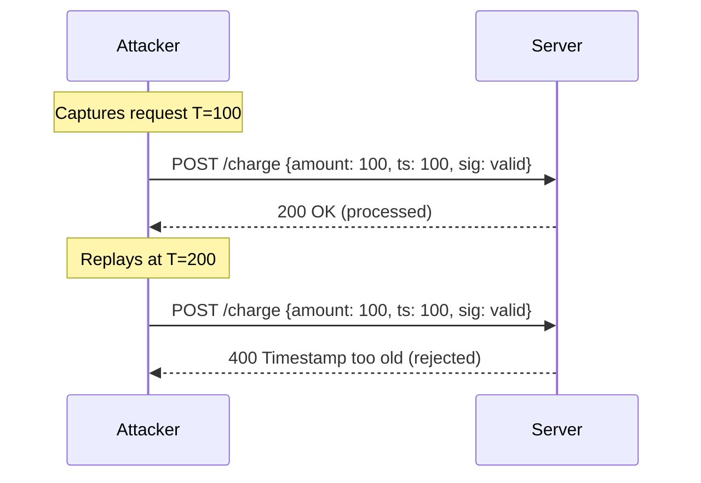
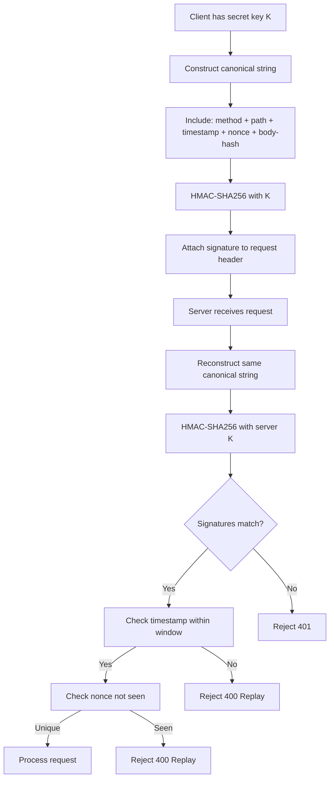

# Request Signing: HMAC, Webhooks, and AWS SigV4

## Why Request Signing Exists

HTTP is stateless and unauthenticated at the transport layer. While TLS protects data in transit from eavesdropping, it does not answer two critical questions:

1. **Origin authenticity**: Did this request truly come from who claims to have sent it?
2. **Integrity**: Was the request body modified in transit or by a man-in-the-middle?

Bearer tokens solve authentication but not integrity. A stolen token can be replayed with a completely different body. Request signing binds authentication to the specific message content — you cannot replay a valid signature with a modified payload, and a stolen signature cannot be reused without the signing key.

### Historical Context

The concept originates from cryptographic message authentication codes (MACs), formalized in the 1980s. OAuth 1.0 (2010) introduced the first widespread API request signing scheme. Amazon's SigV4 (2013) became the gold standard for cloud APIs. Stripe, GitHub, and Twilio popularized HMAC-SHA256 webhook verification as a simpler pattern for server-to-server callbacks.

The shift from OAuth 1.0 (complex, error-prone) to HMAC-based signing (simple, auditable) reflects learned lessons from production deployments at scale.

## First Principles

### HMAC — Hash-Based Message Authentication Code

HMAC is a construction that uses a cryptographic hash function with a secret key:

$$\text{HMAC}(K, m) = H\bigl((K' \oplus \text{opad}) \,\|\, H((K' \oplus \text{ipad}) \,\|\, m)\bigr)$$

Where:
- $K$ is the secret key
- $K'$ is the key padded/hashed to the block size of $H$
- $\text{opad} = \texttt{0x5c5c...}$ (outer padding)
- $\text{ipad} = \texttt{0x3636...}$ (inner padding)
- $\|$ denotes concatenation
- $\oplus$ denotes XOR

The double-hash construction prevents length extension attacks that would be possible with a naive $H(K \| m)$ approach. With SHA-256 as the hash function:

$$|\text{HMAC-SHA256}| = 256 \text{ bits} = 32 \text{ bytes} = 64 \text{ hex characters}$$

**Security properties:**
- Without knowledge of $K$, computing a valid $\text{HMAC}(K, m')$ for any $m'$ is computationally infeasible
- Collision resistance: finding two messages with the same HMAC requires $O(2^{128})$ operations
- The key acts as a secret that only the legitimate parties know

### Replay Attacks

A replay attack occurs when an attacker captures a valid, signed request and retransmits it later. Even though the attacker cannot modify the body, they can repeat the same action — a payment, an order, a state change.

The defense is to include a **nonce** (number used once) or **timestamp** in the signed data and reject requests outside a time window or with a seen nonce.



## Core Mechanics

### HMAC Signature Flow



### Canonical Request Construction

The canonical string must be deterministic — both parties must produce identical strings from the same input. This is the hardest part to get right.

Key decisions:
1. **Header inclusion**: Which headers are signed? Changes to unsigned headers are invisible.
2. **Body normalization**: JSON key ordering, whitespace
3. **Query parameter ordering**: Must be alphabetically sorted
4. **Encoding**: URL encoding rules must be identical

## Implementation

### Production HMAC Request Signing (TypeScript)

```typescript
import { createHmac, timingSafeEqual, randomBytes } from 'crypto';
import { createHash } from 'crypto';

export interface SigningConfig {
  keyId: string;
  secretKey: string;
  timestampTolerance?: number; // seconds, default 300
  nonceStore?: NonceStore;
}

export interface NonceStore {
  has(nonce: string): Promise<boolean>;
  add(nonce: string, ttlSeconds: number): Promise<void>;
}

export interface SignedRequest {
  method: string;
  url: string;
  headers: Record<string, string>;
  body?: string | Buffer;
}

export interface RequestSignature {
  keyId: string;
  timestamp: number;
  nonce: string;
  signedHeaders: string;
  signature: string;
}

/**
 * Compute SHA-256 hash of a string or Buffer, returning hex
 */
function sha256Hex(data: string | Buffer): string {
  return createHash('sha256')
    .update(data)
    .digest('hex');
}

/**
 * Construct the canonical request string that both client and server must
 * independently compute identically.
 */
function buildCanonicalString(
  method: string,
  parsedUrl: URL,
  headers: Record<string, string>,
  signedHeaderNames: string[],
  bodyHash: string,
  timestamp: number,
  nonce: string
): string {
  // Sort query parameters deterministically
  const params = [...parsedUrl.searchParams.entries()]
    .sort(([a], [b]) => a.localeCompare(b))
    .map(([k, v]) => `${encodeURIComponent(k)}=${encodeURIComponent(v)}`)
    .join('&');

  // Include only signed headers, lowercase and sorted
  const canonicalHeaders = signedHeaderNames
    .sort()
    .map(name => `${name.toLowerCase()}:${headers[name.toLowerCase()]?.trim() ?? ''}`)
    .join('\n');

  const signedHeadersList = signedHeaderNames
    .sort()
    .map(h => h.toLowerCase())
    .join(';');

  return [
    method.toUpperCase(),
    parsedUrl.pathname,
    params,
    canonicalHeaders,
    signedHeadersList,
    String(timestamp),
    nonce,
    bodyHash,
  ].join('\n');
}

/**
 * Sign a request using HMAC-SHA256.
 * Returns a signature object and mutates the headers map with auth header.
 */
export function signRequest(
  config: SigningConfig,
  request: SignedRequest
): RequestSignature {
  const timestamp = Math.floor(Date.now() / 1000);
  const nonce = randomBytes(16).toString('hex');
  const parsedUrl = new URL(request.url);

  // Compute body hash (empty string hash if no body)
  const bodyHash = sha256Hex(request.body ?? '');

  // Normalize existing headers to lowercase keys
  const normalizedHeaders: Record<string, string> = {};
  for (const [k, v] of Object.entries(request.headers)) {
    normalizedHeaders[k.toLowerCase()] = v;
  }

  // Always sign: host, content-type (if present), x-timestamp, x-nonce
  const headersToSign = ['host', 'x-timestamp', 'x-nonce'];
  if (normalizedHeaders['content-type']) {
    headersToSign.push('content-type');
  }

  // Add signing-related headers before building canonical string
  normalizedHeaders['host'] = parsedUrl.host;
  normalizedHeaders['x-timestamp'] = String(timestamp);
  normalizedHeaders['x-nonce'] = nonce;

  const canonical = buildCanonicalString(
    request.method,
    parsedUrl,
    normalizedHeaders,
    headersToSign,
    bodyHash,
    timestamp,
    nonce
  );

  const signature = createHmac('sha256', config.secretKey)
    .update(canonical, 'utf8')
    .digest('hex');

  // Set headers on the request
  request.headers['x-timestamp'] = String(timestamp);
  request.headers['x-nonce'] = nonce;
  request.headers['authorization'] = [
    `HMAC-SHA256 keyId="${config.keyId}"`,
    `signedHeaders="${headersToSign.sort().join(';')}"`,
    `signature="${signature}"`,
  ].join(', ');

  return {
    keyId: config.keyId,
    timestamp,
    nonce,
    signedHeaders: headersToSign.sort().join(';'),
    signature,
  };
}

/**
 * Verify a signed request on the server side.
 * Throws descriptive errors for each failure mode.
 */
export async function verifyRequest(
  config: SigningConfig & { getSecretKey: (keyId: string) => Promise<string | null> },
  request: SignedRequest
): Promise<{ keyId: string; valid: true }> {
  const tolerance = config.timestampTolerance ?? 300;
  const now = Math.floor(Date.now() / 1000);

  // Parse Authorization header
  const authHeader = request.headers['authorization'] ?? request.headers['Authorization'];
  if (!authHeader?.startsWith('HMAC-SHA256 ')) {
    throw new Error('Missing or invalid Authorization scheme');
  }

  const parsed = parseAuthHeader(authHeader);
  if (!parsed) {
    throw new Error('Malformed Authorization header');
  }

  // Verify timestamp to prevent replay attacks
  const timestamp = parseInt(request.headers['x-timestamp'] ?? '', 10);
  if (isNaN(timestamp)) {
    throw new Error('Missing x-timestamp header');
  }
  const drift = Math.abs(now - timestamp);
  if (drift > tolerance) {
    throw new Error(`Timestamp drift ${drift}s exceeds tolerance ${tolerance}s`);
  }

  // Verify nonce uniqueness
  const nonce = request.headers['x-nonce'] ?? request.headers['X-Nonce'];
  if (!nonce) {
    throw new Error('Missing x-nonce header');
  }
  if (config.nonceStore) {
    const seen = await config.nonceStore.has(nonce);
    if (seen) {
      throw new Error('Nonce already used (replay attack detected)');
    }
  }

  // Look up the secret key for this keyId
  const secretKey = await config.getSecretKey(parsed.keyId);
  if (!secretKey) {
    throw new Error(`Unknown keyId: ${parsed.keyId}`);
  }

  // Reconstruct canonical string
  const parsedUrl = new URL(request.url);
  const bodyHash = sha256Hex(request.body ?? '');
  const normalizedHeaders: Record<string, string> = {};
  for (const [k, v] of Object.entries(request.headers)) {
    normalizedHeaders[k.toLowerCase()] = v;
  }

  const signedHeaderNames = parsed.signedHeaders.split(';');
  const canonical = buildCanonicalString(
    request.method,
    parsedUrl,
    normalizedHeaders,
    signedHeaderNames,
    bodyHash,
    timestamp,
    nonce
  );

  // Compute expected signature
  const expected = createHmac('sha256', secretKey)
    .update(canonical, 'utf8')
    .digest('hex');

  // Constant-time comparison to prevent timing attacks
  const expectedBuf = Buffer.from(expected, 'hex');
  const actualBuf = Buffer.from(parsed.signature, 'hex');

  if (
    expectedBuf.length !== actualBuf.length ||
    !timingSafeEqual(expectedBuf, actualBuf)
  ) {
    throw new Error('Signature mismatch');
  }

  // Record nonce after successful verification
  if (config.nonceStore) {
    await config.nonceStore.add(nonce, tolerance * 2);
  }

  return { keyId: parsed.keyId, valid: true };
}

function parseAuthHeader(
  header: string
): { keyId: string; signedHeaders: string; signature: string } | null {
  const parts = header.replace('HMAC-SHA256 ', '').split(', ');
  const result: Record<string, string> = {};
  for (const part of parts) {
    const eq = part.indexOf('=');
    if (eq === -1) return null;
    const key = part.slice(0, eq);
    const value = part.slice(eq + 1).replace(/^"(.*)"$/, '$1');
    result[key] = value;
  }
  if (!result['keyId'] || !result['signedHeaders'] || !result['signature']) {
    return null;
  }
  return {
    keyId: result['keyId'],
    signedHeaders: result['signedHeaders'],
    signature: result['signature'],
  };
}
```

### Redis-Backed Nonce Store

```typescript
import { createClient } from 'redis';

export class RedisNonceStore implements NonceStore {
  constructor(private readonly client: ReturnType<typeof createClient>) {}

  async has(nonce: string): Promise<boolean> {
    const result = await this.client.get(`nonce:${nonce}`);
    return result !== null;
  }

  async add(nonce: string, ttlSeconds: number): Promise<void> {
    await this.client.set(`nonce:${nonce}`, '1', { EX: ttlSeconds });
  }
}
```

### Webhook Verification (Stripe/GitHub Style)

Webhook verification is a simpler variant — the platform signs the payload with a shared secret and includes the signature in a header. You verify on receipt.

```typescript
export interface WebhookConfig {
  secret: string;
  headerName: string;
  timestampTolerance?: number;
}

/**
 * Stripe-compatible webhook verification.
 * Header format: t=TIMESTAMP,v1=SIGNATURE
 */
export function verifyStripeWebhook(
  payload: Buffer | string,
  signatureHeader: string,
  secret: string,
  toleranceSeconds = 300
): void {
  const parts = signatureHeader.split(',');
  const tPart = parts.find(p => p.startsWith('t='));
  const v1Part = parts.find(p => p.startsWith('v1='));

  if (!tPart || !v1Part) {
    throw new Error('Invalid Stripe signature header format');
  }

  const timestamp = parseInt(tPart.slice(2), 10);
  const providedSig = v1Part.slice(3);

  const now = Math.floor(Date.now() / 1000);
  if (Math.abs(now - timestamp) > toleranceSeconds) {
    throw new Error(`Webhook timestamp too old: ${Math.abs(now - timestamp)}s drift`);
  }

  const signedPayload = `${timestamp}.${payload.toString('utf8')}`;
  const expectedSig = createHmac('sha256', secret)
    .update(signedPayload, 'utf8')
    .digest('hex');

  const expectedBuf = Buffer.from(expectedSig, 'hex');
  const actualBuf = Buffer.from(providedSig, 'hex');

  if (
    expectedBuf.length !== actualBuf.length ||
    !timingSafeEqual(expectedBuf, actualBuf)
  ) {
    throw new Error('Webhook signature verification failed');
  }
}

/**
 * GitHub-compatible webhook verification.
 * Header: X-Hub-Signature-256: sha256=HASH
 */
export function verifyGitHubWebhook(
  payload: Buffer | string,
  signatureHeader: string,
  secret: string
): void {
  if (!signatureHeader.startsWith('sha256=')) {
    throw new Error('Invalid GitHub signature format');
  }

  const providedSig = signatureHeader.slice(7);
  const expectedSig = createHmac('sha256', secret)
    .update(payload)
    .digest('hex');

  const expectedBuf = Buffer.from(expectedSig, 'hex');
  const actualBuf = Buffer.from(providedSig, 'hex');

  if (
    expectedBuf.length !== actualBuf.length ||
    !timingSafeEqual(expectedBuf, actualBuf)
  ) {
    throw new Error('GitHub webhook signature verification failed');
  }
}
```

### AWS Signature Version 4

AWS SigV4 is the most comprehensive request signing standard. It signs the canonical request, then signs the "string to sign" which includes the date, region, service, and scope.

```typescript
import { createHmac, createHash } from 'crypto';

interface SigV4Config {
  accessKeyId: string;
  secretAccessKey: string;
  region: string;
  service: string;
  sessionToken?: string;
}

interface SigV4Request {
  method: string;
  url: string;
  headers: Record<string, string>;
  body?: string;
}

function sha256(data: string | Buffer): string {
  return createHash('sha256').update(data).digest('hex');
}

function hmac(key: Buffer | string, data: string): Buffer {
  return createHmac('sha256', key).update(data, 'utf8').digest();
}

function getSigningKey(
  secretKey: string,
  date: string,
  region: string,
  service: string
): Buffer {
  const kDate = hmac(`AWS4${secretKey}`, date);
  const kRegion = hmac(kDate, region);
  const kService = hmac(kRegion, service);
  const kSigning = hmac(kService, 'aws4_request');
  return kSigning;
}

/**
 * Sign an AWS API request using Signature Version 4.
 * Mutates request.headers with required auth headers.
 */
export function signAWSRequest(
  config: SigV4Config,
  request: SigV4Request
): void {
  const now = new Date();
  const amzDate = now.toISOString().replace(/[:-]|\.\d{3}/g, '');
  const dateStamp = amzDate.slice(0, 8);

  const parsedUrl = new URL(request.url);
  const bodyHash = sha256(request.body ?? '');

  // Add required AWS headers
  request.headers['host'] = parsedUrl.host;
  request.headers['x-amz-date'] = amzDate;
  request.headers['x-amz-content-sha256'] = bodyHash;
  if (config.sessionToken) {
    request.headers['x-amz-security-token'] = config.sessionToken;
  }

  // Build canonical headers (sorted, lowercase)
  const normalizedHeaders = Object.fromEntries(
    Object.entries(request.headers).map(([k, v]) => [k.toLowerCase(), v.trim()])
  );
  const sortedHeaderNames = Object.keys(normalizedHeaders).sort();
  const canonicalHeaders = sortedHeaderNames
    .map(k => `${k}:${normalizedHeaders[k]}`)
    .join('\n') + '\n';
  const signedHeaders = sortedHeaderNames.join(';');

  // Build canonical query string
  const queryString = [...parsedUrl.searchParams.entries()]
    .sort(([a], [b]) => a.localeCompare(b))
    .map(([k, v]) => `${encodeURIComponent(k)}=${encodeURIComponent(v)}`)
    .join('&');

  // Step 1: Build canonical request
  const canonicalRequest = [
    request.method.toUpperCase(),
    parsedUrl.pathname,
    queryString,
    canonicalHeaders,
    signedHeaders,
    bodyHash,
  ].join('\n');

  // Step 2: Build string to sign
  const credentialScope = `${dateStamp}/${config.region}/${config.service}/aws4_request`;
  const stringToSign = [
    'AWS4-HMAC-SHA256',
    amzDate,
    credentialScope,
    sha256(canonicalRequest),
  ].join('\n');

  // Step 3: Calculate signature
  const signingKey = getSigningKey(
    config.secretAccessKey,
    dateStamp,
    config.region,
    config.service
  );
  const signature = hmac(signingKey, stringToSign).toString('hex');

  // Step 4: Build Authorization header
  request.headers['authorization'] = [
    `AWS4-HMAC-SHA256 Credential=${config.accessKeyId}/${credentialScope}`,
    `SignedHeaders=${signedHeaders}`,
    `Signature=${signature}`,
  ].join(', ');
}
```

### Express Middleware for Signature Verification

```typescript
import { Request, Response, NextFunction } from 'express';

interface SignatureMiddlewareOptions {
  getSecretKey: (keyId: string) => Promise<string | null>;
  nonceStore?: NonceStore;
  toleranceSeconds?: number;
  // Allow bypassing for health check routes
  skipPaths?: string[];
}

export function requestSignatureMiddleware(
  options: SignatureMiddlewareOptions
) {
  return async (req: Request, res: Response, next: NextFunction) => {
    if (options.skipPaths?.some(p => req.path.startsWith(p))) {
      return next();
    }

    // Collect raw body (must be set by body parser middleware)
    const rawBody: Buffer = (req as any).rawBody ?? Buffer.from('');

    const signedRequest: SignedRequest = {
      method: req.method,
      url: `${req.protocol}://${req.get('host')}${req.originalUrl}`,
      headers: Object.fromEntries(
        Object.entries(req.headers).map(([k, v]) => [k, Array.isArray(v) ? v[0] : v ?? ''])
      ),
      body: rawBody,
    };

    try {
      const result = await verifyRequest(
        {
          ...options,
          secretKey: '',
          keyId: '',
          getSecretKey: options.getSecretKey,
          nonceStore: options.nonceStore,
          timestampTolerance: options.toleranceSeconds,
        },
        signedRequest
      );
      (req as any).signingKeyId = result.keyId;
      next();
    } catch (err: any) {
      res.status(401).json({
        error: 'request_signing_failed',
        message: err.message,
      });
    }
  };
}
```

## Edge Cases and Failure Modes

### 1. Clock Skew

If client and server clocks differ by more than the tolerance window, all requests are rejected. This is a common production failure in:
- Containers that haven't synced NTP since startup
- VMs restored from snapshots
- CI/CD environments with wrong timezone settings

**Mitigation**: Return the server timestamp in the `Date` response header. SDKs can auto-correct skew by measuring drift and adjusting before signing.

```typescript
export class ClockSkewAwareClient {
  private skewMs = 0;

  adjustForResponse(response: Response): void {
    const serverDate = response.headers.get('date');
    if (serverDate) {
      const serverTime = new Date(serverDate).getTime();
      this.skewMs = serverTime - Date.now();
    }
  }

  now(): number {
    return Math.floor((Date.now() + this.skewMs) / 1000);
  }
}
```

### 2. Body Streaming

Raw body access is required for signature verification, but many frameworks parse the body before middleware runs, consuming the stream.

**Mitigation**: Use a raw-body capture middleware that stores the original buffer:

```typescript
import { raw } from 'body-parser';

// Must run BEFORE any other body parsers
app.use(raw({
  type: '*/*',
  verify: (req, _res, buf) => {
    (req as any).rawBody = buf;
  },
}));
```

### 3. Charset and Encoding Normalization

`Content-Type: application/json` vs `application/json; charset=utf-8` — if the signed header includes the full value but the server strips the charset, the canonical strings diverge.

**Mitigation**: Include only the MIME type, not parameters, in the canonical header. Or strip parameters consistently on both sides.

### 4. Large Files

Computing a SHA-256 over a 1 GB upload to include in the canonical string requires reading the entire body twice (once to hash, once to send). AWS S3 supports `x-amz-content-sha256: UNSIGNED-PAYLOAD` for uploads where body integrity is guaranteed by TLS.

::: warning
UNSIGNED-PAYLOAD disables body integrity checking. Only use for trusted TLS connections when body signing is infeasible due to size or streaming.
:::

### 5. Signature Algorithm Downgrade

If your verification accepts both `HMAC-SHA1` and `HMAC-SHA256`, an attacker who knows an old SHA-1 signature can potentially exploit SHA-1 weaknesses.

**Mitigation**: Enforce a single algorithm. Reject requests signed with deprecated algorithms. If migration is needed, accept both during a transition window with monitoring, then cut over.

## Performance Characteristics

| Operation | Complexity | Latency (typical) |
|-----------|-----------|-------------------|
| HMAC-SHA256 of 1KB body | O(n) | ~0.01 ms |
| HMAC-SHA256 of 1MB body | O(n) | ~1 ms |
| Nonce Redis lookup | O(1) | ~0.5 ms |
| Nonce Redis write | O(1) | ~0.5 ms |
| Full verification | O(n) + Redis | ~2-5 ms |

### Throughput Benchmarks

On a modern server (AMD EPYC, Node.js 20):

- HMAC-SHA256 throughput: ~2 GB/s
- Signature verification rate: ~50,000 req/s (CPU-bound at that rate)
- With Redis nonce store: ~20,000 req/s (Redis RTT dominates)

For high-throughput APIs, batch nonce invalidation or use an in-memory bloom filter as a first pass before Redis.

## Mathematical Foundations

### Security Reduction

The security of HMAC-SHA256 is reducible to the pseudo-random function (PRF) security of SHA-256. Formally:

$$\text{Adv}^{\text{HMAC}}_{\text{PRF}}(\mathcal{A}) \leq \text{Adv}^{\text{H}}_{\text{PRF}}(\mathcal{B}) + \frac{q^2}{2^b}$$

Where:
- $q$ is the number of queries
- $b = 512$ is the block size in bits for SHA-256
- $\mathcal{B}$ is an adversary against the underlying hash PRF

For $q = 10^9$ requests and $b = 512$:
$$\frac{q^2}{2^b} = \frac{10^{18}}{2^{512}} \approx 10^{-136}$$

This is negligibly small. The scheme is computationally secure against adaptive chosen-message attacks.

### Timing Attack Prevention

String comparison `a === b` leaks timing information — it returns early on the first mismatched byte. This allows an attacker to learn the expected signature one character at a time with ~$O(|\sigma| \cdot |\Sigma|)$ queries.

`timingSafeEqual` runs in constant time $O(n)$ regardless of the comparison result, preventing this attack class.

## Real-World War Stories

::: info War Story: The GitHub Webhook That Processed 10,000 Duplicate Orders

In 2019, a fintech startup had a checkout flow that used GitHub-style HMAC webhook verification. They had correctly implemented signature checking but had NOT implemented replay protection.

A network issue caused their payment provider to retry webhooks 3 times over 30 minutes. Each webhook was correctly signed, and each was processed as a new order — creating 3x order volume in their database. The error was discovered when customers started receiving duplicate shipments.

The fix was a nonce table: store the webhook event ID (provided in the payload) in Redis with a 24-hour TTL and reject duplicates. Total implementation time: 2 hours. Cost of incident: 48 hours of manual reconciliation and $15,000 in duplicate shipments.

**Lesson**: Signature verification proves authenticity. Nonce tracking proves freshness. You need both.
:::

::: info War Story: The Canonical String Divergence

A team implemented a SigV4-compatible signing library for their internal service mesh. Everything worked in staging but failed in production for ~3% of requests. After 3 days of debugging, they found the culprit: staging used HTTP/1.1 which preserves header ordering, while production used HTTP/2 which reorders headers alphabetically in the HPACK compression layer.

The signing library iterated headers in insertion order, but the verification library received them in alphabetical order. For requests where insertion order != alphabetical order, the canonical strings diverged.

The fix was to sort headers alphabetically during canonicalization on both sides. This is exactly why the AWS SigV4 spec mandates alphabetical header sorting.
:::

## Decision Framework

### When to Use Request Signing

| Scenario | Use Signing? | Reason |
|----------|-------------|--------|
| Server-to-server API | Yes | High-value, non-interactive |
| Webhook receiver | Yes | Cannot use OAuth flow |
| Mobile app to API | Maybe | Key storage risk on device |
| Browser to API | Rarely | Key exposure in JS |
| Internal service mesh (mTLS) | Optional | mTLS provides auth + integrity |

### Signing Scheme Comparison

| Scheme | Complexity | Features | Use Case |
|--------|-----------|---------|---------|
| HMAC-SHA256 (basic) | Low | Auth + integrity | Simple webhooks |
| HMAC + timestamp | Low | + replay prevention | Most server APIs |
| HMAC + timestamp + nonce | Medium | + replay prevention | High-value operations |
| AWS SigV4 | High | + presigned URLs, service scoping | AWS service calls |
| Ed25519 asymmetric | Medium | + non-repudiation | Audit log, receipts |

### Key Rotation Strategy

```typescript
interface KeyRotationConfig {
  current: { id: string; secret: string };
  previous?: { id: string; secret: string; expiresAt: Date };
}

async function getKeyForVerification(
  keyId: string,
  config: KeyRotationConfig
): Promise<string | null> {
  if (keyId === config.current.id) {
    return config.current.secret;
  }
  if (
    config.previous &&
    keyId === config.previous.id &&
    new Date() < config.previous.expiresAt
  ) {
    return config.previous.secret;
  }
  return null;
}
```

Keep the previous key valid for 48 hours after rotation to allow in-flight requests to complete.

## Advanced Topics

### Presigned URLs

AWS SigV4 supports URL signing — embedding the signature in the query string for time-limited, shareable access to private resources.

$$\text{URL} = \text{base\_url} + \text{?X-Amz-Algorithm=AWS4-HMAC-SHA256} + \text{...} + \text{\&X-Amz-Signature=} \sigma$$

This is used for S3 download links, API Gateway endpoints that don't require request bodies, and temporary access grants.

### Asymmetric Signing with Ed25519

For non-repudiation (where the server needs to prove it didn't forge the client's request), use asymmetric signing:

```typescript
import { sign, verify } from 'crypto';

// Client signs with private key
const signature = sign(null, Buffer.from(canonicalString), privateKey);

// Server verifies with public key (no secret sharing required)
const valid = verify(null, Buffer.from(canonicalString), publicKey, signature);
```

Ed25519 signatures are 64 bytes, verification is ~10x faster than HMAC-SHA256, and the public key can be shared freely. The tradeoff is key management complexity — private keys cannot be shared with verification parties.

### Merkle Tree Signing for Batch Requests

For APIs that process requests in batches, you can sign a Merkle tree of request hashes, then verify individual requests against the root:

$$\text{root} = H(H(r_1 \| r_2) \| H(r_3 \| r_4))$$

This allows verifying a single request with $O(\log n)$ hashes rather than checking all $n$ requests individually, while maintaining integrity guarantees.

::: tip
This pattern is used in blockchain systems and certificate transparency logs, and is increasingly applicable to high-throughput API audit logging.
:::
