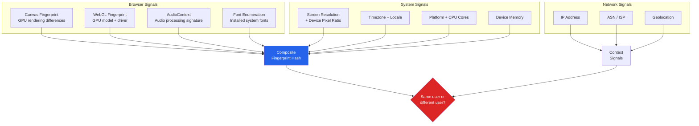
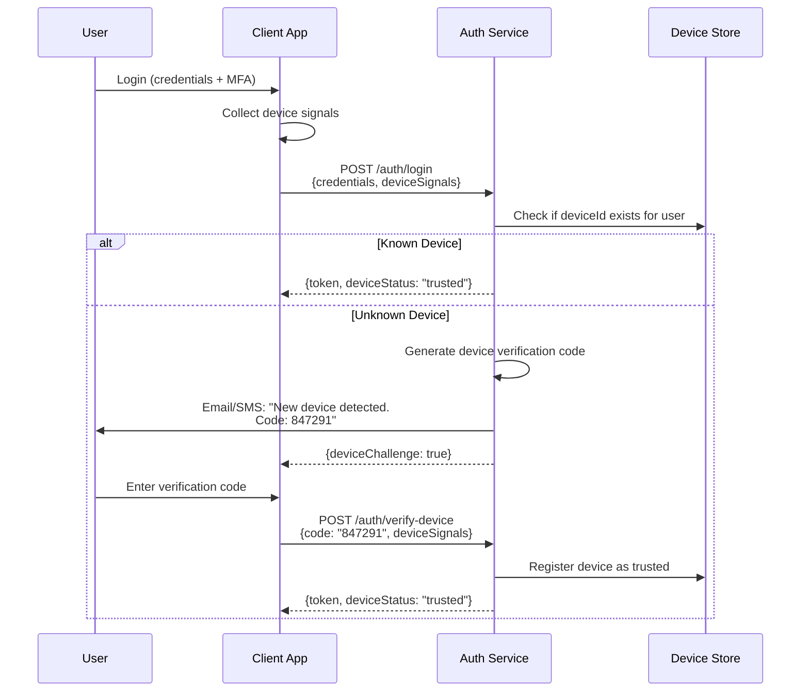
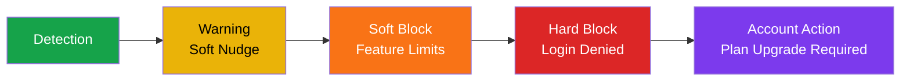

# Account Sharing Prevention

Account sharing costs SaaS companies billions annually. Netflix estimated 100 million households were using shared passwords before their 2023 crackdown, which added 30 million paying subscribers in two quarters. Spotify, Disney+, and enterprise SaaS vendors face the same challenge. This page covers the full engineering toolkit — from device fingerprinting to behavioral analytics to graceful enforcement — with production code and privacy guardrails.

## Why Companies Prevent Sharing

| Company Type | Revenue Impact | Security Impact | Compliance Impact |
|-------------|---------------|-----------------|-------------------|
| **Streaming (Netflix, Spotify)** | Direct revenue loss per shared account | Minimal — content is not sensitive | License agreements with content owners |
| **Enterprise SaaS** | Per-seat pricing undermined | Shared credentials = no audit trail | SOC 2 requires individual accountability |
| **Financial services** | Subscription revenue loss | Shared access = compliance violation | KYC/AML requires individual identification |
| **Education platforms** | Course licensing violations | Exam integrity compromised | Accreditation requirements |

::: warning Sharing vs Multi-Device
Legitimate multi-device use (same person, phone + laptop + tablet) must not trigger enforcement. The goal is detecting when *different people* use the same credentials, not when one person uses multiple devices.
:::

## Device Fingerprinting Techniques

Device fingerprinting creates a unique identifier for each browser/device without relying on cookies or storage, which users can clear.

### Fingerprinting Signals



### Canvas Fingerprinting

The canvas API renders text and shapes differently depending on the GPU, driver version, OS font rendering, and anti-aliasing settings. These differences create a unique fingerprint.

```typescript
function getCanvasFingerprint(): string {
  const canvas = document.createElement('canvas');
  canvas.width = 200;
  canvas.height = 50;
  const ctx = canvas.getContext('2d')!;

  // Text rendering varies by GPU + font engine
  ctx.textBaseline = 'top';
  ctx.font = '14px Arial';
  ctx.fillStyle = '#f60';
  ctx.fillRect(125, 1, 62, 20);
  ctx.fillStyle = '#069';
  ctx.fillText('Cwm fjordbank glyphs vext quiz', 2, 15);

  // Blend modes vary by GPU
  ctx.globalCompositeOperation = 'multiply';
  ctx.fillStyle = 'rgb(255,0,255)';
  ctx.beginPath();
  ctx.arc(50, 50, 50, 0, Math.PI * 2, true);
  ctx.closePath();
  ctx.fill();

  // Extract pixel data as fingerprint
  return canvas.toDataURL();
}
```

### WebGL Fingerprinting

```typescript
function getWebGLFingerprint(): Record<string, string> {
  const canvas = document.createElement('canvas');
  const gl = canvas.getContext('webgl')
    || canvas.getContext('experimental-webgl');

  if (!gl) return { supported: 'false' };

  const debugInfo = gl.getExtension('WEBGL_debug_renderer_info');

  return {
    vendor: gl.getParameter(gl.VENDOR),
    renderer: debugInfo
      ? gl.getParameter(debugInfo.UNMASKED_RENDERER_WEBGL)
      : 'unknown',
    maxTextureSize: gl.getParameter(gl.MAX_TEXTURE_SIZE).toString(),
    maxViewportDims: gl.getParameter(gl.MAX_VIEWPORT_DIMS).toString(),
    extensions: gl.getSupportedExtensions()?.join(',') || '',
  };
}
```

### AudioContext Fingerprinting

```typescript
async function getAudioFingerprint(): Promise<string> {
  const audioCtx = new OfflineAudioContext(1, 44100, 44100);
  const oscillator = audioCtx.createOscillator();
  oscillator.type = 'triangle';
  oscillator.frequency.setValueAtTime(10000, audioCtx.currentTime);

  const compressor = audioCtx.createDynamicsCompressor();
  compressor.threshold.setValueAtTime(-50, audioCtx.currentTime);
  compressor.knee.setValueAtTime(40, audioCtx.currentTime);
  compressor.ratio.setValueAtTime(12, audioCtx.currentTime);
  compressor.attack.setValueAtTime(0, audioCtx.currentTime);
  compressor.release.setValueAtTime(0.25, audioCtx.currentTime);

  oscillator.connect(compressor);
  compressor.connect(audioCtx.destination);
  oscillator.start(0);

  const buffer = await audioCtx.startRendering();
  const data = buffer.getChannelData(0);

  // Hash a subset of audio samples
  let hash = 0;
  for (let i = 4500; i < 5000; i++) {
    hash = ((hash << 5) - hash) + (data[i] * 1000000 | 0);
    hash = hash & hash; // Convert to 32-bit integer
  }

  return hash.toString(16);
}
```

### Composite Fingerprint

```typescript
import { createHash } from 'crypto'; // Server-side hash

interface DeviceSignals {
  canvasHash: string;
  webglRenderer: string;
  audioHash: string;
  screenResolution: string;
  devicePixelRatio: number;
  timezone: string;
  language: string;
  platform: string;
  cpuCores: number;
  deviceMemory: number;
  touchSupport: boolean;
}

function computeDeviceId(signals: DeviceSignals): string {
  // Combine stable signals (resist minor changes)
  const stableInput = [
    signals.canvasHash,
    signals.webglRenderer,
    signals.audioHash,
    signals.platform,
    signals.cpuCores.toString(),
    signals.timezone,
  ].join('|');

  return createHash('sha256').update(stableInput).digest('hex').slice(0, 16);
}
```

::: tip Fingerprint Stability
No single signal is perfectly stable. Canvas fingerprints change with driver updates. Screen resolution changes with external monitors. Combine 5+ signals and use fuzzy matching (e.g., require 4 of 6 signals to match) to maintain a stable device identity across minor changes.
:::

## Device Trust and Binding

After fingerprinting, bind sessions to trusted devices.

### Device Registration Flow



### Device Trust Levels

| Trust Level | Description | Capabilities |
|-------------|-------------|-------------|
| **Unknown** | Never seen before | Login allowed, sensitive operations blocked, verification email sent |
| **Verified** | Passed device verification | Full access, counted toward device limit |
| **Trusted** | Verified + used regularly for 30+ days | Reduced MFA prompts, higher rate limits |
| **Managed** | MDM-enrolled corporate device | Full enterprise access, compliance verified |

## Concurrent Session Detection and Enforcement

### Detecting Sharing Patterns

```typescript
interface SessionPattern {
  userId: string;
  activeSessions: Array<{
    deviceId: string;
    ip: string;
    location: { lat: number; lng: number; city: string };
    lastActive: Date;
  }>;
}

function detectSharing(pattern: SessionPattern): {
  sharing: boolean;
  confidence: number;
  reasons: string[];
} {
  const reasons: string[] = [];
  let score = 0;

  const sessions = pattern.activeSessions;

  // Signal 1: Simultaneous activity from different locations
  const recentSessions = sessions.filter(
    s => Date.now() - s.lastActive.getTime() < 5 * 60 * 1000 // 5 min
  );

  if (recentSessions.length > 1) {
    const locations = new Set(recentSessions.map(s => s.location.city));
    if (locations.size > 1) {
      score += 40;
      reasons.push(`Simultaneous use from ${[...locations].join(', ')}`);
    }
  }

  // Signal 2: Impossible travel
  for (let i = 0; i < sessions.length - 1; i++) {
    for (let j = i + 1; j < sessions.length; j++) {
      const distance = haversineDistance(
        sessions[i].location, sessions[j].location
      );
      const timeDiff = Math.abs(
        sessions[i].lastActive.getTime() - sessions[j].lastActive.getTime()
      );
      const hoursElapsed = timeDiff / (1000 * 60 * 60);
      const maxTravelKmPerHour = 900; // Commercial jet speed

      if (distance > maxTravelKmPerHour * hoursElapsed) {
        score += 50;
        reasons.push(`Impossible travel: ${Math.round(distance)}km in ${hoursElapsed.toFixed(1)}h`);
      }
    }
  }

  // Signal 3: Too many unique devices
  const uniqueDevices = new Set(sessions.map(s => s.deviceId));
  if (uniqueDevices.size > 5) {
    score += 30;
    reasons.push(`${uniqueDevices.size} unique devices`);
  }

  // Signal 4: Different ISPs simultaneously
  // (Household members typically share ISP)
  const uniqueIPs = new Set(sessions.map(s => s.ip.split('.').slice(0, 2).join('.')));
  if (uniqueIPs.size > 2 && recentSessions.length > 1) {
    score += 20;
    reasons.push('Multiple ISPs active simultaneously');
  }

  return {
    sharing: score >= 50,
    confidence: Math.min(score, 100),
    reasons,
  };
}
```

## IP Geolocation Anomaly Detection

```typescript
interface GeoAnomaly {
  type: 'impossible_travel' | 'new_country' | 'vpn_detected' | 'tor_exit';
  severity: 'low' | 'medium' | 'high';
  details: string;
}

async function checkGeoAnomalies(
  userId: string,
  currentIP: string
): Promise<GeoAnomaly[]> {
  const anomalies: GeoAnomaly[] = [];
  const geo = await geolocate(currentIP);
  const history = await getLoginHistory(userId, { limit: 10 });

  // Check 1: Known VPN/proxy IP
  if (geo.isVPN || geo.isProxy) {
    anomalies.push({
      type: 'vpn_detected',
      severity: 'low', // Many legitimate users use VPNs
      details: `VPN/proxy detected: ${geo.isp}`,
    });
  }

  // Check 2: Tor exit node
  if (geo.isTorExitNode) {
    anomalies.push({
      type: 'tor_exit',
      severity: 'high',
      details: 'Connection from Tor exit node',
    });
  }

  // Check 3: New country
  const previousCountries = new Set(history.map(h => h.country));
  if (!previousCountries.has(geo.country) && history.length > 0) {
    anomalies.push({
      type: 'new_country',
      severity: 'medium',
      details: `First login from ${geo.country}`,
    });
  }

  // Check 4: Impossible travel (already covered above)
  if (history.length > 0) {
    const lastLogin = history[0];
    const distance = haversineDistance(
      { lat: lastLogin.lat, lng: lastLogin.lng },
      { lat: geo.lat, lng: geo.lng }
    );
    const hoursElapsed =
      (Date.now() - lastLogin.timestamp) / (1000 * 60 * 60);

    if (distance > 500 && hoursElapsed < distance / 900) {
      anomalies.push({
        type: 'impossible_travel',
        severity: 'high',
        details: `${Math.round(distance)}km in ${hoursElapsed.toFixed(1)}h from ${lastLogin.city} to ${geo.city}`,
      });
    }
  }

  return anomalies;
}
```

## Behavioral Analytics

Usage patterns reveal sharing even when device fingerprints and IPs cannot.

### Signals That Indicate Sharing

| Signal | Individual User | Shared Account |
|--------|----------------|---------------|
| **Active hours** | Consistent pattern (e.g., 8am-11pm) | 24-hour usage, no sleep pattern |
| **Content preferences** | Coherent taste profile | Divergent interests (kids shows + horror) |
| **Typing patterns** | Consistent keystroke dynamics | Varying speeds and patterns |
| **Navigation patterns** | Familiar with UI, direct navigation | Mix of expert and novice patterns |
| **Language/locale** | Consistent | Switches between languages |
| **Session overlap** | Sequential (one at a time) | Parallel (multiple simultaneous) |

### Usage Pattern Analysis

```python
from dataclasses import dataclass
from datetime import datetime, timedelta
from collections import Counter
import numpy as np

@dataclass
class UsageEvent:
    user_id: str
    timestamp: datetime
    device_id: str
    ip: str
    event_type: str  # "play", "browse", "search", etc.

def analyze_usage_pattern(
    events: list[UsageEvent],
    window_days: int = 30,
) -> dict:
    """Analyze usage patterns for sharing indicators."""

    # Active hours distribution
    hour_counts = Counter(e.timestamp.hour for e in events)
    active_hours = sum(1 for h in range(24) if hour_counts.get(h, 0) > 0)

    # Device diversity
    devices = set(e.device_id for e in events)
    daily_device_switches = _count_daily_switches(events)

    # Simultaneous usage detection
    simultaneous_count = _detect_simultaneous(events, threshold_minutes=5)

    # Geographic spread
    unique_ips = set(e.ip for e in events)

    return {
        "active_hours_per_day": active_hours,
        "unique_devices": len(devices),
        "avg_daily_device_switches": np.mean(daily_device_switches),
        "simultaneous_sessions": simultaneous_count,
        "unique_ips": len(unique_ips),
        "sharing_score": _compute_sharing_score(
            active_hours, len(devices),
            simultaneous_count, len(unique_ips),
        ),
    }

def _detect_simultaneous(
    events: list[UsageEvent],
    threshold_minutes: int = 5,
) -> int:
    """Count instances of simultaneous usage from different devices."""
    events_sorted = sorted(events, key=lambda e: e.timestamp)
    simultaneous = 0

    for i, e1 in enumerate(events_sorted):
        for e2 in events_sorted[i + 1:]:
            time_diff = (e2.timestamp - e1.timestamp).total_seconds()
            if time_diff > threshold_minutes * 60:
                break
            if e1.device_id != e2.device_id:
                simultaneous += 1

    return simultaneous

def _compute_sharing_score(
    active_hours: int,
    device_count: int,
    simultaneous: int,
    ip_count: int,
) -> float:
    """0-100 score. Higher = more likely sharing."""
    score = 0.0
    score += min(active_hours / 24 * 30, 30)  # 24h usage = 30 pts
    score += min(device_count / 10 * 20, 20)   # 10+ devices = 20 pts
    score += min(simultaneous / 5 * 30, 30)    # 5+ simultaneous = 30 pts
    score += min(ip_count / 8 * 20, 20)        # 8+ IPs = 20 pts
    return min(score, 100)
```

## Household Detection vs Sharing Detection

The hardest problem: distinguishing a family of four sharing a Netflix account at home from four strangers sharing credentials.

### Household Indicators

| Signal | Household | Non-Household Sharing |
|--------|-----------|----------------------|
| Same IP address | Always | Sometimes (VPN) |
| Same ISP | Always | Rarely |
| Same timezone | Always | Sometimes |
| Same Wi-Fi network | Usually | Never |
| Devices within Bluetooth range | Often | Never |
| Consistent daily overlap | Yes (evenings) | Random |

### Household Boundary Definition

```typescript
interface HouseholdProfile {
  primaryIP: string;
  secondaryIPs: string[]; // Mobile data fallback
  isp: string;
  timezone: string;
  registeredDevices: string[];
  maxDevices: number; // Plan limit
}

function isWithinHousehold(
  session: SessionData,
  household: HouseholdProfile
): boolean {
  // Same ISP and timezone = likely household
  const sameISP = session.isp === household.isp;
  const sameTimezone = session.timezone === household.timezone;
  const knownDevice = household.registeredDevices.includes(session.deviceId);

  // Same IP or known secondary IP
  const knownIP =
    session.ip === household.primaryIP ||
    household.secondaryIPs.includes(session.ip);

  // At least 2 of 4 signals must match
  const matchCount = [sameISP, sameTimezone, knownDevice, knownIP]
    .filter(Boolean).length;

  return matchCount >= 2;
}
```

## Graceful Enforcement

Aggressive enforcement alienates users. The industry has learned (from Netflix's rollout) that a graduated approach works best.

### Enforcement Ladder



| Stage | User Experience | Trigger Threshold |
|-------|----------------|-------------------|
| **Warning** | In-app banner: "We noticed unusual activity" | Sharing score > 50 |
| **Soft block** | New devices require verification code from account owner | Sharing score > 70 for 2 weeks |
| **Hard block** | Unrecognized devices blocked until account owner approves | Sharing score > 85 for 1 month |
| **Account action** | Account owner forced to change password, remove devices | Confirmed sharing for 2+ months |

### Implementation

```typescript
async function enforceAccountSharing(
  userId: string,
  sharingScore: number,
  sharingHistory: { score: number; date: Date }[]
): Promise<EnforcementAction> {
  // How long has sharing been detected?
  const weeksAboveThreshold = sharingHistory.filter(
    h => h.score > 50 &&
         Date.now() - h.date.getTime() < 60 * 24 * 60 * 60 * 1000
  ).length;

  if (sharingScore < 50) {
    return { action: 'none' };
  }

  if (sharingScore < 70 || weeksAboveThreshold < 2) {
    return {
      action: 'warn',
      message: 'We noticed your account is being used on several devices in different locations. If this is not you, please secure your account.',
      showSecureAccountLink: true,
    };
  }

  if (sharingScore < 85 || weeksAboveThreshold < 4) {
    return {
      action: 'soft_block',
      message: 'To continue using this device, please verify with the account owner.',
      requireOwnerVerification: true,
    };
  }

  return {
    action: 'hard_block',
    message: 'This device has been blocked. The account owner must approve access or upgrade their plan.',
    requirePasswordChange: true,
    suggestPlanUpgrade: true,
  };
}
```

## Privacy Considerations and GDPR Compliance

Device fingerprinting and behavioral analytics collect personal data. GDPR, CCPA, and other privacy regulations impose strict requirements.

### GDPR Requirements

| Requirement | Implementation |
|-------------|---------------|
| **Lawful basis** | Legitimate interest (preventing fraud) or contractual necessity (enforcing ToS) |
| **Data minimization** | Hash fingerprints immediately, never store raw canvas/audio data |
| **Purpose limitation** | Use fingerprints only for security — never for ad targeting |
| **Retention limits** | Delete device data 90 days after last use |
| **Right to access** | Users can request all data associated with their account, including device IDs |
| **Right to erasure** | Deleting account must delete all fingerprint and behavioral data |
| **Transparency** | Privacy policy must disclose device fingerprinting |

### Privacy-Safe Fingerprinting

```typescript
// Hash everything immediately — never store raw signals
function createPrivacySafeFingerprint(signals: DeviceSignals): {
  deviceId: string;
  signalCategories: string[]; // Which types of signals were used, not values
} {
  const deviceId = computeDeviceId(signals); // Returns hash

  return {
    deviceId,
    signalCategories: Object.keys(signals), // Transparency: which signals used
    // Raw signals are NEVER stored
  };
}
```

::: danger Do Not Fingerprint Without Disclosure
Covert fingerprinting violates GDPR and ePrivacy regulations in the EU. Your privacy policy must explicitly state that device fingerprinting is used, what data is collected, and the purpose. Consider showing a brief in-app notice on first fingerprint collection.
:::

## Further Reading

- [Session Deep Dive](./session-deep-dive.md) — Concurrent session control implementation
- [Device Trust & Risk Engine](./device-trust.md) — Device attestation and risk scoring
- [Auth Attacks & Defenses](./auth-attack-defense.md) — Credential stuffing and bot detection
- [GDPR Engineering](/security/compliance/gdpr-engineering.md) — Comprehensive GDPR compliance guide
- [Zero Trust Principles](/security/zero-trust/principles.md) — Never trust, always verify
- [MFA Engineering Deep Dive](./mfa-deep-dive.md) — Step-up authentication for suspicious activity
