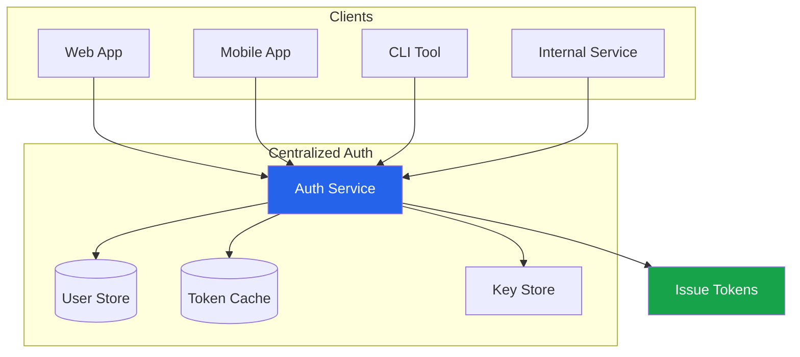
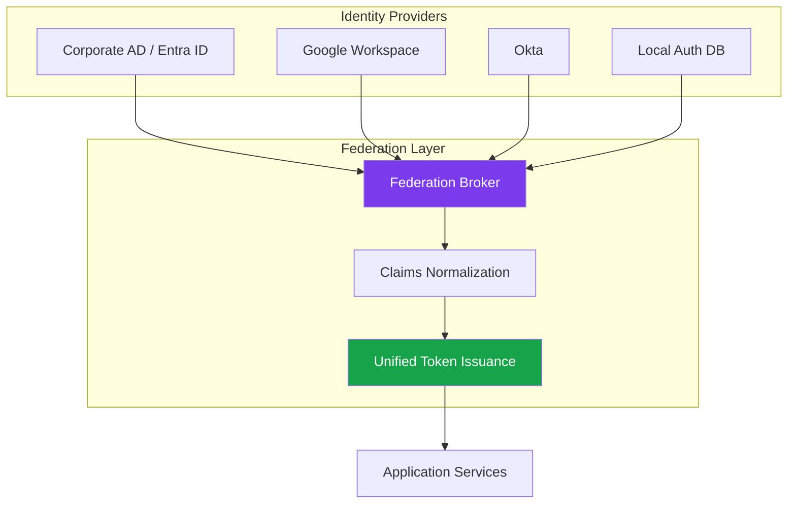
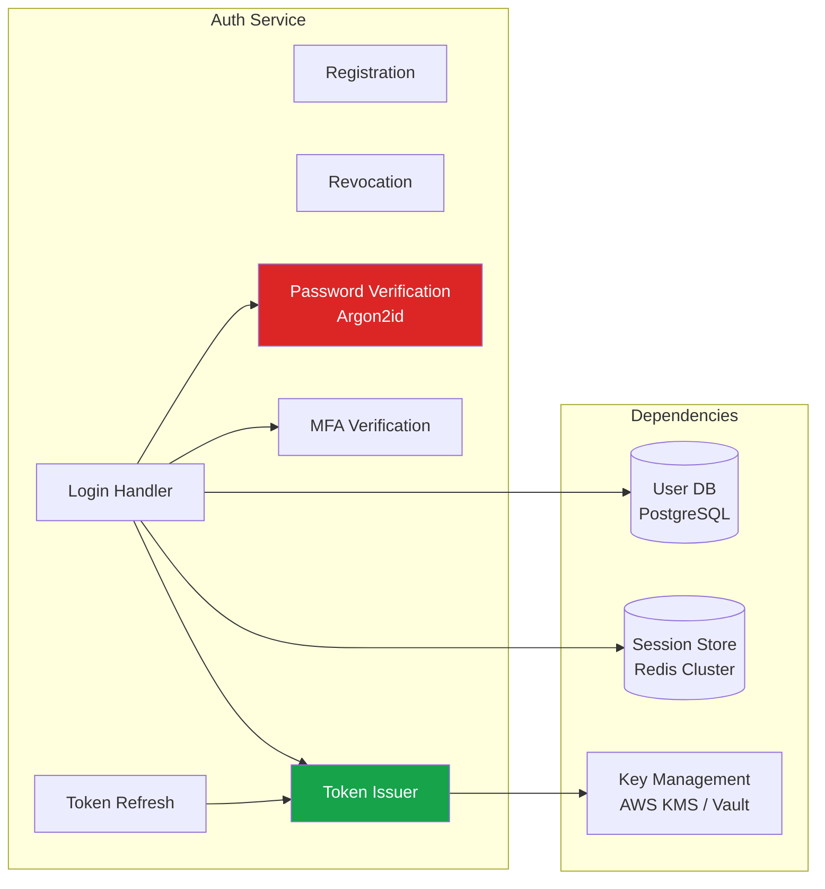
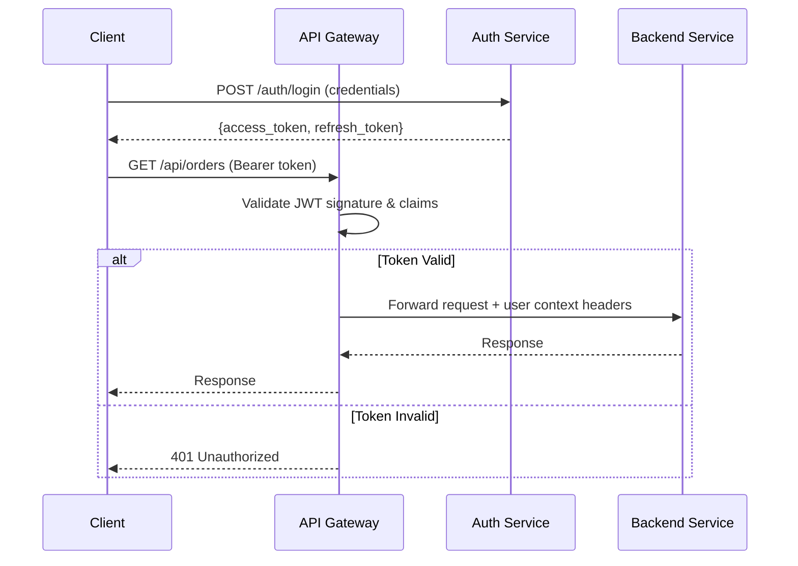
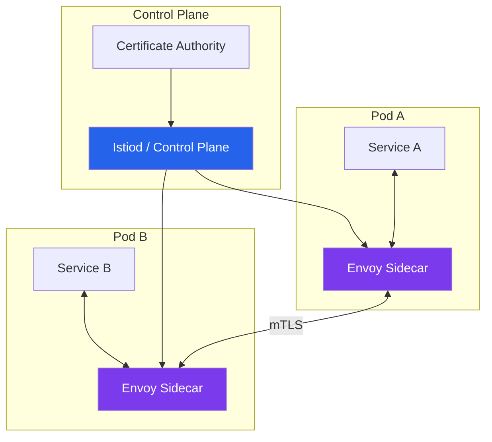
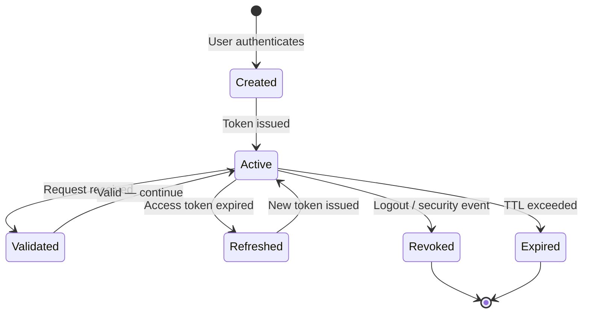
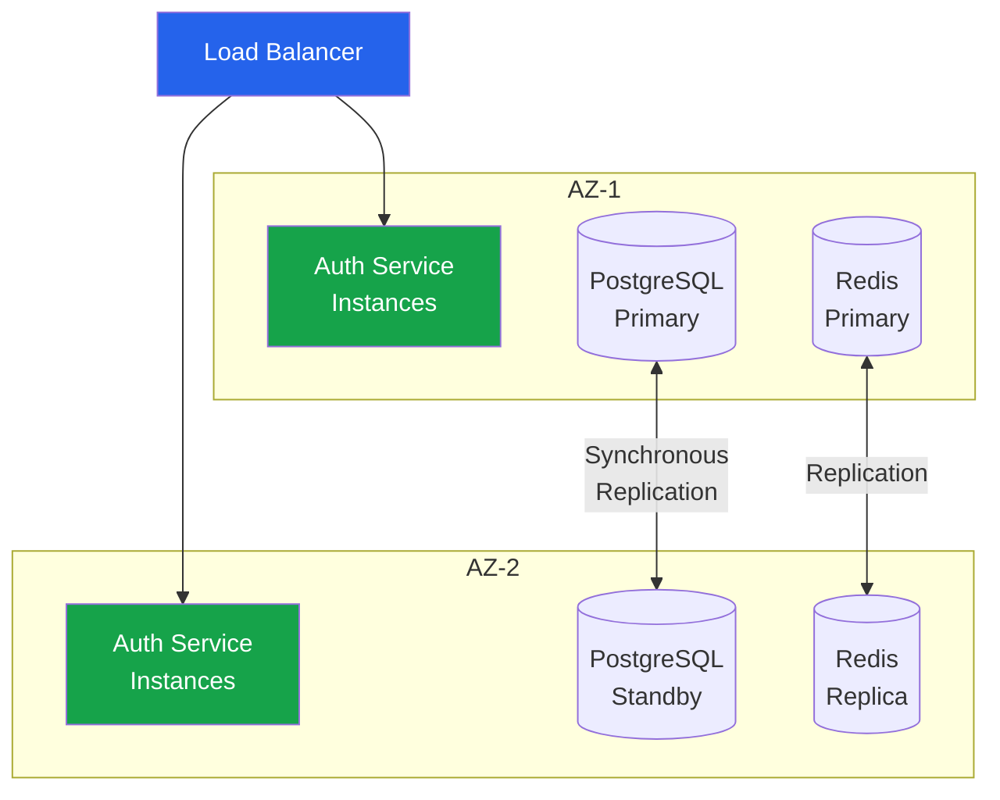
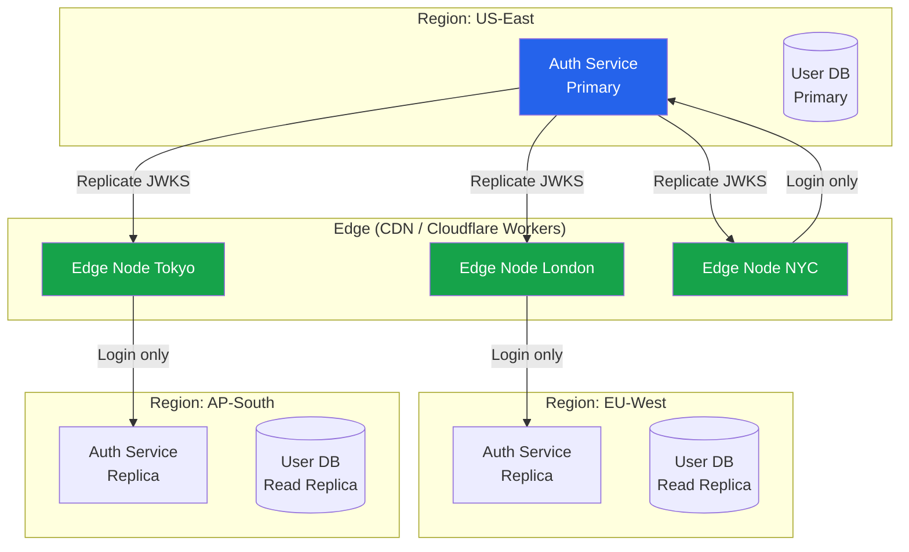
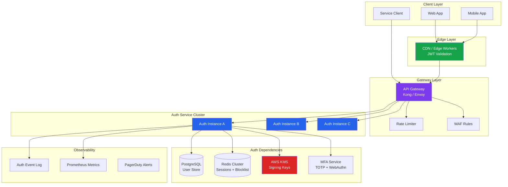

# Auth System Architecture

Authentication is the front door of every system. If the front door is slow, unavailable, or compromised, nothing else matters. This page covers how to design an authentication system that handles millions of requests, survives regional outages, and remains secure under attack. These patterns are drawn from production systems at companies processing billions of auth decisions per day.

## Centralized vs Federated Authentication

The first architectural decision is whether to centralize authentication into a single service or federate it across multiple identity providers.

### Centralized Authentication

A single auth service handles all identity verification. Every login, token issuance, and token validation flows through one system.



**Advantages:**

- Single source of truth for identity
- Consistent security policies across all clients
- Simplified audit trail — all auth events in one log
- Easier to patch vulnerabilities — one codebase

**Disadvantages:**

- Single point of failure (mitigated by HA, but the blast radius is total)
- Can become a bottleneck at scale
- Cross-region latency for global deployments
- Organizational bottleneck — one team owns all auth changes

### Federated Authentication

Multiple identity providers coexist. Users authenticate against whichever IdP manages their identity, and the application trusts tokens from all federated providers.



**Advantages:**

- Users authenticate with their existing identity (SSO)
- No need to manage passwords for enterprise customers
- Resilience — one IdP failure does not block all users
- Scales naturally with organizational boundaries

**Disadvantages:**

- Claims normalization is complex (every IdP has different claim formats)
- Trust management — you must validate certificates and metadata from each IdP
- Debugging auth failures spans multiple systems
- Security is only as strong as the weakest federated IdP

### Decision Framework

| Factor | Centralized | Federated |
|--------|-------------|-----------|
| **B2C SaaS** | Preferred — you own the user database | Add social login as lightweight federation |
| **B2B SaaS** | Not sufficient — enterprise customers demand SSO | Required — each customer brings their own IdP |
| **Internal tools** | Preferred — single corporate IdP | Needed when acquiring companies with different IdPs |
| **Microservices** | Auth service issues tokens, services validate locally | Rarely needed within a single organization |
| **Compliance (SOC 2, HIPAA)** | Easier to audit one system | Must audit trust relationships and all IdPs |

## Auth Service Design Patterns

### Pattern 1: Dedicated Auth Microservice

The auth service is a standalone microservice that handles registration, login, token issuance, token refresh, and token revocation. Other services never touch credentials directly.



::: tip When to Use
This is the default pattern for most production systems. It provides clear ownership, a minimal attack surface (only the auth service handles credentials), and allows the auth team to deploy independently.
:::

### Pattern 2: API Gateway Authentication

The API gateway handles token validation before requests reach backend services. The auth service still issues tokens, but the gateway enforces authentication on every request.



**Gateway validation approaches:**

| Approach | Latency | Freshness | Complexity |
|----------|---------|-----------|------------|
| JWT local validation | <1ms | No real-time revocation | Low — just verify signature |
| Token introspection (RFC 7662) | 5-50ms | Real-time revocation check | Medium — requires auth service call |
| JWT + short expiry + blocklist | 1-5ms | Near real-time (blocklist check) | Medium — Redis lookup per request |

### Pattern 3: Sidecar Authentication (Service Mesh)

In a service mesh architecture, authentication is handled by a sidecar proxy (Envoy, Linkerd) attached to every service. The application code never sees raw tokens.



::: warning Sidecar Auth Limitations
Sidecar authentication handles service-to-service mTLS well, but user-facing authentication (login, MFA, session management) still requires a dedicated auth service. The sidecar enforces auth policies — it does not replace the identity provider.
:::

## Token Lifecycle Management

Every token has a lifecycle: creation, validation, refresh, and revocation. Mismanaging any stage creates vulnerabilities.



### Token Issuance

```typescript
// Production token issuance — TypeScript with jose
import { SignJWT, importPKCS8 } from 'jose';
import { randomUUID } from 'crypto';

interface TokenPayload {
  userId: string;
  roles: string[];
  tenantId: string;
  sessionId: string;
}

async function issueTokenPair(payload: TokenPayload) {
  const privateKey = await importPKCS8(
    process.env.AUTH_PRIVATE_KEY!,
    'ES256'
  );

  const jti = randomUUID();
  const now = Math.floor(Date.now() / 1000);

  const accessToken = await new SignJWT({
    sub: payload.userId,
    roles: payload.roles,
    tid: payload.tenantId,
    sid: payload.sessionId,
  })
    .setProtectedHeader({ alg: 'ES256', kid: process.env.KEY_ID })
    .setIssuedAt(now)
    .setExpirationTime(now + 900) // 15 minutes
    .setJti(jti)
    .setIssuer('https://auth.example.com')
    .setAudience('https://api.example.com')
    .sign(privateKey);

  const refreshToken = await new SignJWT({
    sub: payload.userId,
    sid: payload.sessionId,
    type: 'refresh',
  })
    .setProtectedHeader({ alg: 'ES256', kid: process.env.KEY_ID })
    .setIssuedAt(now)
    .setExpirationTime(now + 604800) // 7 days
    .setJti(randomUUID())
    .setIssuer('https://auth.example.com')
    .sign(privateKey);

  return { accessToken, refreshToken, expiresIn: 900 };
}
```

### Token Validation Pipeline

Every incoming request passes through a validation pipeline. The order matters — fail fast on cheap checks.

```
1. Extract token from Authorization header
2. Decode header (no crypto) — check algorithm allowlist
3. Check kid — look up the correct public key
4. Verify signature — reject if invalid
5. Check exp — reject if expired
6. Check nbf — reject if not yet valid
7. Check iss — reject if wrong issuer
8. Check aud — reject if wrong audience
9. Check blocklist — reject if revoked (Redis lookup)
10. Extract claims — attach to request context
```

::: danger Never Skip Steps
A common mistake is validating the signature but ignoring `aud` (audience). This allows tokens issued for Service A to be replayed against Service B. Every claim exists for a reason.
:::

## Auth Service High-Availability Patterns

Authentication must be more available than any service it protects. If the auth service is down, every service is effectively down.

### Active-Active Deployment

Deploy the auth service in at least two availability zones with independent databases that replicate synchronously.



### Graceful Degradation

When the auth service is degraded, the system should not go fully offline. Design fallback behaviors:

| Component Failure | Degradation Strategy |
|-------------------|---------------------|
| User database down | Reject new logins, continue validating existing tokens (JWT = stateless) |
| Redis down | Fall back to local in-memory cache for token blocklist (accept brief revocation delay) |
| MFA provider down | Allow password-only login with stepped-down permissions |
| Key management down | Use cached signing keys (rotate less frequently) |
| Entire auth service down | API gateway validates existing JWTs locally; no new logins |

::: warning Degraded Mode Security
Every degradation decision trades security for availability. Document each trade-off explicitly and set alerts so the team knows when the system is operating in degraded mode. Degraded mode should never last more than minutes.
:::

### Health Check Design

Auth service health checks must be granular:

```typescript
// Health check endpoint — /auth/health
interface HealthStatus {
  status: 'healthy' | 'degraded' | 'unhealthy';
  checks: {
    database: 'up' | 'down';
    redis: 'up' | 'down';
    keyStore: 'up' | 'down';
    mfaProvider: 'up' | 'down';
  };
  latency: {
    dbReadMs: number;
    redisReadMs: number;
  };
}

app.get('/auth/health', async (req, res) => {
  const db = await checkDatabase();
  const redis = await checkRedis();
  const keys = await checkKeyStore();
  const mfa = await checkMfaProvider();

  const allUp = db && redis && keys && mfa;
  const criticalUp = db && keys; // Minimum for operation

  res.status(allUp ? 200 : criticalUp ? 207 : 503).json({
    status: allUp ? 'healthy' : criticalUp ? 'degraded' : 'unhealthy',
    checks: {
      database: db ? 'up' : 'down',
      redis: redis ? 'up' : 'down',
      keyStore: keys ? 'up' : 'down',
      mfaProvider: mfa ? 'up' : 'down',
    },
  });
});
```

## Multi-Region Auth

Global applications cannot route every auth request to a single region. A user in Tokyo should not wait 200ms for a round trip to `us-east-1` on every API call.

### Edge Token Validation

The core insight: **token issuance can be centralized, but token validation must be distributed.**



### JWKS Distribution

Distribute the JSON Web Key Set (JWKS) to every edge node. Edge nodes cache the public keys and validate JWT signatures locally — no network call to the auth service.

```typescript
// Edge worker — validate JWT at the edge (Cloudflare Workers example)
import { jwtVerify, createRemoteJWKSet } from 'jose';

const JWKS = createRemoteJWKSet(
  new URL('https://auth.example.com/.well-known/jwks.json'),
  {
    cacheMaxAge: 600_000,    // Cache keys for 10 minutes
    cooldownDuration: 30_000, // Wait 30s before re-fetching on failure
  }
);

export default {
  async fetch(request: Request): Promise<Response> {
    const authHeader = request.headers.get('Authorization');
    if (!authHeader?.startsWith('Bearer ')) {
      return new Response('Unauthorized', { status: 401 });
    }

    try {
      const { payload } = await jwtVerify(
        authHeader.slice(7),
        JWKS,
        {
          issuer: 'https://auth.example.com',
          audience: 'https://api.example.com',
          algorithms: ['ES256'],
        }
      );

      // Attach user context and forward to origin
      const headers = new Headers(request.headers);
      headers.set('X-User-Id', payload.sub as string);
      headers.set('X-User-Roles', JSON.stringify(payload.roles));
      headers.delete('Authorization'); // Don't forward token to origin

      return fetch(request.url, { headers });
    } catch (err) {
      return new Response('Invalid token', { status: 401 });
    }
  },
};
```

### Multi-Region Token Revocation

The challenge: when a user logs out in Tokyo, how quickly does every edge node know the token is revoked?

| Strategy | Propagation Delay | Complexity | Cost |
|----------|-------------------|------------|------|
| Short-lived tokens (5-15 min) | Up to token TTL | Low | Low |
| Global Redis (ElastiCache Global) | 1-2 seconds | Medium | Medium |
| Pub/sub blocklist (Kafka/NATS) | Sub-second | High | High |
| CRDTs for distributed blocklist | Sub-second | Very high | Medium |

::: tip Production Recommendation
Use short-lived access tokens (15 minutes) combined with a global Redis blocklist for critical revocations (compromised accounts, password changes). Most revocations can wait for natural token expiry. Only push to the global blocklist for security-critical events.
:::

## Production Architecture Diagram

This is the complete architecture of a production authentication system handling 50,000+ requests per second across three regions.



## Key Design Principles

1. **Auth service owns credentials, nothing else does.** No other service should ever store, hash, or verify passwords. The auth service is the only writer to the user credentials table.

2. **Validate tokens everywhere, issue tokens in one place.** Distribute public keys broadly. Keep private signing keys in a single, hardened key management system.

3. **Design for failure.** The auth service will go down. Plan what happens when it does — which requests continue, which block, and how quickly you recover.

4. **Log everything, expose nothing.** Every authentication attempt (success and failure) should be logged with IP, user agent, and timestamp. Never log passwords, tokens, or session IDs.

5. **Rotate keys without downtime.** Use `kid` (Key ID) in JWT headers. Publish the new key in JWKS before signing with it. Remove the old key only after all tokens signed with it have expired.

## Further Reading

- [JWT Deep Dive](./jwt-deep-dive.md) — Token structure, signing algorithms, and claims design
- [OAuth 2.0 & OIDC](./oauth2-oidc.md) — Authorization flows and OpenID Connect
- [Session Management](./session-management.md) — Server-side session architecture
- [Token Strategies Deep Dive](./token-strategies.md) — JWT vs opaque tokens, DPoP, and revocation
- [Enterprise SSO](./enterprise-sso.md) — SAML, OIDC, and SCIM for multi-tenant systems
- [API Gateway Pattern](/architecture-patterns/microservices/api-gateway-pattern.md) — Gateway design for authentication offloading
- [Zero Trust Principles](/security/zero-trust/principles.md) — Never trust, always verify
