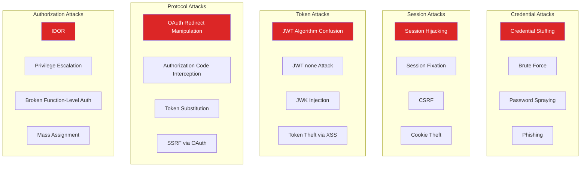
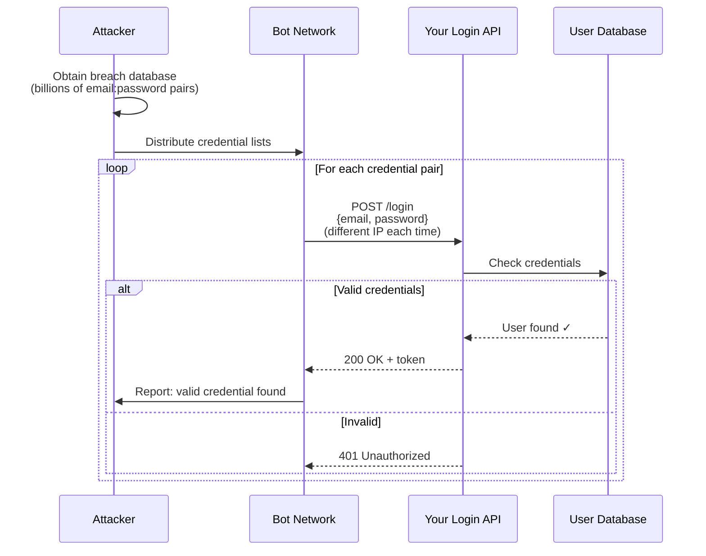
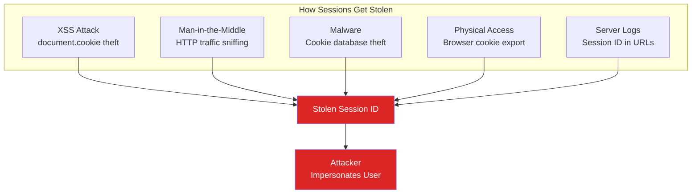
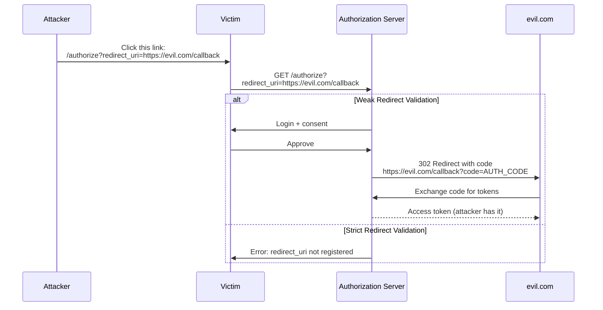
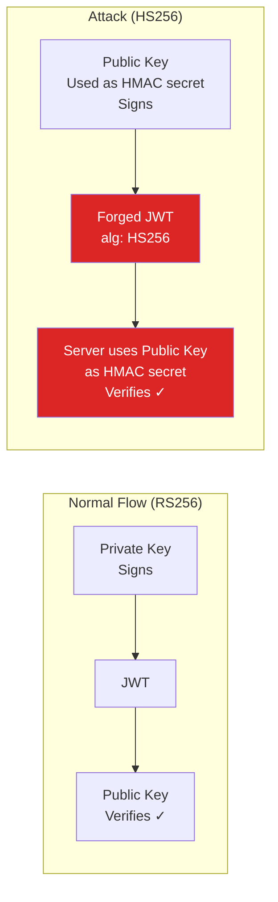
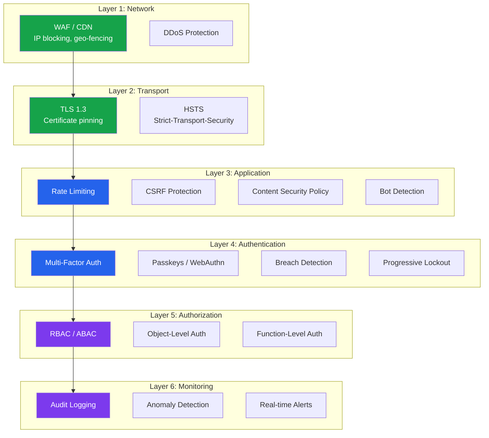

# Auth Attacks & Defenses

Every authentication system is under constant attack. Understanding the attack landscape is not optional — it is a prerequisite for building defensible systems. This page catalogs every major auth attack vector with detection techniques, defense implementations, and real-world incident examples. Treat this as your threat model reference for authentication systems.

## Attack Taxonomy



## Credential Stuffing

### The Attack

Attackers use credentials leaked from one breach to attempt login on other services. Because 65%+ of users reuse passwords, a significant percentage of attempts succeed.



### Detection Signals

| Signal | Description | Detection Method |
|--------|-------------|-----------------|
| **High failure rate from IP** | >10 failures per minute | Per-IP counter with Redis |
| **Many usernames from one IP** | Different emails, same IP | Track unique emails per IP |
| **Known credential pair** | Email+password in breach DB | Check against HaveIBeenPwned API |
| **Non-human timing** | Requests at perfectly regular intervals | Jitter analysis |
| **Missing browser signals** | No JavaScript execution, no cookies | Challenge with JavaScript proof-of-work |
| **Residential proxy IPs** | Attacker rotates through residential proxies | IP reputation scoring |

### Defense Implementation

```typescript
import { createHash } from 'crypto';

// Defense 1: Breached password check (k-anonymity model)
async function isPasswordBreached(password: string): Promise<boolean> {
  const hash = createHash('sha1').update(password).digest('hex').toUpperCase();
  const prefix = hash.slice(0, 5);
  const suffix = hash.slice(5);

  // k-anonymity: only send first 5 chars of hash
  const response = await fetch(
    `https://api.pwnedpasswords.com/range/${prefix}`,
    { headers: { 'Add-Padding': 'true' } } // Prevents response size analysis
  );

  const text = await response.text();
  const lines = text.split('\n');

  for (const line of lines) {
    const [hashSuffix, count] = line.split(':');
    if (hashSuffix.trim() === suffix) {
      return true; // Password has been breached
    }
  }

  return false;
}

// Defense 2: Progressive delays
const DELAY_MAP: Record<number, number> = {
  1: 0,       // No delay for first attempt
  2: 0,       // No delay
  3: 1000,    // 1 second
  4: 2000,    // 2 seconds
  5: 5000,    // 5 seconds
  6: 10000,   // 10 seconds
  7: 30000,   // 30 seconds
};

async function getLoginDelay(identifier: string): Promise<number> {
  const attempts = await redis.get(`login_attempts:${identifier}`);
  const count = parseInt(attempts || '0', 10);
  return DELAY_MAP[Math.min(count, 7)] || 60000; // Max 60s
}

// Defense 3: Device-based rate limiting
// Even if attacker rotates IPs, the device fingerprint stays the same
async function checkDeviceRateLimit(
  deviceFingerprint: string
): Promise<boolean> {
  const key = `device_login:${deviceFingerprint}`;
  const count = await redis.incr(key);
  if (count === 1) await redis.expire(key, 3600); // 1 hour window
  return count <= 20; // Max 20 login attempts per device per hour
}
```

::: danger Do Not Reveal Valid Usernames
Always return the same response for invalid username and invalid password:
`"Invalid email or password"`. If you return `"User not found"` vs `"Wrong password"`, attackers can enumerate valid accounts first, then focus credential stuffing on confirmed accounts.
:::

## Brute Force

### Defense: Progressive Lockout

```typescript
interface LockoutState {
  attempts: number;
  lockedUntil: Date | null;
  lastAttempt: Date;
}

async function handleFailedLogin(
  userId: string,
  ip: string
): Promise<{ locked: boolean; lockDuration?: number }> {
  const key = `lockout:${userId}`;
  const state = await redis.hgetall(key);
  const attempts = parseInt(state.attempts || '0') + 1;

  // Update attempt count
  await redis.hset(key, {
    attempts: attempts.toString(),
    lastAttempt: Date.now().toString(),
  });
  await redis.expire(key, 86400); // Reset after 24 hours

  // Progressive lockout
  if (attempts >= 10) {
    const lockDuration = 3600; // 1 hour
    await redis.hset(key, 'lockedUntil',
      (Date.now() + lockDuration * 1000).toString());
    await notifyUser(userId, 'account_locked', { attempts, lockDuration });
    return { locked: true, lockDuration };
  }

  if (attempts >= 5) {
    const lockDuration = 300; // 5 minutes
    await redis.hset(key, 'lockedUntil',
      (Date.now() + lockDuration * 1000).toString());
    return { locked: true, lockDuration };
  }

  if (attempts >= 3) {
    // Require CAPTCHA but do not lock
    return { locked: false };
  }

  return { locked: false };
}

// Check if account is locked before processing login
async function isAccountLocked(userId: string): Promise<boolean> {
  const lockedUntil = await redis.hget(`lockout:${userId}`, 'lockedUntil');
  if (!lockedUntil) return false;
  return Date.now() < parseInt(lockedUntil);
}

// Reset on successful login
async function handleSuccessfulLogin(userId: string): Promise<void> {
  await redis.del(`lockout:${userId}`);
}
```

::: warning Account Lockout Denial-of-Service
If you lock accounts after N failures, an attacker can intentionally lock out any user by sending N bad attempts. Mitigate by:
1. Locking by IP+account pair, not just account
2. Allowing CAPTCHA bypass instead of hard lockout
3. Sending unlock links via email
4. Using progressive delays instead of full lockout
:::

## Session Hijacking

### Attack Vectors



### Defense: Cookie Security + Session Binding

```typescript
// Maximum cookie security configuration
const COOKIE_CONFIG = {
  httpOnly: true,       // Blocks document.cookie access (prevents XSS theft)
  secure: true,         // HTTPS only (prevents MITM sniffing)
  sameSite: 'lax',      // Blocks cross-site requests (prevents CSRF)
  path: '/',            // Required for __Host- prefix
  maxAge: 86400 * 1000, // 24 hours
  // No 'domain' attribute — required for __Host- prefix
  // Use __Host- prefix in cookie name
};

// Session binding — tie session to device characteristics
async function validateSessionBinding(
  session: SessionData,
  req: Request
): Promise<boolean> {
  // Binding 1: User-Agent (catches crude theft)
  if (session.userAgent !== req.headers['user-agent']) {
    await auditLog.warn('session_ua_mismatch', {
      sessionId: session.id,
      expected: session.userAgent,
      actual: req.headers['user-agent'],
    });
    return false;
  }

  // Binding 2: TLS session (if using mutual TLS)
  // Not applicable for most web apps but essential for API-to-API

  // Binding 3: DPoP token binding (RFC 9449)
  // If using DPoP, verify the proof matches the session's key thumbprint
  if (session.dpopThumbprint) {
    const dpopProof = req.headers['dpop'];
    if (!dpopProof || !verifyDPoPBinding(dpopProof, session.dpopThumbprint)) {
      return false;
    }
  }

  return true;
}
```

## CSRF (Cross-Site Request Forgery)

### The Attack



```mermaid
sequenceDiagram
    participant User
    participant EvilSite as evil-site.com
    participant Bank as bank.com

    User->>Bank: Login to bank.com
    Bank-->>User: Set-Cookie: session=abc123

    User->>EvilSite: Visit evil-site.com<br/>(phishing link in email)

    EvilSite->>EvilSite: Page loads hidden form:<br/><form action="bank.com/transfer"><br/><input name="to" value="attacker"><br/><input name="amount" value="10000">

    EvilSite->>Bank: POST bank.com/transfer<br/>Cookie: session=abc123 (auto-attached)<br/>to=attacker&amount=10000

    Bank->>Bank: Valid session cookie ✓<br/>Process transfer ✓

    Note over User,Bank: User's money transferred<br/>without their knowledge
```

### Defense Strategies

| Strategy | How It Works | Limitations |
|----------|-------------|-------------|
| **SameSite=Lax cookies** | Browser does not send cookie on cross-site POST | Some old browsers do not support |
| **SameSite=Strict cookies** | Browser never sends cookie cross-site | Breaks legitimate cross-site navigation |
| **Synchronizer Token Pattern** | Server-generated token in form + session; verify match | Requires server-side state |
| **Double-Submit Cookie** | Random token in cookie + request header; server verifies match | Does not require server state |
| **Origin/Referer check** | Verify Origin or Referer header matches expected domain | Headers can be stripped by proxies |
| **Custom request header** | Require `X-Requested-With` or similar | Only works for AJAX, not form submissions |

### Double-Submit Cookie Implementation

```typescript
import { randomBytes, timingSafeEqual } from 'crypto';

// Generate CSRF token on session creation
function generateCSRFToken(): string {
  return randomBytes(32).toString('hex');
}

// Middleware: Set CSRF token cookie + validate on mutations
function csrfProtection(req: Request, res: Response, next: NextFunction): void {
  // Skip for safe methods
  if (['GET', 'HEAD', 'OPTIONS'].includes(req.method)) {
    // Ensure CSRF cookie exists
    if (!req.cookies['csrf-token']) {
      const token = generateCSRFToken();
      res.cookie('csrf-token', token, {
        httpOnly: false,  // JavaScript MUST read this
        secure: true,
        sameSite: 'strict',
        path: '/',
        maxAge: 86400 * 1000,
      });
    }
    return next();
  }

  // Mutation request — validate CSRF token
  const cookieToken = req.cookies['csrf-token'];
  const headerToken = req.headers['x-csrf-token'] as string;

  if (!cookieToken || !headerToken) {
    return res.status(403).json({ error: 'CSRF token missing' });
  }

  // Constant-time comparison
  const cookieBuffer = Buffer.from(cookieToken);
  const headerBuffer = Buffer.from(headerToken);

  if (cookieBuffer.length !== headerBuffer.length ||
      !timingSafeEqual(cookieBuffer, headerBuffer)) {
    await auditLog.warn('csrf_validation_failed', {
      ip: req.ip,
      path: req.path,
      origin: req.headers.origin,
    });
    return res.status(403).json({ error: 'CSRF token invalid' });
  }

  next();
}
```

::: tip SameSite=Lax Is Often Sufficient
If all your state-changing operations use POST/PUT/DELETE (not GET), and your cookies use `SameSite=Lax`, you have CSRF protection without any token mechanism. `Lax` blocks cross-site POST requests while allowing cross-site GET navigation (so links from emails still work). Add token-based CSRF protection as defense-in-depth for critical operations.
:::

## Token Theft (XSS to Token Exfiltration)

### The Attack Chain

```
1. Attacker finds XSS vulnerability (stored or reflected)
2. Injected script runs in victim's browser context
3. Script reads token from:
   - localStorage (most common)
   - sessionStorage
   - document.cookie (if not HttpOnly)
   - JavaScript variables
4. Script sends token to attacker's server
5. Attacker uses token to impersonate victim
```

### Secure Token Storage Patterns

| Storage | XSS Readable? | CSRF Risk? | Persistence | Recommendation |
|---------|--------------|------------|-------------|---------------|
| `localStorage` | Yes | No | Permanent | Never for auth tokens |
| `sessionStorage` | Yes | No | Tab only | Never for auth tokens |
| `document.cookie` | Yes (if not HttpOnly) | Yes | Configurable | Only with HttpOnly |
| `HttpOnly cookie` | No | Yes (mitigate with SameSite) | Configurable | Best for web apps |
| `Memory variable` | Yes (but harder) | No | Page lifetime | Good for SPAs (with refresh) |
| `Service Worker` | No (isolated scope) | No | Worker lifetime | Experimental |

::: danger localStorage Is Never Safe for Tokens
Any XSS vulnerability anywhere in your application (including third-party scripts) can read `localStorage`. An attacker does not need XSS in your auth code — XSS in a marketing widget, analytics script, or chat plugin is sufficient. Use HttpOnly cookies for token storage, always.
:::

### SPA Token Storage Pattern

```typescript
// In-memory token storage for SPAs
// Tokens exist only in JavaScript memory — XSS cannot easily extract them
// from closure scope, and they disappear on page refresh

class TokenStore {
  private accessToken: string | null = null;
  private refreshTimer: ReturnType<typeof setTimeout> | null = null;

  setTokens(access: string, expiresIn: number): void {
    this.accessToken = access;

    // Auto-refresh before expiry
    if (this.refreshTimer) clearTimeout(this.refreshTimer);
    this.refreshTimer = setTimeout(
      () => this.refreshAccessToken(),
      (expiresIn - 60) * 1000 // Refresh 60s before expiry
    );
  }

  getAccessToken(): string | null {
    return this.accessToken;
  }

  private async refreshAccessToken(): Promise<void> {
    // Refresh token is in HttpOnly cookie — sent automatically
    const response = await fetch('/auth/refresh', {
      method: 'POST',
      credentials: 'include', // Send HttpOnly cookie
    });

    if (response.ok) {
      const { accessToken, expiresIn } = await response.json();
      this.setTokens(accessToken, expiresIn);
    } else {
      // Refresh failed — redirect to login
      this.accessToken = null;
      window.location.href = '/login';
    }
  }

  clear(): void {
    this.accessToken = null;
    if (this.refreshTimer) clearTimeout(this.refreshTimer);
  }
}
```

## OAuth Redirect Attacks

### Open Redirect via redirect_uri



### Defense

```typescript
// Strict redirect URI validation — exact match only
function validateRedirectUri(
  requestedUri: string,
  registeredUris: string[]
): boolean {
  // EXACT match — no wildcards, no subpaths, no query params
  return registeredUris.includes(requestedUri);

  // WRONG approaches:
  // ❌ requestedUri.startsWith(registeredUri) — allows /callback/../../evil
  // ❌ new URL(requestedUri).hostname === allowedHost — allows subdomains
  // ❌ regex matching — complex and error-prone
}
```

### state Parameter for CSRF Prevention

```typescript
// Always use a cryptographic state parameter
async function initiateOAuthFlow(req: Request, res: Response): Promise<void> {
  const state = randomBytes(32).toString('hex');

  // Store state in session — verify on callback
  req.session.oauthState = state;
  req.session.oauthStateCreatedAt = Date.now();

  const authUrl = new URL('https://auth.example.com/authorize');
  authUrl.searchParams.set('response_type', 'code');
  authUrl.searchParams.set('client_id', CLIENT_ID);
  authUrl.searchParams.set('redirect_uri', REDIRECT_URI);
  authUrl.searchParams.set('state', state);
  authUrl.searchParams.set('code_challenge', pkceChallenge);
  authUrl.searchParams.set('code_challenge_method', 'S256');

  res.redirect(authUrl.toString());
}

async function handleOAuthCallback(req: Request, res: Response): Promise<void> {
  const { code, state } = req.query;

  // Validate state
  if (!state || state !== req.session.oauthState) {
    return res.status(403).json({ error: 'Invalid state parameter — CSRF detected' });
  }

  // Check state age (prevent replay)
  const stateAge = Date.now() - (req.session.oauthStateCreatedAt || 0);
  if (stateAge > 600000) { // 10 minutes
    return res.status(403).json({ error: 'OAuth state expired' });
  }

  // Clear state (one-time use)
  delete req.session.oauthState;
  delete req.session.oauthStateCreatedAt;

  // Exchange code for tokens (with PKCE verifier)
  // ...
}
```

## JWT Attacks

### Attack 1: none Algorithm

The attacker modifies the JWT header to `"alg": "none"` and removes the signature. If the server does not validate the algorithm, it accepts unsigned tokens.

```json
// Attacker-crafted token
{
  "header": { "alg": "none", "typ": "JWT" },
  "payload": { "sub": "admin", "role": "superadmin" },
  "signature": ""  // Empty — no signature
}
```

**Defense:** Always specify an explicit algorithm allowlist. Never accept `none`.

```typescript
import { jwtVerify } from 'jose';

const { payload } = await jwtVerify(token, publicKey, {
  algorithms: ['ES256'],  // ONLY accept ES256
  // If someone sends alg: "none", alg: "HS256", etc., it is rejected
});
```

### Attack 2: Key Confusion (RS256 → HS256)

If the server uses RS256 (asymmetric), the attacker changes the algorithm to HS256 (symmetric) and signs the token with the public key (which is publicly available). If the server uses the same key for both algorithms, it validates the HS256 signature using the public key as the HMAC secret.



**Defense:** Use algorithm allowlists and separate keys per algorithm.

```typescript
// WRONG — vulnerable to key confusion
const decoded = jwt.verify(token, publicKey); // Accepts any algorithm

// CORRECT — explicit algorithm
const decoded = jwt.verify(token, publicKey, { algorithms: ['ES256'] });
```

### Attack 3: JWK Injection (jwk Header)

The attacker embeds their own public key in the JWT `jwk` header parameter. If the server extracts the key from the header to verify the signature, the attacker controls the verification key.

```json
{
  "header": {
    "alg": "RS256",
    "jwk": {
      "kty": "RSA",
      "n": "attacker_public_key...",
      "e": "AQAB"
    }
  }
}
```

**Defense:** Never extract the verification key from the token itself. Always use server-side key storage or a trusted JWKS endpoint.

```typescript
// WRONG — trusting the token's embedded key
const key = token.header.jwk;
jwt.verify(token, key); // Attacker controls the key!

// CORRECT — use server-side JWKS
const JWKS = createRemoteJWKSet(
  new URL('https://auth.example.com/.well-known/jwks.json')
);
const { payload } = await jwtVerify(token, JWKS, {
  algorithms: ['ES256'],
  issuer: 'https://auth.example.com',
});
```

### JWT Security Checklist

| Check | Status | Attack Prevented |
|-------|--------|-----------------|
| Algorithm allowlist (never accept `none`) | Required | none algorithm, key confusion |
| Verify `exp` claim | Required | Expired token replay |
| Verify `iss` claim | Required | Token from wrong issuer |
| Verify `aud` claim | Required | Cross-service token reuse |
| Never extract key from token header | Required | JWK injection |
| Use `kid` for key lookup from trusted store | Required | Key confusion |
| Verify `nbf` (not before) if present | Recommended | Premature token use |
| Check token blocklist | Recommended | Revoked token use |
| Validate claims types (string, number, etc.) | Recommended | Type confusion |

## Privilege Escalation

### IDOR (Insecure Direct Object Reference)

The attacker modifies an object ID in the request to access another user's resources.

```
GET /api/users/123/invoices     → User 123's invoices (legitimate)
GET /api/users/456/invoices     → User 456's invoices (unauthorized!)
GET /api/users/1/invoices       → Admin's invoices (critical!)
```

**Defense:**

```typescript
// WRONG — trusts the URL parameter
app.get('/api/users/:userId/invoices', async (req, res) => {
  const invoices = await db.invoices.findByUserId(req.params.userId);
  res.json(invoices);
});

// CORRECT — enforces ownership
app.get('/api/users/:userId/invoices', async (req, res) => {
  // The authenticated user can only access their own resources
  if (req.params.userId !== req.user.id && !req.user.roles.includes('admin')) {
    return res.status(403).json({ error: 'Forbidden' });
  }
  const invoices = await db.invoices.findByUserId(req.params.userId);
  res.json(invoices);
});

// BETTER — do not use user ID in URL at all
app.get('/api/me/invoices', async (req, res) => {
  // Always use the authenticated user's ID from the session/token
  const invoices = await db.invoices.findByUserId(req.user.id);
  res.json(invoices);
});
```

### Broken Function-Level Authorization

The attacker accesses admin endpoints that lack authorization checks.

```
POST /api/admin/users/delete     → No auth check → anyone can delete users
PUT  /api/admin/config           → No auth check → anyone can modify config
```

**Defense:** Authorization middleware on every route, deny by default.

```typescript
// Deny by default — every route must explicitly declare required roles
function requireRole(...roles: string[]) {
  return (req: Request, res: Response, next: NextFunction) => {
    if (!req.user) {
      return res.status(401).json({ error: 'Not authenticated' });
    }

    const hasRole = roles.some(role => req.user!.roles.includes(role));
    if (!hasRole) {
      auditLog.warn('authorization_denied', {
        userId: req.user.id,
        requiredRoles: roles,
        userRoles: req.user.roles,
        path: req.path,
      });
      return res.status(403).json({ error: 'Insufficient permissions' });
    }

    next();
  };
}

// Apply to routes
app.delete('/api/admin/users/:id', requireRole('admin'), deleteUser);
app.put('/api/admin/config', requireRole('superadmin'), updateConfig);
```

## Bot Detection

### CAPTCHA and Alternatives

| Solution | User Friction | Bot Detection Rate | Privacy | Cost |
|----------|-------------|-------------------|---------|------|
| **reCAPTCHA v3** | None (invisible) | ~95% | Low (Google tracking) | Free up to 1M |
| **reCAPTCHA v2** | Medium (click checkbox) | ~98% | Low | Free up to 1M |
| **hCaptcha** | Medium | ~95% | Better than reCAPTCHA | Free tier available |
| **Turnstile (Cloudflare)** | None (invisible) | ~96% | High (no tracking) | Free |
| **Proof of work** | None (CPU cost) | ~90% | Perfect (no third party) | Free |
| **Behavioral analysis** | None | ~85% | High | Medium |

### Proof of Work (No Third Party)

Instead of a CAPTCHA, require the client to solve a computational puzzle. This makes automated attacks expensive without affecting legitimate users.

```typescript
// Server: Issue challenge
app.post('/auth/challenge', (req, res) => {
  const challenge = randomBytes(32).toString('hex');
  const difficulty = 4; // Number of leading zeros required in hash

  // Store challenge (prevents reuse)
  redis.setex(`pow:${challenge}`, 300, '1'); // 5 min expiry

  res.json({ challenge, difficulty });
});

// Server: Verify proof of work
app.post('/auth/login', async (req, res) => {
  const { email, password, challenge, nonce } = req.body;

  // Verify proof of work
  const exists = await redis.get(`pow:${challenge}`);
  if (!exists) {
    return res.status(400).json({ error: 'Invalid or expired challenge' });
  }

  const hash = createHash('sha256')
    .update(challenge + nonce)
    .digest('hex');

  const difficulty = 4;
  if (!hash.startsWith('0'.repeat(difficulty))) {
    return res.status(400).json({ error: 'Invalid proof of work' });
  }

  // Consume challenge (prevent reuse)
  await redis.del(`pow:${challenge}`);

  // Process login...
});
```

```typescript
// Client: Solve proof of work
async function solveProofOfWork(
  challenge: string,
  difficulty: number
): Promise<string> {
  const target = '0'.repeat(difficulty);
  let nonce = 0;

  while (true) {
    const hash = await crypto.subtle.digest(
      'SHA-256',
      new TextEncoder().encode(challenge + nonce)
    );
    const hexHash = Array.from(new Uint8Array(hash))
      .map(b => b.toString(16).padStart(2, '0'))
      .join('');

    if (hexHash.startsWith(target)) {
      return nonce.toString();
    }
    nonce++;

    // Yield to UI thread every 10,000 iterations
    if (nonce % 10000 === 0) {
      await new Promise(resolve => setTimeout(resolve, 0));
    }
  }
}
```

## Defense-in-Depth Summary



## Further Reading

- [JWT Deep Dive](./jwt-deep-dive.md) — JWT structure and signing to defend against token attacks
- [OAuth 2.0 Flows](./oauth2-flows.md) — Secure OAuth implementation with PKCE
- [Session Deep Dive](./session-deep-dive.md) — Session fixation and hijacking defense
- [MFA Engineering Deep Dive](./mfa-deep-dive.md) — MFA fatigue and adaptive authentication
- [Advanced Rate Limiting](/security/api-security/advanced-rate-limiting.md) — Distributed rate limiting for brute force defense
- [A01: Broken Access Control](/security/owasp/a01-broken-access-control.md) — OWASP access control vulnerabilities
- [A07: Authentication Failures](/security/owasp/a07-auth-failures.md) — OWASP authentication vulnerability patterns
- [Input Validation](/security/api-security/input-validation.md) — Preventing injection in auth flows
- [CSP Headers](/security/api-security/csp-headers.md) — Content Security Policy to prevent XSS
