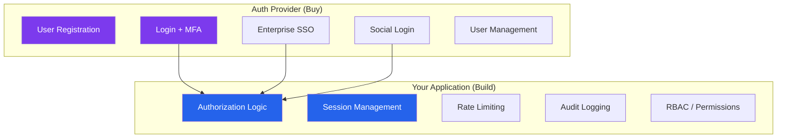
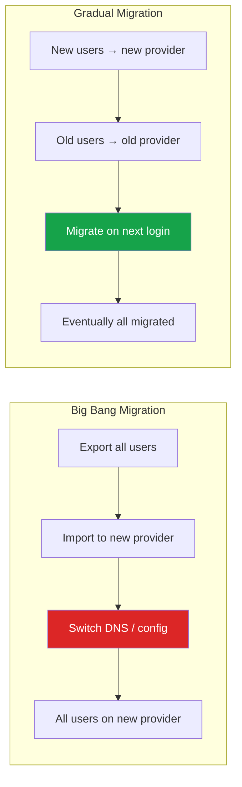

# Auth Provider Comparison

Choosing an auth provider is one of the highest-leverage decisions in a project's lifetime. The wrong choice costs months of migration work. The right choice eliminates an entire category of security vulnerabilities. This page provides a rigorous comparison of every major auth provider, a build-vs-buy decision framework, and migration strategies for when you inevitably need to switch.

## Build vs Buy Decision Framework

### When to Buy (Use a Provider)

| Signal | Why |
|--------|-----|
| Team size < 20 engineers | You cannot afford a dedicated auth engineer |
| Time to market < 6 months | Building auth from scratch takes 3-6 months for production quality |
| B2B SaaS needing enterprise SSO | SAML/SCIM implementation alone takes 2-4 months |
| Compliance requirements (SOC 2, HIPAA) | Providers come pre-certified |
| No security team | Auth bugs become breaches without dedicated security review |
| Multiple client types (web, mobile, API) | Providers handle all SDK variations |

### When to Build

| Signal | Why |
|--------|-----|
| Auth IS the product (identity platform) | You need full control of the auth experience |
| Extreme scale (100M+ users) | Provider pricing becomes prohibitive |
| Unusual auth requirements | Custom MFA flows, hardware token protocols, edge cases |
| Regulatory requirements forbid third-party data processing | PCI DSS Level 1, classified systems |
| Strong internal auth team (3+ engineers) | You can maintain and audit the system |
| Latency-critical (< 50ms auth decisions) | Provider round-trips add latency |

### The Hybrid Approach

Many production systems use a provider for the heavy lifting (SSO, MFA, user management) but keep critical auth decisions in-house (authorization, session management, rate limiting).



## Feature Comparison Matrix

### Core Authentication Features

| Feature | Auth0 | Clerk | Supabase Auth | Firebase Auth | Keycloak | FusionAuth |
|---------|-------|-------|---------------|---------------|----------|------------|
| **Email/password** | Yes | Yes | Yes | Yes | Yes | Yes |
| **Social login** | 50+ providers | 20+ providers | Google, GitHub, Apple, etc. | Google, Facebook, Apple, etc. | Configurable | 30+ providers |
| **Magic links** | Yes | Yes | Yes | Yes (email link) | Plugin | Yes |
| **Passkeys/WebAuthn** | Yes | Yes | Community plugin | No (planned) | Plugin | Yes |
| **TOTP MFA** | Yes | Yes | Yes (v2.55+) | No (phone only) | Yes | Yes |
| **SMS MFA** | Yes | Yes | Phone auth | Yes | Plugin | Yes |
| **Push MFA** | Guardian app | No | No | No | No | No |
| **Biometric** | Via WebAuthn | Via WebAuthn | No | No | Via WebAuthn | Via WebAuthn |

### Enterprise Features

| Feature | Auth0 | Clerk | Supabase Auth | Firebase Auth | Keycloak | FusionAuth |
|---------|-------|-------|---------------|---------------|----------|------------|
| **SAML SSO** | Yes | Yes (paid) | No | No | Yes | Yes |
| **OIDC SSO** | Yes | Yes | No | No | Yes | Yes |
| **SCIM provisioning** | Yes (Enterprise) | Yes (paid) | No | No | Yes | Yes (paid) |
| **Organizations/tenants** | Yes | Yes | No (manual) | No | Realms | Yes |
| **Custom domains** | Yes | Yes | Yes | No | Yes | Yes |
| **Branding/theming** | Universal Login | Pre-built components | Basic | Basic | Themes | Themes |
| **Breached password detection** | Yes | Yes | No | No | Plugin | Yes |
| **Bot detection** | Yes (captcha) | Smart bot protection | No | No | No | Yes (paid) |

### Developer Experience

| Feature | Auth0 | Clerk | Supabase Auth | Firebase Auth | Keycloak | FusionAuth |
|---------|-------|-------|---------------|---------------|----------|------------|
| **Setup time** | 30 min | 15 min | 15 min | 15 min | 1-2 hours | 30 min |
| **React SDK** | Yes | Excellent | Yes | Yes | Community | Yes |
| **Next.js support** | Good | Excellent | Good | Good | Community | Good |
| **React Native** | Yes | Yes | Yes | Excellent | Community | Yes |
| **API quality** | Excellent | Excellent | Good | Good | Good | Excellent |
| **Documentation** | Excellent | Excellent | Good | Good | Good | Excellent |
| **TypeScript support** | Good | Excellent | Good | Good | N/A | Good |
| **Pre-built UI components** | Universal Login | Full component library | Basic | FirebaseUI | Themes | Community |
| **Webhooks** | Yes | Yes | Postgres triggers | Cloud Functions | Events | Yes |

### Self-Hosted vs Managed

| Provider | Self-Hosted | Managed Cloud | Air-Gapped |
|----------|------------|---------------|------------|
| **Auth0** | No (Private Cloud is managed) | Yes | No |
| **Clerk** | No | Yes | No |
| **Supabase Auth** | Yes (open source) | Yes | Yes |
| **Firebase Auth** | No | Yes (GCP only) | No |
| **Keycloak** | Yes (primary model) | Third-party managed | Yes |
| **FusionAuth** | Yes (Community edition) | Yes | Yes |

## Provider Deep Dives

### Auth0

**Best for:** Mid-to-large companies needing enterprise SSO and compliance.

```
Strengths:
- Most comprehensive enterprise feature set
- 50+ social login providers
- Actions (serverless hooks for custom logic)
- Universal Login (customizable hosted login page)
- SOC 2 Type II, HIPAA BAA, ISO 27001 certified

Weaknesses:
- Expensive at scale ($23/1000 MAU on Professional plan)
- Complex pricing model (features gated by tier)
- Lock-in risk (Actions API is proprietary)
- Migration out is painful (custom connection logic)
```

### Clerk

**Best for:** Modern web apps (Next.js, React) prioritizing developer experience and pre-built UI.

```
Strengths:
- Best-in-class React/Next.js components
- 15-minute setup with full auth UI
- Organizations and multi-tenancy built in
- Excellent TypeScript SDK
- Session management with device tracking

Weaknesses:
- Newer company (founded 2020)
- Limited enterprise features compared to Auth0
- No self-hosted option
- Smaller community and ecosystem
- Pricing can be high for large consumer apps
```

### Supabase Auth

**Best for:** PostgreSQL-native applications and teams already using Supabase.

```
Strengths:
- Free tier (50,000 MAU)
- Open source (GoTrue)
- Deep PostgreSQL integration (Row Level Security)
- Self-hostable
- Simple API

Weaknesses:
- No SAML/SCIM (enterprise SSO gap)
- Limited MFA (TOTP only, added late)
- No organizations/multi-tenancy
- Basic UI components
- GoTrue is a simpler auth server than Auth0/Keycloak
```

### Firebase Auth

**Best for:** Mobile-first applications in the Google ecosystem.

```
Strengths:
- Excellent mobile SDKs (iOS, Android, Flutter)
- Free tier (no cost for most auth features)
- Anonymous authentication for gradual onboarding
- Phone authentication with global SMS
- Deep GCP integration

Weaknesses:
- No SAML, SCIM, or enterprise SSO
- No WebAuthn/passkeys
- Limited customization
- GCP vendor lock-in
- No self-hosted option
- Firebase ecosystem is required
```

### Keycloak

**Best for:** Organizations requiring full control, self-hosting, and enterprise features without per-user pricing.

```
Strengths:
- Completely free and open source (Apache 2.0)
- Full SAML + OIDC + SCIM support
- Multi-realm (multi-tenant) architecture
- Identity brokering (federate with any IdP)
- LDAP/Active Directory integration
- No per-user pricing

Weaknesses:
- Significant operational burden (Java, requires DB, clustering)
- Steep learning curve
- UI is functional but not modern
- No managed cloud offering from Red Hat (community managed options exist)
- Customization requires Java SPI knowledge
- Resource-heavy (JVM memory requirements)
```

### FusionAuth

**Best for:** Companies that want enterprise features at a lower cost than Auth0, with self-hosting option.

```
Strengths:
- Self-hosted Community Edition is free
- Enterprise features at lower price than Auth0
- Excellent API documentation
- Advanced threat detection (paid)
- Multi-tenant architecture
- Fast setup

Weaknesses:
- Smaller ecosystem than Auth0/Keycloak
- Community edition lacks some features (SCIM, advanced MFA)
- Less third-party integration content
- Smaller community
```

## Pricing Comparison (as of 2026)

| Provider | Free Tier | Starter/Pro | Enterprise | Model |
|----------|-----------|-------------|------------|-------|
| **Auth0** | 25,000 MAU | $240/mo (Essential) | Custom | Per MAU |
| **Clerk** | 10,000 MAU | $25/mo + $0.02/MAU | Custom | Per MAU |
| **Supabase Auth** | 50,000 MAU | $25/mo (Pro) | Custom | Per project |
| **Firebase Auth** | Unlimited (basic) | Pay per verification (phone) | N/A | Per verification |
| **Keycloak** | Unlimited (self-host) | N/A | N/A | Free (infra costs) |
| **FusionAuth** | Unlimited (self-host) | $125/mo (Starter) | Custom | Per deployment |

::: tip Cost at Scale
At 100,000 MAU, approximate monthly costs:
- **Auth0 Professional:** ~$2,300/mo
- **Clerk Pro:** ~$1,825/mo
- **Supabase Pro:** ~$25/mo (auth is included in project pricing)
- **Firebase:** ~$0 (basic auth is free)
- **Keycloak:** ~$200-500/mo (infrastructure only)
- **FusionAuth Community:** ~$200-500/mo (infrastructure only)
:::

## Vendor Lock-In Risks

### What Creates Lock-In

| Lock-In Vector | Risk Level | Mitigation |
|---------------|------------|------------|
| **User data format** | Medium | Export users regularly; ensure email/password are standard |
| **Password hashes** | High | Providers may use proprietary hash formats; migration requires password reset |
| **Custom hooks/actions** | High | Business logic in provider-specific serverless functions |
| **Social login tokens** | Low | Re-link social accounts on migration |
| **SSO configurations** | Medium | SAML/OIDC metadata must be reconfigured per customer |
| **SDK integration depth** | Medium | Deep SDK usage = more code to change |
| **Session format** | Low | Sessions can be migrated or expired |

### Abstraction Layer

Build a thin abstraction over your auth provider to reduce lock-in:

```typescript
// auth-adapter.ts — Provider-agnostic interface
interface AuthProvider {
  // User management
  createUser(data: CreateUserData): Promise<User>;
  getUserById(id: string): Promise<User | null>;
  getUserByEmail(email: string): Promise<User | null>;
  updateUser(id: string, data: Partial<User>): Promise<User>;
  deleteUser(id: string): Promise<void>;

  // Authentication
  verifyToken(token: string): Promise<TokenPayload>;
  refreshToken(refreshToken: string): Promise<TokenPair>;

  // MFA
  enrollMFA(userId: string, method: MFAMethod): Promise<MFAEnrollment>;
  verifyMFA(userId: string, code: string): Promise<boolean>;

  // SSO
  getSSOConfig(tenantId: string): Promise<SSOConfig>;
  handleSSOCallback(data: SSOCallbackData): Promise<User>;
}

// Implementations
class Auth0Adapter implements AuthProvider { /* ... */ }
class ClerkAdapter implements AuthProvider { /* ... */ }
class KeycloakAdapter implements AuthProvider { /* ... */ }
```

::: warning Abstraction Limits
The abstraction layer helps with basic operations but cannot fully isolate provider-specific features (Auth0 Actions, Clerk Organizations, Keycloak Realms). Accept that some lock-in is unavoidable and factor migration cost into provider selection.
:::

## Migration Strategies

### Migration Types



### Gradual Migration (Recommended)

```typescript
async function handleLogin(email: string, password: string): Promise<User> {
  // Check if user has been migrated
  const migrated = await db.users.findByEmail(email);

  if (migrated?.authProvider === 'new_provider') {
    // User already migrated — use new provider
    return newProvider.authenticate(email, password);
  }

  // User still on old provider
  const user = await oldProvider.authenticate(email, password);

  if (user) {
    // Successful login — migrate now (lazy migration)
    await newProvider.createUser({
      email: user.email,
      // Set password in new provider (we have it in plaintext during login)
      password,
      metadata: user.metadata,
    });

    await db.users.update(user.id, { authProvider: 'new_provider' });

    return user;
  }

  throw new AuthError('Invalid credentials');
}
```

### Password Hash Migration

The hardest part of any auth migration is passwords. You cannot export password hashes from most managed providers. Options:

| Strategy | User Impact | Complexity | Timeline |
|----------|------------|------------|----------|
| **Lazy migration** (re-hash on next login) | None — transparent to user | Medium | Months (some users never log in) |
| **Forced password reset** | High — all users must reset | Low | Days |
| **Hash import** (if formats are compatible) | None | High | Days |
| **Parallel auth** (try both providers) | None | Medium | Months |

## Selection Checklist

Use this checklist to score providers for your specific needs:

| Criterion | Weight (1-5) | Your Score |
|-----------|-------------|------------|
| Free tier sufficient for MVP? | 3 | |
| Supports your framework (Next.js, etc.)? | 5 | |
| Enterprise SSO (SAML/OIDC)? | 4 (B2B) / 1 (B2C) | |
| SCIM provisioning? | 3 (B2B) / 0 (B2C) | |
| Self-hosting available? | 2-5 (varies) | |
| MFA methods you need? | 4 | |
| Pricing at your 12-month MAU projection? | 5 | |
| Compliance certifications needed? | 4 | |
| Pre-built UI quality? | 3 | |
| Migration path out? | 3 | |
| Community and support quality? | 3 | |
| Passkey support? | 3 | |

## Further Reading

- [Auth System Architecture](./auth-architecture.md) — How auth providers fit into your architecture
- [Enterprise SSO](./enterprise-sso.md) — SAML and OIDC implementation details
- [Passkeys & WebAuthn](./passkeys-webauthn.md) — Provider passkey support details
- [MFA Engineering Deep Dive](./mfa-deep-dive.md) — MFA capabilities by provider
- [RBAC, ABAC & ReBAC](/security/authorization/rbac-abac-rebac.md) — Authorization (which providers do not handle well)
- [SOC 2 Compliance](/security/compliance/soc2.md) — Compliance requirements for auth providers
