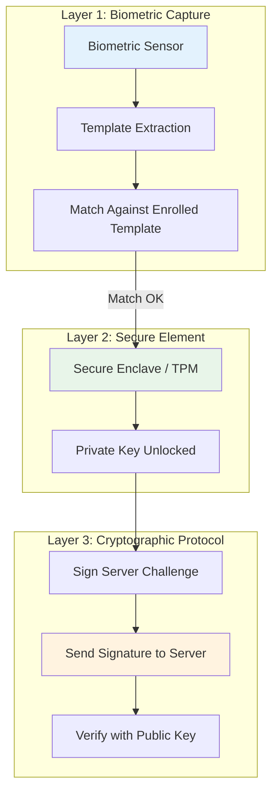
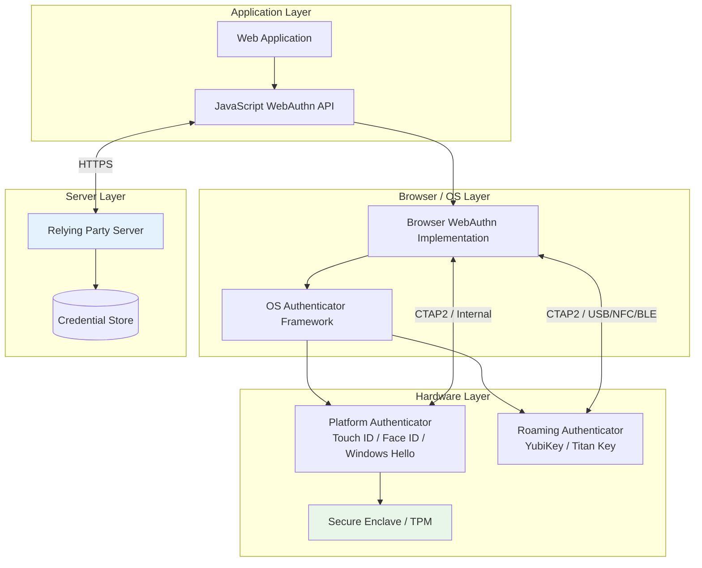
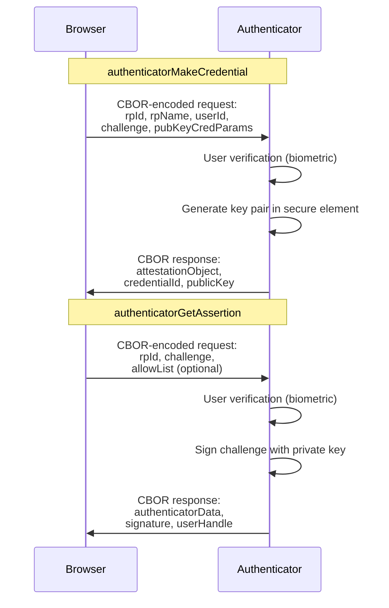

# Biometric Authentication

## Why Biometric Auth Exists

Biometric authentication solves the fundamental usability-security tradeoff. Traditional authentication forces users to choose between convenience (weak passwords, no MFA) and security (complex passwords, hardware tokens). Biometrics offer both: a fingerprint scan or face unlock is faster than typing a password *and* more secure because it cannot be phished, reused, or shared.

The key insight is that biometrics on modern devices don't transmit biometric data to the server. Instead, the biometric unlocks a cryptographic key stored in hardware. The server only sees a digital signature — never a fingerprint template. This preserves privacy while providing strong authentication.

### Historical Context

- **2004**: FIDO Alliance concept begins forming
- **2012**: FIDO Alliance officially launched
- **2014**: FIDO UAF (Universal Authentication Framework) for mobile biometrics
- **2016**: FIDO U2F widely supported (second-factor hardware keys)
- **2018**: W3C WebAuthn specification (merges UAF and U2F concepts)
- **2019**: WebAuthn becomes a W3C Recommendation (official standard)
- **2021**: Platform authenticators (Touch ID, Face ID, Windows Hello) widely available
- **2022**: Passkeys announced (synced WebAuthn credentials across devices)
- **2023–2024**: Passkeys become the default option on major platforms

## First Principles

### What Biometric Data Actually Is

A biometric is a measurable physical characteristic used for identification:

| Biometric | False Accept Rate | False Reject Rate | Spoofability |
|-----------|------------------|-------------------|-------------|
| Fingerprint (capacitive) | 1 in 50,000 | ~3% | Medium |
| Face (3D structured light) | 1 in 1,000,000 | ~1% | Low |
| Iris scan | 1 in 1,200,000 | ~0.5% | Very Low |
| Voice print | 1 in 10,000 | ~5% | High (deepfakes) |
| Behavioral (typing pattern) | 1 in 100 | ~10% | Medium |

### The Security Model

Biometric authentication works on a three-layer model:



Critical principle: **The biometric never leaves the device.** The server never knows what biometric was used — it only verifies a cryptographic signature.

### Liveness Detection

A fingerprint photo or a face photograph should not unlock the device. Liveness detection distinguishes real biometrics from spoofs:

| Technique | How It Works | Effectiveness |
|-----------|-------------|---------------|
| Capacitive sensing | Measures electrical properties of live skin | High for fingerprints |
| 3D depth mapping | Infrared structured light or ToF sensors | High for face |
| Challenge-response | "Blink" or "turn head" prompts | Medium (deepfake vulnerable) |
| Blood flow detection | Near-infrared spectroscopy | Very high (expensive) |
| Behavioral analysis | Interaction patterns during scanning | Medium |

## Core Mechanics

### The FIDO2 / WebAuthn Stack



### CTAP2 Protocol (Client to Authenticator Protocol)

CTAP2 is the protocol between the browser/OS and the authenticator device:



### Attestation Objects Explained

During registration, the authenticator returns an attestation object containing:

```
attestationObject = {
  fmt: "packed" | "tpm" | "android-key" | "android-safetynet" | "fido-u2f" | "none",
  attStmt: {
    alg: -7,              // ES256 (ECDSA P-256 with SHA-256)
    sig: <signature>,      // Attestation signature
    x5c: [<cert>, ...]    // Certificate chain (optional)
  },
  authData: {
    rpIdHash: <32 bytes>,           // SHA-256(rpId)
    flags: {
      UP: true,                     // User Present
      UV: true,                     // User Verified (biometric/PIN)
      AT: true,                     // Attested Credential Data included
      ED: false                     // Extension Data included
    },
    signCount: 0,                   // Replay counter
    attestedCredentialData: {
      aaguid: <16 bytes>,          // Authenticator model identifier
      credentialId: <variable>,     // Unique credential ID
      publicKey: <COSE key>        // Public key in COSE format
    }
  }
}
```

### Authenticator Data Structure

The `authData` field is a binary-packed structure:

$$
\text{authData} = \text{rpIdHash}_{32} \| \text{flags}_{1} \| \text{signCount}_{4} \| \text{attestedCredData}_{\text{var}} \| \text{extensions}_{\text{var}}
$$

Flags byte layout:

| Bit | Name | Meaning |
|-----|------|---------|
| 0 | UP | User Present (touched the sensor) |
| 1 | RFU | Reserved |
| 2 | UV | User Verified (biometric or PIN succeeded) |
| 3 | BE | Backup Eligible (can be synced) |
| 4 | BS | Backup State (is currently synced) |
| 5 | RFU | Reserved |
| 6 | AT | Attested credential data included |
| 7 | ED | Extension data included |

## Implementation

### Complete WebAuthn Server (TypeScript)

```typescript
import {
  generateRegistrationOptions,
  verifyRegistrationResponse,
  generateAuthenticationOptions,
  verifyAuthenticationResponse,
} from '@simplewebauthn/server';
import type {
  RegistrationResponseJSON,
  AuthenticationResponseJSON,
  AuthenticatorTransportFuture,
} from '@simplewebauthn/types';
import { isoBase64URL } from '@simplewebauthn/server/helpers';
import { Redis } from 'ioredis';

// Configuration
const RP_NAME = 'SecureApp';
const RP_ID = 'secureapp.com';
const ORIGIN = 'https://secureapp.com';
const CHALLENGE_TTL = 300; // 5 minutes

interface WebAuthnCredential {
  id: string;
  credentialID: string;
  credentialPublicKey: Uint8Array;
  counter: number;
  transports?: AuthenticatorTransportFuture[];
  aaguid: string;
  backupEligible: boolean;
  backupState: boolean;
  createdAt: Date;
  lastUsed: Date | null;
  deviceName: string;
  uvInitialized: boolean;
}

interface User {
  id: string;
  email: string;
  displayName: string;
  credentials: WebAuthnCredential[];
}

class WebAuthnService {
  private redis: Redis;
  private userStore: any; // Your database

  constructor(redis: Redis, userStore: any) {
    this.redis = redis;
    this.userStore = userStore;
  }

  // ─── Registration ───────────────────────────────────────────────

  async startRegistration(userId: string): Promise<any> {
    const user = await this.userStore.findById(userId);
    if (!user) throw new Error('User not found');

    const options = await generateRegistrationOptions({
      rpName: RP_NAME,
      rpID: RP_ID,
      userID: new TextEncoder().encode(user.id),
      userName: user.email,
      userDisplayName: user.displayName,

      // Don't allow re-registering existing credentials
      excludeCredentials: user.credentials.map((cred: WebAuthnCredential) => ({
        id: cred.credentialID,
        transports: cred.transports,
      })),

      authenticatorSelection: {
        // Allow both platform (Touch ID) and roaming (YubiKey)
        // authenticatorAttachment: 'platform', // Uncomment to force biometric
        residentKey: 'required',  // Discoverable credential (passkey)
        userVerification: 'required', // MUST use biometric or PIN
      },

      // Supported algorithms in priority order
      supportedAlgorithmIDs: [
        -8,    // Ed25519 (fastest, most secure)
        -7,    // ES256 (ECDSA P-256) — most widely supported
        -257,  // RS256 (RSA) — fallback for legacy
      ],

      // Don't request attestation unless you need device compliance
      attestation: 'none',
    });

    // Store challenge in Redis with TTL
    await this.redis.set(
      `webauthn:reg:${userId}`,
      options.challenge,
      'EX',
      CHALLENGE_TTL
    );

    return options;
  }

  async finishRegistration(
    userId: string,
    response: RegistrationResponseJSON
  ): Promise<{ success: boolean; credential?: WebAuthnCredential }> {
    const expectedChallenge = await this.redis.get(`webauthn:reg:${userId}`);
    if (!expectedChallenge) {
      return { success: false };
    }

    // Delete challenge (one-time use)
    await this.redis.del(`webauthn:reg:${userId}`);

    try {
      const verification = await verifyRegistrationResponse({
        response,
        expectedChallenge,
        expectedOrigin: ORIGIN,
        expectedRPID: RP_ID,
        requireUserVerification: true,
      });

      if (!verification.verified || !verification.registrationInfo) {
        return { success: false };
      }

      const { credential, credentialDeviceType, credentialBackedUp, aaguid } =
        verification.registrationInfo;

      const webauthnCredential: WebAuthnCredential = {
        id: crypto.randomUUID(),
        credentialID: credential.id,
        credentialPublicKey: credential.publicKey,
        counter: credential.counter,
        transports: response.response.transports as AuthenticatorTransportFuture[],
        aaguid: aaguid ?? '00000000-0000-0000-0000-000000000000',
        backupEligible: credentialDeviceType === 'multiDevice',
        backupState: credentialBackedUp ?? false,
        createdAt: new Date(),
        lastUsed: null,
        deviceName: this.inferDeviceName(aaguid ?? ''),
        uvInitialized: true,
      };

      // Store the credential
      await this.userStore.addCredential(userId, webauthnCredential);

      return { success: true, credential: webauthnCredential };
    } catch (error) {
      console.error('Registration verification failed:', error);
      return { success: false };
    }
  }

  // ─── Authentication ─────────────────────────────────────────────

  async startAuthentication(email?: string): Promise<any> {
    let allowCredentials: Array<{ id: string; transports?: AuthenticatorTransportFuture[] }> = [];

    if (email) {
      const user = await this.userStore.findByEmail(email);
      if (user) {
        allowCredentials = user.credentials.map((cred: WebAuthnCredential) => ({
          id: cred.credentialID,
          transports: cred.transports,
        }));
      }
    }
    // If no email provided, allowCredentials is empty = discoverable credential flow

    const options = await generateAuthenticationOptions({
      rpID: RP_ID,
      userVerification: 'required',
      allowCredentials,
    });

    // Store challenge (keyed by email or a session ID for anonymous flow)
    const challengeKey = email ?? `anon:${crypto.randomUUID()}`;
    await this.redis.set(
      `webauthn:auth:${challengeKey}`,
      options.challenge,
      'EX',
      CHALLENGE_TTL
    );

    return { options, challengeKey };
  }

  async finishAuthentication(
    challengeKey: string,
    response: AuthenticationResponseJSON
  ): Promise<{ success: boolean; userId?: string }> {
    const expectedChallenge = await this.redis.get(`webauthn:auth:${challengeKey}`);
    if (!expectedChallenge) {
      return { success: false };
    }

    await this.redis.del(`webauthn:auth:${challengeKey}`);

    // Find the credential by ID
    const credRecord = await this.userStore.findCredentialById(response.id);
    if (!credRecord) {
      return { success: false };
    }

    try {
      const verification = await verifyAuthenticationResponse({
        response,
        expectedChallenge,
        expectedOrigin: ORIGIN,
        expectedRPID: RP_ID,
        requireUserVerification: true,
        credential: {
          id: credRecord.credentialID,
          publicKey: credRecord.credentialPublicKey,
          counter: credRecord.counter,
          transports: credRecord.transports,
        },
      });

      if (!verification.verified) {
        return { success: false };
      }

      const { newCounter } = verification.authenticationInfo;

      // Clone detection: if counter went backwards, the credential was cloned
      if (newCounter > 0 && newCounter <= credRecord.counter) {
        console.error(`Clone detection: credential ${credRecord.credentialID} counter went backwards`);
        // Optionally: revoke the credential and alert the user
        await this.userStore.flagCredentialCloned(credRecord.id);
        return { success: false };
      }

      // Update counter and last used timestamp
      await this.userStore.updateCredential(credRecord.id, {
        counter: newCounter,
        lastUsed: new Date(),
      });

      return { success: true, userId: credRecord.userId };
    } catch (error) {
      console.error('Authentication verification failed:', error);
      return { success: false };
    }
  }

  // ─── Credential Management ──────────────────────────────────────

  async listCredentials(userId: string): Promise<Array<{
    id: string;
    deviceName: string;
    createdAt: Date;
    lastUsed: Date | null;
    backupEligible: boolean;
    backupState: boolean;
  }>> {
    const user = await this.userStore.findById(userId);
    return user.credentials.map((cred: WebAuthnCredential) => ({
      id: cred.id,
      deviceName: cred.deviceName,
      createdAt: cred.createdAt,
      lastUsed: cred.lastUsed,
      backupEligible: cred.backupEligible,
      backupState: cred.backupState,
    }));
  }

  async removeCredential(userId: string, credentialId: string): Promise<boolean> {
    const user = await this.userStore.findById(userId);

    // Prevent removing the last credential
    if (user.credentials.length <= 1) {
      throw new Error('Cannot remove the last credential. Add another before removing this one.');
    }

    return this.userStore.removeCredential(userId, credentialId);
  }

  // ─── Helpers ────────────────────────────────────────────────────

  private inferDeviceName(aaguid: string): string {
    // AAGUID database: https://github.com/nicferrier/webauthn-aaguid
    const knownDevices: Record<string, string> = {
      'fbfc3007-154e-4ecc-8c0b-6e020557d7bd': 'iCloud Keychain (Apple)',
      'ea9b8d66-4d01-1d21-3ce4-b6b48cb575d4': 'Google Password Manager',
      '08987058-cadc-4b81-b6e1-30de50dcbe96': 'Windows Hello',
      '2fc0579f-8113-47ea-b116-bb5a8db9202a': 'YubiKey 5 NFC',
      '73bb0cd4-e502-49b8-9c6f-b59445bf720b': 'YubiKey 5C',
      'ee882879-721c-4913-9775-3dfcce97072a': 'YubiKey 5 USB-A',
    };
    return knownDevices[aaguid] ?? 'Unknown Device';
  }
}
```

### Client-Side WebAuthn Integration

```typescript
// Feature detection
function isWebAuthnSupported(): boolean {
  return (
    typeof window !== 'undefined' &&
    typeof window.PublicKeyCredential !== 'undefined' &&
    typeof window.PublicKeyCredential.isUserVerifyingPlatformAuthenticatorAvailable === 'function'
  );
}

async function isPlatformAuthenticatorAvailable(): Promise<boolean> {
  if (!isWebAuthnSupported()) return false;
  return window.PublicKeyCredential.isUserVerifyingPlatformAuthenticatorAvailable();
}

async function isConditionalUIAvailable(): Promise<boolean> {
  if (!isWebAuthnSupported()) return false;
  if (typeof PublicKeyCredential.isConditionalMediationAvailable !== 'function') {
    return false;
  }
  return PublicKeyCredential.isConditionalMediationAvailable();
}

// ─── Registration Flow ────────────────────────────────────────

async function registerBiometric(): Promise<{
  success: boolean;
  error?: string;
  credentialId?: string;
}> {
  try {
    // Step 1: Get options from server
    const optionsRes = await fetch('/api/webauthn/register/start', {
      method: 'POST',
      credentials: 'include',
    });

    if (!optionsRes.ok) {
      return { success: false, error: 'Failed to get registration options' };
    }

    const options = await optionsRes.json();

    // Step 2: Create credential (triggers biometric prompt)
    // Convert base64url strings to ArrayBuffers for the WebAuthn API
    const publicKeyOptions: PublicKeyCredentialCreationOptions = {
      ...options,
      challenge: base64URLToBuffer(options.challenge),
      user: {
        ...options.user,
        id: base64URLToBuffer(options.user.id),
      },
      excludeCredentials: (options.excludeCredentials ?? []).map((cred: any) => ({
        ...cred,
        id: base64URLToBuffer(cred.id),
      })),
    };

    const credential = await navigator.credentials.create({
      publicKey: publicKeyOptions,
    }) as PublicKeyCredential;

    if (!credential) {
      return { success: false, error: 'Credential creation returned null' };
    }

    // Step 3: Send credential to server
    const attestationResponse = credential.response as AuthenticatorAttestationResponse;
    const body = {
      id: credential.id,
      rawId: bufferToBase64URL(credential.rawId),
      type: credential.type,
      response: {
        attestationObject: bufferToBase64URL(attestationResponse.attestationObject),
        clientDataJSON: bufferToBase64URL(attestationResponse.clientDataJSON),
        transports: attestationResponse.getTransports?.() ?? [],
        publicKeyAlgorithm: attestationResponse.getPublicKeyAlgorithm?.(),
        publicKey: attestationResponse.getPublicKey?.()
          ? bufferToBase64URL(attestationResponse.getPublicKey()!)
          : undefined,
      },
      authenticatorAttachment: credential.authenticatorAttachment,
    };

    const verifyRes = await fetch('/api/webauthn/register/finish', {
      method: 'POST',
      headers: { 'Content-Type': 'application/json' },
      credentials: 'include',
      body: JSON.stringify(body),
    });

    const result = await verifyRes.json();
    return { success: result.success, credentialId: result.credentialId };
  } catch (error) {
    const e = error as Error;
    if (e.name === 'NotAllowedError') {
      return { success: false, error: 'User cancelled the registration' };
    }
    if (e.name === 'SecurityError') {
      return { success: false, error: 'Origin not allowed for WebAuthn' };
    }
    if (e.name === 'InvalidStateError') {
      return { success: false, error: 'Credential already registered on this authenticator' };
    }
    return { success: false, error: e.message };
  }
}

// ─── Authentication Flow ──────────────────────────────────────

async function authenticateWithBiometric(
  abortSignal?: AbortSignal
): Promise<{ success: boolean; error?: string }> {
  try {
    const optionsRes = await fetch('/api/webauthn/auth/start', {
      method: 'POST',
      credentials: 'include',
    });

    const { options, challengeKey } = await optionsRes.json();

    const publicKeyOptions: PublicKeyCredentialRequestOptions = {
      ...options,
      challenge: base64URLToBuffer(options.challenge),
      allowCredentials: (options.allowCredentials ?? []).map((cred: any) => ({
        ...cred,
        id: base64URLToBuffer(cred.id),
      })),
    };

    const assertion = await navigator.credentials.get({
      publicKey: publicKeyOptions,
      signal: abortSignal,
    }) as PublicKeyCredential;

    if (!assertion) {
      return { success: false, error: 'Authentication returned null' };
    }

    const assertionResponse = assertion.response as AuthenticatorAssertionResponse;
    const body = {
      id: assertion.id,
      rawId: bufferToBase64URL(assertion.rawId),
      type: assertion.type,
      response: {
        authenticatorData: bufferToBase64URL(assertionResponse.authenticatorData),
        clientDataJSON: bufferToBase64URL(assertionResponse.clientDataJSON),
        signature: bufferToBase64URL(assertionResponse.signature),
        userHandle: assertionResponse.userHandle
          ? bufferToBase64URL(assertionResponse.userHandle)
          : undefined,
      },
      challengeKey,
    };

    const verifyRes = await fetch('/api/webauthn/auth/finish', {
      method: 'POST',
      headers: { 'Content-Type': 'application/json' },
      credentials: 'include',
      body: JSON.stringify(body),
    });

    const result = await verifyRes.json();
    return { success: result.success };
  } catch (error) {
    const e = error as Error;
    if (e.name === 'NotAllowedError') {
      return { success: false, error: 'User cancelled' };
    }
    if (e.name === 'AbortError') {
      return { success: false, error: 'Authentication aborted' };
    }
    return { success: false, error: e.message };
  }
}

// ─── Utility Functions ────────────────────────────────────────

function base64URLToBuffer(base64url: string): ArrayBuffer {
  const base64 = base64url.replace(/-/g, '+').replace(/_/g, '/');
  const paddedBase64 = base64.padEnd(base64.length + (4 - (base64.length % 4)) % 4, '=');
  const binary = atob(paddedBase64);
  const bytes = new Uint8Array(binary.length);
  for (let i = 0; i < binary.length; i++) {
    bytes[i] = binary.charCodeAt(i);
  }
  return bytes.buffer;
}

function bufferToBase64URL(buffer: ArrayBuffer): string {
  const bytes = new Uint8Array(buffer);
  let binary = '';
  for (const byte of bytes) {
    binary += String.fromCharCode(byte);
  }
  return btoa(binary).replace(/\+/g, '-').replace(/\//g, '_').replace(/=+$/, '');
}
```

### React Component for Biometric Auth

```typescript
import { useState, useEffect, useCallback } from 'react';

interface BiometricAuthState {
  isSupported: boolean;
  isPlatformAvailable: boolean;
  isConditionalUIAvailable: boolean;
  isRegistering: boolean;
  isAuthenticating: boolean;
  error: string | null;
}

function useBiometricAuth() {
  const [state, setState] = useState<BiometricAuthState>({
    isSupported: false,
    isPlatformAvailable: false,
    isConditionalUIAvailable: false,
    isRegistering: false,
    isAuthenticating: false,
    error: null,
  });

  useEffect(() => {
    async function checkSupport() {
      const supported = isWebAuthnSupported();
      const platform = supported ? await isPlatformAuthenticatorAvailable() : false;
      const conditional = supported ? await isConditionalUIAvailable() : false;

      setState((prev) => ({
        ...prev,
        isSupported: supported,
        isPlatformAvailable: platform,
        isConditionalUIAvailable: conditional,
      }));
    }
    checkSupport();
  }, []);

  const register = useCallback(async () => {
    setState((prev) => ({ ...prev, isRegistering: true, error: null }));

    const result = await registerBiometric();

    setState((prev) => ({
      ...prev,
      isRegistering: false,
      error: result.error ?? null,
    }));

    return result.success;
  }, []);

  const authenticate = useCallback(async () => {
    setState((prev) => ({ ...prev, isAuthenticating: true, error: null }));

    const result = await authenticateWithBiometric();

    setState((prev) => ({
      ...prev,
      isAuthenticating: false,
      error: result.error ?? null,
    }));

    return result.success;
  }, []);

  return { ...state, register, authenticate };
}

// Usage in a component
function LoginPage() {
  const {
    isSupported,
    isPlatformAvailable,
    isAuthenticating,
    error,
    authenticate,
  } = useBiometricAuth();

  if (!isSupported) {
    return <p>Your browser does not support WebAuthn.</p>;
  }

  return (
    <div>
      {isPlatformAvailable && (
        <button
          onClick={authenticate}
          disabled={isAuthenticating}
        >
          {isAuthenticating ? 'Verifying...' : 'Sign in with biometrics'}
        </button>
      )}
      {error && <p className="error">{error}</p>}
    </div>
  );
}
```

## Edge Cases & Failure Modes

### Platform-Specific Issues

| Platform | Issue | Workaround |
|----------|-------|------------|
| iOS Safari | WebAuthn only works in Safari, not in-app browsers | Detect and redirect to Safari |
| Android Chrome | Some devices lack a secure element for UV | Fall back to device PIN |
| Windows Hello | Requires Windows Hello to be configured | Show setup instructions |
| Firefox | Limited passkey sync support (as of 2025) | Offer roaming authenticator option |
| Incognito mode | Some browsers block credential access | Detect and warn user |

### Clone Detection

WebAuthn credentials include a sign counter that increments on each use:

```
Expected counter progression:
  Register: counter = 0
  Auth 1:   counter = 1
  Auth 2:   counter = 2
  Auth 3:   counter = 3

Clone attack:
  Legit device:  counter = 3
  Cloned device: counter = 1  ← Counter went backwards!
```

::: danger
If the counter goes backwards, the private key may have been extracted from the secure element. This is extremely rare with hardware authenticators but theoretically possible. Flag the credential and force re-registration.
:::

However, many platform authenticators (especially passkeys synced through iCloud/Google) always report counter = 0. In this case, clone detection via counter is not possible. Rely on the platform's sync security model instead.

### User Verification Downgrade Attack

An attacker might attempt to authenticate without biometric verification by spoofing the UV flag. Protection:

```typescript
// ALWAYS check UV flag on the server side
if (!verification.authenticationInfo.userVerified) {
  console.error('User verification flag not set — potential downgrade attack');
  return { success: false };
}
```

The WebAuthn specification requires that the `requireUserVerification: true` option causes the authenticator to fail if UV cannot be performed. But always verify the flag server-side.

## Performance Characteristics

### Latency Breakdown

| Operation | Time | Notes |
|-----------|------|-------|
| Server: generate challenge | ~0.5ms | Random bytes + Redis SET |
| Network: server to browser | ~20–100ms | Depends on latency |
| Browser: prompt display | ~50ms | UI rendering |
| User: biometric scan | 200–2000ms | User interaction time |
| Authenticator: key gen (registration) | 50–200ms | Secure element operation |
| Authenticator: sign (authentication) | 10–50ms | Faster than key gen |
| Network: browser to server | ~20–100ms | Response back |
| Server: verify signature | 0.5–2ms | ECDSA P-256 verification |
| **Total (registration)** | **~500–2500ms** | Dominated by user interaction |
| **Total (authentication)** | **~300–2300ms** | Dominated by user interaction |

### Compared to Password Authentication

| Metric | Password + bcrypt | Biometric (WebAuthn) |
|--------|-------------------|---------------------|
| Server CPU (verification) | ~100ms (bcrypt cost 12) | ~1ms (ECDSA verify) |
| User effort | 5–10 seconds typing | 1–2 seconds biometric |
| Phishing risk | High | None (origin-bound) |
| Breach impact | Credential dump | No server-side secret |
| Credential reuse | Common | Impossible |

### Storage Requirements

Per credential:

$$
S = 32_{\text{credId}} + 65_{\text{pubKey (P-256)}} + 4_{\text{counter}} + 16_{\text{aaguid}} + \text{metadata} \approx 200 \text{ bytes}
$$

For 1 million users with 2 credentials each: ~400 MB.

## Mathematical Foundations

### ECDSA Signature Verification

WebAuthn typically uses ECDSA with the P-256 curve. The verification equation:

Given public key $Q$, message hash $h$, and signature $(r, s)$:

1. Compute $u_1 = h \cdot s^{-1} \mod n$
2. Compute $u_2 = r \cdot s^{-1} \mod n$
3. Compute point $R = u_1 G + u_2 Q$
4. Verify that $R_x \equiv r \pmod{n}$

The security relies on the ECDLP (Elliptic Curve Discrete Logarithm Problem):

$$
\text{Given } G \text{ and } Q = dG, \text{ finding } d \text{ requires } O(\sqrt{p}) \text{ operations}
$$

For P-256, $p \approx 2^{256}$, so $\sqrt{p} \approx 2^{128}$ operations — beyond any foreseeable computational capability.

### False Accept Rate Mathematics

The probability of a false biometric match follows a Bernoulli process:

$$
P(\text{false accept in } n \text{ attempts}) = 1 - (1 - \text{FAR})^n
$$

For Touch ID (FAR = 1/50,000) with 10 attempts before lockout:

$$
P = 1 - (1 - 2 \times 10^{-5})^{10} \approx 2 \times 10^{-4} = 0.02\%
$$

For Face ID (FAR = 1/1,000,000) with 5 attempts:

$$
P = 1 - (1 - 10^{-6})^5 \approx 5 \times 10^{-6} = 0.0005\%
$$

Combined with the cryptographic challenge-response (which an attacker cannot forge without the private key), the effective false accept rate is:

$$
P_{\text{effective}} = P_{\text{biometric}} \times P_{\text{crypto}} = P_{\text{biometric}} \times 0 = 0
$$

An attacker cannot bypass the biometric remotely because they need physical access to the authenticator device.

## Real-World War Stories

::: info War Story
**Apple's Face ID Mask Failure (2020–2021)**

When COVID-19 forced mask wearing, Face ID could not authenticate users wearing masks. Apple's initial FAR of 1/1,000,000 was calibrated for full-face recognition. The company released "Face ID with Mask" in iOS 15.4, which used the periocular region (area around the eyes) instead. This increased the FAR slightly but remained practical for consumer use.

**Engineering lesson**: Biometric systems must be designed for real-world conditions, not laboratory conditions. Environmental factors (masks, gloves, wet fingers, poor lighting) dramatically affect accuracy. Always have a fallback mechanism (device PIN).
:::

::: info War Story
**The Samsung Galaxy S10 Ultrasonic Fingerprint Bypass (2019)**

Samsung's Galaxy S10 used an ultrasonic in-display fingerprint sensor. Users discovered that applying a cheap screen protector created an air gap that allowed *any* fingerprint to unlock the phone. The sensor was reading the screen protector's texture pattern instead of the finger.

Samsung issued an emergency patch that improved the ultrasonic scanning algorithm. The incident highlighted that biometric sensors are physical devices subject to physical attacks.

**Engineering lesson**: Biometric verification should never be the sole factor. Always combine it with a cryptographic challenge-response protocol (like WebAuthn) that the sensor alone cannot satisfy.
:::

::: info War Story
**Microsoft's Windows Hello for Business Deployment**

A Fortune 500 company deployed Windows Hello for Business to 50,000 employees. They discovered that approximately 3% of employees could not use the facial recognition due to medical conditions affecting their facial features, and another 2% had fingerprint recognition issues due to manual labor damaging their fingerprints.

**Resolution**: They implemented a cascading authentication policy: try face, then fingerprint, then PIN, then smart card. The PIN fallback was critical for accessibility compliance (ADA requirements). They also discovered that the enrollment process needed to capture multiple fingerprints and face angles to reduce false reject rates from 5% to under 1%.
:::

## Decision Framework

### Biometric Method Selection

| Factor | Fingerprint | Face | Iris | Voice |
|--------|------------|------|------|-------|
| FAR | 1/50K | 1/1M | 1/1.2M | 1/10K |
| User acceptance | High | Very High | Low | Medium |
| Hardware cost | Low (built-in) | Medium | High | Low (mic) |
| Accessibility | Poor (amputees) | Good | Good | Good |
| Speed | 200ms | 300ms | 500ms | 2–3s |
| Environmental sensitivity | Wet/dirty fingers | Masks, lighting | Glasses | Noise |
| Spoofability | Medium | Low (3D) | Very Low | High |

### When to Use Biometric Auth

**Use biometric auth when:**
- Building consumer-facing applications
- Security and UX are both priorities
- Target audience uses modern devices (2020+)
- Phishing resistance is critical

**Do NOT use biometric auth when:**
- Users are on legacy devices without biometric sensors
- Accessibility cannot be compromised (provide alternatives)
- The application runs in environments where biometrics are unreliable (factories, outdoors)
- Shared/kiosk devices (biometrics are personal)

## Advanced Topics

### Attestation Verification for Enterprise

Enterprise environments may require proof that the authenticator meets security standards:

```typescript
// Verify that the authenticator has a specific AAGUID (device model)
const APPROVED_AUTHENTICATORS = new Set([
  '2fc0579f-8113-47ea-b116-bb5a8db9202a', // YubiKey 5 NFC
  '73bb0cd4-e502-49b8-9c6f-b59445bf720b', // YubiKey 5C
  '08987058-cadc-4b81-b6e1-30de50dcbe96', // Windows Hello
]);

async function verifyEnterpriseCompliance(
  registrationInfo: any
): Promise<{ compliant: boolean; reason?: string }> {
  const { aaguid, credentialDeviceType } = registrationInfo;

  // Check approved device list
  if (!APPROVED_AUTHENTICATORS.has(aaguid)) {
    return { compliant: false, reason: 'Authenticator not in approved list' };
  }

  // Reject synced passkeys (require hardware-bound)
  if (credentialDeviceType === 'multiDevice') {
    return { compliant: false, reason: 'Synced passkeys not allowed in enterprise' };
  }

  // For TPM attestation, verify the certificate chain
  // against the FIDO Metadata Service (MDS)
  const mdsEntry = await queryFIDOMetadataService(aaguid);
  if (!mdsEntry) {
    return { compliant: false, reason: 'Authenticator not found in FIDO MDS' };
  }

  if (mdsEntry.statusReports.some((r: any) =>
    r.status === 'REVOKED' || r.status === 'ATTESTATION_KEY_COMPROMISE'
  )) {
    return { compliant: false, reason: 'Authenticator has security issues' };
  }

  return { compliant: true };
}
```

### FIDO Metadata Service (MDS)

The FIDO Alliance maintains a metadata service that contains security information about every certified authenticator:

```typescript
import { MetadataService } from '@simplewebauthn/server';

// Initialize the metadata service (fetches and caches FIDO MDS)
async function initializeMetadataService(): Promise<void> {
  await MetadataService.initialize({
    verificationMode: 'strict',
  });
}

// Look up an authenticator by AAGUID
function getAuthenticatorInfo(aaguid: string) {
  const statement = MetadataService.getStatement(aaguid);
  if (!statement) return null;

  return {
    description: statement.description,
    protocolFamily: statement.protocolFamily,
    authenticatorVersion: statement.authenticatorVersion,
    keyProtection: statement.keyProtection, // 'hardware', 'tee', 'secure_element'
    userVerification: statement.userVerification,
    certifications: statement.attestationTypes,
  };
}
```

### Post-Quantum Considerations

Current WebAuthn relies on ECDSA P-256, which is vulnerable to quantum computers running Shor's algorithm:

$$
\text{Shor's algorithm: } O((\log n)^3) \text{ gates to break ECDLP}
$$

Post-quantum alternatives being researched for WebAuthn:

| Algorithm | Type | Key Size | Signature Size | Status |
|-----------|------|----------|----------------|--------|
| Dilithium | Lattice-based | 1.3 KB | 2.4 KB | NIST PQC standard |
| SPHINCS+ | Hash-based | 32 B | 17 KB | NIST PQC standard |
| FALCON | Lattice-based | 897 B | 666 B | NIST PQC standard |

The challenge for WebAuthn is that post-quantum signatures are much larger than ECDSA signatures (~2.4 KB vs 64 bytes), requiring protocol changes for efficient transmission.

### Continuous Authentication with Behavioral Biometrics

Beyond one-time biometric checks, behavioral biometrics provide *continuous* authentication:

```typescript
interface BehavioralSignals {
  typingPattern: {
    keyDownUpIntervals: number[];   // How long each key is held
    keyToKeyIntervals: number[];    // Time between keystrokes
    errorRate: number;              // Backspace frequency
  };
  mouseMovement: {
    velocity: number[];
    acceleration: number[];
    curvature: number[];            // How "smooth" the movement is
    clickPressure: number[];        // On supported trackpads
  };
  touchPattern: {
    pressure: number[];
    contactArea: number[];
    swipeVelocity: number[];
  };
  deviceMetrics: {
    gyroscope: number[];            // How the phone is held
    accelerometer: number[];        // Walking pattern while using
  };
}

// Score represents confidence that the current user matches the enrolled profile
type AuthConfidence = number; // 0.0 to 1.0

function computeBehavioralScore(
  current: BehavioralSignals,
  enrolled: BehavioralSignals
): AuthConfidence {
  // Use Mahalanobis distance for multivariate comparison
  // Accounts for correlations between features
  const distance = mahalanobisDistance(
    flattenSignals(current),
    flattenSignals(enrolled),
    covarianceMatrix(enrolled)
  );

  // Convert distance to confidence score using sigmoid
  return 1 / (1 + Math.exp(distance - 3)); // Threshold at distance = 3
}
```

Behavioral biometrics can trigger re-authentication if the confidence drops below a threshold, providing a continuous security layer without interrupting the user.

## Cross-References

- [Passwordless Authentication](/security/authentication/passwordless) — Higher-level passwordless strategies
- [MFA Implementation](/security/authentication/mfa-implementation) — Multi-factor authentication including biometrics
- [Symmetric vs Asymmetric Encryption](/security/encryption/symmetric-vs-asymmetric) — ECDSA and Ed25519 fundamentals
- [Zero Trust Principles](/security/zero-trust/principles) — Continuous verification model
- [Continuous Verification](/security/zero-trust/continuous-verification) — Behavioral analysis for ongoing trust
