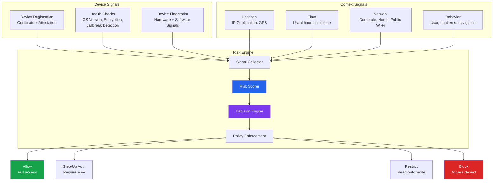
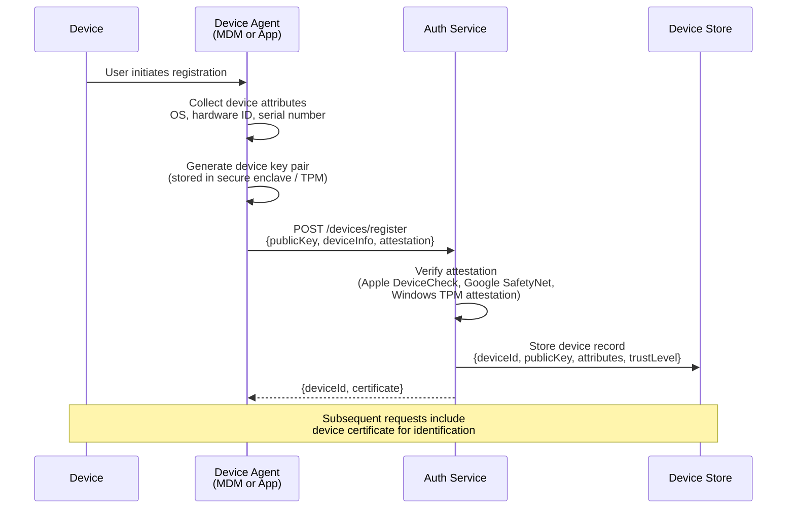
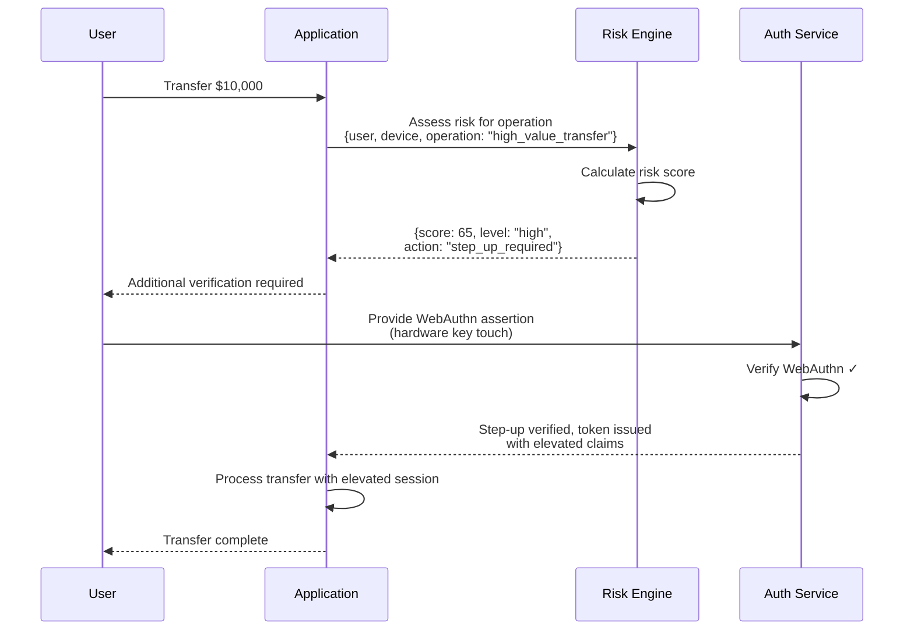
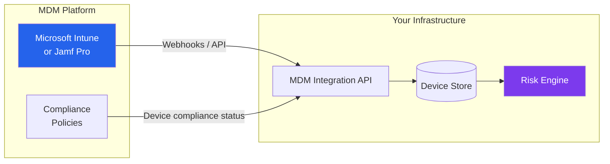

# Device Trust & Risk Engine

In a zero-trust world, the device is as important as the user. A legitimate user on a compromised device is a compromised user. This page covers how to build a production risk engine that evaluates device trust, behavioral patterns, location, and time to make real-time authentication decisions. These patterns are used by companies like Google (BeyondCorp), Netflix, and financial institutions to protect high-value systems.

## Device Trust Architecture



## Device Registration and Attestation

### Device Registration Flow



### Attestation Types

| Platform | Attestation API | What It Proves |
|----------|----------------|----------------|
| **Apple** | DeviceCheck / App Attest | App is genuine, device is real Apple hardware |
| **Android** | Play Integrity API (replaced SafetyNet) | Device passes integrity checks, app is from Play Store |
| **Windows** | TPM 2.0 Attestation | Device has a genuine TPM, boot chain is verified |
| **Web** | WebAuthn Attestation | Authenticator is genuine (FIDO certification) |

### Device Registration Implementation

```typescript
interface DeviceRegistration {
  deviceId: string;           // Server-generated unique ID
  userId: string;
  publicKey: Buffer;          // Device's public key (for mutual auth)
  platform: 'ios' | 'android' | 'windows' | 'macos' | 'linux' | 'web';
  osVersion: string;
  appVersion: string;
  hardwareModel: string;
  serialNumber?: string;      // For MDM-enrolled devices
  attestationVerified: boolean;
  trustLevel: DeviceTrustLevel;
  registeredAt: Date;
  lastSeenAt: Date;
  lastHealthCheck: DeviceHealthReport;
}

type DeviceTrustLevel = 'untrusted' | 'basic' | 'verified' | 'managed';

async function registerDevice(
  userId: string,
  registration: DeviceRegistrationRequest
): Promise<DeviceRegistration> {
  // Step 1: Verify attestation
  const attestationValid = await verifyAttestation(
    registration.platform,
    registration.attestation
  );

  // Step 2: Check for duplicate device (re-registration)
  const existing = await db.devices.findByHardwareId(
    registration.hardwareId
  );
  if (existing && existing.userId !== userId) {
    // Device previously registered to another user
    await auditLog.warn('device_ownership_change', {
      deviceId: existing.deviceId,
      previousUser: existing.userId,
      newUser: userId,
    });
  }

  // Step 3: Determine initial trust level
  let trustLevel: DeviceTrustLevel = 'basic';
  if (attestationValid) trustLevel = 'verified';
  if (await isMDMEnrolled(registration.serialNumber)) trustLevel = 'managed';

  // Step 4: Create device record
  const device = await db.devices.create({
    deviceId: generateDeviceId(),
    userId,
    publicKey: registration.publicKey,
    platform: registration.platform,
    osVersion: registration.osVersion,
    appVersion: registration.appVersion,
    hardwareModel: registration.hardwareModel,
    serialNumber: registration.serialNumber,
    attestationVerified: attestationValid,
    trustLevel,
    registeredAt: new Date(),
    lastSeenAt: new Date(),
    lastHealthCheck: await performHealthCheck(registration),
  });

  // Step 5: Issue device certificate (for mutual TLS or signed requests)
  const certificate = await issuDeviceCertificate(device);

  return { ...device, certificate };
}
```

## Device Health Checks

### Health Check Categories

```mermaid
graph TB
    subgraph "OS Security"
        OS_VER[OS Version<br/>Is it patched?]
        ENCRYPT[Disk Encryption<br/>FileVault, BitLocker]
        FW[Firewall<br/>Enabled?]
        SCREEN[Screen Lock<br/>PIN, biometric?]
    end

    subgraph "Device Integrity"
        JAILBREAK[Jailbreak / Root<br/>Detection]
        BOOT[Secure Boot<br/>Verified?]
        DEBUG[Debug Mode<br/>Developer mode on?]
        EMULATOR[Emulator<br/>Detection]
    end

    subgraph "Software Security"
        AV[Antivirus / EDR<br/>Running?]
        PATCH[Patch Level<br/>Up to date?]
        APP_VER[App Version<br/>Current?]
        CERT[Certificate<br/>Valid?]
    end

    OS_VER --> SCORE[Health Score]
    ENCRYPT --> SCORE
    FW --> SCORE
    SCREEN --> SCORE
    JAILBREAK --> SCORE
    BOOT --> SCORE
    DEBUG --> SCORE
    EMULATOR --> SCORE
    AV --> SCORE
    PATCH --> SCORE
    APP_VER --> SCORE
    CERT --> SCORE

    style SCORE fill:#2563eb,color:#fff
```



### Health Check Implementation

```typescript
interface DeviceHealthReport {
  timestamp: Date;
  score: number; // 0-100
  checks: HealthCheck[];
  compliant: boolean;
  remediationRequired: string[];
}

interface HealthCheck {
  name: string;
  status: 'pass' | 'fail' | 'warn' | 'unknown';
  value: string;
  weight: number; // How much this affects the score
}

function evaluateDeviceHealth(signals: DeviceSignals): DeviceHealthReport {
  const checks: HealthCheck[] = [];

  // OS Version check
  const osSupported = isOSVersionSupported(signals.osVersion);
  checks.push({
    name: 'os_version',
    status: osSupported ? 'pass' : signals.osVersion ? 'fail' : 'unknown',
    value: signals.osVersion || 'unknown',
    weight: 20,
  });

  // Disk encryption
  checks.push({
    name: 'disk_encryption',
    status: signals.diskEncrypted ? 'pass' : 'fail',
    value: signals.diskEncrypted ? 'enabled' : 'disabled',
    weight: 25,
  });

  // Screen lock
  checks.push({
    name: 'screen_lock',
    status: signals.screenLockEnabled ? 'pass' : 'fail',
    value: signals.screenLockType || 'none',
    weight: 15,
  });

  // Jailbreak / root detection
  checks.push({
    name: 'jailbreak_detection',
    status: signals.jailbroken ? 'fail' : 'pass',
    value: signals.jailbroken ? 'jailbroken' : 'clean',
    weight: 30, // Critical — fails device immediately
  });

  // App version (must be within 2 versions of latest)
  const appUpToDate = isAppVersionAcceptable(signals.appVersion);
  checks.push({
    name: 'app_version',
    status: appUpToDate ? 'pass' : 'warn',
    value: signals.appVersion,
    weight: 10,
  });

  // Calculate score
  let score = 100;
  const remediationRequired: string[] = [];

  for (const check of checks) {
    if (check.status === 'fail') {
      score -= check.weight;
      remediationRequired.push(getRemediationMessage(check.name));
    } else if (check.status === 'warn') {
      score -= check.weight * 0.5;
    }
  }

  score = Math.max(0, Math.min(100, score));

  // Jailbroken device is always non-compliant regardless of score
  const jailbroken = checks.find(c => c.name === 'jailbreak_detection');
  const compliant = score >= 60 && jailbroken?.status !== 'fail';

  return {
    timestamp: new Date(),
    score,
    checks,
    compliant,
    remediationRequired,
  };
}
```

### Jailbreak Detection Techniques

| Platform | Detection Method | Reliability |
|----------|-----------------|-------------|
| **iOS** | Check for Cydia/Sileo apps | Medium — can be hidden |
| **iOS** | Try writing outside sandbox | High |
| **iOS** | Check for unsigned binaries | High |
| **iOS** | Verify code signing | High |
| **Android** | Check for su binary | Medium |
| **Android** | Check for Magisk Manager | Medium — Magisk hides itself |
| **Android** | Play Integrity API | High — Google-verified |
| **Android** | Check SafetyNet/Play Integrity verdict | High |

::: warning Jailbreak Detection Is an Arms Race
Jailbreak detection is never 100% reliable. Sophisticated tools (Magisk on Android, Palera1n on iOS) actively evade detection. Use attestation APIs (Play Integrity, App Attest) as the primary signal and local checks as supplementary. Never rely solely on client-side detection — the client is hostile territory.
:::

## Risk Scoring Engine

The risk engine combines all signals into a single score that drives authentication and authorization decisions.

### Signal Categories and Weights

```typescript
interface RiskAssessment {
  score: number;           // 0-100 (higher = more risky)
  level: 'low' | 'medium' | 'high' | 'critical';
  signals: RiskSignal[];
  actions: RiskAction[];
  sessionId: string;
  assessedAt: Date;
}

interface RiskSignal {
  category: 'device' | 'location' | 'behavior' | 'velocity' | 'identity';
  name: string;
  score: number;     // 0-100 contribution
  weight: number;    // 0-1 multiplier
  evidence: string;  // Human-readable explanation
}

function assessRisk(context: AuthContext): RiskAssessment {
  const signals: RiskSignal[] = [];

  // === DEVICE SIGNALS ===

  // Device trust level
  if (context.device.trustLevel === 'untrusted') {
    signals.push({
      category: 'device',
      name: 'untrusted_device',
      score: 40,
      weight: 1.0,
      evidence: 'Device has never been registered or verified',
    });
  }

  // Device health
  if (!context.device.healthReport.compliant) {
    signals.push({
      category: 'device',
      name: 'non_compliant_device',
      score: 30,
      weight: 1.0,
      evidence: `Device health score: ${context.device.healthReport.score}/100`,
    });
  }

  // === LOCATION SIGNALS ===

  // Impossible travel
  if (context.location.impossibleTravel) {
    signals.push({
      category: 'location',
      name: 'impossible_travel',
      score: 80,
      weight: 1.5,
      evidence: `${context.location.impossibleTravel.distance}km in ${context.location.impossibleTravel.hours}h`,
    });
  }

  // New country
  if (context.location.isNewCountry) {
    signals.push({
      category: 'location',
      name: 'new_country',
      score: 30,
      weight: 1.0,
      evidence: `First access from ${context.location.country}`,
    });
  }

  // Tor / VPN
  if (context.location.isTor) {
    signals.push({
      category: 'location',
      name: 'tor_network',
      score: 50,
      weight: 1.2,
      evidence: 'Connection from Tor exit node',
    });
  } else if (context.location.isVPN) {
    signals.push({
      category: 'location',
      name: 'vpn_connection',
      score: 10,
      weight: 0.5,
      evidence: `VPN detected: ${context.location.vpnProvider || 'unknown'}`,
    });
  }

  // === BEHAVIOR SIGNALS ===

  // Unusual access time
  if (context.behavior.isUnusualHour) {
    signals.push({
      category: 'behavior',
      name: 'unusual_hour',
      score: 15,
      weight: 0.8,
      evidence: `Access at ${context.behavior.localHour}:00 (usual: ${context.behavior.typicalRange})`,
    });
  }

  // === VELOCITY SIGNALS ===

  // Failed login attempts
  if (context.velocity.recentFailures > 3) {
    signals.push({
      category: 'velocity',
      name: 'high_failure_rate',
      score: Math.min(context.velocity.recentFailures * 10, 50),
      weight: 1.2,
      evidence: `${context.velocity.recentFailures} failed attempts in the last hour`,
    });
  }

  // === IDENTITY SIGNALS ===

  // Credential in breach database
  if (context.identity.credentialBreached) {
    signals.push({
      category: 'identity',
      name: 'breached_credential',
      score: 60,
      weight: 1.5,
      evidence: 'Password found in known breach database',
    });
  }

  // Calculate final score
  const totalScore = Math.min(
    signals.reduce((sum, s) => sum + s.score * s.weight, 0),
    100
  );

  const level = totalScore <= 25 ? 'low'
    : totalScore <= 50 ? 'medium'
    : totalScore <= 75 ? 'high'
    : 'critical';

  // Determine actions
  const actions = determineActions(level, signals);

  return {
    score: Math.round(totalScore),
    level,
    signals,
    actions,
    sessionId: context.sessionId,
    assessedAt: new Date(),
  };
}
```

## Step-Up Authentication Triggers

Step-up authentication requires additional verification when a user attempts a sensitive operation, even if they are already authenticated.



### Step-Up Trigger Configuration

```typescript
interface StepUpPolicy {
  operation: string;
  riskThreshold: number;    // Trigger step-up if risk score exceeds
  requiredFactors: string[]; // Which factors satisfy step-up
  maxAge: number;            // How long step-up remains valid (seconds)
}

const stepUpPolicies: StepUpPolicy[] = [
  {
    operation: 'change_password',
    riskThreshold: 0,         // Always require step-up
    requiredFactors: ['password', 'totp'],
    maxAge: 300,              // Valid for 5 minutes
  },
  {
    operation: 'enable_api_key',
    riskThreshold: 20,
    requiredFactors: ['webauthn'],
    maxAge: 600,
  },
  {
    operation: 'high_value_transfer',
    riskThreshold: 30,
    requiredFactors: ['webauthn'],
    maxAge: 120,              // Valid for 2 minutes only
  },
  {
    operation: 'admin_action',
    riskThreshold: 0,         // Always require step-up for admin ops
    requiredFactors: ['webauthn', 'totp'],
    maxAge: 300,
  },
  {
    operation: 'export_data',
    riskThreshold: 40,
    requiredFactors: ['webauthn', 'totp', 'password'],
    maxAge: 180,
  },
];
```

## Zero-Trust Device Posture Checks

In a zero-trust architecture, every access request is evaluated against device posture, not just user identity. Following the BeyondCorp model.

### Posture Check Pipeline

```
Every request → Extract device certificate → Validate certificate chain
→ Lookup device record → Check last health report age
→ If stale (>1h): require fresh health check
→ Evaluate posture against access policy
→ Allow / Step-up / Block
```

### Access Policies by Resource Sensitivity

| Resource Tier | Device Requirement | Health Score | MFA | Example Resources |
|--------------|-------------------|-------------|-----|-------------------|
| **Public** | None | None | None | Marketing site, public docs |
| **Standard** | Registered | >40 | Password | Email, chat, wiki |
| **Sensitive** | Verified | >70 | Password + TOTP | Source code, customer data |
| **Critical** | Managed (MDM) | >90 | WebAuthn | Production infrastructure, financials |
| **Restricted** | Managed + compliant | 100 | WebAuthn + approval | Encryption keys, PII bulk export |

## MDM Integration (Intune, Jamf)

### Integration Architecture



### Intune Compliance Check

```typescript
import { Client } from '@microsoft/microsoft-graph-client';

async function checkIntuneCompliance(
  deviceId: string
): Promise<{
  compliant: boolean;
  details: ComplianceDetails;
}> {
  const graphClient = Client.init({
    authProvider: (done) => {
      done(null, getGraphAccessToken());
    },
  });

  const device = await graphClient
    .api(`/deviceManagement/managedDevices/${deviceId}`)
    .select('complianceState,lastSyncDateTime,operatingSystem,osVersion,isEncrypted,deviceHealthAttestationState')
    .get();

  return {
    compliant: device.complianceState === 'compliant',
    details: {
      complianceState: device.complianceState,
      lastSync: device.lastSyncDateTime,
      os: device.operatingSystem,
      osVersion: device.osVersion,
      encrypted: device.isEncrypted,
      healthAttestation: device.deviceHealthAttestationState,
    },
  };
}
```

## Impossible Travel Detection

Impossible travel occurs when a user authenticates from two geographically distant locations in a time span that is too short for physical travel.

### Algorithm

```typescript
interface LoginEvent {
  userId: string;
  timestamp: Date;
  latitude: number;
  longitude: number;
  city: string;
  country: string;
  ip: string;
}

interface ImpossibleTravelResult {
  detected: boolean;
  distance_km: number;
  time_hours: number;
  max_possible_speed_kmh: number;
  required_speed_kmh: number;
  from: string;
  to: string;
}

function detectImpossibleTravel(
  previousLogin: LoginEvent,
  currentLogin: LoginEvent
): ImpossibleTravelResult {
  // Haversine distance between two points
  const distance = haversineDistance(
    previousLogin.latitude, previousLogin.longitude,
    currentLogin.latitude, currentLogin.longitude
  );

  const timeMs = currentLogin.timestamp.getTime()
    - previousLogin.timestamp.getTime();
  const timeHours = timeMs / (1000 * 60 * 60);

  // Speed thresholds
  const MAX_GROUND_SPEED = 200;     // km/h (high-speed train)
  const MAX_COMMERCIAL_AIR = 900;   // km/h
  const MAX_SUPERSONIC = 2200;      // km/h (not commercially available in 2026)

  // Required speed to cover the distance
  const requiredSpeed = timeHours > 0 ? distance / timeHours : Infinity;

  // Determine if travel is impossible
  let maxPossibleSpeed: number;
  if (distance < 500) {
    maxPossibleSpeed = MAX_GROUND_SPEED;
  } else if (distance < 15000) {
    // Add 3 hours for airport time (check-in, layovers)
    const effectiveTimeHours = Math.max(0, timeHours - 3);
    maxPossibleSpeed = effectiveTimeHours > 0
      ? distance / effectiveTimeHours
      : Infinity;
    if (maxPossibleSpeed <= MAX_COMMERCIAL_AIR) {
      return {
        detected: false,
        distance_km: Math.round(distance),
        time_hours: parseFloat(timeHours.toFixed(2)),
        max_possible_speed_kmh: MAX_COMMERCIAL_AIR,
        required_speed_kmh: Math.round(requiredSpeed),
        from: `${previousLogin.city}, ${previousLogin.country}`,
        to: `${currentLogin.city}, ${currentLogin.country}`,
      };
    }
  }

  maxPossibleSpeed = MAX_COMMERCIAL_AIR;

  const detected = requiredSpeed > maxPossibleSpeed;

  return {
    detected,
    distance_km: Math.round(distance),
    time_hours: parseFloat(timeHours.toFixed(2)),
    max_possible_speed_kmh: maxPossibleSpeed,
    required_speed_kmh: Math.round(requiredSpeed),
    from: `${previousLogin.city}, ${previousLogin.country}`,
    to: `${currentLogin.city}, ${currentLogin.country}`,
  };
}

function haversineDistance(
  lat1: number, lon1: number,
  lat2: number, lon2: number
): number {
  const R = 6371; // Earth's radius in km
  const dLat = toRad(lat2 - lat1);
  const dLon = toRad(lon2 - lon1);
  const a =
    Math.sin(dLat / 2) ** 2 +
    Math.cos(toRad(lat1)) * Math.cos(toRad(lat2)) *
    Math.sin(dLon / 2) ** 2;
  const c = 2 * Math.atan2(Math.sqrt(a), Math.sqrt(1 - a));
  return R * c;
}

function toRad(deg: number): number {
  return (deg * Math.PI) / 180;
}
```

### False Positive Handling

| Scenario | Why It Happens | Mitigation |
|----------|---------------|------------|
| VPN usage | User appears in different country | Check if IP is known VPN; reduce confidence |
| Corporate proxy | All traffic appears from one IP | Allowlist corporate proxy IPs |
| Shared accounts | Multiple users, different locations | Should still trigger — this IS sharing |
| Airport Wi-Fi | Wi-Fi geolocates to wrong city | Use a tolerance radius (~50km) |
| IP geolocation errors | GeoIP databases are ~95% accurate at country level | Allow margin of error on city-level |

::: tip Combine With Other Signals
Impossible travel alone has a ~5% false positive rate. Combine it with device trust (is this a known device?), behavioral signals (is this a normal access pattern?), and historical data (has this user traveled this route before?) to reduce false positives to <1%.
:::

## Risk Engine Operational Considerations

### Model Tuning

| Metric | Target | Action if Missed |
|--------|--------|-----------------|
| **False positive rate** | <2% | Lower weights on noisy signals |
| **False negative rate** | <0.1% | Increase weights or add signals |
| **Decision latency** | <50ms | Cache signals, pre-compute scores |
| **User friction rate** | <5% of logins require step-up | Raise thresholds for step-up |

### Logging and Auditability

Every risk assessment must be logged for incident investigation and model improvement:

```typescript
await auditLog.write({
  event: 'risk_assessment',
  sessionId: assessment.sessionId,
  userId: context.userId,
  riskScore: assessment.score,
  riskLevel: assessment.level,
  signals: assessment.signals.map(s => ({
    name: s.name,
    score: s.score,
    evidence: s.evidence,
  })),
  actions: assessment.actions,
  // Never log raw device fingerprints or biometric data
});
```

## Further Reading

- [Auth System Architecture](./auth-architecture.md) — Where the risk engine fits in the auth pipeline
- [MFA Engineering Deep Dive](./mfa-deep-dive.md) — Adaptive MFA driven by risk scores
- [Account Sharing Prevention](./account-sharing-prevention.md) — Device fingerprinting and behavioral analytics
- [Zero Trust Principles](/security/zero-trust/principles.md) — Never trust, always verify
- [Continuous Verification](/security/zero-trust/continuous-verification.md) — Ongoing posture assessment
- [Identity Verification](/security/zero-trust/identity-verification.md) — Identity as the new perimeter
