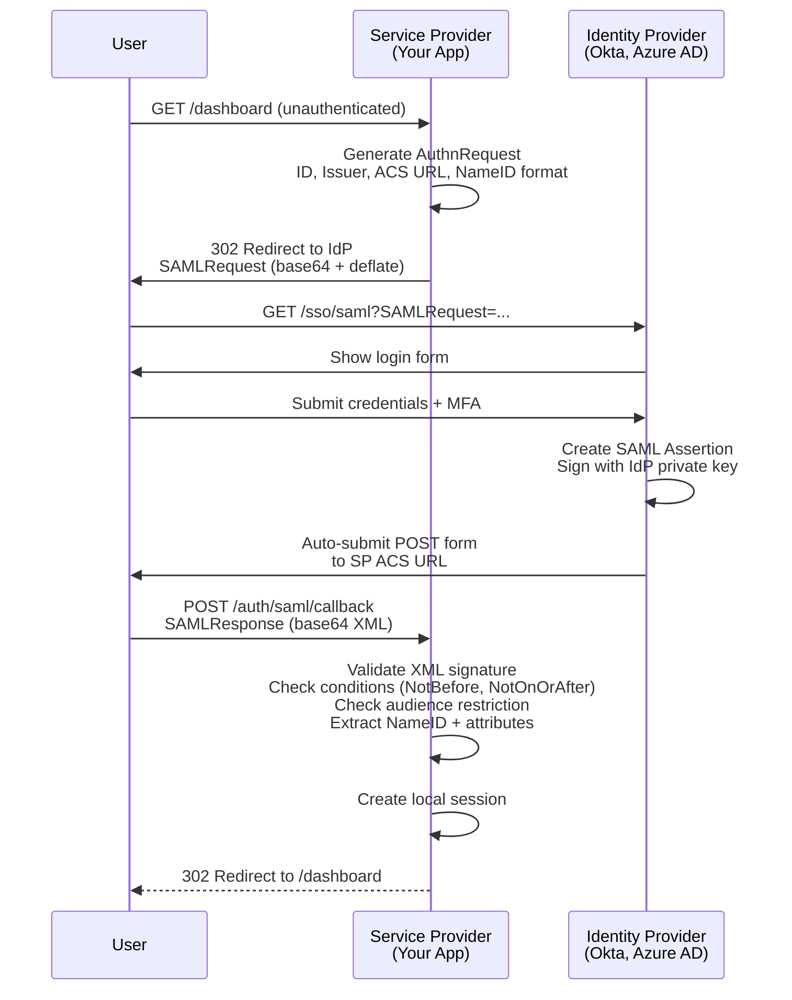
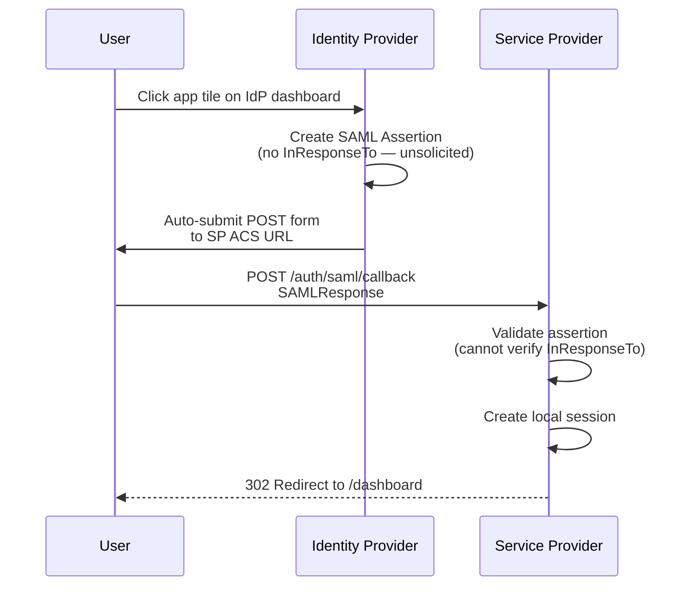
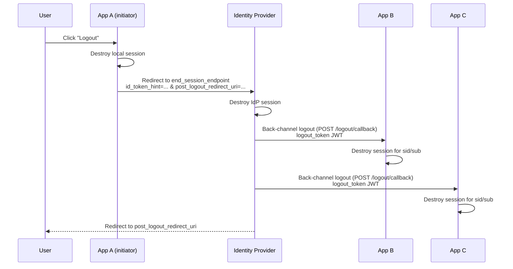
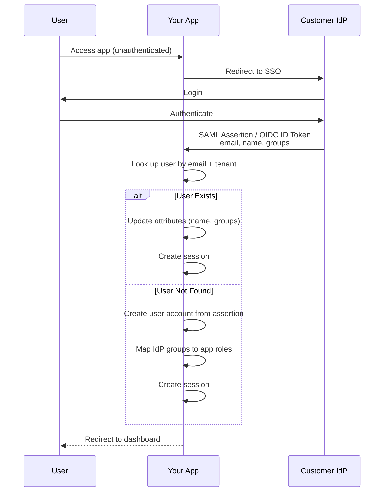
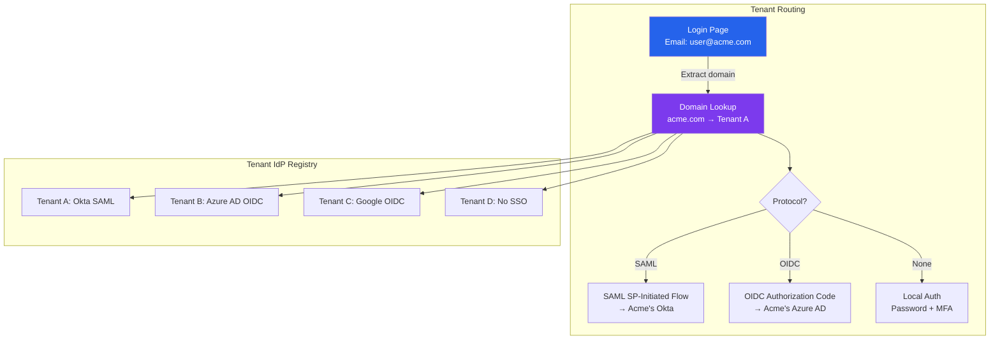

# Enterprise SSO (SAML & OIDC)

Enterprise customers demand SSO. It is the number one feature request that blocks B2B SaaS deals. When a Fortune 500 company evaluates your product, "Do you support SAML SSO?" is asked before pricing. This page covers everything you need to implement enterprise-grade SSO — from SAML assertion parsing to multi-tenant architecture to the operational reality of managing hundreds of IdP integrations.

## SSO Protocol Comparison

| Feature | SAML 2.0 | OIDC |
|---------|----------|------|
| **Format** | XML + XML Signatures | JSON + JWT |
| **Transport** | HTTP POST/Redirect bindings | HTTP redirects + back-channel |
| **Token** | SAML Assertion (XML) | ID Token (JWT) + Access Token |
| **Metadata** | XML metadata document | `.well-known/openid-configuration` |
| **Enterprise adoption** | Dominant (90%+ of enterprise IdPs) | Growing (modern IdPs support both) |
| **Complexity** | Very high (XML canonicalization, signature validation) | Moderate |
| **Mobile support** | Poor (XML parsing on mobile) | Good (JSON/JWT native) |
| **Recommended for** | Enterprise customers on Okta, ADFS, PingFederate | Modern IdPs, consumer + enterprise hybrid |

::: tip The Reality
You will need to support both. Legacy enterprise customers (government, finance, healthcare) require SAML. Modern companies prefer OIDC. Build your internal identity model to normalize both into the same user record.
:::

## SAML 2.0 Deep Dive

### SP-Initiated Flow (Most Common)

The Service Provider (your application) initiates the authentication flow. The user starts at your app, gets redirected to their IdP, authenticates, and returns with a SAML assertion.



### IdP-Initiated Flow

The user starts at the IdP's app dashboard and clicks on your application. No AuthnRequest — the IdP sends an unsolicited SAML assertion.



::: warning IdP-Initiated Flow Security Risk
IdP-initiated SSO is vulnerable to assertion replay attacks because there is no `InResponseTo` to correlate the response with a request. Mitigate by checking `NotOnOrAfter` (short window), tracking assertion IDs to prevent replay, and using `RelayState` for CSRF protection. Prefer SP-initiated flow whenever possible.
:::

### SAML Assertion Structure

```xml
<samlp:Response xmlns:samlp="urn:oasis:names:tc:SAML:2.0:protocol"
    ID="_response_123"
    InResponseTo="_request_456"
    IssueInstant="2026-03-20T10:00:00Z"
    Destination="https://app.example.com/auth/saml/callback">

  <saml:Issuer>https://idp.example.com</saml:Issuer>

  <samlp:Status>
    <samlp:StatusCode Value="urn:oasis:names:tc:SAML:2.0:status:Success"/>
  </samlp:Status>

  <saml:Assertion ID="_assertion_789" IssueInstant="2026-03-20T10:00:00Z">
    <saml:Issuer>https://idp.example.com</saml:Issuer>

    <ds:Signature><!-- XML Signature over the assertion --></ds:Signature>

    <saml:Subject>
      <saml:NameID Format="urn:oasis:names:tc:SAML:1.1:nameid-format:emailAddress">
        user@customer.com
      </saml:NameID>
      <saml:SubjectConfirmation Method="urn:oasis:names:tc:SAML:2.0:cm:bearer">
        <saml:SubjectConfirmationData
            InResponseTo="_request_456"
            NotOnOrAfter="2026-03-20T10:05:00Z"
            Recipient="https://app.example.com/auth/saml/callback"/>
      </saml:SubjectConfirmation>
    </saml:Subject>

    <saml:Conditions
        NotBefore="2026-03-20T09:59:00Z"
        NotOnOrAfter="2026-03-20T10:05:00Z">
      <saml:AudienceRestriction>
        <saml:Audience>https://app.example.com</saml:Audience>
      </saml:AudienceRestriction>
    </saml:Conditions>

    <saml:AttributeStatement>
      <saml:Attribute Name="firstName">
        <saml:AttributeValue>Jane</saml:AttributeValue>
      </saml:Attribute>
      <saml:Attribute Name="lastName">
        <saml:AttributeValue>Smith</saml:AttributeValue>
      </saml:Attribute>
      <saml:Attribute Name="groups">
        <saml:AttributeValue>Engineering</saml:AttributeValue>
        <saml:AttributeValue>Admin</saml:AttributeValue>
      </saml:Attribute>
    </saml:AttributeStatement>
  </saml:Assertion>
</samlp:Response>
```

### SAML Validation Checklist

| Check | What to Validate | Attack Prevented |
|-------|-----------------|------------------|
| XML signature | Signature is valid and covers the assertion (not just the response envelope) | Assertion tampering |
| Signature algorithm | Reject SHA-1, require SHA-256+ | Signature forgery |
| Certificate | Matches IdP metadata certificate | Impersonation |
| `NotBefore` / `NotOnOrAfter` | Current time is within range (with clock skew tolerance) | Replay with expired assertion |
| `Audience` | Matches your SP Entity ID | Cross-service assertion reuse |
| `Recipient` | Matches your ACS URL | Assertion redirection |
| `InResponseTo` | Matches the AuthnRequest ID you sent | Unsolicited assertion injection |
| `Destination` | Matches your ACS URL | Request routing attack |
| Assertion ID | Not previously seen (replay detection) | Replay attack |
| NameID format | Expected format (email, persistent, etc.) | Identity confusion |

::: danger XML Signature Wrapping Attacks
SAML's XML-based signatures are notoriously vulnerable to wrapping attacks, where an attacker moves the signed assertion within the XML tree and injects a malicious one. Always use a battle-tested SAML library (`saml2-js`, `passport-saml`, `python3-saml`) and never parse SAML XML manually.
:::

## OIDC for Enterprise

### Discovery

OIDC providers publish their configuration at a well-known endpoint:

```
GET https://idp.example.com/.well-known/openid-configuration
```

```json
{
  "issuer": "https://idp.example.com",
  "authorization_endpoint": "https://idp.example.com/authorize",
  "token_endpoint": "https://idp.example.com/token",
  "userinfo_endpoint": "https://idp.example.com/userinfo",
  "jwks_uri": "https://idp.example.com/.well-known/jwks.json",
  "end_session_endpoint": "https://idp.example.com/logout",
  "scopes_supported": ["openid", "profile", "email", "groups"],
  "response_types_supported": ["code"],
  "id_token_signing_alg_values_supported": ["RS256", "ES256"]
}
```

### Enterprise Logout

Single Logout (SLO) ensures that when a user logs out of one application, they are logged out of all applications and the IdP session.



::: tip Back-Channel Logout (OpenID Connect Back-Channel Logout 1.0)
Back-channel logout is more reliable than front-channel logout (which uses iframes and can be blocked by browsers). Your app registers a `backchannel_logout_uri`, and the IdP sends a signed `logout_token` JWT directly to your server. This works even if the user closes their browser.
:::

## SCIM Provisioning

SCIM (System for Cross-domain Identity Management, RFC 7644) automates user provisioning between IdPs and your application. Without SCIM, you rely on JIT provisioning or manual user management.

### SCIM Operations

| Operation | HTTP Method | Endpoint | Purpose |
|-----------|-------------|----------|---------|
| Create user | POST | `/scim/v2/Users` | New employee onboarded |
| Get user | GET | `/scim/v2/Users/{id}` | Sync check |
| Update user | PATCH | `/scim/v2/Users/{id}` | Name change, role update |
| Deactivate user | PATCH | `/scim/v2/Users/{id}` | Employee offboarded |
| Delete user | DELETE | `/scim/v2/Users/{id}` | Permanent removal |
| List users | GET | `/scim/v2/Users?filter=...` | Full sync reconciliation |
| Create group | POST | `/scim/v2/Groups` | New department |
| Update group members | PATCH | `/scim/v2/Groups/{id}` | Team changes |

### SCIM Endpoint Implementation

```typescript
import express from 'express';

const scimRouter = express.Router();

// Authentication: SCIM endpoints use Bearer tokens (shared secret or OAuth)
scimRouter.use(authenticateScimClient);

// Create user
scimRouter.post('/scim/v2/Users', async (req, res) => {
  const scimUser = req.body;

  const user = await db.users.create({
    externalId: scimUser.externalId,
    email: scimUser.emails?.[0]?.value,
    firstName: scimUser.name?.givenName,
    lastName: scimUser.name?.familyName,
    active: scimUser.active ?? true,
    tenantId: req.scimTenantId, // From auth context
    source: 'scim',
  });

  res.status(201).json(toScimUser(user));
});

// Update user (PATCH with SCIM operations)
scimRouter.patch('/scim/v2/Users/:id', async (req, res) => {
  const { Operations } = req.body;

  for (const op of Operations) {
    switch (op.op) {
      case 'replace':
        if (op.path === 'active' && op.value === false) {
          // Deactivation — revoke all sessions immediately
          await db.users.deactivate(req.params.id);
          await sessionStore.revokeAllForUser(req.params.id);
        }
        // Handle other attribute updates...
        break;
    }
  }

  const user = await db.users.findById(req.params.id);
  res.json(toScimUser(user));
});

// SCIM filtering support
scimRouter.get('/scim/v2/Users', async (req, res) => {
  const filter = req.query.filter as string;
  // Parse SCIM filter: userName eq "john@example.com"
  const parsed = parseScimFilter(filter);
  const users = await db.users.findByFilter(parsed, req.scimTenantId);

  res.json({
    schemas: ['urn:ietf:params:scim:api:messages:2.0:ListResponse'],
    totalResults: users.length,
    Resources: users.map(toScimUser),
  });
});
```

## Just-in-Time (JIT) Provisioning

JIT provisioning creates user accounts automatically on first SSO login, without SCIM. It is simpler but less powerful.



### JIT vs SCIM

| Capability | JIT | SCIM |
|------------|-----|------|
| User creation | On first login | Before first login |
| User deactivation | Cannot detect (user just stops logging in) | Immediate on IdP deactivation |
| Attribute updates | On next login | Near real-time |
| Group sync | On next login | Near real-time |
| Pre-provisioning | Not possible | Users exist before they need access |
| Offboarding | Broken — user remains active if they never log in again | Automatic deactivation |
| Complexity | Low | High |

::: warning JIT Provisioning Security Gap
JIT provisioning cannot deactivate users. When an employee is fired and removed from the IdP, your app does not know until that user tries (and fails) to log in via SSO. With SCIM, the deactivation is pushed to your app immediately. For enterprise customers with compliance requirements, SCIM is mandatory.
:::

## IdP Metadata and Certificate Rotation

### Metadata Management

Each IdP connection stores metadata that must be kept in sync:

```typescript
interface IdPConfiguration {
  tenantId: string;
  protocol: 'saml' | 'oidc';

  // SAML-specific
  saml?: {
    entityId: string;
    ssoUrl: string;
    sloUrl?: string;
    certificate: string;        // Current signing certificate
    certificateBackup?: string; // Next certificate (for rotation)
    nameIdFormat: string;
    signedAssertions: boolean;
    signedResponses: boolean;
  };

  // OIDC-specific
  oidc?: {
    issuer: string;
    clientId: string;
    clientSecret: string; // Encrypted at rest
    discoveryUrl: string;
    scopes: string[];
  };

  // Attribute mapping
  attributeMapping: {
    email: string;        // e.g., "http://schemas.xmlsoap.org/ws/2005/05/identity/claims/emailaddress"
    firstName: string;
    lastName: string;
    groups: string;
    department?: string;
  };

  // Role mapping
  roleMapping: Record<string, string>; // IdP group -> App role
}
```

### Certificate Rotation

IdPs rotate their signing certificates periodically. If your app only stores one certificate, SSO breaks when the IdP rotates.

```typescript
async function validateSamlSignature(
  assertion: string,
  idpConfig: IdPConfiguration
): Promise<boolean> {
  const certs = [
    idpConfig.saml!.certificate,
    idpConfig.saml!.certificateBackup,
  ].filter(Boolean) as string[];

  // Try each certificate — support rotation window
  for (const cert of certs) {
    try {
      const valid = await verifySamlSignature(assertion, cert);
      if (valid) return true;
    } catch {
      continue;
    }
  }

  return false;
}
```

::: tip Automatic Metadata Refresh
For OIDC providers, fetch the `.well-known/openid-configuration` and JWKS periodically (every 6-24 hours) to pick up key rotations automatically. For SAML, set up metadata URL polling if the IdP supports it, or implement a certificate rotation UI for admins.
:::

## Multi-Tenant SSO Architecture

Each customer (tenant) has their own IdP. Your app must route users to the correct IdP based on their identity.



### Tenant Discovery

```typescript
async function discoverTenant(email: string): Promise<{
  tenantId: string;
  authMethod: 'saml' | 'oidc' | 'local';
  idpConfig?: IdPConfiguration;
}> {
  const domain = email.split('@')[1].toLowerCase();

  // Check domain-to-tenant mapping
  const mapping = await db.ssoMappings.findByDomain(domain);

  if (!mapping) {
    // No SSO configured — fall back to local auth
    return { tenantId: 'default', authMethod: 'local' };
  }

  const idpConfig = await db.idpConfigurations.findByTenantId(mapping.tenantId);

  return {
    tenantId: mapping.tenantId,
    authMethod: idpConfig.protocol,
    idpConfig,
  };
}
```

## Integration Patterns

### Okta Integration Checklist

| Step | Action | Notes |
|------|--------|-------|
| 1 | Create SAML app in Okta admin | Use SP-initiated SSO |
| 2 | Configure ACS URL | `https://app.example.com/auth/saml/{tenantId}/callback` |
| 3 | Set Entity ID | `https://app.example.com/saml/metadata/{tenantId}` |
| 4 | Map attributes | email, firstName, lastName, groups |
| 5 | Download IdP metadata | Or use metadata URL for auto-refresh |
| 6 | Configure SCIM | Token-based auth, base URL, attribute mapping |
| 7 | Test SP-initiated flow | Login from your app |
| 8 | Test IdP-initiated flow | Click app tile in Okta |
| 9 | Test SCIM create/update/deactivate | Assign/unassign users in Okta |

### Azure AD (Entra ID) Integration

Azure AD supports both SAML and OIDC. OIDC is preferred for new integrations.

```typescript
// Azure AD OIDC configuration
const azureOidcConfig = {
  issuer: `https://login.microsoftonline.com/${tenantId}/v2.0`,
  discoveryUrl: `https://login.microsoftonline.com/${tenantId}/v2.0/.well-known/openid-configuration`,
  clientId: process.env.AZURE_CLIENT_ID!,
  clientSecret: process.env.AZURE_CLIENT_SECRET!,
  scopes: ['openid', 'profile', 'email', 'User.Read'],
  // Azure-specific: groups are in the ID token if configured
  // or require a Graph API call for large group counts
};
```

### Self-Hosted Keycloak

```typescript
// Keycloak OIDC configuration
const keycloakConfig = {
  issuer: `https://keycloak.customer.com/realms/${realm}`,
  discoveryUrl: `https://keycloak.customer.com/realms/${realm}/.well-known/openid-configuration`,
  clientId: 'your-app',
  clientSecret: process.env.KEYCLOAK_CLIENT_SECRET!,
  scopes: ['openid', 'profile', 'email', 'roles'],
  // Keycloak puts roles in the access token by default
  // Configure a "client scope" mapper for ID token roles
};
```

## SSO Setup Self-Service UI

Enterprise customers should be able to configure SSO themselves through your admin panel, rather than requiring support tickets.

### Configuration Wizard Steps

1. **Choose protocol** — SAML or OIDC
2. **Domain verification** — Prove ownership of the email domain (DNS TXT record or email to admin@domain.com)
3. **IdP configuration** — Upload metadata XML or enter OIDC discovery URL
4. **Attribute mapping** — Map IdP attributes to your user fields
5. **Role mapping** — Map IdP groups to application roles
6. **Test connection** — SP-initiated test login with a test user
7. **Enforce SSO** — Optionally require SSO for all users on the domain (disable password login)

## Further Reading

- [OAuth 2.0 Flows Complete Guide](./oauth2-flows.md) — PKCE, Client Credentials, Device Authorization
- [Auth System Architecture](./auth-architecture.md) — Federated auth architecture patterns
- [Token Strategies Deep Dive](./token-strategies.md) — Token formats for SSO-issued credentials
- [RBAC, ABAC & ReBAC](/security/authorization/rbac-abac-rebac.md) — Authorization models for enterprise role mapping
- [Audit Logging](/security/compliance/audit-logging.md) — Logging SSO events for compliance
- [A07: Authentication Failures](/security/owasp/a07-auth-failures.md) — OWASP authentication vulnerability patterns
