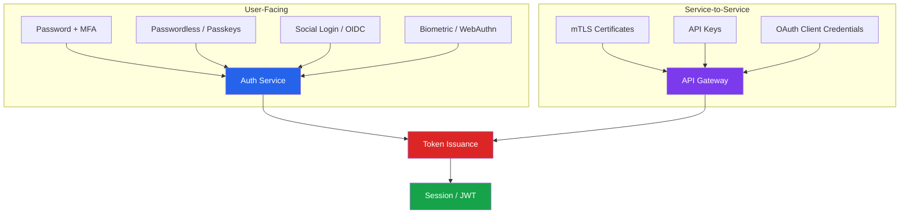
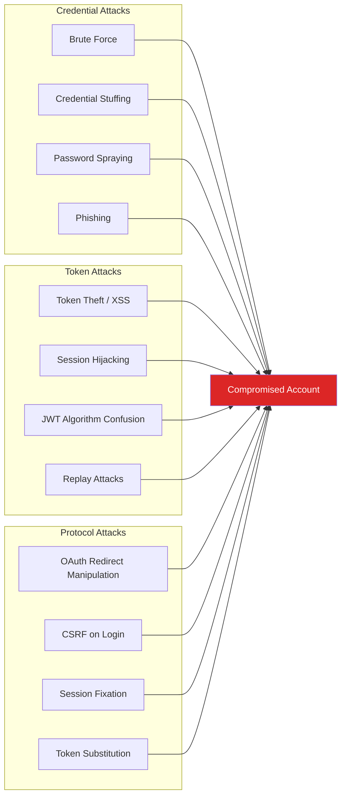
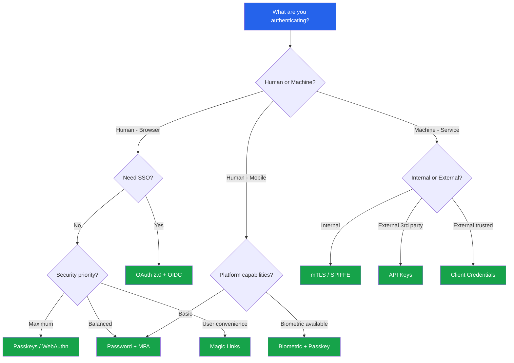

# Authentication

Authentication answers the question: **who are you?** It is the process of verifying that a user, device, or system is who it claims to be. Authorization (a separate concern) answers what they are allowed to do. Getting authentication wrong means every authorization check downstream is meaningless — you are enforcing permissions against an identity that might be forged.

## The Authentication Landscape

Modern applications rarely rely on a single authentication mechanism. A typical production system combines several layers:

## Core Principles

::: tip Principle 1 — Defense in Depth
Never rely on a single authentication factor. Combine something the user knows (password), something they have (phone, security key), and something they are (biometric). Each additional factor exponentially increases the difficulty for an attacker.
:::

::: tip Principle 2 — Fail Closed
If the authentication system is unavailable, deny access. Never fall back to a weaker mechanism or bypass authentication entirely because the identity provider is down.
:::

::: tip Principle 3 — Minimize Token Lifetime
Short-lived tokens limit the window of exploitation. A stolen JWT that expires in 15 minutes is far less dangerous than one that is valid for 30 days.
:::

::: warning Principle 4 — Never Roll Your Own Crypto
Use battle-tested libraries for token signing, password hashing, and key derivation. Custom implementations almost always contain subtle flaws that attackers can exploit.
:::

## Authentication Factors

| Factor | Category | Examples | Strength |
|--------|----------|----------|----------|
| Password | Knowledge | Passphrase, PIN | Low (phishable) |
| TOTP Code | Possession | Authenticator app | Medium (phishable) |
| Hardware Key | Possession | YubiKey, Titan | High (phishing-resistant) |
| Passkey | Possession + Inherence | FIDO2 credential | High (phishing-resistant) |
| Biometric | Inherence | Fingerprint, Face ID | Medium (not revocable) |
| Magic Link | Possession | Email with token | Medium (depends on email security) |
| Client Certificate | Possession | mTLS cert | High (mutual verification) |

## Attack Surface Overview

## Section Contents

| Topic | What You Will Learn |
|-------|-------------------|
| [JWT Deep Dive](./jwt-deep-dive.md) | JWT structure, signing algorithms, token lifecycle, refresh rotation, revocation strategies, and claims design with `jose` |
| [OAuth 2.0 & OIDC](./oauth2-oidc.md) | Authorization Code + PKCE, Client Credentials, Device Code flows, OIDC ID tokens, and sequence diagrams |
| [Session Management](./session-management.md) | Server-side sessions with Redis, secure cookie configuration, session fixation prevention |
| [MFA Implementation](./mfa-implementation.md) | TOTP (RFC 6238), WebAuthn/FIDO2, backup codes, and production TypeScript implementations |
| [Passwordless Authentication](./passwordless.md) | Magic links, passkeys, email OTP, and the UX-security tradeoff |
| [API Key Design](./api-key-design.md) | Key generation, hashing, rotation, scoping, and rate limiting per key |
| [Biometric Authentication](./biometric-auth.md) | WebAuthn API, FIDO2 protocol, platform authenticators, and attestation |

## Choosing the Right Mechanism

::: danger Common Mistakes
- Storing passwords in plaintext or with weak hashing (MD5, SHA-1)
- Using JWTs with `"alg": "none"` or accepting unsigned tokens
- Not implementing rate limiting on login endpoints
- Trusting the `redirect_uri` parameter without validation in OAuth flows
- Storing session tokens in localStorage (vulnerable to XSS)
- Not rotating refresh tokens on use
- Hardcoding API keys in client-side code
:::
