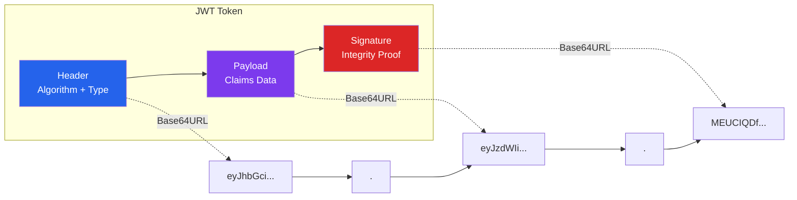
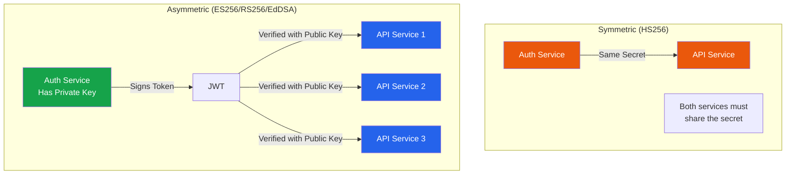
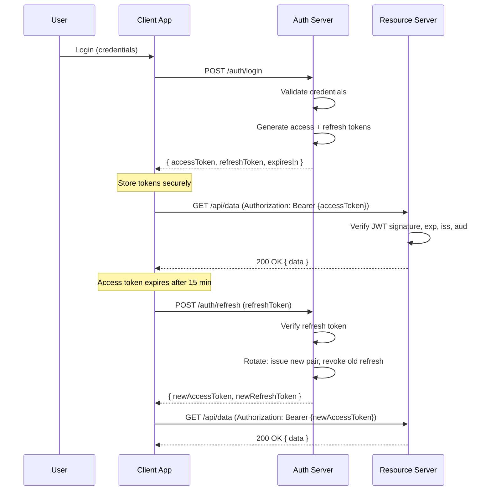

# JWT Deep Dive

JSON Web Tokens (JWT, pronounced "jot") are an open standard (RFC 7519) for creating compact, URL-safe tokens that carry claims between two parties. They are the dominant token format in modern web applications, but they are also one of the most frequently misimplemented security mechanisms. This guide covers everything from the binary structure to production-grade TypeScript implementations.

## JWT Structure

A JWT consists of three Base64URL-encoded parts separated by dots:

```
eyJhbGciOiJFUzI1NiIsInR5cCI6IkpXVCJ9.eyJzdWIiOiJ1c2VyXzEyMyIsInJvbGUiOiJhZG1pbiIsImlhdCI6MTcxMDAwMDAwMCwiZXhwIjoxNzEwMDAwOTAwfQ.MEUCIQDf...signature
|_________ Header _________|___________________________ Payload __________________________|____________ Signature ___________|
```



### Header

The header typically contains two fields:

```json
{
  "alg": "ES256",
  "typ": "JWT",
  "kid": "key-2024-03"
}
```

- **alg** — The signing algorithm (HS256, RS256, ES256, EdDSA)
- **typ** — The token type (always "JWT")
- **kid** — Key ID, used for key rotation (optional but recommended)

### Payload (Claims)

Claims are statements about the user and metadata. There are three types:

**Registered Claims** (RFC 7519 Section 4.1):

| Claim | Name | Description |
|-------|------|-------------|
| `iss` | Issuer | Who issued the token |
| `sub` | Subject | Who the token is about (user ID) |
| `aud` | Audience | Who the token is intended for |
| `exp` | Expiration | Unix timestamp when token expires |
| `nbf` | Not Before | Unix timestamp when token becomes valid |
| `iat` | Issued At | Unix timestamp when token was issued |
| `jti` | JWT ID | Unique token identifier (for revocation) |

**Public Claims** — Registered in the IANA JWT Claims Registry (e.g., `email`, `name`).

**Private Claims** — Custom claims agreed between parties (e.g., `role`, `org_id`).

```json
{
  "iss": "https://auth.example.com",
  "sub": "user_abc123",
  "aud": "https://api.example.com",
  "exp": 1710000900,
  "iat": 1710000000,
  "jti": "tok_7f3a9c2e",
  "role": "admin",
  "org_id": "org_456",
  "permissions": ["read:users", "write:users"]
}
```

### Signature

The signature ensures the token has not been tampered with:

```
SIGNATURE = SIGN(
  base64url(header) + "." + base64url(payload),
  secret_or_private_key
)
```

## Signing Algorithms

### Algorithm Comparison

| Algorithm | Type | Key Size | Speed | Security | Use Case |
|-----------|------|----------|-------|----------|----------|
| HS256 | Symmetric (HMAC) | 256-bit | Fastest | Good | Single-service, internal |
| RS256 | Asymmetric (RSA) | 2048-bit+ | Slow | Good | Multi-service, JWKS |
| ES256 | Asymmetric (ECDSA) | P-256 | Fast | Better | Production default |
| EdDSA | Asymmetric (Ed25519) | 256-bit | Fastest asymmetric | Best | Modern systems |



::: warning Why Asymmetric Is Preferred
With symmetric signing (HS256), every service that needs to verify tokens must have the secret — and any service with the secret can also forge tokens. Asymmetric signing separates signing (private key) from verification (public key). Only the auth service can create tokens; everyone else can only verify them.
:::

### TypeScript Implementation with jose

```typescript
import {
  SignJWT,
  jwtVerify,
  generateKeyPair,
  exportJWK,
  importJWK,
  JWTPayload,
  KeyLike,
  JWTVerifyResult,
} from 'jose';
import { randomUUID } from 'crypto';

// ─── Key Management ──────────────────────────────────────────

interface KeyPairWithMetadata {
  kid: string;
  privateKey: KeyLike;
  publicKey: KeyLike;
  algorithm: string;
  createdAt: Date;
  expiresAt: Date;
}

class JWTKeyManager {
  private keys: Map<string, KeyPairWithMetadata> = new Map();
  private currentKid: string | null = null;

  async generateKeyPair(
    algorithm: 'ES256' | 'EdDSA' | 'RS256' = 'ES256',
    validityDays: number = 90
  ): Promise<string> {
    const kid = `key_${Date.now()}_${randomUUID().slice(0, 8)}`;
    const { privateKey, publicKey } = await generateKeyPair(algorithm);

    const now = new Date();
    const expiresAt = new Date(now);
    expiresAt.setDate(expiresAt.getDate() + validityDays);

    this.keys.set(kid, {
      kid,
      privateKey,
      publicKey,
      algorithm,
      createdAt: now,
      expiresAt,
    });

    this.currentKid = kid;
    return kid;
  }

  getCurrentSigningKey(): KeyPairWithMetadata {
    if (!this.currentKid || !this.keys.has(this.currentKid)) {
      throw new Error('No active signing key. Generate a key pair first.');
    }
    return this.keys.get(this.currentKid)!;
  }

  getVerificationKey(kid: string): KeyPairWithMetadata | undefined {
    return this.keys.get(kid);
  }

  // JWKS endpoint — exposes only public keys
  async getJWKS(): Promise<{ keys: object[] }> {
    const jwks: object[] = [];
    for (const [kid, keyData] of this.keys) {
      const jwk = await exportJWK(keyData.publicKey);
      jwks.push({
        ...jwk,
        kid,
        alg: keyData.algorithm,
        use: 'sig',
      });
    }
    return { keys: jwks };
  }
}

// ─── Token Service ────────────────────────────────────────────

interface TokenClaims {
  userId: string;
  role: string;
  orgId?: string;
  permissions?: string[];
}

interface TokenPair {
  accessToken: string;
  refreshToken: string;
  expiresIn: number;
}

class TokenService {
  private keyManager: JWTKeyManager;
  private issuer: string;
  private audience: string;
  private accessTokenTTL: number;   // seconds
  private refreshTokenTTL: number;  // seconds

  constructor(config: {
    keyManager: JWTKeyManager;
    issuer: string;
    audience: string;
    accessTokenTTL?: number;
    refreshTokenTTL?: number;
  }) {
    this.keyManager = config.keyManager;
    this.issuer = config.issuer;
    this.audience = config.audience;
    this.accessTokenTTL = config.accessTokenTTL ?? 900;      // 15 minutes
    this.refreshTokenTTL = config.refreshTokenTTL ?? 604800;  // 7 days
  }

  async issueTokenPair(claims: TokenClaims): Promise<TokenPair> {
    const { kid, privateKey, algorithm } = this.keyManager.getCurrentSigningKey();
    const jti = randomUUID();

    const accessToken = await new SignJWT({
      role: claims.role,
      org_id: claims.orgId,
      permissions: claims.permissions,
      token_type: 'access',
    })
      .setProtectedHeader({ alg: algorithm, kid, typ: 'JWT' })
      .setSubject(claims.userId)
      .setIssuer(this.issuer)
      .setAudience(this.audience)
      .setIssuedAt()
      .setExpirationTime(`${this.accessTokenTTL}s`)
      .setJti(jti)
      .sign(privateKey);

    const refreshJti = randomUUID();
    const refreshToken = await new SignJWT({
      token_type: 'refresh',
      access_jti: jti, // Links refresh token to the access token
    })
      .setProtectedHeader({ alg: algorithm, kid, typ: 'JWT' })
      .setSubject(claims.userId)
      .setIssuer(this.issuer)
      .setAudience(this.audience)
      .setIssuedAt()
      .setExpirationTime(`${this.refreshTokenTTL}s`)
      .setJti(refreshJti)
      .sign(privateKey);

    return {
      accessToken,
      refreshToken,
      expiresIn: this.accessTokenTTL,
    };
  }

  async verifyAccessToken(token: string): Promise<JWTVerifyResult> {
    // Decode header to get kid without verification
    const headerB64 = token.split('.')[0];
    const header = JSON.parse(
      Buffer.from(headerB64, 'base64url').toString()
    );

    if (!header.kid) {
      throw new Error('Token missing kid header');
    }

    const keyData = this.keyManager.getVerificationKey(header.kid);
    if (!keyData) {
      throw new Error(`Unknown key ID: ${header.kid}`);
    }

    const result = await jwtVerify(token, keyData.publicKey, {
      issuer: this.issuer,
      audience: this.audience,
      clockTolerance: 30, // Allow 30 seconds of clock skew
    });

    // Verify this is an access token, not a refresh token
    if (result.payload.token_type !== 'access') {
      throw new Error('Expected access token, got refresh token');
    }

    return result;
  }

  async verifyRefreshToken(token: string): Promise<JWTVerifyResult> {
    const headerB64 = token.split('.')[0];
    const header = JSON.parse(
      Buffer.from(headerB64, 'base64url').toString()
    );

    const keyData = this.keyManager.getVerificationKey(header.kid);
    if (!keyData) {
      throw new Error(`Unknown key ID: ${header.kid}`);
    }

    const result = await jwtVerify(token, keyData.publicKey, {
      issuer: this.issuer,
      audience: this.audience,
    });

    if (result.payload.token_type !== 'refresh') {
      throw new Error('Expected refresh token, got access token');
    }

    return result;
  }
}
```

## Token Lifecycle



## Refresh Token Rotation

Refresh token rotation is a critical security pattern. Every time a refresh token is used, it is invalidated and a new one is issued. If an attacker steals and uses a refresh token, the legitimate user's next refresh attempt will fail (because the old token was already used), triggering automatic revocation of the entire token family.

```typescript
import { Redis } from 'ioredis';

interface TokenFamily {
  userId: string;
  familyId: string;
  currentRefreshJti: string;
  createdAt: number;
  lastRotatedAt: number;
}

class RefreshTokenRotation {
  private redis: Redis;
  private tokenService: TokenService;

  constructor(redis: Redis, tokenService: TokenService) {
    this.redis = redis;
    this.tokenService = tokenService;
  }

  // Create a new token family on initial login
  async createFamily(userId: string, claims: TokenClaims): Promise<TokenPair> {
    const familyId = randomUUID();
    const tokenPair = await this.tokenService.issueTokenPair(claims);

    // Extract the refresh token JTI
    const refreshPayload = this.decodePayload(tokenPair.refreshToken);

    const family: TokenFamily = {
      userId,
      familyId,
      currentRefreshJti: refreshPayload.jti!,
      createdAt: Date.now(),
      lastRotatedAt: Date.now(),
    };

    // Store family with TTL matching refresh token lifetime
    await this.redis.setex(
      `token_family:${familyId}`,
      604800, // 7 days
      JSON.stringify(family)
    );

    // Map refresh JTI to family
    await this.redis.setex(
      `refresh_jti:${refreshPayload.jti}`,
      604800,
      familyId
    );

    return tokenPair;
  }

  // Rotate tokens — issue new pair, invalidate old refresh
  async rotate(refreshToken: string, claims: TokenClaims): Promise<TokenPair> {
    const result = await this.tokenService.verifyRefreshToken(refreshToken);
    const { sub: userId, jti: currentJti } = result.payload;

    // Look up the family for this refresh token
    const familyId = await this.redis.get(`refresh_jti:${currentJti}`);
    if (!familyId) {
      // This JTI is not recognized — possible reuse attack
      throw new Error('Invalid refresh token');
    }

    const familyData = await this.redis.get(`token_family:${familyId}`);
    if (!familyData) {
      throw new Error('Token family not found');
    }

    const family: TokenFamily = JSON.parse(familyData);

    // CRITICAL: Check if this is the CURRENT refresh token for the family
    if (family.currentRefreshJti !== currentJti) {
      // REUSE DETECTED — an old refresh token was used
      // This means either:
      //   1. An attacker stole an old refresh token and is using it
      //   2. A legitimate user had their token stolen and the attacker used it first
      // Either way, revoke the ENTIRE family to protect the user
      console.error(
        `SECURITY: Refresh token reuse detected for user ${userId}, family ${familyId}`
      );
      await this.revokeFamily(familyId);
      throw new Error('Refresh token reuse detected — all sessions revoked');
    }

    // Issue new token pair
    const newTokenPair = await this.tokenService.issueTokenPair(claims);
    const newRefreshPayload = this.decodePayload(newTokenPair.refreshToken);

    // Update the family with the new refresh JTI
    family.currentRefreshJti = newRefreshPayload.jti!;
    family.lastRotatedAt = Date.now();

    await this.redis.setex(
      `token_family:${familyId}`,
      604800,
      JSON.stringify(family)
    );

    // Map new JTI to family (keep old mapping for reuse detection)
    await this.redis.setex(
      `refresh_jti:${newRefreshPayload.jti}`,
      604800,
      familyId
    );

    // Mark old JTI as used (but don't delete — needed for reuse detection)
    await this.redis.setex(
      `refresh_used:${currentJti}`,
      604800,
      'true'
    );

    return newTokenPair;
  }

  // Revoke an entire token family (logout or security event)
  async revokeFamily(familyId: string): Promise<void> {
    await this.redis.del(`token_family:${familyId}`);
    // In production, also add all access token JTIs to a blocklist
  }

  private decodePayload(token: string): JWTPayload {
    const payloadB64 = token.split('.')[1];
    return JSON.parse(Buffer.from(payloadB64, 'base64url').toString());
  }
}
```

::: danger Reuse Detection Is Non-Negotiable
Without reuse detection, a stolen refresh token gives the attacker indefinite access. With rotation plus reuse detection, the moment either party (attacker or victim) uses an old token, the entire family is revoked, forcing re-authentication.
:::

## Token Revocation Strategies

JWTs are stateless by design — the server does not need to look up a database to verify them. But this creates a problem: how do you revoke a token before it expires?

```mermaid
graph TB
    subgraph "Strategy 1: Short-Lived Access Tokens"
        S1A[Access Token: 15 min TTL] --> S1B[No revocation needed]
        S1B --> S1C[Revoke refresh token instead]
    end

    subgraph "Strategy 2: Token Blocklist"
        S2A[Revoked JTI stored in Redis] --> S2B[Check blocklist on every request]
        S2B --> S2C[TTL matches token expiry]
    end

    subgraph "Strategy 3: Token Versioning"
        S3A[User record has token_version] --> S3B[JWT includes version claim]
        S3B --> S3C[Increment version to revoke all tokens]
    end

    style S1A fill:#16a34a,color:#fff
    style S2A fill:#2563eb,color:#fff
    style S3A fill:#7c3aed,color:#fff
```



### Blocklist Implementation

```typescript
class TokenBlocklist {
  private redis: Redis;

  constructor(redis: Redis) {
    this.redis = redis;
  }

  // Revoke a specific token by JTI
  async revoke(jti: string, expiresAt: number): Promise<void> {
    const ttl = expiresAt - Math.floor(Date.now() / 1000);
    if (ttl > 0) {
      // Only store until the token would have expired anyway
      await this.redis.setex(`blocklist:${jti}`, ttl, '1');
    }
  }

  // Check if a token is revoked
  async isRevoked(jti: string): Promise<boolean> {
    const result = await this.redis.get(`blocklist:${jti}`);
    return result !== null;
  }

  // Revoke all tokens for a user (via version increment)
  async revokeAllForUser(
    userId: string,
    db: Pool
  ): Promise<void> {
    await db.query(
      'UPDATE users SET token_version = token_version + 1 WHERE id = $1',
      [userId]
    );
  }
}

// ─── Middleware that checks blocklist ───────────────────────

import { Request, Response, NextFunction } from 'express';

function createAuthMiddleware(
  tokenService: TokenService,
  blocklist: TokenBlocklist
) {
  return async (req: Request, res: Response, next: NextFunction) => {
    const authHeader = req.headers.authorization;
    if (!authHeader?.startsWith('Bearer ')) {
      return res.status(401).json({ error: 'Missing authorization header' });
    }

    const token = authHeader.slice(7);

    try {
      const result = await tokenService.verifyAccessToken(token);
      const { jti } = result.payload;

      // Check blocklist
      if (jti && await blocklist.isRevoked(jti)) {
        return res.status(401).json({ error: 'Token has been revoked' });
      }

      // Attach user info to request
      (req as any).user = {
        id: result.payload.sub,
        role: result.payload.role,
        permissions: result.payload.permissions,
      };

      next();
    } catch (error) {
      return res.status(401).json({ error: 'Invalid or expired token' });
    }
  };
}
```

## Claims Design Patterns

::: tip Keep Claims Lean
Every claim increases the token size, and tokens are sent with every request. Include only what the resource server needs to make authorization decisions without a database lookup.
:::

### Good Claims Design

```typescript
// GOOD: Minimal, authorization-relevant claims
const goodClaims = {
  sub: 'user_abc123',           // Who
  role: 'editor',               // Coarse-grained role
  org_id: 'org_456',            // Tenant isolation
  permissions: ['read:docs', 'write:docs'], // Fine-grained permissions
  // Standard claims
  iss: 'https://auth.example.com',
  aud: 'https://api.example.com',
  exp: 1710000900,
  iat: 1710000000,
  jti: 'tok_7f3a9c2e',
};
```

### Bad Claims Design

```typescript
// BAD: Too much data, sensitive information in claims
const badClaims = {
  sub: 'user_abc123',
  email: 'user@example.com',       // PII — not needed for authz
  name: 'John Doe',                // PII — not needed for authz
  address: '123 Main St',          // Sensitive PII!
  phone: '+1-555-0123',            // Sensitive PII!
  subscription_plan: 'enterprise', // Business logic — query DB instead
  feature_flags: {                 // Too much data, changes frequently
    darkMode: true,
    betaFeatures: true,
    newDashboard: false,
  },
  full_permission_matrix: { /* ... 50 entries ... */ }, // Too large
};
```

## Common JWT Vulnerabilities

### 1. Algorithm Confusion Attack

```typescript
// VULNERABLE: Accepts any algorithm
import jwt from 'jsonwebtoken'; // Using the older jsonwebtoken library

const decoded = jwt.verify(token, publicKey); // Doesn't restrict algorithm!

// ATTACK: Attacker signs with HS256 using the PUBLIC key as the HMAC secret
// The server, expecting RS256, verifies with the public key
// But since alg=HS256, it treats the public key as an HMAC secret
// The attacker has the public key (it's public!), so they can forge tokens.

// FIXED: Always specify the expected algorithm
const decoded = jwt.verify(token, publicKey, {
  algorithms: ['RS256'], // Only accept RS256
});

// BETTER: Use jose, which requires explicit algorithm specification
import { jwtVerify } from 'jose';
const { payload } = await jwtVerify(token, publicKey, {
  algorithms: ['ES256'], // Required — no algorithm confusion possible
});
```

### 2. Missing Audience Validation

```typescript
// VULNERABLE: Token issued for service A accepted by service B
const { payload } = await jwtVerify(token, key);
// No audience check — a token for payments.example.com
// is accepted by users.example.com

// FIXED: Validate the audience
const { payload } = await jwtVerify(token, key, {
  audience: 'https://users.example.com', // Reject tokens for other services
  issuer: 'https://auth.example.com',
});
```

### 3. Token in URL Query Parameters

```typescript
// VULNERABLE: Token in URL — logged in server logs, browser history, referrer headers
app.get('/api/data?token=eyJhbG...', handler);

// FIXED: Always send tokens in the Authorization header
// Authorization: Bearer eyJhbG...
```

### 4. Missing Expiration

```typescript
// VULNERABLE: Token never expires
const token = await new SignJWT({ sub: userId })
  .setProtectedHeader({ alg: 'ES256' })
  .sign(privateKey);
// No .setExpirationTime() — this token is valid forever!

// FIXED: Always set expiration
const token = await new SignJWT({ sub: userId })
  .setProtectedHeader({ alg: 'ES256' })
  .setExpirationTime('15m') // Expires in 15 minutes
  .setIssuedAt()
  .setJti(randomUUID()) // Unique ID for revocation
  .sign(privateKey);
```

## Express.js Integration

```typescript
import express from 'express';
import { Redis } from 'ioredis';

const app = express();
const redis = new Redis();

// Initialize key manager and token service
const keyManager = new JWTKeyManager();
const tokenService = new TokenService({
  keyManager,
  issuer: 'https://auth.example.com',
  audience: 'https://api.example.com',
  accessTokenTTL: 900,     // 15 minutes
  refreshTokenTTL: 604800, // 7 days
});

const blocklist = new TokenBlocklist(redis);
const refreshRotation = new RefreshTokenRotation(redis, tokenService);

// Generate initial signing key
await keyManager.generateKeyPair('ES256');

// ─── JWKS Endpoint ──────────────────────────────────────────

app.get('/.well-known/jwks.json', async (_req, res) => {
  const jwks = await keyManager.getJWKS();
  res.json(jwks);
});

// ─── Login ───────────────────────────────────────────────────

app.post('/auth/login', async (req, res) => {
  const { email, password } = req.body;

  // Validate credentials (implementation depends on your user store)
  const user = await authenticateUser(email, password);
  if (!user) {
    // Generic error — don't reveal whether email exists
    return res.status(401).json({ error: 'Invalid credentials' });
  }

  const claims: TokenClaims = {
    userId: user.id,
    role: user.role,
    orgId: user.orgId,
    permissions: user.permissions,
  };

  const tokenPair = await refreshRotation.createFamily(user.id, claims);

  // Set refresh token in httpOnly cookie
  res.cookie('refresh_token', tokenPair.refreshToken, {
    httpOnly: true,
    secure: true,
    sameSite: 'strict',
    path: '/auth/refresh', // Only sent to refresh endpoint
    maxAge: 604800 * 1000, // 7 days in milliseconds
  });

  res.json({
    accessToken: tokenPair.accessToken,
    expiresIn: tokenPair.expiresIn,
  });
});

// ─── Refresh ──────────────────────────────────────────────────

app.post('/auth/refresh', async (req, res) => {
  const refreshToken = req.cookies.refresh_token;
  if (!refreshToken) {
    return res.status(401).json({ error: 'No refresh token' });
  }

  try {
    const result = await tokenService.verifyRefreshToken(refreshToken);
    const user = await getUserById(result.payload.sub!);

    const claims: TokenClaims = {
      userId: user.id,
      role: user.role,
      orgId: user.orgId,
      permissions: user.permissions,
    };

    const tokenPair = await refreshRotation.rotate(refreshToken, claims);

    res.cookie('refresh_token', tokenPair.refreshToken, {
      httpOnly: true,
      secure: true,
      sameSite: 'strict',
      path: '/auth/refresh',
      maxAge: 604800 * 1000,
    });

    res.json({
      accessToken: tokenPair.accessToken,
      expiresIn: tokenPair.expiresIn,
    });
  } catch (error: any) {
    // Clear the cookie on failure
    res.clearCookie('refresh_token', { path: '/auth/refresh' });
    return res.status(401).json({ error: error.message });
  }
});

// ─── Logout ──────────────────────────────────────────────────

app.post('/auth/logout', createAuthMiddleware(tokenService, blocklist), async (req, res) => {
  const authHeader = req.headers.authorization!;
  const accessToken = authHeader.slice(7);

  // Decode the access token to get JTI and expiry
  const payload = JSON.parse(
    Buffer.from(accessToken.split('.')[1], 'base64url').toString()
  );

  // Add access token to blocklist
  await blocklist.revoke(payload.jti, payload.exp);

  // Clear refresh token cookie
  res.clearCookie('refresh_token', { path: '/auth/refresh' });

  res.json({ message: 'Logged out' });
});

// ─── Protected Route ─────────────────────────────────────────

app.get(
  '/api/profile',
  createAuthMiddleware(tokenService, blocklist),
  (req, res) => {
    const user = (req as any).user;
    res.json({ userId: user.id, role: user.role });
  }
);
```

## JWT vs Opaque Tokens

| Aspect | JWT | Opaque Token |
|--------|-----|-------------|
| Structure | Self-contained JSON | Random string |
| Verification | Cryptographic (no DB) | Database/cache lookup required |
| Revocation | Complex (blocklist needed) | Simple (delete from store) |
| Size | Large (1-2 KB) | Small (32-64 bytes) |
| Cross-service | Easy (shared public key) | Requires centralized token store |
| Information leakage | Claims visible (base64) | No information exposed |
| Scalability | Excellent (stateless) | Requires shared state |

::: tip When to Use Which
- **Use JWTs** when you have multiple services that need to verify tokens independently, especially in microservices architectures.
- **Use opaque tokens** when you have a monolithic application or when you need instant revocation without a blocklist.
- **Use both** — issue opaque tokens to clients, translate them to JWTs at the API gateway for internal services.
:::

## Security Checklist

- [ ] Use asymmetric signing (ES256 or EdDSA) for multi-service systems
- [ ] Always validate `alg`, `iss`, `aud`, and `exp` claims
- [ ] Set access token TTL to 15 minutes or less
- [ ] Implement refresh token rotation with reuse detection
- [ ] Store refresh tokens in httpOnly, secure, sameSite=strict cookies
- [ ] Never store access tokens in localStorage
- [ ] Include a `jti` claim for revocation capability
- [ ] Serve the JWKS endpoint for public key distribution
- [ ] Implement key rotation with `kid` header support
- [ ] Log and alert on refresh token reuse (potential compromise)
