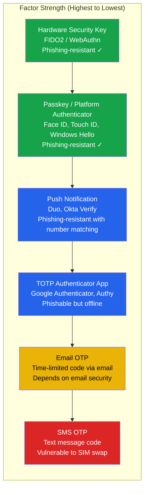
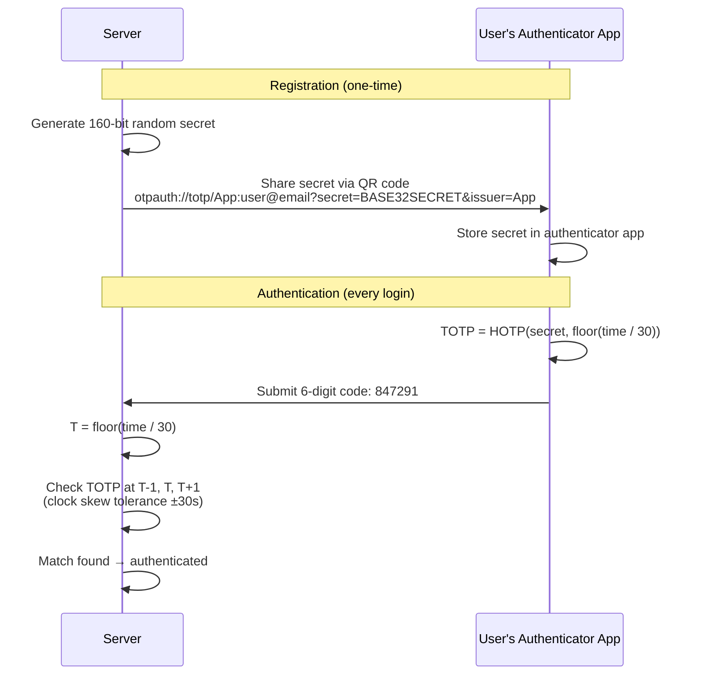
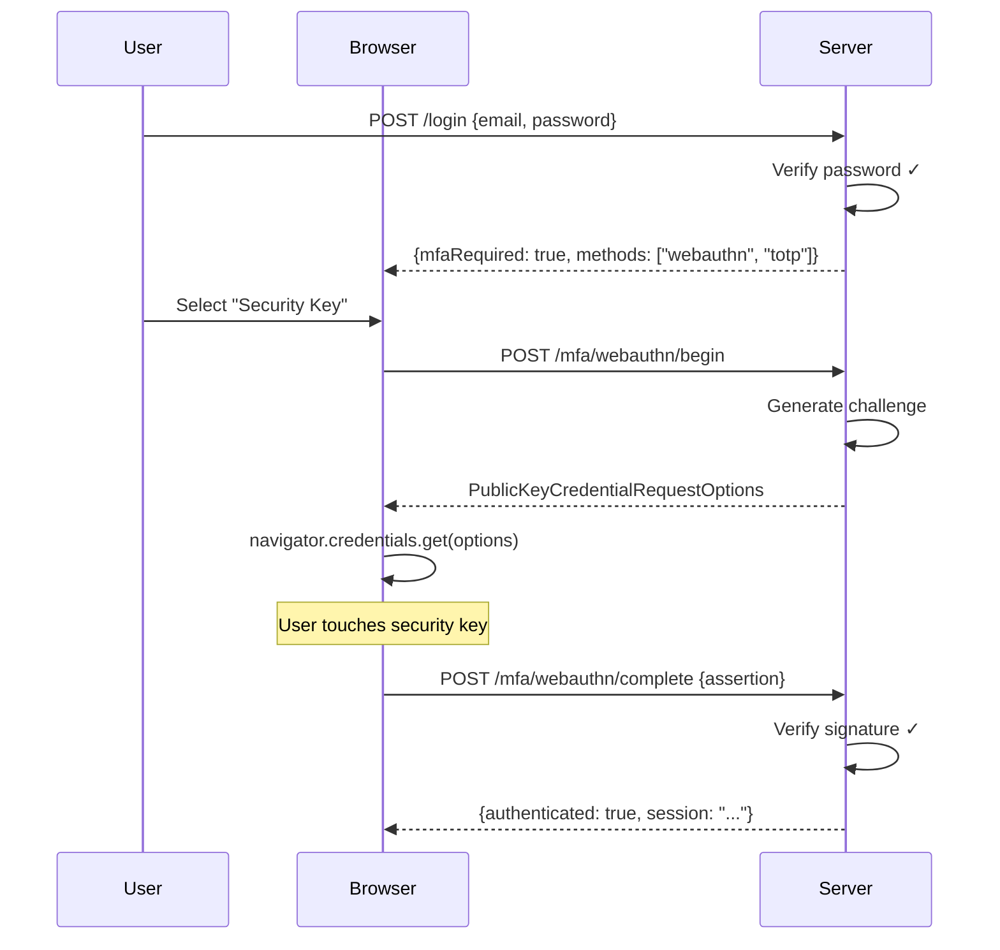
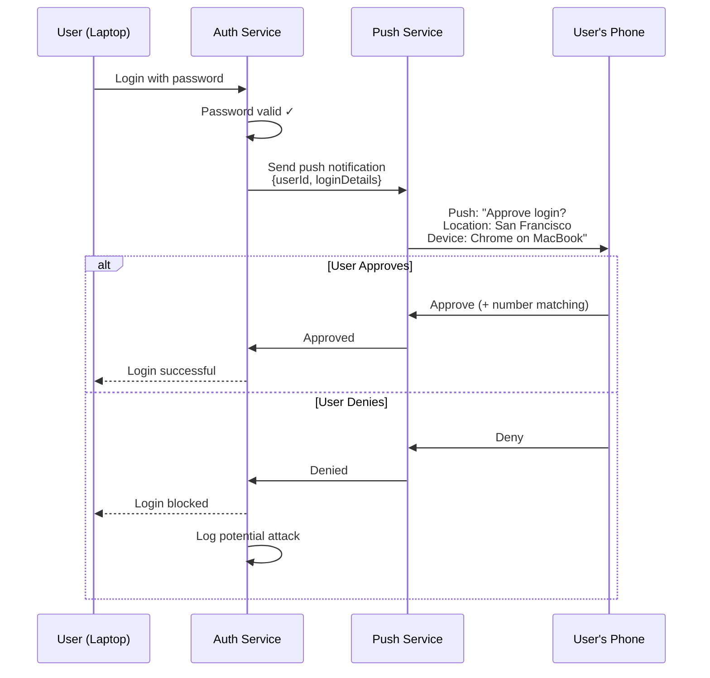
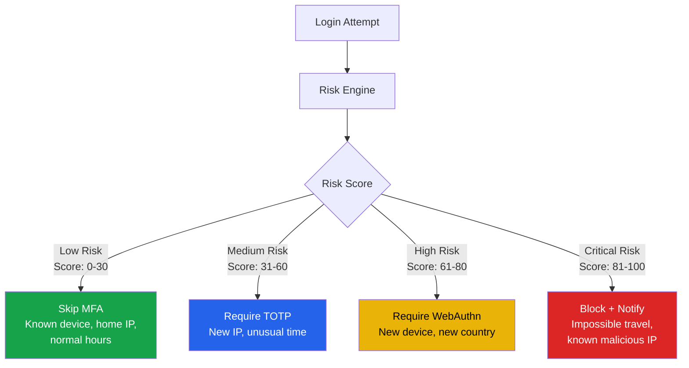
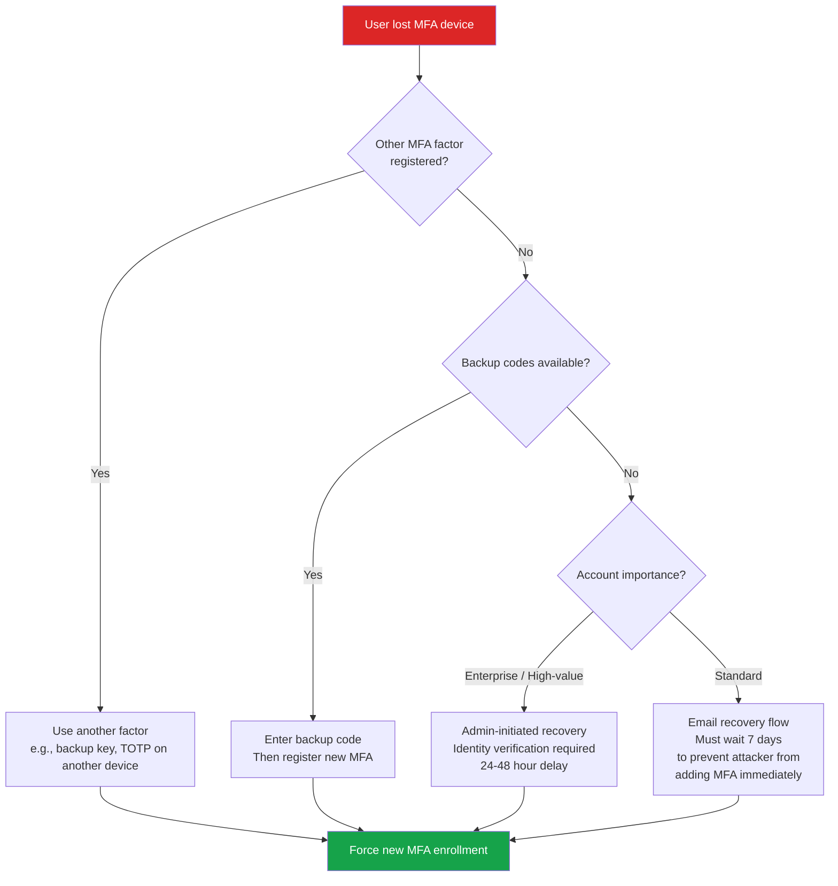

# MFA Engineering Deep Dive

Multi-factor authentication is the single most effective defense against account compromise. Google reported that hardware security keys block 100% of automated attacks, 100% of bulk phishing attacks, and 100% of targeted attacks. TOTP blocks 100% of automated attacks and 96% of bulk phishing (but only 76% of targeted attacks). This page goes beyond the basics covered in [MFA Implementation](./mfa-implementation.md) into the engineering details that make or break an MFA system at scale.

## MFA Factor Strength Hierarchy



## TOTP Deep Dive (RFC 6238)

### How TOTP Works

TOTP (Time-based One-Time Password) generates a 6-8 digit code that changes every 30 seconds. It uses HMAC-SHA1 (or SHA-256/SHA-512) with a shared secret and the current time.



### TOTP Algorithm (Step by Step)

```typescript
import { createHmac } from 'crypto';

function generateTOTP(
  secret: Buffer,
  timeStep: number = 30,
  digits: number = 6,
  algorithm: 'sha1' | 'sha256' | 'sha512' = 'sha1'
): string {
  // Step 1: Calculate time counter
  const counter = Math.floor(Date.now() / 1000 / timeStep);

  // Step 2: Convert counter to 8-byte big-endian buffer
  const counterBuffer = Buffer.alloc(8);
  counterBuffer.writeBigInt64BE(BigInt(counter));

  // Step 3: HMAC-SHA1 (or SHA-256/SHA-512) of counter with secret
  const hmac = createHmac(algorithm, secret)
    .update(counterBuffer)
    .digest();

  // Step 4: Dynamic truncation
  // Use last nibble as offset
  const offset = hmac[hmac.length - 1] & 0x0f;

  // Extract 4 bytes at offset, mask top bit
  const binary =
    ((hmac[offset] & 0x7f) << 24) |
    ((hmac[offset + 1] & 0xff) << 16) |
    ((hmac[offset + 2] & 0xff) << 8) |
    (hmac[offset + 3] & 0xff);

  // Step 5: Modulo to get desired number of digits
  const otp = binary % Math.pow(10, digits);

  return otp.toString().padStart(digits, '0');
}

// Verification with clock skew tolerance
function verifyTOTP(
  secret: Buffer,
  code: string,
  window: number = 1 // ±1 time step (±30 seconds)
): boolean {
  for (let i = -window; i <= window; i++) {
    const timeStep = 30;
    const counter = Math.floor(Date.now() / 1000 / timeStep) + i;

    const counterBuffer = Buffer.alloc(8);
    counterBuffer.writeBigInt64BE(BigInt(counter));

    const expected = generateTOTPForCounter(secret, counterBuffer);
    if (timingSafeEqual(code, expected)) {
      return true;
    }
  }
  return false;
}
```

::: danger Always Use Timing-Safe Comparison
Comparing TOTP codes with `===` leaks timing information. An attacker can measure response times to determine how many leading digits match, reducing the search space from 10^6 to linear time. Use `crypto.timingSafeEqual()` or a constant-time comparison function.
:::

### QR Code Generation

```typescript
import { authenticator } from 'otplib';
import QRCode from 'qrcode';

async function setupTOTP(user: { id: string; email: string }): Promise<{
  secret: string;
  qrCodeDataUrl: string;
  backupCodes: string[];
}> {
  // Generate 160-bit secret (RFC 4226 minimum)
  const secret = authenticator.generateSecret(20); // 20 bytes = 160 bits

  // Build otpauth URI
  const otpauthUrl = authenticator.keyuri(
    user.email,
    'Archon',     // Issuer name
    secret
  );
  // Result: otpauth://totp/Archon:user@email.com?secret=JBSWY3DPEHPK3PXP&issuer=Archon

  // Generate QR code
  const qrCodeDataUrl = await QRCode.toDataURL(otpauthUrl);

  // Generate backup codes
  const backupCodes = generateBackupCodes(10);

  // Store (encrypted) — do NOT enable MFA yet, wait for verification
  await db.mfaPending.create({
    userId: user.id,
    secret: encrypt(secret),
    backupCodes: backupCodes.map(code => hashBackupCode(code)),
    createdAt: new Date(),
    expiresAt: new Date(Date.now() + 10 * 60 * 1000), // 10 min to complete setup
  });

  return { secret, qrCodeDataUrl, backupCodes };
}
```

### Backup Codes

Backup codes are single-use recovery codes for when the authenticator app is unavailable.

```typescript
import { randomBytes, scryptSync, timingSafeEqual } from 'crypto';

function generateBackupCodes(count: number = 10): string[] {
  const codes: string[] = [];
  for (let i = 0; i < count; i++) {
    // 8-character alphanumeric, grouped for readability
    const raw = randomBytes(5).toString('hex').toUpperCase(); // 10 hex chars
    codes.push(`${raw.slice(0, 5)}-${raw.slice(5, 10)}`);
    // e.g., "A3F8E-2C1D4"
  }
  return codes;
}

function hashBackupCode(code: string): string {
  const normalized = code.replace(/-/g, '').toUpperCase();
  const salt = randomBytes(16);
  const hash = scryptSync(normalized, salt, 64);
  return `${salt.toString('hex')}:${hash.toString('hex')}`;
}

async function useBackupCode(userId: string, code: string): Promise<boolean> {
  const normalized = code.replace(/-/g, '').toUpperCase();
  const mfaConfig = await db.mfa.findByUserId(userId);

  for (let i = 0; i < mfaConfig.backupCodes.length; i++) {
    const [saltHex, hashHex] = mfaConfig.backupCodes[i].split(':');
    const salt = Buffer.from(saltHex, 'hex');
    const storedHash = Buffer.from(hashHex, 'hex');
    const candidateHash = scryptSync(normalized, salt, 64);

    if (timingSafeEqual(storedHash, candidateHash)) {
      // Mark code as used (remove from array)
      await db.mfa.removeBackupCode(userId, i);

      // Alert user — backup code used
      await notifyUser(userId, 'backup_code_used', {
        remainingCodes: mfaConfig.backupCodes.length - 1,
      });

      return true;
    }
  }

  return false;
}
```

## WebAuthn/FIDO2 as Second Factor

When used as a second factor (after password), WebAuthn provides phishing-resistant MFA without requiring the credential to be discoverable (resident).



::: tip WebAuthn vs TOTP for MFA
WebAuthn is strictly superior to TOTP as a second factor: it is phishing-resistant (origin-bound), faster (touch vs typing 6 digits), and does not require clock synchronization. Offer WebAuthn as the recommended option and TOTP as the fallback for users without hardware keys or compatible devices.
:::

## Push Notifications (Duo, Okta Verify)

Push-based MFA sends a notification to the user's registered device. The user approves or denies the request.



### Number Matching (MFA Fatigue Prevention)

Modern push MFA shows a number on the login screen and asks the user to select the matching number on their phone. This prevents blind approval of fraudulent push notifications.

```
Login screen: "Enter the number shown: 42"

Phone notification: "Select the number: [17] [42] [89]"

User must select 42 to approve
```

## SMS — Why It Is Weak But Still Used

### Attacks Against SMS MFA

| Attack | Description | Difficulty | Mitigation |
|--------|-------------|------------|------------|
| **SIM swapping** | Attacker convinces carrier to transfer phone number | Medium | Port-out protection, carrier PIN |
| **SS7 interception** | Exploit signaling protocol to intercept SMS | High (but state actors can) | Not preventable by application |
| **SMS phishing** | Attacker asks victim to forward the code | Low | User education |
| **Malware** | Android malware reads SMS messages | Medium | App-based TOTP instead |
| **Account takeover** | Social engineering carrier support | Medium | Carrier security questions |

### Why SMS Is Still Used

Despite its weaknesses, SMS remains the most widely deployed MFA method because:

1. **Universal reach** — Every phone can receive SMS, no app installation needed
2. **User familiarity** — Non-technical users understand "enter the code we texted you"
3. **Fallback necessity** — What happens when a user loses their authenticator app? SMS is the safety net
4. **Regulatory acceptance** — Many compliance frameworks still accept SMS MFA

::: warning NIST Position on SMS
NIST SP 800-63B (2024 revision) designates SMS as a "restricted" authenticator. It may be used but should not be the only MFA option. NIST recommends phishing-resistant authenticators (WebAuthn, FIDO2) as the primary option, with SMS as a fallback at most.
:::

## Adaptive MFA (Risk-Based Step-Up Authentication)

Adaptive MFA adjusts authentication requirements based on real-time risk assessment. Low-risk logins proceed with fewer friction points; high-risk logins demand stronger factors.



### Risk Scoring Engine

```typescript
interface RiskSignal {
  name: string;
  score: number;  // 0-100 contribution
  weight: number; // Multiplier
}

function calculateRiskScore(context: LoginContext): {
  score: number;
  signals: RiskSignal[];
  recommendation: 'skip_mfa' | 'basic_mfa' | 'strong_mfa' | 'block';
} {
  const signals: RiskSignal[] = [];

  // Device trust
  if (!context.isKnownDevice) {
    signals.push({ name: 'unknown_device', score: 25, weight: 1.0 });
  }
  if (context.isNewDeviceType) {
    signals.push({ name: 'new_device_type', score: 10, weight: 0.8 });
  }

  // Location
  if (context.isNewCountry) {
    signals.push({ name: 'new_country', score: 35, weight: 1.0 });
  }
  if (context.impossibleTravel) {
    signals.push({ name: 'impossible_travel', score: 50, weight: 1.5 });
  }
  if (context.isTorOrVPN) {
    signals.push({ name: 'tor_vpn', score: 20, weight: 1.0 });
  }

  // Time
  if (context.isUnusualHour) {
    signals.push({ name: 'unusual_hour', score: 10, weight: 0.5 });
  }

  // Velocity
  if (context.failedAttemptsLastHour > 3) {
    signals.push({
      name: 'high_failure_rate',
      score: Math.min(context.failedAttemptsLastHour * 10, 40),
      weight: 1.2,
    });
  }

  // IP reputation
  if (context.ipReputationScore < 50) {
    signals.push({ name: 'bad_ip_reputation', score: 30, weight: 1.0 });
  }

  // Credential source
  if (context.credentialInBreachDatabase) {
    signals.push({ name: 'breached_credential', score: 40, weight: 1.5 });
  }

  const totalScore = Math.min(
    signals.reduce((sum, s) => sum + s.score * s.weight, 0),
    100
  );

  let recommendation: 'skip_mfa' | 'basic_mfa' | 'strong_mfa' | 'block';
  if (totalScore <= 30) recommendation = 'skip_mfa';
  else if (totalScore <= 60) recommendation = 'basic_mfa';
  else if (totalScore <= 80) recommendation = 'strong_mfa';
  else recommendation = 'block';

  return { score: totalScore, signals, recommendation };
}
```

## MFA Fatigue Attacks and Prevention

MFA fatigue (also called "MFA bombing" or "push spam") exploits push-based MFA by sending repeated notifications until the user approves one out of frustration or confusion. This was the technique used in the 2022 Uber breach.

### Attack Pattern

```
Attacker has valid username + password (from phishing or breach)
↓
Attacker initiates login → Push sent to victim
Victim denies → Attacker initiates again → Push sent
Victim denies → Attacker initiates again → Push sent
... 50+ times at 2am ...
Victim approves to stop the notifications → Account compromised
```

### Prevention Strategies

| Strategy | Effectiveness | User Impact |
|----------|---------------|-------------|
| **Number matching** | High — user must enter a specific number | Low — adds 2 seconds |
| **Rate limiting pushes** | Medium — limit to 3 pushes per 10 minutes | Low |
| **Context display** | Medium — show location, device, IP on push | None |
| **Lockout after denials** | High — 3 denials = account locked for 1 hour | Medium — blocks legitimate retries |
| **FIDO2 only for high-risk** | Very high — cannot be fatigued | Medium — requires hardware key |
| **Anomaly alerting** | Medium — security team notified of push spam | None |

```typescript
async function handlePushMFA(userId: string): Promise<void> {
  const recentPushes = await db.mfaEvents.count({
    userId,
    type: 'push_sent',
    createdAt: { $gt: new Date(Date.now() - 10 * 60 * 1000) }, // 10 min
  });

  if (recentPushes >= 3) {
    // MFA fatigue protection — block further pushes
    await db.mfaEvents.create({
      userId,
      type: 'push_rate_limited',
      createdAt: new Date(),
    });

    // Alert security team
    await alertSecurityTeam({
      event: 'mfa_fatigue_detected',
      userId,
      pushCount: recentPushes,
    });

    throw new AuthError(
      'Too many MFA attempts. Please wait 10 minutes or use a backup code.'
    );
  }

  // Generate number for number matching
  const challengeNumber = Math.floor(Math.random() * 100);

  // Send push with number matching
  await pushService.send(userId, {
    title: 'Login Approval',
    body: `Select the number: ${challengeNumber}`,
    options: [
      challengeNumber,
      Math.floor(Math.random() * 100),
      Math.floor(Math.random() * 100),
    ].sort(() => Math.random() - 0.5), // Shuffle
    metadata: {
      location: 'San Francisco, CA',
      device: 'Chrome on MacBook Pro',
      ip: '203.0.113.42',
    },
  });
}
```

## Account Recovery When MFA Is Lost

Account recovery is the Achilles heel of MFA. If recovery is too easy, attackers use it. If it is too hard, users are permanently locked out.

### Recovery Options Ranked by Security

| Recovery Method | Security | UX | Implementation Complexity |
|----------------|----------|-----|--------------------------|
| **Another registered factor** | Highest | Good | Low — already implemented |
| **Backup codes** | High | Good | Low |
| **Recovery key (printed/stored)** | High | Poor | Low |
| **Identity verification (support + photo ID)** | High | Very poor | High |
| **Trusted contact recovery** | Medium | Medium | High |
| **Email-based recovery** | Low | Good | Low |
| **SMS-based recovery** | Very low | Good | Low |

### Recovery Flow Design



::: danger Recovery Delay for Email-Based Recovery
If you allow MFA reset via email, impose a mandatory waiting period (7 days) before the reset takes effect. This gives the legitimate user time to notice and cancel a fraudulent recovery request. Send notifications to all registered email addresses and phone numbers during the waiting period.
:::

## MFA Enrollment Enforcement

```typescript
// Middleware: Enforce MFA enrollment for specific user groups
async function enforceMFA(
  req: Request,
  res: Response,
  next: NextFunction
): Promise<void> {
  const user = req.user!;

  // Check if MFA is required but not enrolled
  const mfaRequired = await isMFARequired(user);
  const mfaEnrolled = await isMFAEnrolled(user.id);

  if (mfaRequired && !mfaEnrolled) {
    // Allow only MFA setup endpoints
    const allowedPaths = [
      '/auth/mfa/setup',
      '/auth/mfa/verify-setup',
      '/auth/logout',
    ];

    if (!allowedPaths.includes(req.path)) {
      res.status(403).json({
        error: 'mfa_required',
        message: 'You must enable MFA before accessing this resource.',
        setupUrl: '/auth/mfa/setup',
      });
      return;
    }
  }

  next();
}

async function isMFARequired(user: User): Promise<boolean> {
  // Always required for admins
  if (user.roles.includes('admin')) return true;

  // Required by tenant policy
  const tenant = await db.tenants.findById(user.tenantId);
  if (tenant.mfaPolicy === 'required') return true;

  // Required by org policy (SOC 2, HIPAA)
  if (tenant.complianceFrameworks?.includes('soc2')) return true;

  return false;
}
```

## Further Reading

- [MFA Implementation](./mfa-implementation.md) — Foundational MFA concepts and basic implementations
- [Passkeys & WebAuthn](./passkeys-webauthn.md) — Phishing-resistant authentication with passkeys
- [Device Trust & Risk Engine](./device-trust.md) — Risk signals for adaptive MFA
- [Auth Attacks & Defenses](./auth-attack-defense.md) — Credential stuffing, brute force, and MFA bypass
- [Auth Providers](./auth-providers.md) — Which providers offer adaptive MFA out of the box
- [SOC 2 Compliance](/security/compliance/soc2.md) — MFA requirements for SOC 2
