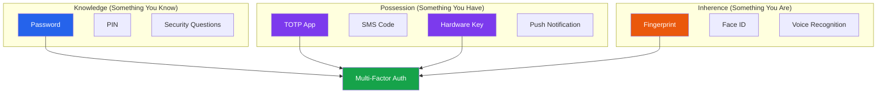
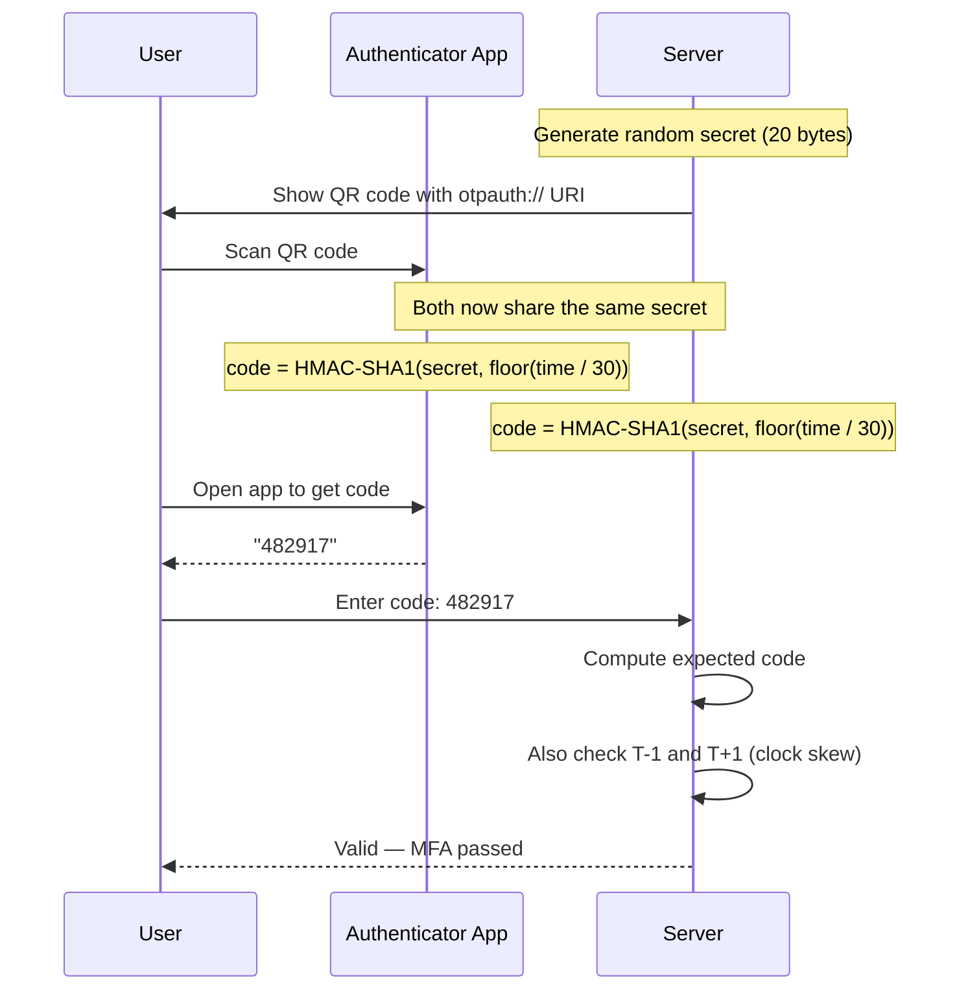
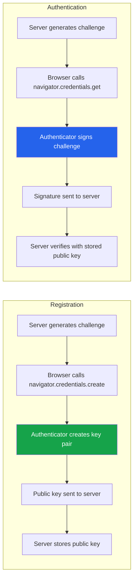
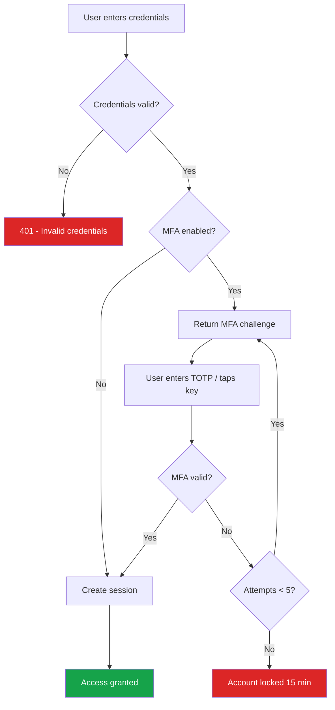
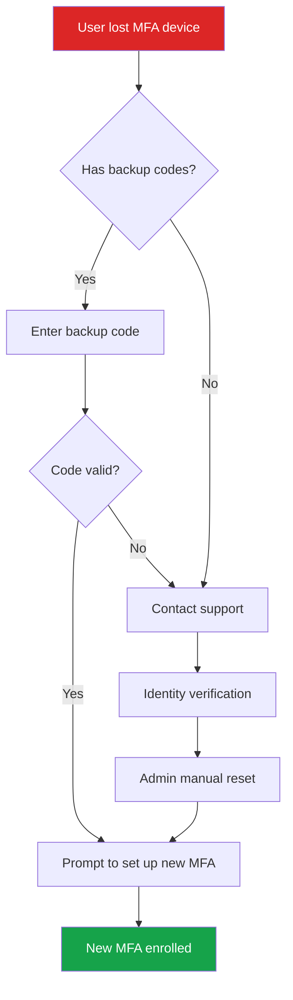

# Multi-Factor Authentication Implementation

Multi-factor authentication (MFA) requires users to provide two or more independent verification factors before granting access. Even if an attacker steals a user's password, they cannot access the account without the second factor. MFA is the single most effective defense against credential-based attacks — Google reported that it blocks 100% of automated bot attacks, 99% of bulk phishing attacks, and 66% of targeted attacks.

## MFA Factor Categories



| Method | Phishing Resistant | UX Friction | Implementation Complexity |
|--------|-------------------|-------------|--------------------------|
| TOTP (Authenticator App) | No | Medium | Low |
| SMS OTP | No | Medium | Low |
| Push Notification | No | Low | Medium |
| WebAuthn / FIDO2 | **Yes** | Low | High |
| Hardware Security Key | **Yes** | Medium | High |
| Backup Codes | No | High | Low |

::: danger SMS is Not Secure
SMS-based OTP is vulnerable to SIM swapping, SS7 protocol attacks, and social engineering of carrier support. NIST SP 800-63B deprecated SMS as an out-of-band authenticator. Use TOTP or WebAuthn instead.
:::

## TOTP (Time-Based One-Time Password)

TOTP (RFC 6238) generates a 6-digit code that changes every 30 seconds. Both the server and the authenticator app share a secret key. They independently compute the same code using HMAC-SHA1 over the current time step.

### How TOTP Works



### TOTP Implementation

```typescript
import crypto from 'crypto';
import { encode as base32Encode, decode as base32Decode } from 'hi-base32';

// ─── TOTP Core Implementation ────────────────────────────────

interface TOTPConfig {
  secretLength: number;   // Bytes of secret (20 = 160 bits, recommended)
  period: number;         // Time step in seconds (30 is standard)
  digits: number;         // Code length (6 is standard)
  algorithm: 'sha1' | 'sha256' | 'sha512';
  window: number;         // Number of time steps to check (1 = check T-1, T, T+1)
  issuer: string;         // Your application name
}

const DEFAULT_TOTP_CONFIG: TOTPConfig = {
  secretLength: 20,
  period: 30,
  digits: 6,
  algorithm: 'sha1',  // SHA-1 is the standard for TOTP (RFC 6238)
  window: 1,
  issuer: 'MyApp',
};

class TOTPService {
  private config: TOTPConfig;

  constructor(config: Partial<TOTPConfig> = {}) {
    this.config = { ...DEFAULT_TOTP_CONFIG, ...config };
  }

  // Generate a new TOTP secret
  generateSecret(): { secret: string; base32: string } {
    const buffer = crypto.randomBytes(this.config.secretLength);
    const base32 = base32Encode(buffer).replace(/=/g, '');
    return {
      secret: buffer.toString('hex'),
      base32,
    };
  }

  // Generate the otpauth:// URI for QR code generation
  generateOtpauthUri(params: {
    secret: string;   // Base32-encoded
    accountName: string;
    issuer?: string;
  }): string {
    const issuer = params.issuer || this.config.issuer;
    const label = encodeURIComponent(`${issuer}:${params.accountName}`);
    const queryParams = new URLSearchParams({
      secret: params.secret,
      issuer: issuer,
      algorithm: this.config.algorithm.toUpperCase(),
      digits: String(this.config.digits),
      period: String(this.config.period),
    });

    return `otpauth://totp/${label}?${queryParams.toString()}`;
  }

  // Generate a TOTP code for a given time
  generateCode(secretHex: string, timestamp?: number): string {
    const time = timestamp || Date.now();
    const timeStep = Math.floor(time / 1000 / this.config.period);

    // Convert time step to 8-byte big-endian buffer
    const timeBuffer = Buffer.alloc(8);
    timeBuffer.writeBigInt64BE(BigInt(timeStep));

    // Compute HMAC
    const secretBuffer = Buffer.from(secretHex, 'hex');
    const hmac = crypto
      .createHmac(this.config.algorithm, secretBuffer)
      .update(timeBuffer)
      .digest();

    // Dynamic truncation (RFC 4226 Section 5.4)
    const offset = hmac[hmac.length - 1] & 0x0f;
    const binary =
      ((hmac[offset] & 0x7f) << 24) |
      ((hmac[offset + 1] & 0xff) << 16) |
      ((hmac[offset + 2] & 0xff) << 8) |
      (hmac[offset + 3] & 0xff);

    // Truncate to desired number of digits
    const code = binary % Math.pow(10, this.config.digits);
    return String(code).padStart(this.config.digits, '0');
  }

  // Verify a TOTP code with window tolerance
  verifyCode(secretHex: string, code: string, timestamp?: number): {
    valid: boolean;
    drift: number;   // Time step offset where match was found
  } {
    const time = timestamp || Date.now();

    // Check codes within the window (handles clock skew)
    for (let i = -this.config.window; i <= this.config.window; i++) {
      const adjustedTime = time + (i * this.config.period * 1000);
      const expectedCode = this.generateCode(secretHex, adjustedTime);

      // Constant-time comparison to prevent timing attacks
      if (this.constantTimeEqual(code, expectedCode)) {
        return { valid: true, drift: i };
      }
    }

    return { valid: false, drift: 0 };
  }

  private constantTimeEqual(a: string, b: string): boolean {
    if (a.length !== b.length) return false;
    const bufA = Buffer.from(a);
    const bufB = Buffer.from(b);
    return crypto.timingSafeEqual(bufA, bufB);
  }
}
```

### TOTP Enrollment Flow

```typescript
import { Pool } from 'pg';
import QRCode from 'qrcode';

// ─── MFA Enrollment Service ─────────────────────────────────

interface MFAEnrollment {
  tempSecret: string;         // Hex secret (not yet confirmed)
  tempSecretBase32: string;   // Base32 for QR code
  qrCodeDataUrl: string;      // Data URL for QR code image
  backupCodes: string[];      // One-time recovery codes
}

class MFAService {
  private totp: TOTPService;
  private db: Pool;

  constructor(db: Pool) {
    this.totp = new TOTPService({ issuer: 'MySecureApp' });
    this.db = db;
  }

  // Step 1: Begin enrollment — generate secret and QR code
  async beginEnrollment(userId: string, email: string): Promise<MFAEnrollment> {
    // Generate TOTP secret
    const { secret, base32 } = this.totp.generateSecret();

    // Generate QR code
    const otpauthUri = this.totp.generateOtpauthUri({
      secret: base32,
      accountName: email,
    });
    const qrCodeDataUrl = await QRCode.toDataURL(otpauthUri);

    // Generate backup codes
    const backupCodes = this.generateBackupCodes(10);

    // Store temporarily (user must confirm with a valid code)
    await this.db.query(
      `INSERT INTO mfa_pending_enrollment (user_id, secret_hex, backup_codes, created_at, expires_at)
       VALUES ($1, $2, $3, NOW(), NOW() + INTERVAL '10 minutes')
       ON CONFLICT (user_id) DO UPDATE
       SET secret_hex = $2, backup_codes = $3, created_at = NOW(),
           expires_at = NOW() + INTERVAL '10 minutes'`,
      [userId, secret, JSON.stringify(backupCodes.map(c => c.hash))]
    );

    return {
      tempSecret: secret,
      tempSecretBase32: base32,
      qrCodeDataUrl,
      backupCodes: backupCodes.map(c => c.code),
    };
  }

  // Step 2: Confirm enrollment — user enters a valid TOTP code
  async confirmEnrollment(userId: string, code: string): Promise<boolean> {
    const result = await this.db.query(
      `SELECT secret_hex, backup_codes FROM mfa_pending_enrollment
       WHERE user_id = $1 AND expires_at > NOW()`,
      [userId]
    );

    if (result.rows.length === 0) {
      throw new Error('No pending MFA enrollment or enrollment expired');
    }

    const { secret_hex, backup_codes } = result.rows[0];

    // Verify the code to ensure the user set up their authenticator correctly
    const verification = this.totp.verifyCode(secret_hex, code);
    if (!verification.valid) {
      return false;
    }

    // Activate MFA for the user
    await this.db.query(
      `UPDATE users SET
         mfa_enabled = true,
         mfa_secret_hex = $1,
         mfa_backup_codes = $2,
         mfa_enabled_at = NOW()
       WHERE id = $3`,
      [secret_hex, backup_codes, userId]
    );

    // Clean up pending enrollment
    await this.db.query(
      'DELETE FROM mfa_pending_enrollment WHERE user_id = $1',
      [userId]
    );

    return true;
  }

  // Verify TOTP during login
  async verifyMFA(
    userId: string,
    code: string,
    lastUsedCode?: string
  ): Promise<{ valid: boolean; method: 'totp' | 'backup' }> {
    const result = await this.db.query(
      'SELECT mfa_secret_hex, mfa_backup_codes FROM users WHERE id = $1 AND mfa_enabled = true',
      [userId]
    );

    if (result.rows.length === 0) {
      throw new Error('MFA not enabled for user');
    }

    const { mfa_secret_hex, mfa_backup_codes } = result.rows[0];

    // Prevent code reuse (replay attack prevention)
    if (lastUsedCode && code === lastUsedCode) {
      return { valid: false, method: 'totp' };
    }

    // Try TOTP first
    const totpResult = this.totp.verifyCode(mfa_secret_hex, code);
    if (totpResult.valid) {
      // Store the used code to prevent replay
      await this.db.query(
        'UPDATE users SET mfa_last_used_code = $1 WHERE id = $2',
        [code, userId]
      );
      return { valid: true, method: 'totp' };
    }

    // Try backup codes
    const backupResult = await this.tryBackupCode(userId, code, mfa_backup_codes);
    if (backupResult) {
      return { valid: true, method: 'backup' };
    }

    return { valid: false, method: 'totp' };
  }

  // ─── Backup Codes ───────────────────────────────────────────

  private generateBackupCodes(count: number): Array<{ code: string; hash: string }> {
    return Array.from({ length: count }, () => {
      // 8-character alphanumeric code, grouped for readability
      const code = crypto.randomBytes(4).toString('hex').toUpperCase();
      const formatted = `${code.slice(0, 4)}-${code.slice(4)}`;
      const hash = crypto.createHash('sha256').update(formatted).digest('hex');
      return { code: formatted, hash };
    });
  }

  private async tryBackupCode(
    userId: string,
    code: string,
    storedHashes: string
  ): Promise<boolean> {
    const hashes: string[] = JSON.parse(storedHashes);
    const inputHash = crypto.createHash('sha256').update(code).digest('hex');

    const index = hashes.findIndex(
      h => h !== 'USED' && crypto.timingSafeEqual(
        Buffer.from(h),
        Buffer.from(inputHash)
      )
    );

    if (index === -1) return false;

    // Mark the backup code as used
    hashes[index] = 'USED';
    await this.db.query(
      'UPDATE users SET mfa_backup_codes = $1 WHERE id = $2',
      [JSON.stringify(hashes), userId]
    );

    // Count remaining backup codes
    const remaining = hashes.filter(h => h !== 'USED').length;
    if (remaining <= 2) {
      // Alert the user to generate new backup codes
      console.warn(`User ${userId} has only ${remaining} backup codes remaining`);
    }

    return true;
  }

  // Disable MFA (requires re-authentication)
  async disableMFA(userId: string, password: string): Promise<boolean> {
    const user = await this.db.query(
      'SELECT password_hash FROM users WHERE id = $1',
      [userId]
    );

    if (user.rows.length === 0) return false;

    // Verify password before disabling MFA
    const passwordValid = await verifyPassword(password, user.rows[0].password_hash);
    if (!passwordValid) return false;

    await this.db.query(
      `UPDATE users SET
         mfa_enabled = false,
         mfa_secret_hex = NULL,
         mfa_backup_codes = NULL,
         mfa_last_used_code = NULL
       WHERE id = $1`,
      [userId]
    );

    return true;
  }
}
```

## WebAuthn / FIDO2

WebAuthn is a W3C standard for phishing-resistant authentication using public key cryptography. Unlike TOTP, WebAuthn is bound to the origin (domain), so a phishing site on a different domain cannot intercept the credential.



### WebAuthn Registration (Server)

```typescript
import {
  generateRegistrationOptions,
  verifyRegistrationResponse,
  generateAuthenticationOptions,
  verifyAuthenticationResponse,
  VerifiedRegistrationResponse,
  VerifiedAuthenticationResponse,
} from '@simplewebauthn/server';
import type {
  RegistrationResponseJSON,
  AuthenticationResponseJSON,
  AuthenticatorTransportFuture,
} from '@simplewebauthn/types';

// ─── WebAuthn Configuration ─────────────────────────────────

const rpName = 'MySecureApp';
const rpID = 'example.com';
const origin = `https://${rpID}`;

interface StoredCredential {
  credentialID: string;          // Base64URL-encoded credential ID
  credentialPublicKey: Uint8Array;
  counter: number;                // Signature counter for clone detection
  transports?: AuthenticatorTransportFuture[];
  createdAt: Date;
  lastUsedAt: Date;
  deviceName: string;
}

// ─── Registration ────────────────────────────────────────────

class WebAuthnService {
  private db: Pool;

  constructor(db: Pool) {
    this.db = db;
  }

  // Step 1: Generate registration options
  async generateRegistration(userId: string, email: string): Promise<any> {
    // Get existing credentials so we don't re-register the same authenticator
    const existingCredentials = await this.getUserCredentials(userId);

    const options = await generateRegistrationOptions({
      rpName,
      rpID,
      userName: email,
      userID: new TextEncoder().encode(userId),
      attestationType: 'none', // 'direct' if you need attestation verification
      excludeCredentials: existingCredentials.map(cred => ({
        id: cred.credentialID,
        transports: cred.transports,
      })),
      authenticatorSelection: {
        residentKey: 'preferred',        // Enable discoverable credentials (passkeys)
        userVerification: 'preferred',   // Request biometric/PIN when available
        authenticatorAttachment: 'cross-platform', // Allow both platform and roaming
      },
    });

    // Store the challenge temporarily (must be verified in the response)
    await this.db.query(
      `INSERT INTO webauthn_challenges (user_id, challenge, type, expires_at)
       VALUES ($1, $2, 'registration', NOW() + INTERVAL '5 minutes')
       ON CONFLICT (user_id, type) DO UPDATE SET challenge = $2, expires_at = NOW() + INTERVAL '5 minutes'`,
      [userId, options.challenge]
    );

    return options;
  }

  // Step 2: Verify registration response
  async verifyRegistration(
    userId: string,
    response: RegistrationResponseJSON,
    deviceName: string
  ): Promise<boolean> {
    // Retrieve the expected challenge
    const challengeResult = await this.db.query(
      `SELECT challenge FROM webauthn_challenges
       WHERE user_id = $1 AND type = 'registration' AND expires_at > NOW()`,
      [userId]
    );

    if (challengeResult.rows.length === 0) {
      throw new Error('Registration challenge expired or not found');
    }

    const expectedChallenge = challengeResult.rows[0].challenge;

    const verification: VerifiedRegistrationResponse = await verifyRegistrationResponse({
      response,
      expectedChallenge,
      expectedOrigin: origin,
      expectedRPID: rpID,
    });

    if (!verification.verified || !verification.registrationInfo) {
      return false;
    }

    const { credential, credentialDeviceType, credentialBackedUp } =
      verification.registrationInfo;

    // Store the credential
    await this.db.query(
      `INSERT INTO webauthn_credentials
       (user_id, credential_id, public_key, counter, transports, device_type, backed_up, device_name, created_at)
       VALUES ($1, $2, $3, $4, $5, $6, $7, $8, NOW())`,
      [
        userId,
        Buffer.from(credential.id).toString('base64url'),
        Buffer.from(credential.publicKey),
        credential.counter,
        JSON.stringify(response.response.transports || []),
        credentialDeviceType,
        credentialBackedUp,
        deviceName,
      ]
    );

    // Clean up challenge
    await this.db.query(
      "DELETE FROM webauthn_challenges WHERE user_id = $1 AND type = 'registration'",
      [userId]
    );

    return true;
  }

  // ─── Authentication ──────────────────────────────────────────

  // Step 1: Generate authentication options
  async generateAuthentication(userId?: string): Promise<any> {
    let allowCredentials: any[] | undefined;

    if (userId) {
      // User identified — limit to their credentials
      const credentials = await this.getUserCredentials(userId);
      allowCredentials = credentials.map(cred => ({
        id: cred.credentialID,
        transports: cred.transports,
      }));
    }
    // If no userId, leave allowCredentials undefined for discoverable credentials

    const options = await generateAuthenticationOptions({
      rpID,
      userVerification: 'preferred',
      allowCredentials,
    });

    // Store challenge (use a session-based key for userless flow)
    const challengeKey = userId || 'anonymous';
    await this.db.query(
      `INSERT INTO webauthn_challenges (user_id, challenge, type, expires_at)
       VALUES ($1, $2, 'authentication', NOW() + INTERVAL '5 minutes')
       ON CONFLICT (user_id, type) DO UPDATE SET challenge = $2, expires_at = NOW() + INTERVAL '5 minutes'`,
      [challengeKey, options.challenge]
    );

    return options;
  }

  // Step 2: Verify authentication response
  async verifyAuthentication(
    userId: string,
    response: AuthenticationResponseJSON
  ): Promise<boolean> {
    const challengeResult = await this.db.query(
      `SELECT challenge FROM webauthn_challenges
       WHERE user_id = $1 AND type = 'authentication' AND expires_at > NOW()`,
      [userId]
    );

    if (challengeResult.rows.length === 0) {
      throw new Error('Authentication challenge expired or not found');
    }

    const expectedChallenge = challengeResult.rows[0].challenge;

    // Look up the credential
    const credResult = await this.db.query(
      'SELECT * FROM webauthn_credentials WHERE credential_id = $1 AND user_id = $2',
      [response.id, userId]
    );

    if (credResult.rows.length === 0) {
      throw new Error('Credential not found');
    }

    const storedCredential = credResult.rows[0];

    const verification: VerifiedAuthenticationResponse = await verifyAuthenticationResponse({
      response,
      expectedChallenge,
      expectedOrigin: origin,
      expectedRPID: rpID,
      credential: {
        id: storedCredential.credential_id,
        publicKey: storedCredential.public_key,
        counter: storedCredential.counter,
        transports: JSON.parse(storedCredential.transports || '[]'),
      },
    });

    if (!verification.verified) {
      return false;
    }

    // Update the counter (clone detection)
    const { newCounter } = verification.authenticationInfo;
    await this.db.query(
      'UPDATE webauthn_credentials SET counter = $1, last_used_at = NOW() WHERE credential_id = $2',
      [newCounter, response.id]
    );

    // Clean up challenge
    await this.db.query(
      "DELETE FROM webauthn_challenges WHERE user_id = $1 AND type = 'authentication'",
      [userId]
    );

    return true;
  }

  private async getUserCredentials(userId: string): Promise<StoredCredential[]> {
    const result = await this.db.query(
      'SELECT * FROM webauthn_credentials WHERE user_id = $1',
      [userId]
    );
    return result.rows.map(row => ({
      credentialID: row.credential_id,
      credentialPublicKey: row.public_key,
      counter: row.counter,
      transports: JSON.parse(row.transports || '[]'),
      createdAt: row.created_at,
      lastUsedAt: row.last_used_at,
      deviceName: row.device_name,
    }));
  }
}
```

### WebAuthn Client-Side (Browser)

```typescript
// ─── Browser WebAuthn API ────────────────────────────────────

import {
  startRegistration,
  startAuthentication,
} from '@simplewebauthn/browser';

async function registerWebAuthn(deviceName: string): Promise<void> {
  // Step 1: Get registration options from server
  const optionsResponse = await fetch('/api/webauthn/register/options', {
    method: 'POST',
    headers: { 'Content-Type': 'application/json' },
  });
  const options = await optionsResponse.json();

  // Step 2: Create credential via browser API
  const credential = await startRegistration({ optionsJSON: options });

  // Step 3: Send credential to server for verification
  const verifyResponse = await fetch('/api/webauthn/register/verify', {
    method: 'POST',
    headers: { 'Content-Type': 'application/json' },
    body: JSON.stringify({ credential, deviceName }),
  });

  const result = await verifyResponse.json();
  if (!result.verified) {
    throw new Error('WebAuthn registration failed');
  }
}

async function authenticateWebAuthn(): Promise<void> {
  // Step 1: Get authentication options
  const optionsResponse = await fetch('/api/webauthn/login/options', {
    method: 'POST',
    headers: { 'Content-Type': 'application/json' },
  });
  const options = await optionsResponse.json();

  // Step 2: Get assertion via browser API
  const assertion = await startAuthentication({ optionsJSON: options });

  // Step 3: Verify assertion on server
  const verifyResponse = await fetch('/api/webauthn/login/verify', {
    method: 'POST',
    headers: { 'Content-Type': 'application/json' },
    body: JSON.stringify(assertion),
  });

  const result = await verifyResponse.json();
  if (!result.verified) {
    throw new Error('WebAuthn authentication failed');
  }
}
```

## MFA Enforcement Architecture



```typescript
// ─── Two-Step Login Flow ─────────────────────────────────────

app.post('/auth/login', async (req, res) => {
  const { email, password } = req.body;

  const user = await authenticateUser(email, password);
  if (!user) {
    return res.status(401).json({ error: 'Invalid credentials' });
  }

  if (user.mfaEnabled) {
    // Create a short-lived MFA session token
    const mfaToken = crypto.randomBytes(32).toString('hex');
    await redis.setex(`mfa_pending:${mfaToken}`, 300, JSON.stringify({
      userId: user.id,
      email: user.email,
      attempts: 0,
    }));

    return res.json({
      requiresMfa: true,
      mfaToken,
      methods: user.mfaMethods, // ['totp', 'webauthn']
    });
  }

  // No MFA — create session directly
  const session = await createSession(user);
  res.cookie('session', session.id, sessionCookieOptions);
  res.json({ user: { id: user.id, name: user.name } });
});

app.post('/auth/mfa/verify', async (req, res) => {
  const { mfaToken, code, method } = req.body;

  const pending = await redis.get(`mfa_pending:${mfaToken}`);
  if (!pending) {
    return res.status(401).json({ error: 'MFA session expired' });
  }

  const mfaSession = JSON.parse(pending);

  // Rate limit MFA attempts
  if (mfaSession.attempts >= 5) {
    await redis.del(`mfa_pending:${mfaToken}`);
    // Lock account for 15 minutes
    await redis.setex(`account_locked:${mfaSession.userId}`, 900, '1');
    return res.status(429).json({ error: 'Too many MFA attempts. Account locked.' });
  }

  let valid = false;

  if (method === 'totp') {
    const result = await mfaService.verifyMFA(mfaSession.userId, code);
    valid = result.valid;
  } else if (method === 'webauthn') {
    valid = await webauthnService.verifyAuthentication(mfaSession.userId, code);
  }

  if (!valid) {
    mfaSession.attempts += 1;
    await redis.setex(`mfa_pending:${mfaToken}`, 300, JSON.stringify(mfaSession));
    return res.status(401).json({
      error: 'Invalid MFA code',
      attemptsRemaining: 5 - mfaSession.attempts,
    });
  }

  // MFA passed — clean up and create session
  await redis.del(`mfa_pending:${mfaToken}`);
  const user = await getUserById(mfaSession.userId);
  const session = await createSession(user);
  res.cookie('session', session.id, sessionCookieOptions);
  res.json({ user: { id: user.id, name: user.name } });
});
```

## Recovery Flow



## Security Checklist

- [ ] Use TOTP (not SMS) as the minimum MFA method
- [ ] Support WebAuthn/FIDO2 for phishing-resistant authentication
- [ ] Generate backup codes during MFA enrollment (at least 10 codes)
- [ ] Hash backup codes before storage (SHA-256)
- [ ] Mark backup codes as used after consumption (prevent reuse)
- [ ] Prevent TOTP code reuse within the same time window
- [ ] Rate limit MFA verification attempts (max 5, then lock)
- [ ] Use a separate MFA session token (not the final session) during the MFA step
- [ ] Require re-authentication to disable MFA
- [ ] Store TOTP secrets encrypted at rest
- [ ] Use constant-time comparison for all code verification
- [ ] Log all MFA events (enrollment, verification success/failure, disable)
- [ ] Alert users when MFA is disabled or backup codes are running low
