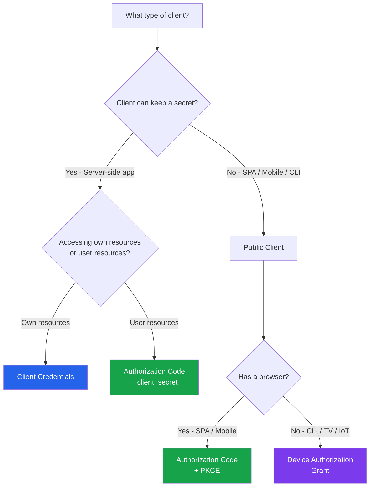
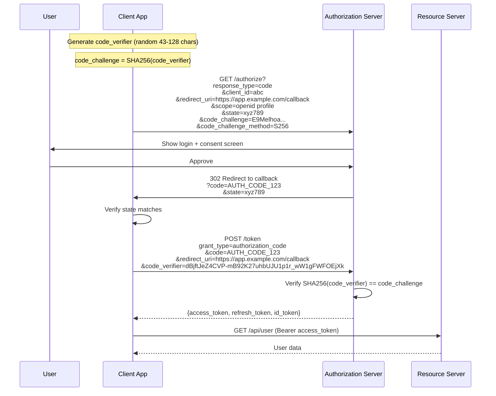
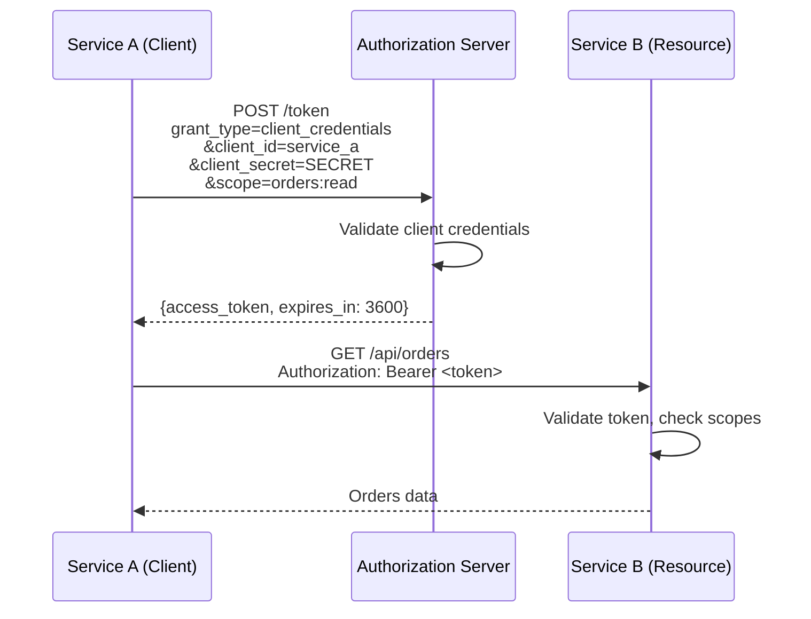
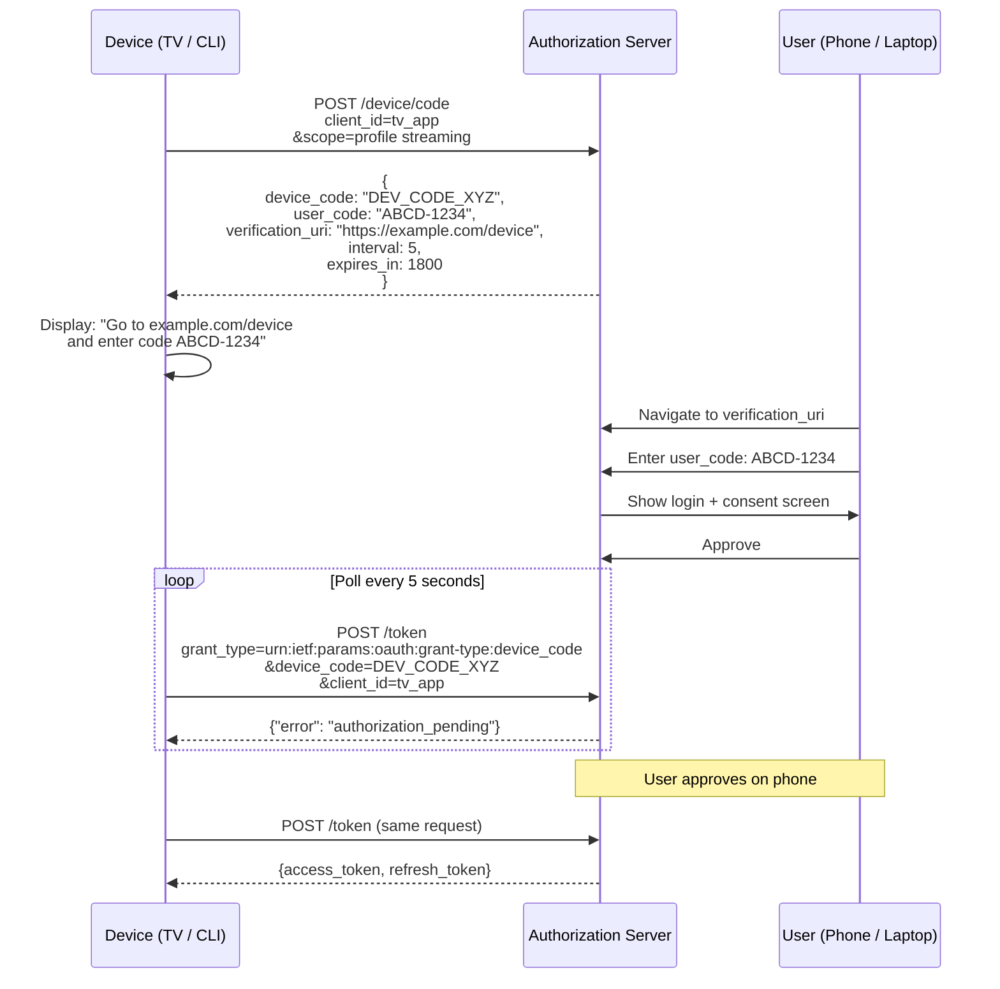
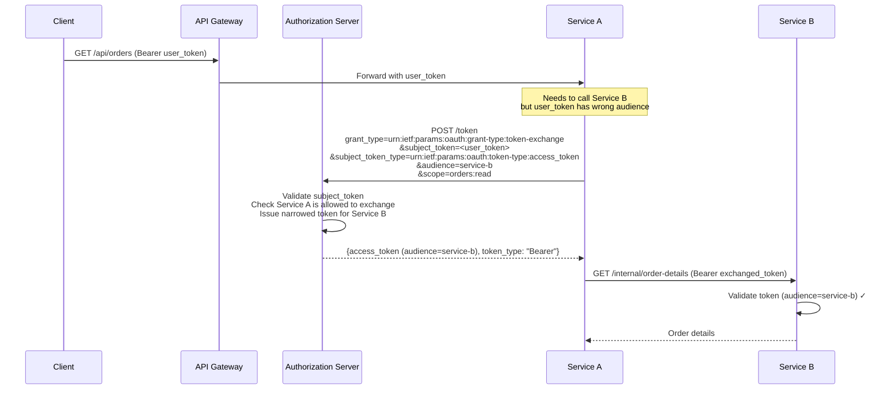
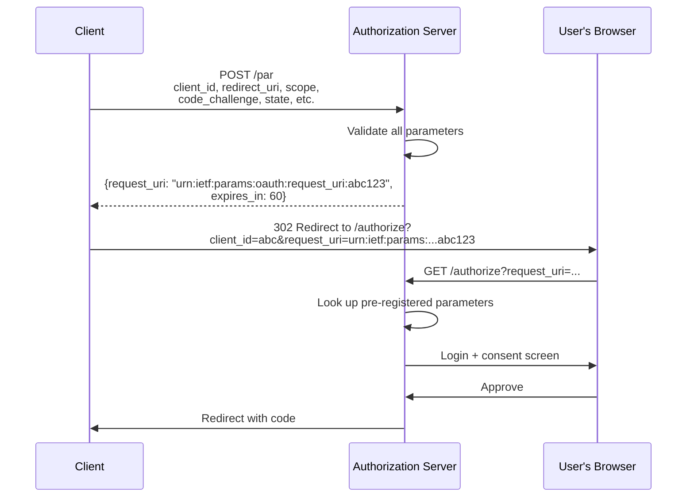

# OAuth 2.0 Flows Complete Guide

OAuth 2.0 is not a single protocol — it is a framework of flows, each designed for a specific client type and trust level. Using the wrong flow is a security vulnerability. This page covers every production-relevant flow with sequence diagrams, implementation code, and the security rationale behind each design decision. It also covers OAuth 2.1, PAR, RAR, and token exchange for microservice architectures.

## Flow Selection Decision Tree



::: danger Deprecated Flows — Do NOT Use
- **Implicit Grant** — Removed in OAuth 2.1. Tokens in URL fragments leak via referrer headers and browser history.
- **Resource Owner Password Credentials (ROPC)** — Removed in OAuth 2.1. The client handles raw passwords, defeating the purpose of OAuth.
:::

## Authorization Code + PKCE

This is the **only flow you should use** for user-facing applications. PKCE (Proof Key for Code Exchange, RFC 7636) prevents authorization code interception attacks. OAuth 2.1 mandates PKCE for all clients, including confidential ones.

### How It Works



### Implementation (TypeScript)

```typescript
import { randomBytes, createHash } from 'crypto';

// Step 1: Generate PKCE values
function generatePKCE(): { verifier: string; challenge: string } {
  const verifier = randomBytes(32).toString('base64url'); // 43 chars
  const challenge = createHash('sha256')
    .update(verifier)
    .digest('base64url');
  return { verifier, challenge };
}

// Step 2: Build authorization URL
function buildAuthorizationUrl(pkce: { challenge: string }): string {
  const state = randomBytes(16).toString('hex');
  // Store state and verifier in session for later validation

  const params = new URLSearchParams({
    response_type: 'code',
    client_id: process.env.OAUTH_CLIENT_ID!,
    redirect_uri: 'https://app.example.com/callback',
    scope: 'openid profile email',
    state,
    code_challenge: pkce.challenge,
    code_challenge_method: 'S256',
  });

  return `https://auth.example.com/authorize?${params}`;
}

// Step 3: Exchange code for tokens
async function exchangeCodeForTokens(
  code: string,
  codeVerifier: string
): Promise<TokenResponse> {
  const response = await fetch('https://auth.example.com/token', {
    method: 'POST',
    headers: { 'Content-Type': 'application/x-www-form-urlencoded' },
    body: new URLSearchParams({
      grant_type: 'authorization_code',
      code,
      redirect_uri: 'https://app.example.com/callback',
      client_id: process.env.OAUTH_CLIENT_ID!,
      code_verifier: codeVerifier,
    }),
  });

  if (!response.ok) {
    throw new Error(`Token exchange failed: ${response.status}`);
  }

  return response.json();
}
```

### PKCE Security Analysis

| Attack | Without PKCE | With PKCE |
|--------|-------------|-----------|
| Authorization code interception | Attacker exchanges stolen code for tokens | Code is useless without `code_verifier` |
| Redirect URI manipulation | Attacker captures code at malicious URI | Code is useless without verifier |
| MITM on redirect | Attacker intercepts code in transit | Code bound to verifier only the client knows |

::: warning state Parameter is NOT Optional
The `state` parameter prevents CSRF attacks on the OAuth flow. Without it, an attacker can initiate an OAuth flow, get a valid authorization code, and trick the victim into exchanging it — linking the attacker's identity to the victim's session. Always generate a cryptographically random `state`, store it in the session, and validate it on callback.
:::

## Client Credentials for Service-to-Service

When a service needs to access another service's API without a user context, use Client Credentials. The service authenticates with its own identity.



### Implementation (Go)

```go
package auth

import (
    "context"
    "encoding/json"
    "fmt"
    "net/http"
    "net/url"
    "sync"
    "time"
)

type ClientCredentials struct {
    ClientID     string
    ClientSecret string
    TokenURL     string
    Scopes       []string

    mu          sync.RWMutex
    cachedToken *TokenResponse
    expiresAt   time.Time
}

type TokenResponse struct {
    AccessToken string `json:"access_token"`
    TokenType   string `json:"token_type"`
    ExpiresIn   int    `json:"expires_in"`
}

func (cc *ClientCredentials) GetToken(ctx context.Context) (string, error) {
    cc.mu.RLock()
    if cc.cachedToken != nil && time.Now().Before(cc.expiresAt) {
        token := cc.cachedToken.AccessToken
        cc.mu.RUnlock()
        return token, nil
    }
    cc.mu.RUnlock()

    cc.mu.Lock()
    defer cc.mu.Unlock()

    // Double-check after acquiring write lock
    if cc.cachedToken != nil && time.Now().Before(cc.expiresAt) {
        return cc.cachedToken.AccessToken, nil
    }

    data := url.Values{
        "grant_type":    {"client_credentials"},
        "client_id":     {cc.ClientID},
        "client_secret": {cc.ClientSecret},
        "scope":         {joinScopes(cc.Scopes)},
    }

    resp, err := http.PostForm(cc.TokenURL, data)
    if err != nil {
        return "", fmt.Errorf("token request failed: %w", err)
    }
    defer resp.Body.Close()

    if resp.StatusCode != http.StatusOK {
        return "", fmt.Errorf("token request returned %d", resp.StatusCode)
    }

    var tokenResp TokenResponse
    if err := json.NewDecoder(resp.Body).Decode(&tokenResp); err != nil {
        return "", fmt.Errorf("failed to decode token response: %w", err)
    }

    cc.cachedToken = &tokenResp
    // Refresh 60 seconds before actual expiry
    cc.expiresAt = time.Now().Add(
        time.Duration(tokenResp.ExpiresIn-60) * time.Second,
    )

    return tokenResp.AccessToken, nil
}
```

::: tip Cache the Token
Client Credentials tokens are not per-user — they represent the service itself. Cache them and refresh proactively before expiry. Calling the token endpoint on every outbound request wastes latency and risks rate limiting.
:::

## Device Authorization Grant (RFC 8628)

For devices without a browser or with limited input capabilities — smart TVs, CLI tools, IoT devices, game consoles. The user authorizes on a separate device (phone/laptop).



### Implementation (Python CLI Tool)

```python
import requests
import time
import sys
import webbrowser

def device_authorization_flow(
    client_id: str,
    auth_server: str,
    scopes: list[str],
) -> dict:
    """Complete device authorization flow for CLI tools."""

    # Step 1: Request device code
    resp = requests.post(
        f"{auth_server}/device/code",
        data={
            "client_id": client_id,
            "scope": " ".join(scopes),
        },
    )
    resp.raise_for_status()
    device_data = resp.json()

    # Step 2: Display instructions
    print(f"\nTo authenticate, visit: {device_data['verification_uri']}")
    print(f"Enter code: {device_data['user_code']}\n")

    # Try to open browser automatically
    verification_complete = device_data.get(
        "verification_uri_complete",
        device_data["verification_uri"],
    )
    webbrowser.open(verification_complete)

    # Step 3: Poll for completion
    interval = device_data.get("interval", 5)
    expires_at = time.time() + device_data["expires_in"]

    while time.time() < expires_at:
        time.sleep(interval)

        token_resp = requests.post(
            f"{auth_server}/token",
            data={
                "grant_type": "urn:ietf:params:oauth:grant-type:device_code",
                "device_code": device_data["device_code"],
                "client_id": client_id,
            },
        )

        if token_resp.status_code == 200:
            print("Authentication successful!")
            return token_resp.json()

        error = token_resp.json().get("error")
        if error == "authorization_pending":
            continue
        elif error == "slow_down":
            interval += 5  # Back off as requested
        elif error == "expired_token":
            print("Device code expired. Please restart.", file=sys.stderr)
            sys.exit(1)
        elif error == "access_denied":
            print("Authorization denied by user.", file=sys.stderr)
            sys.exit(1)
        else:
            print(f"Unexpected error: {error}", file=sys.stderr)
            sys.exit(1)

    print("Authorization timed out.", file=sys.stderr)
    sys.exit(1)
```

## Token Exchange (RFC 8693)

Token Exchange allows a service to exchange one token for another with different properties — different audience, different scopes, or an impersonation/delegation token. This is essential in microservice architectures where Service A needs to call Service B on behalf of a user.



### Exchange Types

| Type | Use Case | `actor_token` Present? |
|------|----------|----------------------|
| **Impersonation** | Service A acts as the user to Service B | No |
| **Delegation** | Service A acts on behalf of the user (both identities preserved) | Yes — the service's own token |
| **Scope narrowing** | Reduce permissions for a downstream call | No |
| **Audience restriction** | Get a token valid only for a specific service | No |

::: tip Prefer Delegation Over Impersonation
Delegation preserves the identity of both the user and the acting service. This is critical for audit trails — you can see that "Service A called Service B on behalf of User X." Impersonation tokens look identical to direct user tokens, making forensics harder.
:::

## OAuth 2.1 — What Changed

OAuth 2.1 (draft, expected to be finalized in 2026) consolidates OAuth 2.0 and its security best practices into a single specification. It does not introduce new features — it removes dangerous ones.

### Removed

| Feature | Why Removed |
|---------|-------------|
| **Implicit Grant** | Tokens in URL fragments leak via referrer, browser history, and logs |
| **Resource Owner Password Credentials** | Client handles raw passwords — defeats the purpose of OAuth |
| **Bearer tokens in query strings** | `?access_token=...` appears in logs, browser history, and referrer headers |

### Required

| Feature | Why Required |
|---------|-------------|
| **PKCE for all clients** | Prevents code interception — not just for public clients anymore |
| **Exact redirect URI matching** | No more wildcard or partial matching — prevents open redirect attacks |
| **Refresh token rotation or sender-constraining** | Prevents stolen refresh tokens from being useful indefinitely |

### Unchanged

Authorization Code, Client Credentials, Device Authorization, and Token Exchange remain the same. OAuth 2.1 is essentially "OAuth 2.0 done right."

::: warning Migration Path
If your OAuth implementation uses Implicit or ROPC flows, you must migrate:
- **Implicit → Authorization Code + PKCE** (use a popup or redirect)
- **ROPC → Authorization Code + PKCE** (the auth server handles the login form, not the client)
:::

## PAR (Pushed Authorization Requests — RFC 9126)

PAR allows the client to push the authorization request payload directly to the authorization server before redirecting the user. This prevents request parameter tampering and keeps sensitive parameters out of the browser URL.



**Benefits:**

- Authorization parameters are authenticated (signed by client)
- No parameter tampering in the browser URL
- Enables large or complex authorization requests (Rich Authorization Requests)
- Keeps sensitive scopes out of browser history and logs

## RAR (Rich Authorization Requests — RFC 9396)

RAR extends OAuth scopes from simple strings to structured JSON objects. This enables fine-grained authorization that scopes alone cannot express.

```json
// Traditional scopes (coarse-grained)
"scope": "payments"

// RAR authorization_details (fine-grained)
"authorization_details": [
  {
    "type": "payment_initiation",
    "actions": ["initiate", "status"],
    "locations": ["https://payments.example.com"],
    "instructedAmount": {
      "currency": "USD",
      "amount": "500.00"
    },
    "creditorName": "Merchant ABC",
    "creditorAccount": {
      "iban": "DE89370400440532013000"
    }
  }
]
```

### When RAR Matters

| Domain | Scope Limitation | RAR Solution |
|--------|-----------------|--------------|
| **Open Banking** | `payments` does not specify amount or recipient | Authorization details include amount, currency, recipient |
| **Healthcare** | `patient:read` does not specify which patient | Authorization details include patient ID, data categories |
| **Cloud APIs** | `compute:admin` is too broad | Authorization details include region, resource type, actions |

::: tip PAR + RAR Together
PAR and RAR are designed to work together. RAR requests can be large (kilobytes of JSON), which exceeds URL length limits. PAR solves this by pushing the request to the server first, then using a compact `request_uri` reference.
:::

## Security Checklist for All OAuth Flows

| Check | Status | Notes |
|-------|--------|-------|
| PKCE enabled for all clients | Required | Even confidential clients in OAuth 2.1 |
| Exact redirect URI matching | Required | No wildcards, no partial matching |
| State parameter validated | Required | CSRF prevention |
| Token stored securely | Required | HttpOnly cookies or secure storage — never localStorage |
| Client secrets never in client-side code | Required | Use PKCE instead of client_secret for public clients |
| Token exchange policies defined | Recommended | Which services can exchange tokens for which audiences |
| PAR for sensitive flows | Recommended | Financial, healthcare, high-value operations |
| Refresh token rotation enabled | Required | Detect and revoke on reuse |
| HTTPS everywhere | Required | Including redirect URIs in development |

## Further Reading

- [OAuth 2.0 & OIDC](./oauth2-oidc.md) — Foundational OAuth 2.0 concepts and OIDC identity layer
- [Token Strategies Deep Dive](./token-strategies.md) — DPoP, token binding, and revocation patterns
- [JWT Deep Dive](./jwt-deep-dive.md) — Token structure and signing for OAuth-issued JWTs
- [Enterprise SSO](./enterprise-sso.md) — SAML and OIDC in enterprise federation
- [Auth Attacks & Defenses](./auth-attack-defense.md) — OAuth redirect attacks and countermeasures
- [API Key Design](./api-key-design.md) — When API keys are better than OAuth
