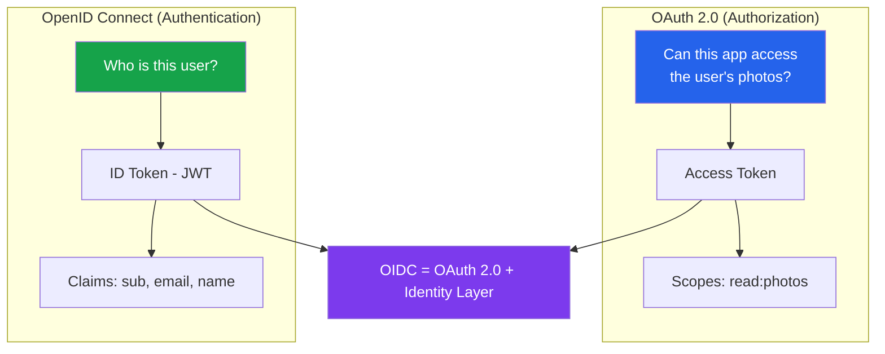
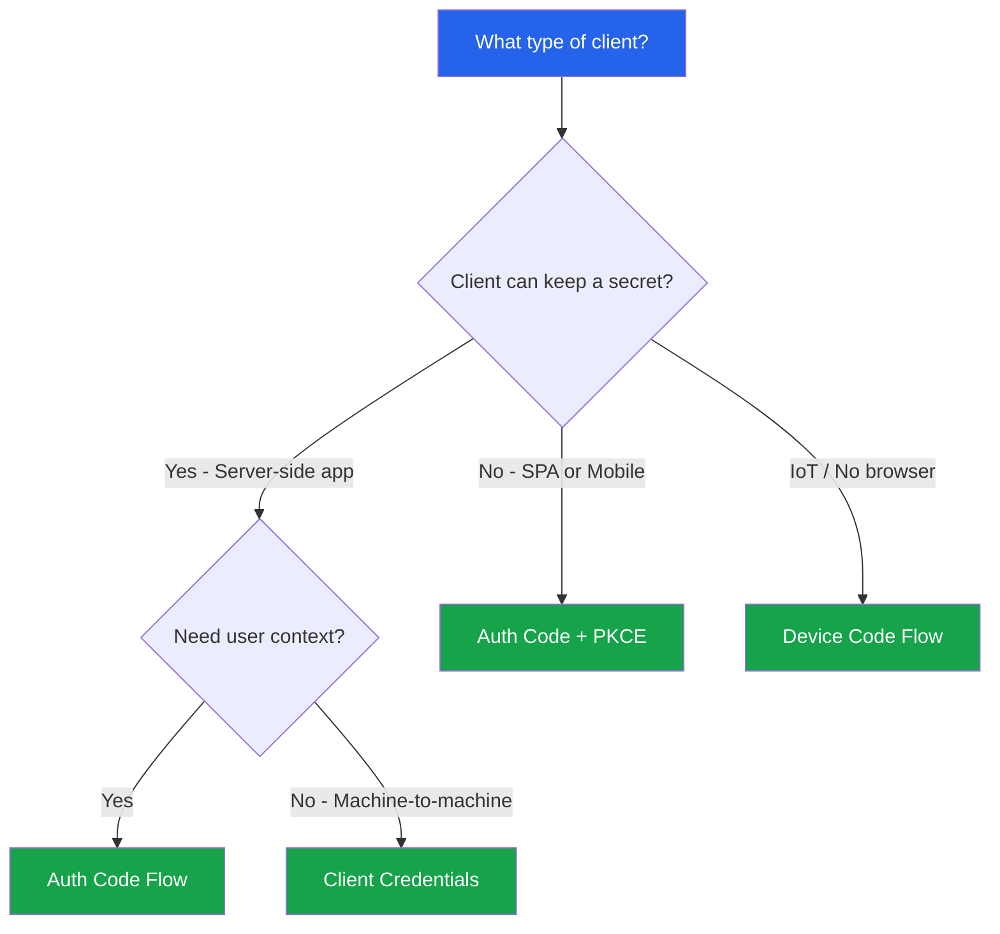
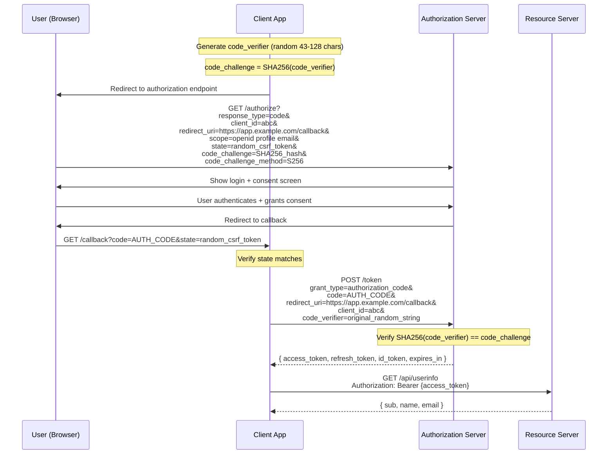
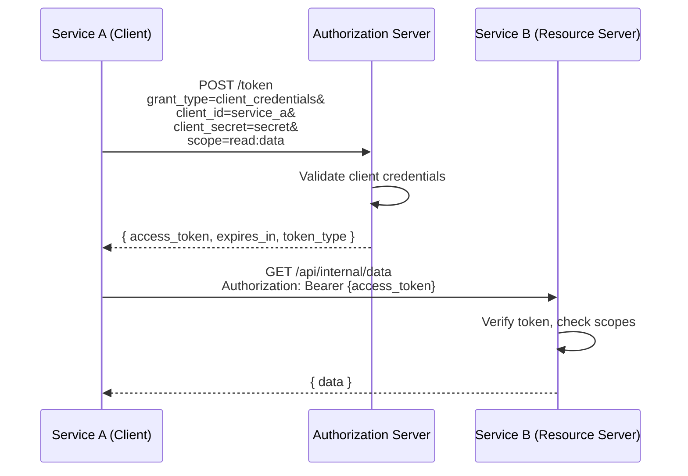
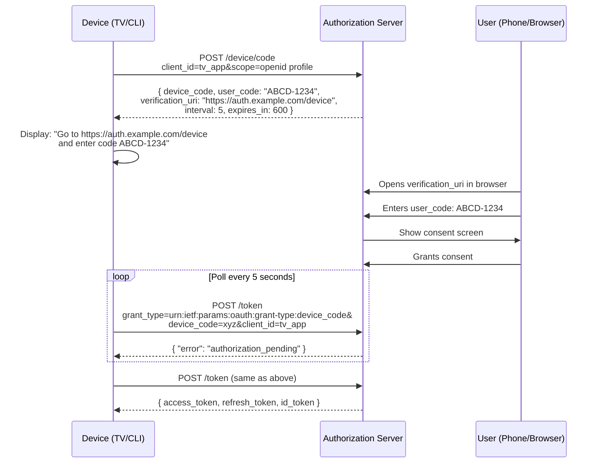
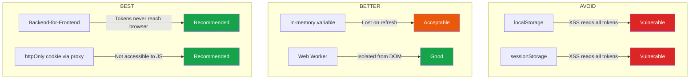

# OAuth 2.0 & OpenID Connect

OAuth 2.0 is an authorization framework that enables applications to obtain limited access to user accounts on third-party services. OpenID Connect (OIDC) is an identity layer built on top of OAuth 2.0 that adds authentication. Together, they form the backbone of modern identity on the web — every "Sign in with Google/GitHub/Microsoft" button uses these protocols.

## OAuth 2.0 vs OpenID Connect



| Concept | OAuth 2.0 | OpenID Connect |
|---------|-----------|----------------|
| Purpose | Authorization (what can you do?) | Authentication (who are you?) |
| Token | Access Token (opaque or JWT) | ID Token (always JWT) |
| Standard | RFC 6749 | Built on OAuth 2.0 |
| Scope | `read:photos`, `write:docs` | `openid`, `profile`, `email` |
| User info | Resource server API | UserInfo endpoint + ID token claims |

## Key Terminology

| Term | Definition |
|------|-----------|
| **Resource Owner** | The user who owns the data |
| **Client** | The application requesting access (your app) |
| **Authorization Server** | Issues tokens after authenticating the user (Auth0, Okta, Keycloak) |
| **Resource Server** | The API that holds the protected data |
| **Redirect URI** | Where the authorization server sends the user after consent |
| **Scope** | Permission boundaries (what the token is allowed to do) |
| **Grant Type** | The method used to obtain a token |
| **PKCE** | Proof Key for Code Exchange — prevents authorization code interception |

## Flow Selection Guide



::: danger Deprecated Flows
- **Implicit Flow** — Tokens in URL fragments, no refresh tokens, vulnerable to token leakage. Replaced by Auth Code + PKCE.
- **Resource Owner Password Credentials (ROPC)** — Sends username/password directly to the client. Only for legacy migration scenarios.
:::

## Flow 1: Authorization Code + PKCE

This is the recommended flow for all user-facing applications — SPAs, mobile apps, and server-side web apps. PKCE (Proof Key for Code Exchange, pronounced "pixie") protects against authorization code interception attacks.

### Sequence Diagram



### PKCE Implementation

```typescript
import crypto from 'crypto';
import { URL, URLSearchParams } from 'url';

// ─── PKCE Helper Functions ───────────────────────────────────

function generateCodeVerifier(): string {
  // RFC 7636: 43-128 characters, [A-Z] / [a-z] / [0-9] / "-" / "." / "_" / "~"
  return crypto.randomBytes(32).toString('base64url');
}

function generateCodeChallenge(verifier: string): string {
  // S256: BASE64URL(SHA256(code_verifier))
  return crypto
    .createHash('sha256')
    .update(verifier)
    .digest('base64url');
}

function generateState(): string {
  return crypto.randomBytes(16).toString('hex');
}

// ─── OAuth Client Configuration ──────────────────────────────

interface OAuthConfig {
  clientId: string;
  clientSecret?: string; // Not needed for public clients (SPAs)
  authorizationEndpoint: string;
  tokenEndpoint: string;
  userInfoEndpoint: string;
  redirectUri: string;
  scopes: string[];
  issuer: string;
}

const config: OAuthConfig = {
  clientId: 'app_client_id',
  clientSecret: 'app_client_secret', // Server-side only
  authorizationEndpoint: 'https://auth.example.com/authorize',
  tokenEndpoint: 'https://auth.example.com/token',
  userInfoEndpoint: 'https://auth.example.com/userinfo',
  redirectUri: 'https://app.example.com/callback',
  scopes: ['openid', 'profile', 'email'],
  issuer: 'https://auth.example.com',
};

// ─── Step 1: Build Authorization URL ─────────────────────────

interface AuthorizationRequest {
  url: string;
  state: string;
  codeVerifier: string;
  nonce: string;
}

function buildAuthorizationUrl(config: OAuthConfig): AuthorizationRequest {
  const codeVerifier = generateCodeVerifier();
  const codeChallenge = generateCodeChallenge(codeVerifier);
  const state = generateState();
  const nonce = generateState(); // For OIDC replay protection

  const url = new URL(config.authorizationEndpoint);
  url.searchParams.set('response_type', 'code');
  url.searchParams.set('client_id', config.clientId);
  url.searchParams.set('redirect_uri', config.redirectUri);
  url.searchParams.set('scope', config.scopes.join(' '));
  url.searchParams.set('state', state);
  url.searchParams.set('nonce', nonce);
  url.searchParams.set('code_challenge', codeChallenge);
  url.searchParams.set('code_challenge_method', 'S256');

  return {
    url: url.toString(),
    state,
    codeVerifier,
    nonce,
  };
}
```

### Server-Side Callback Handler

```typescript
import express, { Request, Response } from 'express';
import { jwtVerify, createRemoteJWKSet } from 'jose';

const app = express();

// Store pending auth requests (use Redis in production)
const pendingAuth = new Map<string, {
  codeVerifier: string;
  nonce: string;
  expiresAt: number;
}>();

// ─── Initiate Login ──────────────────────────────────────────

app.get('/auth/login', (req: Request, res: Response) => {
  const authRequest = buildAuthorizationUrl(config);

  // Store PKCE verifier and state in session
  pendingAuth.set(authRequest.state, {
    codeVerifier: authRequest.codeVerifier,
    nonce: authRequest.nonce,
    expiresAt: Date.now() + 600_000, // 10 minute expiry
  });

  res.redirect(authRequest.url);
});

// ─── Handle Callback ─────────────────────────────────────────

interface TokenResponse {
  access_token: string;
  token_type: string;
  expires_in: number;
  refresh_token?: string;
  id_token?: string;
  scope: string;
}

app.get('/auth/callback', async (req: Request, res: Response) => {
  const { code, state, error, error_description } = req.query;

  // Check for errors from the authorization server
  if (error) {
    return res.status(400).json({
      error: error as string,
      description: error_description as string,
    });
  }

  // Validate state parameter (CSRF protection)
  const pending = pendingAuth.get(state as string);
  if (!pending) {
    return res.status(400).json({ error: 'Invalid or expired state parameter' });
  }

  // Clean up pending state
  pendingAuth.delete(state as string);

  // Check expiry
  if (Date.now() > pending.expiresAt) {
    return res.status(400).json({ error: 'Authorization request expired' });
  }

  // Exchange authorization code for tokens
  const tokenResponse = await fetch(config.tokenEndpoint, {
    method: 'POST',
    headers: { 'Content-Type': 'application/x-www-form-urlencoded' },
    body: new URLSearchParams({
      grant_type: 'authorization_code',
      code: code as string,
      redirect_uri: config.redirectUri,
      client_id: config.clientId,
      client_secret: config.clientSecret!, // Server-side only
      code_verifier: pending.codeVerifier,
    }),
  });

  if (!tokenResponse.ok) {
    const errorBody = await tokenResponse.json();
    return res.status(400).json({ error: 'Token exchange failed', details: errorBody });
  }

  const tokens: TokenResponse = await tokenResponse.json();

  // ─── Validate ID Token ───────────────────────────────────

  if (tokens.id_token) {
    const JWKS = createRemoteJWKSet(
      new URL('https://auth.example.com/.well-known/jwks.json')
    );

    try {
      const { payload } = await jwtVerify(tokens.id_token, JWKS, {
        issuer: config.issuer,
        audience: config.clientId,
      });

      // Validate nonce to prevent replay attacks
      if (payload.nonce !== pending.nonce) {
        return res.status(400).json({ error: 'Invalid nonce — possible replay attack' });
      }

      // Extract user identity from ID token
      const user = {
        id: payload.sub,
        email: payload.email as string,
        name: payload.name as string,
        emailVerified: payload.email_verified as boolean,
      };

      // Create application session
      req.session.user = user;
      req.session.accessToken = tokens.access_token;
      req.session.refreshToken = tokens.refresh_token;

      res.redirect('/dashboard');
    } catch (error) {
      return res.status(400).json({ error: 'Invalid ID token' });
    }
  }
});
```

### SPA Implementation (Browser)

```typescript
// ─── SPA OAuth Client ────────────────────────────────────────

class OAuthSPAClient {
  private config: OAuthConfig;

  constructor(config: OAuthConfig) {
    this.config = config;
  }

  async login(): Promise<void> {
    const codeVerifier = generateCodeVerifier();
    const codeChallenge = await this.sha256(codeVerifier);
    const state = generateState();
    const nonce = generateState();

    // Store in sessionStorage (cleared when tab closes)
    sessionStorage.setItem('oauth_code_verifier', codeVerifier);
    sessionStorage.setItem('oauth_state', state);
    sessionStorage.setItem('oauth_nonce', nonce);

    const params = new URLSearchParams({
      response_type: 'code',
      client_id: this.config.clientId,
      redirect_uri: this.config.redirectUri,
      scope: this.config.scopes.join(' '),
      state,
      nonce,
      code_challenge: codeChallenge,
      code_challenge_method: 'S256',
    });

    window.location.href = `${this.config.authorizationEndpoint}?${params}`;
  }

  async handleCallback(): Promise<TokenResponse> {
    const params = new URLSearchParams(window.location.search);
    const code = params.get('code');
    const state = params.get('state');
    const error = params.get('error');

    if (error) {
      throw new Error(`OAuth error: ${error} — ${params.get('error_description')}`);
    }

    // Validate state
    const savedState = sessionStorage.getItem('oauth_state');
    if (state !== savedState) {
      throw new Error('State mismatch — possible CSRF attack');
    }

    const codeVerifier = sessionStorage.getItem('oauth_code_verifier')!;

    // Clean up
    sessionStorage.removeItem('oauth_code_verifier');
    sessionStorage.removeItem('oauth_state');
    sessionStorage.removeItem('oauth_nonce');

    // Exchange code for tokens (no client_secret for public clients)
    const response = await fetch(this.config.tokenEndpoint, {
      method: 'POST',
      headers: { 'Content-Type': 'application/x-www-form-urlencoded' },
      body: new URLSearchParams({
        grant_type: 'authorization_code',
        code: code!,
        redirect_uri: this.config.redirectUri,
        client_id: this.config.clientId,
        code_verifier: codeVerifier,
      }),
    });

    if (!response.ok) {
      throw new Error('Token exchange failed');
    }

    return response.json();
  }

  private async sha256(input: string): Promise<string> {
    const encoder = new TextEncoder();
    const data = encoder.encode(input);
    const hash = await crypto.subtle.digest('SHA-256', data);
    return btoa(String.fromCharCode(...new Uint8Array(hash)))
      .replace(/\+/g, '-')
      .replace(/\//g, '_')
      .replace(/=+$/, '');
  }
}
```

## Flow 2: Client Credentials

For machine-to-machine communication where no user is involved. The client authenticates with its own credentials and receives an access token.



```typescript
// ─── Client Credentials Flow ────────────────────────────────

class ServiceClient {
  private config: {
    clientId: string;
    clientSecret: string;
    tokenEndpoint: string;
    scopes: string[];
  };
  private cachedToken: { token: string; expiresAt: number } | null = null;

  constructor(config: typeof ServiceClient.prototype.config) {
    this.config = config;
  }

  async getAccessToken(): Promise<string> {
    // Return cached token if still valid (with 60s buffer)
    if (this.cachedToken && this.cachedToken.expiresAt > Date.now() + 60_000) {
      return this.cachedToken.token;
    }

    const response = await fetch(this.config.tokenEndpoint, {
      method: 'POST',
      headers: {
        'Content-Type': 'application/x-www-form-urlencoded',
        Authorization: `Basic ${Buffer.from(
          `${this.config.clientId}:${this.config.clientSecret}`
        ).toString('base64')}`,
      },
      body: new URLSearchParams({
        grant_type: 'client_credentials',
        scope: this.config.scopes.join(' '),
      }),
    });

    if (!response.ok) {
      throw new Error(`Token request failed: ${response.status}`);
    }

    const data: TokenResponse = await response.json();

    this.cachedToken = {
      token: data.access_token,
      expiresAt: Date.now() + data.expires_in * 1000,
    };

    return data.access_token;
  }

  async callApi(url: string): Promise<any> {
    const token = await this.getAccessToken();
    const response = await fetch(url, {
      headers: { Authorization: `Bearer ${token}` },
    });
    return response.json();
  }
}

// Usage
const billingService = new ServiceClient({
  clientId: 'billing-service',
  clientSecret: process.env.BILLING_CLIENT_SECRET!,
  tokenEndpoint: 'https://auth.example.com/token',
  scopes: ['read:invoices', 'write:invoices'],
});

const invoices = await billingService.callApi('https://api.example.com/invoices');
```

## Flow 3: Device Code Flow

For devices with limited input capabilities (smart TVs, CLI tools, IoT devices) that cannot display a browser. The device shows a code and a URL, and the user authorizes on a separate device.



```typescript
// ─── Device Code Flow Implementation ────────────────────────

interface DeviceCodeResponse {
  device_code: string;
  user_code: string;
  verification_uri: string;
  verification_uri_complete?: string;
  expires_in: number;
  interval: number;
}

class DeviceCodeFlow {
  private clientId: string;
  private tokenEndpoint: string;
  private deviceEndpoint: string;

  constructor(config: {
    clientId: string;
    tokenEndpoint: string;
    deviceEndpoint: string;
  }) {
    this.clientId = config.clientId;
    this.tokenEndpoint = config.tokenEndpoint;
    this.deviceEndpoint = config.deviceEndpoint;
  }

  async requestDeviceCode(scopes: string[]): Promise<DeviceCodeResponse> {
    const response = await fetch(this.deviceEndpoint, {
      method: 'POST',
      headers: { 'Content-Type': 'application/x-www-form-urlencoded' },
      body: new URLSearchParams({
        client_id: this.clientId,
        scope: scopes.join(' '),
      }),
    });

    if (!response.ok) {
      throw new Error('Failed to request device code');
    }

    return response.json();
  }

  async pollForToken(deviceCode: string, interval: number): Promise<TokenResponse> {
    const grantType = 'urn:ietf:params:oauth:grant-type:device_code';

    while (true) {
      await new Promise(resolve => setTimeout(resolve, interval * 1000));

      const response = await fetch(this.tokenEndpoint, {
        method: 'POST',
        headers: { 'Content-Type': 'application/x-www-form-urlencoded' },
        body: new URLSearchParams({
          grant_type: grantType,
          device_code: deviceCode,
          client_id: this.clientId,
        }),
      });

      const data = await response.json();

      if (response.ok) {
        return data as TokenResponse;
      }

      switch (data.error) {
        case 'authorization_pending':
          // User hasn't authorized yet — keep polling
          continue;
        case 'slow_down':
          // Increase interval by 5 seconds
          interval += 5;
          continue;
        case 'expired_token':
          throw new Error('Device code expired — user did not authorize in time');
        case 'access_denied':
          throw new Error('User denied authorization');
        default:
          throw new Error(`Unexpected error: ${data.error}`);
      }
    }
  }

  async authenticate(scopes: string[]): Promise<TokenResponse> {
    const deviceCode = await this.requestDeviceCode(scopes);

    console.log(`\nTo sign in, open: ${deviceCode.verification_uri}`);
    console.log(`Enter code: ${deviceCode.user_code}\n`);

    if (deviceCode.verification_uri_complete) {
      console.log(`Or open: ${deviceCode.verification_uri_complete}\n`);
    }

    return this.pollForToken(deviceCode.device_code, deviceCode.interval);
  }
}
```

## OpenID Connect (OIDC)

OIDC extends OAuth 2.0 with standardized identity claims. The key addition is the **ID Token** — a JWT that contains information about the authenticated user.

### ID Token Structure

```json
{
  "iss": "https://auth.example.com",
  "sub": "user_abc123",
  "aud": "app_client_id",
  "exp": 1710000900,
  "iat": 1710000000,
  "nonce": "n-0S6_WzA2Mj",
  "auth_time": 1710000000,
  "at_hash": "HK6E_P6Dh8Y93mRNtsDB1Q",
  "email": "user@example.com",
  "email_verified": true,
  "name": "Jane Doe",
  "picture": "https://example.com/photo.jpg"
}
```

### OIDC Discovery

Every OIDC provider publishes a discovery document at `/.well-known/openid-configuration`:

```typescript
interface OIDCDiscoveryDocument {
  issuer: string;
  authorization_endpoint: string;
  token_endpoint: string;
  userinfo_endpoint: string;
  jwks_uri: string;
  registration_endpoint?: string;
  scopes_supported: string[];
  response_types_supported: string[];
  grant_types_supported: string[];
  subject_types_supported: string[];
  id_token_signing_alg_values_supported: string[];
  claims_supported: string[];
}

async function discoverOIDC(issuer: string): Promise<OIDCDiscoveryDocument> {
  const url = `${issuer}/.well-known/openid-configuration`;
  const response = await fetch(url);

  if (!response.ok) {
    throw new Error(`OIDC discovery failed for ${issuer}`);
  }

  const doc: OIDCDiscoveryDocument = await response.json();

  // Validate issuer matches
  if (doc.issuer !== issuer) {
    throw new Error(
      `Issuer mismatch: expected ${issuer}, got ${doc.issuer}`
    );
  }

  return doc;
}
```

### OIDC Standard Scopes

| Scope | Claims Returned |
|-------|----------------|
| `openid` | `sub` (required) |
| `profile` | `name`, `family_name`, `given_name`, `picture`, `locale` |
| `email` | `email`, `email_verified` |
| `address` | `address` (structured object) |
| `phone` | `phone_number`, `phone_number_verified` |

## Security Considerations

### Redirect URI Validation

```typescript
// VULNERABLE: Open redirect — attacker can steal the authorization code
app.get('/auth/callback', (req, res) => {
  const redirectTo = req.query.redirect_to as string;
  res.redirect(redirectTo); // Attacker sets redirect_to to their server
});

// FIXED: Whitelist allowed redirect URIs
const ALLOWED_REDIRECT_URIS = new Set([
  'https://app.example.com/callback',
  'https://app.example.com/auth/callback',
]);

function validateRedirectUri(uri: string): boolean {
  return ALLOWED_REDIRECT_URIS.has(uri);
}

// On the authorization server side, ALWAYS validate redirect_uri
// against the pre-registered list for the client_id.
```

### Token Storage in SPAs



::: warning Backend-for-Frontend (BFF) Pattern
For SPAs, the most secure approach is the BFF pattern: a thin backend proxy that handles the OAuth flow, stores tokens in httpOnly cookies, and proxies API requests. The SPA never sees the access token directly.
:::

### Common OAuth Attacks

| Attack | Description | Mitigation |
|--------|-------------|------------|
| Authorization Code Interception | Attacker intercepts the code from the redirect | PKCE |
| CSRF on Callback | Attacker tricks user into completing an OAuth flow with attacker's code | `state` parameter |
| Token Substitution | Using a token from one client in another | Validate `aud` claim |
| Redirect URI Manipulation | Redirecting the code to attacker's server | Exact redirect URI matching |
| Refresh Token Theft | Stealing long-lived refresh token | Rotation + reuse detection |
| Mix-Up Attack | Confusing the client about which IdP responded | Validate `iss` in ID token |
| Open Redirect | Using valid redirect URI that itself redirects | No open redirects in app |

## Multi-Provider OIDC Implementation

```typescript
import { Redis } from 'ioredis';
import { createRemoteJWKSet, jwtVerify } from 'jose';

interface ProviderConfig {
  name: string;
  issuer: string;
  clientId: string;
  clientSecret: string;
  scopes: string[];
  discovery?: OIDCDiscoveryDocument;
}

class MultiProviderOIDC {
  private providers: Map<string, ProviderConfig> = new Map();
  private redis: Redis;

  constructor(redis: Redis) {
    this.redis = redis;
  }

  async registerProvider(config: ProviderConfig): Promise<void> {
    // Auto-discover endpoints
    const discovery = await discoverOIDC(config.issuer);
    config.discovery = discovery;
    this.providers.set(config.name, config);
  }

  buildLoginUrl(providerName: string): AuthorizationRequest {
    const provider = this.providers.get(providerName);
    if (!provider || !provider.discovery) {
      throw new Error(`Unknown provider: ${providerName}`);
    }

    const codeVerifier = generateCodeVerifier();
    const codeChallenge = generateCodeChallenge(codeVerifier);
    const state = JSON.stringify({
      provider: providerName,
      csrf: generateState(),
    });
    const nonce = generateState();

    const url = new URL(provider.discovery.authorization_endpoint);
    url.searchParams.set('response_type', 'code');
    url.searchParams.set('client_id', provider.clientId);
    url.searchParams.set('redirect_uri', `https://app.example.com/auth/${providerName}/callback`);
    url.searchParams.set('scope', provider.scopes.join(' '));
    url.searchParams.set('state', Buffer.from(state).toString('base64url'));
    url.searchParams.set('nonce', nonce);
    url.searchParams.set('code_challenge', codeChallenge);
    url.searchParams.set('code_challenge_method', 'S256');

    return { url: url.toString(), state, codeVerifier, nonce };
  }

  async handleCallback(
    providerName: string,
    code: string,
    codeVerifier: string,
    expectedNonce: string
  ): Promise<{ userId: string; email: string; name: string; provider: string }> {
    const provider = this.providers.get(providerName);
    if (!provider || !provider.discovery) {
      throw new Error(`Unknown provider: ${providerName}`);
    }

    // Exchange code for tokens
    const tokenResponse = await fetch(provider.discovery.token_endpoint, {
      method: 'POST',
      headers: { 'Content-Type': 'application/x-www-form-urlencoded' },
      body: new URLSearchParams({
        grant_type: 'authorization_code',
        code,
        redirect_uri: `https://app.example.com/auth/${providerName}/callback`,
        client_id: provider.clientId,
        client_secret: provider.clientSecret,
        code_verifier: codeVerifier,
      }),
    });

    const tokens: TokenResponse = await tokenResponse.json();

    // Verify ID token
    const JWKS = createRemoteJWKSet(
      new URL(provider.discovery.jwks_uri)
    );

    const { payload } = await jwtVerify(tokens.id_token!, JWKS, {
      issuer: provider.issuer,
      audience: provider.clientId,
    });

    if (payload.nonce !== expectedNonce) {
      throw new Error('Nonce mismatch');
    }

    return {
      userId: payload.sub!,
      email: payload.email as string,
      name: payload.name as string,
      provider: providerName,
    };
  }
}

// ─── Usage ───────────────────────────────────────────────────

const oidc = new MultiProviderOIDC(new Redis());

await oidc.registerProvider({
  name: 'google',
  issuer: 'https://accounts.google.com',
  clientId: process.env.GOOGLE_CLIENT_ID!,
  clientSecret: process.env.GOOGLE_CLIENT_SECRET!,
  scopes: ['openid', 'profile', 'email'],
});

await oidc.registerProvider({
  name: 'github',
  issuer: 'https://github.com',
  clientId: process.env.GITHUB_CLIENT_ID!,
  clientSecret: process.env.GITHUB_CLIENT_SECRET!,
  scopes: ['openid', 'user:email'],
});
```

## Security Checklist

- [ ] Use Authorization Code + PKCE for all user-facing flows
- [ ] Never use the Implicit flow
- [ ] Validate `state` parameter to prevent CSRF
- [ ] Validate `nonce` in ID tokens to prevent replay attacks
- [ ] Validate `iss` and `aud` claims in all tokens
- [ ] Use exact redirect URI matching (no wildcards)
- [ ] Store tokens in httpOnly cookies or use BFF pattern for SPAs
- [ ] Use OIDC Discovery for automatic endpoint configuration
- [ ] Implement refresh token rotation with reuse detection
- [ ] Use `client_secret` only in confidential (server-side) clients
- [ ] Validate ID token signature using JWKS endpoint
- [ ] Never log tokens — log only token metadata (JTI, expiry)
