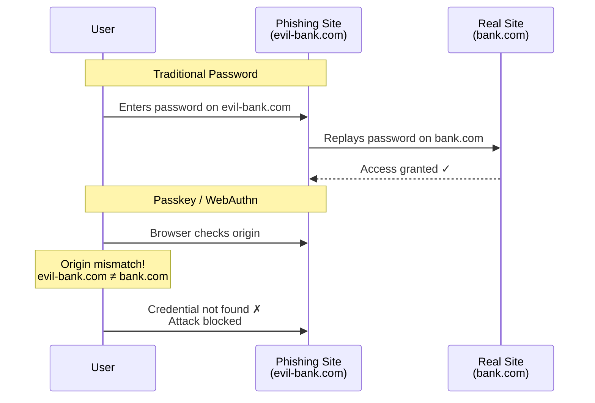
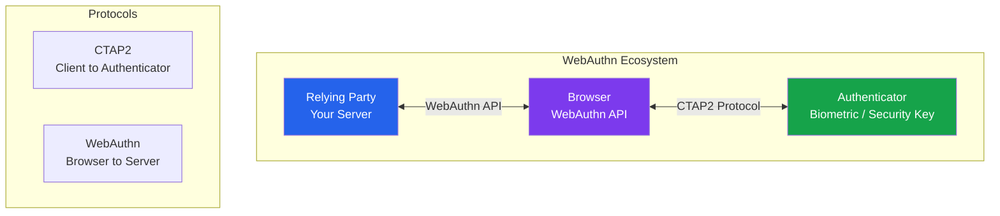
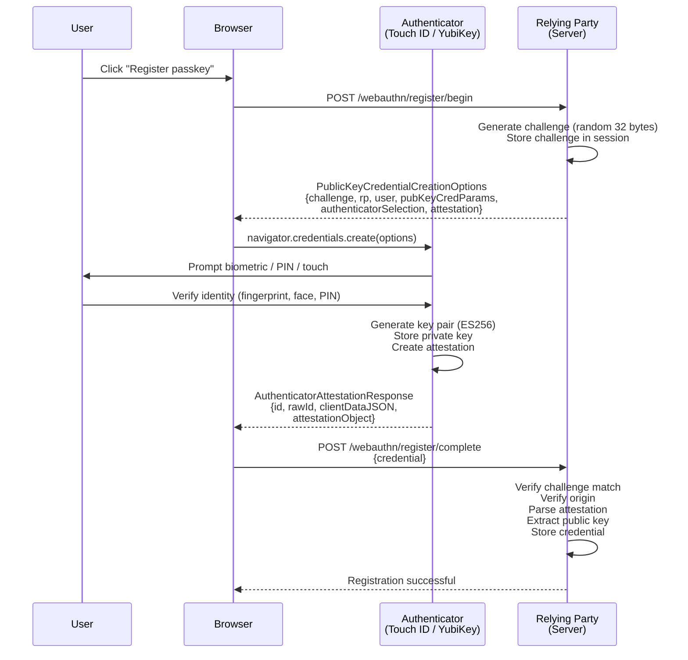
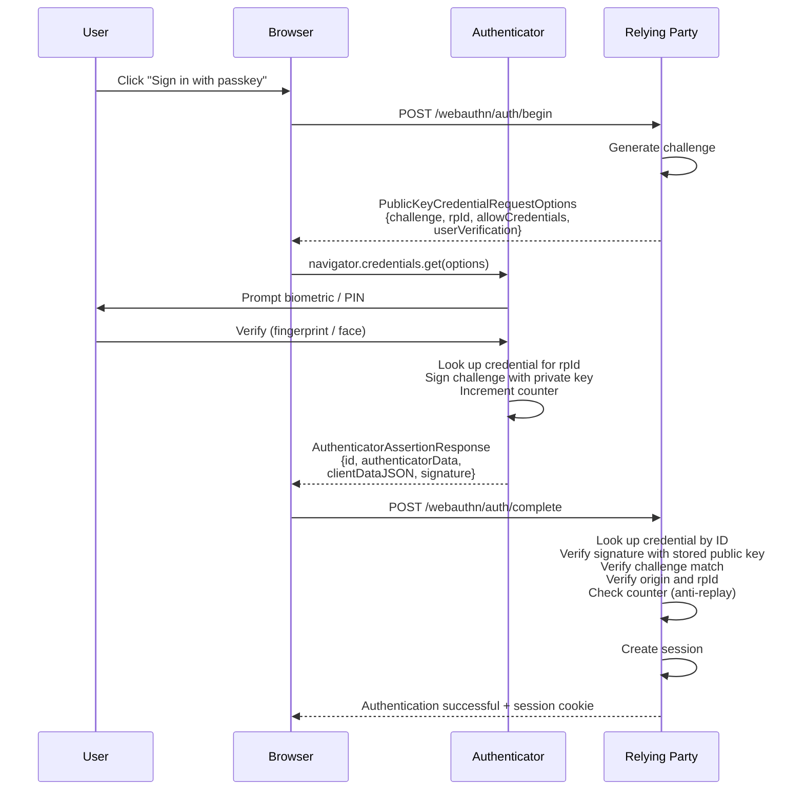
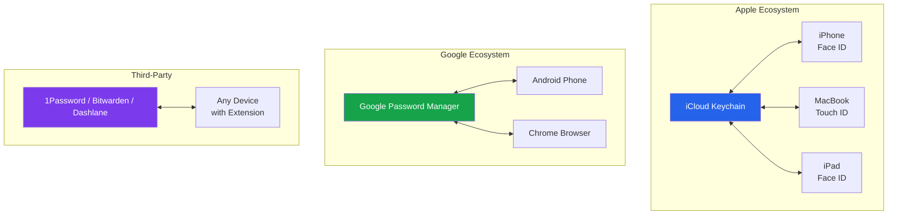
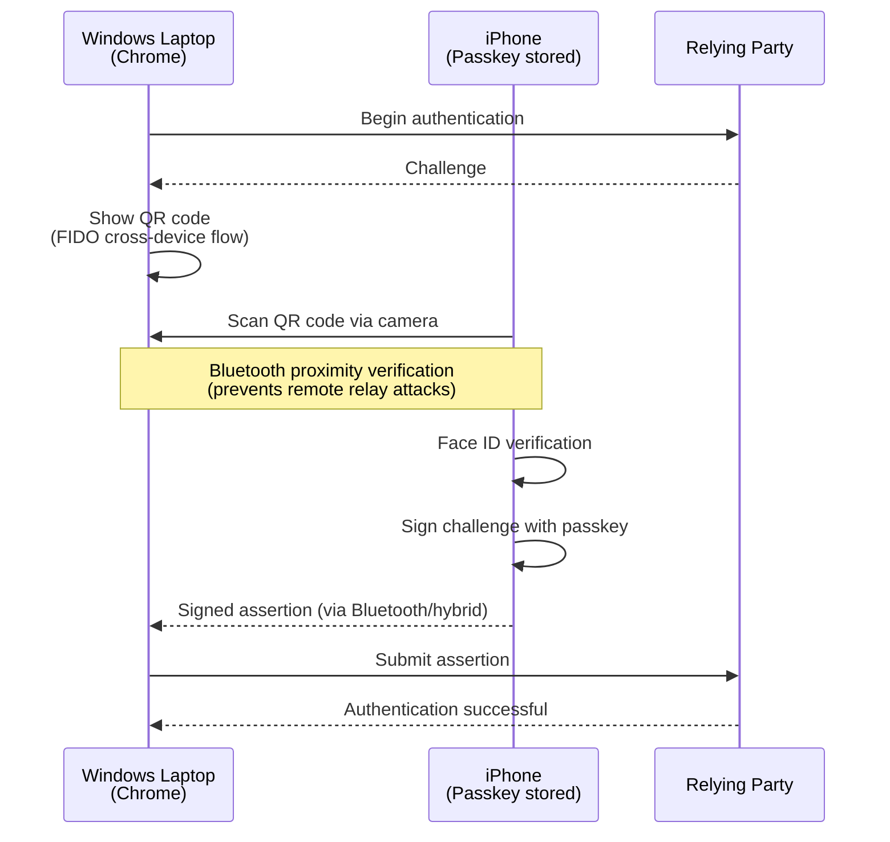

# Passkeys & WebAuthn

Passkeys are the replacement for passwords. Not a supplement, not an alternative — the replacement. Apple, Google, and Microsoft have committed to making passkeys the default authentication mechanism across all their platforms. By 2026, every major operating system, browser, and password manager supports passkeys. This page covers the protocol internals, implementation details, and the migration strategy that gets your users off passwords.

## Why Passwords Are Dying

| Problem | Impact | Passkey Solution |
|---------|--------|-----------------|
| **Phishing** | 80%+ of breaches start with phishing | Passkeys are bound to the origin — cannot be phished |
| **Credential stuffing** | Billions of leaked credentials in circulation | No shared secret to stuff — every credential is unique per site |
| **Password reuse** | 65% of users reuse passwords across sites | Each passkey is cryptographically unique per domain |
| **Brute force** | Weak passwords cracked in seconds | No password to brute force — asymmetric crypto |
| **Database breaches** | Password hashes stolen and cracked offline | Server stores public key only — useless without private key |
| **User friction** | Password fatigue, forgotten passwords, reset flows | Biometric unlock — faster than typing a password |

### Phishing Resistance — The Key Differentiator



Passkeys are cryptographically bound to the relying party's origin (domain). The browser enforces this — there is no user decision involved. Even the most sophisticated phishing page cannot extract a passkey because the browser will not present credentials for the wrong origin.

## WebAuthn Protocol Overview

WebAuthn (Web Authentication API) is the W3C standard that powers passkeys. It defines two ceremonies: **registration** (creating a credential) and **authentication** (using a credential).



## Registration Flow



### Registration Implementation (TypeScript — SimpleWebAuthn)

```typescript
// Server — registration ceremony
import {
  generateRegistrationOptions,
  verifyRegistrationResponse,
} from '@simplewebauthn/server';

const rpName = 'Archon Knowledge Vault';
const rpID = 'example.com';
const origin = 'https://example.com';

// Step 1: Generate registration options
app.post('/webauthn/register/begin', async (req, res) => {
  const user = req.user!;

  // Get existing credentials to exclude (prevent duplicate registration)
  const existingCredentials = await db.credentials.findByUserId(user.id);

  const options = await generateRegistrationOptions({
    rpName,
    rpID,
    userID: user.id,
    userName: user.email,
    userDisplayName: user.displayName,
    // Exclude already-registered credentials
    excludeCredentials: existingCredentials.map(cred => ({
      id: cred.credentialId,
      type: 'public-key',
      transports: cred.transports,
    })),
    authenticatorSelection: {
      // Require a resident key (passkey)
      residentKey: 'required',
      // Prefer platform authenticator (Touch ID, Face ID, Windows Hello)
      authenticatorAttachment: 'platform',
      userVerification: 'required',
    },
    supportedAlgorithmIDs: [-7, -257], // ES256, RS256
  });

  // Store challenge in session for verification
  req.session.currentChallenge = options.challenge;

  res.json(options);
});

// Step 2: Verify registration response
app.post('/webauthn/register/complete', async (req, res) => {
  const expectedChallenge = req.session.currentChallenge;

  if (!expectedChallenge) {
    return res.status(400).json({ error: 'No challenge found in session' });
  }

  try {
    const verification = await verifyRegistrationResponse({
      response: req.body,
      expectedChallenge,
      expectedOrigin: origin,
      expectedRPID: rpID,
    });

    if (!verification.verified || !verification.registrationInfo) {
      return res.status(400).json({ error: 'Verification failed' });
    }

    const { credentialPublicKey, credentialID, counter } =
      verification.registrationInfo;

    // Store credential in database
    await db.credentials.create({
      userId: req.user!.id,
      credentialId: Buffer.from(credentialID),
      publicKey: Buffer.from(credentialPublicKey),
      counter,
      transports: req.body.response.transports || [],
      createdAt: new Date(),
      lastUsedAt: new Date(),
      deviceName: req.body.deviceName || 'Unknown device',
    });

    // Clear challenge
    delete req.session.currentChallenge;

    res.json({ verified: true });
  } catch (error) {
    res.status(400).json({ error: (error as Error).message });
  }
});
```

### Client-Side Registration

```typescript
// Browser — registration ceremony
import {
  startRegistration,
  browserSupportsWebAuthn,
} from '@simplewebauthn/browser';

async function registerPasskey(): Promise<void> {
  if (!browserSupportsWebAuthn()) {
    throw new Error('WebAuthn is not supported in this browser');
  }

  // Get options from server
  const optionsResponse = await fetch('/webauthn/register/begin', {
    method: 'POST',
    credentials: 'include',
  });
  const options = await optionsResponse.json();

  // Trigger authenticator (biometric prompt)
  const credential = await startRegistration(options);

  // Send credential to server for verification
  const verifyResponse = await fetch('/webauthn/register/complete', {
    method: 'POST',
    headers: { 'Content-Type': 'application/json' },
    credentials: 'include',
    body: JSON.stringify({
      ...credential,
      deviceName: getDeviceName(), // "iPhone 15 Pro", "MacBook Pro"
    }),
  });

  const result = await verifyResponse.json();
  if (result.verified) {
    showNotification('Passkey registered successfully');
  }
}
```

## Authentication Flow



### Authentication Implementation

```typescript
// Server — authentication ceremony
import {
  generateAuthenticationOptions,
  verifyAuthenticationResponse,
} from '@simplewebauthn/server';

// Step 1: Generate authentication options
app.post('/webauthn/auth/begin', async (req, res) => {
  const { email } = req.body;

  // For passkeys (resident keys), allowCredentials can be empty
  // The authenticator will show all credentials for this rpId
  let allowCredentials: any[] = [];

  if (email) {
    // If email provided, limit to that user's credentials
    const user = await db.users.findByEmail(email);
    if (user) {
      const creds = await db.credentials.findByUserId(user.id);
      allowCredentials = creds.map(c => ({
        id: c.credentialId,
        type: 'public-key',
        transports: c.transports,
      }));
    }
  }

  const options = await generateAuthenticationOptions({
    rpID,
    allowCredentials,
    userVerification: 'required',
  });

  req.session.currentChallenge = options.challenge;
  res.json(options);
});

// Step 2: Verify authentication response
app.post('/webauthn/auth/complete', async (req, res) => {
  const expectedChallenge = req.session.currentChallenge;

  // Look up credential
  const credential = await db.credentials.findByCredentialId(
    Buffer.from(req.body.id, 'base64url')
  );

  if (!credential) {
    return res.status(401).json({ error: 'Credential not found' });
  }

  try {
    const verification = await verifyAuthenticationResponse({
      response: req.body,
      expectedChallenge: expectedChallenge!,
      expectedOrigin: origin,
      expectedRPID: rpID,
      authenticator: {
        credentialID: credential.credentialId,
        credentialPublicKey: credential.publicKey,
        counter: credential.counter,
      },
    });

    if (!verification.verified) {
      return res.status(401).json({ error: 'Verification failed' });
    }

    // Update counter (anti-replay)
    await db.credentials.updateCounter(
      credential.id,
      verification.authenticationInfo.newCounter
    );

    // Update last used timestamp
    await db.credentials.updateLastUsed(credential.id);

    // Create session
    const user = await db.users.findById(credential.userId);
    const sessionId = await createSession({
      userId: user.id,
      authMethod: 'passkey',
      mfaVerified: true, // Passkeys satisfy MFA
    });

    res.cookie('__Host-session', sessionId, {
      httpOnly: true, secure: true, sameSite: 'lax', path: '/',
    });

    res.json({ verified: true, user: { id: user.id, email: user.email } });
  } catch (error) {
    res.status(401).json({ error: (error as Error).message });
  }
});
```

## Resident Credentials vs Non-Resident

| Property | Resident (Discoverable) | Non-Resident |
|----------|------------------------|--------------|
| **Storage** | Stored on authenticator | Stored on server, sent in `allowCredentials` |
| **Username-less login** | Yes — authenticator presents credential | No — user must enter username first |
| **Passkey** | Yes — this is what "passkey" means | Not a passkey |
| **Authenticator storage** | Limited (25-100 credentials per key) | Unlimited (server stores them) |
| **Use case** | Consumer login, passwordless | Second factor (FIDO U2F legacy) |

::: tip Passkeys = Resident Credentials
When people say "passkeys," they mean discoverable/resident credentials. The key difference is that the authenticator stores enough information to identify the user without the server providing a list of credential IDs. This enables the "Sign in with passkey" button that shows a list of accounts.
:::

## Platform vs Roaming Authenticators

### Platform Authenticators

Built into the device — Touch ID, Face ID, Windows Hello, Android biometric.

```
Pros: Seamless UX, always available, no extra hardware
Cons: Locked to one device (unless synced), lost when device is lost
```

### Roaming Authenticators

External hardware — YubiKey, Titan Security Key, NFC keys.

```
Pros: Work across any device, highest security, resistant to remote attacks
Cons: Extra cost ($25-60), can be lost/forgotten, slower UX
```

### Selection in Code

```typescript
const registrationOptions = {
  authenticatorSelection: {
    // Platform only (Touch ID, Face ID, Windows Hello)
    authenticatorAttachment: 'platform',

    // Cross-platform (hardware keys too)
    // authenticatorAttachment: 'cross-platform',

    // Allow both (recommended for broadest support)
    // authenticatorAttachment: undefined,

    residentKey: 'required',       // Must be a passkey
    userVerification: 'required',  // Must verify identity (bio/PIN)
  },
};
```

## Passkey Sync Across Devices

The biggest usability breakthrough: passkeys sync across devices via cloud platforms.



### Cross-Ecosystem Authentication

When a user with an iPhone passkey needs to sign in on a Windows laptop:



::: warning Cross-Device UX Considerations
The QR code + Bluetooth flow works but adds friction compared to same-device biometrics. Encourage users to register passkeys on every device they use regularly, rather than relying on cross-device flows for daily use. Cross-device should be the fallback, not the default.
:::

## Migration Strategy from Passwords to Passkeys

Moving an existing user base from passwords to passkeys requires a phased approach.

### Phase 1: Offer Passkeys (Months 1-3)

- Add "Register a passkey" option in account settings
- Show passkey benefits during login (speed, security)
- No enforcement — passwords still work
- Target: 5-10% adoption

### Phase 2: Nudge Toward Passkeys (Months 4-8)

- Prompt passkey registration after password login
- Show "Sign in faster with a passkey" on login page
- Make passkey the default option (password behind "Other sign-in options")
- Offer to disable password after passkey registration
- Target: 20-40% adoption

### Phase 3: Incentivize (Months 9-12)

- Remove MFA prompt for passkey users (passkeys are inherently MFA)
- Show security dashboard highlighting passkey benefits
- Email campaigns for users still on passwords
- Target: 50-70% adoption

### Phase 4: Enforce for Sensitive Accounts (Month 12+)

- Require passkey for admin accounts
- Require passkey for accounts with API keys or billing access
- Maintain password + MFA as fallback for users who cannot use passkeys
- Target: 90%+ for privileged accounts

### Recovery When Passkey Is Lost

```typescript
// Recovery options for users who lose their passkey
const recoveryOptions = [
  {
    method: 'another_passkey',
    description: 'Use a passkey registered on another device',
    security: 'high',
  },
  {
    method: 'backup_codes',
    description: 'Use a previously generated backup code',
    security: 'medium',
  },
  {
    method: 'recovery_email',
    description: 'Receive a recovery link via verified email',
    security: 'medium',
    requiresAdditionalVerification: true, // Identity verification
  },
  {
    method: 'support_ticket',
    description: 'Contact support with identity verification',
    security: 'high',
    timeToResolve: '24-48 hours',
  },
];
```

::: danger Never Allow Password Reset to Bypass Passkey
If a user has passkeys and you allow them to add a password via "Forgot password," you have downgraded their security to the weakest option. Account recovery must go through a separate, verified channel — not the password flow.
:::

## Database Schema

```sql
CREATE TABLE webauthn_credentials (
    id UUID PRIMARY KEY DEFAULT gen_random_uuid(),
    user_id UUID NOT NULL REFERENCES users(id) ON DELETE CASCADE,
    credential_id BYTEA UNIQUE NOT NULL,
    public_key BYTEA NOT NULL,
    counter BIGINT NOT NULL DEFAULT 0,
    transports TEXT[] DEFAULT '{}',        -- "internal", "usb", "ble", "nfc"
    device_name VARCHAR(255),              -- "iPhone 15 Pro", "YubiKey 5"
    aaguid UUID,                           -- Authenticator model identifier
    backed_up BOOLEAN DEFAULT false,       -- Is this synced via cloud?
    created_at TIMESTAMPTZ NOT NULL DEFAULT NOW(),
    last_used_at TIMESTAMPTZ NOT NULL DEFAULT NOW(),
    revoked_at TIMESTAMPTZ                 -- NULL = active

    -- Index for authentication lookup
    -- CREATE INDEX idx_credentials_credential_id ON webauthn_credentials(credential_id);
    -- CREATE INDEX idx_credentials_user_id ON webauthn_credentials(user_id);
);
```

## Further Reading

- [Passwordless Authentication](./passwordless.md) — Magic links and other passwordless approaches
- [MFA Engineering Deep Dive](./mfa-deep-dive.md) — WebAuthn as a second factor, TOTP, and push
- [Biometric Authentication](./biometric-auth.md) — Platform authenticator details
- [Auth Attacks & Defenses](./auth-attack-defense.md) — Why passkeys defeat phishing
- [Device Trust & Risk Engine](./device-trust.md) — Device attestation via WebAuthn
- [Auth Providers](./auth-providers.md) — Which providers support passkeys natively
