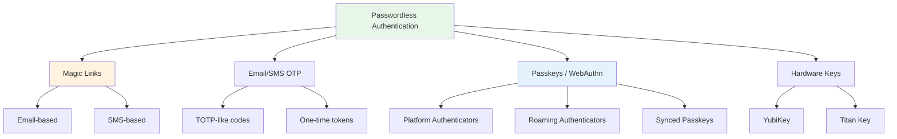
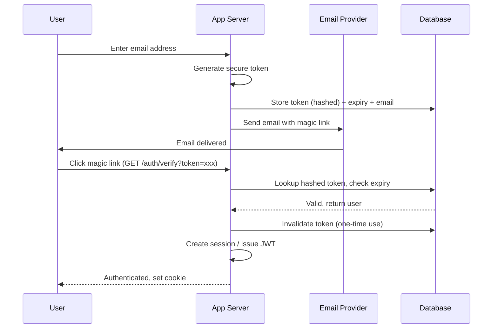
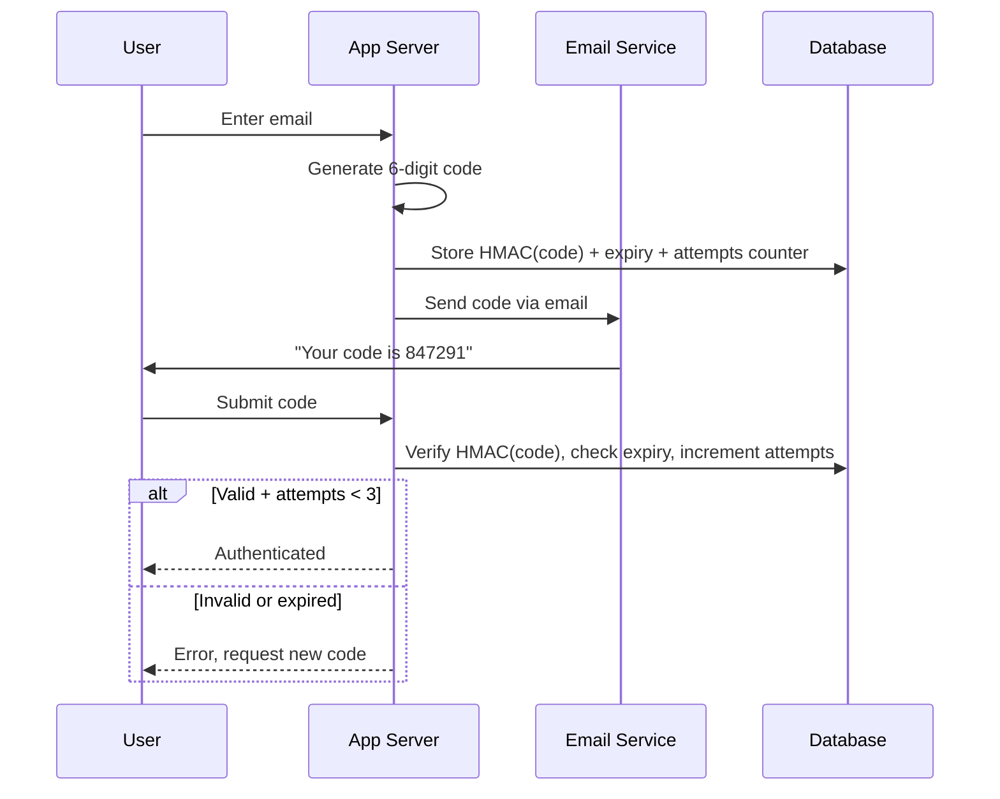
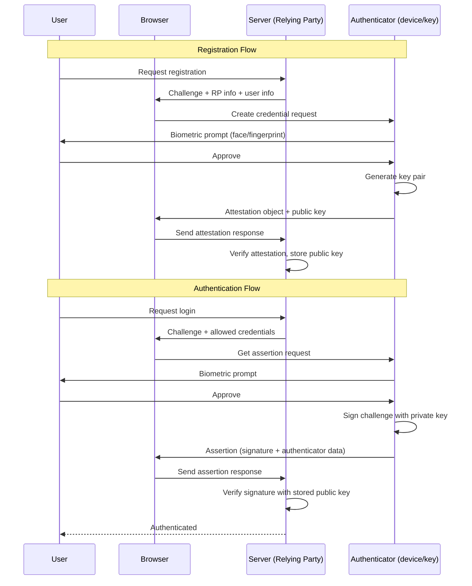
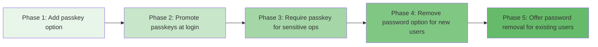

# Passwordless Authentication

## Why Passwordless Exists

Passwords are the weakest link in security. Over 80% of data breaches involve compromised credentials. Users reuse passwords across services, choose weak ones, and fall for phishing attacks. The entire password ecosystem — resets, complexity policies, rotation requirements — creates friction that actually undermines security.

Passwordless authentication eliminates the shared secret entirely. Instead of "something you know" (a password), it relies on "something you have" (a device, an email account) or "something you are" (biometrics). This removes the largest attack surface in most applications.

### Historical Context

The passwordless movement gained serious momentum when:

- **2013**: FIDO Alliance formed by PayPal, Lenovo, and others
- **2018**: WebAuthn became a W3C Candidate Recommendation
- **2019**: W3C promoted WebAuthn to official web standard
- **2022**: Apple, Google, Microsoft committed to passkey support across all platforms
- **2023**: Passkeys became widely available on iOS 16, Android 14, Windows 11
- **2024–2025**: Major services (GitHub, Google, Microsoft) made passkeys the default option

## First Principles

### The Authentication Triad

Authentication factors fall into three categories:

| Factor | Type | Examples | Weakness |
|--------|------|----------|----------|
| Knowledge | Something you know | Password, PIN, security question | Phishable, reusable, forgettable |
| Possession | Something you have | Phone, hardware key, email access | Can be stolen, but harder to scale attacks |
| Inherence | Something you are | Fingerprint, face, iris | Cannot be changed if compromised |

Passwordless combines possession and inherence factors, skipping knowledge entirely. This is actually *stronger* than passwords alone because:

1. **No shared secret** — nothing stored server-side that can be stolen in a breach
2. **Phishing resistant** — possession-based factors are bound to origin
3. **No credential reuse** — each service gets unique cryptographic keys

### The Core Cryptographic Model

Every passwordless method ultimately relies on **asymmetric cryptography**:

$$
\text{Auth} = \text{Sign}(SK_{\text{user}}, \text{challenge}) \xrightarrow{\text{verify}} \text{Verify}(PK_{\text{user}}, \text{signature})
$$

The server stores only the public key. The private key never leaves the user's device. Even if the server is completely breached, attackers cannot impersonate users.

## Core Mechanics

### Passwordless Method Taxonomy



### Magic Links — Deep Dive

Magic links send a one-time, time-limited URL to the user's email. Clicking the link authenticates them.



#### Token Security Requirements

The magic link token must satisfy these properties:

1. **Cryptographically random**: At least 256 bits of entropy
2. **One-time use**: Consumed on first verification
3. **Time-limited**: Expires within 10–15 minutes
4. **Hashed in storage**: Never store the raw token in the database
5. **Origin-bound**: Validate that the token was requested from the same device/IP when possible

### Email OTP — Deep Dive

Email OTP sends a short numeric code (typically 6–8 digits) instead of a link. This is better for mobile users who may be checking email on a different device.



### Passkeys — Deep Dive

Passkeys are the future of passwordless auth. They use the WebAuthn protocol to create and verify public-key credentials bound to a specific origin.



## Implementation

### Magic Link Implementation (TypeScript)

```typescript
import crypto from 'node:crypto';
import { Redis } from 'ioredis';
import { Resend } from 'resend';

interface MagicLinkConfig {
  expiryMinutes: number;
  maxAttempts: number;
  cooldownSeconds: number;
  baseUrl: string;
}

interface StoredToken {
  hashedToken: string;
  email: string;
  expiresAt: number;
  attempts: number;
  ipAddress: string;
  userAgent: string;
}

class MagicLinkService {
  private redis: Redis;
  private resend: Resend;
  private config: MagicLinkConfig;

  constructor(redis: Redis, resend: Resend, config: MagicLinkConfig) {
    this.redis = redis;
    this.resend = resend;
    this.config = config;
  }

  /**
   * Generate a magic link and send it to the user's email.
   * Returns true if sent, false if rate-limited.
   */
  async sendMagicLink(
    email: string,
    ipAddress: string,
    userAgent: string
  ): Promise<{ sent: boolean; retryAfter?: number }> {
    const normalizedEmail = email.toLowerCase().trim();

    // Rate limiting: check cooldown per email
    const cooldownKey = `magic:cooldown:${normalizedEmail}`;
    const ttl = await this.redis.ttl(cooldownKey);
    if (ttl > 0) {
      return { sent: false, retryAfter: ttl };
    }

    // Rate limiting: max attempts per IP per hour
    const ipKey = `magic:ip:${ipAddress}`;
    const ipCount = await this.redis.incr(ipKey);
    if (ipCount === 1) {
      await this.redis.expire(ipKey, 3600);
    }
    if (ipCount > 10) {
      return { sent: false, retryAfter: 3600 };
    }

    // Generate cryptographically secure token (32 bytes = 256 bits)
    const token = crypto.randomBytes(32).toString('base64url');

    // Hash the token for storage (never store raw tokens)
    const hashedToken = crypto
      .createHash('sha256')
      .update(token)
      .digest('hex');

    const stored: StoredToken = {
      hashedToken,
      email: normalizedEmail,
      expiresAt: Date.now() + this.config.expiryMinutes * 60 * 1000,
      attempts: 0,
      ipAddress,
      userAgent,
    };

    // Store with automatic expiry
    const storageKey = `magic:token:${hashedToken}`;
    await this.redis.set(
      storageKey,
      JSON.stringify(stored),
      'EX',
      this.config.expiryMinutes * 60
    );

    // Set cooldown to prevent spam
    await this.redis.set(cooldownKey, '1', 'EX', this.config.cooldownSeconds);

    // Build the magic link URL
    const magicLink = `${this.config.baseUrl}/auth/verify?token=${token}`;

    // Send the email
    await this.resend.emails.send({
      from: 'auth@yourapp.com',
      to: normalizedEmail,
      subject: 'Sign in to YourApp',
      html: this.buildEmailHtml(magicLink),
    });

    return { sent: true };
  }

  /**
   * Verify a magic link token. Returns the email if valid.
   */
  async verifyToken(
    token: string,
    ipAddress: string
  ): Promise<{ valid: boolean; email?: string; error?: string }> {
    // Hash the incoming token to look up in storage
    const hashedToken = crypto
      .createHash('sha256')
      .update(token)
      .digest('hex');

    const storageKey = `magic:token:${hashedToken}`;
    const raw = await this.redis.get(storageKey);

    if (!raw) {
      return { valid: false, error: 'Token not found or expired' };
    }

    const stored: StoredToken = JSON.parse(raw);

    // Check expiry
    if (Date.now() > stored.expiresAt) {
      await this.redis.del(storageKey);
      return { valid: false, error: 'Token expired' };
    }

    // Immediately delete the token (one-time use)
    await this.redis.del(storageKey);

    return { valid: true, email: stored.email };
  }

  private buildEmailHtml(link: string): string {
    return `
      <div style="font-family: sans-serif; max-width: 400px; margin: 0 auto;">
        <h2>Sign in to YourApp</h2>
        <p>Click the button below to sign in. This link expires in ${this.config.expiryMinutes} minutes.</p>
        <a href="${link}"
           style="display: inline-block; padding: 12px 24px;
                  background: #5f67ee; color: white;
                  text-decoration: none; border-radius: 6px;">
          Sign In
        </a>
        <p style="color: #666; font-size: 12px; margin-top: 16px;">
          If you didn't request this link, you can safely ignore this email.
        </p>
      </div>
    `;
  }
}
```

### Email OTP Implementation

```typescript
import crypto from 'node:crypto';
import { Redis } from 'ioredis';

interface OTPConfig {
  digits: number;
  expiryMinutes: number;
  maxAttempts: number;
  cooldownSeconds: number;
}

class EmailOTPService {
  private redis: Redis;
  private config: OTPConfig;

  constructor(redis: Redis, config: OTPConfig) {
    this.redis = redis;
    this.config = config;
  }

  /**
   * Generate and store an OTP for the given email.
   */
  async generateOTP(email: string): Promise<{ code: string; expiresIn: number }> {
    const normalizedEmail = email.toLowerCase().trim();

    // Generate a cryptographically random numeric code
    const code = this.generateSecureCode(this.config.digits);

    // HMAC the code for storage (don't store raw)
    const hmacKey = process.env.OTP_HMAC_SECRET!;
    const hashedCode = crypto
      .createHmac('sha256', hmacKey)
      .update(`${normalizedEmail}:${code}`)
      .digest('hex');

    const storageKey = `otp:${normalizedEmail}`;
    const data = {
      hashedCode,
      attempts: 0,
      createdAt: Date.now(),
    };

    await this.redis.set(
      storageKey,
      JSON.stringify(data),
      'EX',
      this.config.expiryMinutes * 60
    );

    return { code, expiresIn: this.config.expiryMinutes * 60 };
  }

  /**
   * Verify the OTP code submitted by the user.
   */
  async verifyOTP(
    email: string,
    code: string
  ): Promise<{ valid: boolean; error?: string; remainingAttempts?: number }> {
    const normalizedEmail = email.toLowerCase().trim();
    const storageKey = `otp:${normalizedEmail}`;
    const raw = await this.redis.get(storageKey);

    if (!raw) {
      return { valid: false, error: 'No active OTP. Please request a new one.' };
    }

    const data = JSON.parse(raw);

    // Check attempt limit
    if (data.attempts >= this.config.maxAttempts) {
      await this.redis.del(storageKey);
      return { valid: false, error: 'Too many attempts. Please request a new code.' };
    }

    // HMAC the submitted code
    const hmacKey = process.env.OTP_HMAC_SECRET!;
    const hashedSubmitted = crypto
      .createHmac('sha256', hmacKey)
      .update(`${normalizedEmail}:${code}`)
      .digest('hex');

    // Constant-time comparison to prevent timing attacks
    const isValid = crypto.timingSafeEqual(
      Buffer.from(hashedSubmitted, 'hex'),
      Buffer.from(data.hashedCode, 'hex')
    );

    if (!isValid) {
      data.attempts += 1;
      await this.redis.set(
        storageKey,
        JSON.stringify(data),
        'KEEPTTL'
      );
      return {
        valid: false,
        error: 'Invalid code',
        remainingAttempts: this.config.maxAttempts - data.attempts,
      };
    }

    // Valid — delete the OTP (one-time use)
    await this.redis.del(storageKey);
    return { valid: true };
  }

  /**
   * Generate a cryptographically secure numeric code.
   * Avoids modulo bias by rejection sampling.
   */
  private generateSecureCode(digits: number): string {
    const max = Math.pow(10, digits);
    const byteLength = Math.ceil(Math.log2(max) / 8) + 1;

    let code: number;
    do {
      const bytes = crypto.randomBytes(byteLength);
      code = bytes.readUIntBE(0, byteLength) % max;
    } while (code < Math.pow(10, digits - 1)); // Ensure correct digit count

    return code.toString();
  }
}
```

### Passkey Registration and Authentication (TypeScript + @simplewebauthn)

```typescript
import {
  generateRegistrationOptions,
  verifyRegistrationResponse,
  generateAuthenticationOptions,
  verifyAuthenticationResponse,
  type VerifiedRegistrationResponse,
  type VerifiedAuthenticationResponse,
} from '@simplewebauthn/server';
import type {
  RegistrationResponseJSON,
  AuthenticationResponseJSON,
  AuthenticatorTransportFuture,
} from '@simplewebauthn/types';

interface StoredCredential {
  credentialID: string;
  credentialPublicKey: Uint8Array;
  counter: number;
  transports?: AuthenticatorTransportFuture[];
  createdAt: Date;
  lastUsed: Date;
  deviceName?: string;
}

interface User {
  id: string;
  email: string;
  credentials: StoredCredential[];
}

const RP_NAME = 'YourApp';
const RP_ID = 'yourapp.com';
const ORIGIN = 'https://yourapp.com';

class PasskeyService {
  /**
   * Step 1: Generate registration options for the client.
   */
  async startRegistration(user: User): Promise<PublicKeyCredentialCreationOptionsJSON> {
    const options = await generateRegistrationOptions({
      rpName: RP_NAME,
      rpID: RP_ID,
      userID: new TextEncoder().encode(user.id),
      userName: user.email,
      userDisplayName: user.email.split('@')[0],
      // Discourage re-registering existing credentials
      excludeCredentials: user.credentials.map((cred) => ({
        id: cred.credentialID,
        transports: cred.transports,
      })),
      authenticatorSelection: {
        // Prefer platform authenticators (Touch ID, Face ID, Windows Hello)
        authenticatorAttachment: 'platform',
        // Require user verification (biometric or PIN)
        userVerification: 'required',
        // Create a discoverable credential (passkey)
        residentKey: 'required',
      },
      attestation: 'none', // We don't need attestation for most apps
    });

    // Store the challenge for verification (use Redis in production)
    await this.storeChallenge(user.id, options.challenge);

    return options;
  }

  /**
   * Step 2: Verify the registration response from the client.
   */
  async finishRegistration(
    user: User,
    response: RegistrationResponseJSON
  ): Promise<{ success: boolean; credential?: StoredCredential }> {
    const expectedChallenge = await this.getChallenge(user.id);

    let verification: VerifiedRegistrationResponse;
    try {
      verification = await verifyRegistrationResponse({
        response,
        expectedChallenge,
        expectedOrigin: ORIGIN,
        expectedRPID: RP_ID,
        requireUserVerification: true,
      });
    } catch (error) {
      console.error('Registration verification failed:', error);
      return { success: false };
    }

    if (!verification.verified || !verification.registrationInfo) {
      return { success: false };
    }

    const { credential } = verification.registrationInfo;

    const storedCredential: StoredCredential = {
      credentialID: credential.id,
      credentialPublicKey: credential.publicKey,
      counter: credential.counter,
      transports: response.response.transports as AuthenticatorTransportFuture[],
      createdAt: new Date(),
      lastUsed: new Date(),
    };

    return { success: true, credential: storedCredential };
  }

  /**
   * Step 3: Generate authentication options for the client.
   */
  async startAuthentication(
    email?: string
  ): Promise<PublicKeyCredentialRequestOptionsJSON> {
    const allowCredentials = email
      ? await this.getCredentialsForEmail(email)
      : []; // Empty = let the browser show all available passkeys

    const options = await generateAuthenticationOptions({
      rpID: RP_ID,
      userVerification: 'required',
      allowCredentials: allowCredentials.map((cred) => ({
        id: cred.credentialID,
        transports: cred.transports,
      })),
    });

    // Store challenge (keyed by session or email)
    const challengeKey = email ?? 'anonymous';
    await this.storeChallenge(challengeKey, options.challenge);

    return options;
  }

  /**
   * Step 4: Verify the authentication response.
   */
  async finishAuthentication(
    response: AuthenticationResponseJSON,
    challengeKey: string
  ): Promise<{ success: boolean; userId?: string }> {
    const expectedChallenge = await this.getChallenge(challengeKey);

    // Look up the credential
    const credential = await this.findCredentialById(response.id);
    if (!credential) {
      return { success: false };
    }

    const user = await this.findUserByCredentialId(response.id);
    if (!user) {
      return { success: false };
    }

    let verification: VerifiedAuthenticationResponse;
    try {
      verification = await verifyAuthenticationResponse({
        response,
        expectedChallenge,
        expectedOrigin: ORIGIN,
        expectedRPID: RP_ID,
        requireUserVerification: true,
        credential: {
          id: credential.credentialID,
          publicKey: credential.credentialPublicKey,
          counter: credential.counter,
          transports: credential.transports,
        },
      });
    } catch (error) {
      console.error('Authentication verification failed:', error);
      return { success: false };
    }

    if (!verification.verified) {
      return { success: false };
    }

    // Update the counter (replay protection)
    credential.counter = verification.authenticationInfo.newCounter;
    credential.lastUsed = new Date();
    await this.updateCredential(credential);

    return { success: true, userId: user.id };
  }

  // Storage methods (implement with your DB)
  private async storeChallenge(key: string, challenge: string): Promise<void> {
    // Redis: SET challenge:{key} {challenge} EX 300
    throw new Error('Implement with your storage layer');
  }

  private async getChallenge(key: string): Promise<string> {
    throw new Error('Implement with your storage layer');
  }

  private async getCredentialsForEmail(email: string): Promise<StoredCredential[]> {
    throw new Error('Implement with your storage layer');
  }

  private async findCredentialById(id: string): Promise<StoredCredential | null> {
    throw new Error('Implement with your storage layer');
  }

  private async findUserByCredentialId(id: string): Promise<User | null> {
    throw new Error('Implement with your storage layer');
  }

  private async updateCredential(credential: StoredCredential): Promise<void> {
    throw new Error('Implement with your storage layer');
  }
}
```

### Client-Side Passkey Integration

```typescript
import {
  startRegistration,
  startAuthentication,
} from '@simplewebauthn/browser';

async function registerPasskey(): Promise<boolean> {
  try {
    // Get registration options from the server
    const optionsRes = await fetch('/api/auth/passkey/register/start', {
      method: 'POST',
      credentials: 'include',
    });
    const options = await optionsRes.json();

    // This triggers the browser's WebAuthn prompt
    const credential = await startRegistration({ optionsJSON: options });

    // Send the credential back to the server for verification
    const verifyRes = await fetch('/api/auth/passkey/register/finish', {
      method: 'POST',
      headers: { 'Content-Type': 'application/json' },
      credentials: 'include',
      body: JSON.stringify(credential),
    });

    const result = await verifyRes.json();
    return result.success;
  } catch (error) {
    if ((error as Error).name === 'NotAllowedError') {
      console.log('User cancelled the registration');
    }
    return false;
  }
}

async function authenticateWithPasskey(): Promise<boolean> {
  try {
    const optionsRes = await fetch('/api/auth/passkey/login/start', {
      method: 'POST',
    });
    const options = await optionsRes.json();

    const assertion = await startAuthentication({ optionsJSON: options });

    const verifyRes = await fetch('/api/auth/passkey/login/finish', {
      method: 'POST',
      headers: { 'Content-Type': 'application/json' },
      body: JSON.stringify(assertion),
    });

    const result = await verifyRes.json();
    return result.success;
  } catch (error) {
    if ((error as Error).name === 'NotAllowedError') {
      console.log('User cancelled authentication');
    }
    return false;
  }
}
```

## Edge Cases & Failure Modes

### Magic Link Pitfalls

| Issue | Description | Mitigation |
|-------|-------------|------------|
| Email delays | Emails can take minutes to arrive | Show "check spam" hint, allow resend after cooldown |
| Link scanning | Email security scanners click links automatically | Use POST verification (not GET), or require a button click on a landing page |
| Token replay | Attacker intercepts email and uses the link | One-time use tokens, IP binding (optional), short expiry |
| Device mismatch | User clicks link on a different device | Use device fingerprinting or require code confirmation |
| Email hijacking | Attacker gains access to user's email | Combine with device trust, offer passkey upgrade |

### OTP Pitfalls

| Issue | Description | Mitigation |
|-------|-------------|------------|
| Brute force | 6-digit code has only 1M possibilities | Max 3 attempts, then invalidate |
| Timing attacks | Comparison leaks timing info | Use constant-time comparison |
| Code reuse | Same code used twice | Delete on first successful verification |
| Race conditions | Parallel verification requests | Use atomic Redis operations |

### Passkey Pitfalls

| Issue | Description | Mitigation |
|-------|-------------|------------|
| Counter desync | Authenticator counter doesn't match server | Allow small counter skips (clone detection) |
| Lost device | User loses their only authenticator | Require 2+ passkeys, offer recovery options |
| Platform support | Older browsers don't support WebAuthn | Progressive enhancement, fallback to magic links |
| Synced passkey revocation | User shares passkeys through iCloud/Google | Trust the platform's sync security model |

::: warning
Email-based magic links are **not phishing-resistant**. An attacker can create a fake login page, capture the user's email, trigger a magic link, and intercept it. Passkeys are the only truly phishing-resistant passwordless method because the credential is bound to the origin.
:::

## Performance Characteristics

### Latency Comparison

| Method | End-to-end Latency | Server Processing | Network Dependency |
|--------|-------------------|------------------|--------------------|
| Magic Link | 5–60 seconds (email delivery) | ~5ms token gen + ~3ms verify | Email provider |
| Email OTP | 5–60 seconds (email delivery) | ~2ms code gen + ~1ms verify | Email provider |
| SMS OTP | 5–30 seconds (SMS delivery) | ~2ms code gen + ~1ms verify | SMS gateway |
| Passkey | < 2 seconds (biometric) | ~10ms challenge gen + ~15ms verify | None (local) |

### Storage Requirements

| Method | Per-user Storage | Per-auth Storage |
|--------|-----------------|-----------------|
| Magic Link | 0 (stateless users) | ~200 bytes per pending token |
| Email OTP | 0 | ~100 bytes per pending code |
| Passkey | ~500 bytes per credential | ~100 bytes per pending challenge |

### Cryptographic Operation Costs

Passkey signature verification uses ECDSA P-256 or Ed25519:

$$
T_{\text{verify}} \approx 0.5\text{ms (ECDSA P-256)} \approx 0.1\text{ms (Ed25519)}
$$

Compare to password verification:

$$
T_{\text{bcrypt}} \approx 100\text{ms (cost factor 12)} \approx 250\text{ms (cost factor 14)}
$$

Passkeys are **200–2500x faster** to verify than passwords.

## Mathematical Foundations

### Token Entropy Analysis

A magic link token needs sufficient entropy to resist brute-force attacks:

$$
H = \log_2(N)
$$

where $N$ is the number of possible tokens. For a 32-byte random token:

$$
H = 32 \times 8 = 256 \text{ bits}
$$

The probability of guessing a valid token in $k$ attempts, given $m$ valid tokens in the system:

$$
P(\text{guess}) = 1 - \left(1 - \frac{m}{2^{256}}\right)^k \approx \frac{km}{2^{256}}
$$

Even with $m = 10^6$ active tokens and $k = 10^{12}$ guesses:

$$
P(\text{guess}) \approx \frac{10^{18}}{2^{256}} \approx 10^{-59}
$$

This is astronomically unlikely — more likely to win the lottery a billion times in a row.

### OTP Brute Force Mathematics

For a 6-digit OTP with 3 max attempts:

$$
P(\text{brute force}) = \frac{3}{10^6} = 3 \times 10^{-6} = 0.0003\%
$$

For an 8-digit OTP:

$$
P(\text{brute force}) = \frac{3}{10^8} = 3 \times 10^{-8} = 0.000003\%
$$

The expected number of valid accounts compromised per million targeted:

$$
E[\text{compromised}] = 10^6 \times 3 \times 10^{-6} = 3 \text{ accounts}
$$

This is why rate limiting and account lockout are critical even with OTPs.

### WebAuthn Challenge-Response Security

The WebAuthn security model relies on the hardness of ECDSA:

$$
\text{Given } (G, Q = dG), \text{ find } d
$$

This is the Elliptic Curve Discrete Logarithm Problem (ECDLP), which has no known polynomial-time algorithm:

$$
T_{\text{attack}} = O(\sqrt{n}) \text{ where } n = \text{order of the curve}
$$

For P-256: $n \approx 2^{256}$, so $T_{\text{attack}} \approx 2^{128}$ operations — beyond reach of any computer.

## Real-World War Stories

::: info War Story
**Slack's Magic Link Email Scanner Incident (2019)**

When Slack implemented magic links, they discovered that corporate email security scanners (like Microsoft Safe Links and Proofpoint) were automatically clicking every URL in incoming emails to check for malware. This consumed the one-time tokens before users could click them.

**Resolution**: Slack changed magic links to land on an intermediate page that required a *button click* to complete authentication, rather than authenticating on the GET request. The scanner would load the page but not click the button. They also implemented a 5-second grace period where the token wasn't consumed by the first request but was marked as "pending."
:::

::: info War Story
**GitHub Passkey Rollout (2023)**

GitHub's passkey rollout revealed an interesting edge case: users who registered passkeys on their work laptops got locked out on personal devices. The synced passkey ecosystem (iCloud Keychain, Google Password Manager) only syncs within its own platform — a passkey created on a Mac doesn't automatically appear on an Android phone.

**Resolution**: GitHub required users to register at least two passkeys and prominently displayed a recovery mechanism using SMS or email fallback. They also added cross-device authentication flows where users could scan a QR code with their phone to authenticate on a desktop.
:::

::: info War Story
**A Banking App's SMS OTP Race Condition**

A major bank discovered that their SMS OTP verification endpoint had a race condition. When users submitted the code, the verification and deletion weren't atomic. Attackers discovered they could replay the same OTP within a 50ms window by sending multiple verification requests simultaneously.

**Resolution**: The bank switched to Redis WATCH/MULTI/EXEC for atomic token consumption, ensuring the token could only be verified exactly once regardless of concurrent requests.
:::

## Decision Framework

### When to Use Each Method

| Factor | Magic Links | Email OTP | SMS OTP | Passkeys |
|--------|-------------|-----------|---------|----------|
| **Phishing resistance** | Low | Low | Low | **High** |
| **User friction** | Medium | Medium | Low | **Very Low** |
| **Setup complexity** | Low | Low | Medium | Medium |
| **Platform coverage** | Universal | Universal | Universal | ~90% modern browsers |
| **Cost per auth** | ~$0.001 | ~$0.001 | ~$0.01–0.05 | $0 (free) |
| **Offline support** | No | No | No | Yes (after setup) |
| **Best for** | Web apps | Mobile apps | Legacy/global | Modern apps |

### Migration Strategy: Passwords to Passwordless



::: tip
Never force-migrate users off passwords. Instead, make passwordless so convenient that users choose it voluntarily. GitHub saw 60% passkey adoption within 6 months of offering it as the default option.
:::

## Advanced Topics

### Conditional UI (Passkey Autofill)

Modern browsers support "conditional mediation" — passkeys appear in the browser's autofill dropdown alongside saved passwords:

```typescript
// Check if conditional UI is available
const isConditionalUIAvailable =
  typeof PublicKeyCredential !== 'undefined' &&
  typeof PublicKeyCredential.isConditionalMediationAvailable === 'function' &&
  (await PublicKeyCredential.isConditionalMediationAvailable());

if (isConditionalUIAvailable) {
  // Start authentication with conditional mediation
  const options = await fetch('/api/auth/passkey/conditional-start').then(r => r.json());

  const assertion = await navigator.credentials.get({
    publicKey: options,
    mediation: 'conditional', // Key: triggers autofill UI
    signal: abortController.signal,
  });

  // Send assertion to server for verification
  await verifyAssertion(assertion);
}
```

The HTML input must have `autocomplete="webauthn"`:

```html
<input
  type="text"
  id="email"
  autocomplete="username webauthn"
  placeholder="Email or passkey"
/>
```

### Cross-Device Authentication (Hybrid Transport)

When a user has a passkey on their phone but is logging in on a desktop:

1. Server generates a challenge
2. Desktop browser displays a QR code containing a BLE advertisement
3. User scans QR code with their phone
4. Phone authenticator signs the challenge via BLE/internet tunnel
5. Desktop receives the signed assertion

This is the FIDO2 "hybrid" transport, and it works across ecosystems (iPhone passkey on Windows PC).

### Account Recovery Without Passwords

The hardest problem in passwordless is recovery. If the user loses all their devices, how do they regain access?

| Recovery Method | Security Level | User Experience |
|----------------|---------------|-----------------|
| Recovery codes (printed) | High | Poor (users lose them) |
| Trusted contacts | Medium | Good (social recovery) |
| Email magic link | Low | Good (but circular dependency) |
| Identity verification (KYC) | High | Poor (slow, manual) |
| Account re-creation | Highest | Worst (data loss) |

The recommended approach is a **layered recovery strategy**:

1. Primary: Multiple passkeys on different devices
2. Secondary: Printed recovery codes stored securely
3. Tertiary: Trusted contact recovery (requires 2/3 contacts to approve)
4. Last resort: Identity verification with support team

### Passkey Attestation and Enterprise Use Cases

For enterprise environments that require device compliance:

```typescript
// Enterprise registration with attestation
const options = await generateRegistrationOptions({
  rpName: 'Enterprise App',
  rpID: 'internal.corp.com',
  attestation: 'enterprise', // Request enterprise attestation
  authenticatorSelection: {
    authenticatorAttachment: 'platform',
    userVerification: 'required',
    residentKey: 'required',
  },
});

// After registration, verify the attestation certificate chain
// to ensure the device is a managed corporate device
async function verifyEnterpriseAttestation(
  attestation: AttestationObject
): Promise<boolean> {
  const certChain = attestation.attStmt.x5c;
  // Verify the certificate chain against your enterprise CA
  // Verify the device is in your MDM inventory
  // Verify TPM attestation if available
  return verifyCertificateChain(certChain, enterpriseRootCA);
}
```

### The Future: Verifiable Credentials and Decentralized Identity

Passwordless authentication is converging with decentralized identity:

- **W3C Verifiable Credentials**: Cryptographically signed claims about identity
- **DID (Decentralized Identifiers)**: Self-sovereign identity without central authority
- **Selective Disclosure**: Prove you're over 18 without revealing your birthdate

These technologies build on the same public-key cryptography that powers passkeys, extending it from "authenticate this user" to "prove claims about this user" — all without passwords.

## Cross-References

- [JWT Deep Dive](/security/authentication/jwt-deep-dive) — Token-based sessions after passwordless auth
- [Session Management](/security/authentication/session-management) — Managing sessions post-authentication
- [WebAuthn / Biometric Auth](/security/authentication/biometric-auth) — Detailed WebAuthn API coverage
- [Symmetric vs Asymmetric Encryption](/security/encryption/symmetric-vs-asymmetric) — Cryptographic foundations
- [CORS Deep Dive](/security/api-security/cors-deep-dive) — Origin policies that affect WebAuthn
