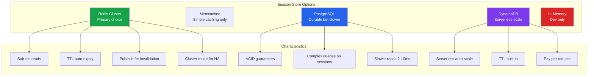
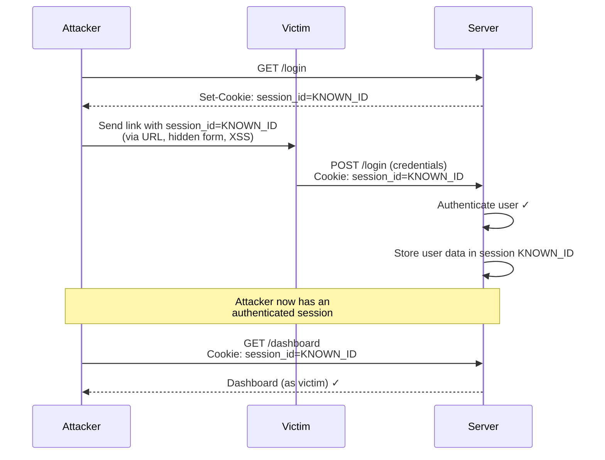
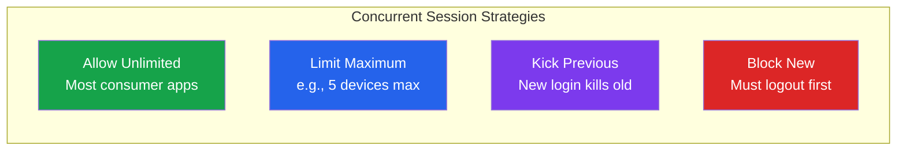

# Session Management Deep Dive

Sessions are the bridge between stateless HTTP and stateful user experiences. Every time a user logs in, a session is created. Every time they click a link, that session is validated. Get sessions wrong and you get account takeovers, data leaks, and compliance violations. This page covers every dimension of production session management — from storage backends to concurrent session control to the exact cookie attributes that prevent theft.

## Server-Side Session Architecture

### Session Storage Options



### Comparison Matrix

| Store | Read Latency | Write Latency | Durability | Max Sessions | Cost Model | Best For |
|-------|-------------|---------------|------------|-------------|------------|----------|
| **Redis Cluster** | <1ms | <1ms | AOF + RDB | Millions | Memory-based | Most production apps |
| **PostgreSQL** | 2-10ms | 5-20ms | Full ACID | Millions | Disk + CPU | Audit-heavy compliance apps |
| **DynamoDB** | 1-5ms | 5-10ms | Multi-AZ replicated | Unlimited | Per-request | Serverless architectures |
| **Memcached** | <1ms | <1ms | None (eviction) | Limited by memory | Memory-based | Read-heavy, loss-tolerant |
| **In-Memory** | <0.1ms | <0.1ms | None (lost on restart) | Server RAM | Free | Development only |

::: danger Never Use In-Memory Sessions in Production
In-memory sessions are lost on server restart, cannot be shared across instances, and break horizontal scaling. One server restart logs out all users. Use Redis at minimum.
:::

### Redis Session Implementation

```typescript
import Redis from 'ioredis';
import { randomBytes, createHash } from 'crypto';

const redis = new Redis.Cluster([
  { host: 'redis-1.example.com', port: 6379 },
  { host: 'redis-2.example.com', port: 6379 },
  { host: 'redis-3.example.com', port: 6379 },
]);

interface SessionData {
  userId: string;
  roles: string[];
  tenantId: string;
  createdAt: number;
  lastActiveAt: number;
  ip: string;
  userAgent: string;
  deviceId: string;
  mfaVerified: boolean;
}

const SESSION_TTL = 86400; // 24 hours absolute max
const IDLE_TIMEOUT = 1800; // 30 minutes idle

// Generate cryptographically secure session ID
function generateSessionId(): string {
  return randomBytes(32).toString('base64url'); // 256-bit entropy
}

// Hash session ID before storing (defense-in-depth)
function hashSessionId(sessionId: string): string {
  return createHash('sha256').update(sessionId).digest('hex');
}

async function createSession(data: SessionData): Promise<string> {
  const sessionId = generateSessionId();
  const hashedId = hashSessionId(sessionId);

  const sessionKey = `session:${hashedId}`;
  const userSessionsKey = `user_sessions:${data.userId}`;

  const pipeline = redis.pipeline();

  // Store session data
  pipeline.hset(sessionKey, {
    ...data,
    roles: JSON.stringify(data.roles),
    createdAt: Date.now(),
    lastActiveAt: Date.now(),
  });
  pipeline.expire(sessionKey, SESSION_TTL);

  // Track session in user's session set
  pipeline.sadd(userSessionsKey, hashedId);
  pipeline.expire(userSessionsKey, SESSION_TTL);

  await pipeline.exec();

  return sessionId; // Return unhashed ID to client
}

async function validateSession(
  sessionId: string
): Promise<SessionData | null> {
  const hashedId = hashSessionId(sessionId);
  const sessionKey = `session:${hashedId}`;

  const data = await redis.hgetall(sessionKey);
  if (!data || !data.userId) {
    return null;
  }

  // Check idle timeout
  const lastActive = parseInt(data.lastActiveAt, 10);
  if (Date.now() - lastActive > IDLE_TIMEOUT * 1000) {
    await destroySession(sessionId);
    return null;
  }

  // Sliding expiration — extend on activity
  const pipeline = redis.pipeline();
  pipeline.hset(sessionKey, 'lastActiveAt', Date.now().toString());
  pipeline.expire(sessionKey, SESSION_TTL); // Reset absolute TTL
  await pipeline.exec();

  return {
    ...data,
    roles: JSON.parse(data.roles),
    createdAt: parseInt(data.createdAt, 10),
    lastActiveAt: Date.now(),
    mfaVerified: data.mfaVerified === 'true',
  } as SessionData;
}

async function destroySession(sessionId: string): Promise<void> {
  const hashedId = hashSessionId(sessionId);
  const sessionKey = `session:${hashedId}`;

  const userId = await redis.hget(sessionKey, 'userId');
  if (userId) {
    await redis.srem(`user_sessions:${userId}`, hashedId);
  }
  await redis.del(sessionKey);
}
```

## Session Fixation Prevention

Session fixation attacks occur when an attacker sets a victim's session ID before authentication. After the victim logs in, the attacker uses the pre-set session ID to hijack the authenticated session.



### Prevention: Regenerate Session ID on Authentication

```typescript
async function handleLogin(req: Request, res: Response): Promise<void> {
  const { email, password } = req.body;

  const user = await authenticateUser(email, password);
  if (!user) {
    res.status(401).json({ error: 'Invalid credentials' });
    return;
  }

  // CRITICAL: Destroy old session and create new one
  if (req.sessionId) {
    await destroySession(req.sessionId);
  }

  const newSessionId = await createSession({
    userId: user.id,
    roles: user.roles,
    tenantId: user.tenantId,
    createdAt: Date.now(),
    lastActiveAt: Date.now(),
    ip: req.ip,
    userAgent: req.headers['user-agent'] || '',
    deviceId: req.body.deviceId || 'unknown',
    mfaVerified: false,
  });

  // Set new session cookie
  res.cookie('__Host-session', newSessionId, {
    httpOnly: true,
    secure: true,
    sameSite: 'lax',
    maxAge: SESSION_TTL * 1000,
    path: '/',
  });

  res.json({ success: true, mfaRequired: user.mfaEnabled });
}
```

::: danger Always Regenerate on Privilege Change
Regenerate the session ID on every privilege elevation: login, MFA verification, role change, password change. Any event that changes what the session can access should get a new session ID.
:::

## Session Hijacking Prevention

Session hijacking is the exploitation of a valid session to gain unauthorized access. Attackers steal session IDs through XSS, network sniffing, malware, or physical access.

### Defense Layers

| Defense | Attack Prevented | Implementation |
|---------|-----------------|----------------|
| **HttpOnly cookies** | XSS-based token theft | `Set-Cookie: HttpOnly` |
| **Secure flag** | Network sniffing (HTTP) | `Set-Cookie: Secure` |
| **SameSite attribute** | CSRF, cross-site leakage | `Set-Cookie: SameSite=Lax` |
| **Session binding to IP** | Session theft across networks | Validate IP on each request |
| **Session binding to UA** | Naive session theft | Validate User-Agent on each request |
| **Short idle timeout** | Unattended terminal | 15-30 min idle expiry |
| **Re-auth for sensitive ops** | Stolen active session | Require password for profile changes |

### IP and User-Agent Binding

```typescript
async function validateSessionContext(
  session: SessionData,
  req: Request
): Promise<{ valid: boolean; reason?: string }> {
  // Strict IP binding — may cause issues with mobile users
  // changing networks. Use subnet matching for mobile.
  if (session.ip !== req.ip) {
    // For mobile: compare /24 subnet instead
    const sessionSubnet = session.ip.split('.').slice(0, 3).join('.');
    const requestSubnet = req.ip.split('.').slice(0, 3).join('.');

    if (sessionSubnet !== requestSubnet) {
      return {
        valid: false,
        reason: `IP changed from ${session.ip} to ${req.ip}`,
      };
    }
  }

  // User-Agent binding — catch crude session theft
  if (session.userAgent !== req.headers['user-agent']) {
    return {
      valid: false,
      reason: 'User-Agent mismatch',
    };
  }

  return { valid: true };
}
```

::: warning IP Binding Trade-offs
Strict IP binding breaks sessions for users on mobile networks (IP changes between cell towers), VPN users, and corporate proxies with rotating egress IPs. Use subnet-level matching or skip IP binding for mobile clients and use device fingerprinting instead.
:::

## Sliding Expiration vs Absolute Expiration

Two different timeout strategies serve different security goals.

### Sliding Expiration

The session timer resets on every request. An active user never times out.

```
Login at 10:00 → Session expires at 10:30 (30-min window)
Request at 10:15 → Session expires at 10:45 (reset)
Request at 10:40 → Session expires at 11:10 (reset)
No requests → Session expires at 11:10
```

**Risk:** A compromised session that remains active never expires. An attacker can keep a hijacked session alive indefinitely.

### Absolute Expiration

The session has a hard deadline regardless of activity.

```
Login at 10:00 → Session expires at 18:00 (8-hour absolute)
Request at 14:00 → Session still expires at 18:00
Request at 17:59 → Session still expires at 18:00
```

**Risk:** Users get logged out during active work, causing frustration and data loss.

### The Correct Pattern: Both

```typescript
const SESSION_CONFIG = {
  idleTimeout: 30 * 60,      // 30 minutes of inactivity
  absoluteTimeout: 8 * 60 * 60, // 8 hours max, no matter what
  renewalWindow: 5 * 60,      // Warn user 5 minutes before expiry
};

async function checkSessionExpiry(session: SessionData): Promise<{
  valid: boolean;
  warningMinutes?: number;
}> {
  const now = Date.now();
  const idleMs = now - session.lastActiveAt;
  const totalMs = now - session.createdAt;

  // Absolute expiration — hard stop
  if (totalMs > SESSION_CONFIG.absoluteTimeout * 1000) {
    return { valid: false };
  }

  // Idle expiration
  if (idleMs > SESSION_CONFIG.idleTimeout * 1000) {
    return { valid: false };
  }

  // Warn before absolute expiry
  const remainingAbsolute = SESSION_CONFIG.absoluteTimeout * 1000 - totalMs;
  if (remainingAbsolute < SESSION_CONFIG.renewalWindow * 1000) {
    return {
      valid: true,
      warningMinutes: Math.ceil(remainingAbsolute / 60000),
    };
  }

  return { valid: true };
}
```

::: tip Industry Patterns
| Application Type | Idle Timeout | Absolute Timeout |
|-----------------|-------------|-----------------|
| Banking / Financial | 5-15 minutes | 30 minutes |
| Enterprise SaaS | 30-60 minutes | 8-12 hours |
| Consumer social media | 7-30 days | 90 days |
| E-commerce | 24 hours | 30 days |
| Healthcare (HIPAA) | 15 minutes | 8 hours |
:::

## Concurrent Session Control

Controlling how many sessions a user can have simultaneously is both a security and a business concern.

### Strategies



### Implementation: Maximum Session Limit

```typescript
const MAX_SESSIONS_PER_USER = 5;

async function enforceSessionLimit(
  userId: string,
  newSessionHashedId: string
): Promise<void> {
  const userSessionsKey = `user_sessions:${userId}`;
  const sessionIds = await redis.smembers(userSessionsKey);

  // Remove stale entries (sessions that expired from Redis)
  const activeSessions: string[] = [];
  for (const sid of sessionIds) {
    const exists = await redis.exists(`session:${sid}`);
    if (exists) {
      activeSessions.push(sid);
    } else {
      await redis.srem(userSessionsKey, sid);
    }
  }

  if (activeSessions.length >= MAX_SESSIONS_PER_USER) {
    // Find oldest session and terminate it
    let oldestId = activeSessions[0];
    let oldestTime = Infinity;

    for (const sid of activeSessions) {
      const createdAt = await redis.hget(`session:${sid}`, 'createdAt');
      if (createdAt && parseInt(createdAt) < oldestTime) {
        oldestTime = parseInt(createdAt);
        oldestId = sid;
      }
    }

    // Terminate oldest session
    await redis.del(`session:${oldestId}`);
    await redis.srem(userSessionsKey, oldestId);

    // Optionally notify the user
    await notifySessionTerminated(userId, oldestId);
  }
}
```

## Cross-Device Session Management

Users expect to see and manage their active sessions across all devices. This requires a session registry.

### User Session Dashboard Data

```typescript
interface SessionListItem {
  sessionId: string; // Partial, for display only
  device: string;
  browser: string;
  location: string;
  lastActive: string;
  current: boolean;
}

async function getUserSessions(
  userId: string,
  currentSessionHash: string
): Promise<SessionListItem[]> {
  const userSessionsKey = `user_sessions:${userId}`;
  const sessionIds = await redis.smembers(userSessionsKey);

  const sessions: SessionListItem[] = [];

  for (const hashedId of sessionIds) {
    const data = await redis.hgetall(`session:${hashedId}`);
    if (!data.userId) continue;

    sessions.push({
      sessionId: hashedId.slice(0, 8) + '...', // Partial for UI
      device: parseDevice(data.userAgent),
      browser: parseBrowser(data.userAgent),
      location: await geolocate(data.ip),
      lastActive: formatRelativeTime(parseInt(data.lastActiveAt)),
      current: hashedId === currentSessionHash,
    });
  }

  return sessions.sort((a, b) =>
    a.current ? -1 : b.current ? 1 : 0
  );
}

// Terminate all sessions except current
async function logoutEverywhere(
  userId: string,
  keepSessionHash: string
): Promise<number> {
  const userSessionsKey = `user_sessions:${userId}`;
  const sessionIds = await redis.smembers(userSessionsKey);

  let terminated = 0;
  for (const hashedId of sessionIds) {
    if (hashedId !== keepSessionHash) {
      await redis.del(`session:${hashedId}`);
      await redis.srem(userSessionsKey, hashedId);
      terminated++;
    }
  }

  return terminated;
}
```

## Session Storage Scaling Patterns

### Redis Cluster Sizing

```
Formula: Memory = (avg_session_size_bytes × max_concurrent_sessions) × 1.5

Example:
  Session size: ~500 bytes (typical)
  Concurrent sessions: 1,000,000
  Memory: 500 × 1,000,000 × 1.5 = 750 MB

  With overhead (Redis data structures): ~1.2 GB
  With replication factor 2: ~2.4 GB
```

### Sharding Strategy

For extreme scale (tens of millions of sessions), shard by user ID hash:

```typescript
function getRedisNode(userId: string): Redis {
  const hash = createHash('md5').update(userId).digest();
  const shard = hash.readUInt32BE(0) % SHARD_COUNT;
  return redisShards[shard];
}
```

## Secure Cookie Configuration

Every attribute in the `Set-Cookie` header serves a specific security purpose. Misconfiguring any one creates a vulnerability.

### The Perfect Cookie

```http
Set-Cookie: __Host-session=abc123def456;
  HttpOnly;
  Secure;
  SameSite=Lax;
  Path=/;
  Max-Age=86400
```

### Attribute Reference

| Attribute | Value | Purpose | Without It |
|-----------|-------|---------|------------|
| `HttpOnly` | (flag) | JavaScript cannot read the cookie | XSS can steal session via `document.cookie` |
| `Secure` | (flag) | Cookie only sent over HTTPS | Sent over HTTP, visible to network sniffers |
| `SameSite=Lax` | Lax/Strict/None | Controls cross-site sending | CSRF attacks can use the session |
| `Path=/` | / | Cookie sent for all paths | Scoping issues with subpaths |
| `Max-Age` | seconds | Cookie expiry | Session cookie (deleted when browser closes) |
| `__Host-` prefix | (name prefix) | Forces Secure, Path=/, no Domain | Cookie can be set by subdomains |

### SameSite Deep Dive

| Value | Cross-site GET | Cross-site POST | Cross-site iframe | Use Case |
|-------|---------------|-----------------|-------------------|----------|
| **Strict** | Blocked | Blocked | Blocked | Banking — maximum security |
| **Lax** | Sent | Blocked | Blocked | Default — good balance |
| **None** | Sent | Sent | Sent | Third-party embeds (requires Secure) |

::: tip Use `__Host-` Prefix
The `__Host-` prefix (e.g., `__Host-session`) enforces that the cookie was set with `Secure`, has `Path=/`, and has no `Domain` attribute. This prevents a compromised subdomain from overwriting the session cookie. It is the most restrictive and secure cookie configuration available.
:::

### Express.js Secure Cookie Setup

```typescript
import express from 'express';

const app = express();

// Trust proxy if behind a load balancer
app.set('trust proxy', 1);

app.use((req, res, next) => {
  // Set cookie utility with secure defaults
  res.setSessionCookie = (sessionId: string) => {
    res.cookie('__Host-session', sessionId, {
      httpOnly: true,       // No JavaScript access
      secure: true,         // HTTPS only
      sameSite: 'lax',      // CSRF protection
      path: '/',            // Required for __Host- prefix
      maxAge: 86400 * 1000, // 24 hours in milliseconds
      // No 'domain' — required for __Host- prefix
    });
  };
  next();
});
```

## Session Events and Audit Logging

Every session lifecycle event should be logged for security monitoring and compliance.

```typescript
type SessionEvent =
  | 'session_created'
  | 'session_validated'
  | 'session_refreshed'
  | 'session_idle_timeout'
  | 'session_absolute_timeout'
  | 'session_destroyed_by_user'
  | 'session_destroyed_by_admin'
  | 'session_destroyed_concurrent_limit'
  | 'session_fixation_prevented'
  | 'session_hijack_detected';

async function logSessionEvent(
  event: SessionEvent,
  context: {
    sessionId: string; // hashed
    userId: string;
    ip: string;
    userAgent: string;
    metadata?: Record<string, unknown>;
  }
): Promise<void> {
  await auditLog.write({
    timestamp: new Date().toISOString(),
    event,
    ...context,
    // NEVER log the raw session ID
    sessionId: context.sessionId.slice(0, 8) + '...',
  });
}
```

## Further Reading

- [Session Management](./session-management.md) — Foundational session management concepts
- [Token Strategies Deep Dive](./token-strategies.md) — When to use sessions vs tokens
- [Auth Attacks & Defenses](./auth-attack-defense.md) — Session hijacking and CSRF prevention
- [Account Sharing Prevention](./account-sharing-prevention.md) — Concurrent session enforcement for license compliance
- [CORS Deep Dive](/security/api-security/cors-deep-dive.md) — Cookie behavior in cross-origin requests
- [GDPR Engineering](/security/compliance/gdpr-engineering.md) — Session data retention and right to erasure
