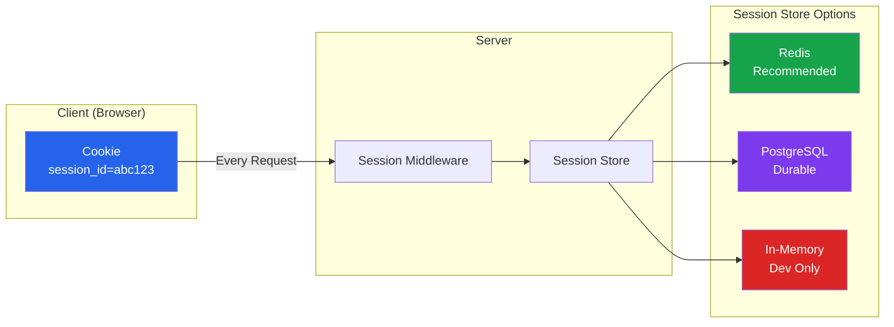
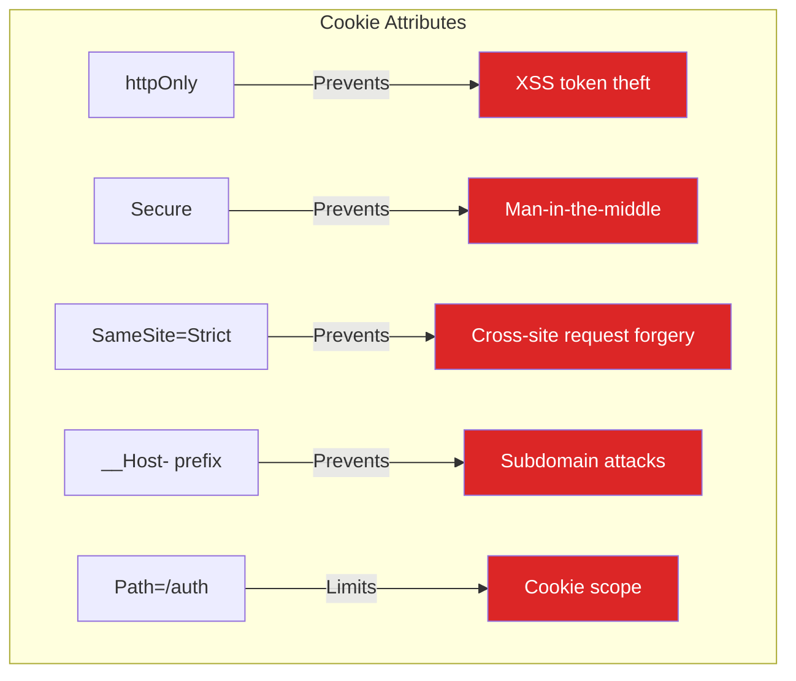
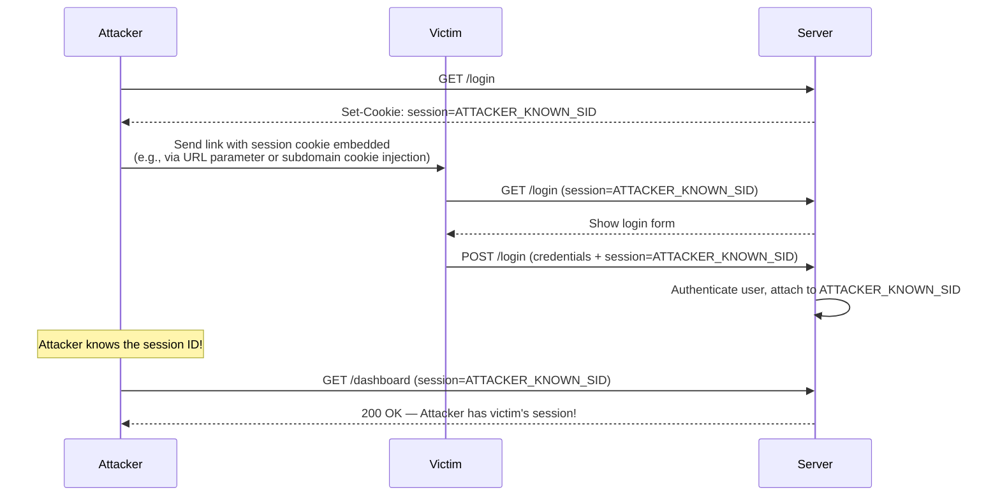
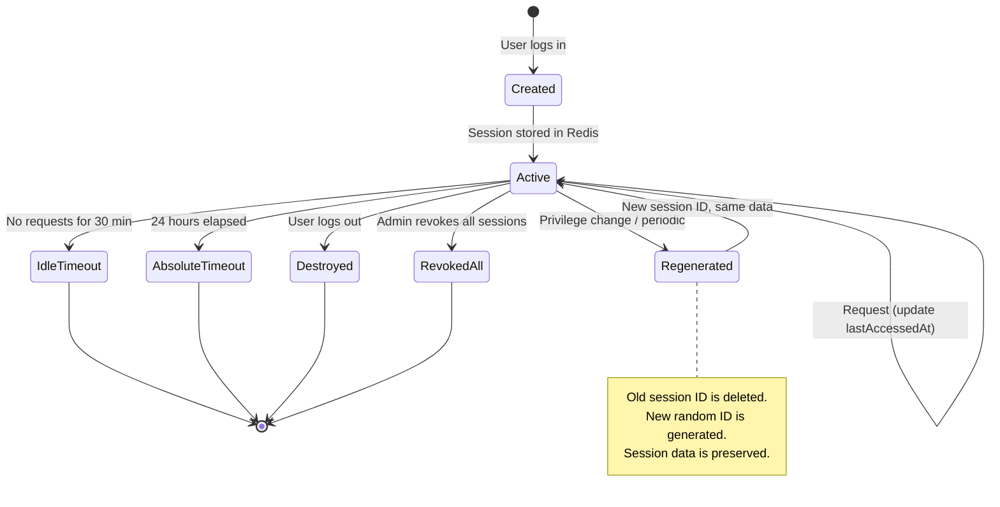

# Session Management

Sessions are the mechanism by which a server remembers who you are across multiple HTTP requests. HTTP is stateless — every request is independent. Sessions bridge that gap by associating a random identifier (the session ID) with server-side state. While JWTs push state to the client, sessions keep state on the server, giving you instant revocation, smaller cookies, and no information leakage.

## Session Architecture



## Why Server-Side Sessions

| Aspect | Server-Side Sessions | JWTs |
|--------|---------------------|------|
| Revocation | Instant (delete from store) | Complex (blocklist needed) |
| Size | Small cookie (~32 bytes) | Large (~1-2 KB per request) |
| Server state | Required (Redis/DB) | Not required |
| Information leakage | None (opaque ID) | Claims visible in base64 |
| Cross-service | Requires shared store | Self-contained |
| Scalability | Needs centralized store | Stateless |

::: tip When to Use Sessions
Server-side sessions are the right choice when you have a monolithic application, need instant revocation (e.g., "log out all devices"), or want to avoid the complexity of JWT blocklists. They are also simpler to implement correctly.
:::

## Session ID Generation

The session ID must be cryptographically random and sufficiently long to prevent brute-force guessing.

```typescript
import crypto from 'crypto';

// ─── Secure Session ID Generation ────────────────────────────

function generateSessionId(): string {
  // 32 bytes = 256 bits of entropy — brute-force infeasible
  return crypto.randomBytes(32).toString('hex');
}

// BAD: Predictable session IDs
function badSessionId(): string {
  return `session_${Date.now()}`; // Predictable — attacker can guess
}

function alsobadSessionId(): string {
  return `session_${Math.random()}`; // Math.random() is not cryptographically secure
}

// Session ID requirements:
// - At least 128 bits (16 bytes) of entropy (OWASP recommends 256 bits)
// - Generated with a CSPRNG (crypto.randomBytes, not Math.random)
// - URL-safe characters (hex or base64url encoding)
// - No embedded information (no user ID, timestamp, etc.)
```

## Redis-Backed Session Store

```typescript
import { Redis } from 'ioredis';
import { Request, Response, NextFunction } from 'express';

// ─── Session Data Types ──────────────────────────────────────

interface SessionData {
  userId: string;
  role: string;
  orgId?: string;
  permissions: string[];
  createdAt: number;
  lastAccessedAt: number;
  expiresAt: number;
  ipAddress: string;
  userAgent: string;
  csrfToken: string;
  metadata?: Record<string, unknown>;
}

interface SessionConfig {
  prefix: string;
  defaultTTL: number;       // seconds
  absoluteTimeout: number;  // seconds — max session lifetime
  idleTimeout: number;      // seconds — inactivity timeout
  renewThreshold: number;   // seconds — regenerate ID when this old
  cookieName: string;
  cookieDomain?: string;
  cookiePath: string;
  secure: boolean;
  sameSite: 'strict' | 'lax' | 'none';
}

const DEFAULT_CONFIG: SessionConfig = {
  prefix: 'sess:',
  defaultTTL: 3600,           // 1 hour
  absoluteTimeout: 86400,     // 24 hours
  idleTimeout: 1800,          // 30 minutes
  renewThreshold: 300,        // 5 minutes
  cookieName: '__Host-session',
  cookiePath: '/',
  secure: true,
  sameSite: 'strict',
};

// ─── Session Store ────────────────────────────────────────────

class RedisSessionStore {
  private redis: Redis;
  private config: SessionConfig;

  constructor(redis: Redis, config: Partial<SessionConfig> = {}) {
    this.redis = redis;
    this.config = { ...DEFAULT_CONFIG, ...config };
  }

  private key(sessionId: string): string {
    return `${this.config.prefix}${sessionId}`;
  }

  private userSessionsKey(userId: string): string {
    return `user_sessions:${userId}`;
  }

  // Create a new session
  async create(
    data: Omit<SessionData, 'createdAt' | 'lastAccessedAt' | 'expiresAt' | 'csrfToken'>
  ): Promise<{ sessionId: string; csrfToken: string }> {
    const sessionId = generateSessionId();
    const csrfToken = crypto.randomBytes(32).toString('hex');
    const now = Date.now();

    const session: SessionData = {
      ...data,
      createdAt: now,
      lastAccessedAt: now,
      expiresAt: now + this.config.absoluteTimeout * 1000,
      csrfToken,
    };

    const pipeline = this.redis.pipeline();

    // Store session data
    pipeline.setex(
      this.key(sessionId),
      this.config.defaultTTL,
      JSON.stringify(session)
    );

    // Track user's active sessions (for "list all sessions" feature)
    pipeline.sadd(this.userSessionsKey(data.userId), sessionId);

    await pipeline.exec();

    return { sessionId, csrfToken };
  }

  // Retrieve and validate a session
  async get(sessionId: string): Promise<SessionData | null> {
    const raw = await this.redis.get(this.key(sessionId));
    if (!raw) return null;

    const session: SessionData = JSON.parse(raw);
    const now = Date.now();

    // Check absolute timeout
    if (now > session.expiresAt) {
      await this.destroy(sessionId, session.userId);
      return null;
    }

    // Check idle timeout
    if (now - session.lastAccessedAt > this.config.idleTimeout * 1000) {
      await this.destroy(sessionId, session.userId);
      return null;
    }

    // Update last accessed time (sliding window)
    session.lastAccessedAt = now;
    await this.redis.setex(
      this.key(sessionId),
      this.config.defaultTTL,
      JSON.stringify(session)
    );

    return session;
  }

  // Regenerate session ID (prevents session fixation)
  async regenerate(
    oldSessionId: string,
    preserveData: boolean = true
  ): Promise<string> {
    const session = await this.get(oldSessionId);
    if (!session) {
      throw new Error('Session not found');
    }

    const newSessionId = generateSessionId();
    const pipeline = this.redis.pipeline();

    if (preserveData) {
      // Copy data to new session ID
      pipeline.setex(
        this.key(newSessionId),
        this.config.defaultTTL,
        JSON.stringify(session)
      );
    }

    // Delete old session
    pipeline.del(this.key(oldSessionId));

    // Update user sessions set
    pipeline.srem(this.userSessionsKey(session.userId), oldSessionId);
    pipeline.sadd(this.userSessionsKey(session.userId), newSessionId);

    await pipeline.exec();

    return newSessionId;
  }

  // Destroy a specific session
  async destroy(sessionId: string, userId?: string): Promise<void> {
    if (userId) {
      await this.redis.srem(this.userSessionsKey(userId), sessionId);
    }
    await this.redis.del(this.key(sessionId));
  }

  // Destroy ALL sessions for a user (logout everywhere)
  async destroyAllForUser(userId: string): Promise<number> {
    const sessionIds = await this.redis.smembers(this.userSessionsKey(userId));

    if (sessionIds.length === 0) return 0;

    const pipeline = this.redis.pipeline();
    for (const sid of sessionIds) {
      pipeline.del(this.key(sid));
    }
    pipeline.del(this.userSessionsKey(userId));

    await pipeline.exec();
    return sessionIds.length;
  }

  // List all active sessions for a user
  async listUserSessions(userId: string): Promise<Array<{
    sessionId: string;
    ipAddress: string;
    userAgent: string;
    createdAt: number;
    lastAccessedAt: number;
    current: boolean;
  }>> {
    const sessionIds = await this.redis.smembers(this.userSessionsKey(userId));
    const sessions: Array<any> = [];

    for (const sid of sessionIds) {
      const raw = await this.redis.get(this.key(sid));
      if (raw) {
        const session: SessionData = JSON.parse(raw);
        sessions.push({
          sessionId: sid,
          ipAddress: session.ipAddress,
          userAgent: session.userAgent,
          createdAt: session.createdAt,
          lastAccessedAt: session.lastAccessedAt,
          current: false, // Caller sets this based on current session
        });
      } else {
        // Session expired — clean up the set
        await this.redis.srem(this.userSessionsKey(userId), sid);
      }
    }

    return sessions;
  }
}
```

## Secure Cookie Configuration

```typescript
import { CookieOptions } from 'express';

// ─── Cookie Security Settings ────────────────────────────────

function getSessionCookieOptions(config: SessionConfig): CookieOptions {
  return {
    httpOnly: true,       // JavaScript cannot access the cookie (XSS protection)
    secure: true,         // Only sent over HTTPS
    sameSite: 'strict',   // Not sent with cross-site requests (CSRF protection)
    path: '/',            // Available to all paths
    maxAge: config.defaultTTL * 1000, // Browser-side expiry
    // When using __Host- prefix, domain must NOT be set
    // __Host- prefix requires: secure=true, path=/
  };
}

// ─── Cookie Prefixes ──────────────────────────────────────────

// __Host-session — Most restrictive, recommended
// Requirements: Secure=true, Path=/, no Domain attribute
// Effect: Cookie is bound to the exact host, cannot be set by subdomains

// __Secure-session — Less restrictive
// Requirements: Secure=true
// Effect: Cookie only sent over HTTPS

// Avoid: session (no prefix) — no browser-enforced requirements
```



::: danger Never Set httpOnly to False for Session Cookies
If JavaScript can read the session cookie, any XSS vulnerability becomes a session hijacking vulnerability. There is no legitimate reason for client-side JavaScript to access the session identifier.
:::

## Session Fixation Prevention

Session fixation occurs when an attacker can set a known session ID for a victim. The victim authenticates, and the attacker uses the pre-set session ID to access the victim's account.



### Prevention: Regenerate Session ID on Authentication

```typescript
// ─── Session Middleware ──────────────────────────────────────

function sessionMiddleware(store: RedisSessionStore, config: SessionConfig) {
  return async (req: Request, res: Response, next: NextFunction) => {
    const sessionId = req.cookies[config.cookieName];

    if (sessionId) {
      const session = await store.get(sessionId);
      if (session) {
        (req as any).session = session;
        (req as any).sessionId = sessionId;
      }
    }

    next();
  };
}

// ─── Login Handler with Session Fixation Prevention ──────────

app.post('/auth/login', async (req: Request, res: Response) => {
  const { email, password } = req.body;

  const user = await authenticateUser(email, password);
  if (!user) {
    return res.status(401).json({ error: 'Invalid credentials' });
  }

  // CRITICAL: If a session already exists, destroy it BEFORE creating a new one
  const existingSessionId = req.cookies[config.cookieName];
  if (existingSessionId) {
    await store.destroy(existingSessionId);
  }

  // Create a brand new session with a new ID
  const { sessionId, csrfToken } = await store.create({
    userId: user.id,
    role: user.role,
    permissions: user.permissions,
    ipAddress: req.ip!,
    userAgent: req.get('user-agent') || 'unknown',
  });

  // Set the new session cookie
  res.cookie(config.cookieName, sessionId, getSessionCookieOptions(config));

  // Return CSRF token (stored in session, validated on state-changing requests)
  res.json({
    csrfToken,
    user: { id: user.id, name: user.name, role: user.role },
  });
});
```

## CSRF Protection with Sessions

```typescript
// ─── CSRF Middleware ─────────────────────────────────────────

function csrfProtection(store: RedisSessionStore, config: SessionConfig) {
  return async (req: Request, res: Response, next: NextFunction) => {
    // Skip for safe methods
    if (['GET', 'HEAD', 'OPTIONS'].includes(req.method)) {
      return next();
    }

    const session = (req as any).session as SessionData | undefined;
    if (!session) {
      return res.status(403).json({ error: 'No session' });
    }

    // Check CSRF token from header
    const csrfToken = req.headers['x-csrf-token'] as string;
    if (!csrfToken) {
      return res.status(403).json({ error: 'Missing CSRF token' });
    }

    // Constant-time comparison to prevent timing attacks
    const expected = Buffer.from(session.csrfToken);
    const received = Buffer.from(csrfToken);

    if (expected.length !== received.length || !crypto.timingSafeEqual(expected, received)) {
      return res.status(403).json({ error: 'Invalid CSRF token' });
    }

    next();
  };
}
```

## Concurrent Session Control

```typescript
// ─── Limit Active Sessions Per User ──────────────────────────

class SessionController {
  private store: RedisSessionStore;
  private maxSessionsPerUser: number;

  constructor(store: RedisSessionStore, maxSessions: number = 5) {
    this.store = store;
    this.maxSessionsPerUser = maxSessions;
  }

  async createSession(
    userId: string,
    data: Omit<SessionData, 'createdAt' | 'lastAccessedAt' | 'expiresAt' | 'csrfToken'>
  ): Promise<{ sessionId: string; csrfToken: string; evicted: string[] }> {
    const activeSessions = await this.store.listUserSessions(userId);
    const evicted: string[] = [];

    // If at the limit, evict the oldest session(s)
    if (activeSessions.length >= this.maxSessionsPerUser) {
      const sorted = activeSessions.sort(
        (a, b) => a.lastAccessedAt - b.lastAccessedAt
      );
      const toEvict = sorted.slice(
        0,
        activeSessions.length - this.maxSessionsPerUser + 1
      );

      for (const session of toEvict) {
        await this.store.destroy(session.sessionId, userId);
        evicted.push(session.sessionId);
      }
    }

    const result = await this.store.create(data);
    return { ...result, evicted };
  }
}
```

## Session Lifecycle



## Complete Express.js Integration

```typescript
import express from 'express';
import cookieParser from 'cookie-parser';
import { Redis } from 'ioredis';

const app = express();
const redis = new Redis();

app.use(express.json());
app.use(cookieParser());

const config = DEFAULT_CONFIG;
const store = new RedisSessionStore(redis, config);
const controller = new SessionController(store, 5);

// Apply session middleware to all routes
app.use(sessionMiddleware(store, config));

// ─── Login ───────────────────────────────────────────────────

app.post('/auth/login', async (req, res) => {
  const { email, password, mfaCode } = req.body;

  const user = await authenticateUser(email, password);
  if (!user) {
    // Deliberately vague error message
    return res.status(401).json({ error: 'Invalid credentials' });
  }

  // Check MFA if enabled
  if (user.mfaEnabled) {
    if (!mfaCode || !verifyTOTP(user.mfaSecret, mfaCode)) {
      return res.status(401).json({ error: 'Invalid MFA code' });
    }
  }

  // Destroy existing session (session fixation prevention)
  const existingSessionId = req.cookies[config.cookieName];
  if (existingSessionId) {
    await store.destroy(existingSessionId, user.id);
  }

  // Create new session with concurrent session control
  const { sessionId, csrfToken, evicted } = await controller.createSession(
    user.id,
    {
      userId: user.id,
      role: user.role,
      permissions: user.permissions,
      ipAddress: req.ip!,
      userAgent: req.get('user-agent') || 'unknown',
    }
  );

  if (evicted.length > 0) {
    console.log(`Evicted ${evicted.length} old sessions for user ${user.id}`);
  }

  res.cookie(config.cookieName, sessionId, getSessionCookieOptions(config));

  res.json({
    csrfToken,
    user: { id: user.id, name: user.name, role: user.role },
  });
});

// ─── Logout (Current Session) ────────────────────────────────

app.post('/auth/logout', csrfProtection(store, config), async (req, res) => {
  const sessionId = (req as any).sessionId;
  const session = (req as any).session;

  if (sessionId && session) {
    await store.destroy(sessionId, session.userId);
  }

  res.clearCookie(config.cookieName, { path: '/' });
  res.json({ message: 'Logged out' });
});

// ─── Logout (All Sessions) ──────────────────────────────────

app.post('/auth/logout-all', csrfProtection(store, config), async (req, res) => {
  const session = (req as any).session;
  if (!session) {
    return res.status(401).json({ error: 'Not authenticated' });
  }

  const count = await store.destroyAllForUser(session.userId);

  res.clearCookie(config.cookieName, { path: '/' });
  res.json({ message: `Logged out from ${count} sessions` });
});

// ─── List Active Sessions ────────────────────────────────────

app.get('/auth/sessions', async (req, res) => {
  const session = (req as any).session;
  const currentSessionId = (req as any).sessionId;

  if (!session) {
    return res.status(401).json({ error: 'Not authenticated' });
  }

  const sessions = await store.listUserSessions(session.userId);

  // Mark the current session
  const formatted = sessions.map(s => ({
    ...s,
    current: s.sessionId === currentSessionId,
    sessionId: undefined, // Don't expose session IDs to the client
  }));

  res.json({ sessions: formatted });
});

// ─── Revoke Specific Session ─────────────────────────────────

app.delete('/auth/sessions/:index', csrfProtection(store, config), async (req, res) => {
  const session = (req as any).session;
  if (!session) {
    return res.status(401).json({ error: 'Not authenticated' });
  }

  const sessions = await store.listUserSessions(session.userId);
  const index = parseInt(req.params.index, 10);

  if (index < 0 || index >= sessions.length) {
    return res.status(404).json({ error: 'Session not found' });
  }

  const target = sessions[index];
  await store.destroy(target.sessionId, session.userId);

  res.json({ message: 'Session revoked' });
});

// ─── Protected Route ─────────────────────────────────────────

app.get('/api/profile', async (req, res) => {
  const session = (req as any).session;
  if (!session) {
    return res.status(401).json({ error: 'Not authenticated' });
  }

  res.json({
    userId: session.userId,
    role: session.role,
    loginTime: new Date(session.createdAt).toISOString(),
  });
});
```

## Session Security Comparison

```mermaid
graph TB
    subgraph "Insecure Session"
        I1[Predictable session ID] --> I2[No regeneration on login]
        I2 --> I3[Cookie without httpOnly]
        I3 --> I4[No idle timeout]
        I4 --> I5[Session in URL parameter]
    end

    subgraph "Secure Session"
        S1[256-bit random ID] --> S2[Regenerate on auth state change]
        S2 --> S3[httpOnly + Secure + SameSite]
        S3 --> S4[Idle + absolute timeouts]
        S4 --> S5[CSRF token in session]
        S5 --> S6[Concurrent session limits]
    end

    style I1 fill:#dc2626,color:#fff
    style I5 fill:#dc2626,color:#fff
    style S1 fill:#16a34a,color:#fff
    style S6 fill:#16a34a,color:#fff
```



## Security Checklist

- [ ] Generate session IDs with crypto.randomBytes (256 bits minimum)
- [ ] Use Redis or a database as the session store (never in-memory for production)
- [ ] Set httpOnly, Secure, SameSite=Strict on session cookies
- [ ] Use `__Host-` cookie prefix for maximum browser protection
- [ ] Regenerate session ID after authentication (session fixation prevention)
- [ ] Regenerate session ID after privilege changes (e.g., role elevation)
- [ ] Implement idle timeout (30 minutes) and absolute timeout (24 hours)
- [ ] Implement CSRF protection with a per-session CSRF token
- [ ] Limit concurrent sessions per user (e.g., max 5)
- [ ] Provide "log out all devices" functionality
- [ ] Log session creation, destruction, and suspicious activity
- [ ] Never put session IDs in URLs or log files
- [ ] Use constant-time comparison for CSRF token validation
