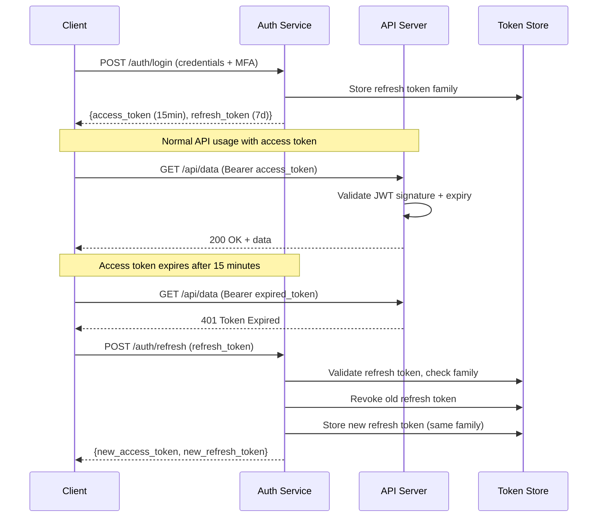
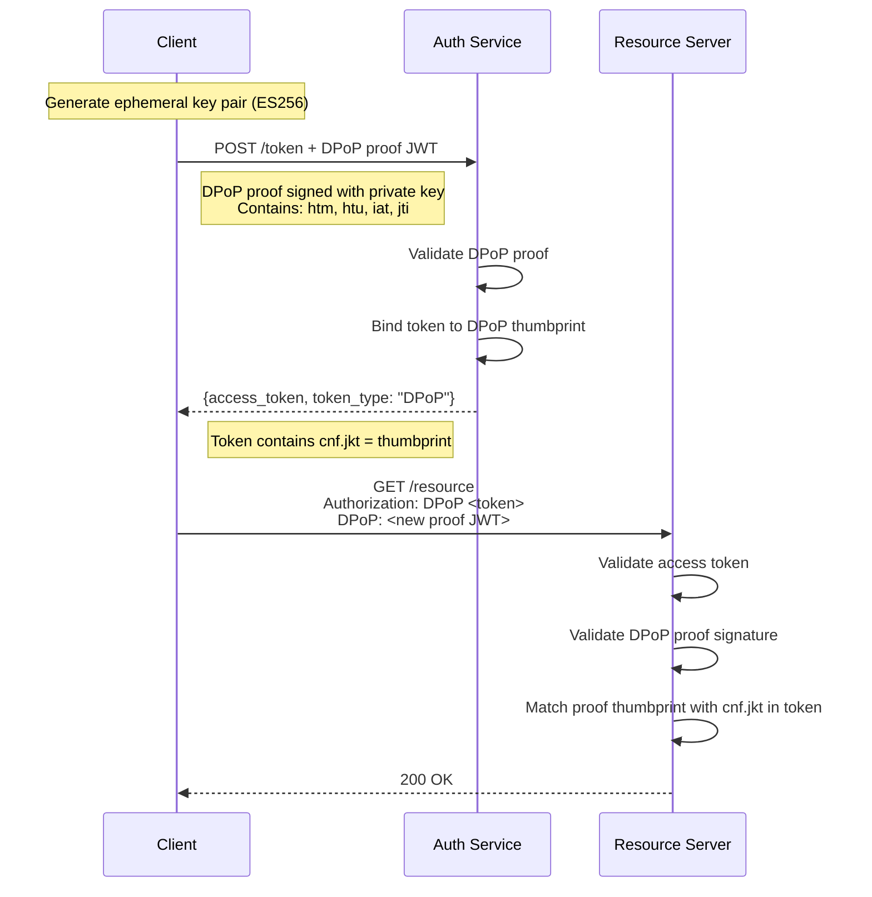

# Token Strategies Deep Dive

Choosing a token format is one of the most consequential decisions in authentication architecture. The format determines your revocation capabilities, scalability ceiling, debuggability, and attack surface. This page compares every production-viable token strategy, from JWTs to bleeding-edge Biscuit tokens, with concrete trade-offs that matter at scale.

## Token Format Comparison

### JWT (JSON Web Token)

JWTs are self-contained tokens that carry claims in a signed (or encrypted) JSON payload. They are the dominant format in modern web applications.

```json
{
  "header": { "alg": "ES256", "kid": "key-2026-03", "typ": "JWT" },
  "payload": {
    "sub": "user_abc123",
    "iss": "https://auth.example.com",
    "aud": "https://api.example.com",
    "exp": 1711000900,
    "iat": 1711000000,
    "roles": ["admin", "billing"],
    "tid": "tenant_xyz"
  },
  "signature": "MEUCIQDf..."
}
```

**Strengths:** Stateless validation, no database lookup, standardized (RFC 7519), widely supported.

**Weaknesses:** Cannot be revoked without a blocklist, claims are readable (not encrypted by default), size grows with claims, vulnerable to algorithm confusion attacks if not hardened.

### Opaque Tokens

Opaque tokens are random strings with no inherent structure. All metadata lives server-side.

```
access_token: "kat_v1_a3f8e2c1d4b5a6f7e8c9d0a1b2c3d4e5"
```

The server maps this to a session record:

```json
{
  "token_hash": "sha256:a3f8e2...",
  "user_id": "user_abc123",
  "scopes": ["read", "write"],
  "created_at": "2026-03-20T10:00:00Z",
  "expires_at": "2026-03-20T10:15:00Z",
  "revoked": false
}
```

**Strengths:** Instant revocation (delete the record), no information leakage, small token size, no cryptographic attack surface.

**Weaknesses:** Every validation requires a database/cache lookup, does not scale as easily across regions, coupling between services and token store.

### Macaroons

Macaroons are bearer tokens with a unique property: they can be attenuated (restricted) by anyone who holds them, without contacting the issuer. Developed by Google Research.

```
identifier: "user_abc123"
location: "https://auth.example.com"
caveats:
  - "time < 2026-03-20T10:15:00Z"     (first-party caveat)
  - "ip = 203.0.113.42"                (first-party caveat)
  - "account.balance > 0 @ billing.example.com"  (third-party caveat)
signature: HMAC chain
```

**Strengths:** Caveat-based attenuation (delegate with reduced permissions), efficient HMAC chain verification, third-party caveats for distributed authorization.

**Weaknesses:** No standard library ecosystem (limited adoption), complex mental model, hard to debug, no widely adopted RFC.

### Biscuit Tokens

Biscuit is a modern token format that combines Datalog-based authorization logic with offline attenuation and public-key cryptography. Created by Clever Cloud.

```
// Biscuit token authority block
authority {
  user("user_abc123");
  role("admin");
  tenant("tenant_xyz");

  // Attenuation: token holder can add restrictions
  check if time($t), $t < 2026-03-20T10:15:00Z;
  check if resource($r), operation($op),
    right($r, $op);
}

// Attenuated block (added by API gateway)
block {
  check if resource($r), $r.starts_with("/api/v2/");
  check if operation("read");
}
```

**Strengths:** Public-key crypto (no shared secrets), offline attenuation, Datalog authorization policies embedded in token, revocation by public key.

**Weaknesses:** Young ecosystem, limited library support, larger token size, learning curve for Datalog.

### Comparison Matrix

| Property | JWT | Opaque | Macaroons | Biscuit |
|----------|-----|--------|-----------|---------|
| **Validation** | Stateless (signature) | Stateful (DB lookup) | Stateless (HMAC chain) | Stateless (public key) |
| **Revocation** | Blocklist needed | Delete record | Caveat expiration | Revocation ID |
| **Attenuation** | Not possible | Not possible | Yes (caveats) | Yes (Datalog blocks) |
| **Information leakage** | Claims visible (unless JWE) | None | Caveats visible | Policy visible |
| **Token size** | 500B-2KB | 32-64 bytes | 200B-1KB | 500B-3KB |
| **Crypto** | RSA/ECDSA/EdDSA | None (random) | HMAC chain | Ed25519 |
| **Standardization** | RFC 7519 | N/A | Research paper | Specification |
| **Library ecosystem** | Excellent | Trivial to implement | Limited | Growing |
| **Best for** | API auth, microservices | Simple apps, sessions | Distributed delegation | Policy-rich authorization |

## Access Token + Refresh Token Rotation

The access-refresh pattern is the industry standard for balancing security with user experience. Short-lived access tokens limit the damage window; long-lived refresh tokens maintain sessions without re-authentication.



### Refresh Token Rotation

Every time a refresh token is used, it is revoked and a new one is issued. This is called **rotation**. If an attacker steals a refresh token and the legitimate user uses it first, the attacker's token is invalid. If the attacker uses it first, the legitimate user's next refresh attempt reveals the theft.

```typescript
// Refresh token rotation with family tracking
interface RefreshTokenRecord {
  tokenHash: string;
  familyId: string;     // Groups all rotated tokens
  userId: string;
  used: boolean;
  createdAt: Date;
  expiresAt: Date;
}

async function rotateRefreshToken(oldToken: string): Promise<TokenPair> {
  const tokenHash = hashToken(oldToken);
  const record = await db.refreshTokens.findByHash(tokenHash);

  if (!record) {
    throw new AuthError('Invalid refresh token');
  }

  if (record.used) {
    // Reuse detected — entire family is compromised
    await db.refreshTokens.revokeFamily(record.familyId);
    await auditLog.critical('refresh_token_reuse', {
      userId: record.userId,
      familyId: record.familyId,
    });
    throw new AuthError('Token reuse detected — all sessions revoked');
  }

  if (record.expiresAt < new Date()) {
    throw new AuthError('Refresh token expired');
  }

  // Mark old token as used
  await db.refreshTokens.markUsed(tokenHash);

  // Issue new pair with same family
  const newRefreshToken = generateSecureToken();
  await db.refreshTokens.create({
    tokenHash: hashToken(newRefreshToken),
    familyId: record.familyId,
    userId: record.userId,
    used: false,
    createdAt: new Date(),
    expiresAt: addDays(new Date(), 7),
  });

  const accessToken = await issueAccessToken(record.userId);

  return { accessToken, refreshToken: newRefreshToken };
}
```

::: danger Reuse Detection is Critical
If a refresh token is used twice, it means either the token was stolen or there is a race condition. In either case, revoke the entire token family. This is the mechanism that makes refresh token theft detectable.
:::

## Token Binding (DPoP)

Demonstrating Proof of Possession (DPoP, RFC 9449) binds tokens to a specific client by requiring the client to prove it holds a private key. Even if an attacker steals the access token, they cannot use it without the corresponding private key.



### DPoP Implementation

```typescript
// Client-side: generate DPoP proof
import { generateKeyPair, SignJWT, exportJWK } from 'jose';
import { createHash, randomUUID } from 'crypto';

// Generate ephemeral key pair (once per session)
const { publicKey, privateKey } = await generateKeyPair('ES256');
const publicJwk = await exportJWK(publicKey);

async function createDPoPProof(
  method: string,
  url: string,
  accessToken?: string
): Promise<string> {
  const builder = new SignJWT({
    htm: method,                    // HTTP method
    htu: url,                       // HTTP URL
    iat: Math.floor(Date.now() / 1000),
    jti: randomUUID(),
    ...(accessToken && {
      ath: createHash('sha256')     // Access token hash
        .update(accessToken)
        .digest('base64url'),
    }),
  })
    .setProtectedHeader({
      alg: 'ES256',
      typ: 'dpop+jwt',
      jwk: publicJwk,              // Public key in header
    });

  return builder.sign(privateKey);
}

// Usage: token request with DPoP
const dpopProof = await createDPoPProof('POST', 'https://auth.example.com/token');
const response = await fetch('https://auth.example.com/token', {
  method: 'POST',
  headers: {
    'Content-Type': 'application/x-www-form-urlencoded',
    'DPoP': dpopProof,
  },
  body: new URLSearchParams({
    grant_type: 'authorization_code',
    code: authorizationCode,
    // ... other params
  }),
});
```

::: tip When to Use DPoP
DPoP is most valuable for public clients (SPAs, mobile apps) where you cannot securely store a client secret. It prevents token theft from being useful even if an attacker extracts the access token from memory or network traffic.
:::

## Token Revocation Strategies

The fundamental challenge: how do you invalidate a stateless token?

### Strategy 1: Short-Lived Tokens Only

Issue access tokens with a 5-15 minute TTL. Never revoke them — just wait for expiry.

```
Pros: Zero infrastructure, truly stateless
Cons: 5-15 minute window where revoked tokens still work
Best for: Low-risk APIs, internal microservices
```

### Strategy 2: Blocklist (Deny List)

Maintain a set of revoked token IDs (JTI claims) in Redis. Check on every request.

```typescript
// Redis blocklist check
async function isTokenRevoked(jti: string): Promise<boolean> {
  const revoked = await redis.get(`revoked:${jti}`);
  return revoked !== null;
}

async function revokeToken(jti: string, expiresIn: number): Promise<void> {
  // Set TTL to match token expiry — auto-cleanup
  await redis.setex(`revoked:${jti}`, expiresIn, '1');
}
```

```
Pros: Near-instant revocation, simple implementation
Cons: Every request requires a Redis lookup, Redis becomes critical path
Best for: Most production systems
```

### Strategy 3: Token Families

Group all tokens from a single login session into a family. Revoke the entire family at once.

```
Pros: Logout revokes all tokens from that session, detects refresh token reuse
Cons: Requires family tracking in the database
Best for: Systems with refresh token rotation
```

### Strategy 4: Versioned Tokens

Store a `tokenVersion` counter on the user record. Include the version in the JWT. If the JWT version is less than the current user version, reject it.

```typescript
// Versioned token validation
async function validateTokenVersion(
  userId: string,
  tokenVersion: number
): Promise<boolean> {
  const user = await db.users.findById(userId);
  return user.tokenVersion === tokenVersion;
}

// To revoke all tokens for a user:
await db.users.incrementTokenVersion(userId);
```

```
Pros: Revoke all user tokens with one DB update, no blocklist infrastructure
Cons: Requires a DB lookup per request (partially stateful)
Best for: "Logout everywhere" functionality
```

### Revocation Strategy Comparison

| Strategy | Revocation Speed | Infrastructure | Statelessness | Granularity |
|----------|-----------------|----------------|---------------|-------------|
| Short-lived only | Up to TTL | None | Fully stateless | None (wait for expiry) |
| Blocklist | Instant | Redis | Partially stateful | Per-token |
| Token families | Instant | Database | Stateful | Per-session |
| Versioned tokens | Instant | Database | Partially stateful | Per-user (all tokens) |
| Combined (short + blocklist) | Instant for critical, TTL for routine | Redis | Mostly stateless | Flexible |

## Stateless vs Stateful Tokens — The Real Trade-offs

This is one of the most debated topics in auth engineering. The truth is nuanced.

### The Stateless Fantasy

Fully stateless JWTs sound perfect: no database, infinite scale, validate anywhere. In practice, you almost always need *some* state:

- **Revocation** requires a blocklist (state)
- **Refresh tokens** require a token store (state)
- **Rate limiting** requires counters (state)
- **Concurrent session control** requires session tracking (state)
- **Audit logging** requires a log store (state)

::: warning The Honest Truth
"Stateless JWTs" in production are really "mostly-stateless JWTs with a Redis blocklist." Pure statelessness means accepting that you cannot revoke a token until it expires. Few production systems can tolerate that.
:::

### When Stateless Wins

| Scenario | Why Stateless Works |
|----------|-------------------|
| Microservice-to-microservice calls | Services trust the gateway; short-lived tokens; no user session to revoke |
| CDN/edge validation | Cannot call a central database from 200+ edge nodes at low latency |
| High-throughput read APIs | Eliminating a Redis call saves 1-5ms per request, which matters at 100K+ RPS |

### When Stateful Wins

| Scenario | Why Stateful Works |
|----------|-------------------|
| Financial applications | Must revoke access instantly on fraud detection |
| Healthcare / compliance | Audit trail requires knowing exactly which sessions are active |
| Consumer apps with "logout everywhere" | Users expect immediate session termination |
| Admin panels | Compromised admin tokens must be revocable in seconds |

## Token Size Optimization

Large tokens increase bandwidth, slow mobile apps on poor connections, and can exceed cookie size limits (4KB) or header size limits (8KB in many servers).

### Strategies

| Technique | Size Reduction | Trade-off |
|-----------|---------------|-----------|
| Remove unnecessary claims | 20-40% | Less information in token |
| Use short claim names (`r` instead of `roles`) | 10-20% | Less readable |
| Use integer role IDs instead of strings | 15-25% | Requires mapping table |
| Use ES256 instead of RS256 | ~50% smaller signature | Slightly slower verification |
| Move large claims to a userinfo endpoint | 60-80% | Extra API call needed |
| Use opaque tokens + introspection | 95% smaller | Fully stateful |

### Size Comparison

```
RS256 JWT with typical claims:     ~800 bytes
ES256 JWT with typical claims:     ~500 bytes
ES256 JWT with minimal claims:     ~300 bytes
EdDSA JWT with minimal claims:     ~280 bytes
Opaque token:                       ~44 bytes
```

::: tip Rule of Thumb
If your JWT exceeds 1KB, you are putting too much in it. Move large data (permissions lists, feature flags) to a userinfo or permissions endpoint that the client calls once and caches.
:::

## Further Reading

- [JWT Deep Dive](./jwt-deep-dive.md) — Internal structure, signing algorithms, and `jose` library usage
- [Auth System Architecture](./auth-architecture.md) — Where tokens fit in the overall auth system
- [OAuth 2.0 Flows](./oauth2-flows.md) — Token issuance via OAuth flows
- [Session Deep Dive](./session-deep-dive.md) — When stateful sessions beat tokens
- [Auth Attacks & Defenses](./auth-attack-defense.md) — JWT-specific attacks and mitigations
- [Encryption at Rest](/security/encryption/encryption-at-rest.md) — Protecting token stores
