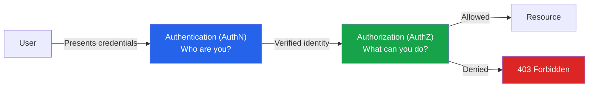
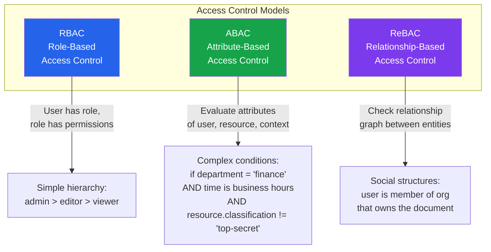
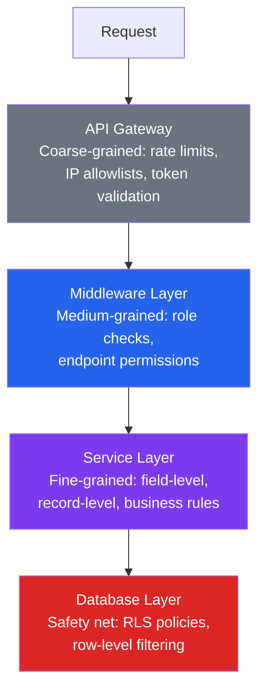
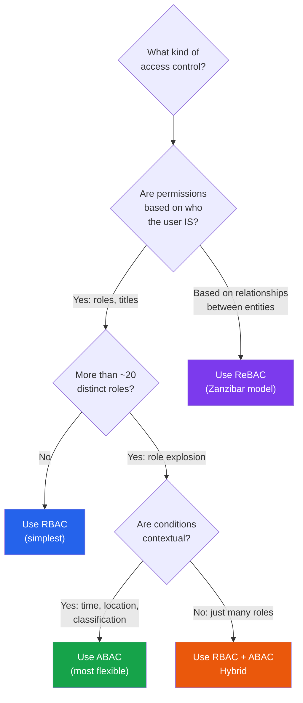

# Authorization Patterns Overview

Authorization is the process of determining whether a user, service, or system is allowed to perform a specific action on a specific resource. It answers the question: **"Can this principal do this action on this resource?"**

Authorization is distinct from authentication. Authentication answers "Who are you?" Authorization answers "What are you allowed to do?" A system can have perfect authentication — every request is cryptographically verified to come from a known user — and still have catastrophic authorization failures if that verified user can read other users' data, delete resources they should not touch, or access admin endpoints.

Authorization failures are consistently in the OWASP Top 10 and are among the most exploited vulnerability classes. Broken access control has been the number one web application security risk since 2021. The reason is straightforward: authorization logic is distributed across every endpoint, every query, every service — and missing it in a single place creates an exploitable vulnerability.

## Authentication vs Authorization



| Aspect | Authentication (AuthN) | Authorization (AuthZ) |
|---|---|---|
| Question answered | "Who is this?" | "Can they do this?" |
| Input | Credentials (password, token, certificate) | Identity + action + resource |
| Output | Verified identity | Allow or deny |
| Where it happens | Login, token validation | Every protected operation |
| Failure HTTP code | 401 Unauthorized | 403 Forbidden |
| Typical technologies | OAuth 2.0, OIDC, SAML, passkeys | RBAC, ABAC, ReBAC, policy engines |
| Change frequency | Rarely changes | Changes constantly (new features, roles) |

::: warning HTTP Status Codes
Despite the confusing name, HTTP 401 means "unauthenticated" (we don't know who you are), while 403 means "unauthorized" (we know who you are, but you can't do this). Getting this wrong in your API leaks information about what resources exist.
:::

## The Three Major Access Control Models

Authorization systems are built on one of three models, or a combination of them. The right choice depends on your domain complexity, the granularity of control you need, and who needs to manage permissions.



### Quick Comparison

| Criteria | RBAC | ABAC | ReBAC |
|---|---|---|---|
| Core concept | Users have roles, roles have permissions | Policies evaluate attributes | Permissions follow relationships |
| Best for | Internal tools, admin panels, simple apps | Compliance-heavy, contextual access | Document sharing, org hierarchies, social |
| Complexity | Low | High | Medium-High |
| Example | "Editors can edit posts" | "Finance users can view reports during business hours in their region" | "Users can edit documents shared with their team" |
| Scalability | Good to ~100 roles | Excellent | Excellent |
| Management | Admin assigns roles | Policy authors write rules | Relationships managed alongside data |
| Key technology | Most frameworks built-in | OPA, Cedar | Zanzibar, SpiceDB, OpenFGA |
| Main weakness | Role explosion | Policy complexity | Relationship graph management |

See [RBAC vs ABAC vs ReBAC](/security/authorization/rbac-abac-rebac) for a deep comparison.

## Authorization Architecture

### Where Should Authorization Live?

Authorization logic can be placed at different layers of the stack. Most production systems use multiple layers:



| Layer | Granularity | Examples | Performance |
|---|---|---|---|
| API Gateway | Coarse | Block unauthenticated requests, IP filtering | Fastest |
| Middleware | Medium | Role-based endpoint access, feature flags | Fast |
| Service Logic | Fine | "Can this user edit this specific document?" | Moderate |
| Database (RLS) | Safety net | Row-level security prevents data leakage | Slight overhead |

::: tip Defense in Depth
Never rely on a single authorization layer. Gateway checks catch the obvious cases. Middleware enforces role-based access. Service logic handles business rules. Database RLS provides the safety net when application logic has bugs.
:::

### The Authorization Decision Point

Regardless of the model you choose, every authorization check follows the same pattern:

```typescript
// The fundamental authorization question
interface AuthorizationRequest {
  principal: {
    id: string;
    type: 'user' | 'service' | 'api_key';
    attributes: Record<string, any>;  // roles, department, etc.
  };
  action: string;        // 'read', 'write', 'delete', 'admin'
  resource: {
    type: string;         // 'document', 'order', 'user'
    id: string;
    attributes: Record<string, any>;  // owner, classification, etc.
  };
  context: {
    timestamp: Date;
    ipAddress: string;
    tenantId?: string;
  };
}

interface AuthorizationResponse {
  allowed: boolean;
  reason?: string;        // For audit logs
  conditions?: object;    // Any conditional grants
}

// Generic authorization interface
interface Authorizer {
  check(request: AuthorizationRequest): Promise<AuthorizationResponse>;
}
```

### Example: Simple Authorization Middleware

```typescript
import { Request, Response, NextFunction } from 'express';

// Simple role-based check
function requireRole(...roles: string[]) {
  return (req: Request, res: Response, next: NextFunction) => {
    const userRoles = req.user?.roles || [];
    const hasRole = roles.some(role => userRoles.includes(role));

    if (!hasRole) {
      return res.status(403).json({
        error: 'Forbidden',
        message: 'Insufficient permissions',
      });
    }

    next();
  };
}

// Resource-level check (more granular)
function requirePermission(action: string, resourceType: string) {
  return async (req: Request, res: Response, next: NextFunction) => {
    const resourceId = req.params.id;

    const allowed = await authorizer.check({
      principal: {
        id: req.user.id,
        type: 'user',
        attributes: { roles: req.user.roles },
      },
      action,
      resource: {
        type: resourceType,
        id: resourceId,
        attributes: {},  // loaded by authorizer
      },
      context: {
        timestamp: new Date(),
        ipAddress: req.ip,
        tenantId: req.tenant?.tenantId,
      },
    });

    if (!allowed.allowed) {
      return res.status(403).json({
        error: 'Forbidden',
        message: allowed.reason || 'Access denied',
      });
    }

    next();
  };
}

// Usage
app.get('/api/documents/:id',
  requirePermission('read', 'document'),
  getDocument
);

app.delete('/api/documents/:id',
  requirePermission('delete', 'document'),
  deleteDocument
);

app.get('/api/admin/users',
  requireRole('admin', 'super_admin'),
  listUsers
);
```

## Common Authorization Patterns

### Pattern 1: Permission-Based (Most Common)

Map permissions directly to actions and resources:

```typescript
// Define permissions as action:resource pairs
const PERMISSIONS = {
  'documents:read':   'Read documents',
  'documents:write':  'Create and edit documents',
  'documents:delete': 'Delete documents',
  'users:read':       'View user profiles',
  'users:manage':     'Create, edit, delete users',
  'billing:read':     'View billing information',
  'billing:manage':   'Modify billing settings',
} as const;

type Permission = keyof typeof PERMISSIONS;

// Roles bundle permissions
const ROLE_PERMISSIONS: Record<string, Permission[]> = {
  viewer: ['documents:read', 'users:read'],
  editor: ['documents:read', 'documents:write', 'users:read'],
  admin:  ['documents:read', 'documents:write', 'documents:delete',
           'users:read', 'users:manage', 'billing:read'],
  owner:  Object.keys(PERMISSIONS) as Permission[],
};
```

### Pattern 2: Resource Ownership

The simplest authorization model for user-generated content:

```typescript
// Resource ownership check
async function canModifyResource(
  userId: string,
  resourceType: string,
  resourceId: string
): Promise<boolean> {
  const resource = await db.query(
    `SELECT owner_id FROM ${resourceType}s WHERE id = $1`,
    [resourceId]
  );

  if (!resource.rows[0]) return false;

  return resource.rows[0].owner_id === userId;
}
```

### Pattern 3: Hierarchical Organization Access

Common in B2B SaaS where access follows organizational structure:

```typescript
// Organization hierarchy check
async function canAccessInOrg(
  userId: string,
  orgId: string,
  requiredRole: string
): Promise<boolean> {
  const membership = await db.query(
    `SELECT role FROM org_memberships
     WHERE user_id = $1 AND org_id = $2`,
    [userId, orgId]
  );

  if (!membership.rows[0]) return false;

  const roleHierarchy = ['member', 'editor', 'admin', 'owner'];
  const userRoleIndex = roleHierarchy.indexOf(membership.rows[0].role);
  const requiredRoleIndex = roleHierarchy.indexOf(requiredRole);

  return userRoleIndex >= requiredRoleIndex;
}
```

## Authorization Anti-Patterns

::: danger Common Authorization Mistakes
1. **Client-side only** — Never enforce authorization only in the UI. Always enforce server-side. The UI should hide things users cannot do (for UX), but the server must reject unauthorized requests.
2. **Relying on obscurity** — Unpredictable URLs are not access control. `/admin/secret-dashboard-xyz123` is not secure; it is just hard to guess.
3. **Implicit deny missing** — Default to deny. If you cannot find a rule that allows access, the answer is "no."
4. **No audit trail** — Every authorization decision (especially denials) should be logged for security monitoring.
5. **Inconsistent enforcement** — If 99 out of 100 endpoints check permissions but one does not, attackers will find it.
6. **Overly broad roles** — An "admin" role that grants access to everything makes lateral movement trivial after a compromise.
:::

## Choosing the Right Model



## Section Contents

| Page | What You'll Learn |
|---|---|
| [RBAC vs ABAC vs ReBAC](/security/authorization/rbac-abac-rebac) | Deep comparison of the three models with implementations |
| [Google Zanzibar](/security/authorization/zanzibar) | Relationship-based authorization at scale (SpiceDB, OpenFGA) |
| [Policy Engines (OPA & Cedar)](/security/authorization/policy-engines) | Policy-as-code with OPA/Rego and AWS Cedar |

## Further Reading

- [Authentication](/security/authentication/) — AuthN patterns (OAuth 2.0, OIDC, JWT)
- [API Security](/security/api-security/) — Securing API endpoints
- [Zero Trust](/security/zero-trust/) — Never trust, always verify
- [Multi-Tenancy](/architecture-patterns/multi-tenancy/) — Tenant-scoped authorization
- [OWASP Top 10](/security/owasp/) — Access control vulnerabilities
- OWASP Authorization Cheat Sheet
- NIST SP 800-162 (ABAC guide)
- Google Zanzibar paper (2019)
