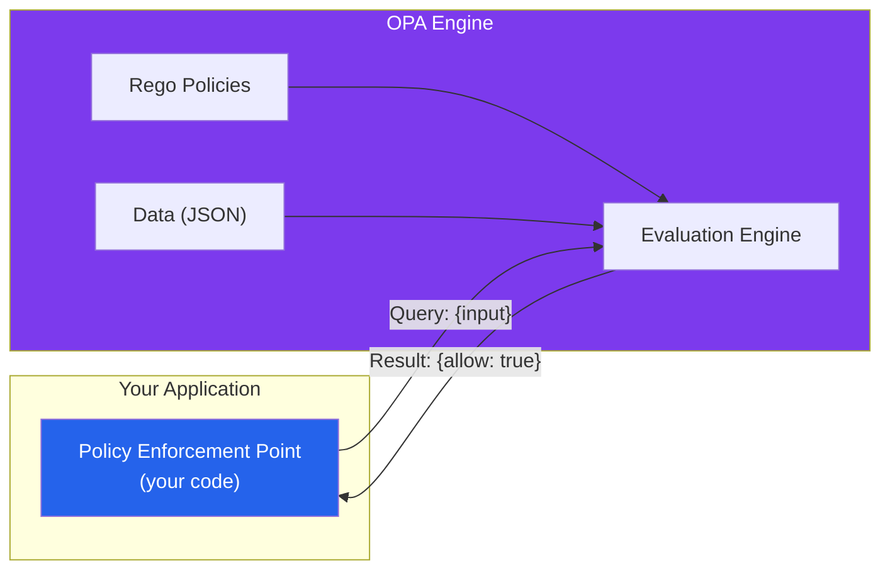

# Policy Engines (OPA & Cedar)

A policy engine is a dedicated system that evaluates authorization rules (policies) against input data and returns allow/deny decisions. Instead of scattering `if (user.role === 'admin')` checks throughout your codebase, you externalize authorization logic into a policy engine that can be updated, tested, and audited independently of application code.

This is the policy-as-code paradigm: authorization rules are version-controlled, reviewed in pull requests, tested in CI, and deployed through pipelines — just like application code. But they live separately from the application, which means you can update who can do what without deploying your application.

Two policy engines dominate the landscape: **Open Policy Agent (OPA)** from the CNCF, and **Cedar** from AWS. They represent different philosophies — OPA is a general-purpose policy engine with a custom language (Rego), while Cedar is purpose-built for authorization with a more constrained, analyzable language.

## Open Policy Agent (OPA)

OPA is a general-purpose policy engine that decouples policy decision-making from policy enforcement. It was created by Styra, donated to the CNCF, and graduated as a CNCF project. OPA is used for API authorization, Kubernetes admission control, Terraform plan validation, data filtering, and more.

### Architecture



OPA operates as a sidecar or standalone service. Your application sends a JSON input (who is trying to do what), OPA evaluates the input against loaded policies and data, and returns a JSON result.

### The Rego Language

Rego is OPA's purpose-built policy language. It is declarative, inspired by Datalog, and designed for querying nested JSON documents.

```rego
# policy.rego — API authorization policy
package api.authz

import rego.v1

default allow := false

# Allow admins to do anything
allow if {
    input.user.roles[_] == "admin"
}

# Allow users to read their own profile
allow if {
    input.action == "read"
    input.resource.type == "user_profile"
    input.resource.id == input.user.id
}

# Allow managers to read profiles in their department
allow if {
    input.action == "read"
    input.resource.type == "user_profile"
    input.user.roles[_] == "manager"
    input.resource.department == input.user.department
}

# Allow document owners to edit their documents
allow if {
    input.action == "edit"
    input.resource.type == "document"
    input.resource.owner == input.user.id
}

# Deny access outside business hours for non-admins
deny if {
    not input.user.roles[_] == "admin"
    hour := time.clock(time.now_ns())[0]
    hour < 8
}

deny if {
    not input.user.roles[_] == "admin"
    hour := time.clock(time.now_ns())[0]
    hour > 18
}

# Final decision: allow AND NOT deny
authorized if {
    allow
    not deny
}
```

### Querying OPA from Your Application

```typescript
// OPA client for Node.js
import axios from 'axios';

const OPA_URL = process.env.OPA_URL || 'http://localhost:8181';

interface OPAInput {
  user: {
    id: string;
    roles: string[];
    department: string;
  };
  action: string;
  resource: {
    type: string;
    id: string;
    owner?: string;
    department?: string;
  };
}

async function checkPolicy(input: OPAInput): Promise<boolean> {
  const response = await axios.post(
    `${OPA_URL}/v1/data/api/authz/authorized`,
    { input }
  );

  return response.data.result === true;
}

// Express middleware
function opaAuthz(action: string, resourceType: string) {
  return async (req, res, next) => {
    const resource = await loadResource(resourceType, req.params.id);

    const allowed = await checkPolicy({
      user: {
        id: req.user.id,
        roles: req.user.roles,
        department: req.user.department,
      },
      action,
      resource: {
        type: resourceType,
        id: req.params.id,
        owner: resource?.ownerId,
        department: resource?.department,
      },
    });

    if (!allowed) {
      return res.status(403).json({ error: 'Forbidden' });
    }

    next();
  };
}

// Usage
app.get('/api/documents/:id', opaAuthz('read', 'document'), getDocument);
app.put('/api/documents/:id', opaAuthz('edit', 'document'), updateDocument);
app.delete('/api/documents/:id', opaAuthz('delete', 'document'), deleteDocument);
```

### OPA Data: External Context

OPA can load external data that policies reference. This is powerful for enriching authorization decisions with organizational data:

```rego
# data.json loaded into OPA
# {
#   "role_grants": {
#     "admin": ["*"],
#     "editor": ["documents:read", "documents:write"],
#     "viewer": ["documents:read"]
#   },
#   "department_hierarchy": {
#     "engineering": ["backend", "frontend", "platform"],
#     "product": ["design", "pm"]
#   }
# }

package api.authz

import rego.v1

# Check if user's role grants the requested permission
has_permission(user, permission) if {
    role := user.roles[_]
    grants := data.role_grants[role]
    grants[_] == permission
}

has_permission(user, _) if {
    user.roles[_] == "admin"
    data.role_grants["admin"][_] == "*"
}

allow if {
    permission := sprintf("%s:%s", [input.resource.type, input.action])
    has_permission(input.user, permission)
}
```

### OPA for Kubernetes Admission Control

One of OPA's most impactful use cases is Kubernetes admission control via **Gatekeeper** (OPA's Kubernetes-native integration):

```yaml
# Gatekeeper ConstraintTemplate
apiVersion: templates.gatekeeper.sh/v1
kind: ConstraintTemplate
metadata:
  name: k8srequiredlabels
spec:
  crd:
    spec:
      names:
        kind: K8sRequiredLabels
      validation:
        openAPIV3Schema:
          type: object
          properties:
            labels:
              type: array
              items:
                type: string
  targets:
    - target: admission.k8s.gatekeeper.sh
      rego: |
        package k8srequiredlabels

        import rego.v1

        violation contains {"msg": msg} if {
          provided := {label | input.review.object.metadata.labels[label]}
          required := {label | label := input.parameters.labels[_]}
          missing := required - provided
          count(missing) > 0
          msg := sprintf("Missing required labels: %v", [missing])
        }
```

```yaml
# Constraint: all deployments must have 'team' and 'env' labels
apiVersion: constraints.gatekeeper.sh/v1beta1
kind: K8sRequiredLabels
metadata:
  name: require-team-and-env-labels
spec:
  match:
    kinds:
      - apiGroups: ["apps"]
        kinds: ["Deployment"]
  parameters:
    labels:
      - "team"
      - "env"
```

::: tip OPA Beyond Authorization
OPA is a general-purpose policy engine. Beyond authorization, teams use it for:
- **Terraform plan validation** — ensure infrastructure changes comply with policies before applying
- **CI/CD pipeline gates** — block deployments that violate security policies
- **Data filtering** — filter API responses based on user's access level
- **Configuration validation** — validate Kubernetes manifests, Docker Compose files, etc.
:::

### Testing OPA Policies

Rego policies are testable. Write tests alongside your policies:

```rego
# policy_test.rego
package api.authz_test

import rego.v1

import data.api.authz

# Test: admins can do anything
test_admin_allowed if {
    authz.allow with input as {
        "user": {"id": "u1", "roles": ["admin"], "department": "eng"},
        "action": "delete",
        "resource": {"type": "document", "id": "d1"}
    }
}

# Test: viewers cannot edit
test_viewer_cannot_edit if {
    not authz.allow with input as {
        "user": {"id": "u2", "roles": ["viewer"], "department": "eng"},
        "action": "edit",
        "resource": {"type": "document", "id": "d1", "owner": "u1"}
    }
}

# Test: owners can edit their documents
test_owner_can_edit if {
    authz.allow with input as {
        "user": {"id": "u1", "roles": ["editor"], "department": "eng"},
        "action": "edit",
        "resource": {"type": "document", "id": "d1", "owner": "u1"}
    }
}

# Test: cross-department read denied for non-managers
test_cross_department_denied if {
    not authz.allow with input as {
        "user": {"id": "u2", "roles": ["editor"], "department": "eng"},
        "action": "read",
        "resource": {"type": "user_profile", "id": "u3", "department": "finance"}
    }
}
```

```bash
# Run OPA tests
opa test ./policies/ -v
```

## AWS Cedar

Cedar is a policy language and evaluation engine created by AWS. It is purpose-built for authorization (unlike OPA's general-purpose design) and powers AWS Verified Permissions and Amazon Verified Access. Cedar's key differentiator is that its language is **analyzable** — tools can prove properties about policies (like "no two policies conflict") before deployment.

### Cedar Policy Language

```cedar
// Cedar policies are permit or forbid statements
// Each policy has a scope (principal, action, resource) and optional conditions

// Allow editors to view and edit documents
permit (
    principal in Role::"editor",
    action in [Action::"view", Action::"edit"],
    resource is Document
);

// Allow document owners full access
permit (
    principal,
    action,
    resource is Document
) when {
    principal == resource.owner
};

// Allow team members to view documents in their team's folder
permit (
    principal,
    action == Action::"view",
    resource is Document
) when {
    resource.folder in principal.teams
};

// Deny access to confidential documents without clearance
forbid (
    principal,
    action,
    resource is Document
) when {
    resource.classification == "confidential" &&
    !(principal.clearanceLevel == "confidential" ||
      principal.clearanceLevel == "top-secret")
};

// Deny all access outside business hours
forbid (
    principal,
    action,
    resource
) unless {
    context.hour >= 8 && context.hour <= 18
} when {
    !(principal in Role::"admin")
};
```

### Cedar Entity Model

Cedar uses a typed entity model — every principal, action, and resource is an entity with a type and attributes:

```json
// Cedar entity schema
{
  "entityTypes": {
    "User": {
      "shape": {
        "type": "Record",
        "attributes": {
          "department": { "type": "String" },
          "clearanceLevel": { "type": "String" },
          "teams": { "type": "Set", "element": { "type": "Entity", "name": "Team" } }
        }
      },
      "memberOfTypes": ["Role", "Team"]
    },
    "Document": {
      "shape": {
        "type": "Record",
        "attributes": {
          "owner": { "type": "Entity", "name": "User" },
          "classification": { "type": "String" },
          "folder": { "type": "Entity", "name": "Folder" },
          "department": { "type": "String" }
        }
      }
    },
    "Role": {},
    "Team": {},
    "Folder": {
      "memberOfTypes": ["Folder"]
    }
  },
  "actionTypes": {
    "view": { "appliesTo": { "principalTypes": ["User"], "resourceTypes": ["Document"] } },
    "edit": { "appliesTo": { "principalTypes": ["User"], "resourceTypes": ["Document"] } },
    "delete": { "appliesTo": { "principalTypes": ["User"], "resourceTypes": ["Document"] } }
  }
}
```

### Using Cedar with AWS Verified Permissions

```typescript
import {
  VerifiedPermissionsClient,
  IsAuthorizedCommand,
} from '@aws-sdk/client-verifiedpermissions';

const client = new VerifiedPermissionsClient({ region: 'us-east-1' });

async function checkCedarPolicy(
  userId: string,
  action: string,
  resourceId: string,
  resourceType: string
): Promise<boolean> {
  const command = new IsAuthorizedCommand({
    policyStoreId: process.env.CEDAR_POLICY_STORE_ID,
    principal: {
      entityType: 'MyApp::User',
      entityId: userId,
    },
    action: {
      actionType: 'MyApp::Action',
      actionId: action,
    },
    resource: {
      entityType: `MyApp::${resourceType}`,
      entityId: resourceId,
    },
    context: {
      contextMap: {
        hour: { long: new Date().getHours() },
        ipAddress: { string: '10.0.1.50' },
      },
    },
  });

  const response = await client.send(command);
  return response.decision === 'ALLOW';
}
```

### Cedar vs OPA Comparison

| Feature | OPA (Rego) | Cedar |
|---|---|---|
| Purpose | General-purpose policy engine | Authorization-specific |
| Language | Rego (Datalog-inspired) | Cedar (custom DSL) |
| Analyzability | Limited (Turing-complete) | Full analysis (decidable) |
| Policy conflicts | Must be tested | Can be detected statically |
| Learning curve | Steep (Rego is unusual) | Moderate (more natural syntax) |
| Kubernetes integration | Excellent (Gatekeeper) | No native support |
| Terraform integration | Excellent (conftest) | No native support |
| Cloud provider | Cloud-agnostic | AWS (Verified Permissions) |
| Performance | Very fast (compiled to Wasm) | Very fast (Rust engine) |
| Community | Large (CNCF graduated) | Growing (AWS-backed) |
| Open source | Yes (Apache 2.0) | Yes (Apache 2.0) |
| Best for | Platform-wide policy | Application authorization |

::: tip Choosing Between OPA and Cedar
Use **OPA** if you need policy enforcement across infrastructure (Kubernetes, Terraform, CI/CD) AND application authorization. Use **Cedar** if your primary need is application-level authorization and you want policy analysis guarantees (provably no conflicting rules). Many organizations use both — OPA for infrastructure policies, Cedar for application authorization.
:::

## Policy-as-Code: CI/CD Integration

### Policy Testing in CI

```yaml
# .github/workflows/policy-ci.yml
name: Policy CI

on:
  pull_request:
    paths:
      - 'policies/**'

jobs:
  test-opa-policies:
    runs-on: ubuntu-latest
    steps:
      - uses: actions/checkout@v4

      - name: Install OPA
        run: |
          curl -L -o opa https://openpolicyagent.org/downloads/latest/opa_linux_amd64_static
          chmod 755 opa && sudo mv opa /usr/local/bin/

      - name: Run policy tests
        run: opa test ./policies/ -v --coverage --format=json > coverage.json

      - name: Check coverage threshold
        run: |
          coverage=$(jq '.coverage' coverage.json)
          if (( $(echo "$coverage < 90" | bc -l) )); then
            echo "Policy coverage ${coverage}% is below 90% threshold"
            exit 1
          fi

      - name: Validate policy formatting
        run: opa fmt --diff --fail ./policies/

      - name: Check for policy conflicts
        run: opa check --strict ./policies/

  validate-cedar-policies:
    runs-on: ubuntu-latest
    steps:
      - uses: actions/checkout@v4

      - name: Install Cedar CLI
        run: cargo install cedar-policy-cli

      - name: Validate Cedar policies
        run: |
          cedar validate \
            --policies policies/cedar/ \
            --schema policies/cedar/schema.cedarschema

      - name: Run Cedar policy tests
        run: |
          cedar authorize \
            --policies policies/cedar/ \
            --entities policies/cedar/test-entities.json \
            --principal 'User::"test-admin"' \
            --action 'Action::"edit"' \
            --resource 'Document::"doc-1"'
```

### Policy Deployment Pipeline

```mermaid
graph LR
    subgraph Dev["Development"]
        WRITE[Write Policy] --> TEST[Unit Test]
        TEST --> PR[Pull Request]
    end

    subgraph CI["CI Pipeline"]
        PR --> LINT[Lint & Format]
        LINT --> UTEST[Run Tests]
        UTEST --> COVERAGE[Coverage Check]
        COVERAGE --> ANALYZE[Conflict Analysis]
    end

    subgraph Deploy["Deployment"]
        ANALYZE --> STAGING[Deploy to Staging]
        STAGING --> INTTEST[Integration Tests]
        INTTEST --> CANARY[Canary Deploy]
        CANARY --> PROD[Production]
    end

    style Dev fill:#2563eb,color:#fff
    style CI fill:#ea580c,color:#fff
    style Deploy fill:#16a34a,color:#fff
```



## Deployment Patterns

### Sidecar Pattern (Most Common for OPA)

```yaml
# Kubernetes deployment with OPA sidecar
apiVersion: apps/v1
kind: Deployment
metadata:
  name: api-server
spec:
  template:
    spec:
      containers:
        - name: api
          image: myapp/api:latest
          ports:
            - containerPort: 8080
          env:
            - name: OPA_URL
              value: "http://localhost:8181"

        - name: opa
          image: openpolicyagent/opa:latest
          args:
            - "run"
            - "--server"
            - "--addr=:8181"
            - "--set=decision_logs.console=true"
            - "/policies"
          ports:
            - containerPort: 8181
          volumeMounts:
            - name: policies
              mountPath: /policies
              readOnly: true
          resources:
            requests:
              cpu: "100m"
              memory: "64Mi"
            limits:
              cpu: "500m"
              memory: "256Mi"

      volumes:
        - name: policies
          configMap:
            name: opa-policies
```

### Embedded Library Pattern

For latency-critical paths, embed the policy engine directly in your application:

```go
// Embedded OPA in Go application
package main

import (
    "context"
    "encoding/json"
    "github.com/open-policy-agent/opa/rego"
)

func main() {
    // Compile the policy once at startup
    query, err := rego.New(
        rego.Query("data.api.authz.authorized"),
        rego.Load([]string{"./policies/"}, nil),
    ).PrepareForEval(context.Background())

    if err != nil {
        panic(err)
    }

    // Evaluate per request (microsecond latency)
    input := map[string]interface{}{
        "user": map[string]interface{}{
            "id":    "alice",
            "roles": []string{"editor"},
        },
        "action":   "edit",
        "resource": map[string]interface{}{
            "type":  "document",
            "owner": "alice",
        },
    }

    results, err := query.Eval(context.Background(), rego.EvalInput(input))
    if err != nil || len(results) == 0 {
        // Default deny
        return
    }

    allowed := results[0].Expressions[0].Value.(bool)
    // Use the result...
}
```

### WebAssembly Compilation

OPA policies can be compiled to WebAssembly for near-native performance in any language:

```bash
# Compile policy to Wasm
opa build -t wasm -e 'data.api.authz.authorized' ./policies/

# The resulting bundle contains a .wasm file
# that can be loaded in Node.js, Go, Rust, Python, etc.
```

```typescript
// Load OPA Wasm in Node.js
import { loadPolicy } from '@open-policy-agent/opa-wasm';
import { readFileSync } from 'fs';

const policyWasm = readFileSync('./policy.wasm');
const policy = await loadPolicy(policyWasm);

// Evaluate — microsecond latency
const result = policy.evaluate(input);
const allowed = result[0]?.result === true;
```

## Common Policy Patterns

### Default Deny with Explicit Allows

```rego
package api.authz

import rego.v1

# ALWAYS start with default deny
default authorized := false

# Explicit allow rules
authorized if {
    # ... specific allow conditions
}
```

### Separation of Duties

```cedar
// No single user can both approve and execute a transaction
forbid (
    principal,
    action == Action::"execute_transaction",
    resource is Transaction
) when {
    principal == resource.approver
};
```

### Time-Bound Access

```rego
# Temporary access grants
allow if {
    grant := data.temporary_grants[_]
    grant.user_id == input.user.id
    grant.resource_id == input.resource.id
    time.now_ns() >= grant.valid_from
    time.now_ns() <= grant.valid_until
}
```

## Further Reading

- [Authorization Patterns Overview](/security/authorization/) — Foundations of authorization
- [RBAC vs ABAC vs ReBAC](/security/authorization/rbac-abac-rebac) — Choosing the right model
- [Google Zanzibar](/security/authorization/zanzibar) — Relationship-based authorization
- [Kubernetes](/infrastructure/kubernetes/) — OPA Gatekeeper for admission control
- [Terraform](/infrastructure/terraform/) — Policy validation with conftest
- OPA documentation (openpolicyagent.org)
- Cedar documentation (cedarpolicy.com)
- "Policy-Based Access Controls" — NIST guidelines
- Styra Academy (free OPA training)
