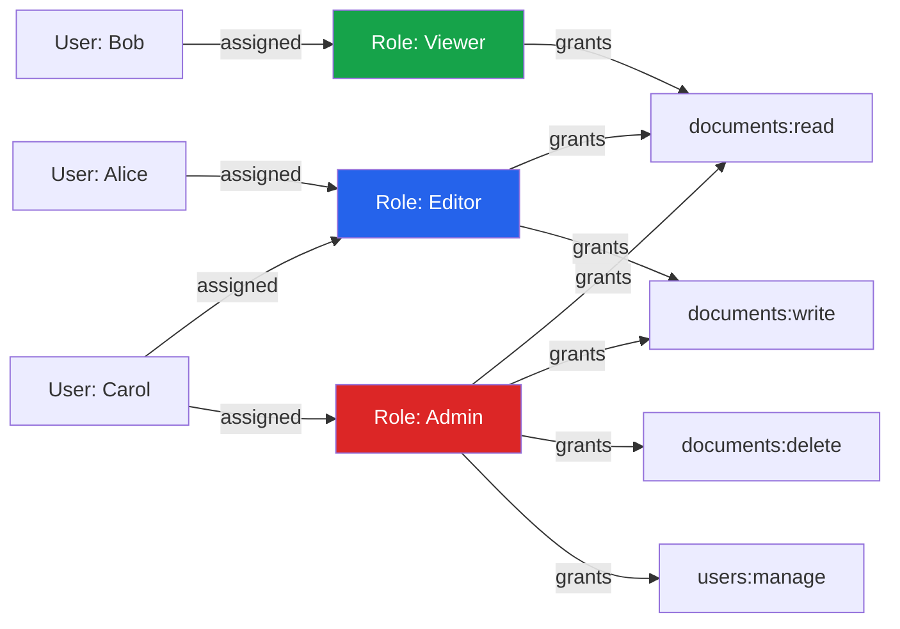
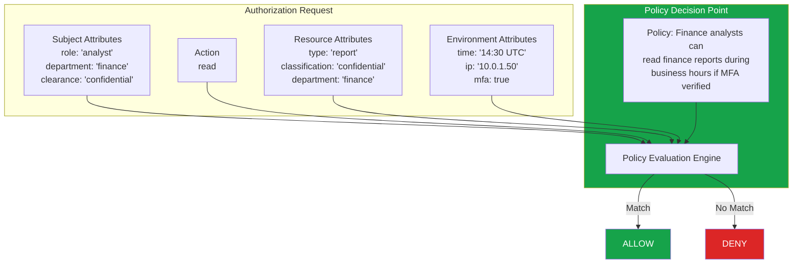
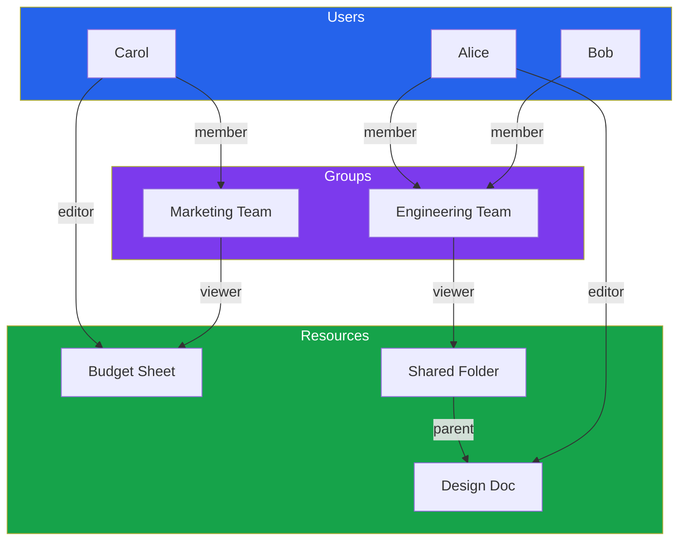
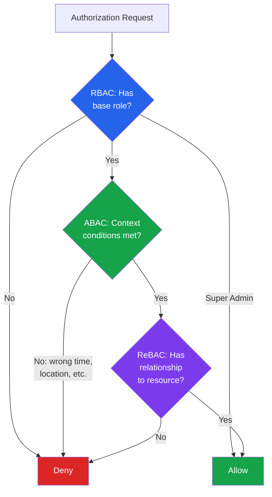

# RBAC vs ABAC vs ReBAC

The three major access control models — RBAC, ABAC, and ReBAC — represent fundamentally different ways of answering the question "Can this user do this thing?" Each has distinct strengths, and understanding when to use which (or when to combine them) is one of the most consequential security architecture decisions you will make.

This page goes deep on each model with working implementations, then provides a decision framework for choosing between them.

## RBAC: Role-Based Access Control

RBAC is the simplest and most widely used access control model. The core idea: users are assigned roles, and roles are assigned permissions. Users never receive permissions directly — they receive them through their roles.



### RBAC Database Schema

```sql
-- Core RBAC tables
CREATE TABLE roles (
    id UUID PRIMARY KEY DEFAULT gen_random_uuid(),
    name TEXT NOT NULL UNIQUE,
    description TEXT,
    created_at TIMESTAMPTZ NOT NULL DEFAULT now()
);

CREATE TABLE permissions (
    id UUID PRIMARY KEY DEFAULT gen_random_uuid(),
    action TEXT NOT NULL,          -- 'read', 'write', 'delete'
    resource_type TEXT NOT NULL,   -- 'document', 'user', 'billing'
    description TEXT,
    UNIQUE (action, resource_type)
);

CREATE TABLE role_permissions (
    role_id UUID REFERENCES roles(id) ON DELETE CASCADE,
    permission_id UUID REFERENCES permissions(id) ON DELETE CASCADE,
    PRIMARY KEY (role_id, permission_id)
);

CREATE TABLE user_roles (
    user_id UUID NOT NULL,
    role_id UUID REFERENCES roles(id) ON DELETE CASCADE,
    granted_by UUID,
    granted_at TIMESTAMPTZ NOT NULL DEFAULT now(),
    PRIMARY KEY (user_id, role_id)
);

-- Seed data
INSERT INTO roles (name, description) VALUES
    ('viewer', 'Read-only access'),
    ('editor', 'Read and write access'),
    ('admin', 'Full administrative access');

INSERT INTO permissions (action, resource_type) VALUES
    ('read', 'document'),
    ('write', 'document'),
    ('delete', 'document'),
    ('read', 'user'),
    ('manage', 'user'),
    ('read', 'billing'),
    ('manage', 'billing');
```

### Role Hierarchies

Flat roles lead to role explosion. Role hierarchies allow roles to inherit permissions from parent roles:

```sql
-- Add hierarchy support
ALTER TABLE roles ADD COLUMN parent_role_id UUID REFERENCES roles(id);

-- Create hierarchy: admin inherits from editor, editor inherits from viewer
UPDATE roles SET parent_role_id = (SELECT id FROM roles WHERE name = 'editor')
    WHERE name = 'admin';
UPDATE roles SET parent_role_id = (SELECT id FROM roles WHERE name = 'viewer')
    WHERE name = 'editor';
```

```typescript
// Resolve all permissions including inherited ones
async function getEffectivePermissions(userId: string): Promise<Permission[]> {
  const result = await db.query(`
    WITH RECURSIVE role_hierarchy AS (
        -- Base: roles directly assigned to user
        SELECT r.id, r.name, r.parent_role_id
        FROM user_roles ur
        JOIN roles r ON r.id = ur.role_id
        WHERE ur.user_id = $1

        UNION

        -- Recursive: parent roles
        SELECT r.id, r.name, r.parent_role_id
        FROM roles r
        JOIN role_hierarchy rh ON r.id = rh.parent_role_id
    )
    SELECT DISTINCT p.action, p.resource_type
    FROM role_hierarchy rh
    JOIN role_permissions rp ON rp.role_id = rh.id
    JOIN permissions p ON p.id = rp.permission_id
  `, [userId]);

  return result.rows;
}

// Check if user has a specific permission
async function hasPermission(
  userId: string,
  action: string,
  resourceType: string
): Promise<boolean> {
  const permissions = await getEffectivePermissions(userId);
  return permissions.some(
    p => p.action === action && p.resource_type === resourceType
  );
}
```

### RBAC Strengths and Weaknesses

| Strengths | Weaknesses |
|---|---|
| Simple to understand and implement | Cannot express contextual rules (time, location) |
| Easy to audit ("who has admin?") | Role explosion in complex domains |
| Well-supported by frameworks | No resource-instance-level control |
| Manageable by non-technical admins | Cannot express "owner can edit their own" |
| Fast evaluation (simple lookup) | Rigid — changes require role restructuring |

### When RBAC Breaks Down: Role Explosion

```
// 3 roles x 4 resources = 12 role-permission mappings (manageable)
viewer, editor, admin x documents, users, billing, reports

// But add organizational scope:
viewer-team-a, editor-team-a, admin-team-a
viewer-team-b, editor-team-b, admin-team-b
viewer-team-c, editor-team-c, admin-team-c
// 3 roles x 3 teams = 9 roles, and growing...

// Add per-project scope:
editor-team-a-project-1, editor-team-a-project-2, ...
// Now you have N roles x M teams x P projects = explosion
```

When you find yourself creating roles like `editor-team-a-project-1-readonly-financials`, it is time to look at ABAC or ReBAC.

## ABAC: Attribute-Based Access Control

ABAC evaluates access based on attributes of the user (subject), the resource (object), the action, and the environment (context). Instead of fixed roles, ABAC uses policies that evaluate conditions at runtime.



### ABAC Policy Implementation

```typescript
// ABAC policy engine
interface Subject {
  id: string;
  role: string;
  department: string;
  clearanceLevel: string;
  mfaVerified: boolean;
}

interface Resource {
  id: string;
  type: string;
  ownerId: string;
  department: string;
  classification: string;
  createdAt: Date;
}

interface Environment {
  timestamp: Date;
  ipAddress: string;
  isBusinessHours: boolean;
  requestSource: 'internal' | 'external';
}

interface ABACPolicy {
  name: string;
  description: string;
  effect: 'allow' | 'deny';
  conditions: (
    subject: Subject,
    action: string,
    resource: Resource,
    environment: Environment
  ) => boolean;
}

// Define policies
const policies: ABACPolicy[] = [
  {
    name: 'owner-full-access',
    description: 'Resource owners have full access to their resources',
    effect: 'allow',
    conditions: (subject, action, resource) =>
      resource.ownerId === subject.id,
  },
  {
    name: 'department-read',
    description: 'Users can read resources in their department',
    effect: 'allow',
    conditions: (subject, action, resource) =>
      action === 'read' &&
      subject.department === resource.department,
  },
  {
    name: 'confidential-requires-clearance',
    description: 'Confidential resources require matching clearance',
    effect: 'deny',
    conditions: (subject, action, resource) =>
      resource.classification === 'confidential' &&
      subject.clearanceLevel !== 'confidential' &&
      subject.clearanceLevel !== 'top-secret',
  },
  {
    name: 'external-deny-sensitive',
    description: 'Deny external access to sensitive resources',
    effect: 'deny',
    conditions: (subject, action, resource, environment) =>
      environment.requestSource === 'external' &&
      resource.classification !== 'public',
  },
  {
    name: 'mfa-required-for-write',
    description: 'Write operations require MFA',
    effect: 'deny',
    conditions: (subject, action) =>
      (action === 'write' || action === 'delete') &&
      !subject.mfaVerified,
  },
];

// Policy evaluation engine
function evaluate(
  subject: Subject,
  action: string,
  resource: Resource,
  environment: Environment
): { allowed: boolean; reason: string } {
  // Check deny policies first (deny overrides allow)
  for (const policy of policies.filter(p => p.effect === 'deny')) {
    if (policy.conditions(subject, action, resource, environment)) {
      return { allowed: false, reason: `Denied by policy: ${policy.name}` };
    }
  }

  // Check allow policies
  for (const policy of policies.filter(p => p.effect === 'allow')) {
    if (policy.conditions(subject, action, resource, environment)) {
      return { allowed: true, reason: `Allowed by policy: ${policy.name}` };
    }
  }

  // Default deny
  return { allowed: false, reason: 'No matching allow policy (default deny)' };
}
```

::: tip ABAC Combining Algorithms
The order in which policies are evaluated matters. Common algorithms: **deny-overrides** (any deny wins), **permit-overrides** (any allow wins), **first-applicable** (first matching policy wins). Deny-overrides is the safest default.
:::

### ABAC with OPA (Open Policy Agent)

For production ABAC, use a dedicated policy engine. See [Policy Engines (OPA & Cedar)](/security/authorization/policy-engines) for details.

```rego
# policy.rego — OPA policy for document access
package documents

default allow := false

# Owners always have full access
allow {
    input.resource.owner_id == input.subject.id
}

# Department members can read their department's documents
allow {
    input.action == "read"
    input.subject.department == input.resource.department
}

# Deny access to confidential docs without clearance
deny {
    input.resource.classification == "confidential"
    not has_clearance(input.subject, "confidential")
}

has_clearance(subject, level) {
    clearance_levels := {"public": 0, "internal": 1, "confidential": 2, "top-secret": 3}
    clearance_levels[subject.clearance_level] >= clearance_levels[level]
}
```

### ABAC Strengths and Weaknesses

| Strengths | Weaknesses |
|---|---|
| Extremely flexible — any condition expressible | Complex to understand and debug |
| No role explosion | Policy conflicts are hard to detect |
| Contextual rules (time, location, device) | Performance can be slower (runtime evaluation) |
| Fine-grained, per-resource decisions | Harder for non-technical admins to manage |
| Supports regulatory compliance | Testing all policy combinations is difficult |
| Externalized policies (policy-as-code) | Requires attribute infrastructure |

## ReBAC: Relationship-Based Access Control

ReBAC determines access based on relationships between entities. Instead of asking "Does this user have the editor role?", ReBAC asks "Does this user have an editor relationship with this document?" The distinction is crucial: permissions are scoped to specific resources through the relationship graph.

Google's [Zanzibar system](/security/authorization/zanzibar) is the canonical ReBAC implementation. It powers authorization for Google Drive, YouTube, Google Cloud, and most Google products.



In this graph, Alice can edit DOC1 (direct relationship) and view FOLDER's contents (through Engineering Team membership). Bob can view DOC1 (Engineering -> FOLDER -> DOC1 inheritance). Carol can edit DOC2 (direct) and view DOC2 (through Marketing Team).

### Relation Tuples

ReBAC stores authorization data as relation tuples — simple facts about relationships:

```
// Format: object#relation@subject
document:design-doc#editor@user:alice
document:budget-sheet#editor@user:carol
document:budget-sheet#viewer@team:marketing#member
folder:shared#viewer@team:engineering#member
document:design-doc#parent@folder:shared
```

### ReBAC Implementation with OpenFGA

```yaml
# OpenFGA authorization model
model
  schema 1.1

type user

type team
  relations
    define member: [user]

type folder
  relations
    define owner: [user]
    define editor: [user, team#member]
    define viewer: [user, team#member]
    define can_edit: owner or editor
    define can_view: can_edit or viewer

type document
  relations
    define parent: [folder]
    define owner: [user]
    define editor: [user, team#member]
    define viewer: [user, team#member]
    define can_edit: owner or editor or parent->can_edit
    define can_view: can_edit or viewer or parent->can_view
```

```typescript
// Using OpenFGA SDK
import { OpenFgaClient } from '@openfga/sdk';

const fga = new OpenFgaClient({
  apiUrl: process.env.FGA_API_URL,
  storeId: process.env.FGA_STORE_ID,
});

// Write relationship tuples
await fga.write({
  writes: [
    {
      user: 'user:alice',
      relation: 'editor',
      object: 'document:design-doc',
    },
    {
      user: 'team:engineering#member',
      relation: 'viewer',
      object: 'folder:shared',
    },
    {
      user: 'user:alice',
      relation: 'member',
      object: 'team:engineering',
    },
  ],
});

// Check permission
const { allowed } = await fga.check({
  user: 'user:alice',
  relation: 'can_edit',
  object: 'document:design-doc',
});

console.log(allowed); // true

// List all objects a user can access
const { objects } = await fga.listObjects({
  user: 'user:bob',
  relation: 'can_view',
  type: 'document',
});

console.log(objects); // ['document:design-doc'] (via team -> folder -> document)
```

### ReBAC Strengths and Weaknesses

| Strengths | Weaknesses |
|---|---|
| Natural for sharing/collaboration (Google Drive model) | Relationship graph can grow large |
| No role explosion — permissions scoped to resources | Requires dedicated infrastructure (SpiceDB, OpenFGA) |
| Supports inheritance (folder -> document) | Debugging permission paths can be complex |
| Efficient "list objects user can access" queries | Not ideal for attribute-based conditions |
| Battle-tested at Google scale | Learning curve for Zanzibar concepts |

## Decision Matrix: When to Use Which

| Factor | RBAC | ABAC | ReBAC |
|---|---|---|---|
| **Application type** | Internal tools, CMS, admin panels | Regulatory systems, healthcare, government | Document sharing, project management, social |
| **Permission granularity** | Role-level (coarse) | Attribute-level (fine) | Resource-instance-level (fine) |
| **Number of resources** | Few types, many instances | Many types with attributes | Many instances with relationships |
| **User management** | Assign roles in admin panel | Define policies in code | Create relationships alongside data |
| **Typical team size to implement** | 1 developer | 2-3 developers | 2-4 developers (or use managed service) |
| **Performance** | O(1) lookup | O(n) policy evaluation | O(depth) graph traversal |
| **Compliance auditing** | "Who has admin?" is easy | "Why was this allowed?" is traceable | "How does user reach this resource?" is visual |

## Hybrid Approaches

Most production systems combine models:

```typescript
// Hybrid: RBAC for coarse access + ReBAC for fine-grained
async function canAccessDocument(
  userId: string,
  documentId: string,
  action: string
): Promise<boolean> {
  // Layer 1: RBAC — does the user have the base permission?
  const hasBasePermission = await rbac.hasPermission(
    userId, action, 'document'
  );

  // Super admins bypass fine-grained checks
  if (await rbac.hasRole(userId, 'super_admin')) {
    return true;
  }

  // Layer 2: ReBAC — does the user have a relationship with this document?
  if (hasBasePermission) {
    const hasRelationship = await rebac.check({
      user: `user:${userId}`,
      relation: actionToRelation(action), // 'read' -> 'can_view'
      object: `document:${documentId}`,
    });

    return hasRelationship;
  }

  return false;
}
```



## Migration Paths

### From RBAC to ReBAC

If you are hitting role explosion and need resource-level permissions:

1. **Keep RBAC for global roles** (admin, super_admin)
2. **Add ReBAC for resource-level permissions** (document editor, project viewer)
3. **Migrate resource-specific roles** to relationship tuples
4. **Remove scoped roles** (editor-project-1) as they become redundant

### From RBAC to ABAC

If you need contextual rules (time, location, classification):

1. **Keep RBAC roles as subject attributes** — roles become one input to ABAC policies
2. **Add attribute infrastructure** — enrich subjects and resources with metadata
3. **Write ABAC policies** that reference role attributes plus new conditions
4. **Gradually replace role checks** with policy evaluations

## Further Reading

- [Authorization Patterns Overview](/security/authorization/) — Foundations and architecture
- [Google Zanzibar](/security/authorization/zanzibar) — Deep dive into ReBAC at scale
- [Policy Engines (OPA & Cedar)](/security/authorization/policy-engines) — ABAC implementation with production engines
- [Authentication](/security/authentication/) — The AuthN layer that feeds into AuthZ
- NIST Role-Based Access Control (RBAC) standard
- NIST SP 800-162: Guide to Attribute Based Access Control
- "Zanzibar: Google's Consistent, Global Authorization System" (2019 paper)
