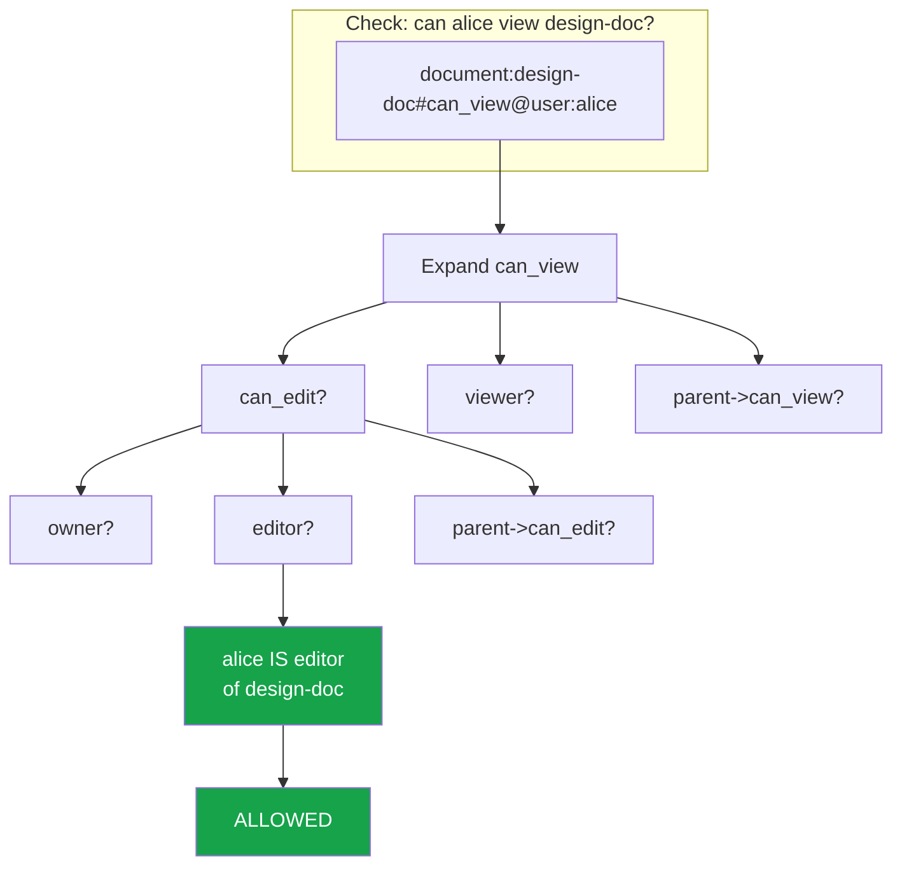
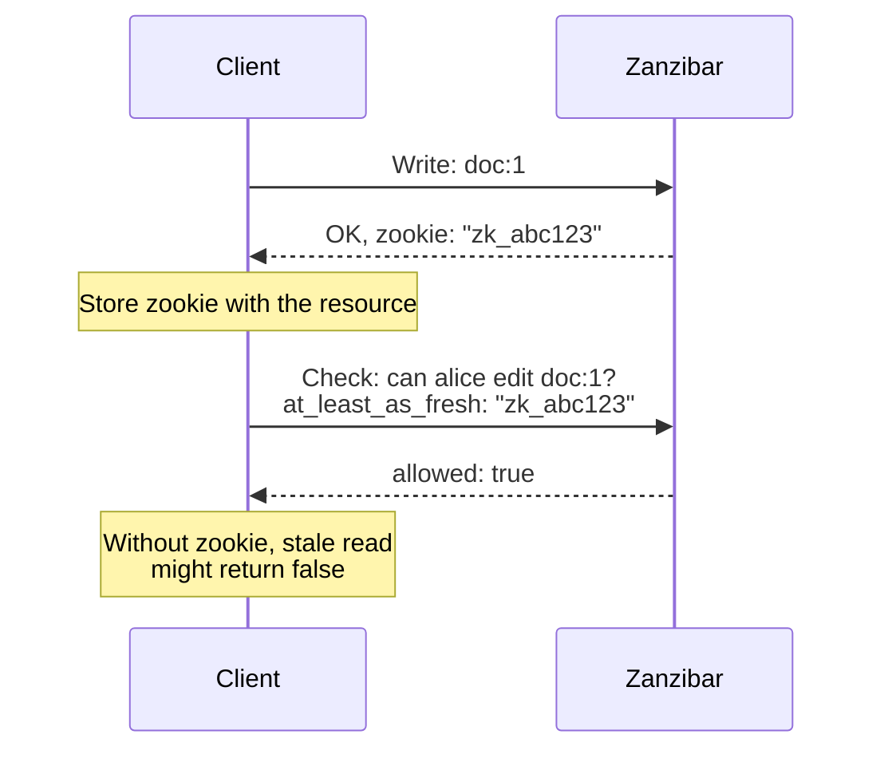

# Google Zanzibar

Zanzibar is Google's global authorization system, described in a 2019 paper. It provides consistent, fine-grained authorization for hundreds of Google services — Google Drive, YouTube, Google Cloud IAM, Google Maps, and many more. At the time of the paper, it handled over 10 million client queries per second at less than 10ms latency, with authorization data describing trillions of access control relationships.

Zanzibar's significance goes beyond Google. Its design has become the de facto standard for relationship-based access control (ReBAC), spawning multiple open-source implementations (SpiceDB, OpenFGA, Keto) and commercial products (Authzed, Auth0 FGA, Permit.io). If you are building a system where users share resources — documents, projects, organizations, folders — Zanzibar's model is likely the right foundation.

## Core Concepts

### Relation Tuples

The fundamental data structure in Zanzibar is the **relation tuple**. Every authorization fact is stored as a tuple:

```
object#relation@subject
```

| Component | Description | Example |
|---|---|---|
| Object | The resource being accessed | `document:quarterly-report` |
| Relation | The type of relationship | `editor` |
| Subject | Who has the relationship | `user:alice` |

```
// Alice is an editor of the quarterly report
document:quarterly-report#editor@user:alice

// Bob is a viewer of the quarterly report
document:quarterly-report#viewer@user:bob

// The engineering team members are viewers of the shared folder
folder:shared#viewer@team:engineering#member

// The quarterly report is in the shared folder
document:quarterly-report#parent@folder:shared
```

The last two examples show powerful features:

- **Userset subjects** (`team:engineering#member`) — the subject is not a single user but all users who are members of the engineering team
- **Hierarchical relationships** (`parent`) — the document inherits permissions from its parent folder

### Namespace Configuration

A namespace configuration defines the types of objects and the relations they can have. It is the schema of your authorization model.

```
// Namespace configuration (Zanzibar DSL)
name: "document"

relation { name: "owner" }
relation { name: "editor" }
relation { name: "viewer" }
relation { name: "parent"
  userset_rewrite {
    child { _this {} }
  }
}

// Computed relations — derived from other relations
relation { name: "can_edit"
  userset_rewrite {
    union {
      child { computed_userset { relation: "owner" } }
      child { computed_userset { relation: "editor" } }
      child { tuple_to_userset {
        tupleset { relation: "parent" }
        computed_userset { object: "folder", relation: "can_edit" }
      } }
    }
  }
}

relation { name: "can_view"
  userset_rewrite {
    union {
      child { computed_userset { relation: "can_edit" } }
      child { computed_userset { relation: "viewer" } }
      child { tuple_to_userset {
        tupleset { relation: "parent" }
        computed_userset { object: "folder", relation: "can_view" }
      } }
    }
  }
}
```

This configuration says:
- A document has owners, editors, viewers, and a parent folder
- `can_edit` = owner OR editor OR anyone who can_edit the parent folder
- `can_view` = anyone who can_edit OR viewer OR anyone who can_view the parent folder

### Permission Resolution



## Zanzibar APIs

Zanzibar exposes three core APIs:

### 1. Check API

The most frequently used API. Answers: "Does this subject have this relation to this object?"

```typescript
// Check: Can user:alice edit document:design-doc?
const result = await zanzibar.check({
  object: 'document:design-doc',
  relation: 'can_edit',
  subject: 'user:alice',
});
// result: { allowed: true, checked_at: Zookie('...') }
```

### 2. Expand API

Returns the full tree of why a permission is granted. Essential for debugging and auditing.

```typescript
// Expand: Who can view document:design-doc?
const tree = await zanzibar.expand({
  object: 'document:design-doc',
  relation: 'can_view',
});

/*
Result (userset tree):
{
  operation: 'union',
  children: [
    {
      // can_edit branch
      operation: 'union',
      children: [
        { leaf: { users: ['user:alice'] } },        // editor
        { leaf: { users: [] } },                      // owner (none)
        {
          // parent->can_edit
          operation: 'union',
          children: [...]
        }
      ]
    },
    { leaf: { users: ['user:bob'] } },               // viewer
    {
      // parent->can_view (inherited from folder)
      leaf: {
        users: ['user:charlie', 'user:dana']         // via team membership
      }
    }
  ]
}
*/
```

### 3. Read API (ListObjects / ListUsers)

Returns all objects a user can access, or all users who can access an object.

```typescript
// ListObjects: What documents can user:alice view?
const documents = await zanzibar.listObjects({
  subject: 'user:alice',
  relation: 'can_view',
  objectType: 'document',
});
// result: ['document:design-doc', 'document:roadmap', ...]

// ListUsers: Who can edit document:design-doc?
const users = await zanzibar.listUsers({
  object: 'document:design-doc',
  relation: 'can_edit',
  subjectType: 'user',
});
// result: ['user:alice', 'user:carol']
```

::: warning ListObjects Performance
ListObjects is inherently more expensive than Check because it must traverse the entire relationship graph. At scale, this API should be paginated, cached, and rate-limited. Google's paper notes that this is the most computationally expensive operation.
:::

## Consistency Model: Zookies

Zanzibar uses a consistency mechanism called "Zookies" (named after ZooKeeper tokens). When a relationship tuple is written, Zanzibar returns a Zookie — an opaque token representing a point in time. When performing a Check, the client can pass a Zookie to ensure the check reflects all writes up to that point.



This matters because Zanzibar is a globally distributed system. Without Zookies, you could write a permission and immediately get a stale read that says the permission does not exist (the "new enemy" problem).

```typescript
// Storing and using Zookies
class PermissionService {
  // When granting access, store the zookie
  async grantAccess(
    documentId: string,
    userId: string,
    relation: string
  ): Promise<void> {
    const { zookie } = await zanzibar.write({
      object: `document:${documentId}`,
      relation,
      subject: `user:${userId}`,
    });

    // Store zookie alongside the resource
    await db.query(
      'UPDATE documents SET authz_zookie = $1 WHERE id = $2',
      [zookie, documentId]
    );
  }

  // When checking access, use the stored zookie
  async canAccess(
    documentId: string,
    userId: string,
    relation: string
  ): Promise<boolean> {
    const doc = await db.query(
      'SELECT authz_zookie FROM documents WHERE id = $1',
      [documentId]
    );

    const { allowed } = await zanzibar.check({
      object: `document:${documentId}`,
      relation,
      subject: `user:${userId}`,
      consistency: {
        atLeastAsFresh: doc.rows[0]?.authz_zookie,
      },
    });

    return allowed;
  }
}
```

## Open-Source Implementations

### SpiceDB (by Authzed)

SpiceDB is the most mature open-source Zanzibar implementation. It supports the full Zanzibar model with a purpose-built schema language.

```
// SpiceDB schema definition
definition user {}

definition team {
    relation member: user
}

definition organization {
    relation admin: user
    relation member: user | team#member

    permission can_admin = admin
    permission can_view = admin + member
}

definition folder {
    relation org: organization
    relation editor: user | team#member
    relation viewer: user | team#member

    permission can_edit = editor + org->can_admin
    permission can_view = can_edit + viewer + org->can_view
}

definition document {
    relation parent: folder
    relation owner: user
    relation editor: user | team#member
    relation viewer: user | team#member

    permission can_edit = owner + editor + parent->can_edit
    permission can_view = can_edit + viewer + parent->can_view
    permission can_delete = owner + parent->can_edit
}
```

```typescript
// SpiceDB client usage (Node.js)
import { v1 } from '@authzed/authzed-node';

const client = v1.NewClient(
  'spicedb-token',
  'localhost:50051',
  v1.ClientSecurity.INSECURE_LOCALHOST_ALLOWED
);

// Write relationships
await client.writeRelationships(
  v1.WriteRelationshipsRequest.create({
    updates: [
      v1.RelationshipUpdate.create({
        operation: v1.RelationshipUpdate_Operation.TOUCH,
        relationship: v1.Relationship.create({
          resource: v1.ObjectReference.create({
            objectType: 'document',
            objectId: 'design-doc',
          }),
          relation: 'editor',
          subject: v1.SubjectReference.create({
            object: v1.ObjectReference.create({
              objectType: 'user',
              objectId: 'alice',
            }),
          }),
        }),
      }),
    ],
  })
);

// Check permission
const checkResult = await client.checkPermission(
  v1.CheckPermissionRequest.create({
    resource: v1.ObjectReference.create({
      objectType: 'document',
      objectId: 'design-doc',
    }),
    permission: 'can_edit',
    subject: v1.SubjectReference.create({
      object: v1.ObjectReference.create({
        objectType: 'user',
        objectId: 'alice',
      }),
    }),
  })
);

const allowed = checkResult.permissionship ===
  v1.CheckPermissionResponse_Permissionship.HAS_PERMISSION;
```

### OpenFGA (by Auth0/Okta)

OpenFGA is another popular implementation, backed by Auth0 (now Okta). It uses a slightly different schema syntax.

```yaml
# OpenFGA model (JSON/YAML format)
model
  schema 1.1

type user

type organization
  relations
    define admin: [user]
    define member: [user] or admin

type document
  relations
    define organization: [organization]
    define owner: [user]
    define editor: [user, organization#member]
    define viewer: [user, organization#member]
    define can_edit: owner or editor
    define can_view: can_edit or viewer
    define can_delete: owner
```

```go
// OpenFGA client usage (Go)
package main

import (
    "context"
    openfga "github.com/openfga/go-sdk/client"
)

func main() {
    client, _ := openfga.NewSdkClient(&openfga.ClientConfiguration{
        ApiUrl:  "http://localhost:8080",
        StoreId: "store-id",
    })

    // Write a relationship tuple
    body := openfga.ClientWriteRequest{
        Writes: []openfga.ClientTupleKey{
            {
                User:     "user:alice",
                Relation: "editor",
                Object:   "document:design-doc",
            },
        },
    }
    client.Write(context.Background()).Body(body).Execute()

    // Check permission
    checkBody := openfga.ClientCheckRequest{
        User:     "user:alice",
        Relation: "can_edit",
        Object:   "document:design-doc",
    }
    result, _ := client.Check(context.Background()).Body(checkBody).Execute()
    // result.GetAllowed() == true
}
```

### Implementation Comparison

| Feature | SpiceDB | OpenFGA | Ory Keto |
|---|---|---|---|
| Zanzibar fidelity | Very high | High | Medium |
| Schema language | Custom (zed) | JSON/DSL | Namespaces (OPL) |
| Consistency model | Full Zookies | Tokens | Basic |
| Storage backends | PostgreSQL, CockroachDB, Spanner, memdb | PostgreSQL, MySQL, SQLite | PostgreSQL, MySQL, SQLite |
| Watch API (streaming) | Yes | Yes | Yes |
| Performance | Excellent | Good | Good |
| Managed offering | Authzed | Auth0 FGA | No |
| CNCF status | Sandbox | Sandbox | N/A |
| Best for | High-scale, consistency-critical | Auth0/Okta integration, simplicity | Ory ecosystem users |

## Modeling Real-World Scenarios

### Scenario 1: Google Drive-like Sharing

```
definition user {}

definition group {
    relation member: user | group#member
}

definition folder {
    relation owner: user
    relation editor: user | group#member
    relation viewer: user | group#member
    relation parent: folder

    permission can_edit = owner + editor + parent->can_edit
    permission can_view = can_edit + viewer + parent->can_view
    permission can_share = owner + parent->can_share
    permission can_delete = owner
}

definition file {
    relation parent: folder
    relation owner: user
    relation editor: user | group#member
    relation viewer: user | group#member

    permission can_edit = owner + editor + parent->can_edit
    permission can_view = can_edit + viewer + parent->can_view
    permission can_delete = owner + parent->can_edit
    permission can_share = owner
}
```

### Scenario 2: GitHub-like Repository Access

```
definition user {}

definition organization {
    relation owner: user
    relation member: user

    permission can_admin = owner
    permission can_create_repo = owner + member
}

definition team {
    relation org: organization
    relation maintainer: user
    relation member: user

    permission can_manage = maintainer + org->can_admin
}

definition repository {
    relation org: organization
    relation admin: user | team#member
    relation writer: user | team#member
    relation reader: user | team#member | organization#member

    permission can_admin = admin + org->can_admin
    permission can_push = can_admin + writer
    permission can_read = can_push + reader
    permission can_delete = org->can_admin
}
```

### Scenario 3: Multi-Tenant SaaS

```
definition user {}

definition tenant {
    relation owner: user
    relation admin: user
    relation member: user

    permission can_admin = owner + admin
    permission can_access = can_admin + member
}

definition project {
    relation tenant: tenant
    relation lead: user
    relation contributor: user
    relation viewer: user

    permission can_manage = lead + tenant->can_admin
    permission can_edit = can_manage + contributor
    permission can_view = can_edit + viewer + tenant->can_access
}

definition resource {
    relation project: project
    relation creator: user
    relation editor: user

    permission can_edit = creator + editor + project->can_manage
    permission can_view = can_edit + project->can_view
    permission can_delete = creator + project->can_manage
}
```

## Performance Considerations

### Caching Strategy

Zanzibar uses aggressive caching. Check results are cached with a TTL, and the Watch API invalidates caches when relationships change.

```typescript
// Application-level caching for authorization checks
import { LRUCache } from 'lru-cache';

const authzCache = new LRUCache<string, boolean>({
  max: 10_000,
  ttl: 30_000,  // 30-second TTL
});

async function cachedCheck(
  subject: string,
  relation: string,
  object: string
): Promise<boolean> {
  const cacheKey = `${subject}:${relation}:${object}`;

  const cached = authzCache.get(cacheKey);
  if (cached !== undefined) return cached;

  const { allowed } = await spicedb.checkPermission({
    subject,
    permission: relation,
    resource: object,
  });

  authzCache.set(cacheKey, allowed);
  return allowed;
}

// Invalidate cache when relationships change
async function onRelationshipChange(
  subject: string,
  relation: string,
  object: string
): Promise<void> {
  // Invalidate all cache entries for the affected object
  // (conservative but safe)
  for (const key of authzCache.keys()) {
    if (key.includes(object)) {
      authzCache.delete(key);
    }
  }
}
```

::: danger Cache Invalidation Is Hard
The tricky part of caching Zanzibar checks is transitive invalidation. If you change team membership, every document accessible through that team must be invalidated. SpiceDB's Watch API helps, but at scale this requires careful design.
:::

### Batch Checks

When rendering a list of resources, do not check permissions one at a time:

```typescript
// BAD: N+1 authorization checks
const documents = await db.query('SELECT * FROM documents');
const results = [];
for (const doc of documents) {
  const allowed = await spicedb.check(userId, 'can_view', `document:${doc.id}`);
  if (allowed) results.push(doc);
}

// GOOD: Batch check or LookupResources
const accessibleDocs = await spicedb.lookupResources({
  subject: `user:${userId}`,
  permission: 'can_view',
  resourceType: 'document',
});

const documents = await db.query(
  'SELECT * FROM documents WHERE id = ANY($1)',
  [accessibleDocs.map(d => d.resourceId)]
);
```

## Deploying SpiceDB

```yaml
# docker-compose.yml for SpiceDB
version: '3.8'
services:
  spicedb:
    image: authzed/spicedb:latest
    command: serve
    ports:
      - "50051:50051"  # gRPC
      - "8443:8443"    # HTTP/REST
      - "9090:9090"    # Metrics
    environment:
      - SPICEDB_GRPC_PRESHARED_KEY=${SPICEDB_KEY}
      - SPICEDB_DATASTORE_ENGINE=postgres
      - SPICEDB_DATASTORE_CONN_URI=postgres://spicedb:${DB_PASSWORD}@db:5432/spicedb?sslmode=disable
    depends_on:
      - migrate

  migrate:
    image: authzed/spicedb:latest
    command: migrate head
    environment:
      - SPICEDB_DATASTORE_ENGINE=postgres
      - SPICEDB_DATASTORE_CONN_URI=postgres://spicedb:${DB_PASSWORD}@db:5432/spicedb?sslmode=disable
    depends_on:
      - db

  db:
    image: postgres:16
    environment:
      POSTGRES_USER: spicedb
      POSTGRES_PASSWORD: ${DB_PASSWORD}
      POSTGRES_DB: spicedb
    volumes:
      - pgdata:/var/lib/postgresql/data

volumes:
  pgdata:
```

## Further Reading

- [Authorization Patterns Overview](/security/authorization/) — Foundations of authorization
- [RBAC vs ABAC vs ReBAC](/security/authorization/rbac-abac-rebac) — When to choose ReBAC over alternatives
- [Policy Engines (OPA & Cedar)](/security/authorization/policy-engines) — ABAC-oriented policy engines
- [Multi-Tenancy](/architecture-patterns/multi-tenancy/) — Tenant-scoped authorization
- "Zanzibar: Google's Consistent, Global Authorization System" (USENIX ATC 2019)
- SpiceDB documentation (authzed.com/docs)
- OpenFGA documentation (openfga.dev/docs)
- Authzed Playground (play.authzed.com) — interactive schema modeling
