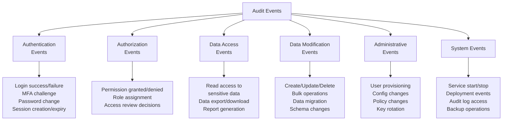
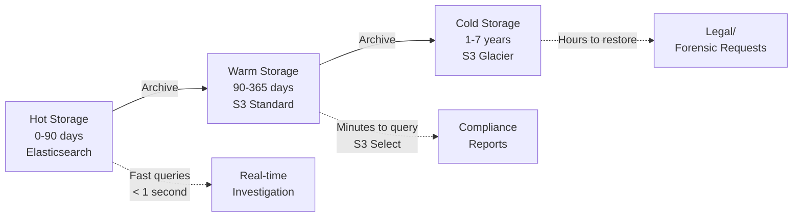

# Audit Logging Patterns

Audit logging is the practice of creating an immutable, chronological record of security-relevant events in a system. Unlike application logs (which help developers debug), audit logs exist to answer the question: "Who did what, to which resource, when, and from where?" They are the foundation of compliance evidence, forensic investigation, and accountability. Every major compliance framework — SOC 2, GDPR, PCI DSS, HIPAA, ISO 27001 — requires audit logging, and all of them have specific requirements about what to log, how long to retain it, and how to protect it from tampering.

The difference between "we have logs" and "we have audit logs" is the difference between a pile of timestamped text and a trustworthy, queryable record that can withstand legal scrutiny.

## What to Audit

### The Universal Audit Event Categories



### Detailed Event Catalog

| Category | Event | Compliance Requirement |
|----------|-------|----------------------|
| **Authentication** | Successful login | SOC 2 CC6.1, PCI DSS 10.2.4 |
| | Failed login attempt | SOC 2 CC6.1, PCI DSS 10.2.4 |
| | MFA challenge (pass/fail) | SOC 2 CC6.1 |
| | Password change/reset | PCI DSS 10.2.5, SOC 2 CC6.1 |
| | Account lockout | PCI DSS 10.2.4 |
| | Session created/expired | SOC 2 CC6.1 |
| | API key created/revoked | SOC 2 CC6.1 |
| **Authorization** | Permission denied | SOC 2 CC6.1, PCI DSS 10.2.4 |
| | Role assignment changed | PCI DSS 10.2.5, SOC 2 CC6.2 |
| | Privilege escalation | SOC 2 CC6.1 |
| **Data Access** | Read access to sensitive data (PII, PHI, PAN) | GDPR Art. 30, PCI DSS 10.2.1, HIPAA |
| | Data export/download | GDPR Art. 30, SOC 2 CC6.1 |
| | Search/query of sensitive data | PCI DSS 10.2.1 |
| **Data Modification** | Record created/updated/deleted | SOC 2 CC8.1, GDPR Art. 30 |
| | Bulk data operation | SOC 2 CC8.1 |
| | Schema migration | SOC 2 CC8.1 |
| **Administrative** | User account created/deleted | PCI DSS 10.2.5, SOC 2 CC6.2 |
| | System configuration changed | PCI DSS 10.2.5, SOC 2 CC8.1 |
| | Security policy modified | SOC 2 CC6.1 |
| | Encryption key rotated | PCI DSS 10.2.5 |
| **System** | Audit log accessed | PCI DSS 10.2.3 |
| | Audit logging started/stopped | PCI DSS 10.2.6 |
| | Service deployment | SOC 2 CC8.1 |
| | Backup created/restored | SOC 2 CC7.1 |

::: warning Log Audit Log Access
Accessing the audit log itself must be audited (PCI DSS 10.2.3). This creates a meta-audit trail — if someone is trying to cover their tracks by reading the audit log, that access is itself logged.
:::

## Structured Audit Events

### Audit Event Schema

Every audit event should follow a consistent, machine-parseable schema:

```typescript
interface AuditEvent {
  // Identity
  eventId: string;           // Globally unique event ID (UUID v7)
  timestamp: string;         // ISO 8601 with timezone (UTC)
  version: string;           // Schema version (e.g., "1.0")

  // Actor
  actor: {
    id: string;              // User ID, service account ID, or "system"
    type: "user" | "service" | "system" | "anonymous";
    email?: string;          // For user actors
    ipAddress?: string;      // Source IP
    userAgent?: string;      // Browser/client info
    sessionId?: string;      // Session identifier
    mfaVerified?: boolean;   // Was MFA used for this session?
  };

  // Action
  action: {
    type: string;            // "create" | "read" | "update" | "delete" | "login" | "export" | ...
    category: string;        // "authentication" | "data_access" | "admin" | ...
    description: string;     // Human-readable description
  };

  // Target
  target: {
    type: string;            // "user" | "order" | "payment" | "config" | ...
    id: string;              // Resource identifier
    name?: string;           // Human-readable resource name
    attributes?: Record<string, unknown>; // Additional context
  };

  // Result
  result: {
    status: "success" | "failure" | "denied";
    reason?: string;         // Why it failed or was denied
    statusCode?: number;     // HTTP status code if applicable
  };

  // Context
  context: {
    service: string;         // Which service generated this event
    environment: string;     // "production" | "staging"
    requestId?: string;      // Correlation ID for distributed tracing
    clientId?: string;       // OAuth client ID
  };

  // Change details (for modification events)
  changes?: {
    before?: Record<string, unknown>;
    after?: Record<string, unknown>;
    fields?: string[];       // Which fields changed
  };
}
```

### Example Audit Events

```json
{
  "eventId": "019536a4-7e3d-7b1a-8c4d-2a1b3c4d5e6f",
  "timestamp": "2026-03-20T14:23:45.123Z",
  "version": "1.0",
  "actor": {
    "id": "user-42",
    "type": "user",
    "email": "alice@company.com",
    "ipAddress": "203.0.113.42",
    "userAgent": "Mozilla/5.0...",
    "sessionId": "sess-abc123",
    "mfaVerified": true
  },
  "action": {
    "type": "update",
    "category": "data_modification",
    "description": "Updated user profile"
  },
  "target": {
    "type": "user_profile",
    "id": "user-99",
    "name": "Bob Williams"
  },
  "result": {
    "status": "success",
    "statusCode": 200
  },
  "context": {
    "service": "user-service",
    "environment": "production",
    "requestId": "req-xyz789"
  },
  "changes": {
    "before": { "role": "viewer" },
    "after": { "role": "admin" },
    "fields": ["role"]
  }
}
```

```json
{
  "eventId": "019536a4-8f2e-7c3b-9d5e-3b2c4d5e6f7a",
  "timestamp": "2026-03-20T14:24:01.456Z",
  "version": "1.0",
  "actor": {
    "id": "user-77",
    "type": "user",
    "email": "mallory@external.com",
    "ipAddress": "198.51.100.99",
    "mfaVerified": false
  },
  "action": {
    "type": "read",
    "category": "data_access",
    "description": "Attempted to access payment records"
  },
  "target": {
    "type": "payment_record",
    "id": "pay-5001"
  },
  "result": {
    "status": "denied",
    "reason": "Insufficient permissions: requires role 'payment_admin'"
  },
  "context": {
    "service": "payment-service",
    "environment": "production",
    "requestId": "req-def456"
  }
}
```

## Audit Logging Implementation

### Application-Level Audit Logger

```python
# Audit logging service
import uuid
import json
from datetime import datetime, timezone
from typing import Any

class AuditLogger:
    def __init__(self, service_name: str, environment: str):
        self.service = service_name
        self.environment = environment
        self.transport = AuditTransport()  # Sends to immutable store

    def log(
        self,
        actor_id: str,
        actor_type: str,
        action_type: str,
        action_category: str,
        description: str,
        target_type: str,
        target_id: str,
        result_status: str,
        *,
        actor_ip: str | None = None,
        actor_email: str | None = None,
        session_id: str | None = None,
        mfa_verified: bool = False,
        request_id: str | None = None,
        changes_before: dict | None = None,
        changes_after: dict | None = None,
        result_reason: str | None = None,
        target_name: str | None = None,
    ) -> str:
        event_id = str(uuid.uuid7())

        event = {
            "eventId": event_id,
            "timestamp": datetime.now(timezone.utc).isoformat(),
            "version": "1.0",
            "actor": {
                "id": actor_id,
                "type": actor_type,
                "email": actor_email,
                "ipAddress": actor_ip,
                "sessionId": session_id,
                "mfaVerified": mfa_verified,
            },
            "action": {
                "type": action_type,
                "category": action_category,
                "description": description,
            },
            "target": {
                "type": target_type,
                "id": target_id,
                "name": target_name,
            },
            "result": {
                "status": result_status,
                "reason": result_reason,
            },
            "context": {
                "service": self.service,
                "environment": self.environment,
                "requestId": request_id,
            },
        }

        if changes_before or changes_after:
            changed_fields = []
            if changes_before and changes_after:
                changed_fields = [
                    k for k in changes_after
                    if changes_before.get(k) != changes_after.get(k)
                ]
            event["changes"] = {
                "before": changes_before,
                "after": changes_after,
                "fields": changed_fields,
            }

        # Send to immutable audit store
        self.transport.send(event)

        return event_id

# Usage
audit = AuditLogger(service_name="user-service", environment="production")

# Log a role change
audit.log(
    actor_id="user-42",
    actor_type="user",
    actor_email="alice@company.com",
    actor_ip="203.0.113.42",
    action_type="update",
    action_category="admin",
    description="Changed user role",
    target_type="user",
    target_id="user-99",
    target_name="Bob Williams",
    result_status="success",
    changes_before={"role": "viewer"},
    changes_after={"role": "admin"},
    mfa_verified=True,
)
```

### Middleware-Based Audit Logging

```python
# FastAPI middleware for automatic audit logging
from fastapi import Request, Response
from starlette.middleware.base import BaseHTTPMiddleware

class AuditMiddleware(BaseHTTPMiddleware):
    """Automatically log all API requests to the audit trail."""

    # Endpoints that access sensitive data
    SENSITIVE_ENDPOINTS = {
        "/api/users": "user_data",
        "/api/payments": "payment_data",
        "/api/admin": "admin_action",
    }

    async def dispatch(self, request: Request, call_next):
        # Capture request details
        actor = get_current_user(request)
        request_id = request.headers.get("x-request-id", str(uuid.uuid4()))

        # Process the request
        response = await call_next(request)

        # Determine if this endpoint requires audit logging
        endpoint_category = self._match_sensitive_endpoint(request.url.path)
        if endpoint_category:
            audit.log(
                actor_id=actor.id if actor else "anonymous",
                actor_type="user" if actor else "anonymous",
                actor_ip=request.client.host,
                action_type=request.method.lower(),
                action_category=endpoint_category,
                description=f"{request.method} {request.url.path}",
                target_type=endpoint_category,
                target_id=self._extract_resource_id(request.url.path),
                result_status="success" if response.status_code < 400 else "failure",
                request_id=request_id,
                session_id=actor.session_id if actor else None,
            )

        return response

    def _match_sensitive_endpoint(self, path: str) -> str | None:
        for prefix, category in self.SENSITIVE_ENDPOINTS.items():
            if path.startswith(prefix):
                return category
        return None

    def _extract_resource_id(self, path: str) -> str:
        parts = path.strip("/").split("/")
        return parts[-1] if len(parts) > 2 else "collection"
```

## Immutable Audit Logs

### Why Immutability Matters

If an attacker can modify audit logs after the fact, the logs are worthless for forensics. If an insider can delete the record of their unauthorized access, accountability is lost. Audit logs must be **append-only** — once written, events cannot be modified or deleted.

### Storage Strategies for Immutability

| Strategy | Implementation | Tamper Resistance |
|----------|---------------|-------------------|
| **Write-once storage** | S3 Object Lock, WORM storage | High — cloud provider enforces immutability |
| **Separate account** | Audit logs stored in a dedicated AWS account | High — compromising app does not compromise logs |
| **Cryptographic chaining** | Each event includes hash of previous event (blockchain-like) | Very high — any modification breaks the chain |
| **Digital signatures** | Each event is signed by the audit service | High — modification detectable |
| **Database append-only** | PostgreSQL with INSERT-only permissions, no UPDATE/DELETE | Medium — DBA could bypass |

### S3 Object Lock Configuration

```hcl
# Terraform: Immutable audit log storage
resource "aws_s3_bucket" "audit_logs" {
  bucket = "company-audit-logs-production"

  tags = {
    Purpose    = "audit-logging"
    Compliance = "soc2,pci-dss,gdpr"
    Immutable  = "true"
  }
}

# Enable versioning (required for Object Lock)
resource "aws_s3_bucket_versioning" "audit_logs" {
  bucket = aws_s3_bucket.audit_logs.id
  versioning_configuration {
    status = "Enabled"
  }
}

# Object Lock — COMPLIANCE mode prevents even root from deleting
resource "aws_s3_bucket_object_lock_configuration" "audit_logs" {
  bucket = aws_s3_bucket.audit_logs.id

  rule {
    default_retention {
      mode = "COMPLIANCE"  # Cannot be overridden by any user, including root
      days = 365           # PCI DSS requires 1 year retention
    }
  }
}

# Encrypt at rest
resource "aws_s3_bucket_server_side_encryption_configuration" "audit_logs" {
  bucket = aws_s3_bucket.audit_logs.id

  rule {
    apply_server_side_encryption_by_default {
      sse_algorithm     = "aws:kms"
      kms_master_key_id = aws_kms_key.audit_logs.arn
    }
  }
}

# Block public access
resource "aws_s3_bucket_public_access_block" "audit_logs" {
  bucket = aws_s3_bucket.audit_logs.id

  block_public_acls       = true
  block_public_policy     = true
  ignore_public_acls      = true
  restrict_public_buckets = true
}

# Cross-account access policy — only the audit service can write
resource "aws_s3_bucket_policy" "audit_logs" {
  bucket = aws_s3_bucket.audit_logs.id

  policy = jsonencode({
    Version = "2012-10-17"
    Statement = [
      {
        Sid       = "AuditServiceWriteOnly"
        Effect    = "Allow"
        Principal = { AWS = "arn:aws:iam::role/audit-service" }
        Action    = ["s3:PutObject"]
        Resource  = "${aws_s3_bucket.audit_logs.arn}/*"
      },
      {
        Sid       = "SecurityTeamReadOnly"
        Effect    = "Allow"
        Principal = { AWS = "arn:aws:iam::role/security-analyst" }
        Action    = ["s3:GetObject", "s3:ListBucket"]
        Resource  = [
          aws_s3_bucket.audit_logs.arn,
          "${aws_s3_bucket.audit_logs.arn}/*"
        ]
      },
      {
        Sid       = "DenyDeletion"
        Effect    = "Deny"
        Principal = "*"
        Action    = ["s3:DeleteObject", "s3:DeleteObjectVersion"]
        Resource  = "${aws_s3_bucket.audit_logs.arn}/*"
      }
    ]
  })
}
```

### Cryptographic Chaining for Tamper Detection

```python
# Hash-chaining for tamper-evident audit logs
import hashlib
import json

class TamperEvidentAuditLog:
    def __init__(self):
        self.previous_hash = "0" * 64  # Genesis hash

    def append_event(self, event: dict) -> dict:
        """Append an event with cryptographic chain linking."""
        # Include the previous hash in the event
        event["_chain"] = {
            "previousHash": self.previous_hash,
            "sequence": self._get_next_sequence(),
        }

        # Compute hash of this event (including the previous hash)
        event_bytes = json.dumps(event, sort_keys=True).encode()
        current_hash = hashlib.sha256(event_bytes).hexdigest()
        event["_chain"]["hash"] = current_hash

        # Store the event
        self._store(event)

        # Update chain
        self.previous_hash = current_hash

        return event

    def verify_chain(self, events: list[dict]) -> dict:
        """Verify the integrity of the audit log chain."""
        previous_hash = "0" * 64
        broken_links = []

        for i, event in enumerate(events):
            # Check that the event references the correct previous hash
            if event["_chain"]["previousHash"] != previous_hash:
                broken_links.append({
                    "index": i,
                    "eventId": event["eventId"],
                    "expected_previous": previous_hash,
                    "actual_previous": event["_chain"]["previousHash"],
                })

            # Verify this event's hash
            stored_hash = event["_chain"].pop("hash")
            computed_hash = hashlib.sha256(
                json.dumps(event, sort_keys=True).encode()
            ).hexdigest()
            event["_chain"]["hash"] = stored_hash

            if computed_hash != stored_hash:
                broken_links.append({
                    "index": i,
                    "eventId": event["eventId"],
                    "issue": "Event content has been modified",
                })

            previous_hash = stored_hash

        return {
            "chain_valid": len(broken_links) == 0,
            "events_checked": len(events),
            "broken_links": broken_links,
        }
```

::: danger Separate Your Audit Logs From Application Logs
Audit logs must be stored in a system that the application cannot modify. If an attacker compromises your application, they should not be able to erase their tracks. Store audit logs in a separate account, use write-once storage, and restrict access to the security team only.
:::

## Querying Audit Trails

### Common Audit Queries

| Investigation | Query Pattern |
|--------------|--------------|
| "What did user X do last week?" | Filter by `actor.id`, time range |
| "Who accessed record Y?" | Filter by `target.id`, action type "read" |
| "Show all failed login attempts" | Filter by `action.type = "login"`, `result.status = "failure"` |
| "What changed in production yesterday?" | Filter by `action.category = "data_modification"`, time range, environment |
| "Who changed this configuration?" | Filter by `target.type = "config"`, `action.type = "update"` |
| "Show all admin actions" | Filter by `action.category = "admin"` |
| "Show all data exports" | Filter by `action.type = "export"` |

### Query Implementation

```python
# Audit log query service
from datetime import datetime
from typing import Optional

class AuditQueryService:
    def query(
        self,
        actor_id: Optional[str] = None,
        target_type: Optional[str] = None,
        target_id: Optional[str] = None,
        action_type: Optional[str] = None,
        action_category: Optional[str] = None,
        result_status: Optional[str] = None,
        start_time: Optional[datetime] = None,
        end_time: Optional[datetime] = None,
        limit: int = 100,
        offset: int = 0,
    ) -> dict:
        """Query audit events with filters."""
        # Build Elasticsearch query
        must_clauses = []

        if actor_id:
            must_clauses.append({"term": {"actor.id": actor_id}})
        if target_type:
            must_clauses.append({"term": {"target.type": target_type}})
        if target_id:
            must_clauses.append({"term": {"target.id": target_id}})
        if action_type:
            must_clauses.append({"term": {"action.type": action_type}})
        if action_category:
            must_clauses.append({"term": {"action.category": action_category}})
        if result_status:
            must_clauses.append({"term": {"result.status": result_status}})
        if start_time or end_time:
            range_clause = {"range": {"timestamp": {}}}
            if start_time:
                range_clause["range"]["timestamp"]["gte"] = start_time.isoformat()
            if end_time:
                range_clause["range"]["timestamp"]["lte"] = end_time.isoformat()
            must_clauses.append(range_clause)

        query = {
            "query": {"bool": {"must": must_clauses}},
            "sort": [{"timestamp": "desc"}],
            "from": offset,
            "size": limit,
        }

        return self.elasticsearch.search(index="audit-*", body=query)

    def get_user_activity_report(
        self,
        user_id: str,
        start_date: datetime,
        end_date: datetime,
    ) -> dict:
        """Generate a user activity report for compliance."""
        events = self.query(
            actor_id=user_id,
            start_time=start_date,
            end_time=end_date,
            limit=10000,
        )

        return {
            "user_id": user_id,
            "period": {
                "start": start_date.isoformat(),
                "end": end_date.isoformat(),
            },
            "total_events": len(events),
            "by_category": self._group_by(events, "action.category"),
            "by_result": self._group_by(events, "result.status"),
            "sensitive_access": [
                e for e in events
                if e["target"]["type"] in ("payment_data", "pii", "phi")
            ],
            "failed_actions": [
                e for e in events
                if e["result"]["status"] in ("failure", "denied")
            ],
        }
```

## Retention Requirements

| Framework | Minimum Retention | Immediately Available |
|-----------|------------------|-----------------------|
| **PCI DSS** | 12 months | 3 months |
| **SOC 2** | 12 months (typical) | Full period |
| **GDPR** | As long as necessary for the purpose | N/A |
| **HIPAA** | 6 years | Full period |
| **SOX** | 7 years | Full period |

### Tiered Storage Strategy



## Audit Logging Anti-Patterns

| Anti-Pattern | Problem | Fix |
|-------------|---------|-----|
| Logging PII in plain text | Audit logs become a data breach target | Log pseudonymized identifiers; mask sensitive fields |
| Logging everything | Massive volume, high cost, hard to query | Log security-relevant events only; use event catalog |
| Logging too little | Gaps in the audit trail | Follow the event catalog; validate completeness |
| Mutable storage | Logs can be tampered with | Write-once storage, cryptographic chaining |
| Same account as application | Compromised app = compromised logs | Separate AWS account for audit logs |
| No structured format | Impossible to query at scale | Use consistent JSON schema |
| No retention policy | Logs grow forever or are deleted too soon | Define retention per compliance framework |
| Not logging log access | Cannot detect insider threats reviewing audit logs | Audit the audit system (PCI DSS 10.2.3) |

::: tip Test Your Audit Logging
Periodically run a tabletop exercise: "User X's account was compromised last Tuesday. Reconstruct everything they did for the past 30 days." If your audit logs cannot answer this question comprehensively, you have gaps to fill.
:::

## Further Reading

- [Compliance Overview](/security/compliance/) — broader compliance landscape
- [SOC 2 for Engineers](/security/compliance/soc2) — SOC 2 logging requirements (CC7)
- [PCI DSS Essentials](/security/compliance/pci-dss) — PCI DSS Requirement 10 in depth
- [GDPR Engineering](/security/compliance/gdpr-engineering) — audit logging for GDPR compliance
- [Observability](/infrastructure/observability/) — application logging and monitoring (distinct from audit logging)
- OWASP Logging Cheat Sheet — owasp.org/cheatsheets/Logging_Cheat_Sheet
- CIS Controls — Control 8: Audit Log Management
