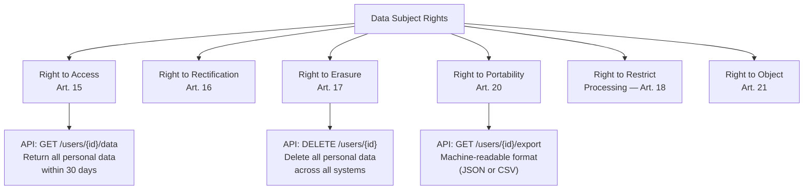
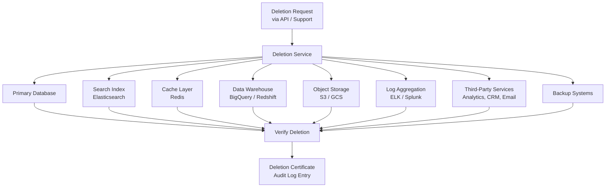
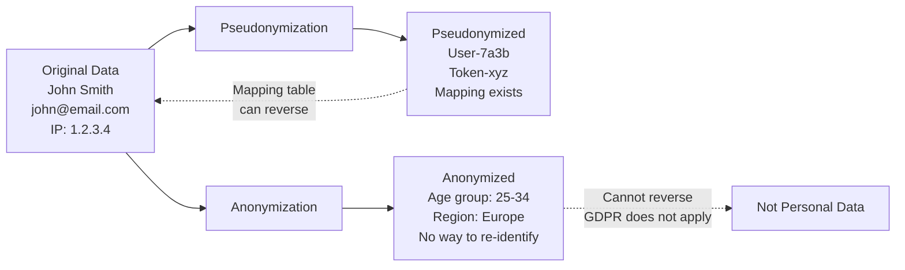

# GDPR Engineering

The General Data Protection Regulation (GDPR) is the EU's data protection law that came into effect on May 25, 2018. It applies to any organization that processes personal data of EU residents — regardless of where the organization is based. For engineers, GDPR is not a legal document to be filed away. It is a set of requirements that directly affect system architecture, database design, API design, data pipelines, and operational procedures.

The fines are not hypothetical. Amazon was fined $887M (2021). Meta was fined $1.3B (2023). These are not edge cases — they are the result of engineering decisions that failed to respect data protection requirements. Building GDPR compliance into your architecture from the start is orders of magnitude cheaper than retrofitting it after a regulator comes calling.

## GDPR Core Concepts for Engineers

### What is Personal Data?

Personal data is any information that can identify a person, directly or indirectly:

| Category | Examples | Engineering Implication |
|----------|----------|----------------------|
| **Direct identifiers** | Name, email, phone, SSN | Must be encryptable and deletable |
| **Indirect identifiers** | IP address, device ID, cookie ID | Often overlooked; still personal data |
| **Sensitive data** | Health data, biometrics, religion, political views | Requires explicit consent; additional controls |
| **Pseudonymized data** | User ID (without mapping table) | Still personal data under GDPR |
| **Anonymized data** | Aggregated statistics (truly irreversible) | NOT personal data; GDPR does not apply |

::: warning IP Addresses Are Personal Data
Under GDPR, even dynamic IP addresses are personal data (EU Court of Justice, Breyer v. Germany, 2016). If your access logs contain IP addresses, those logs are subject to GDPR requirements including retention limits and deletion obligations.
:::

### The Six Lawful Bases for Processing

You must have a legal basis to process personal data. The most relevant for engineers:

| Basis | When to Use | Engineering Impact |
|-------|-------------|-------------------|
| **Consent** | User explicitly opts in (e.g., marketing emails) | Must track consent per purpose; must be revocable |
| **Contract** | Processing needed to fulfill a contract (e.g., shipping address for delivery) | Minimal data needed; limited to contractual purpose |
| **Legitimate Interest** | Business need that does not override user rights (e.g., fraud detection) | Must document the balancing test |
| **Legal Obligation** | Required by law (e.g., tax records) | Retention periods may override deletion requests |

### Key Data Subject Rights

These rights translate directly into engineering requirements:



## Right to Be Forgotten (Art. 17)

### The Engineering Challenge

When a user requests deletion, you must remove their personal data from **every system** — primary databases, replicas, caches, backups, log files, search indexes, analytics systems, third-party services, and data warehouses. This is the single most architecturally impactful GDPR requirement.

### Deletion Architecture



### Implementation

```python
# GDPR deletion service
from dataclasses import dataclass, field
from datetime import datetime
from enum import Enum
import logging

logger = logging.getLogger(__name__)

class DeletionStatus(Enum):
    PENDING = "pending"
    IN_PROGRESS = "in_progress"
    COMPLETED = "completed"
    FAILED = "failed"
    PARTIALLY_COMPLETED = "partially_completed"

@dataclass
class DeletionTarget:
    system: str
    status: DeletionStatus = DeletionStatus.PENDING
    completed_at: datetime | None = None
    error: str | None = None

@dataclass
class DeletionRequest:
    user_id: str
    requested_at: datetime
    requested_by: str  # "user" or "support_agent_id"
    legal_basis: str   # "user_request" or "retention_expired"
    targets: list[DeletionTarget] = field(default_factory=list)
    status: DeletionStatus = DeletionStatus.PENDING

class GDPRDeletionService:
    # All systems that may contain personal data
    DELETION_TARGETS = [
        "primary_database",
        "read_replicas",
        "search_index",
        "cache_layer",
        "data_warehouse",
        "object_storage",
        "log_aggregation",
        "analytics_service",
        "email_service",
        "crm_system",
    ]

    def create_deletion_request(
        self,
        user_id: str,
        requested_by: str = "user",
    ) -> DeletionRequest:
        request = DeletionRequest(
            user_id=user_id,
            requested_at=datetime.utcnow(),
            requested_by=requested_by,
            legal_basis="user_request",
            targets=[
                DeletionTarget(system=target)
                for target in self.DELETION_TARGETS
            ],
        )

        # Log the request (audit trail)
        self.audit_log.record(
            event="gdpr_deletion_requested",
            user_id=user_id,
            requested_by=requested_by,
        )

        # Begin async deletion process
        self.queue.enqueue("gdpr_deletion", request)

        return request

    def execute_deletion(self, request: DeletionRequest):
        """Execute deletion across all systems."""
        request.status = DeletionStatus.IN_PROGRESS

        for target in request.targets:
            try:
                self._delete_from_system(request.user_id, target.system)
                target.status = DeletionStatus.COMPLETED
                target.completed_at = datetime.utcnow()
                logger.info(
                    f"Deleted user {request.user_id} from {target.system}"
                )
            except Exception as e:
                target.status = DeletionStatus.FAILED
                target.error = str(e)
                logger.error(
                    f"Failed to delete user {request.user_id} "
                    f"from {target.system}: {e}"
                )

        # Determine overall status
        statuses = {t.status for t in request.targets}
        if statuses == {DeletionStatus.COMPLETED}:
            request.status = DeletionStatus.COMPLETED
        elif DeletionStatus.FAILED in statuses:
            request.status = DeletionStatus.PARTIALLY_COMPLETED
        # Retry failed targets or alert operations team

    def _delete_from_system(self, user_id: str, system: str):
        """Dispatch deletion to specific system handler."""
        handlers = {
            "primary_database": self._delete_from_db,
            "search_index": self._delete_from_elasticsearch,
            "cache_layer": self._delete_from_redis,
            "data_warehouse": self._delete_from_warehouse,
            # ... additional handlers
        }
        handler = handlers.get(system)
        if handler:
            handler(user_id)
```

### Handling Backups

Backups are the hardest part of GDPR deletion. You cannot selectively delete data from a backup without restoring, modifying, and re-creating it.

| Strategy | Approach | Trade-offs |
|----------|----------|-----------|
| **Crypto-shredding** | Encrypt user data with a per-user key; delete the key to make data irrecoverable | Requires encryption architecture; most practical for backups |
| **Backup expiration** | Keep backups for a short retention period (e.g., 30 days) | Simple but limits disaster recovery capability |
| **Deletion log** | Maintain a list of deleted user IDs; filter on restore | Data exists in backup but never surfaces |
| **Selective restore** | When restoring, filter out deleted users | Adds complexity to disaster recovery process |

::: tip Crypto-Shredding is the Right Answer
For most systems, crypto-shredding is the most practical approach. Encrypt each user's data with a unique key stored in a key management system. When the user requests deletion, delete the key. The encrypted data in backups becomes mathematically irrecoverable. This satisfies GDPR without requiring backup manipulation.
:::

## Data Portability (Art. 20)

### What Users Can Request

Users have the right to receive their personal data in a "structured, commonly used and machine-readable format." They can also request that you transmit this data directly to another service provider.

### Export API Design

```python
# Data portability export endpoint
from fastapi import APIRouter, BackgroundTasks
from pydantic import BaseModel

router = APIRouter()

class ExportRequest(BaseModel):
    format: str = "json"  # "json" or "csv"
    include_sections: list[str] = [
        "profile", "orders", "activity", "preferences"
    ]

@router.post("/api/v1/users/{user_id}/export")
async def request_data_export(
    user_id: str,
    request: ExportRequest,
    background_tasks: BackgroundTasks,
):
    """
    GDPR Art. 20 — Data portability.
    Generate a machine-readable export of all user data.
    Must be completed within 30 days.
    """
    export_job = await create_export_job(user_id, request)

    # Process in background (large exports may take time)
    background_tasks.add_task(
        generate_export,
        export_job_id=export_job.id,
        user_id=user_id,
        sections=request.include_sections,
        output_format=request.format,
    )

    return {
        "export_id": export_job.id,
        "status": "processing",
        "estimated_completion": "within 24 hours",
        "download_url_when_ready": f"/api/v1/exports/{export_job.id}/download",
    }

async def generate_export(
    export_job_id: str,
    user_id: str,
    sections: list[str],
    output_format: str,
):
    """Gather data from all sources and compile export."""
    export_data = {}

    if "profile" in sections:
        export_data["profile"] = await get_profile_data(user_id)
    if "orders" in sections:
        export_data["orders"] = await get_order_history(user_id)
    if "activity" in sections:
        export_data["activity"] = await get_activity_log(user_id)
    if "preferences" in sections:
        export_data["preferences"] = await get_preferences(user_id)

    # Generate file and notify user
    file_path = compile_export(export_data, output_format)
    await mark_export_ready(export_job_id, file_path)
    await notify_user_export_ready(user_id, export_job_id)
```

## Consent Management

### Consent Requirements

GDPR consent must be:
- **Freely given** — not bundled with unrelated agreements
- **Specific** — per purpose (marketing, analytics, personalization)
- **Informed** — user knows what they are consenting to
- **Unambiguous** — clear affirmative action (no pre-ticked boxes)
- **Revocable** — user can withdraw consent as easily as they gave it

### Consent Database Schema

```sql
-- Consent records table
CREATE TABLE user_consents (
    id UUID PRIMARY KEY DEFAULT gen_random_uuid(),
    user_id UUID NOT NULL REFERENCES users(id),
    purpose VARCHAR(100) NOT NULL,
    -- e.g., 'marketing_email', 'analytics', 'personalization',
    -- 'third_party_sharing'
    granted BOOLEAN NOT NULL,
    granted_at TIMESTAMP WITH TIME ZONE,
    withdrawn_at TIMESTAMP WITH TIME ZONE,
    consent_version VARCHAR(20) NOT NULL,
    -- version of the consent text shown
    ip_address INET,
    user_agent TEXT,
    collection_method VARCHAR(50) NOT NULL,
    -- 'web_form', 'api', 'mobile_app'
    legal_text_hash VARCHAR(64) NOT NULL,
    -- SHA-256 of the consent text shown
    created_at TIMESTAMP WITH TIME ZONE DEFAULT NOW(),
    UNIQUE(user_id, purpose, consent_version)
);

-- Index for checking current consent status
CREATE INDEX idx_user_consents_active
    ON user_consents(user_id, purpose, granted)
    WHERE withdrawn_at IS NULL;

-- Consent audit trail (immutable)
CREATE TABLE consent_audit_log (
    id BIGSERIAL PRIMARY KEY,
    user_id UUID NOT NULL,
    action VARCHAR(20) NOT NULL, -- 'granted', 'withdrawn', 'updated'
    purpose VARCHAR(100) NOT NULL,
    previous_state JSONB,
    new_state JSONB,
    timestamp TIMESTAMP WITH TIME ZONE DEFAULT NOW(),
    source VARCHAR(50) NOT NULL
);
```

### Consent Check Middleware

```python
# Middleware that checks consent before processing
from functools import wraps

class ConsentRequired:
    """Decorator to enforce consent checks."""

    def __init__(self, purpose: str):
        self.purpose = purpose

    def __call__(self, func):
        @wraps(func)
        async def wrapper(user_id: str, *args, **kwargs):
            has_consent = await check_consent(user_id, self.purpose)
            if not has_consent:
                raise ConsentNotGivenError(
                    f"User {user_id} has not consented to '{self.purpose}'. "
                    f"Cannot process this request."
                )
            return await func(user_id, *args, **kwargs)
        return wrapper

# Usage
@ConsentRequired(purpose="marketing_email")
async def send_marketing_email(user_id: str, campaign_id: str):
    # Only executes if user has given marketing consent
    ...

@ConsentRequired(purpose="analytics")
async def track_user_behavior(user_id: str, event: dict):
    # Only executes if user has given analytics consent
    ...
```

## Pseudonymization and Anonymization

### The Difference



| Technique | Reversible? | GDPR Applies? | Use Case |
|-----------|-------------|---------------|----------|
| **Pseudonymization** | Yes (with mapping key) | Yes — still personal data | Internal processing, analytics with re-identification capability |
| **Anonymization** | No (irreversible) | No — not personal data | Public statistics, research datasets, ML training data |

### Pseudonymization Techniques

```python
# Pseudonymization implementation
import hashlib
import hmac
from cryptography.fernet import Fernet

class Pseudonymizer:
    def __init__(self, secret_key: bytes):
        self.secret_key = secret_key
        self.cipher = Fernet(Fernet.generate_key())

    def pseudonymize_identifier(self, identifier: str) -> str:
        """Create a consistent pseudonym using HMAC."""
        return hmac.new(
            self.secret_key,
            identifier.encode(),
            hashlib.sha256
        ).hexdigest()[:16]

    def encrypt_field(self, value: str) -> str:
        """Encrypt a field value (reversible with key)."""
        return self.cipher.encrypt(value.encode()).decode()

    def decrypt_field(self, encrypted: str) -> str:
        """Decrypt a field value."""
        return self.cipher.decrypt(encrypted.encode()).decode()

    def pseudonymize_record(self, record: dict) -> dict:
        """Pseudonymize PII fields in a record."""
        pii_fields = ["name", "email", "phone", "address"]
        result = record.copy()

        for field_name in pii_fields:
            if field_name in result and result[field_name]:
                result[field_name] = self.encrypt_field(result[field_name])

        # Replace user_id with pseudonym
        if "user_id" in result:
            result["user_id"] = self.pseudonymize_identifier(result["user_id"])

        return result
```

### Anonymization Techniques

| Technique | Description | Example |
|-----------|-------------|---------|
| **Generalization** | Replace specific values with ranges | Age 27 becomes "25-30" |
| **Suppression** | Remove fields entirely | Delete name and email |
| **Aggregation** | Combine records into groups | "42 users from Berlin" instead of individual records |
| **Noise addition** | Add random noise to numerical values | Salary $82,000 becomes $80,000-$85,000 |
| **K-anonymity** | Ensure every record is indistinguishable from at least k-1 others | Minimum group size of 5 |
| **Differential privacy** | Add mathematical noise guaranteeing privacy bounds | Used by Apple, Google, US Census |

```python
# K-anonymity check
def check_k_anonymity(
    dataset: list[dict],
    quasi_identifiers: list[str],
    k: int = 5,
) -> dict:
    """Check if dataset satisfies k-anonymity."""
    from collections import Counter

    groups = Counter()
    for record in dataset:
        key = tuple(record[qi] for qi in quasi_identifiers)
        groups[key] += 1

    violations = {
        key: count for key, count in groups.items()
        if count < k
    }

    return {
        "satisfies_k_anonymity": len(violations) == 0,
        "k": k,
        "total_groups": len(groups),
        "violating_groups": len(violations),
        "smallest_group": min(groups.values()) if groups else 0,
        "records_in_violations": sum(violations.values()),
    }
```

## Data Processing Agreements (DPAs)

### When You Need a DPA

Any time you share personal data with a third party (sub-processor), GDPR requires a Data Processing Agreement. Common scenarios:

| Scenario | Sub-Processor | DPA Required |
|----------|--------------|--------------|
| Cloud hosting | AWS, GCP, Azure | Yes (they provide standard DPAs) |
| Email service | SendGrid, Mailchimp | Yes |
| Analytics | Google Analytics, Mixpanel | Yes |
| Payment processing | Stripe, Adyen | Yes |
| Customer support | Zendesk, Intercom | Yes |
| Error tracking | Sentry, Datadog | Yes |

### Engineering Checklist for DPAs

When evaluating a sub-processor, engineers should verify:

- [ ] The sub-processor has a signed DPA
- [ ] Data transfer mechanisms are in place (Standard Contractual Clauses for non-EU transfers)
- [ ] The sub-processor supports data deletion requests
- [ ] The sub-processor supports data export requests
- [ ] Encryption in transit is enforced (TLS 1.2+)
- [ ] Encryption at rest is available and enabled
- [ ] The sub-processor has a breach notification process (72-hour requirement)
- [ ] Data residency requirements are met (EU data stays in EU if required)

## Data Retention Engineering

### Retention Schedule

Every category of personal data needs a defined retention period:

```python
# Data retention configuration
RETENTION_POLICIES = {
    "user_profile": {
        "retention_days": None,  # Retained while account is active
        "after_deletion": 30,    # Deleted 30 days after account closure
        "legal_hold": False,
    },
    "order_history": {
        "retention_days": 2555,  # 7 years (tax/legal requirement)
        "after_deletion": 2555,  # Kept for legal obligation even after deletion
        "legal_hold": True,
        "anonymize_after": 365,  # Anonymize PII after 1 year, keep transaction data
    },
    "access_logs": {
        "retention_days": 90,
        "after_deletion": 0,
        "legal_hold": False,
    },
    "analytics_events": {
        "retention_days": 365,
        "after_deletion": 0,
        "legal_hold": False,
        "anonymize_after": 30,  # Anonymize PII after 30 days
    },
    "support_tickets": {
        "retention_days": 730,  # 2 years
        "after_deletion": 90,
        "legal_hold": False,
    },
}
```

### Automated Retention Enforcement

```python
# Automated data retention job
async def enforce_retention_policies():
    """Run daily to enforce data retention policies."""
    for data_type, policy in RETENTION_POLICIES.items():
        if policy["retention_days"] is None:
            continue  # No automatic expiration

        cutoff_date = datetime.utcnow() - timedelta(
            days=policy["retention_days"]
        )

        if policy.get("anonymize_after"):
            anonymize_cutoff = datetime.utcnow() - timedelta(
                days=policy["anonymize_after"]
            )
            await anonymize_records(data_type, anonymize_cutoff)

        await delete_expired_records(data_type, cutoff_date)

        logger.info(
            f"Retention enforcement complete for {data_type}: "
            f"records older than {cutoff_date.isoformat()} processed"
        )
```

::: danger Do NOT Forget Log Files
Log files are the most commonly overlooked GDPR liability. If your application logs contain email addresses, IP addresses, or user IDs, those logs are subject to GDPR. Implement structured logging that separates PII from operational data, and enforce retention periods on log storage.
:::

## Further Reading

- [Compliance Overview](/security/compliance/) — broader compliance landscape
- [Audit Logging Patterns](/security/compliance/audit-logging) — building the audit trail GDPR requires
- [SOC 2 for Engineers](/security/compliance/soc2) — complementary security framework
- [API Security Patterns](/system-design/api-design/api-security-patterns) — securing APIs that handle personal data
- GDPR full text — gdpr-info.eu
- ICO (UK Information Commissioner's Office) — practical guidance at ico.org.uk
- CNIL (French data protection authority) — cnil.fr/en — excellent technical guidance
