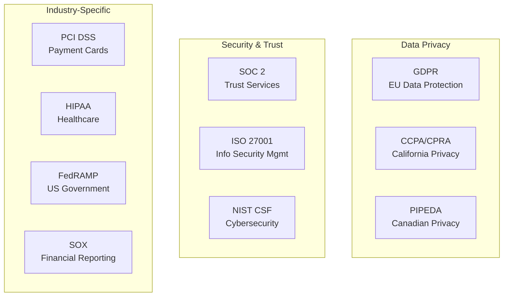
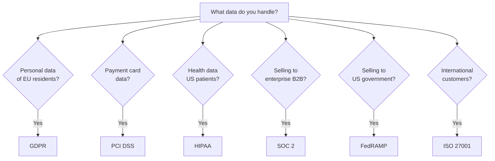
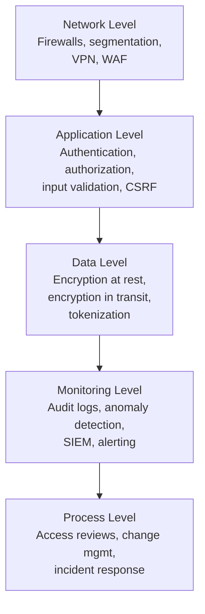
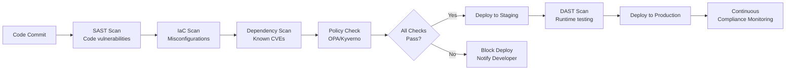

# Compliance & Governance Overview

Compliance is the set of rules, standards, and regulations that govern how software systems handle data, protect users, and maintain accountability. Most engineers encounter compliance as a wall of checkboxes imposed by auditors who do not understand technology. This is backwards. Compliance requirements exist because real failures — data breaches, financial fraud, privacy violations — caused real harm to real people. When engineers understand the "why" behind compliance, they stop seeing it as bureaucratic overhead and start seeing it as a design constraint that produces better systems.

This section covers compliance from an engineering perspective: not the legalese, but the technical controls, architectural patterns, and automation strategies that make compliance achievable without slowing down development.

## Why Compliance Matters for Engineers

### The Business Case

| Factor | Impact |
|--------|--------|
| **Fines** | GDPR: up to 4% of global annual revenue. PCI DSS: $5,000-$100,000/month. |
| **Customer trust** | 81% of consumers say they need to trust a brand before buying (Edelman, 2023) |
| **Sales requirements** | Enterprise customers require SOC 2, ISO 27001, or HIPAA before signing contracts |
| **Insurance** | Cyber insurance premiums are directly tied to compliance posture |
| **Breach costs** | Average data breach cost: $4.45M (IBM, 2023). Compliance reduces this by ~$1.5M |

### The Engineering Case

Compliance frameworks are, at their core, codified best practices for building secure, reliable, and auditable systems. When you implement compliance controls properly, you get:

- **Better security architecture** — access controls, encryption, network segmentation
- **Better observability** — audit logging, change tracking, anomaly detection
- **Better data management** — data classification, retention policies, lifecycle management
- **Better incident response** — documented procedures, tested recovery plans
- **Better change management** — reviewed deployments, rollback capabilities

::: tip Compliance is a Feature, Not a Tax
The best engineering teams build compliance into their architecture from day one. It is dramatically cheaper to design a system for compliance than to retrofit it later. A data pipeline designed without GDPR's "right to be forgotten" in mind might require a complete rewrite. One designed with it from the start just needs a delete API call.
:::

## Major Compliance Frameworks

### Landscape Overview



### Framework Comparison

| Framework | Scope | Who Needs It | Key Focus | Audit Type |
|-----------|-------|-------------|-----------|------------|
| **GDPR** | Any org processing EU personal data | Nearly everyone with EU users | Data privacy, consent, data subject rights | Regulatory enforcement |
| **SOC 2** | Service organizations (SaaS, cloud) | B2B SaaS companies | Security, availability, processing integrity | Third-party audit |
| **PCI DSS** | Anyone handling payment card data | E-commerce, payment processors | Cardholder data protection | Qualified Security Assessor (QSA) |
| **HIPAA** | Healthcare-related data | Health tech, insurance tech | Protected Health Information (PHI) | HHS enforcement + self-audits |
| **ISO 27001** | Any organization | Companies needing international recognition | Information Security Management System | Certification body audit |
| **SOX** | Publicly traded companies (US) | Public companies, their vendors | Financial reporting integrity | External auditor |
| **NIST CSF** | Any organization (voluntary) | US organizations, government contractors | Cybersecurity risk management | Self-assessment or third-party |
| **FedRAMP** | Cloud services for US government | Cloud vendors selling to US government | Cloud security | Third-party assessment (3PAO) |

### Choosing Your Frameworks

The frameworks you need depend on your business:



## Compliance Engineering Principles

### 1. Compliance as Code

Treat compliance controls like any other engineering requirement — define them in code, test them automatically, enforce them in CI/CD:

```yaml
# Example: OPA (Open Policy Agent) policy for compliance
# Enforce encryption at rest for all databases
package compliance.encryption

deny[msg] {
    resource := input.resources[_]
    resource.type == "aws_rds_instance"
    not resource.properties.storage_encrypted
    msg := sprintf("RDS instance '%s' must have encryption at rest enabled (SOC 2 CC6.1, PCI DSS 3.4)", [resource.name])
}

deny[msg] {
    resource := input.resources[_]
    resource.type == "aws_s3_bucket"
    not resource.properties.server_side_encryption_configuration
    msg := sprintf("S3 bucket '%s' must have server-side encryption enabled (GDPR Art. 32)", [resource.name])
}
```

### 2. Continuous Compliance

Replace periodic manual audits with continuous automated checks:

| Traditional Approach | Continuous Compliance |
|---------------------|----------------------|
| Annual audit | Continuous monitoring |
| Manual evidence collection | Automated evidence gathering |
| Point-in-time snapshot | Real-time compliance posture |
| Reactive (find issues during audit) | Proactive (catch issues immediately) |
| Spreadsheet tracking | Compliance dashboards |

### 3. Defense in Depth

No single control is sufficient. Layer controls so that a failure in one is caught by another:



### 4. Principle of Least Privilege

Every user, service, and process should have the minimum permissions required to perform their function:

```python
# Example: role-based access control (RBAC)
ROLES = {
    "viewer": {
        "permissions": ["read:reports", "read:dashboards"],
        "data_access": "anonymized",
    },
    "analyst": {
        "permissions": ["read:reports", "read:dashboards", "read:raw_data"],
        "data_access": "pseudonymized",
    },
    "admin": {
        "permissions": ["read:*", "write:*", "delete:*"],
        "data_access": "full",
        "requires_mfa": True,
        "session_timeout_minutes": 30,
    },
}

def check_permission(user_role: str, required_permission: str) -> bool:
    role = ROLES.get(user_role)
    if not role:
        return False

    permissions = role["permissions"]
    if required_permission in permissions:
        return True

    # Check wildcard permissions
    namespace = required_permission.split(":")[0]
    return f"{namespace}:*" in permissions or "*:*" in permissions
```

### 5. Data Classification

Every piece of data should be classified by sensitivity:

| Classification | Description | Examples | Controls Required |
|---------------|-------------|----------|------------------|
| **Public** | Available to anyone | Marketing content, public docs | None |
| **Internal** | Available to employees | Internal wiki, org charts | Authentication |
| **Confidential** | Restricted to specific teams | Financial data, roadmaps | Authentication + authorization + encryption |
| **Restricted** | Highest sensitivity | PII, PHI, payment data, credentials | All of the above + audit logging + access reviews + DLP |

## The Compliance Engineering Toolkit

### Essential Tools

| Category | Tools | Purpose |
|----------|-------|---------|
| **Policy as Code** | OPA, Kyverno, Sentinel | Define and enforce policies programmatically |
| **Secrets Management** | Vault, AWS Secrets Manager, GCP Secret Manager | Secure credential storage and rotation |
| **Audit Logging** | ELK Stack, Splunk, CloudTrail | Immutable record of all access and changes |
| **Compliance Platforms** | Vanta, Drata, Secureframe | Automated evidence collection and monitoring |
| **SIEM** | Splunk, Elastic SIEM, Sentinel | Security event aggregation and analysis |
| **Vulnerability Scanning** | Snyk, Trivy, Grype | Detect vulnerabilities in code and containers |
| **IaC Scanning** | Checkov, tfsec, KICS | Find misconfigurations in infrastructure code |
| **Data Loss Prevention** | AWS Macie, Google DLP, Nightfall | Detect sensitive data in unexpected places |

### Compliance in CI/CD



## Compliance in the Archon Knowledge Base

Dive deeper into specific frameworks:

| Page | Focus |
|------|-------|
| [GDPR Engineering](/security/compliance/gdpr-engineering) | Data privacy, right to be forgotten, consent management |
| [SOC 2 for Engineers](/security/compliance/soc2) | Trust Services Criteria, evidence collection, controls |
| [PCI DSS Essentials](/security/compliance/pci-dss) | Payment card data protection, network segmentation |
| [Audit Logging Patterns](/security/compliance/audit-logging) | Immutable logs, tamper detection, structured audit events |

Related pages across Archon:

| Page | Relevance |
|------|-----------|
| [API Security Patterns](/system-design/api-design/api-security-patterns) | Authentication, authorization, rate limiting |
| [Observability](/infrastructure/observability/) | Monitoring and logging infrastructure |

## Getting Started With Compliance

If you are starting from scratch:

1. **Classify your data** — know what you have and how sensitive it is
2. **Implement audit logging** — see [Audit Logging Patterns](/security/compliance/audit-logging)
3. **Enforce encryption** — at rest and in transit, no exceptions
4. **Set up access controls** — RBAC with least privilege
5. **Automate evidence collection** — start with one framework (usually SOC 2 for B2B SaaS)
6. **Build compliance checks into CI/CD** — catch issues before they reach production

::: warning Do NOT Start With the Audit
The worst way to approach compliance is to wait for an audit and then scramble to produce evidence. Build compliance into your engineering workflow from day one. By the time the auditor arrives, you should be able to generate evidence reports with a single command.
:::

## Further Reading

- [GDPR Engineering](/security/compliance/gdpr-engineering) — data privacy compliance for engineers
- [SOC 2 for Engineers](/security/compliance/soc2) — the most common B2B compliance framework
- [PCI DSS Essentials](/security/compliance/pci-dss) — payment card data compliance
- [Audit Logging Patterns](/security/compliance/audit-logging) — the foundation of compliance evidence
- NIST Cybersecurity Framework — nist.gov/cyberframework
- CIS Controls — cisecurity.org/controls
- *Practical Cloud Security* by Chris Dotson — O'Reilly
