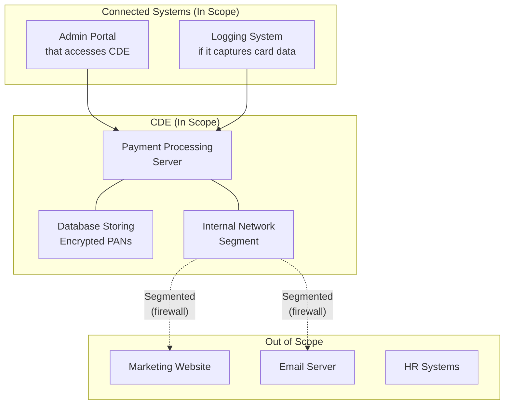
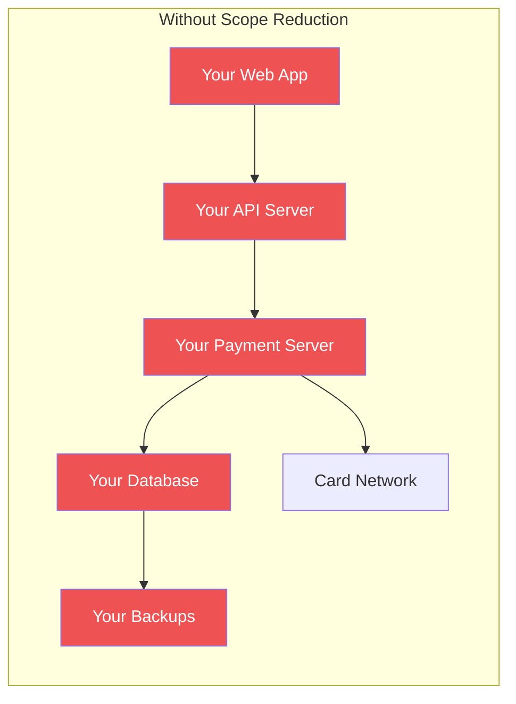
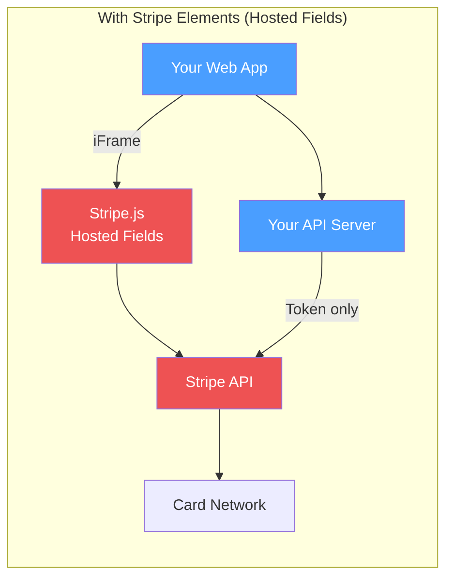
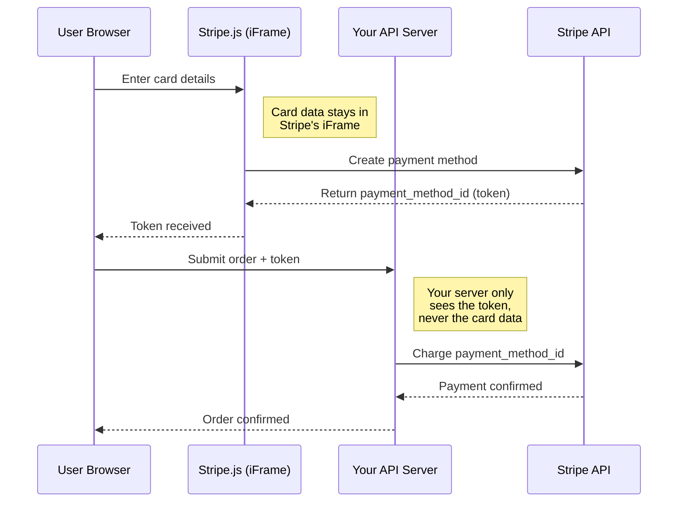
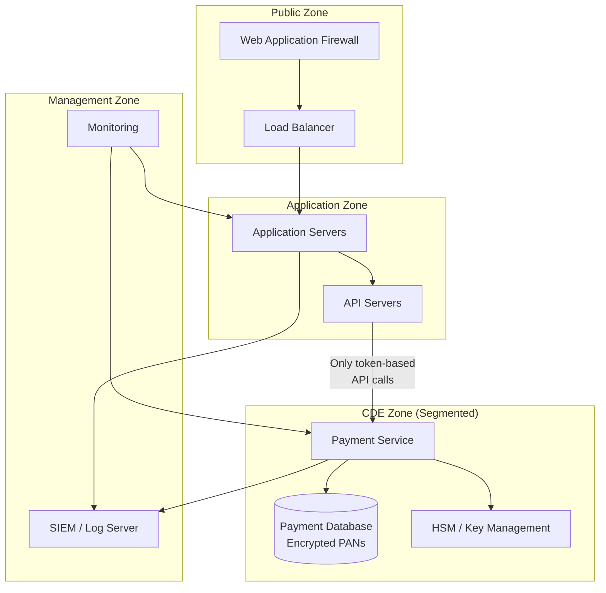

# PCI DSS Essentials

The Payment Card Industry Data Security Standard (PCI DSS) is a set of security requirements for any organization that stores, processes, or transmits credit card data. It exists because payment card data is among the most targeted data types — stolen credit card numbers have direct monetary value on the black market. The standard is maintained by the PCI Security Standards Council, founded by Visa, Mastercard, American Express, Discover, and JCB.

For engineers, PCI DSS is uniquely demanding. It prescribes specific technical controls — not broad principles, but exact requirements like "use AES-256 encryption" and "retain audit logs for at least one year." The good news: if you architect your system to minimize the scope of cardholder data handling (ideally using a payment processor like Stripe that handles the hard parts), your PCI DSS obligations shrink dramatically.

## Understanding PCI DSS Scope

### What is Cardholder Data?

| Data Element | Must Protect | Can Store After Auth? | Must Render Unreadable |
|-------------|-------------|----------------------|----------------------|
| **Primary Account Number (PAN)** | Yes | Yes (if encrypted) | Yes |
| Cardholder Name | Yes | Yes | No (but recommended) |
| Expiration Date | Yes | Yes | No (but recommended) |
| Service Code | Yes | Yes | No (but recommended) |
| **Full Track Data** | Yes | **NO** | N/A (cannot store) |
| **CAV2/CVC2/CVV2** | Yes | **NO** | N/A (cannot store) |
| **PIN / PIN Block** | Yes | **NO** | N/A (cannot store) |

::: danger Never Store CVV or Full Track Data
Storing CVV, full magnetic stripe data, or PINs after authorization is an absolute violation of PCI DSS — there is no exception, no workaround, no encryption strong enough to make it acceptable. If your system stores this data, you are in violation. Period.
:::

### The Cardholder Data Environment (CDE)

The CDE is the scope of your PCI DSS compliance — it includes every system, network, and process that stores, processes, or transmits cardholder data, plus any system connected to those systems.



### Reducing Scope — The #1 Priority

The most impactful PCI DSS engineering decision is **reducing scope**. Every system you remove from the CDE reduces your compliance burden, audit cost, and security risk.

| Strategy | Description | Scope Reduction |
|----------|-------------|----------------|
| **Use a payment processor** | Stripe, Braintree handle card data; you never see it | Massive — may qualify for SAQ-A (simplest assessment) |
| **Tokenization** | Replace PAN with a token; store the token, not the PAN | CDE shrinks to tokenization service only |
| **Network segmentation** | Isolate CDE on a separate network segment | Connected systems are not in scope if properly segmented |
| **Point-to-point encryption (P2PE)** | Encrypt card data at the terminal; never decrypted in your environment | CDE shrinks to terminal management only |
| **iFrame / hosted fields** | Payment form hosted by processor, embedded in your page | Card data never touches your servers |





In the second architecture, your systems (blue) never handle card data. Only Stripe's systems (red) are in the CDE. Your PCI DSS assessment is reduced from hundreds of requirements to a simple self-assessment questionnaire.

## The 12 PCI DSS Requirements

PCI DSS v4.0 (effective March 2025) organizes requirements into six goals with twelve requirements:

### Goal 1: Build and Maintain a Secure Network

#### Requirement 1: Install and Maintain Network Security Controls

```hcl
# Terraform: Network segmentation for CDE
resource "aws_vpc" "cde" {
  cidr_block           = "10.1.0.0/16"
  enable_dns_support   = true
  enable_dns_hostnames = true

  tags = {
    Name        = "pci-cde-vpc"
    Environment = "production"
    PCI_Scope   = "in-scope"
  }
}

# CDE subnet — isolated from non-CDE systems
resource "aws_subnet" "cde_private" {
  vpc_id                  = aws_vpc.cde.id
  cidr_block              = "10.1.1.0/24"
  map_public_ip_on_launch = false

  tags = {
    Name      = "cde-private-subnet"
    PCI_Scope = "in-scope"
  }
}

# Security group — restrict CDE access
resource "aws_security_group" "cde_payment" {
  name        = "cde-payment-sg"
  description = "Security group for payment processing servers"
  vpc_id      = aws_vpc.cde.id

  # Only allow HTTPS from the application tier
  ingress {
    description     = "HTTPS from app tier"
    from_port       = 443
    to_port         = 443
    protocol        = "tcp"
    security_groups = [aws_security_group.app_tier.id]
  }

  # No direct internet access
  egress {
    description = "Payment processor API only"
    from_port   = 443
    to_port     = 443
    protocol    = "tcp"
    cidr_blocks = ["stripe-ip-range/32"]  # Restrict to payment processor IPs
  }

  tags = {
    PCI_Scope = "in-scope"
  }
}
```

#### Requirement 2: Apply Secure Configurations to All System Components

| Component | Secure Configuration |
|-----------|---------------------|
| Operating system | Remove unnecessary services, disable default accounts, CIS benchmark |
| Database | Change default passwords, disable remote root, enable audit logging |
| Web server | Disable directory listing, remove default pages, enable HSTS |
| Container images | Use minimal base images (distroless/alpine), no root user |
| Cloud services | Follow CIS cloud benchmarks (AWS, GCP, Azure) |

```dockerfile
# PCI-compliant container image
FROM gcr.io/distroless/nodejs22-debian12

# Non-root user (PCI DSS Req 2)
USER nonroot:nonroot

# Copy only application files
COPY --chown=nonroot:nonroot ./dist /app
COPY --chown=nonroot:nonroot ./node_modules /app/node_modules

WORKDIR /app

# No shell, no package manager, minimal attack surface
CMD ["server.js"]
```

### Goal 2: Protect Account Data

#### Requirement 3: Protect Stored Account Data

If you must store PAN data (most companies should not), it must be rendered unreadable:

| Method | Description | PCI DSS Accepted |
|--------|-------------|-----------------|
| **AES-256 encryption** | Strong encryption with proper key management | Yes |
| **Tokenization** | Replace PAN with a non-reversible token | Yes |
| **Truncation** | Store only first 6 and last 4 digits | Yes (but cannot reconstruct full PAN) |
| **Hashing** | One-way hash (with salt) | Yes (with strong cryptographic hash) |

```python
# PAN handling — tokenization approach
from cryptography.fernet import Fernet
import hashlib

class PANHandler:
    """Handle Primary Account Numbers with PCI DSS compliance."""

    def __init__(self, encryption_key: bytes):
        self.cipher = Fernet(encryption_key)

    def tokenize(self, pan: str) -> dict:
        """
        Tokenize a PAN. Store only the token and masked PAN.
        The full PAN should be stored only by the payment processor.
        """
        # Validate PAN format
        if not self._is_valid_pan(pan):
            raise ValueError("Invalid PAN format")

        # Generate token (non-reversible identifier)
        token = hashlib.sha256(
            f"{pan}:{self.salt}".encode()
        ).hexdigest()[:32]

        # Masked PAN for display (first 6, last 4)
        masked = f"{pan[:6]}{'*' * (len(pan) - 10)}{pan[-4:]}"

        return {
            "token": token,
            "masked_pan": masked,
            "card_brand": self._detect_brand(pan),
            # NEVER include the full PAN in the return value
        }

    def _detect_brand(self, pan: str) -> str:
        if pan.startswith("4"):
            return "visa"
        elif pan[:2] in ("51", "52", "53", "54", "55"):
            return "mastercard"
        elif pan[:2] in ("34", "37"):
            return "amex"
        return "unknown"

    def _is_valid_pan(self, pan: str) -> bool:
        """Luhn algorithm validation."""
        digits = [int(d) for d in pan if d.isdigit()]
        checksum = 0
        for i, digit in enumerate(reversed(digits)):
            if i % 2 == 1:
                digit *= 2
                if digit > 9:
                    digit -= 9
            checksum += digit
        return checksum % 10 == 0
```

#### Requirement 4: Protect Cardholder Data in Transit

```yaml
# TLS configuration for PCI DSS compliance
# Nginx configuration
server {
    listen 443 ssl http2;

    # TLS 1.2+ only (PCI DSS v4.0)
    ssl_protocols TLSv1.2 TLSv1.3;

    # Strong cipher suites only
    ssl_ciphers 'ECDHE-ECDSA-AES256-GCM-SHA384:ECDHE-RSA-AES256-GCM-SHA384:ECDHE-ECDSA-CHACHA20-POLY1305';
    ssl_prefer_server_ciphers on;

    # HSTS — force HTTPS
    add_header Strict-Transport-Security "max-age=63072000; includeSubDomains; preload" always;

    # Certificate configuration
    ssl_certificate /etc/ssl/certs/payment-server.crt;
    ssl_certificate_key /etc/ssl/private/payment-server.key;
    ssl_session_timeout 1d;
    ssl_session_cache shared:SSL:10m;
}
```

### Goal 3: Maintain a Vulnerability Management Program

#### Requirement 5: Protect All Systems Against Malware

| Control | Implementation |
|---------|---------------|
| Anti-malware on all systems | EDR agent (CrowdStrike, SentinelOne) on all CDE systems |
| Regular scans | Automated daily malware scans |
| Anti-malware cannot be disabled | Agent protected from user tampering |
| Container scanning | Image scanning in CI/CD (Trivy, Snyk Container) |

#### Requirement 6: Develop and Maintain Secure Systems and Software

```yaml
# CI/CD pipeline with PCI DSS security controls
name: PCI Compliant Pipeline

on:
  pull_request:
    branches: [main]

jobs:
  security_checks:
    runs-on: ubuntu-latest
    steps:
      # Req 6.3.1: Identify vulnerabilities in custom code
      - name: SAST scan
        uses: github/codeql-action/analyze@v3

      # Req 6.3.2: Identify vulnerabilities in third-party software
      - name: Dependency scan
        run: snyk test --severity-threshold=high

      # Req 6.3.3: Software updates
      - name: Check for outdated dependencies
        run: npm audit --audit-level=high

      # Req 6.5: Address common coding vulnerabilities
      - name: OWASP checks
        run: |
          # Check for SQL injection, XSS, CSRF, etc.
          semgrep --config=p/owasp-top-ten .
```

### Goal 4: Implement Strong Access Control Measures

#### Requirement 7: Restrict Access to System Components by Business Need

```python
# Role-based access to CDE (PCI DSS Req 7)
CDE_ROLES = {
    "payment_admin": {
        "access": ["payment_dashboard", "transaction_logs", "refund_processing"],
        "data_visibility": "masked_pan",  # First 6, last 4 only
        "requires_mfa": True,
        "max_session_hours": 8,
    },
    "developer": {
        "access": ["staging_environment", "code_repository"],
        "data_visibility": "no_pan",  # No access to any cardholder data
        "requires_mfa": True,
        "max_session_hours": 12,
    },
    "security_analyst": {
        "access": ["audit_logs", "security_events", "vulnerability_reports"],
        "data_visibility": "masked_pan",
        "requires_mfa": True,
        "max_session_hours": 8,
    },
    "dba": {
        "access": ["database_admin"],
        "data_visibility": "encrypted",  # Sees encrypted data, not plaintext
        "requires_mfa": True,
        "requires_approval": True,  # JIT access with manager approval
        "max_session_hours": 4,
    },
}
```

#### Requirement 8: Identify Users and Authenticate Access

| Control | PCI DSS Requirement |
|---------|-------------------|
| Unique IDs | Every user has a unique ID (no shared accounts) |
| MFA | Required for all access to CDE |
| Password length | Minimum 12 characters (PCI DSS v4.0) |
| Password complexity | Numeric and alphabetic characters required |
| Account lockout | Lock after 10 failed attempts for 30 minutes |
| Session timeout | Idle sessions re-authenticate after 15 minutes |

#### Requirement 9: Restrict Physical Access to Cardholder Data

Primarily relevant for on-premises data centers and physical payment terminals. For cloud-hosted systems, this is largely handled by the cloud provider (covered by their PCI DSS compliance).

### Goal 5: Regularly Monitor and Test Networks

#### Requirement 10: Log and Monitor All Access

```python
# PCI DSS audit logging requirements
REQUIRED_AUDIT_EVENTS = {
    # Req 10.2.1: All individual user accesses to cardholder data
    "cardholder_data_access": {
        "fields": ["user_id", "timestamp", "resource", "action", "pan_masked", "result"],
        "retention_days": 365,
    },
    # Req 10.2.2: Actions taken by any individual with root or admin privileges
    "admin_action": {
        "fields": ["user_id", "timestamp", "action", "target", "result"],
        "retention_days": 365,
    },
    # Req 10.2.3: Access to all audit trails
    "audit_log_access": {
        "fields": ["user_id", "timestamp", "action"],
        "retention_days": 365,
    },
    # Req 10.2.4: Invalid logical access attempts
    "failed_login": {
        "fields": ["user_id", "timestamp", "source_ip", "reason"],
        "retention_days": 365,
    },
    # Req 10.2.5: Changes to identification and authentication mechanisms
    "auth_change": {
        "fields": ["user_id", "timestamp", "change_type", "admin_id"],
        "retention_days": 365,
    },
    # Req 10.2.6: Initialization, stopping, or pausing of audit logs
    "audit_log_status": {
        "fields": ["action", "timestamp", "admin_id", "reason"],
        "retention_days": 365,
    },
    # Req 10.2.7: Creation and deletion of system-level objects
    "system_object_change": {
        "fields": ["object_type", "action", "timestamp", "admin_id"],
        "retention_days": 365,
    },
}
```

See [Audit Logging Patterns](/security/compliance/audit-logging) for detailed implementation guidance.

#### Requirement 11: Test Security of Systems and Networks Regularly

| Test | Frequency | PCI DSS Requirement |
|------|-----------|-------------------|
| Vulnerability scans (internal) | Quarterly | 11.3.1 |
| Vulnerability scans (external, by ASV) | Quarterly | 11.3.2 |
| Penetration testing (external) | Annually | 11.4.1 |
| Penetration testing (internal) | Annually | 11.4.2 |
| Segmentation testing | Every 6 months (service providers) or annually | 11.4.5 |
| File integrity monitoring | Continuous | 11.5.2 |
| Wireless scanning (if applicable) | Quarterly | 11.2.1 |

### Goal 6: Maintain an Information Security Policy

#### Requirement 12: Support Information Security With Policies and Programs

This is the organizational governance requirement — security policies, risk assessments, security awareness training, incident response plans, and vendor management.

## PCI DSS Self-Assessment Questionnaires (SAQs)

Not all merchants need a full audit. The SAQ type depends on how you handle card data:

| SAQ Type | Applies To | Number of Controls |
|----------|-----------|-------------------|
| **SAQ A** | Card-not-present; all processing outsourced (Stripe.js, hosted payment page) | ~22 |
| **SAQ A-EP** | E-commerce with payment page that redirects to processor but still handles some elements | ~139 |
| **SAQ C** | Payment application systems connected to the internet | ~160 |
| **SAQ D** | All other merchants; full assessment | ~300+ |

::: tip Aim for SAQ A
If you use Stripe Elements, Braintree Drop-in, or similar hosted payment fields, you likely qualify for SAQ A — the simplest assessment with only ~22 controls. This is the single most impactful architectural decision for PCI DSS compliance. Do not handle card data yourself unless you absolutely must.
:::

## PCI DSS Architecture Patterns

### Pattern: Tokenized Payment Flow



In this flow, your server never handles, processes, or stores card data. The token (`pm_xxx`) is not cardholder data under PCI DSS — it is a processor reference that cannot be used outside your Stripe account.

### Pattern: Network Segmentation



## Compliance Validation Checklist

```markdown
## PCI DSS Engineering Checklist

### Scope Reduction
- [ ] Payment processing outsourced to PCI-compliant processor
- [ ] Using hosted payment fields (iFrame) — card data never touches our servers
- [ ] CDE network segment isolated from general infrastructure
- [ ] SAQ type determined and documented

### Encryption
- [ ] TLS 1.2+ enforced for all data in transit
- [ ] AES-256 encryption at rest for any stored cardholder data
- [ ] Encryption keys managed in HSM or dedicated KMS
- [ ] Key rotation schedule documented and automated

### Access Control
- [ ] Unique user IDs for all CDE access
- [ ] MFA enforced for all CDE access
- [ ] Role-based access with least privilege
- [ ] Quarterly access reviews documented
- [ ] Session timeouts configured (15 min idle)

### Monitoring
- [ ] All CDE access logged with required fields
- [ ] Audit logs retained for 1 year (3 months immediately available)
- [ ] File integrity monitoring enabled
- [ ] Log review process documented

### Testing
- [ ] Quarterly internal vulnerability scans
- [ ] Quarterly external ASV scans
- [ ] Annual penetration testing
- [ ] Segmentation testing (if applicable)
```

## Further Reading

- [Compliance Overview](/security/compliance/) — broader compliance landscape
- [Audit Logging Patterns](/security/compliance/audit-logging) — building the audit trail PCI DSS requires
- [SOC 2 for Engineers](/security/compliance/soc2) — complementary security framework
- [API Security Patterns](/system-design/api-design/api-security-patterns) — securing payment APIs
- PCI Security Standards Council — pcisecuritystandards.org
- PCI DSS v4.0 Quick Reference Guide — pcisecuritystandards.org/document_library
- Stripe PCI compliance guide — stripe.com/docs/security/guide
