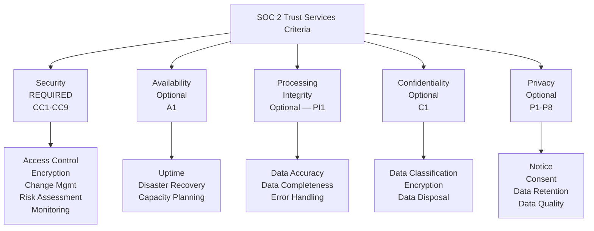
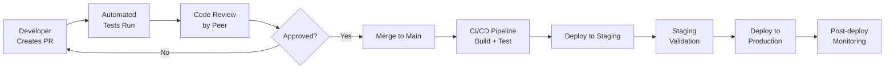
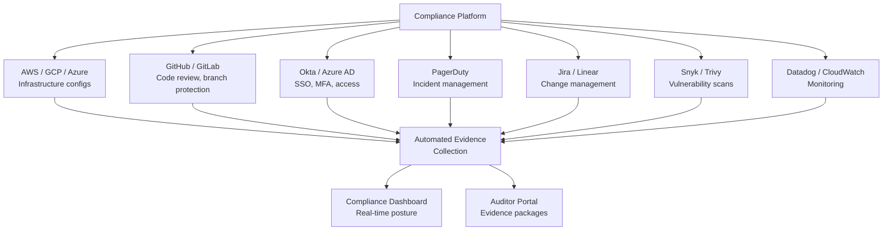

# SOC 2 for Engineers

SOC 2 (System and Organization Controls 2) is an auditing framework developed by the AICPA (American Institute of Certified Public Accountants) that evaluates how well an organization protects customer data. For B2B SaaS companies, SOC 2 is table stakes — enterprise customers will not sign contracts without it. For engineers, SOC 2 defines the security controls you need to build into your systems: access management, encryption, monitoring, change management, and incident response.

Unlike GDPR (which is a law with penalties), SOC 2 is a voluntary audit. An independent auditor evaluates your controls and issues a report. There are two types:

| Report Type | What It Covers | Duration |
|-------------|---------------|----------|
| **SOC 2 Type I** | Are controls properly designed? (point-in-time snapshot) | ~2-4 weeks of audit |
| **SOC 2 Type II** | Are controls operating effectively over time? (observation period) | 3-12 month observation + audit |

Type II is what customers want — it proves your controls actually work over a sustained period, not just that they exist on paper.

## Trust Services Criteria

SOC 2 evaluates organizations against five Trust Services Criteria (TSC). **Security** is mandatory; the other four are optional depending on what your service does.



### When to Include Each Criteria

| Criteria | Include If... | Common For |
|----------|--------------|------------|
| **Security** | Always (required) | Everyone |
| **Availability** | You make uptime commitments (SLAs) | SaaS platforms, infrastructure providers |
| **Processing Integrity** | You process data and accuracy matters | Financial services, data analytics, billing |
| **Confidentiality** | You handle confidential business data | Legal tech, healthcare, financial services |
| **Privacy** | You handle consumer personal data | Consumer-facing SaaS, marketing tech |

## Security Controls (CC Series)

The Security criteria is the core of SOC 2. It covers nine Common Criteria (CC) categories:

### CC1: Control Environment

**What auditors check:** Is there a security-aware culture with defined roles and accountability?

| Control | Engineering Implementation |
|---------|--------------------------|
| Security policies documented | Policies stored in version-controlled repo, reviewed annually |
| Roles and responsibilities defined | RBAC implemented in IAM; access tied to job function |
| Board/management oversight | Security metrics reported in engineering reviews |
| Code of conduct | Security training completion tracked per employee |

### CC2: Communication and Information

**What auditors check:** Is security information communicated effectively?

| Control | Engineering Implementation |
|---------|--------------------------|
| Security policies accessible | Internal wiki/documentation site with policies |
| External communication of policies | Public security page (trust center) |
| Incident communication | Incident response channels (Slack, PagerDuty) documented |

### CC3: Risk Assessment

**What auditors check:** Are risks identified, analyzed, and managed?

```python
# Risk register automation
@dataclass
class Risk:
    id: str
    title: str
    category: str  # "technical", "operational", "compliance"
    likelihood: int  # 1-5
    impact: int      # 1-5
    risk_score: int  # likelihood × impact
    mitigations: list[str]
    owner: str
    review_date: str
    status: str      # "open", "mitigated", "accepted"

# Automated risk scoring
def calculate_risk_score(likelihood: int, impact: int) -> dict:
    score = likelihood * impact
    if score >= 20:
        level = "critical"
    elif score >= 12:
        level = "high"
    elif score >= 6:
        level = "medium"
    else:
        level = "low"
    return {"score": score, "level": level}
```

### CC4: Monitoring Activities

**What auditors check:** Are controls monitored for effectiveness?

| Control | Engineering Implementation |
|---------|--------------------------|
| Continuous monitoring | Infrastructure monitoring (Prometheus, Datadog) |
| Log review | Centralized logging with automated alerting |
| Vulnerability scanning | Weekly automated scans (Snyk, Trivy) |
| Penetration testing | Annual third-party pen test |

### CC5: Control Activities

**What auditors check:** Are controls implemented and operating?

This is the broadest category — it covers the actual security controls.

### CC6: Logical and Physical Access Controls

**What auditors check:** Is access properly restricted?

```yaml
# Access control checklist for SOC 2
access_controls:
  authentication:
    - mfa_required: true
      scope: "all production systems"
      evidence: "IdP configuration export showing MFA enforcement"

    - sso_enabled: true
      provider: "Okta / Azure AD / Google Workspace"
      evidence: "SSO configuration screenshots"

    - password_policy:
        min_length: 12
        complexity: true
        rotation_days: 90
        evidence: "IdP password policy configuration"

  authorization:
    - rbac_implemented: true
      evidence: "IAM role definitions, access matrix document"

    - least_privilege: true
      evidence: "Quarterly access review logs"

    - privileged_access:
        just_in_time: true
        time_limited: true
        approval_required: true
        evidence: "PAM tool (e.g., HashiCorp Vault) access logs"

  access_reviews:
    - frequency: "quarterly"
      scope: "all production access"
      evidence: "Access review tickets with approve/deny decisions"

    - offboarding:
        timeline: "within 24 hours of termination"
        evidence: "HR/IT offboarding workflow logs"
```

#### Access Control Implementation

```python
# Just-in-time (JIT) access for production systems
class JITAccessManager:
    MAX_DURATION_HOURS = 8
    REQUIRES_APPROVAL_FOR = ["production_database", "admin_panel", "billing_system"]

    async def request_access(
        self,
        user: str,
        resource: str,
        reason: str,
        duration_hours: int = 4,
    ) -> dict:
        if duration_hours > self.MAX_DURATION_HOURS:
            raise ValueError(f"Maximum access duration is {self.MAX_DURATION_HOURS} hours")

        request = {
            "user": user,
            "resource": resource,
            "reason": reason,
            "duration_hours": duration_hours,
            "requested_at": datetime.utcnow().isoformat(),
            "expires_at": (datetime.utcnow() + timedelta(hours=duration_hours)).isoformat(),
            "status": "pending" if resource in self.REQUIRES_APPROVAL_FOR else "approved",
        }

        if request["status"] == "approved":
            await self._grant_access(request)
            await self._schedule_revocation(request)

        # Record in audit log
        await self.audit_log.record(
            event="access_requested",
            details=request,
        )

        return request

    async def _schedule_revocation(self, request: dict):
        """Automatically revoke access when it expires."""
        self.scheduler.schedule(
            at=request["expires_at"],
            action=self._revoke_access,
            args=[request["user"], request["resource"]],
        )
```

### CC7: System Operations

**What auditors check:** Are systems monitored and incidents handled?

| Control | Engineering Implementation | Evidence |
|---------|--------------------------|----------|
| Monitoring and alerting | Prometheus + Grafana dashboards | Dashboard screenshots, alert configurations |
| Incident management | PagerDuty + incident response process | Incident tickets, postmortem documents |
| Vulnerability management | Snyk/Trivy scans in CI/CD | Scan reports, remediation tickets |
| Malware/threat detection | EDR (CrowdStrike, SentinelOne) | Detection logs, response records |

### CC8: Change Management

**What auditors check:** Are changes controlled and tested?



SOC 2 requires evidence of:

| Requirement | Implementation | Evidence |
|-------------|---------------|----------|
| Changes are authorized | PR approval required before merge | Git history showing approved PRs |
| Changes are tested | CI runs automated tests | CI/CD pipeline logs |
| Changes are reviewed | Code review by at least one peer | PR review comments and approvals |
| Changes are documented | PR description, commit messages | Git history |
| Rollback capability | Feature flags, canary deployments | Deployment configurations |
| Segregation of duties | The person who wrote the code cannot approve their own PR | Branch protection rules |

```yaml
# GitHub branch protection rules (SOC 2 evidence)
# Settings > Branches > Branch protection rules
branch_protection:
  branch: main
  rules:
    require_pull_request_reviews:
      required_approving_review_count: 1
      dismiss_stale_reviews: true
      require_code_owner_reviews: true
    require_status_checks:
      strict: true
      contexts:
        - "ci/tests"
        - "ci/security-scan"
        - "ci/lint"
    require_signed_commits: true
    enforce_admins: true  # Even admins must follow these rules
    restrictions:
      users: []  # No direct push access
```

### CC9: Risk Mitigation

**What auditors check:** Are identified risks properly mitigated?

This maps to vendor management, business continuity, and disaster recovery plans.

## Evidence Collection Automation

### The Evidence Problem

SOC 2 auditors need evidence — screenshots, logs, configurations, reports — proving your controls are operating. Collecting this manually is painful:

| Manual Approach | Automated Approach |
|----------------|-------------------|
| Screenshot dashboards quarterly | API pulls dashboard configs automatically |
| Export access lists from each system | Script queries IAM APIs across all systems |
| Manually compile incident reports | Incident tool (PagerDuty/Jira) auto-generates reports |
| Ask managers to confirm access reviews | Automated access review workflow with audit trail |

### Automation With Compliance Platforms

Modern compliance platforms (Vanta, Drata, Secureframe) automate evidence collection by integrating with your infrastructure:



### Custom Evidence Collection Script

```python
# Automated SOC 2 evidence collector
import boto3
from datetime import datetime, timedelta

class SOC2EvidenceCollector:
    def __init__(self):
        self.aws = boto3.Session()
        self.evidence = []

    def collect_all_evidence(self, period_start: str, period_end: str):
        """Collect evidence for a SOC 2 audit period."""
        evidence_report = {
            "period": {"start": period_start, "end": period_end},
            "generated_at": datetime.utcnow().isoformat(),
            "controls": {},
        }

        # CC6: Access Controls
        evidence_report["controls"]["cc6_access"] = {
            "mfa_enforcement": self._check_mfa_enforcement(),
            "iam_policies": self._export_iam_policies(),
            "access_reviews": self._export_access_review_logs(
                period_start, period_end
            ),
        }

        # CC7: System Operations
        evidence_report["controls"]["cc7_operations"] = {
            "monitoring_alerts": self._export_alert_configs(),
            "incident_reports": self._export_incidents(
                period_start, period_end
            ),
            "vulnerability_scans": self._export_vuln_reports(
                period_start, period_end
            ),
        }

        # CC8: Change Management
        evidence_report["controls"]["cc8_changes"] = {
            "branch_protection": self._check_branch_protection(),
            "deployment_logs": self._export_deployments(
                period_start, period_end
            ),
            "code_reviews": self._export_pr_reviews(
                period_start, period_end
            ),
        }

        return evidence_report

    def _check_mfa_enforcement(self) -> dict:
        """Check that MFA is enforced for all IAM users."""
        iam = self.aws.client("iam")
        users = iam.list_users()["Users"]
        mfa_status = []
        for user in users:
            mfa_devices = iam.list_mfa_devices(
                UserName=user["UserName"]
            )["MFADevices"]
            mfa_status.append({
                "user": user["UserName"],
                "mfa_enabled": len(mfa_devices) > 0,
                "mfa_device_count": len(mfa_devices),
            })

        return {
            "total_users": len(users),
            "mfa_enabled": sum(1 for u in mfa_status if u["mfa_enabled"]),
            "mfa_missing": [
                u["user"] for u in mfa_status if not u["mfa_enabled"]
            ],
            "compliant": all(u["mfa_enabled"] for u in mfa_status),
        }

    def _check_branch_protection(self) -> dict:
        """Check GitHub branch protection rules."""
        # Uses GitHub API to verify branch protection
        import requests
        headers = {"Authorization": f"token {self.github_token}"}
        resp = requests.get(
            f"https://api.github.com/repos/{self.repo}/branches/main/protection",
            headers=headers,
        )
        protection = resp.json()
        return {
            "pr_reviews_required": protection.get(
                "required_pull_request_reviews", {}
            ).get("required_approving_review_count", 0) >= 1,
            "status_checks_required": bool(
                protection.get("required_status_checks")
            ),
            "admin_enforcement": protection.get(
                "enforce_admins", {}
            ).get("enabled", False),
            "compliant": True,  # Calculate based on checks above
        }
```

## Common SOC 2 Failures and Fixes

| Common Failure | Why It Fails | Engineering Fix |
|----------------|-------------|----------------|
| Shared credentials | No individual accountability | SSO + individual IAM users; eliminate shared accounts |
| No MFA on production | Critical access without second factor | Enforce MFA via IdP; block access without it |
| Missing access reviews | Cannot prove least privilege | Automated quarterly access review workflow |
| No change approval | Changes deployed without review | Branch protection rules; PR reviews enforced |
| No encryption at rest | Data exposed if disks are compromised | Enable encryption on all storage (RDS, S3, EBS) |
| No vulnerability scanning | Known CVEs in production | Automated scanning in CI/CD pipeline |
| No incident response plan | Undefined response process | Documented IR plan; tested annually via tabletop exercise |
| Logging gaps | Cannot reconstruct events for auditors | Centralized audit logging; see [Audit Logging Patterns](/security/compliance/audit-logging) |

::: danger The Most Common SOC 2 Audit Finding
**Missing or incomplete access reviews.** Auditors consistently find that organizations grant access but never review whether it is still needed. Implement automated quarterly access reviews: pull the list of users from each system, send it to the appropriate manager for review, and record their approve/remove decisions. This single automation eliminates the most common audit finding.
:::

## SOC 2 Readiness Timeline

| Phase | Duration | Activities |
|-------|----------|-----------|
| **Assessment** | 2-4 weeks | Gap analysis, identify missing controls |
| **Remediation** | 2-3 months | Implement missing controls, document policies |
| **Type I Audit** | 2-4 weeks | Point-in-time audit of control design |
| **Observation Period** | 3-12 months | Controls operating; collect evidence continuously |
| **Type II Audit** | 4-6 weeks | Audit of control effectiveness over observation period |
| **Ongoing** | Continuous | Maintain controls, collect evidence, annual re-audit |

::: tip Start With Type II in Mind
Many companies rush to get a Type I report, then struggle to sustain controls for the Type II observation period. Design your controls for Type II from the start — automate everything, implement continuous monitoring, and build evidence collection into your daily operations.
:::

## Further Reading

- [Compliance Overview](/security/compliance/) — broader compliance landscape
- [Audit Logging Patterns](/security/compliance/audit-logging) — building audit trails for SOC 2
- [GDPR Engineering](/security/compliance/gdpr-engineering) — complementary privacy framework
- [Observability](/infrastructure/observability/) — monitoring infrastructure that supports SOC 2
- [On-Call Handbook](/devops/engineering-practices/on-call-handbook) — incident response for CC7
- AICPA Trust Services Criteria — aicpa.org
- SOC 2 Academy — secureframe.com/hub/soc-2 (vendor-neutral educational resource)
