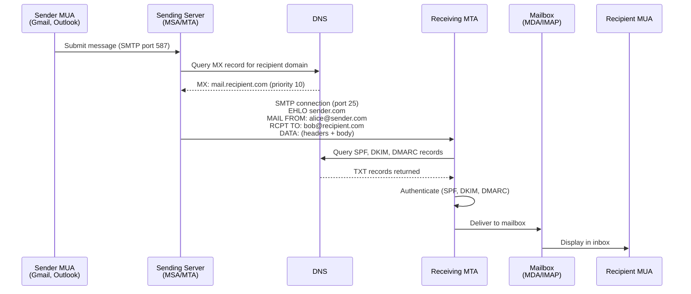
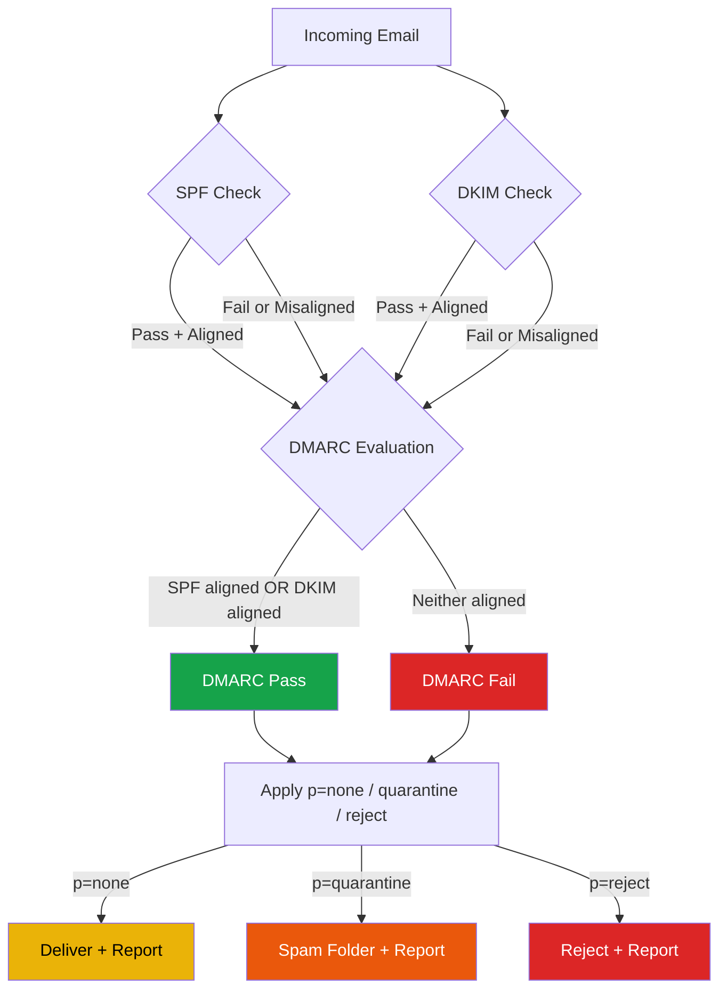
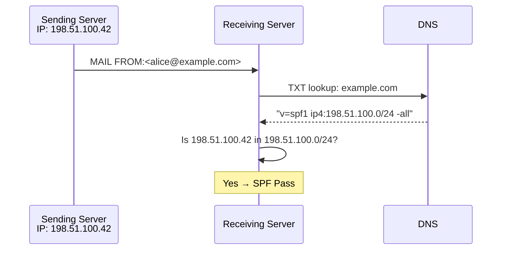
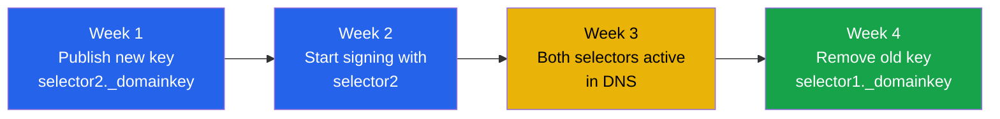
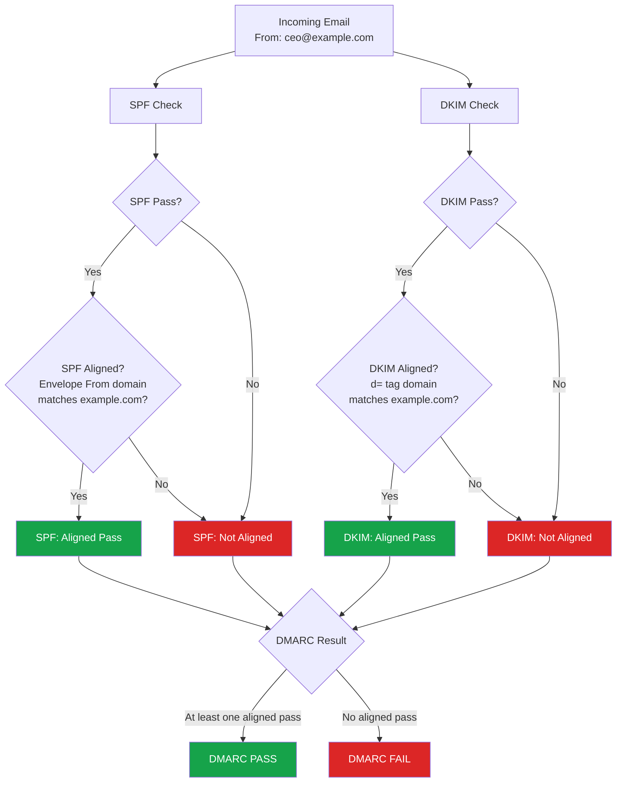
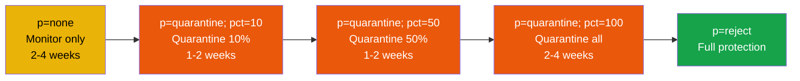
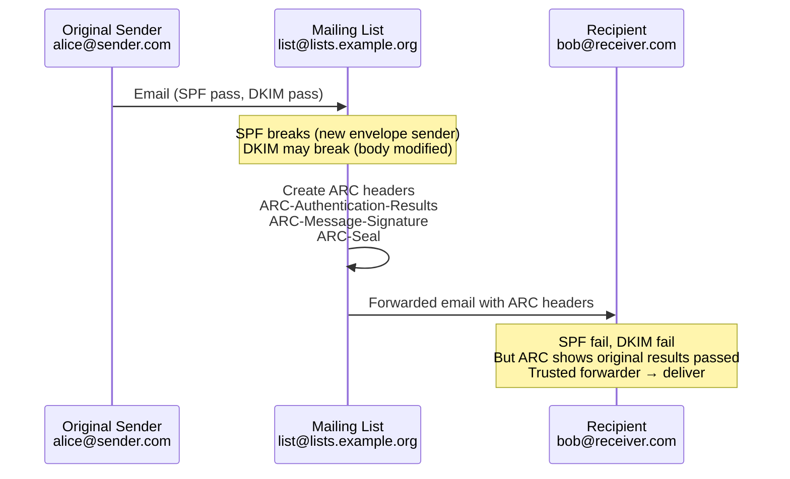
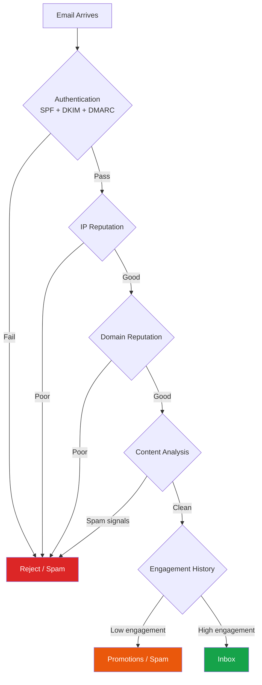

# Email Security & Deliverability

Email is the most widely used communication protocol on the internet and simultaneously one of the least secure. SMTP was designed in 1982 (RFC 821) with zero authentication — any server could claim to send mail from any domain. Four decades later, the entire email authentication ecosystem (SPF, DKIM, DMARC, BIMI, MTA-STS, ARC) exists as a series of patches on top of a fundamentally trusting protocol. Understanding this stack is not optional for any engineer who sends transactional emails, manages DNS records, or needs to keep phishing emails out of their organization.

**Related**: [Encryption in Transit](/security/encryption/encryption-in-transit) | [API Security](/security/api-security/) | [DNS & Networking](/networking/) | [Supply Chain Security](/security/supply-chain/)

---

::: tip Key Takeaway
- Email has no built-in sender authentication — SPF, DKIM, and DMARC are retrofitted layers that together form the authentication chain, and you need all three
- SPF validates the sending IP, DKIM validates the message integrity via cryptographic signatures, and DMARC ties them together with policy enforcement and reporting
- A DMARC policy of `p=none` is monitoring mode only — it does not block anything; you must progress through `quarantine` to `reject` to actually protect your domain
- Email deliverability is a reputation game — authentication is table stakes, but sender reputation, engagement metrics, and infrastructure hygiene determine whether your emails reach the inbox or the spam folder
- Every domain you own (including parked domains that never send email) needs a DMARC record to prevent abuse
:::

::: warning Common Misconceptions
- **"SPF alone prevents spoofing."** SPF only checks the envelope `MAIL FROM` address, not the `From:` header that users see. An attacker can pass SPF while showing a spoofed `From:` header. You need DMARC alignment to close this gap.
- **"DKIM guarantees the email came from the domain owner."** DKIM proves the email was signed by someone with access to the private key. If the key is compromised, or if a third-party service signs on your behalf, DKIM alone does not prove sender identity.
- **"DMARC reject means no one can spoof our domain."** DMARC only works at receiving servers that check it. Some legacy systems, small ISPs, or misconfigured servers may not enforce DMARC at all. It drastically reduces spoofing but cannot eliminate it entirely.
- **"We don't send email from this domain, so we don't need email security records."** Domains that don't send email are prime targets for spoofing. You absolutely need `v=spf1 -all`, a DKIM record that publishes no key, and `v=DMARC1; p=reject` on every domain you own.
- **"Moving to a new ESP is just a DNS change."** Changing email service providers requires updating SPF includes, rotating DKIM keys, re-warming the new IP range, and monitoring DMARC reports for alignment failures during transition. A careless migration can tank deliverability for weeks.
- **"High open rates mean good deliverability."** Open rate tracking relies on pixel loading, which is increasingly blocked by Apple Mail Privacy Protection (since iOS 15) and corporate proxies. Open rates are an unreliable deliverability signal.
:::

## One-Liner Summary

> Email authentication is a three-layer retrofit (SPF checks the sending server, DKIM checks the message signature, DMARC enforces alignment between them) that compensates for SMTP having been designed with zero sender verification.

---

## Email Authentication Chain

### How Email Actually Works

To understand email security, you need to understand the SMTP flow and the critical distinction between the **envelope** and the **header**.



**Key SMTP commands in the flow:**

| SMTP Command | Purpose | Security Relevance |
|---|---|---|
| `EHLO sender.com` | Identify the sending server | Can be faked — no verification |
| `MAIL FROM:<alice@sender.com>` | Envelope sender (return path) | SPF checks this address |
| `RCPT TO:<bob@recipient.com>` | Envelope recipient | Determines routing |
| `DATA` | Message headers + body follow | DKIM signs this content |

### Envelope vs Header From — The Root of Spoofing

This is the single most important concept in email security. There are **two separate "From" addresses** in every email:

```
SMTP Envelope (invisible to user):
  MAIL FROM:<notifications@esp.sendgrid.net>    ← SPF checks this

Message Headers (visible to user):
  From: "Your Bank" <security@yourbank.com>     ← What the user SEES
  Return-Path: <bounce-123@esp.sendgrid.net>    ← Derived from envelope
```

The user sees the `From:` header. SPF only validates the envelope `MAIL FROM`. Without DMARC alignment, an attacker can pass SPF with their own domain in the envelope while showing your domain in the `From:` header. This is exactly what phishing exploits.

### Why Email Is Inherently Insecure

The original SMTP specification (RFC 821, 1982) assumed a small network of trusted academic institutions. It provided:

- **No sender authentication** — any server can claim any identity
- **No encryption** — messages travel in plaintext (STARTTLS was added in 1999)
- **No integrity checking** — messages can be modified in transit
- **No delivery confirmation** — you cannot prove delivery or non-delivery

Every email security mechanism we use today is a retrofit:

| Year | Standard | What It Fixes |
|------|----------|---------------|
| 1999 | STARTTLS (RFC 2487) | Encryption in transit (opportunistic) |
| 2006 | SPF (RFC 4408) | Sender IP authorization |
| 2007 | DKIM (RFC 4871) | Message integrity and origin |
| 2012 | DMARC (RFC 7489) | Policy enforcement tying SPF + DKIM together |
| 2018 | MTA-STS (RFC 8461) | Mandatory TLS enforcement |
| 2019 | ARC (RFC 8617) | Authentication preservation through forwarding |
| 2021 | BIMI (RFC pending) | Visual brand verification in inboxes |

### The Authentication Trinity

SPF, DKIM, and DMARC work together as a chain. Each solves a specific problem, and none is sufficient alone:



DMARC passes if **either** SPF or DKIM passes **and** is aligned with the `From:` header domain. This is an OR relationship — you do not need both to pass, but having both provides redundancy.

---

## SPF (Sender Policy Framework)

SPF lets a domain owner publish a DNS TXT record listing which IP addresses and servers are authorized to send email on behalf of that domain. The receiving server checks the envelope `MAIL FROM` domain's SPF record and verifies the connecting IP is on the list.

### How SPF Works



### SPF Syntax Deep Dive

An SPF record is a DNS TXT record on the domain's root that starts with `v=spf1`:

```dns
v=spf1 ip4:198.51.100.0/24 ip6:2001:db8::/32 include:_spf.google.com ~all
```

**Mechanisms** (what to check):

| Mechanism | Description | Example |
|-----------|-------------|---------|
| `ip4` | Match an IPv4 address or CIDR range | `ip4:203.0.113.5` or `ip4:203.0.113.0/24` |
| `ip6` | Match an IPv6 address or prefix | `ip6:2001:db8::/32` |
| `include` | Recursively check another domain's SPF | `include:_spf.google.com` |
| `a` | Match the domain's A/AAAA record IPs | `a` or `a:mail.example.com` |
| `mx` | Match the domain's MX record IPs | `mx` or `mx:example.com` |
| `exists` | Pass if a DNS A record exists | `exists:%{i}._spf.example.com` (macro) |
| `all` | Match everything (used as default) | `-all` (always last) |
| `redirect` | Use another domain's SPF instead | `redirect=_spf.example.com` |

**Qualifiers** (what the result means):

| Qualifier | Prefix | Result if Matched | Recommended Usage |
|-----------|--------|-------------------|-------------------|
| Pass | `+` (default) | Accept | Authorized senders |
| Fail | `-` | Reject | Strict `all` terminator |
| SoftFail | `~` | Accept but mark | Transitional `all` terminator |
| Neutral | `?` | No opinion | Testing only |

### SPF Alignment

SPF alignment means the domain in the envelope `MAIL FROM` matches the domain in the `From:` header. DMARC requires this alignment for SPF to count.

**Relaxed alignment** (default): The organizational domain must match. `bounce@mail.example.com` aligns with `From: ceo@example.com` because both share `example.com`.

**Strict alignment**: The exact FQDN must match. `bounce@mail.example.com` does NOT align with `From: ceo@example.com`.

### Common SPF Mistakes

**1. Too many DNS lookups (the 10-lookup limit)**

SPF is limited to 10 DNS lookups (mechanisms that trigger lookups: `include`, `a`, `mx`, `exists`, `redirect`). `ip4` and `ip6` do not count. Exceeding 10 lookups causes a `permerror`, and many receivers treat this as a fail.

```dns
# BAD — 12 lookups (will fail)
v=spf1 include:_spf.google.com include:spf.protection.outlook.com
       include:sendgrid.net include:spf.mandrillapp.com
       include:mail.zendesk.com include:_spf.salesforce.com
       include:servers.mcsv.net include:spf.freshdesk.com
       a mx -all

# Each include can itself contain nested includes, compounding the problem
```

**2. Flattening SPF records**

To work around the 10-lookup limit, some admins "flatten" includes into raw IP addresses:

```dns
# Flattened (fragile — breaks when provider changes IPs)
v=spf1 ip4:209.85.128.0/17 ip4:216.239.32.0/19 ip4:64.233.160.0/19
       ip4:66.102.0.0/20 ip4:66.249.80.0/20 ip4:72.14.192.0/18
       ip4:74.125.0.0/16 ip4:108.177.8.0/21 ip4:173.194.0.0/16
       ip4:207.126.144.0/20 -all
```

This works until Google changes their IP ranges (which they do regularly). Use an SPF flattening service that auto-updates, or restructure to reduce includes.

**3. Multiple SPF records**

A domain must have exactly ONE SPF TXT record. Multiple records cause `permerror`:

```dns
# BAD — two SPF records
example.com TXT "v=spf1 include:_spf.google.com -all"
example.com TXT "v=spf1 include:sendgrid.net -all"

# GOOD — combined into one
example.com TXT "v=spf1 include:_spf.google.com include:sendgrid.net -all"
```

### SPF Records for Common Providers

```dns
# Google Workspace
v=spf1 include:_spf.google.com ~all

# Microsoft 365
v=spf1 include:spf.protection.outlook.com ~all

# Google Workspace + SendGrid
v=spf1 include:_spf.google.com include:sendgrid.net ~all

# Microsoft 365 + Amazon SES (us-east-1)
v=spf1 include:spf.protection.outlook.com include:amazonses.com ~all

# Minimal — domain sends no email
v=spf1 -all
```

::: tip In Production
SPF lookups count recursively. Before adding a new `include`, check how many lookups it costs. Google's `_spf.google.com` alone uses 4 lookups (it includes `_netblocks.google.com`, `_netblocks2.google.com`, and `_netblocks3.google.com`). Use `dig TXT _spf.google.com` or MXToolbox to trace the full chain. Many teams hit the 10-lookup limit the moment they add their third ESP and wonder why emails start failing silently.
:::

---

## DKIM (DomainKeys Identified Mail)

DKIM adds a cryptographic signature to outgoing emails. The sending server signs specific headers and the body with a private key, and the receiving server verifies the signature using the public key published in DNS.

### How DKIM Works

```mermaid
sequenceDiagram
    participant Sender as Sending MTA
    participant DNS as DNS
    participant Receiver as Receiving MTA

    Note over Sender: 1. Hash selected headers + body
    Note over Sender: 2. Sign hash with private key
    Sender->>Receiver: Email with DKIM-Signature header
    Receiver->>DNS: TXT lookup: selector._domainkey.example.com
    DNS-->>Receiver: "v=DKIM1; k=rsa; p=MIIBIjANBgkq..."
    Note over Receiver: 3. Verify signature with public key
    Note over Receiver: 4. Compare hash of received content
    Note over Receiver: Match → DKIM Pass
```

A DKIM signature header looks like this:

```
DKIM-Signature: v=1; a=rsa-sha256; c=relaxed/relaxed;
    d=example.com; s=google;
    h=from:to:subject:date:message-id:mime-version;
    bh=2jUSOH9NhtVGCQWNr9BrIAPreKQjO6Sn7XIkfJVOzv8=;
    b=AuUoFEfDxTDkHlLXSZEpZj79LICEps6eda7W3deTVFOk2PTrwoY0qG
      JGK2Z4e0pNLv1MfRCh34EFJ1ztXxUJiXZVoH...
```

| Tag | Purpose |
|-----|---------|
| `v=1` | DKIM version |
| `a=rsa-sha256` | Signing algorithm (RSA with SHA-256 hash) |
| `c=relaxed/relaxed` | Canonicalization (header/body) |
| `d=example.com` | Signing domain (used for DMARC alignment) |
| `s=google` | Selector (identifies which key to use) |
| `h=from:to:subject:...` | Signed headers |
| `bh=...` | Body hash (Base64) |
| `b=...` | Signature (Base64) |

### DKIM Selector and DNS Record

The **selector** allows a domain to publish multiple DKIM keys (for different services or key rotation). The DNS lookup is:

```
<selector>._domainkey.<domain>
```

For example, if the selector is `google` and the domain is `example.com`:

```dns
google._domainkey.example.com TXT "v=DKIM1; k=rsa; p=MIIBIjANBgkqhkiG9w0BAQEFAAOCAQ8AMIIBCgKCAQEA..."
```

| Tag | Values | Description |
|-----|--------|-------------|
| `v=DKIM1` | Required | Version |
| `k=rsa` | `rsa`, `ed25519` | Key algorithm |
| `p=...` | Base64 public key | The verification key |
| `t=s` | Optional | Strict mode — domain in `d=` must exactly match the `From:` domain |
| `t=y` | Optional | Testing mode — do not enforce failures |

### Key Rotation Strategies

DKIM private keys should be rotated periodically (every 6-12 months) to limit exposure if a key is compromised.

**Rotation with zero downtime:**



1. Publish the new public key in DNS under a new selector
2. Wait for DNS propagation (24-48 hours)
3. Switch the signing server to use the new private key and selector
4. Keep the old public key in DNS for at least 7 days (emails in transit may still carry the old signature)
5. Remove the old public key from DNS

::: tip In Production
Use date-based selectors like `dkim202604` or `s202604` to make rotation tracking trivial. When you see a DKIM failure in DMARC reports, you can immediately tell whether it is from a stale signature signed with a rotated-out key. Many teams use opaque selectors like `s1` and `s2` and lose track of which is current within months.
:::

### DKIM Canonicalization

Before hashing, both headers and body are **canonicalized** (normalized) to handle minor modifications by mail servers in transit.

| Mode | Headers | Body |
|------|---------|------|
| **Simple** | No changes — exact byte match required | Ignore trailing empty lines only |
| **Relaxed** | Lowercase header names, collapse whitespace | Collapse whitespace, ignore trailing empty lines |

**Best practice:** Use `c=relaxed/relaxed`. Mailing lists and forwarding services frequently modify whitespace and header casing. Simple canonicalization causes unnecessary DKIM failures.

### Third-Party Sender DKIM Setup

When using an ESP (SendGrid, Postmark, etc.), you have two DKIM signing options:

**Option 1: ESP signs with their domain** (default)
```
DKIM-Signature: d=sendgrid.net; s=s1; ...
```
This passes DKIM but fails DMARC alignment (the `d=` domain does not match your `From:` domain).

**Option 2: ESP signs with YOUR domain** (recommended)
```
DKIM-Signature: d=example.com; s=sg1; ...
```
You publish the ESP-provided DKIM public key in your DNS:
```dns
sg1._domainkey.example.com CNAME sg1.domainkey.sendgrid.net.
```

Always configure custom DKIM signing for every third-party service that sends email as your domain.

---

## DMARC (Domain-based Message Authentication, Reporting & Conformance)

DMARC is the policy layer. It answers two questions: (1) What should a receiver do when SPF and DKIM both fail alignment? (2) Where should authentication results be reported?

### How DMARC Ties SPF and DKIM Together



DMARC requires at least one of SPF or DKIM to **both pass and align** with the `From:` header domain. The alignment check is what closes the envelope-vs-header spoofing gap that SPF alone cannot address.

### DMARC Record Syntax

DMARC records are published as a TXT record at `_dmarc.<domain>`:

```dns
_dmarc.example.com TXT "v=DMARC1; p=reject; rua=mailto:dmarc-agg@example.com; ruf=mailto:dmarc-forensic@example.com; adkim=r; aspf=r; pct=100; sp=reject"
```

| Tag | Values | Description |
|-----|--------|-------------|
| `v=DMARC1` | Required | Version identifier |
| `p` | `none`, `quarantine`, `reject` | Policy for failing messages |
| `sp` | `none`, `quarantine`, `reject` | Subdomain policy (defaults to `p` if absent) |
| `rua` | `mailto:...` | Aggregate report destination |
| `ruf` | `mailto:...` | Forensic (failure) report destination |
| `adkim` | `r` (relaxed), `s` (strict) | DKIM alignment mode |
| `aspf` | `r` (relaxed), `s` (strict) | SPF alignment mode |
| `pct` | 1-100 | Percentage of failing mail to apply policy |
| `ri` | Seconds | Reporting interval (default 86400 = 24h) |
| `fo` | `0`, `1`, `d`, `s` | Forensic report options |

### DMARC Policies — Deployment Progression

Never go straight to `p=reject`. The deployment path is:



**Phase 1: `p=none` (monitoring)** — Collect reports for 2-4 weeks. Identify all legitimate senders. Fix SPF/DKIM for each. This phase reveals shadow IT services sending email as your domain that you did not know about.

**Phase 2: `p=quarantine` with `pct` ramp** — Start quarantining a small percentage of failing mail. Increase gradually while monitoring for false positives (legitimate mail failing DMARC).

**Phase 3: `p=reject`** — Failing messages are rejected outright. This is the goal for every domain.

### DMARC Alignment: Relaxed vs Strict

| Alignment | SPF Check | DKIM Check |
|-----------|-----------|------------|
| **Relaxed** (`aspf=r`, `adkim=r`) | Envelope `MAIL FROM` org domain matches `From:` header org domain | DKIM `d=` org domain matches `From:` header org domain |
| **Strict** (`aspf=s`, `adkim=s`) | Exact FQDN match required | Exact FQDN match required |

**Example with relaxed alignment:**
- `From: user@example.com` + envelope `MAIL FROM: bounce@mail.example.com` = SPF aligned (both share `example.com`)
- `From: user@example.com` + DKIM `d=mail.example.com` = DKIM aligned (both share `example.com`)

**Example with strict alignment:**
- `From: user@example.com` + envelope `MAIL FROM: bounce@mail.example.com` = SPF NOT aligned (different FQDNs)

Start with relaxed alignment. Move to strict only after confirming all senders use matching domains.

### DMARC Reporting

DMARC aggregate reports (`rua`) are XML files sent daily by receiving mail servers. They tell you:

- Which IPs sent email claiming to be your domain
- Whether each message passed or failed SPF, DKIM, and DMARC
- What policy was applied

**Sample aggregate report structure (simplified):**

```xml
<?xml version="1.0" encoding="UTF-8"?>
<feedback>
  <report_metadata>
    <org_name>google.com</org_name>
    <date_range>
      <begin>1711929600</begin>
      <end>1712016000</end>
    </date_range>
  </report_metadata>
  <policy_published>
    <domain>example.com</domain>
    <adkim>r</adkim>
    <aspf>r</aspf>
    <p>reject</p>
    <pct>100</pct>
  </policy_published>
  <record>
    <row>
      <source_ip>198.51.100.42</source_ip>
      <count>1523</count>
      <policy_evaluated>
        <disposition>none</disposition>
        <dkim>pass</dkim>
        <spf>pass</spf>
      </policy_evaluated>
    </row>
  </record>
  <record>
    <row>
      <source_ip>203.0.113.99</source_ip>
      <count>47</count>
      <policy_evaluated>
        <disposition>reject</disposition>
        <dkim>fail</dkim>
        <spf>fail</spf>
      </policy_evaluated>
    </row>
  </record>
  <identifiers>
    <header_from>example.com</header_from>
  </identifiers>
  <auth_results>
    <dkim>
      <domain>example.com</domain>
      <result>pass</result>
      <selector>dkim202604</selector>
    </dkim>
    <spf>
      <domain>example.com</domain>
      <result>pass</result>
    </spf>
  </auth_results>
</feedback>
```

**Reading the report:**
- `198.51.100.42` sent 1,523 emails — both DKIM and SPF passed. This is likely your legitimate sender.
- `203.0.113.99` sent 47 emails — both failed. This is likely a spoofer, and the messages were rejected.

**Forensic reports** (`ruf`) contain individual failure details (headers of failing messages). They are less commonly sent because of privacy concerns — many large providers (Google, Microsoft) do not send `ruf` reports.

### Subdomain Policies

The `sp` tag controls what happens to mail from subdomains. Without `sp`, subdomains inherit the parent's `p` policy.

```dns
# Parent domain rejects; subdomains quarantine (maybe marketing uses a subdomain)
_dmarc.example.com TXT "v=DMARC1; p=reject; sp=quarantine; rua=mailto:dmarc@example.com"

# Lock down all subdomains that shouldn't send email
_dmarc.example.com TXT "v=DMARC1; p=reject; sp=reject; rua=mailto:dmarc@example.com"
```

You can also publish per-subdomain DMARC records:

```dns
_dmarc.marketing.example.com TXT "v=DMARC1; p=quarantine; rua=mailto:dmarc@example.com"
```

---

## Advanced Email Security

### BIMI (Brand Indicators for Message Identification)

BIMI lets organizations display their logo next to emails in supporting inboxes (Gmail, Apple Mail, Yahoo, Fastmail). It requires DMARC at `p=quarantine` or `p=reject` as a prerequisite.

```dns
default._bimi.example.com TXT "v=BIMI1; l=https://example.com/brand/logo.svg; a=https://example.com/brand/vmc.pem"
```

| Tag | Description |
|-----|-------------|
| `l` | URL to your SVG logo (must be Tiny PS profile SVG) |
| `a` | URL to your VMC (Verified Mark Certificate) from a CA like DigiCert or Entrust |

**Requirements for BIMI:**
1. DMARC policy of `quarantine` or `reject` at `pct=100`
2. SVG Tiny PS logo (specific SVG profile required)
3. VMC certificate from an authorized Certificate Authority (costs ~$1,000-1,500/year)
4. Trademark registration for the logo (VMC requirement)

BIMI is a marketing investment, not a security necessity. But it incentivizes proper DMARC deployment because the logo only appears when authentication passes.

### MTA-STS (SMTP MTA Strict Transport Security)

STARTTLS is opportunistic — a man-in-the-middle can strip the TLS negotiation and force a plaintext connection (STRIPTLS attack). MTA-STS forces sending servers to use TLS when delivering to your domain.

**Setup requires two components:**

1. **DNS TXT record:**
```dns
_mta-sts.example.com TXT "v=STSv1; id=20260404"
```

2. **Policy file at** `https://mta-sts.example.com/.well-known/mta-sts.txt`:
```
version: STSv1
mode: enforce
mx: mail.example.com
mx: backup-mail.example.com
max_age: 604800
```

| Mode | Behavior |
|------|----------|
| `testing` | Report failures via TLSRPT but still deliver |
| `enforce` | Refuse to deliver if TLS cannot be established |

**TLSRPT** (TLS Reporting) works alongside MTA-STS:
```dns
_smtp._tls.example.com TXT "v=TLSRPTv1; rua=mailto:tlsrpt@example.com"
```

### DANE/TLSA Records

DANE (DNS-Based Authentication of Named Entities) uses DNSSEC to publish the expected TLS certificate in DNS, preventing CA compromise and MITM attacks:

```dns
_25._tcp.mail.example.com TLSA 3 1 1 e3b0c44298fc1c149afbf4c8996fb924...
```

| Field | Value | Meaning |
|-------|-------|---------|
| Usage | 3 | DANE-EE (end entity, trust anchor is the certificate itself) |
| Selector | 1 | Match the SubjectPublicKeyInfo |
| Matching | 1 | SHA-256 hash of the selected content |

DANE requires DNSSEC on your domain. Without DNSSEC, DANE records are ignored. This is the primary barrier to adoption.

### ARC (Authenticated Received Chain)

When emails are forwarded through mailing lists, the forwarding server changes the envelope sender (breaking SPF) and may modify headers or body (breaking DKIM). ARC preserves the original authentication results through a chain of custody.



ARC adds three headers at each hop:

| Header | Purpose |
|--------|---------|
| `ARC-Authentication-Results` | Snapshot of auth results at this hop |
| `ARC-Message-Signature` | DKIM-like signature of the message at this hop |
| `ARC-Seal` | Signature over all previous ARC headers (chain integrity) |

ARC is evaluated by the final receiver. If the receiver trusts the forwarding intermediary, it can use the ARC chain to recover the original authentication results.

---

## Email Deliverability

Authentication (SPF, DKIM, DMARC) is necessary but not sufficient for inbox placement. Deliverability is determined by a combination of authentication, reputation, content, and recipient engagement.

### Sender Reputation

Mailbox providers maintain reputation scores for both **IP addresses** and **domains**:



**IP reputation factors:**
- Volume and consistency of sending
- Bounce rates (high bounces = bad list hygiene)
- Spam complaint rates (FBL data)
- Presence on blocklists (Spamhaus, Barracuda, SORBS)
- Age of the IP (new IPs have no reputation)

**Domain reputation factors:**
- DMARC policy and compliance rate
- Historical spam complaint rate
- Engagement metrics (opens, clicks, replies)
- Domain age and DNS configuration quality

Google Postmaster Tools (free) shows your domain and IP reputation for Gmail delivery. Microsoft SNDS provides similar data for Outlook.

### Warm-Up Strategies for New IPs/Domains

A new IP or domain has no sending history. Sending a large volume immediately triggers spam filters. Warm-up builds reputation gradually:

| Day | Daily Volume | Notes |
|-----|-------------|-------|
| 1-3 | 50-100 | Send to your most engaged recipients only |
| 4-7 | 200-500 | Monitor bounce rates (must stay below 2%) |
| 8-14 | 500-2,000 | Monitor spam complaints (must stay below 0.1%) |
| 15-21 | 2,000-10,000 | Check Google Postmaster Tools for reputation |
| 22-30 | 10,000-50,000 | Gradually increase to target volume |
| 30+ | Full volume | Maintain consistent daily volume |

**Critical warm-up rules:**
- Start with recipients who have recently engaged (opened, clicked)
- Avoid purchased lists or unverified addresses during warm-up
- Maintain consistent volume — sending 100 emails one day and 50,000 the next destroys reputation
- Monitor blocklists daily during warm-up (MXToolbox, MultiRBL)

### Bounce Handling

| Type | Description | Action |
|------|-------------|--------|
| **Hard bounce** | Permanent failure (address doesn't exist, domain doesn't exist) | Remove immediately — never retry |
| **Soft bounce** | Temporary failure (mailbox full, server down, rate limited) | Retry 2-3 times over 24-72 hours, then suppress |
| **Block bounce** | Rejected by policy (blocklisted, content filtered) | Investigate the reason; do not blindly retry |

**Hard bounce rate thresholds:**
- Below 2%: Acceptable
- 2-5%: Warning — clean your list
- Above 5%: Critical — ESPs may suspend your account

### Spam Score Factors

Modern spam filters use hundreds of signals. The major categories:

| Category | Weight | Examples |
|----------|--------|----------|
| **Authentication** | High | SPF/DKIM/DMARC pass/fail |
| **Sender reputation** | High | IP and domain history |
| **Content** | Medium | Spammy phrases, ALL CAPS, excessive images, URL shorteners |
| **Technical** | Medium | Missing unsubscribe header, invalid HTML, oversized messages |
| **Engagement** | High (Gmail) | Opens, clicks, replies, "mark as spam" rate |
| **List quality** | High | Bounce rate, complaint rate, spam trap hits |

**Content red flags:**
- "FREE", "ACT NOW", "LIMITED TIME" in subject lines
- Image-only emails with no text
- URL shorteners (bit.ly, etc.) in email body
- Mismatched display URLs (`Click here` linking to `evil.com`)
- Missing `List-Unsubscribe` header

### Feedback Loops (FBLs)

FBLs let you receive notifications when recipients mark your email as spam. Most major providers offer FBLs:

| Provider | FBL Program | Format |
|----------|------------|--------|
| Microsoft | JMRP (Junk Mail Reporting Program) | ARF |
| Yahoo | CFL (Complaint Feedback Loop) | ARF |
| AOL | FBL | ARF |
| Gmail | No traditional FBL — use Postmaster Tools | Dashboard only |

When you receive an FBL complaint, **immediately suppress that address** from future sends. A complaint rate above 0.1% is dangerous; above 0.3% and you will likely be blocklisted.

### Dedicated vs Shared IPs

| Factor | Shared IP | Dedicated IP |
|--------|-----------|-------------|
| **Volume requirement** | Any volume | 50,000+ emails/month minimum |
| **Reputation control** | Shared with other senders (risk of neighbor pollution) | Fully yours |
| **Warm-up needed** | No (already warmed) | Yes (must build from scratch) |
| **Cost** | Included in ESP plan | Additional fee ($20-80/month) |
| **Best for** | Low-volume senders, startups | High-volume, reputation-sensitive senders |

::: tip In Production
Most startups should stay on shared IPs. A dedicated IP that sends too little volume (under 50K/month) actually hurts deliverability because mailbox providers do not have enough data to build a positive reputation. You end up in a worse position than sharing an IP pool with other vetted senders. Only move to dedicated when your volume justifies it and you have the operational discipline to maintain consistent sending patterns.
:::

---

## Transactional Email Services

### Provider Comparison

| Feature | SendGrid | Postmark | Amazon SES | Mailgun | Resend |
|---------|----------|----------|------------|---------|--------|
| **Pricing model** | Tiered plans + overages | Per-message ($1.25/1K) | Pay-per-use ($0.10/1K) | Tiered plans | Per-message ($3/1K free tier) |
| **Free tier** | 100/day (forever) | 100/month | 62K/month (on EC2) | 100/day (trial) | 3K/month |
| **SMTP relay** | Yes | Yes | Yes | Yes | Yes |
| **REST API** | Yes | Yes | Yes | Yes | Yes (modern) |
| **Dedicated IPs** | From Pro plan | Included on higher plans | $24.95/month per IP | From Scale plan | Coming soon |
| **DKIM custom** | Yes (CNAME) | Yes (CNAME) | Yes (CNAME) | Yes (TXT) | Yes (CNAME) |
| **Transactional focus** | Mixed (also marketing) | Transactional only | Raw infrastructure | Mixed | Developer-first |
| **Webhook events** | Delivered, opened, clicked, bounced, spam report | Delivered, bounced, spam complaint, opened, clicked | Bounce, complaint, delivery | All standard events | All standard events |
| **Best for** | General purpose, high volume | Mission-critical transactional (highest deliverability) | Cost-sensitive, AWS-native | Developers, email parsing | Modern DX, React Email |

### Integration Patterns

**SMTP Relay** — Configure your application's SMTP settings to route through the ESP:

```python
# Python (smtplib via SendGrid SMTP relay)
import smtplib
from email.mime.text import MIMEText

msg = MIMEText("Your order #1234 has shipped.")
msg["Subject"] = "Order Shipped"
msg["From"] = "orders@example.com"
msg["To"] = "customer@gmail.com"

with smtplib.SMTP("smtp.sendgrid.net", 587) as server:
    server.starttls()
    server.login("apikey", "SG.your-api-key-here")
    server.send_message(msg)
```

**REST API** — Direct HTTP calls (preferred for modern applications):

```python
# Python (Postmark API)
import httpx

response = httpx.post(
    "https://api.postmarkapp.com/email",
    headers={
        "Accept": "application/json",
        "Content-Type": "application/json",
        "X-Postmark-Server-Token": "your-server-token",
    },
    json={
        "From": "orders@example.com",
        "To": "customer@gmail.com",
        "Subject": "Order Shipped",
        "HtmlBody": "<h1>Your order shipped!</h1>",
        "TextBody": "Your order shipped!",
        "MessageStream": "outbound",
    },
)
```

```typescript
// TypeScript (Resend SDK)
import { Resend } from "resend";

const resend = new Resend("re_your-api-key");

const { data, error } = await resend.emails.send({
  from: "orders@example.com",
  to: "customer@gmail.com",
  subject: "Order Shipped",
  html: "<h1>Your order shipped!</h1>",
});
```

**SMTP relay vs API comparison:**

| Factor | SMTP Relay | REST API |
|--------|------------|----------|
| Setup complexity | Minimal (change SMTP host) | Requires code changes |
| Error handling | Limited (SMTP status codes) | Rich (HTTP status + JSON errors) |
| Throughput | Lower (connection overhead) | Higher (connection pooling, async) |
| Metadata/tags | Limited | Full tagging, metadata support |
| Template rendering | Client-side | Server-side (ESP templates) |
| Best for | Legacy apps, quick migration | New applications, high volume |

### Template Management

Avoid embedding HTML email templates in application code. Use ESP-side templates with variable substitution:

```python
# Postmark template API
response = httpx.post(
    "https://api.postmarkapp.com/email/withTemplate",
    headers={
        "X-Postmark-Server-Token": "your-server-token",
        "Content-Type": "application/json",
    },
    json={
        "From": "orders@example.com",
        "To": "customer@gmail.com",
        "TemplateAlias": "order-shipped",
        "TemplateModel": {
            "order_id": "1234",
            "tracking_url": "https://tracking.example.com/1234",
            "customer_name": "Alice",
        },
    },
)
```

Benefits of server-side templates:
- Non-engineers can edit templates without code deploys
- Consistent rendering across email clients
- A/B testing built into the ESP
- Version history and rollback

### Webhook Handling

ESPs send webhook events for delivery status. You must handle these to maintain list hygiene:

```python
# Flask webhook handler for SendGrid events
from flask import Flask, request, jsonify
import hmac
import hashlib

app = Flask(__name__)
WEBHOOK_SECRET = "your-webhook-verification-key"

@app.route("/webhooks/sendgrid", methods=["POST"])
def handle_sendgrid_webhook():
    # Verify webhook signature
    signature = request.headers.get("X-Twilio-Email-Event-Webhook-Signature")
    timestamp = request.headers.get("X-Twilio-Email-Event-Webhook-Timestamp")
    
    payload = timestamp + request.get_data(as_text=True)
    expected = hmac.new(
        WEBHOOK_SECRET.encode(), payload.encode(), hashlib.sha256
    ).hexdigest()
    
    if not hmac.compare_digest(signature, expected):
        return jsonify({"error": "Invalid signature"}), 403
    
    events = request.get_json()
    for event in events:
        match event["event"]:
            case "bounce":
                # Hard bounce — suppress this address permanently
                suppress_email(event["email"], reason="hard_bounce")
            case "spamreport":
                # Recipient marked as spam — suppress immediately
                suppress_email(event["email"], reason="spam_complaint")
            case "dropped":
                # ESP refused to send (previously bounced/complained)
                log_dropped(event["email"], event.get("reason"))
            case "delivered":
                update_delivery_status(event["email"], "delivered")
            case "open" | "click":
                update_engagement(event["email"], event["event"])
    
    return jsonify({"status": "ok"}), 200
```

**Critical webhook events to handle:**

| Event | Action Required |
|-------|----------------|
| `bounce` (hard) | Permanently suppress the address |
| `spamreport` / `complaint` | Permanently suppress the address |
| `dropped` | Log and investigate the cause |
| `delivered` | Update delivery status for tracking |
| `deferred` | Monitor — may indicate reputation issues |

::: warning Common Misconceptions
- **"We can just retry bounced addresses next month."** Hard-bounced addresses are permanently invalid. Retrying them damages your sender reputation and can get your account suspended by your ESP. Suppress them immediately and permanently.
:::

---

## Practical Setup Walkthrough

### Setting Up SPF + DKIM + DMARC from Scratch

**Prerequisite:** You have DNS access for your domain and use Google Workspace for corporate email and SendGrid for transactional email.

**Step 1: Inventory all email senders**

Before touching DNS, list every service that sends email as your domain:

| Service | Type | Sender Address |
|---------|------|----------------|
| Google Workspace | Corporate email | `*@example.com` |
| SendGrid | Transactional | `noreply@example.com` |
| Mailchimp | Marketing | `news@example.com` |
| Zendesk | Support | `support@example.com` |
| Your application server | Alerts | `alerts@example.com` |

**Step 2: Publish SPF**

```dns
example.com TXT "v=spf1 include:_spf.google.com include:sendgrid.net include:servers.mcsv.net include:mail.zendesk.com ~all"
```

Use `~all` (softfail) initially instead of `-all` (hardfail) until you have confirmed all senders are covered.

**Step 3: Configure DKIM for each service**

For Google Workspace:
1. Admin Console > Apps > Google Workspace > Gmail > Authenticate Email
2. Generate DKIM key (2048-bit RSA)
3. Add the provided TXT record:

```dns
google._domainkey.example.com TXT "v=DKIM1; k=rsa; p=MIIBIjANBgkq..."
```

For SendGrid:
1. Settings > Sender Authentication > Authenticate Your Domain
2. Add the CNAME records provided:

```dns
s1._domainkey.example.com CNAME s1.domainkey.u12345.wl.sendgrid.net.
s2._domainkey.example.com CNAME s2.domainkey.u12345.wl.sendgrid.net.
```

Repeat for each ESP. Every service must have custom DKIM configured.

**Step 4: Publish DMARC in monitoring mode**

```dns
_dmarc.example.com TXT "v=DMARC1; p=none; rua=mailto:dmarc-reports@example.com; ruf=mailto:dmarc-forensic@example.com; adkim=r; aspf=r"
```

**Step 5: Monitor for 2-4 weeks**

Use a DMARC report analyzer (dmarcian, Valimail, EasyDMARC, or PowerDMARC) to process aggregate reports. Look for:
- Legitimate senders that are failing DKIM or SPF alignment
- Unknown senders (shadow IT or spoofing attempts)
- High failure rates from specific IPs

**Step 6: Fix failures and tighten policy**

After all legitimate senders pass DMARC:

```dns
# Week 5: Quarantine 25%
_dmarc.example.com TXT "v=DMARC1; p=quarantine; pct=25; rua=mailto:dmarc-reports@example.com"

# Week 7: Quarantine 100%
_dmarc.example.com TXT "v=DMARC1; p=quarantine; pct=100; rua=mailto:dmarc-reports@example.com"

# Week 10: Reject
_dmarc.example.com TXT "v=DMARC1; p=reject; rua=mailto:dmarc-reports@example.com; sp=reject"
```

**Step 7: Protect parked/unused domains**

For every domain you own that does not send email:

```dns
parked-domain.com TXT "v=spf1 -all"
*._domainkey.parked-domain.com TXT "v=DKIM1; p="
_dmarc.parked-domain.com TXT "v=DMARC1; p=reject; sp=reject; rua=mailto:dmarc-reports@example.com"
```

### Testing Tools

| Tool | URL | What It Tests |
|------|-----|---------------|
| **mail-tester.com** | https://mail-tester.com | Sends a test email and gives a deliverability score out of 10 |
| **MXToolbox** | https://mxtoolbox.com | SPF, DKIM, DMARC record validation, blocklist checking |
| **Google Admin Toolbox** | https://toolbox.googleapps.com/apps/checkmx/ | DNS and mail configuration for Google Workspace |
| **dmarcian** | https://dmarcian.com | DMARC record inspection, report analysis, deployment guidance |
| **DKIM Validator** | https://dkimvalidator.com | Send a test email to verify DKIM signing is working |
| **Postmaster Tools (Google)** | https://postmaster.google.com | Domain/IP reputation, spam rate, authentication rate for Gmail |
| **SNDS (Microsoft)** | https://sendersupport.olc.protection.outlook.com | IP reputation data for Outlook delivery |
| **Hardenize** | https://hardenize.com | Full email security assessment (SPF, DKIM, DMARC, MTA-STS, DANE) |

**Quick validation commands:**

```bash
# Check SPF record
dig TXT example.com +short | grep spf

# Check DKIM record (replace 'google' with your selector)
dig TXT google._domainkey.example.com +short

# Check DMARC record
dig TXT _dmarc.example.com +short

# Check MX records
dig MX example.com +short

# Check MTA-STS record
dig TXT _mta-sts.example.com +short

# Full header analysis — send email to this address and check results
# Use check-auth@verifier.port25.com for automated SPF/DKIM/DMARC analysis
```

### Monitoring and Maintaining Over Time

Email security is not a "set it and forget it" configuration. Ongoing maintenance includes:

**Weekly:**
- Review DMARC aggregate reports for new failures
- Check blocklist status (automate with monitoring tools)
- Review bounce rates and complaint rates in ESP dashboards

**Monthly:**
- Verify all SPF includes are still valid (providers change subdomains)
- Check that SPF lookup count has not exceeded 10 (new includes from IT)
- Review Google Postmaster Tools and Microsoft SNDS for reputation trends

**Quarterly:**
- Rotate DKIM keys
- Audit the list of authorized senders (remove services no longer in use)
- Test deliverability by sending to seed addresses across Gmail, Outlook, Yahoo

**Annually:**
- Review MTA-STS policy and certificate validity
- Reassess BIMI certificate (if applicable)
- Full DNS audit of all email-related records across all domains

---

## When NOT to Use Email

Email is not the right channel for everything. Consider alternatives when:

| Scenario | Why Email Is Wrong | Better Alternative |
|----------|-------------------|-------------------|
| **Real-time alerts** | Email delivery is asynchronous with no latency guarantee | PagerDuty, Slack webhooks, SMS |
| **Two-factor auth codes** | Email accounts are a common compromise vector for MFA | TOTP apps (Authy, Google Authenticator), hardware keys |
| **Large file transfer** | Email attachments have size limits and lack access control | Presigned S3 URLs, Google Drive, Dropbox |
| **Conversation threads** | Email threading is fragmented and loses context | Slack, Teams, Discord |
| **Machine-to-machine** | Email adds unnecessary complexity | HTTP webhooks, message queues |
| **Sensitive data delivery** | Email encryption (S/MIME, PGP) has poor UX adoption | Secure portals with access links |

---

::: details Quiz

**1. What is the difference between the envelope `MAIL FROM` and the header `From:` in an email, and why does this distinction matter for security?**

> The envelope `MAIL FROM` is the address used in the SMTP protocol exchange — it controls where bounce messages go and is what SPF validates. The header `From:` is what the recipient sees in their email client. These can be completely different addresses. This matters because SPF alone only validates the envelope sender, so an attacker can pass SPF with their own domain in the envelope while displaying a spoofed `From:` header. DMARC alignment closes this gap by requiring the envelope and header domains to match.

**2. An SPF record has 11 `include` mechanisms and DNS lookups. What happens when a receiving server evaluates it, and how do you fix it?**

> SPF has a hard limit of 10 DNS lookups (RFC 7208). With 11 lookups, the SPF check returns a `permerror` (permanent error), and most receiving servers treat this as an SPF failure. To fix it: (a) flatten some includes into `ip4`/`ip6` ranges (but these need ongoing maintenance when providers change IPs), (b) use an SPF flattening service that auto-updates, (c) consolidate sending through fewer ESPs, or (d) use subdomains with separate SPF records for different sending services.

**3. You configured DKIM for your domain with `c=simple/simple` canonicalization, and DKIM failures are showing up in DMARC reports for emails sent through a mailing list. Why?**

> Simple canonicalization requires an exact byte-for-byte match of headers and body (except trailing blank lines in the body). Mailing lists frequently modify email headers (adding list footers, changing subject line prefixes, adjusting whitespace). These modifications break the DKIM signature under simple canonicalization. The fix is to switch to `c=relaxed/relaxed`, which normalizes whitespace and lowercases header names before hashing, making the signature resilient to minor modifications by intermediaries.

**4. Your DMARC record is `v=DMARC1; p=reject; aspf=s; adkim=s`. Your transactional emails are sent via SendGrid with envelope `MAIL FROM: bounce@em123.example.com` and DKIM `d=em123.example.com`, but the header `From:` is `noreply@example.com`. Will these emails pass DMARC?**

> No. With strict alignment (`aspf=s` and `adkim=s`), the SPF domain (`em123.example.com`) and DKIM domain (`em123.example.com`) must exactly match the `From:` header domain (`example.com`). Since `em123.example.com` is not equal to `example.com`, neither SPF nor DKIM are aligned, and DMARC fails. The fix is either: (a) switch to relaxed alignment (`aspf=r; adkim=r`) where organizational domain matching (`example.com`) is sufficient, or (b) configure SendGrid to use `example.com` directly in the envelope and DKIM signing.

**5. You are migrating from SendGrid to Postmark. What steps are needed to avoid a deliverability drop during the transition?**

> (1) Configure Postmark DKIM (publish new CNAME records) and update SPF to include both Postmark and SendGrid includes. (2) Keep both providers active in DNS during transition. (3) Warm up Postmark's IPs/sending path by gradually shifting traffic (start with 10%, increase over 2-3 weeks). (4) Monitor DMARC reports for alignment failures on Postmark-sent messages. (5) After full migration, remove SendGrid's SPF include and old DKIM records. (6) Monitor deliverability metrics (bounce rate, spam complaints, inbox placement) closely for 4-6 weeks post-migration.

**6. A domain `parked-brand.com` is registered by your company but never sends email. An employee asks why it needs email authentication records. What do you tell them?**

> Attackers can send emails with a `From:` header of `ceo@parked-brand.com` to phish your customers or partners. Without SPF, DKIM, and DMARC records, receiving servers have no way to know that the domain should never send email, so these spoofed messages may be delivered. The domain needs: `v=spf1 -all` (no IPs authorized), a DKIM record with an empty public key (`p=`), and `v=DMARC1; p=reject; sp=reject` so that any email claiming to come from this domain is rejected by DMARC-enforcing receivers.

**7. Your DMARC aggregate report shows 200 emails from an IP address you do not recognize, all passing SPF but failing DKIM. The `From:` header domain is your domain. Should you be concerned?**

> Yes, this is suspicious. The emails pass SPF, meaning the IP is listed in your SPF record (either directly or via an include). This could be: (a) a third-party service you authorized in SPF but forgot to configure DKIM for, (b) a compromised server within one of your SPF-included providers, or (c) an attacker exploiting an overly permissive SPF include. Investigate by checking which include the IP belongs to, verify it is a legitimate service, and configure DKIM for it. If it is unauthorized, remove the include and consider narrowing your SPF record. The emails currently fail DMARC only if DKIM is required for alignment — if SPF alignment passes in relaxed mode, DMARC might still pass, which is the worse scenario since the spoofed mail would be delivered.

:::

::: details Exercise

**Build a Complete Email Security Configuration**

You are the engineer responsible for setting up email security for `acme-corp.com`. The company uses:
- Google Workspace for corporate email
- Postmark for transactional emails (order confirmations, password resets)
- Mailchimp for marketing newsletters
- A custom Node.js application server that sends alerts via SMTP

**Part 1: DNS Records**

Write the complete set of DNS records needed:
1. SPF record that authorizes all four senders
2. DMARC record starting in monitoring mode
3. List the DKIM CNAME/TXT records you would need (use placeholder values)

**Part 2: Parked Domains**

The company also owns `acme-corp.net` and `acmecorp.com` (defensive registrations that never send email). Write the DNS records for these domains.

**Part 3: Migration Plan**

Six months later, the company decides to switch from Mailchimp to Resend for marketing emails. Write a step-by-step migration plan that:
- Maintains deliverability during transition
- Updates all DNS records correctly
- Includes a warm-up schedule for Resend
- Defines rollback criteria

**Part 4: Monitoring Setup**

Design a monitoring checklist:
- What DMARC report metrics trigger investigation?
- What bounce rate thresholds require action?
- How often should DKIM keys be rotated?
- What tools would you use for ongoing monitoring?

**Expected Deliverables:**
- Complete DNS zone file entries for all three domains
- A migration timeline with specific DNS changes at each step
- A monitoring runbook with thresholds and escalation criteria

:::

---

> **One-Liner Summary:** Email authentication is a three-layer retrofit — SPF authorizes sending IPs, DKIM signs messages cryptographically, DMARC enforces alignment between them — and deliverability depends on reputation, engagement, and infrastructure hygiene built on top of that authentication foundation.
