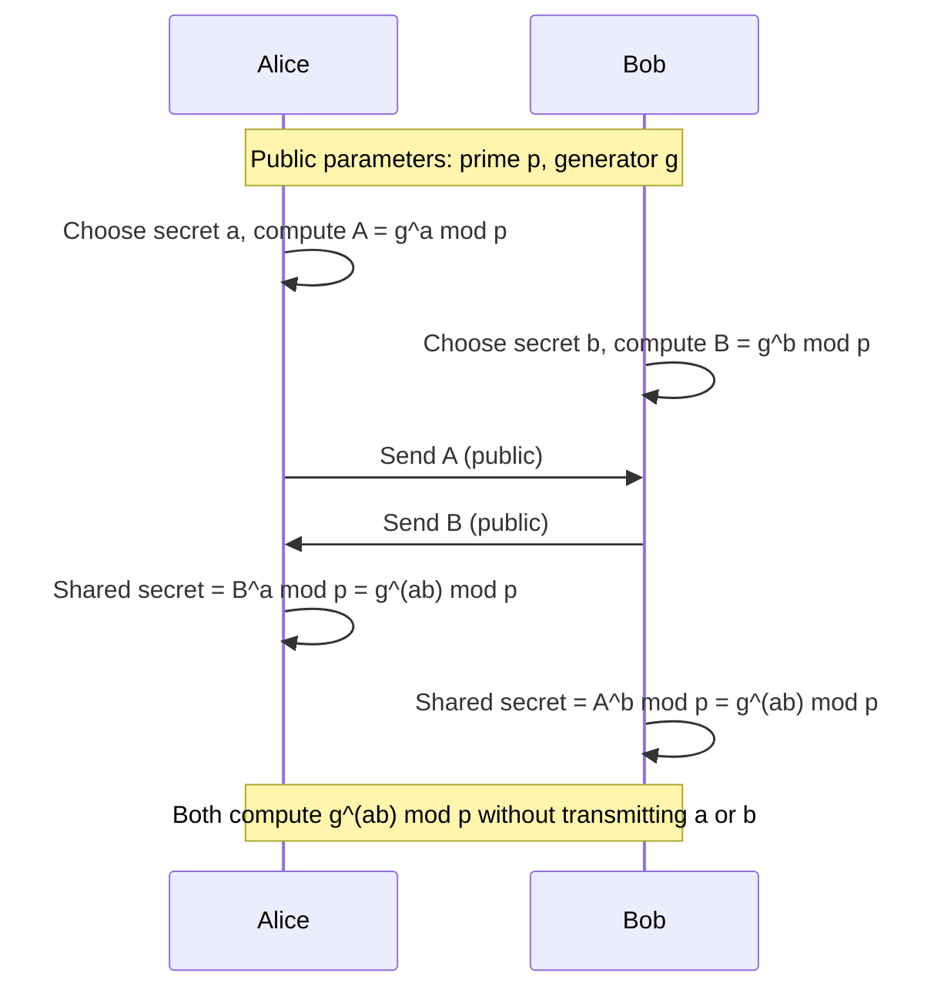
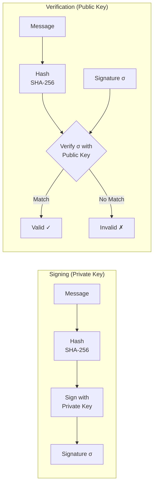
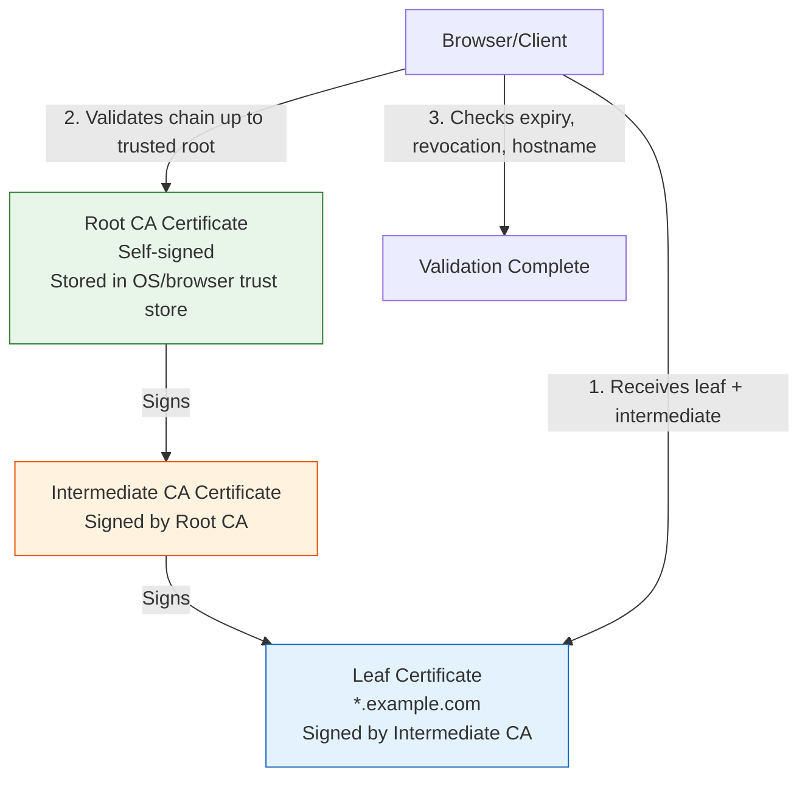
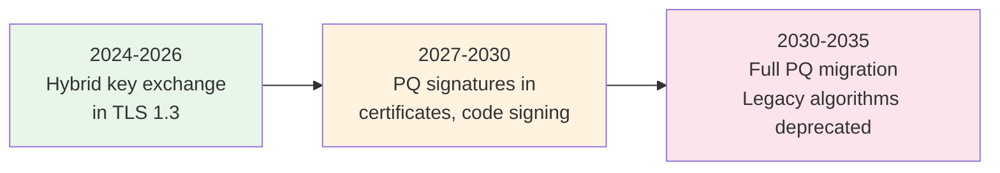

# Cryptography for Engineers

Cryptography is the foundation of every secure system. TLS, SSH, JWTs, code signing, certificate pinning, end-to-end encryption — they all rely on a small set of cryptographic primitives. Most engineers use these primitives through libraries without understanding what they do. That works until something breaks: a certificate chain fails validation, a signature verification returns false when it should not, or someone asks you to choose between RSA-2048 and Ed25519 and you have no basis for the decision.

This page covers the primitives that matter in production: key exchange, digital signatures, certificate chains, and the post-quantum algorithms that will replace today's cryptography within the next decade.

## Asymmetric Algorithm Comparison

Before diving deep, here is the landscape:

| Algorithm | Type | Key Size (128-bit security) | Signature Size | Speed | Status |
|-----------|------|-----------------------------|----------------|-------|--------|
| RSA-3072 | Factoring | 3072-bit public key | 384 bytes | Slow | Legacy, still widely used |
| ECDSA (P-256) | Elliptic curve | 256-bit public key | 64 bytes | Fast | Standard, widely deployed |
| Ed25519 | Edwards curve | 256-bit public key | 64 bytes | Very fast | Modern default |
| X25519 | Montgomery curve | 256-bit | N/A (key exchange only) | Very fast | Modern DH default |
| Dilithium | Lattice-based | ~1.3 KB public key | ~2.4 KB | Moderate | NIST PQC standard |

::: tip The Modern Default
For new systems in 2026, use **Ed25519** for signatures and **X25519** for key exchange unless you have a specific compliance requirement mandating RSA or ECDSA. Ed25519 is faster, has smaller keys, avoids entire classes of implementation bugs, and is supported by OpenSSH, TLS 1.3, and every major crypto library.
:::

## RSA: The Factoring Problem

RSA, published in 1977 by Rivest, Shamir, and Adleman, is based on the difficulty of factoring the product of two large primes.

### RSA Key Generation

1. Choose two large primes $p$ and $q$ (each ~1536 bits for RSA-3072)
2. Compute $n = p \cdot q$ (this is the modulus, part of the public key)
3. Compute $\phi(n) = (p-1)(q-1)$ (Euler's totient)
4. Choose public exponent $e$ such that $1 < e < \phi(n)$ and $\gcd(e, \phi(n)) = 1$ (typically $e = 65537$)
5. Compute private exponent $d = e^{-1} \mod \phi(n)$ (modular inverse)

**Public key:** $(n, e)$
**Private key:** $(n, d)$

### RSA Operations

**Encryption:**

$$
C = M^e \mod n
$$

**Decryption:**

$$
M = C^d \mod n
$$

**Signing:**

$$
\sigma = H(M)^d \mod n
$$

**Verification:**

$$
H(M) \stackrel{?}{=} \sigma^e \mod n
$$

Where $H(M)$ is a cryptographic hash (SHA-256) of the message.

### Why RSA Is Slow

RSA operations involve modular exponentiation with 3072+ bit numbers. Even with optimizations (Chinese Remainder Theorem for decryption, small public exponent for encryption), RSA is roughly 1000x slower than symmetric encryption.

```
Benchmark (typical modern CPU):
  RSA-2048 sign:    ~1.5 ms
  RSA-2048 verify:  ~0.04 ms
  Ed25519 sign:     ~0.02 ms
  Ed25519 verify:   ~0.06 ms
  AES-256-GCM:      ~3 GB/s
```

::: warning RSA Padding Matters
Never use "textbook RSA" ($C = M^e \mod n$). Without proper padding, RSA is vulnerable to chosen-ciphertext attacks. Always use:
- **OAEP** (Optimal Asymmetric Encryption Padding) for encryption
- **PSS** (Probabilistic Signature Scheme) for signatures
- Never use PKCS#1 v1.5 padding in new systems (Bleichenbacher attack)
:::

## Elliptic Curve Cryptography

Elliptic curves provide the same security as RSA with dramatically smaller keys. An EC key of 256 bits provides roughly the same security as a 3072-bit RSA key.

### The Math (Simplified)

An elliptic curve over a finite field $\mathbb{F}_p$ is the set of points $(x, y)$ satisfying:

$$
y^2 = x^3 + ax + b \pmod{p}
$$

Plus a special "point at infinity" $\mathcal{O}$ that acts as the identity element.

The key insight is **point addition**: given two points $P$ and $Q$ on the curve, there is a geometric operation that produces a third point $P + Q$ also on the curve. This enables **scalar multiplication**: $k \cdot P = P + P + \cdots + P$ ($k$ times).

The **Elliptic Curve Discrete Logarithm Problem (ECDLP):** Given $P$ and $Q = k \cdot P$, finding $k$ is computationally infeasible for large curves. This is the trapdoor.

### ECDSA vs Ed25519

| Feature | ECDSA (P-256) | Ed25519 |
|---------|---------------|---------|
| Curve | NIST P-256 (Weierstrass) | Curve25519 (Edwards) |
| Randomness needed for signing | Yes (fatal if broken) | No (deterministic) |
| Constant-time implementation | Hard to get right | Built into the design |
| Side-channel resistance | Requires careful implementation | Resistant by construction |
| Signature malleability | Malleable without normalization | Non-malleable |
| Performance | Fast | Faster |
| Adoption | TLS, Bitcoin (secp256k1), PKI | SSH, Signal, Wireguard, TLS 1.3 |

::: danger ECDSA's Fatal Flaw: Nonce Reuse
ECDSA requires a random nonce $k$ for every signature. If the same $k$ is used twice with different messages, the private key can be recovered algebraically. This is not theoretical — the PlayStation 3 code signing key was extracted exactly this way in 2010 (fail0verflow). Sony used the same $k$ for every signature.

Ed25519 avoids this entirely by deriving the nonce deterministically from the private key and message using a hash function.
:::

### Ed25519 Internals

Ed25519 uses a twisted Edwards curve:

$$
-x^2 + y^2 = 1 + d \cdot x^2 \cdot y^2
$$

where $d = -121665/121666$ over the prime field $p = 2^{255} - 19$.

**Key generation:**
1. Generate 32 random bytes as seed $s$
2. Hash: $h = \text{SHA-512}(s)$, take first 32 bytes, clamp (clear/set specific bits) to get scalar $a$
3. Public key: $A = a \cdot B$ where $B$ is the base point

**Signing message $M$:**
1. Compute $r = \text{SHA-512}(h_{32..63} \| M)$ (deterministic nonce from second half of hash and message)
2. Compute $R = r \cdot B$
3. Compute $S = r + \text{SHA-512}(R \| A \| M) \cdot a \pmod{\ell}$ where $\ell$ is the group order
4. Signature is $(R, S)$ — 64 bytes

**Verification:**
Check that $8 \cdot S \cdot B = 8 \cdot R + 8 \cdot \text{SHA-512}(R \| A \| M) \cdot A$

## Diffie-Hellman Key Exchange

Diffie-Hellman (1976) allows two parties to establish a shared secret over an insecure channel. It is the foundation of TLS, SSH, and virtually every encrypted connection.

### Classical DH (Finite Field)



The security relies on the **Discrete Logarithm Problem:** given $g$, $p$, and $g^a \mod p$, computing $a$ is infeasible.

### The Math

Alice and Bob agree on public parameters:
- A large prime $p$ (at least 2048 bits)
- A generator $g$ of the multiplicative group modulo $p$

$$
\text{Alice computes: } A = g^a \mod p
$$

$$
\text{Bob computes: } B = g^b \mod p
$$

$$
\text{Shared secret: } K = g^{ab} \mod p
$$

Alice computes $K = B^a = (g^b)^a = g^{ab} \mod p$

Bob computes $K = A^b = (g^a)^b = g^{ab} \mod p$

An eavesdropper sees $g$, $p$, $A = g^a$, and $B = g^b$ but cannot compute $g^{ab}$ without knowing $a$ or $b$.

### ECDH (Elliptic Curve Diffie-Hellman)

Modern systems use X25519 (ECDH over Curve25519) instead of classical DH:

```javascript
import { createECDH } from 'crypto';

// Alice
const alice = createECDH('prime256v1');
alice.generateKeys();
const alicePublic = alice.getPublicKey();

// Bob
const bob = createECDH('prime256v1');
bob.generateKeys();
const bobPublic = bob.getPublicKey();

// Both compute the same shared secret
const aliceSecret = alice.computeSecret(bobPublic);
const bobSecret = bob.computeSecret(alicePublic);

console.log(aliceSecret.equals(bobSecret)); // true
```

::: warning DH Is Vulnerable to Man-in-the-Middle
Plain Diffie-Hellman provides no authentication. An attacker can perform two separate DH exchanges — one with Alice and one with Bob — and relay modified messages between them. This is why DH is always combined with authentication (digital signatures, certificates) in protocols like TLS.
:::

## Digital Signatures

A digital signature proves three things:
1. **Authentication** — The message was created by the claimed sender
2. **Integrity** — The message was not altered in transit
3. **Non-repudiation** — The sender cannot deny having sent the message

### How Signing Works



### Practical Example: Signing a JWT

```javascript
import { createSign, createVerify, generateKeyPairSync } from 'crypto';

// Generate Ed25519 key pair
const { publicKey, privateKey } = generateKeyPairSync('ed25519');

// Sign
const message = '{"sub":"user123","exp":1700000000}';
const sign = createSign('SHA512'); // Ed25519 ignores this, uses EdDSA internally
sign.update(message);
const signature = sign.sign(privateKey);

console.log(`Signature: ${signature.toString('base64')}`);
// Output: 64-byte Ed25519 signature

// Verify
const verify = createVerify('SHA512');
verify.update(message);
const isValid = verify.verify(publicKey, signature);

console.log(`Valid: ${isValid}`); // true

// Tamper with message
const verify2 = createVerify('SHA512');
verify2.update(message + 'tampered');
const isValid2 = verify2.verify(publicKey, signature);

console.log(`Valid after tampering: ${isValid2}`); // false
```

## Certificate Chains and PKI

### The Trust Problem

Digital signatures prove a message came from a specific key, but how do you know the key belongs to who you think it does? This is the **key distribution problem**, and Public Key Infrastructure (PKI) solves it using a hierarchy of trust.

### X.509 Certificate Structure

An X.509 certificate binds an identity to a public key:

```
Certificate:
    Data:
        Version: 3
        Serial Number: 04:e2:8a:...
        Signature Algorithm: ecdsa-with-SHA384
        Issuer: CN=DigiCert Global G2 TLS RSA SHA256 2020 CA1, O=DigiCert Inc
        Validity:
            Not Before: Jan 15 00:00:00 2026 GMT
            Not After:  Feb 14 23:59:59 2027 GMT
        Subject: CN=*.example.com, O=Example Inc
        Subject Public Key Info:
            Algorithm: id-ecPublicKey (P-256)
            Public Key: 04:a3:b5:...
        X509v3 Extensions:
            Subject Alternative Name:
                DNS:*.example.com, DNS:example.com
            Key Usage: Digital Signature
            Extended Key Usage: TLS Web Server Authentication
    Signature Algorithm: ecdsa-with-SHA384
    Signature Value: 30:45:02:21:...
```

### Certificate Chain Validation



**Validation steps:**
1. **Chain building:** Construct a path from leaf certificate to a trusted root
2. **Signature verification:** Each certificate's signature is verified with its issuer's public key
3. **Validity period:** Check that every certificate in the chain is within its validity window
4. **Revocation check:** Query CRL (Certificate Revocation List) or OCSP (Online Certificate Status Protocol)
5. **Name matching:** Verify the leaf certificate's SAN (Subject Alternative Name) matches the requested hostname
6. **Key usage:** Verify the certificate is authorized for the intended purpose (e.g., TLS server auth)

### Certificate Transparency

Certificate Transparency (CT) is a public audit log for certificates. Every CA must submit certificates to CT logs before issuance. This allows domain owners to detect misissued certificates:

```bash
# Check CT logs for your domain
curl -s "https://crt.sh/?q=%.example.com&output=json" | jq '.[0:5]'
```

::: warning Certificate Pinning Is Risky
Certificate pinning (hardcoding expected certificates or public keys) prevents MITM attacks but creates operational nightmares. If the pinned certificate expires or you need to rotate keys, pinned clients break with no recovery path. HPKP (HTTP Public Key Pinning) was deprecated in Chrome 72 for this reason. Prefer Certificate Transparency monitoring over pinning.
:::

## Post-Quantum Cryptography

Quantum computers with sufficient qubits will break RSA, ECDSA, Ed25519, and Diffie-Hellman using Shor's algorithm. While large-scale quantum computers do not exist yet, the threat is real because of **harvest now, decrypt later** — adversaries can record encrypted traffic today and decrypt it once quantum computers arrive.

### What Breaks and What Survives

| Algorithm | Quantum Impact | Timeline |
|-----------|---------------|----------|
| RSA | Broken by Shor's algorithm | When ~4000 logical qubits exist |
| ECDSA / Ed25519 | Broken by Shor's algorithm | Same |
| Diffie-Hellman | Broken by Shor's algorithm | Same |
| AES-256 | Weakened to 128-bit (Grover's) | Still secure with larger keys |
| SHA-256 | Weakened to 128-bit (Grover's) | Still secure |
| HMAC | Unaffected | Secure |

### NIST Post-Quantum Standards (2024)

NIST selected four algorithms after an 8-year evaluation:

**Key Exchange / Encryption:**
- **ML-KEM (CRYSTALS-Kyber)** — Lattice-based key encapsulation mechanism. Fast, small keys (~1.5 KB). The recommended default for post-quantum key exchange.

**Digital Signatures:**
- **ML-DSA (CRYSTALS-Dilithium)** — Lattice-based signatures. Moderate size (~2.4 KB signatures). General-purpose default.
- **SLH-DSA (SPHINCS+)** — Hash-based signatures. Larger but relies only on hash function security (most conservative choice).
- **FN-DSA (FALCON)** — Lattice-based, smaller signatures than Dilithium but harder to implement safely.

### Lattice-Based Cryptography: The Intuition

Lattice problems work in high-dimensional spaces. The core hard problem is the **Learning With Errors (LWE)** problem:

Given a system of approximate linear equations:

$$
\mathbf{b} = \mathbf{A} \cdot \mathbf{s} + \mathbf{e} \pmod{q}
$$

Where $\mathbf{A}$ is a public matrix, $\mathbf{s}$ is the secret, and $\mathbf{e}$ is a small error vector — find $\mathbf{s}$.

Without the error term, this is simple linear algebra (Gaussian elimination). With the error term, it becomes computationally intractable even for quantum computers.

### Hybrid Key Exchange in TLS

The transition strategy is **hybrid key exchange**: combine a classical algorithm (X25519) with a post-quantum algorithm (ML-KEM-768). If either one is secure, the combined scheme is secure.

```
TLS 1.3 Hybrid Key Exchange:
  Client → Server: X25519_public_key || ML-KEM-768_encapsulation_key
  Server → Client: X25519_public_key || ML-KEM-768_ciphertext

  Shared secret = HKDF(X25519_shared_secret || ML-KEM_shared_secret)
```

Chrome and Firefox already support X25519+ML-KEM-768 hybrid key exchange since 2024.

```bash
# Check if a server supports post-quantum key exchange
openssl s_client -connect example.com:443 -groups X25519MLKEM768
```

### Migration Timeline



::: tip Start Now
Even if large quantum computers are a decade away, you should:
1. **Inventory** all cryptographic dependencies in your systems
2. **Enable** hybrid key exchange where your TLS stack supports it
3. **Avoid** RSA in new systems — use Ed25519/X25519 (easier to migrate to PQ later)
4. **Monitor** NIST standards and your library's PQ support
:::

## Practical Cryptographic Decisions

### Decision Matrix for Common Scenarios

| Scenario | Recommended Algorithm | Why |
|----------|----------------------|-----|
| TLS certificates | ECDSA P-256 or Ed25519 | Broad compatibility (ECDSA) or performance (Ed25519) |
| SSH keys | Ed25519 | Smallest keys, fastest, most secure |
| JWT signing | Ed25519 (EdDSA) | Deterministic, no nonce pitfalls |
| Code signing | Ed25519 or ECDSA P-256 | Ecosystem support dependent |
| Encrypting data at rest | AES-256-GCM | Symmetric, fast, authenticated |
| Key exchange | X25519 + ML-KEM-768 (hybrid) | Post-quantum safe |
| Password hashing | Argon2id | Not encryption — purpose-built KDF |
| API request signing | HMAC-SHA256 | Symmetric, simple, fast |

### Generate Ed25519 Keys

```bash
# SSH key
ssh-keygen -t ed25519 -C "engineer@example.com"

# OpenSSL
openssl genpkey -algorithm Ed25519 -out private.pem
openssl pkey -in private.pem -pubout -out public.pem

# View the key
openssl pkey -in private.pem -text -noout
```

## Common Cryptographic Mistakes

| Mistake | Impact | Correct Approach |
|---------|--------|-----------------|
| Using RSA-1024 | Factorable with current hardware | Minimum RSA-2048, prefer RSA-3072 or Ed25519 |
| ECB mode for block ciphers | Patterns in plaintext visible in ciphertext | Use GCM (authenticated encryption) |
| Custom crypto protocol | Almost certainly broken | Use TLS 1.3, libsodium, or NaCl |
| Storing encryption keys alongside data | Key compromise = data compromise | Use HSMs, KMS, or envelope encryption |
| Using MD5 or SHA-1 for signatures | Collision attacks demonstrated | SHA-256 minimum |
| Not validating certificate chains | MITM trivially possible | Use standard TLS libraries, do not disable verification |
| Reusing nonces in AES-GCM | Catastrophic — authentication completely broken | Use random nonces or counter-based nonces, never reuse |

::: danger Never Roll Your Own Crypto
The first rule of cryptography: do not implement your own. Use audited, well-maintained libraries: libsodium, OpenSSL, BoringSSL, or your language's standard crypto library. The history of cryptography is littered with systems broken not because the math was wrong, but because the implementation was subtly flawed.
:::

## Further Reading

- [Symmetric vs Asymmetric Encryption](/security/encryption/symmetric-vs-asymmetric) — Foundation for this page
- [Key Management](/security/encryption/key-management) — Production key lifecycle
- [Encryption in Transit](/security/encryption/encryption-in-transit) — TLS configuration
- [TLS Handshake Deep Dive](/system-design/networking/tls-handshake) — Where these algorithms meet the network
- [Hashing Algorithms](/security/encryption/hashing-algorithms) — SHA-256, BLAKE3, and when to use which
- *Serious Cryptography* by Jean-Philippe Aumasson — The best practical cryptography book
- *Real-World Cryptography* by David Wong — Modern algorithms with code examples
- NIST Post-Quantum Cryptography Standards (FIPS 203, 204, 205)
