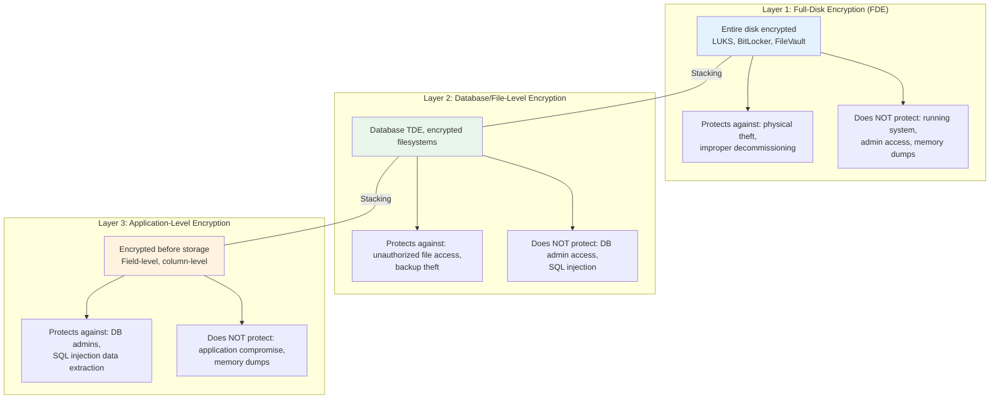
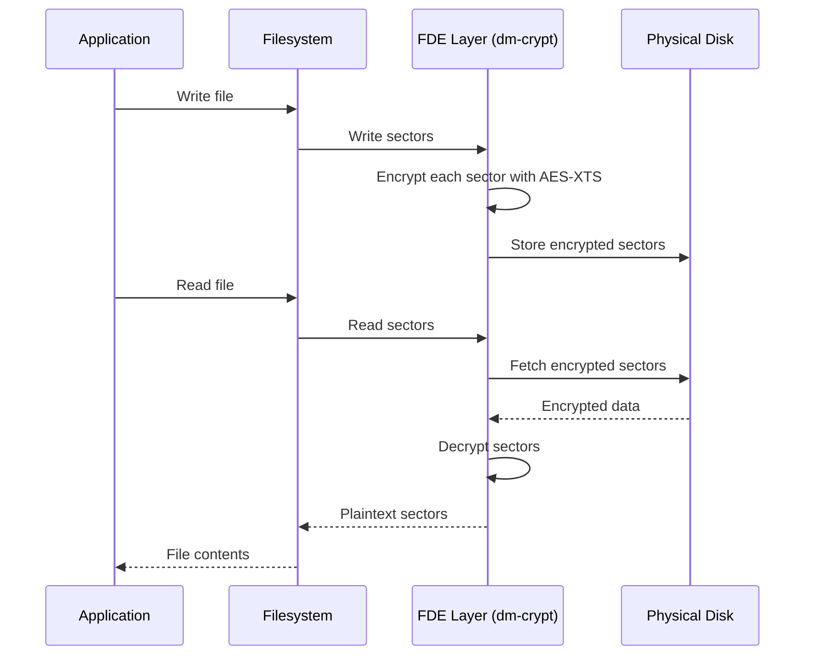
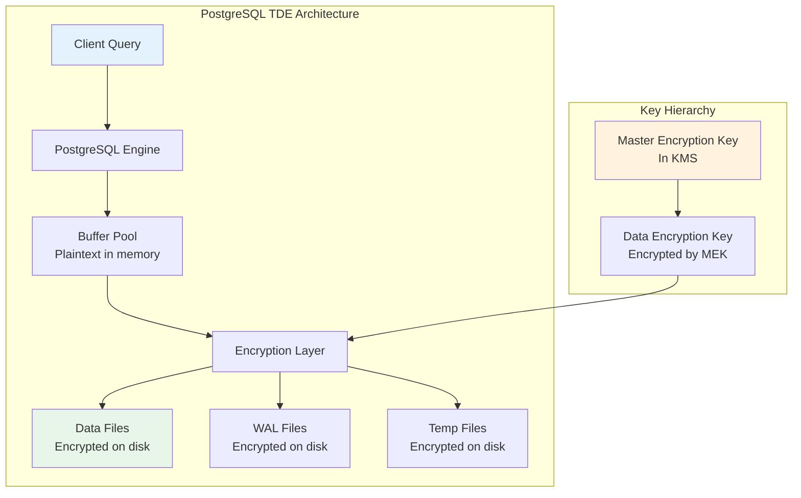
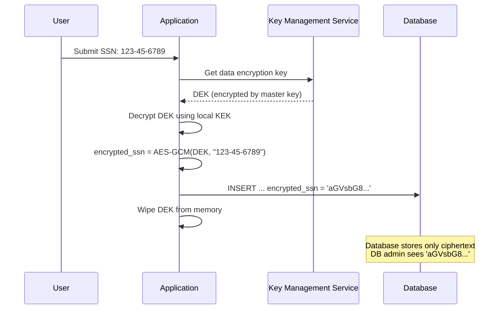
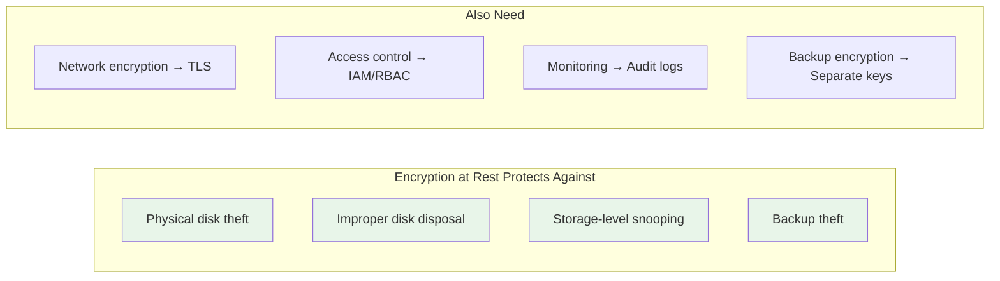

# Encryption at Rest

## Why Encryption at Rest Exists

Encryption at rest protects data stored on physical media — hard drives, SSDs, databases, backups, and object storage. It defends against physical theft, unauthorized disk access, and improper decommissioning of hardware.

Without encryption at rest, anyone with physical access to a server (a disgruntled employee, a data center technician, or a thief) can read all stored data by mounting the disk. Cloud providers can theoretically access customer data on shared hardware. Backup tapes and old disks can be recovered from recycling.

The fundamental threat model: **Protect data when the access control layer is bypassed** — whether through physical access, stolen backups, or compromised storage infrastructure.

### Historical Context

- **2006**: TDE (Transparent Data Encryption) introduced in SQL Server 2008
- **2010**: AWS launches EBS encryption
- **2013**: MongoDB adds encryption at rest in Enterprise
- **2015**: LUKS2 (Linux disk encryption) gains Argon2-based key derivation
- **2016**: AWS introduces S3 default encryption
- **2019**: Google Cloud mandates encryption at rest for all services
- **2020**: Apple T2/M1 chips enforce full-disk encryption by default
- **2023**: AWS enables EBS encryption by default for new accounts

## First Principles

### The Three Layers of Encryption at Rest



Each layer protects against a different threat. Defense in depth means using multiple layers.

### What Encryption at Rest Does NOT Protect Against

| Threat | Protected? | Why |
|--------|-----------|-----|
| Physical disk theft | Yes | Data is encrypted on disk |
| Backup tape theft | Yes | Backups are encrypted |
| SQL injection reading data | Layer 3 only | Layers 1-2 decrypt transparently for the app |
| Compromised application | No | App has access to the keys |
| Memory scraping (cold boot) | No | Keys are in memory |
| Insider with DB access | Layer 3 only | Layers 1-2 are transparent to DB admins |
| Ransomware | No | Ransomware encrypts already-encrypted data |

## Core Mechanics

### Full-Disk Encryption (FDE)

FDE encrypts the entire block device at the sector level:



#### AES-XTS Mode (for disk encryption)

XTS (XEX-based Tweaked-codebook mode with Ciphertext Stealing) is specifically designed for disk encryption:

$$
C_j = E_K(P_j \oplus T_j) \oplus T_j
$$

where $T_j = E_{K_2}(\text{sector\_number}) \otimes \alpha^j$ is the tweak value, $j$ is the block index within the sector, and $\otimes$ is multiplication in $GF(2^{128})$.

XTS prevents the ECB problem (identical blocks encrypt differently) while being parallelizable and supporting random access to any sector.

### Database-Level Encryption (TDE)

Transparent Data Encryption operates at the database layer:



### Application-Level Encryption (ALE)

Application-level encryption happens in the application code before data reaches the database:



## Implementation

### Application-Level Field Encryption (TypeScript)

```typescript
import crypto from 'node:crypto';

interface EncryptedField {
  v: number;          // Version for algorithm migration
  kid: string;        // Key ID for key rotation
  iv: string;         // Base64 IV
  ct: string;         // Base64 ciphertext
  tag: string;        // Base64 auth tag
}

interface KeyProvider {
  getKey(keyId: string): Promise<Buffer>;
  getCurrentKeyId(): string;
}

class FieldEncryptor {
  private keyProvider: KeyProvider;

  constructor(keyProvider: KeyProvider) {
    this.keyProvider = keyProvider;
  }

  async encryptField(plaintext: string, context?: string): Promise<string> {
    const keyId = this.keyProvider.getCurrentKeyId();
    const key = await this.keyProvider.getKey(keyId);
    const iv = crypto.randomBytes(12);

    const cipher = crypto.createCipheriv('aes-256-gcm', key, iv);

    // Use context as AAD to bind ciphertext to its intended use
    if (context) {
      cipher.setAAD(Buffer.from(context, 'utf8'));
    }

    const encrypted = Buffer.concat([
      cipher.update(plaintext, 'utf8'),
      cipher.final(),
    ]);
    const tag = cipher.getAuthTag();

    const field: EncryptedField = {
      v: 1,
      kid: keyId,
      iv: iv.toString('base64'),
      ct: encrypted.toString('base64'),
      tag: tag.toString('base64'),
    };

    return JSON.stringify(field);
  }

  async decryptField(ciphertext: string, context?: string): Promise<string> {
    const field: EncryptedField = JSON.parse(ciphertext);

    if (field.v !== 1) {
      throw new Error(`Unsupported encryption version: ${field.v}`);
    }

    const key = await this.keyProvider.getKey(field.kid);
    const iv = Buffer.from(field.iv, 'base64');
    const ct = Buffer.from(field.ct, 'base64');
    const tag = Buffer.from(field.tag, 'base64');

    const decipher = crypto.createDecipheriv('aes-256-gcm', key, iv);
    decipher.setAuthTag(tag);

    if (context) {
      decipher.setAAD(Buffer.from(context, 'utf8'));
    }

    try {
      return Buffer.concat([decipher.update(ct), decipher.final()]).toString('utf8');
    } catch {
      throw new Error('Decryption failed: data may have been tampered with');
    }
  }

  /**
   * Re-encrypt a field with the current key (for key rotation).
   */
  async rotateField(ciphertext: string, context?: string): Promise<string> {
    const plaintext = await this.decryptField(ciphertext, context);
    return this.encryptField(plaintext, context);
  }
}
```

### Prisma Middleware for Automatic Field Encryption

```typescript
import { PrismaClient } from '@prisma/client';

const ENCRYPTED_FIELDS: Record<string, string[]> = {
  User: ['ssn', 'dateOfBirth', 'bankAccountNumber'],
  PaymentMethod: ['cardNumber', 'cvv'],
  MedicalRecord: ['diagnosis', 'notes'],
};

function createEncryptedPrisma(encryptor: FieldEncryptor): PrismaClient {
  const prisma = new PrismaClient();

  // Encrypt on write
  prisma.$use(async (params, next) => {
    const modelFields = ENCRYPTED_FIELDS[params.model ?? ''];
    if (!modelFields) return next(params);

    if (params.action === 'create' || params.action === 'update') {
      const data = params.args.data;
      for (const field of modelFields) {
        if (data[field] !== undefined && data[field] !== null) {
          const context = `${params.model}:${field}`;
          data[field] = await encryptor.encryptField(
            String(data[field]),
            context
          );
        }
      }
    }

    const result = await next(params);

    // Decrypt on read
    if (result && modelFields) {
      const decryptRecord = async (record: any) => {
        for (const field of modelFields) {
          if (record[field] && typeof record[field] === 'string') {
            try {
              const context = `${params.model}:${field}`;
              record[field] = await encryptor.decryptField(record[field], context);
            } catch {
              // Field may not be encrypted (migration in progress)
            }
          }
        }
        return record;
      };

      if (Array.isArray(result)) {
        return Promise.all(result.map(decryptRecord));
      }
      return decryptRecord(result);
    }

    return result;
  });

  return prisma;
}
```

### LUKS Full-Disk Encryption Setup (Linux)

```bash
#!/bin/bash
# Full-disk encryption with LUKS2 and Argon2id

# Create encrypted partition
cryptsetup luksFormat \
  --type luks2 \
  --cipher aes-xts-plain64 \
  --key-size 512 \           # 256 bits for AES-XTS (split into two keys)
  --hash sha256 \
  --iter-time 5000 \         # 5 seconds for key derivation
  --pbkdf argon2id \         # Memory-hard KDF
  --pbkdf-memory 1048576 \   # 1 GiB memory for KDF
  --pbkdf-parallel 4 \       # 4 threads
  /dev/sda2

# Open the encrypted partition
cryptsetup open /dev/sda2 encrypted_data

# Create filesystem
mkfs.ext4 /dev/mapper/encrypted_data

# Mount
mount /dev/mapper/encrypted_data /data

# Add to /etc/crypttab for boot
echo "encrypted_data UUID=$(cryptsetup luksUUID /dev/sda2) none luks" >> /etc/crypttab
```

### AWS S3 Encryption Configuration (Terraform)

```hcl
resource "aws_s3_bucket" "sensitive_data" {
  bucket = "company-sensitive-data"
}

# Enforce encryption for all objects
resource "aws_s3_bucket_server_side_encryption_configuration" "sensitive_data" {
  bucket = aws_s3_bucket.sensitive_data.id

  rule {
    apply_server_side_encryption_by_default {
      sse_algorithm     = "aws:kms"
      kms_master_key_id = aws_kms_key.s3_key.arn
    }
    bucket_key_enabled = true  # Reduces KMS API calls by 99%
  }
}

# Block unencrypted uploads via bucket policy
resource "aws_s3_bucket_policy" "require_encryption" {
  bucket = aws_s3_bucket.sensitive_data.id
  policy = jsonencode({
    Version = "2012-10-17"
    Statement = [
      {
        Sid       = "DenyUnencryptedUploads"
        Effect    = "Deny"
        Principal = "*"
        Action    = "s3:PutObject"
        Resource  = "${aws_s3_bucket.sensitive_data.arn}/*"
        Condition = {
          StringNotEquals = {
            "s3:x-amz-server-side-encryption" = "aws:kms"
          }
        }
      },
      {
        Sid       = "DenyInsecureTransport"
        Effect    = "Deny"
        Principal = "*"
        Action    = "s3:*"
        Resource  = [
          aws_s3_bucket.sensitive_data.arn,
          "${aws_s3_bucket.sensitive_data.arn}/*"
        ]
        Condition = {
          Bool = {
            "aws:SecureTransport" = "false"
          }
        }
      }
    ]
  })
}

# KMS key with automatic rotation
resource "aws_kms_key" "s3_key" {
  description             = "S3 bucket encryption key"
  deletion_window_in_days = 30
  enable_key_rotation     = true  # Automatic annual rotation

  policy = jsonencode({
    Version = "2012-10-17"
    Statement = [
      {
        Sid    = "EnableRootAccountFullAccess"
        Effect = "Allow"
        Principal = { AWS = "arn:aws:iam::${data.aws_caller_identity.current.account_id}:root" }
        Action = "kms:*"
        Resource = "*"
      }
    ]
  })
}
```

### PostgreSQL Column-Level Encryption with pgcrypto

```sql
-- Enable pgcrypto extension
CREATE EXTENSION IF NOT EXISTS pgcrypto;

-- Create table with encrypted columns
CREATE TABLE patients (
    id UUID PRIMARY KEY DEFAULT gen_random_uuid(),
    name TEXT NOT NULL,                        -- Not encrypted (needed for display)
    email TEXT NOT NULL,                        -- Not encrypted (needed for lookup)
    ssn BYTEA NOT NULL,                        -- Encrypted
    diagnosis BYTEA,                           -- Encrypted
    created_at TIMESTAMPTZ DEFAULT NOW()
);

-- Encrypt on insert
INSERT INTO patients (name, email, ssn, diagnosis)
VALUES (
    'John Doe',
    'john@example.com',
    pgp_sym_encrypt('123-45-6789', current_setting('app.encryption_key')),
    pgp_sym_encrypt('Condition details', current_setting('app.encryption_key'))
);

-- Decrypt on select
SELECT
    name,
    email,
    pgp_sym_decrypt(ssn, current_setting('app.encryption_key')) AS ssn,
    pgp_sym_decrypt(diagnosis, current_setting('app.encryption_key')) AS diagnosis
FROM patients
WHERE id = 'some-uuid';

-- Set the encryption key at session level (from environment/KMS)
SET app.encryption_key = 'your-encryption-key-from-kms';
```

::: warning
Using `pgp_sym_encrypt` in SQL queries means the encryption key passes through the database engine. For maximum security, prefer application-level encryption where the key never reaches the database.
:::

## Edge Cases & Failure Modes

### Key Loss = Data Loss

The most catastrophic failure mode of encryption at rest is losing the encryption key. Unlike a password reset, there is no recovery path.

| Scenario | Impact | Prevention |
|----------|--------|------------|
| KMS key deleted | All data permanently unreadable | Key deletion protection, waiting period |
| Key rotation bug | New data readable, old data not | Test rotation in staging, keep old keys |
| Backup without key backup | Encrypted backups are useless | Always backup keys separately from data |
| Multi-region key mismatch | Cross-region restoration fails | Replicate keys across regions |

### Performance Impact by Layer

| Layer | Read Latency Impact | Write Latency Impact | Throughput Impact |
|-------|--------------------|--------------------|------------------|
| FDE (AES-NI) | < 1% | < 1% | < 2% |
| FDE (no AES-NI) | 5–15% | 5–15% | 10–30% |
| Database TDE | 2–5% | 3–8% | 5–15% |
| Application-level | 5–20% | 5–20% | 10–30% |
| Application + KMS call | 10–50ms per field | 10–50ms per field | Depends on caching |

### Searchability Problem

Encrypted data cannot be searched or indexed efficiently:

```sql
-- This does NOT work with encrypted SSN:
SELECT * FROM patients WHERE ssn = '123-45-6789';
-- Because the stored value is ciphertext, not plaintext
```

Solutions:

| Approach | How It Works | Tradeoff |
|----------|-------------|----------|
| Blind index | Store HMAC(value) alongside encrypted value | Reveals equality, not content |
| Deterministic encryption | Same plaintext always produces same ciphertext | Reveals frequency patterns |
| Searchable encryption | Specialized schemes (OPE, SSE) | Complex, limited operations |
| Decrypt-and-filter | Load all, decrypt, filter in app | Very slow for large datasets |

```typescript
// Blind index implementation
function createBlindIndex(value: string, indexKey: Buffer): string {
  return crypto
    .createHmac('sha256', indexKey)
    .update(value.toLowerCase().trim())
    .digest('hex')
    .substring(0, 16); // Truncate to reduce leakage
}

// Store encrypted value + blind index
async function storeEncryptedSSN(ssn: string) {
  const encrypted = await encryptor.encryptField(ssn, 'User:ssn');
  const blindIndex = createBlindIndex(ssn, INDEX_KEY);

  await db.execute(
    'INSERT INTO users (encrypted_ssn, ssn_index) VALUES ($1, $2)',
    [encrypted, blindIndex]
  );
}

// Search using blind index
async function findBySSN(ssn: string) {
  const blindIndex = createBlindIndex(ssn, INDEX_KEY);
  return db.query(
    'SELECT * FROM users WHERE ssn_index = $1',
    [blindIndex]
  );
}
```

## Performance Characteristics

### AES-XTS Disk Encryption Throughput

On modern hardware with AES-NI:

$$
\text{Throughput}_{\text{AES-XTS}} \approx 3\text{–}5 \text{ GB/s (single core)}
$$

This exceeds typical SSD sequential speeds (~3.5 GB/s for NVMe), making FDE essentially zero-overhead on modern hardware.

### KMS API Latency Impact

| KMS Service | API Latency (p50) | API Latency (p99) | Cost per call |
|-------------|-------------------|--------------------|---------------|
| AWS KMS | 5ms | 50ms | $0.03/10K requests |
| GCP Cloud KMS | 10ms | 80ms | $0.03/10K requests |
| Azure Key Vault | 10ms | 100ms | $0.03/10K requests |
| HashiCorp Vault | 2ms (self-hosted) | 20ms | Free (self-hosted) |

**Critical optimization**: Use envelope encryption to minimize KMS calls. Decrypt the DEK once, cache it in memory, and use it for all subsequent operations.

## Mathematical Foundations

### AES-XTS Tweak Calculation

The tweak in XTS mode ensures that identical plaintext blocks at different disk positions produce different ciphertext:

$$
T_j = E_{K_2}(i) \otimes \alpha^j
$$

where $i$ is the sector number, $j$ is the block index within the sector, and $\alpha$ is a primitive element of $GF(2^{128})$.

Multiplication by $\alpha$ in $GF(2^{128})$ is a simple left shift with conditional XOR:

$$
\alpha \otimes x =
\begin{cases}
x \ll 1 & \text{if MSB}(x) = 0 \\
(x \ll 1) \oplus 0x87 & \text{if MSB}(x) = 1
\end{cases}
$$

### Key Hierarchy Security Model

In a two-level key hierarchy (KEK wrapping DEK):

$$
\text{Security} = \min(\text{Security}(\text{KEK}), \text{Security}(\text{DEK}))
$$

But the operational benefit is significant: rotating the DEK requires only re-encrypting the DEK wrapper (one KMS call), not re-encrypting all data.

## Real-World War Stories

::: info War Story
**The MongoDB Encryption-at-Rest Default (2017)**

A wave of ransomware attacks targeted MongoDB instances exposed to the internet without authentication. Attackers replaced database contents with ransom demands. Many victims had no backups.

While encryption at rest would not have prevented these attacks (the attackers had network access to the running database), it highlighted the need for defense in depth. MongoDB subsequently added encryption at rest as a default feature and improved their security documentation.

**Lesson**: Encryption at rest is one layer. It must be combined with network security, authentication, and access controls.
:::

::: info War Story
**Capital One Breach (2019)**

A former AWS employee exploited a misconfigured WAF to access Capital One's AWS resources, exfiltrating 100 million customer records including SSNs. The data was encrypted at rest using AWS KMS, but the compromised IAM role had permission to decrypt it.

**Lesson**: Encryption at rest protects against physical access and storage-layer attacks. It does not protect against application-layer compromises that have decrypt permissions. Application-level encryption with separate key management would have added a defense layer.
:::

::: info War Story
**Healthcare Provider Key Rotation Failure**

A healthcare company rotated their database encryption key without testing the rollback procedure. The new key was generated but the old key was prematurely deleted from their KMS. When they discovered a bug in the migration and needed to roll back, they could not decrypt the old backups. Three months of patient records were permanently lost.

**Resolution**: They implemented a mandatory 90-day key retention period after rotation, with automated testing that old data could still be decrypted before any key was destroyed.
:::

## Decision Framework

### When to Encrypt at Which Layer

| Data Type | FDE | Database TDE | App-Level | Why |
|-----------|-----|-------------|-----------|-----|
| General files | Yes | N/A | No | Physical theft protection |
| Non-sensitive DB columns | Yes | Optional | No | Low-value data, minimal overhead |
| PII (names, emails) | Yes | Yes | Optional | Regulatory compliance |
| Financial data (SSN, cards) | Yes | Yes | **Yes** | PCI DSS, maximum protection |
| Health data (PHI) | Yes | Yes | **Yes** | HIPAA, defense in depth |
| Encryption keys | Yes | Yes | **Yes** (envelope) | Keys protecting other keys |
| Passwords | Yes | N/A | **Hash only** | Never encrypt passwords |

### Encryption at Rest vs. Other Controls



## Advanced Topics

### Client-Side Encryption for Cloud Storage

For maximum security, encrypt data before it reaches the cloud provider:

```typescript
import crypto from 'node:crypto';
import { S3Client, PutObjectCommand, GetObjectCommand } from '@aws-sdk/client-s3';

class ClientSideEncryptedS3 {
  private s3: S3Client;
  private encryptionKey: Buffer;

  constructor(s3: S3Client, encryptionKey: Buffer) {
    this.s3 = s3;
    this.encryptionKey = encryptionKey;
  }

  async upload(bucket: string, key: string, data: Buffer): Promise<void> {
    const iv = crypto.randomBytes(12);
    const cipher = crypto.createCipheriv('aes-256-gcm', this.encryptionKey, iv);
    const encrypted = Buffer.concat([cipher.update(data), cipher.final()]);
    const tag = cipher.getAuthTag();

    // Prepend IV and tag to ciphertext
    const payload = Buffer.concat([iv, tag, encrypted]);

    await this.s3.send(new PutObjectCommand({
      Bucket: bucket,
      Key: key,
      Body: payload,
      Metadata: {
        'x-encryption-algorithm': 'AES-256-GCM',
        'x-encryption-version': '1',
      },
    }));
  }

  async download(bucket: string, key: string): Promise<Buffer> {
    const response = await this.s3.send(new GetObjectCommand({
      Bucket: bucket,
      Key: key,
    }));

    const payload = Buffer.from(await response.Body!.transformToByteArray());
    const iv = payload.subarray(0, 12);
    const tag = payload.subarray(12, 28);
    const ciphertext = payload.subarray(28);

    const decipher = crypto.createDecipheriv('aes-256-gcm', this.encryptionKey, iv);
    decipher.setAuthTag(tag);

    return Buffer.concat([decipher.update(ciphertext), decipher.final()]);
  }
}
```

### Searchable Encryption Schemes

Order-Preserving Encryption (OPE) allows range queries on encrypted data:

$$
\text{If } a < b, \text{ then } E(a) < E(b)
$$

However, OPE leaks ordering information. For most applications, blind indexes with equality search are a better security-utility tradeoff.

### Hardware Security Modules (HSMs)

For the highest security level, use HSMs where encryption keys never exist in software:

| HSM Type | Use Case | Cost | FIPS Level |
|----------|----------|------|------------|
| AWS CloudHSM | Cloud workloads | $1.60/hr | FIPS 140-2 Level 3 |
| Thales Luna | On-premise | $20K+ | FIPS 140-2 Level 3 |
| YubiHSM 2 | Small deployments | $650 | FIPS 140-2 Level 3 |
| TPM (device) | Laptop/server disk encryption | Built-in | FIPS 140-2 Level 1-2 |

## Cross-References

- [Encryption Overview](/security/encryption/) — Encryption taxonomy
- [Key Management](/security/encryption/key-management) — Key lifecycle for encryption at rest
- [Envelope Encryption](/security/encryption/envelope-encryption) — Key wrapping patterns
- [Encryption in Transit](/security/encryption/encryption-in-transit) — Protecting data in motion
- [AWS Secrets Manager](/security/secrets-management/aws-secrets-manager) — Storing encryption keys
- [Vault Deep Dive](/security/secrets-management/vault-deep-dive) — Transit secrets engine
