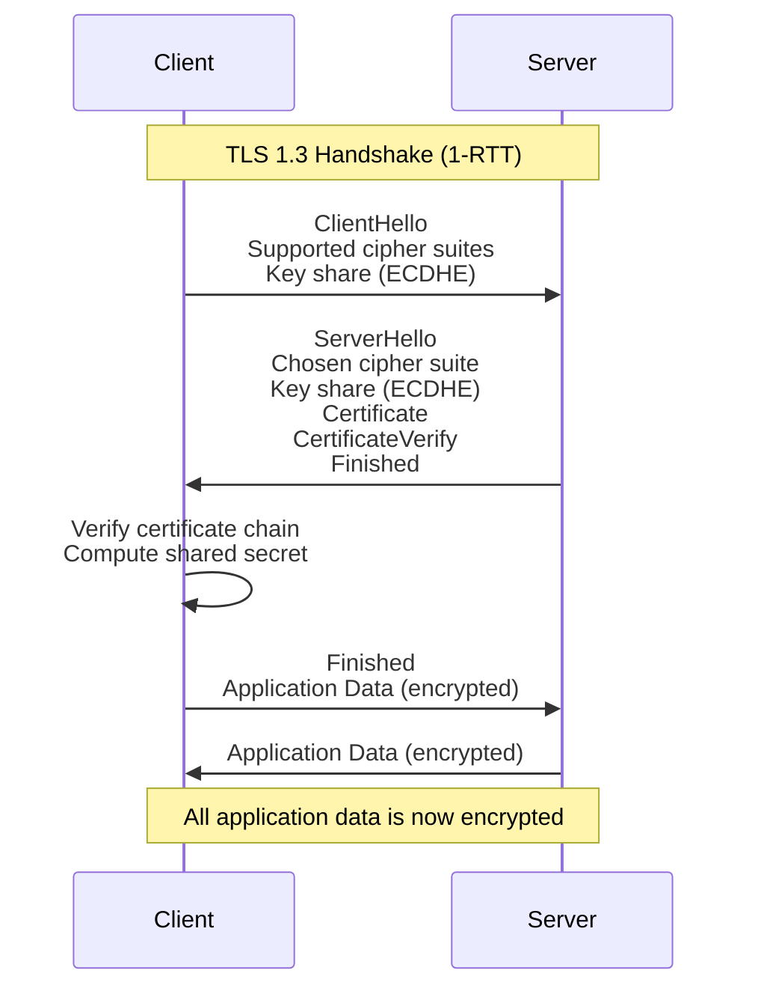
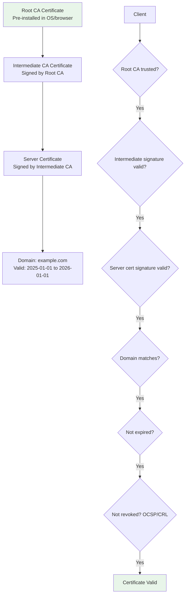
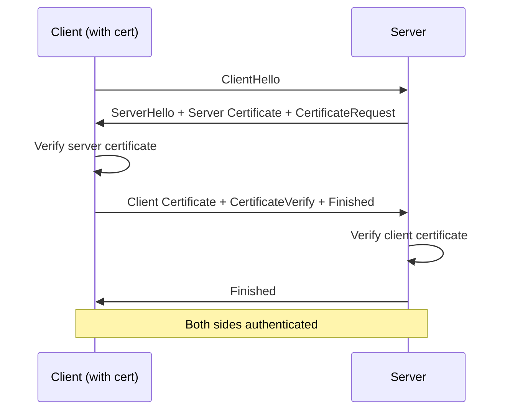
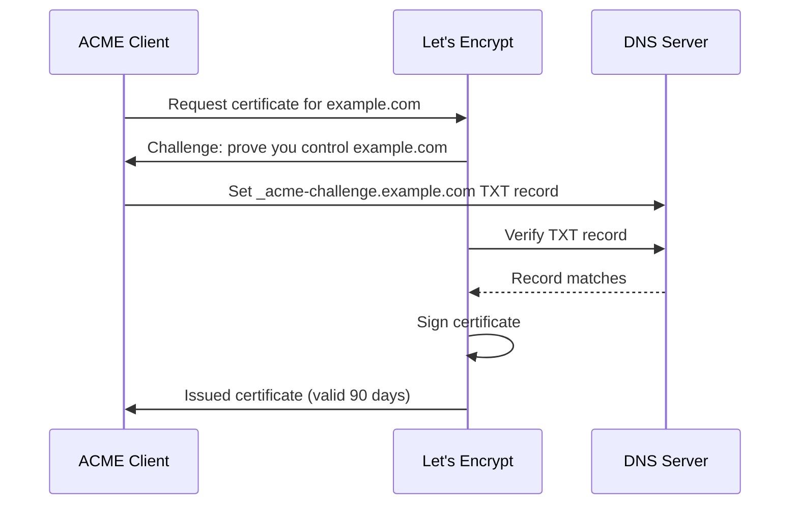

# Encryption in Transit

## Why Encryption in Transit Exists

Data traversing a network — between browser and server, between microservices, between data centers — passes through routers, switches, load balancers, and ISPs. Without encryption in transit, any intermediary can read, modify, or inject data. This applies to WiFi networks, corporate LANs, internet backbone routers, and cloud provider internal networks.

Encryption in transit (primarily TLS) provides three guarantees:

1. **Confidentiality**: Data cannot be read by eavesdroppers
2. **Integrity**: Data cannot be modified without detection
3. **Authentication**: You are communicating with the intended server (not an impersonator)

### Historical Context

| Year | Protocol | Status |
|------|----------|--------|
| 1995 | SSL 2.0 | **Broken** — design flaws |
| 1996 | SSL 3.0 | **Broken** — POODLE attack (2014) |
| 1999 | TLS 1.0 | **Deprecated** — BEAST, Lucky13 |
| 2006 | TLS 1.1 | **Deprecated** — no modern cipher suites |
| 2008 | TLS 1.2 | **Current minimum** — widely supported |
| 2018 | TLS 1.3 | **Recommended** — faster, more secure |

## First Principles

### The TLS Handshake

TLS establishes an encrypted channel through a handshake protocol:



TLS 1.3 simplified the handshake from 2-RTT (TLS 1.2) to 1-RTT, and even supports 0-RTT resumption for returning clients.

### TLS 1.3 vs TLS 1.2

| Feature | TLS 1.2 | TLS 1.3 |
|---------|---------|---------|
| Handshake RTTs | 2 | 1 (0 for resumption) |
| Key exchange | RSA or ECDHE | ECDHE only (forward secrecy mandatory) |
| Cipher suites | ~37 supported | 5 supported (all AEAD) |
| RSA key exchange | Supported | **Removed** |
| CBC mode ciphers | Supported | **Removed** |
| 0-RTT resumption | No | Yes (with replay considerations) |
| Encrypted handshake | Partially | Almost entirely |

### Forward Secrecy

TLS 1.3 mandates forward secrecy through ephemeral key exchange. Even if the server's long-term private key is compromised, past sessions cannot be decrypted:

$$
\text{Session key} = \text{KDF}(\text{ECDHE}(\text{client\_ephemeral}, \text{server\_ephemeral}))
$$

Each connection generates new ephemeral keys. Compromising one session's key reveals nothing about other sessions.

## Core Mechanics

### Certificate Chain Validation



### TLS 1.3 Cipher Suites

TLS 1.3 supports only five cipher suites, all using AEAD:

| Cipher Suite | Encryption | Hash | Use Case |
|-------------|------------|------|----------|
| TLS_AES_256_GCM_SHA384 | AES-256-GCM | SHA-384 | **Recommended** |
| TLS_AES_128_GCM_SHA256 | AES-128-GCM | SHA-256 | Good, widely supported |
| TLS_CHACHA20_POLY1305_SHA256 | ChaCha20 | SHA-256 | Mobile/no AES-NI |
| TLS_AES_128_CCM_SHA256 | AES-128-CCM | SHA-256 | IoT/constrained |
| TLS_AES_128_CCM_8_SHA256 | AES-128-CCM-8 | SHA-256 | IoT (short tag) |

### mTLS (Mutual TLS)

Standard TLS authenticates only the server. mTLS adds client certificate authentication:



mTLS is used for:
- Service-to-service communication in microservices
- API authentication (replacing API keys)
- Zero-trust network architectures

## Implementation

### Node.js HTTPS Server with Optimal TLS Configuration

```typescript
import https from 'node:https';
import fs from 'node:fs';
import tls from 'node:tls';

const server = https.createServer({
  // Certificate and key
  cert: fs.readFileSync('/etc/tls/server.crt'),
  key: fs.readFileSync('/etc/tls/server.key'),
  ca: fs.readFileSync('/etc/tls/ca-chain.crt'), // Full CA chain

  // TLS version constraints
  minVersion: 'TLSv1.2',
  maxVersion: 'TLSv1.3',

  // Cipher suite configuration (TLS 1.2 — TLS 1.3 ciphers are auto-selected)
  ciphers: [
    'TLS_AES_256_GCM_SHA384',
    'TLS_AES_128_GCM_SHA256',
    'TLS_CHACHA20_POLY1305_SHA256',
    // TLS 1.2 fallback ciphers (ECDHE only for forward secrecy)
    'ECDHE-ECDSA-AES256-GCM-SHA384',
    'ECDHE-RSA-AES256-GCM-SHA384',
    'ECDHE-ECDSA-AES128-GCM-SHA256',
    'ECDHE-RSA-AES128-GCM-SHA256',
    'ECDHE-ECDSA-CHACHA20-POLY1305',
    'ECDHE-RSA-CHACHA20-POLY1305',
  ].join(':'),

  // Prefer server cipher order
  honorCipherOrder: true,

  // ECDH curve for key exchange
  ecdhCurve: ['X25519', 'P-256', 'P-384'].join(':'),

  // Session management
  sessionTimeout: 300, // 5 minutes

  // OCSP stapling (if supported)
  // requestOCSP: true,
});

server.on('request', (req, res) => {
  res.writeHead(200, { 'Content-Type': 'text/plain' });
  res.end('Secure connection established');
});

server.listen(443, () => {
  console.log('HTTPS server running on port 443');
});
```

### mTLS Server and Client (Node.js)

```typescript
import https from 'node:https';
import fs from 'node:fs';

// ─── mTLS Server ──────────────────────────────────────────

const mtlsServer = https.createServer({
  cert: fs.readFileSync('/etc/tls/server.crt'),
  key: fs.readFileSync('/etc/tls/server.key'),
  ca: fs.readFileSync('/etc/tls/client-ca.crt'), // CA that signed client certs

  // Require client certificates
  requestCert: true,
  rejectUnauthorized: true, // Reject clients without valid certs

  minVersion: 'TLSv1.2',
});

mtlsServer.on('request', (req, res) => {
  const clientCert = (req.socket as any).getPeerCertificate();

  if (!clientCert || !clientCert.subject) {
    res.writeHead(401);
    res.end('Client certificate required');
    return;
  }

  // Extract client identity from certificate
  const clientCN = clientCert.subject.CN;
  const clientOrg = clientCert.subject.O;
  const serialNumber = clientCert.serialNumber;

  console.log(`Authenticated client: ${clientCN} (${clientOrg})`);

  // Check certificate against allowlist
  const allowedClients = ['service-a', 'service-b', 'monitoring'];
  if (!allowedClients.includes(clientCN)) {
    res.writeHead(403);
    res.end(`Client ${clientCN} not authorized`);
    return;
  }

  res.writeHead(200, { 'Content-Type': 'application/json' });
  res.end(JSON.stringify({
    message: 'mTLS authenticated',
    client: clientCN,
    organization: clientOrg,
  }));
});

mtlsServer.listen(8443);

// ─── mTLS Client ──────────────────────────────────────────

async function mtlsRequest(url: string): Promise<string> {
  return new Promise((resolve, reject) => {
    const options = {
      cert: fs.readFileSync('/etc/tls/client.crt'),
      key: fs.readFileSync('/etc/tls/client.key'),
      ca: fs.readFileSync('/etc/tls/server-ca.crt'),
      rejectUnauthorized: true,
    };

    const req = https.get(url, options, (res) => {
      let data = '';
      res.on('data', (chunk) => (data += chunk));
      res.on('end', () => resolve(data));
    });

    req.on('error', reject);
  });
}
```

### HSTS (HTTP Strict Transport Security)

```typescript
import express from 'express';

const app = express();

// HSTS middleware — tells browsers to ONLY use HTTPS
app.use((req, res, next) => {
  // Set HSTS header
  res.setHeader(
    'Strict-Transport-Security',
    'max-age=63072000; includeSubDomains; preload'
    // max-age: 2 years in seconds
    // includeSubDomains: Apply to all subdomains
    // preload: Request inclusion in browser's preload list
  );

  // Redirect HTTP to HTTPS
  if (req.protocol === 'http') {
    res.redirect(301, `https://${req.hostname}${req.url}`);
    return;
  }

  next();
});

// Additional security headers
app.use((req, res, next) => {
  // Prevent MIME type sniffing
  res.setHeader('X-Content-Type-Options', 'nosniff');

  // Prevent embedding in iframes (clickjacking protection)
  res.setHeader('X-Frame-Options', 'DENY');

  // Enable browser XSS filter
  res.setHeader('X-XSS-Protection', '0'); // Disabled: CSP is better

  // Referrer policy
  res.setHeader('Referrer-Policy', 'strict-origin-when-cross-origin');

  next();
});
```

### Nginx TLS Configuration (Production-Grade)

```nginx
# /etc/nginx/conf.d/tls.conf

server {
    listen 443 ssl http2;
    listen [::]:443 ssl http2;
    server_name example.com www.example.com;

    # Certificate files
    ssl_certificate     /etc/nginx/ssl/fullchain.pem;
    ssl_certificate_key /etc/nginx/ssl/privkey.pem;

    # TLS protocol versions
    ssl_protocols TLSv1.2 TLSv1.3;

    # Cipher suites (TLS 1.2 - TLS 1.3 ciphers are auto-negotiated)
    ssl_ciphers 'ECDHE-ECDSA-AES256-GCM-SHA384:ECDHE-RSA-AES256-GCM-SHA384:ECDHE-ECDSA-AES128-GCM-SHA256:ECDHE-RSA-AES128-GCM-SHA256:ECDHE-ECDSA-CHACHA20-POLY1305:ECDHE-RSA-CHACHA20-POLY1305';
    ssl_prefer_server_ciphers on;

    # ECDH curves
    ssl_ecdh_curve X25519:secp384r1:secp256r1;

    # OCSP stapling
    ssl_stapling on;
    ssl_stapling_verify on;
    ssl_trusted_certificate /etc/nginx/ssl/chain.pem;
    resolver 8.8.8.8 8.8.4.4 valid=300s;
    resolver_timeout 5s;

    # Session configuration
    ssl_session_timeout 1d;
    ssl_session_cache shared:TLS:50m;
    ssl_session_tickets off;  # Disable for forward secrecy

    # DH parameters (for TLS 1.2 DHE suites)
    ssl_dhparam /etc/nginx/ssl/dhparam.pem;

    # Security headers
    add_header Strict-Transport-Security "max-age=63072000; includeSubDomains; preload" always;
    add_header X-Content-Type-Options "nosniff" always;
    add_header X-Frame-Options "DENY" always;
    add_header Referrer-Policy "strict-origin-when-cross-origin" always;

    # Your application
    location / {
        proxy_pass http://localhost:3000;
        proxy_set_header Host $host;
        proxy_set_header X-Real-IP $remote_addr;
        proxy_set_header X-Forwarded-For $proxy_add_x_forwarded_for;
        proxy_set_header X-Forwarded-Proto $scheme;
    }
}

# Redirect HTTP to HTTPS
server {
    listen 80;
    listen [::]:80;
    server_name example.com www.example.com;
    return 301 https://$host$request_uri;
}
```

### Let's Encrypt Certificate Automation

```bash
#!/bin/bash
# Certbot with automatic renewal

# Initial certificate request
certbot certonly \
  --nginx \
  -d example.com \
  -d www.example.com \
  --email admin@example.com \
  --agree-tos \
  --non-interactive \
  --must-staple \
  --rsa-key-size 4096   # Or use --key-type ecdsa --elliptic-curve secp384r1

# Automatic renewal (add to crontab)
# 0 0 * * * certbot renew --quiet --deploy-hook "systemctl reload nginx"
```

### Certificate Pinning (for Mobile/API Clients)

```typescript
import https from 'node:https';
import crypto from 'node:crypto';

const PINNED_HASHES = new Set([
  // SHA-256 hash of the server's public key (SPKI)
  'sha256/YLh1dUR9y6Kja30RrAn7JKnbQG/uEtLMkBgFF2Fuihg=',
  // Backup pin (for rotation)
  'sha256/sRHdihwgkaib1P1gN7akICGn3wdPQVoE4pXCOZgIVRo=',
]);

function pinnedRequest(url: string): Promise<string> {
  return new Promise((resolve, reject) => {
    const req = https.get(url, {
      checkServerIdentity: (hostname, cert) => {
        // Compute SPKI hash of the certificate's public key
        const pubKeyDer = cert.pubkey;
        const spkiHash = crypto
          .createHash('sha256')
          .update(pubKeyDer)
          .digest('base64');

        const pin = `sha256/${spkiHash}`;

        if (!PINNED_HASHES.has(pin)) {
          return new Error(
            `Certificate pin mismatch. Expected one of: ${[...PINNED_HASHES].join(', ')}. Got: ${pin}`
          );
        }

        // Also verify the hostname matches
        return tls.checkServerIdentity(hostname, cert);
      },
    }, (res) => {
      let data = '';
      res.on('data', (chunk) => (data += chunk));
      res.on('end', () => resolve(data));
    });

    req.on('error', reject);
  });
}
```

## Edge Cases & Failure Modes

### TLS Attacks and Mitigations

| Attack | Targets | Mitigation |
|--------|---------|------------|
| BEAST | TLS 1.0 CBC | Use TLS 1.2+ |
| POODLE | SSL 3.0 | Disable SSL 3.0 |
| Heartbleed | OpenSSL implementation | Patch OpenSSL |
| DROWN | SSLv2 | Disable SSLv2 entirely |
| ROBOT | RSA key exchange | Use ECDHE only |
| Downgrade | Version negotiation | TLS_FALLBACK_SCSV |
| 0-RTT replay | TLS 1.3 early data | Idempotent requests only for 0-RTT |

### Certificate Transparency (CT)

CT logs provide a public audit trail of all issued certificates, detecting misissued certificates:

```
Certificate chain:
  Server cert → signed by Intermediate CA → signed by Root CA
  +
  SCT (Signed Certificate Timestamp) from CT log

Browser verifies:
  1. Certificate chain is valid
  2. SCT proves the certificate was logged publicly
  3. Any misissued certificate would be visible in CT logs
```

### OCSP Stapling

Instead of the client checking certificate revocation (slow, privacy-leaking), the server "staples" a signed OCSP response:

$$
T_{\text{OCSP check}} \approx 100\text{–}500\text{ms} \quad \text{vs.} \quad T_{\text{stapled}} = 0\text{ms (cached)}
$$

## Performance Characteristics

### TLS Handshake Latency

| Handshake Type | RTTs | Latency (20ms network) | Latency (100ms network) |
|---------------|------|----------------------|------------------------|
| TLS 1.2 full | 2 | ~40ms | ~200ms |
| TLS 1.2 resumed | 1 | ~20ms | ~100ms |
| TLS 1.3 full | 1 | ~20ms | ~100ms |
| TLS 1.3 0-RTT | 0 | ~0ms | ~0ms |

### Encryption Overhead

| Operation | Throughput | CPU Overhead |
|-----------|-----------|-------------|
| AES-256-GCM (AES-NI) | 4–6 GB/s | < 1% at 1 Gbps |
| ChaCha20-Poly1305 | 2–3 GB/s | ~2% at 1 Gbps |
| RSA-2048 handshake | ~667 handshakes/s/core | ~1.5ms per handshake |
| ECDHE-P256 handshake | ~10K handshakes/s/core | ~0.1ms per handshake |
| X25519 handshake | ~20K handshakes/s/core | ~0.05ms per handshake |

### Memory Usage

| Component | Per-Connection Memory |
|-----------|---------------------|
| TLS session state | ~1–5 KB |
| Session ticket | ~200 bytes |
| OCSP staple | ~1 KB |
| Certificate chain | ~3–10 KB (cached) |

For 100K concurrent TLS connections: ~500 MB – 1 GB.

## Mathematical Foundations

### TLS 1.3 Key Schedule

TLS 1.3 derives all keys from the ECDHE shared secret using HKDF:

$$
\text{early\_secret} = \text{HKDF-Extract}(\text{PSK or 0}, \text{salt}=0)
$$
$$
\text{handshake\_secret} = \text{HKDF-Extract}(\text{ECDHE\_shared}, \text{derived\_secret})
$$
$$
\text{master\_secret} = \text{HKDF-Extract}(0, \text{derived\_secret})
$$

Application keys are derived from the master secret:

$$
\text{client\_app\_key} = \text{HKDF-Expand}(\text{master\_secret}, \text{"c ap traffic"}, L)
$$
$$
\text{server\_app\_key} = \text{HKDF-Expand}(\text{master\_secret}, \text{"s ap traffic"}, L)
$$

### Certificate Signature Verification

The server certificate contains a signature from the issuing CA:

$$
\sigma = \text{Sign}_{CA\_SK}(\text{Hash}(\text{TBS Certificate}))
$$

The client verifies:

$$
\text{Verify}_{CA\_PK}(\text{Hash}(\text{TBS Certificate}), \sigma) = \text{true}
$$

where TBS (To Be Signed) Certificate contains the server's public key, domain name, validity period, and extensions.

## Real-World War Stories

::: info War Story
**Cloudflare's Universal SSL (2014)**

When Cloudflare offered free TLS certificates to all 2 million customers, they needed to handle millions of TLS handshakes per second. They discovered that RSA key exchange was the bottleneck — each handshake required an RSA private key operation consuming ~1.5ms of CPU time.

By switching to ECDSA certificates with ECDHE key exchange, handshake costs dropped from 1.5ms to 0.1ms — a 15x improvement. This single change allowed them to serve 10x more TLS connections on the same hardware.

**Lesson**: ECDSA certificates with ECDHE key exchange are dramatically faster than RSA. Use them for high-traffic services.
:::

::: info War Story
**The HSTS Preload List Incident**

A startup added `includeSubDomains` to their HSTS header and submitted to the HSTS preload list. They later discovered that their internal tools (running on subdomains like `staging.company.com` and `jenkins.company.com`) didn't have valid TLS certificates.

Once in the preload list, browsers permanently refused HTTP connections to any subdomain. Removing a domain from the preload list takes months (browser update cycle).

**Lesson**: Before enabling `includeSubDomains`, audit ALL subdomains to ensure they have valid TLS certificates. Use a staging period with a short `max-age` before going to full 2-year HSTS.
:::

::: info War Story
**The Equifax Breach TLS Inspection Gap (2017)**

Equifax's network inspection device used to monitor encrypted traffic had an expired TLS certificate, causing it to silently fail open — passing all traffic uninspected. Attackers exploited this gap for 76 days, exfiltrating 148 million records.

**Lesson**: TLS inspection infrastructure must be monitored for certificate expiration and fail-closed (block traffic when unable to inspect), not fail-open.
:::

## Decision Framework

### TLS Configuration Checklist

| Setting | Recommended | Why |
|---------|-------------|-----|
| Minimum version | TLS 1.2 | TLS 1.0/1.1 have known vulnerabilities |
| Preferred version | TLS 1.3 | Faster, more secure, mandatory forward secrecy |
| Key exchange | ECDHE (X25519, P-256) | Forward secrecy, fast |
| Ciphers | AES-256-GCM, ChaCha20 | AEAD only, no CBC |
| Certificate type | ECDSA P-256 | Faster than RSA, smaller certs |
| HSTS | max-age=63072000 | Prevents HTTP downgrade |
| OCSP stapling | Enabled | Faster revocation checking |
| Session tickets | Disabled for max security | Enable for performance if needed |
| 0-RTT | Careful (idempotent only) | Replay risk for non-idempotent requests |

### When to Use mTLS

**Use mTLS when:**
- Service-to-service communication in a microservice architecture
- Zero-trust network where identity must be cryptographically verified
- Replacing API keys for machine-to-machine auth
- Regulatory requirements mandate mutual authentication

**Do NOT use mTLS when:**
- Authenticating end users (browsers don't handle client certs well)
- Simple internal services where a service mesh handles mTLS transparently
- The operational burden of managing client certificates is too high

## Advanced Topics

### Certificate Rotation with Zero Downtime

```typescript
import tls from 'node:tls';
import https from 'node:https';
import fs from 'node:fs';

class CertificateRotator {
  private server: https.Server;
  private currentContext: tls.SecureContext;

  constructor() {
    this.currentContext = this.loadCert();

    this.server = https.createServer({
      SNICallback: (hostname, callback) => {
        callback(null, this.currentContext);
      },
    });
  }

  private loadCert(): tls.SecureContext {
    return tls.createSecureContext({
      cert: fs.readFileSync('/etc/tls/server.crt'),
      key: fs.readFileSync('/etc/tls/server.key'),
      ca: fs.readFileSync('/etc/tls/ca-chain.crt'),
    });
  }

  rotateCert(): void {
    // Load new certificate without restarting
    this.currentContext = this.loadCert();
    console.log('Certificate rotated at', new Date().toISOString());
  }

  startWatching(): void {
    // Watch for certificate file changes
    fs.watch('/etc/tls/server.crt', () => {
      console.log('Certificate file changed, rotating...');
      setTimeout(() => this.rotateCert(), 1000); // Debounce
    });
  }
}
```

### TLS Termination Patterns

| Pattern | Where TLS Ends | Internal Traffic | Use Case |
|---------|---------------|-----------------|----------|
| Edge termination | Load balancer | Unencrypted | Simple, highest performance |
| Re-encryption | Load balancer | New TLS to backend | Compliance, defense in depth |
| Passthrough | Backend server | N/A (end-to-end) | Maximum security, mTLS |
| Service mesh | Sidecar proxy | mTLS everywhere | Kubernetes/Istio |

### ACME Protocol (Let's Encrypt Automation)

The ACME protocol automates certificate issuance:



## Cross-References

- [Encryption Overview](/security/encryption/) — Cryptographic primitives
- [Symmetric vs Asymmetric](/security/encryption/symmetric-vs-asymmetric) — AES, ECDHE, RSA details
- [Key Management](/security/encryption/key-management) — Certificate and key lifecycle
- [Encryption at Rest](/security/encryption/encryption-at-rest) — Protecting stored data
- [CORS Deep Dive](/security/api-security/cors-deep-dive) — Same-origin policy and TLS
- [Network Segmentation](/security/zero-trust/network-segmentation) — mTLS in zero-trust networks
