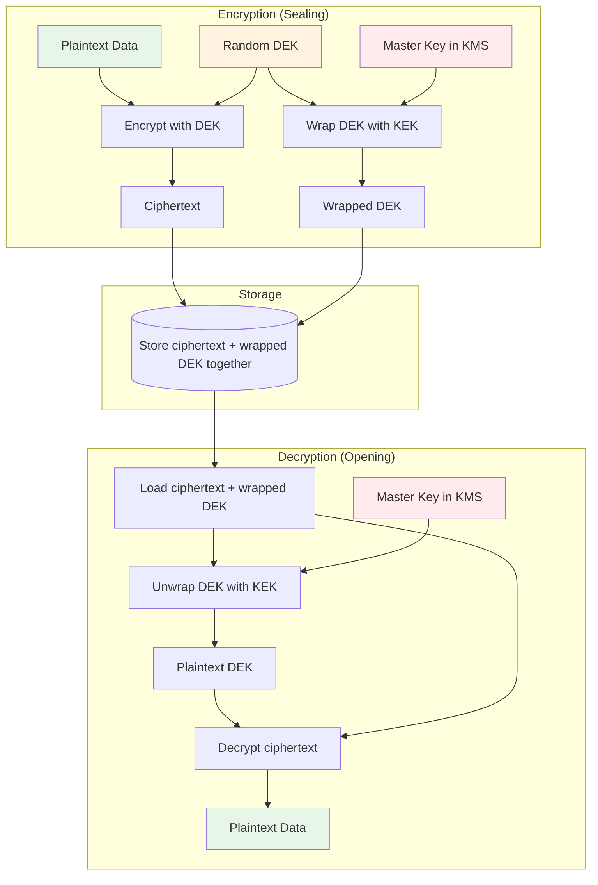
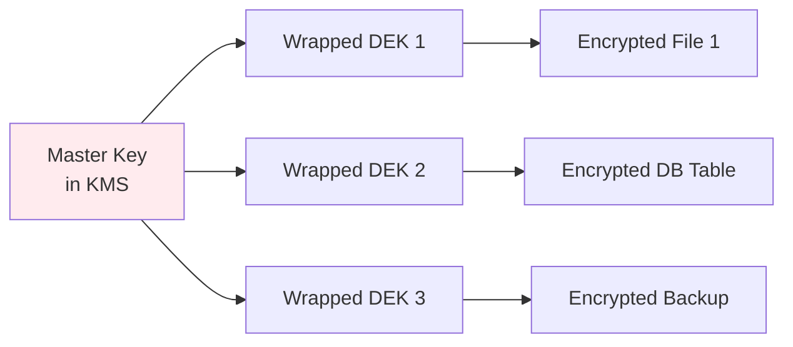
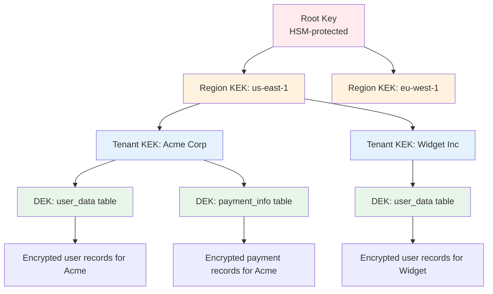
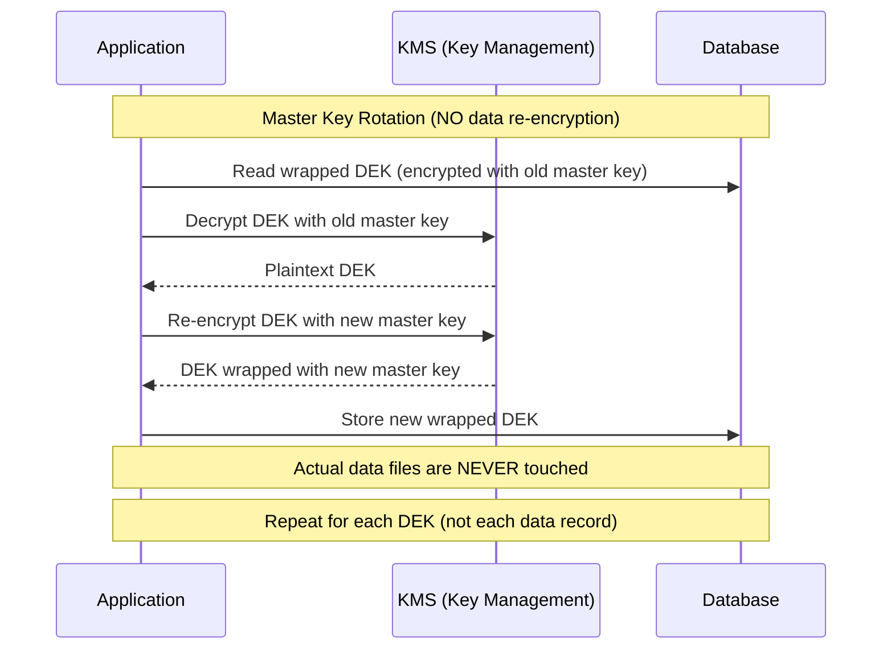

# Envelope Encryption

## Why Envelope Encryption Exists

Directly encrypting data with a master key creates a fundamental problem: rotating the master key requires re-encrypting all data. For a database with 100 million records, each encrypted with the same key, rotation means decrypting and re-encrypting every record — a process that could take hours and requires downtime.

Envelope encryption solves this by introducing a two-level key hierarchy: a master key (KEK) wraps data keys (DEKs). Each piece of data is encrypted with its own unique DEK. The DEK is then encrypted ("wrapped") with the master key and stored alongside the ciphertext.

To rotate the master key, you only re-wrap the DEKs — a fast, lightweight operation that doesn't touch the actual data.

### The Core Insight

$$
\text{Data}_{\text{encrypted}} = E_{\text{DEK}}(\text{Data})
$$
$$
\text{DEK}_{\text{wrapped}} = E_{\text{KEK}}(\text{DEK})
$$

Store: $(\text{DEK}_{\text{wrapped}}, \text{Data}_{\text{encrypted}})$

To rotate KEK: Re-wrap $\text{DEK}_{\text{wrapped}}$ with new KEK. Data stays untouched.

### Historical Context

- **2000s**: Financial industry standardized multi-tier key hierarchies
- **2006**: NIST SP 800-57 formalized key management recommendations
- **2014**: AWS KMS popularized envelope encryption for cloud applications
- **2016**: Google Cloud KMS, Azure Key Vault follow the same model
- **2020s**: Envelope encryption becomes the default pattern for cloud data protection

## First Principles

### Why Not Just Use KMS Directly?

KMS services have fundamental limitations that make direct encryption impractical:

| Constraint | AWS KMS Limit | Impact |
|-----------|---------------|--------|
| Max plaintext size | 4 KB | Cannot encrypt large files |
| API latency | 5–50ms per call | 10M records = 50K–500K seconds |
| API rate limit | 30,000 requests/sec | Bottleneck for high-throughput |
| Cost | $0.03 per 10K requests | 10M records = $30 per full re-encryption |

Envelope encryption overcomes all of these:

| With Envelope Encryption | Benefit |
|-------------------------|---------|
| DEK encrypts unlimited data | No size limit |
| 1 KMS call per DEK (not per record) | Minimal latency |
| Local crypto operations | No rate limit |
| 1 KMS call vs millions | Cost reduction by orders of magnitude |

### The Envelope Analogy

Think of it like physical mail security:

1. You write a letter (**data**)
2. You seal it in an envelope with a unique lock (**DEK encryption**)
3. You put the key to the envelope lock inside a lockbox (**KEK wrapping the DEK**)
4. Only the lockbox holder (KMS) can open the lockbox to get the envelope key



## Core Mechanics

### Single-Level Envelope Encryption

The simplest form: one KEK wrapping individual DEKs.



### Multi-Level Envelope Encryption

For enterprise systems, add intermediate key layers:



Benefits of multi-level hierarchy:
- **Blast radius reduction**: Compromising one tenant KEK only exposes that tenant's data
- **Granular rotation**: Rotate at any level independently
- **Access control**: Different IAM policies per level
- **Compliance**: Separate keys per jurisdiction (GDPR, data residency)

### Key Rotation Without Re-Encryption

The key advantage of envelope encryption:



## Implementation

### Complete Envelope Encryption System (TypeScript)

```typescript
import crypto from 'node:crypto';
import {
  KMSClient,
  GenerateDataKeyCommand,
  DecryptCommand,
  EncryptCommand,
} from '@aws-sdk/client-kms';

// ─── Types ──────────────────────────────────────────────────

interface EnvelopeEncryptedData {
  version: number;
  keyId: string;             // KMS master key ARN
  wrappedDEK: string;        // Base64 encrypted DEK
  iv: string;                // Base64 IV
  authTag: string;           // Base64 auth tag
  ciphertext: string;        // Base64 encrypted data
  aad?: string;              // Base64 additional authenticated data
}

interface DEKCache {
  plaintextKey: Buffer;
  expiresAt: number;
}

// ─── Envelope Encryption Service ────────────────────────────

class EnvelopeEncryptionService {
  private kms: KMSClient;
  private masterKeyId: string;
  private dekCache: Map<string, DEKCache> = new Map();
  private readonly DEK_CACHE_TTL = 300_000; // 5 minutes

  constructor(kmsClient: KMSClient, masterKeyId: string) {
    this.kms = kmsClient;
    this.masterKeyId = masterKeyId;
  }

  /**
   * Encrypt data using envelope encryption.
   * Generates a new DEK for each encryption operation.
   */
  async encrypt(
    plaintext: Buffer,
    context?: Record<string, string>
  ): Promise<EnvelopeEncryptedData> {
    // Generate a new DEK via KMS
    const dataKeyResponse = await this.kms.send(
      new GenerateDataKeyCommand({
        KeyId: this.masterKeyId,
        KeySpec: 'AES_256',
        EncryptionContext: context,
      })
    );

    const plaintextDEK = Buffer.from(dataKeyResponse.Plaintext!);
    const wrappedDEK = Buffer.from(dataKeyResponse.CiphertextBlob!);

    try {
      // Encrypt the data locally with the plaintext DEK
      const iv = crypto.randomBytes(12);
      const cipher = crypto.createCipheriv('aes-256-gcm', plaintextDEK, iv);

      // Use the encryption context as AAD
      const aad = context ? Buffer.from(JSON.stringify(context)) : undefined;
      if (aad) {
        cipher.setAAD(aad);
      }

      const encrypted = Buffer.concat([
        cipher.update(plaintext),
        cipher.final(),
      ]);
      const authTag = cipher.getAuthTag();

      return {
        version: 1,
        keyId: this.masterKeyId,
        wrappedDEK: wrappedDEK.toString('base64'),
        iv: iv.toString('base64'),
        authTag: authTag.toString('base64'),
        ciphertext: encrypted.toString('base64'),
        aad: aad?.toString('base64'),
      };
    } finally {
      // CRITICAL: Wipe the plaintext DEK from memory
      plaintextDEK.fill(0);
    }
  }

  /**
   * Decrypt envelope-encrypted data.
   */
  async decrypt(
    envelope: EnvelopeEncryptedData,
    context?: Record<string, string>
  ): Promise<Buffer> {
    const wrappedDEK = Buffer.from(envelope.wrappedDEK, 'base64');

    // Try cache first
    const cacheKey = wrappedDEK.toString('base64');
    let plaintextDEK = this.getCachedDEK(cacheKey);

    if (!plaintextDEK) {
      // Decrypt the DEK via KMS
      const decryptResponse = await this.kms.send(
        new DecryptCommand({
          CiphertextBlob: wrappedDEK,
          EncryptionContext: context,
        })
      );

      plaintextDEK = Buffer.from(decryptResponse.Plaintext!);

      // Cache the decrypted DEK
      this.cacheDEK(cacheKey, plaintextDEK);
    }

    // Decrypt the data locally
    const iv = Buffer.from(envelope.iv, 'base64');
    const authTag = Buffer.from(envelope.authTag, 'base64');
    const ciphertext = Buffer.from(envelope.ciphertext, 'base64');

    const decipher = crypto.createDecipheriv('aes-256-gcm', plaintextDEK, iv);
    decipher.setAuthTag(authTag);

    if (envelope.aad) {
      decipher.setAAD(Buffer.from(envelope.aad, 'base64'));
    }

    try {
      return Buffer.concat([
        decipher.update(ciphertext),
        decipher.final(),
      ]);
    } catch {
      throw new Error('Decryption failed: data may have been tampered with');
    }
  }

  /**
   * Re-wrap a DEK with a new master key (key rotation).
   * Does NOT re-encrypt the data.
   */
  async rewrapDEK(
    envelope: EnvelopeEncryptedData,
    newMasterKeyId: string,
    context?: Record<string, string>
  ): Promise<EnvelopeEncryptedData> {
    const wrappedDEK = Buffer.from(envelope.wrappedDEK, 'base64');

    // Decrypt with old master key
    const decryptResponse = await this.kms.send(
      new DecryptCommand({
        CiphertextBlob: wrappedDEK,
        EncryptionContext: context,
      })
    );

    const plaintextDEK = Buffer.from(decryptResponse.Plaintext!);

    try {
      // Re-encrypt with new master key
      const encryptResponse = await this.kms.send(
        new EncryptCommand({
          KeyId: newMasterKeyId,
          Plaintext: plaintextDEK,
          EncryptionContext: context,
        })
      );

      return {
        ...envelope,
        keyId: newMasterKeyId,
        wrappedDEK: Buffer.from(encryptResponse.CiphertextBlob!).toString('base64'),
      };
    } finally {
      plaintextDEK.fill(0);
    }
  }

  // ─── DEK Caching ─────────────────────────────────────────

  private getCachedDEK(key: string): Buffer | null {
    const cached = this.dekCache.get(key);
    if (!cached) return null;
    if (cached.expiresAt < Date.now()) {
      // Expired — securely erase
      cached.plaintextKey.fill(0);
      this.dekCache.delete(key);
      return null;
    }
    return cached.plaintextKey;
  }

  private cacheDEK(key: string, dek: Buffer): void {
    this.dekCache.set(key, {
      plaintextKey: Buffer.from(dek), // Copy so original can be wiped
      expiresAt: Date.now() + this.DEK_CACHE_TTL,
    });

    // Cleanup expired entries periodically
    if (this.dekCache.size > 1000) {
      this.cleanupCache();
    }
  }

  private cleanupCache(): void {
    const now = Date.now();
    for (const [key, value] of this.dekCache) {
      if (value.expiresAt < now) {
        value.plaintextKey.fill(0);
        this.dekCache.delete(key);
      }
    }
  }

  /**
   * Securely clear all cached DEKs.
   */
  clearCache(): void {
    for (const [, value] of this.dekCache) {
      value.plaintextKey.fill(0);
    }
    this.dekCache.clear();
  }
}
```

### Multi-Tenant Envelope Encryption

```typescript
interface TenantKeyConfig {
  tenantId: string;
  masterKeyId: string;
  region: string;
}

class MultiTenantEnvelopeService {
  private kmsClients: Map<string, KMSClient> = new Map();
  private services: Map<string, EnvelopeEncryptionService> = new Map();
  private tenantConfigs: Map<string, TenantKeyConfig>;

  constructor(tenantConfigs: TenantKeyConfig[]) {
    this.tenantConfigs = new Map(
      tenantConfigs.map((c) => [c.tenantId, c])
    );
  }

  /**
   * Get or create an encryption service for a tenant.
   */
  private getServiceForTenant(tenantId: string): EnvelopeEncryptionService {
    let service = this.services.get(tenantId);
    if (service) return service;

    const config = this.tenantConfigs.get(tenantId);
    if (!config) {
      throw new Error(`No encryption config for tenant: ${tenantId}`);
    }

    let kms = this.kmsClients.get(config.region);
    if (!kms) {
      kms = new KMSClient({ region: config.region });
      this.kmsClients.set(config.region, kms);
    }

    service = new EnvelopeEncryptionService(kms, config.masterKeyId);
    this.services.set(tenantId, service);
    return service;
  }

  async encryptForTenant(
    tenantId: string,
    plaintext: Buffer
  ): Promise<EnvelopeEncryptedData> {
    const service = this.getServiceForTenant(tenantId);
    return service.encrypt(plaintext, {
      tenantId,
      purpose: 'tenant-data',
    });
  }

  async decryptForTenant(
    tenantId: string,
    envelope: EnvelopeEncryptedData
  ): Promise<Buffer> {
    const service = this.getServiceForTenant(tenantId);
    return service.decrypt(envelope, {
      tenantId,
      purpose: 'tenant-data',
    });
  }

  /**
   * Rotate master key for a specific tenant.
   * Re-wraps all DEKs without re-encrypting data.
   */
  async rotateTenantKey(
    tenantId: string,
    newMasterKeyId: string,
    getAllEnvelopes: () => AsyncIterable<{ id: string; envelope: EnvelopeEncryptedData }>,
    updateEnvelope: (id: string, envelope: EnvelopeEncryptedData) => Promise<void>
  ): Promise<{ rewrapped: number; errors: number }> {
    const service = this.getServiceForTenant(tenantId);
    let rewrapped = 0;
    let errors = 0;

    for await (const { id, envelope } of getAllEnvelopes()) {
      try {
        const newEnvelope = await service.rewrapDEK(
          envelope,
          newMasterKeyId,
          { tenantId, purpose: 'tenant-data' }
        );
        await updateEnvelope(id, newEnvelope);
        rewrapped++;
      } catch (error) {
        console.error(`Failed to rewrap DEK for record ${id}:`, error);
        errors++;
      }
    }

    // Update tenant config
    const config = this.tenantConfigs.get(tenantId)!;
    config.masterKeyId = newMasterKeyId;
    this.services.delete(tenantId); // Force recreation with new key

    return { rewrapped, errors };
  }
}
```

### File-Level Envelope Encryption

```typescript
import { createReadStream, createWriteStream } from 'node:fs';
import { pipeline } from 'node:stream/promises';
import crypto from 'node:crypto';

interface EncryptedFileHeader {
  version: number;
  algorithm: string;
  keyId: string;
  wrappedDEK: string;
  iv: string;
  // Auth tag is appended at the end of the file
}

class FileEnvelopeEncryption {
  private envelopeService: EnvelopeEncryptionService;

  constructor(envelopeService: EnvelopeEncryptionService) {
    this.envelopeService = envelopeService;
  }

  /**
   * Encrypt a file using streaming envelope encryption.
   * Efficient for large files — never loads entire file into memory.
   */
  async encryptFile(
    inputPath: string,
    outputPath: string,
    context?: Record<string, string>
  ): Promise<void> {
    // Generate DEK via KMS
    const kms = (this.envelopeService as any).kms;
    const masterKeyId = (this.envelopeService as any).masterKeyId;

    const { Plaintext, CiphertextBlob } = await kms.send(
      new GenerateDataKeyCommand({
        KeyId: masterKeyId,
        KeySpec: 'AES_256',
        EncryptionContext: context,
      })
    );

    const plaintextDEK = Buffer.from(Plaintext!);
    const wrappedDEK = Buffer.from(CiphertextBlob!);
    const iv = crypto.randomBytes(12);

    try {
      // Write header
      const header: EncryptedFileHeader = {
        version: 1,
        algorithm: 'aes-256-gcm',
        keyId: masterKeyId,
        wrappedDEK: wrappedDEK.toString('base64'),
        iv: iv.toString('base64'),
      };

      const headerJson = JSON.stringify(header);
      const headerLength = Buffer.alloc(4);
      headerLength.writeUInt32BE(headerJson.length);

      const cipher = crypto.createCipheriv('aes-256-gcm', plaintextDEK, iv);

      const output = createWriteStream(outputPath);
      output.write(headerLength);
      output.write(headerJson);

      // Stream encrypt the file
      const input = createReadStream(inputPath);
      await pipeline(input, cipher, output);

      // Append auth tag at the end
      const authTag = cipher.getAuthTag();
      const finalOutput = createWriteStream(outputPath, { flags: 'a' });
      finalOutput.write(authTag);
      finalOutput.end();
    } finally {
      plaintextDEK.fill(0);
    }
  }
}
```

## Edge Cases & Failure Modes

### Encryption Context Mismatch

AWS KMS uses encryption context as AAD — if the context used during encryption doesn't match during decryption, it fails:

```typescript
// Encryption
await kms.send(new GenerateDataKeyCommand({
  KeyId: masterKeyId,
  EncryptionContext: { tenantId: 'acme', table: 'users' },
}));

// Decryption — MUST use the same context
await kms.send(new DecryptCommand({
  CiphertextBlob: wrappedDEK,
  EncryptionContext: { tenantId: 'acme', table: 'users' }, // Must match exactly
}));
```

::: danger
If you change the encryption context schema (e.g., renaming keys or adding new fields), existing wrapped DEKs become undecryptable. Always version your context schemas and maintain backward compatibility.
:::

### DEK Cache Invalidation

If a DEK is revoked or the master key is rotated, cached plaintext DEKs continue to work until the cache expires. This is a tradeoff between performance and security:

| Cache TTL | KMS calls/hour | Security gap |
|-----------|----------------|-------------|
| 0 (no cache) | 1 per decrypt | None |
| 60 seconds | ~60 | Up to 60 seconds |
| 5 minutes | ~12 | Up to 5 minutes |
| 1 hour | 1 | Up to 1 hour |

For most applications, a 5-minute cache TTL is a good balance. For highly sensitive operations, use no caching.

### Partial Failure During Key Rotation

If key rotation fails midway (some DEKs re-wrapped, others not), the system must handle mixed key versions:

```typescript
async function safeRotation(
  envelopes: EnvelopeEncryptedData[],
  newKeyId: string,
  service: EnvelopeEncryptionService
): Promise<void> {
  // Track progress for resumability
  const progressKey = `rotation:${newKeyId}:progress`;
  const completedIds = await redis.smembers(progressKey);

  for (const envelope of envelopes) {
    const envelopeId = computeEnvelopeId(envelope);
    if (completedIds.includes(envelopeId)) continue; // Skip already rotated

    const rewrapped = await service.rewrapDEK(envelope, newKeyId);
    await saveEnvelope(envelopeId, rewrapped);

    // Track progress atomically
    await redis.sadd(progressKey, envelopeId);
  }

  // Cleanup progress tracking
  await redis.del(progressKey);
}
```

## Performance Characteristics

### Operation Latency Breakdown

| Operation | Latency | Where |
|-----------|---------|-------|
| Generate DEK (KMS) | 5–15ms | Network + HSM |
| Decrypt DEK (KMS) | 5–10ms | Network + HSM |
| Decrypt DEK (cached) | 0.001ms | Local memory |
| AES-256-GCM encrypt 1KB | 0.005ms | Local CPU |
| AES-256-GCM encrypt 1MB | 0.15ms | Local CPU |
| AES-256-GCM encrypt 1GB | 150ms | Local CPU |
| Total: encrypt 1KB (no cache) | ~15ms | KMS + local |
| Total: encrypt 1KB (cached DEK) | ~0.01ms | Local only |
| Total: encrypt 1GB (cached DEK) | ~150ms | Local only |

### Cost Analysis

| Scenario | KMS Calls | Monthly Cost | Data Volume |
|----------|-----------|-------------|------------|
| 1 DEK per record, 10M records/month | 10M encrypt + 10M decrypt | ~$60 | Any |
| 1 DEK per table, 10M records/month | ~1 encrypt + ~1K decrypt (cached) | ~$0.003 | Any |
| Envelope + 5min cache, 10M reads/month | ~12/hour = ~8,640/month | ~$0.03 | Any |

Envelope encryption with caching reduces KMS costs by **99.95%** compared to per-record KMS encryption.

### Storage Overhead

Each envelope adds:

$$
\text{Overhead} = \underbrace{44}_{\text{wrapped DEK}} + \underbrace{16}_{\text{IV (base64)}} + \underbrace{24}_{\text{auth tag (base64)}} + \underbrace{50}_{\text{metadata}} \approx 134 \text{ bytes}
$$

For 10 million records: ~1.3 GB of overhead — typically negligible compared to data size.

## Mathematical Foundations

### Security of Key Wrapping

Key wrapping with AES-GCM provides IND-CCA2 (indistinguishability under chosen-ciphertext attack) security:

$$
\text{Adv}_{\text{IND-CCA2}}(A) \leq \frac{q^2}{2^{128}} + \text{negl}(\lambda)
$$

where $q$ is the number of encryption queries. This means an attacker cannot distinguish wrapped keys from random strings, even if they can submit chosen ciphertexts for decryption.

### Multi-Level Key Hierarchy Security

In a three-level hierarchy (Root KEK -> Service KEK -> DEK):

$$
\text{Security} = \min(\text{Sec}(\text{Root}), \text{Sec}(\text{Service KEK}), \text{Sec}(\text{DEK}))
$$

The overall security is bounded by the weakest level. However, the operational benefit of hierarchy is that compromise at a lower level has a smaller blast radius.

### Nonce Space Analysis for Envelope Encryption

With a unique DEK per record (or per batch), the nonce space concern is eliminated:

$$
P(\text{nonce collision}) = \frac{q^2}{2 \times 2^{96}} \text{ (per DEK)}
$$

Since each DEK is used only once (or a small number of times), $q = 1$ and $P \approx 0$.

This is a significant advantage over using a single key with many nonces.

## Real-World War Stories

::: info War Story
**AWS S3 Bucket Key Optimization (2020)**

Before S3 Bucket Keys, every S3 object encrypted with SSE-KMS generated a separate KMS API call. A customer with 500 million objects in a bucket was making 500 million KMS calls for a full bucket scan, costing $1,500 and taking 46 hours.

AWS introduced S3 Bucket Keys — a DEK generated per-bucket (not per-object) and cached for a period. This reduced KMS calls by up to 99% and costs proportionally. It's essentially automated envelope encryption at the storage layer.

**Lesson**: Per-record KMS calls don't scale. Envelope encryption with DEK caching is essential for any meaningful data volume.
:::

::: info War Story
**A Healthcare Company's Key Hierarchy Audit Failure**

During a SOC 2 audit, a healthcare company could not prove that their encryption key hierarchy prevented a single administrator from accessing all patient data. Their implementation used a single KMS key for all tenants, meaning any IAM principal with `kms:Decrypt` permission could decrypt any patient's data.

**Resolution**: They implemented per-tenant KMS keys with separate IAM policies, ensuring that each tenant's data could only be decrypted by principals with access to that tenant's specific KMS key. The audit passed after implementing multi-tenant envelope encryption with per-tenant key policies.
:::

::: info War Story
**The DEK Cache Memory Leak**

A service using envelope encryption cached plaintext DEKs in a Map without TTL enforcement. Over several weeks, the cache grew to contain 200,000 DEKs consuming 6.4 MB of memory — but more critically, 200,000 plaintext encryption keys in memory. A memory dump or cold boot attack would have exposed all of them.

**Resolution**: Implemented LRU cache with max size of 1,000 entries, 5-minute TTL, and secure erasure of evicted keys (filling the buffer with zeros before removal).
:::

## Decision Framework

### When to Use Envelope Encryption

| Scenario | Direct KMS | Envelope Encryption |
|----------|-----------|-------------------|
| < 4KB data, < 100 ops/sec | Yes | Overkill |
| > 4KB data | Cannot | **Required** |
| > 1000 ops/sec | Rate limited | **Required** |
| Key rotation without re-encryption | Cannot | **Built-in** |
| Multi-tenant data isolation | One key fits all | **Per-tenant DEKs** |
| Cost-sensitive at scale | Expensive | **99%+ cheaper** |

### DEK Scope: Per-Record vs Per-Table vs Per-Tenant

| Scope | Blast Radius | KMS Cost | Rotation Speed | Best For |
|-------|-------------|----------|---------------|----------|
| Per-record | 1 record | Highest | N/A (unique) | Financial records |
| Per-table | All records in table | Low | Fast | General data |
| Per-tenant | All tenant data | Lowest | Very fast | SaaS multi-tenant |
| Per-session | 1 session | Moderate | N/A (ephemeral) | Real-time communication |

## Advanced Topics

### Cross-Region Envelope Encryption

For multi-region deployments, DEKs need to be accessible across regions:

```typescript
class CrossRegionEnvelopeService {
  private services: Map<string, EnvelopeEncryptionService>;
  private primaryRegion: string;

  constructor(
    regions: Array<{ region: string; masterKeyId: string }>,
    primaryRegion: string
  ) {
    this.primaryRegion = primaryRegion;
    this.services = new Map();

    for (const { region, masterKeyId } of regions) {
      const kms = new KMSClient({ region });
      this.services.set(region, new EnvelopeEncryptionService(kms, masterKeyId));
    }
  }

  /**
   * Encrypt in primary region, then replicate wrapped DEK to all regions.
   */
  async encryptMultiRegion(
    plaintext: Buffer,
    context?: Record<string, string>
  ): Promise<{
    envelope: EnvelopeEncryptedData;
    regionalWrappedDEKs: Record<string, string>;
  }> {
    const primaryService = this.services.get(this.primaryRegion)!;
    const envelope = await primaryService.encrypt(plaintext, context);

    // Re-wrap the DEK for each region's master key
    const regionalWrappedDEKs: Record<string, string> = {
      [this.primaryRegion]: envelope.wrappedDEK,
    };

    for (const [region, service] of this.services) {
      if (region === this.primaryRegion) continue;

      const reWrapped = await primaryService.rewrapDEK(
        envelope,
        (service as any).masterKeyId,
        context
      );
      regionalWrappedDEKs[region] = reWrapped.wrappedDEK;
    }

    return { envelope, regionalWrappedDEKs };
  }
}
```

### Hardware-Backed Envelope Encryption

For maximum security, use CloudHSM-backed keys for the master key:

```typescript
// CloudHSM-backed KMS key (Terraform)
const hsmKeyConfig = `
resource "aws_kms_key" "hsm_backed" {
  description = "HSM-backed master key for envelope encryption"
  customer_master_key_spec = "SYMMETRIC_DEFAULT"
  key_usage = "ENCRYPT_DECRYPT"

  # Use custom key store backed by CloudHSM
  custom_key_store_id = aws_cloudhsm_v2_cluster.main.cluster_id

  enable_key_rotation = true
}
`;
```

### Streaming Envelope Encryption for Large Data

For datasets too large to hold in memory, use streaming encryption with chunked DEKs:

```typescript
import { Transform, TransformCallback } from 'node:stream';

class EncryptionTransform extends Transform {
  private cipher: crypto.CipherGCM;
  private headerWritten = false;
  private header: Buffer;

  constructor(dek: Buffer, iv: Buffer, wrappedDEK: Buffer) {
    super();
    this.cipher = crypto.createCipheriv('aes-256-gcm', dek, iv) as crypto.CipherGCM;

    // Header: [4 bytes length][JSON header]
    const headerData = JSON.stringify({
      version: 1,
      wrappedDEK: wrappedDEK.toString('base64'),
      iv: iv.toString('base64'),
    });
    const headerLen = Buffer.alloc(4);
    headerLen.writeUInt32BE(headerData.length);
    this.header = Buffer.concat([headerLen, Buffer.from(headerData)]);
  }

  _transform(chunk: Buffer, _encoding: string, callback: TransformCallback): void {
    if (!this.headerWritten) {
      this.push(this.header);
      this.headerWritten = true;
    }
    this.push(this.cipher.update(chunk));
    callback();
  }

  _flush(callback: TransformCallback): void {
    this.push(this.cipher.final());
    this.push(this.cipher.getAuthTag());
    callback();
  }
}
```

## Cross-References

- [Encryption Overview](/security/encryption/) — Cryptographic primitives
- [Key Management](/security/encryption/key-management) — Key lifecycle and hierarchy
- [Encryption at Rest](/security/encryption/encryption-at-rest) — Data protection strategies
- [AWS Secrets Manager](/security/secrets-management/aws-secrets-manager) — KMS integration
- [Vault Deep Dive](/security/secrets-management/vault-deep-dive) — Transit secrets engine
- [Rotation Automation](/security/secrets-management/rotation-automation) — Automated key rotation
