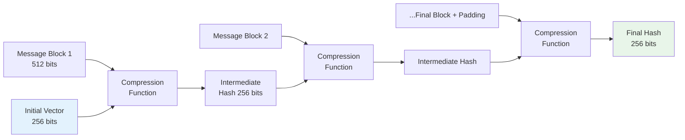
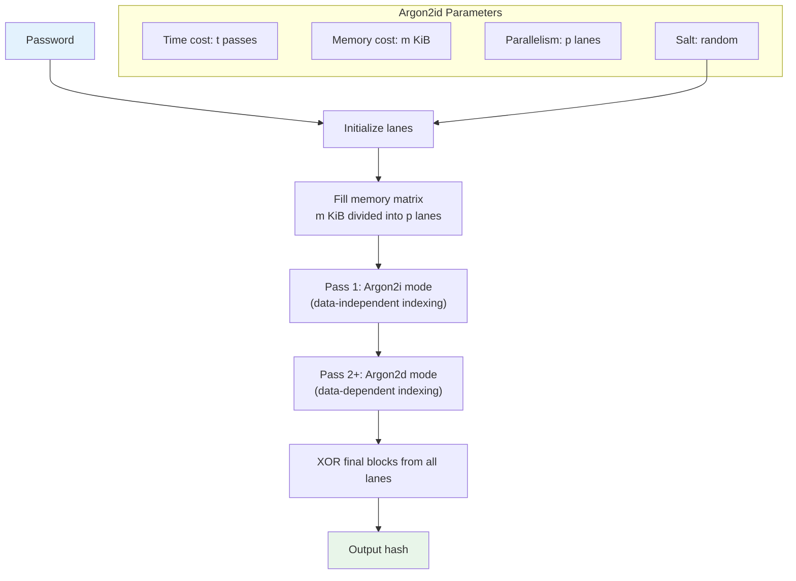
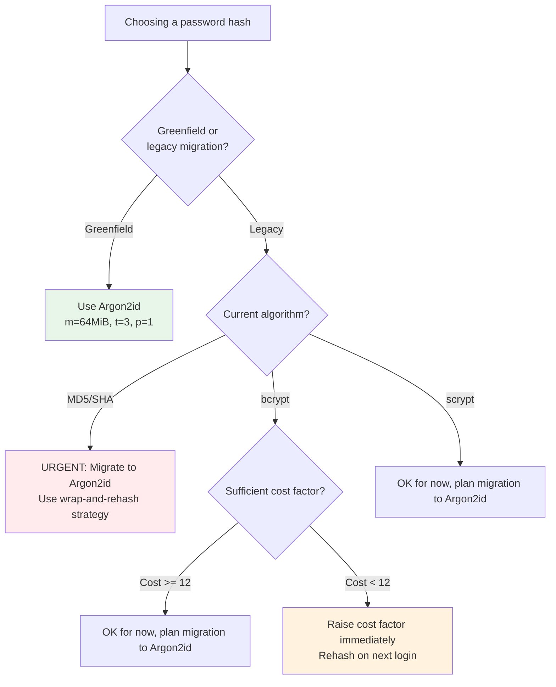

# Hashing Algorithms

## Why Hashing Exists

A hash function maps arbitrary-length input to a fixed-length output (the digest) in a way that is easy to compute forward but infeasible to reverse. Hashing serves two fundamentally different purposes, and confusing them is a common source of security vulnerabilities:

1. **General-purpose hashing** (SHA-256, BLAKE3): Fast integrity verification, content addressing, digital signatures
2. **Password hashing** (bcrypt, Argon2): Intentionally slow credential storage that resists brute-force attacks

A fast hash function is perfect for verifying file integrity but disastrous for storing passwords. If SHA-256 can hash 1 billion passwords per second on a GPU, an attacker can brute-force most passwords in hours.

### Historical Context

| Year | Algorithm | Notes |
|------|-----------|-------|
| 1992 | MD5 | Broken — collisions found in 2004 |
| 1995 | SHA-1 | Broken — collision demonstrated in 2017 (SHAttered) |
| 1999 | bcrypt (Provos & Mazieres) | First widely-used password hash |
| 2001 | SHA-256 (NIST) | Still secure, standard for integrity |
| 2009 | scrypt (Percival) | Memory-hard password hash |
| 2012 | SHA-3 (Keccak) | NIST standard, different construction |
| 2015 | Argon2 (PHC winner) | Modern password hash, OWASP recommended |
| 2020 | BLAKE3 | Very fast general-purpose hash |

## First Principles

### Properties of a Cryptographic Hash Function

A secure hash function $H$ must satisfy:

1. **Preimage resistance**: Given $h$, it is infeasible to find $m$ such that $H(m) = h$

$$
\text{Cost to find } m : H(m) = h \geq 2^{n} \text{ operations (for n-bit hash)}
$$

2. **Second preimage resistance**: Given $m_1$, it is infeasible to find $m_2 \neq m_1$ such that $H(m_1) = H(m_2)$

$$
\text{Cost} \geq 2^{n} \text{ operations}
$$

3. **Collision resistance**: It is infeasible to find any $(m_1, m_2)$ where $m_1 \neq m_2$ and $H(m_1) = H(m_2)$

$$
\text{Cost} \geq 2^{n/2} \text{ operations (birthday bound)}
$$

4. **Avalanche effect**: Changing one bit of input changes ~50% of output bits

### The Birthday Paradox

Finding collisions is easier than finding preimages due to the birthday paradox. In a room of 23 people, there's a >50% chance two share a birthday. Similarly, after $\sqrt{2^n} = 2^{n/2}$ hashes, there's a >50% chance of a collision.

For SHA-256 ($n = 256$):

$$
\text{Birthday bound} = 2^{128} \approx 3.4 \times 10^{38} \text{ hashes}
$$

At 10 billion hashes/second, this would take $\approx 10^{21}$ years.

### Why Passwords Need Special Hashing

General-purpose hash functions are designed to be fast. Password hashing functions are designed to be slow. Here's why:

| Scenario | SHA-256 | bcrypt (cost 12) | Argon2id |
|----------|---------|-------------------|----------|
| Hashes/sec (CPU) | ~100M | ~3 | ~3 |
| Hashes/sec (GPU cluster) | ~10B | ~500 | ~100 |
| Time to crack 8-char password | Minutes | Centuries | Millennia |

$$
T_{\text{crack}} = \frac{|\text{keyspace}|}{R_{\text{hash}}} = \frac{62^8}{R}
$$

For an 8-character alphanumeric password ($62^8 \approx 2.18 \times 10^{14}$):
- SHA-256 on GPU: $\frac{2.18 \times 10^{14}}{10^{10}} = 21{,}800$ seconds $\approx$ 6 hours
- Argon2id on GPU: $\frac{2.18 \times 10^{14}}{100} = 2.18 \times 10^{12}$ seconds $\approx$ 69,000 years

## Core Mechanics

### SHA-256 Internal Structure

SHA-256 uses the Merkle-Damgard construction with Davies-Meyer compression:



Each compression function performs 64 rounds of:
1. Message schedule expansion (generating 64 words from 16 input words)
2. Working variable updates using bitwise operations, rotations, and modular addition

### bcrypt Internal Structure

bcrypt is based on the Blowfish cipher with a cost factor that controls iteration count:

$$
\text{Iterations} = 2^{\text{cost}}
$$

```mermaid
graph TB
    PW[Password] --> KD[Key Derivation]
    SALT[128-bit Random Salt] --> KD
    KD --> BF[Blowfish Key Schedule<br/>Repeated 2^cost times]
    BF --> ENC[Encrypt "OrpheanBeholderScryDoubt"<br/>64 times with derived key]
    ENC --> HASH[24-byte hash]
    HASH --> FORMAT["$2b$12$salt22chars.hash31chars"]

    style PW fill:#e3f2fd
    style FORMAT fill:#e8f5e9
```

bcrypt output format:
```
$2b$12$LJ3m4ys3cZzFGMh/5.QKHO1234567890abcdefghijklm
│ │  │  │                    │
│ │  │  └─ 22-char salt      └─ 31-char hash
│ │  └─ Cost factor (2^12 = 4096 iterations)
│ └─ Version (2b = current)
└─ Algorithm identifier
```

### Argon2 Internal Structure

Argon2 is a memory-hard function with three variants:

| Variant | Memory Access Pattern | Best For |
|---------|----------------------|----------|
| Argon2d | Data-dependent | Cryptocurrency mining |
| Argon2i | Data-independent | Password hashing (side-channel safe) |
| **Argon2id** | **Hybrid** | **Recommended for passwords** |

Argon2 fills a memory matrix with pseudorandom data, then processes it in passes:



The key insight is **memory hardness**: the function requires holding the entire memory matrix in RAM simultaneously. This prevents GPU/ASIC attacks because:

- GPUs have limited per-thread memory
- ASICs cannot have unlimited on-chip memory
- Reducing memory forces recomputation, increasing time

### scrypt

scrypt was the first widely-used memory-hard function. It uses a large memory buffer accessed pseudo-randomly:

$$
\text{Memory} = 128 \times r \times N \text{ bytes}
$$
$$
\text{Time} = O(N \times r \times p)
$$

where $N$ is the CPU/memory cost parameter, $r$ is the block size, and $p$ is the parallelization parameter.

## Implementation

### Argon2id (Recommended for Passwords)

```typescript
import argon2 from 'argon2';

// OWASP recommended configuration (2024)
const ARGON2_CONFIG = {
  type: argon2.argon2id,
  memoryCost: 65536,     // 64 MiB (2^16 KiB)
  timeCost: 3,           // 3 iterations
  parallelism: 4,        // 4 threads
  hashLength: 32,        // 256-bit output
  saltLength: 16,        // 128-bit salt
};

/**
 * Hash a password using Argon2id.
 * Returns a self-contained string with algorithm, parameters, salt, and hash.
 */
async function hashPassword(password: string): Promise<string> {
  return argon2.hash(password, ARGON2_CONFIG);
  // Output: $argon2id$v=19$m=65536,t=3,p=4$<salt>$<hash>
}

/**
 * Verify a password against a stored hash.
 * Uses constant-time comparison internally.
 */
async function verifyPassword(password: string, storedHash: string): Promise<boolean> {
  try {
    return await argon2.verify(storedHash, password);
  } catch {
    return false;
  }
}

/**
 * Check if a stored hash needs rehashing (e.g., after upgrading parameters).
 */
function needsRehash(storedHash: string): boolean {
  return argon2.needsRehash(storedHash, ARGON2_CONFIG);
}

/**
 * Full password verification with automatic rehashing.
 */
async function verifyAndRehash(
  password: string,
  storedHash: string,
  updateHash: (newHash: string) => Promise<void>
): Promise<boolean> {
  const isValid = await verifyPassword(password, storedHash);

  if (isValid && needsRehash(storedHash)) {
    const newHash = await hashPassword(password);
    await updateHash(newHash);
  }

  return isValid;
}
```

### bcrypt (Widely Supported Alternative)

```typescript
import bcrypt from 'bcrypt';

const SALT_ROUNDS = 12; // 2^12 = 4096 iterations, ~250ms on modern CPU

async function hashPasswordBcrypt(password: string): Promise<string> {
  // bcrypt has a 72-byte input limit — truncate or pre-hash
  if (Buffer.byteLength(password, 'utf8') > 72) {
    // Pre-hash with SHA-256 to handle long passwords
    const crypto = await import('node:crypto');
    password = crypto.createHash('sha256').update(password).digest('base64');
  }

  return bcrypt.hash(password, SALT_ROUNDS);
}

async function verifyPasswordBcrypt(
  password: string,
  storedHash: string
): Promise<boolean> {
  if (Buffer.byteLength(password, 'utf8') > 72) {
    const crypto = await import('node:crypto');
    password = crypto.createHash('sha256').update(password).digest('base64');
  }

  return bcrypt.compare(password, storedHash);
}
```

::: warning
**bcrypt truncates passwords at 72 bytes.** Passwords longer than 72 bytes are silently truncated, meaning `password72chars...extra` and `password72chars...different` would match. Always pre-hash long passwords with SHA-256 before bcrypt.
:::

### SHA-256 and HMAC

```typescript
import crypto from 'node:crypto';

// ─── SHA-256 ───────────────────────────────────────────────

function sha256(data: string | Buffer): string {
  return crypto.createHash('sha256').update(data).digest('hex');
}

function sha256Buffer(data: Buffer): Buffer {
  return crypto.createHash('sha256').update(data).digest();
}

// Streaming hash for large files
async function sha256File(filePath: string): Promise<string> {
  const { createReadStream } = await import('node:fs');

  return new Promise((resolve, reject) => {
    const hash = crypto.createHash('sha256');
    const stream = createReadStream(filePath);

    stream.on('data', (chunk) => hash.update(chunk));
    stream.on('end', () => resolve(hash.digest('hex')));
    stream.on('error', reject);
  });
}

// ─── HMAC-SHA256 ───────────────────────────────────────────

function hmacSha256(message: string, secret: string): string {
  return crypto.createHmac('sha256', secret).update(message).digest('hex');
}

// Verify HMAC with constant-time comparison
function verifyHmac(
  message: string,
  receivedHmac: string,
  secret: string
): boolean {
  const computed = hmacSha256(message, secret);
  return crypto.timingSafeEqual(
    Buffer.from(computed, 'hex'),
    Buffer.from(receivedHmac, 'hex')
  );
}
```

### BLAKE3 (Fastest General-Purpose Hash)

```typescript
import { createHash } from 'blake3';

function blake3Hash(data: Buffer): Buffer {
  const hasher = createHash();
  hasher.update(data);
  return Buffer.from(hasher.digest());
}

// BLAKE3 is also a KDF and MAC
function blake3KDF(
  context: string,
  material: Buffer,
  outputLength: number = 32
): Buffer {
  const hasher = createHash();
  hasher.update(Buffer.from(context));
  hasher.update(material);
  return Buffer.from(hasher.digest('', outputLength));
}
```

### Password Hashing Migration Strategy

```typescript
interface User {
  id: string;
  passwordHash: string;
  hashAlgorithm: 'md5' | 'sha256' | 'bcrypt' | 'argon2id';
}

/**
 * Migrate legacy password hashes to Argon2id on login.
 * This is the only time we have the plaintext password.
 */
async function authenticateAndMigrate(
  email: string,
  password: string,
  userStore: any
): Promise<{ authenticated: boolean; migrated: boolean }> {
  const user: User | null = await userStore.findByEmail(email);
  if (!user) return { authenticated: false, migrated: false };

  let isValid = false;

  switch (user.hashAlgorithm) {
    case 'md5': {
      const crypto = await import('node:crypto');
      const md5Hash = crypto.createHash('md5').update(password).digest('hex');
      isValid = md5Hash === user.passwordHash;
      break;
    }
    case 'sha256': {
      const crypto = await import('node:crypto');
      // Legacy: SHA256(salt + password)
      const [salt, hash] = user.passwordHash.split(':');
      const computed = crypto.createHash('sha256').update(salt + password).digest('hex');
      isValid = computed === hash;
      break;
    }
    case 'bcrypt': {
      const bcrypt = await import('bcrypt');
      isValid = await bcrypt.compare(password, user.passwordHash);
      break;
    }
    case 'argon2id': {
      const argon2 = await import('argon2');
      isValid = await argon2.verify(user.passwordHash, password);

      // Check if parameters need updating
      if (isValid && argon2.needsRehash(user.passwordHash, ARGON2_CONFIG)) {
        const newHash = await argon2.hash(password, ARGON2_CONFIG);
        await userStore.updatePasswordHash(user.id, newHash, 'argon2id');
        return { authenticated: true, migrated: true };
      }

      return { authenticated: isValid, migrated: false };
    }
  }

  if (isValid) {
    // Migrate to Argon2id
    const argon2 = await import('argon2');
    const newHash = await argon2.hash(password, ARGON2_CONFIG);
    await userStore.updatePasswordHash(user.id, newHash, 'argon2id');
    return { authenticated: true, migrated: true };
  }

  return { authenticated: false, migrated: false };
}
```

## Edge Cases & Failure Modes

### Hash Length Extension Attacks

MD5, SHA-1, and SHA-256 are vulnerable to length extension attacks due to the Merkle-Damgard construction:

$$
H(\text{secret} \| \text{message}) \text{ allows computing } H(\text{secret} \| \text{message} \| \text{padding} \| \text{extension})
$$

without knowing the secret. This is why `HMAC(key, message)` exists — it processes the key differently to prevent this attack.

::: danger
**Never use `SHA256(secret + message)` for authentication.** Always use `HMAC-SHA256(secret, message)` or a hash function immune to length extension (SHA-3, BLAKE3).
:::

### bcrypt's 72-Byte Limit

bcrypt silently truncates input at 72 bytes. Two passwords that share the same first 72 bytes will produce the same hash, regardless of what follows.

### Argon2 Memory Exhaustion

If Argon2 is configured with too much memory (e.g., 1 GB per hash) and an attacker sends many concurrent login attempts, the server can run out of memory (DoS).

**Mitigation**: Rate limit login attempts per IP/account, and use Argon2 settings that balance security and resource consumption:

| Scenario | Memory | Time | Parallelism | Hash Time |
|----------|--------|------|-------------|-----------|
| Web app (shared server) | 64 MiB | 3 | 1 | ~100ms |
| Dedicated auth service | 256 MiB | 2 | 4 | ~200ms |
| Offline encryption | 1 GiB | 4 | 8 | ~1s |

### Rainbow Table Attacks

A rainbow table is a precomputed lookup table mapping hashes to passwords. Salting defeats rainbow tables because each password gets a unique salt:

$$
H(\text{salt}_1 \| \text{password}) \neq H(\text{salt}_2 \| \text{password})
$$

An attacker would need a separate rainbow table for every possible salt, which is infeasible.

All modern password hash functions (bcrypt, scrypt, Argon2) include automatic salting.

## Performance Characteristics

### Hash Speed Comparison (Single CPU Core)

| Algorithm | Speed (small input) | Speed (1 GB file) | Output | Notes |
|-----------|--------------------|--------------------|--------|-------|
| MD5 | 800 MB/s | 800 MB/s | 128 bits | **Broken**, do not use |
| SHA-1 | 600 MB/s | 600 MB/s | 160 bits | **Broken**, do not use |
| SHA-256 | 400 MB/s | 400 MB/s | 256 bits | Standard, secure |
| SHA-3-256 | 200 MB/s | 200 MB/s | 256 bits | Alternative standard |
| BLAKE3 | 2 GB/s | 5+ GB/s | 256 bits | Fastest, parallelizable |
| bcrypt (cost 12) | 3 ops/s | N/A | 184 bits | Password hashing |
| Argon2id (64MB, t=3) | 3 ops/s | N/A | 256 bits | Password hashing |

### GPU Attack Throughput

| Algorithm | RTX 4090 (single GPU) | 8x A100 Cluster |
|-----------|----------------------|-----------------|
| MD5 | 164 billion/s | 1.3 trillion/s |
| SHA-256 | 22 billion/s | 176 billion/s |
| bcrypt (cost 12) | 184K/s | 1.5M/s |
| Argon2id (64MB) | ~100/s | ~800/s |

Argon2id is **220 million times slower** to crack than SHA-256 on GPUs.

### Cost to Crack Common Password Lengths

Assuming Argon2id on an 8x A100 cluster (800 hashes/s):

| Password Type | Keyspace | Time to Exhaust |
|---------------|----------|-----------------|
| 4-digit PIN | $10^4$ | 12.5 seconds |
| 6-char lowercase | $26^6 \approx 3 \times 10^8$ | 4.3 days |
| 8-char mixed case | $52^8 \approx 5.3 \times 10^{13}$ | 2,100 years |
| 8-char alphanumeric | $62^8 \approx 2.2 \times 10^{14}$ | 8,700 years |
| 12-char alphanumeric | $62^{12} \approx 3.2 \times 10^{21}$ | $1.3 \times 10^{11}$ years |

## Mathematical Foundations

### The Merkle-Damgard Construction

SHA-256 uses the Merkle-Damgard construction:

$$
H_0 = IV
$$
$$
H_i = f(H_{i-1}, M_i) \quad \text{for } i = 1, 2, \ldots, n
$$
$$
H(M) = H_n
$$

where $f$ is the compression function, $M_i$ are message blocks, and $IV$ is the initialization vector.

The length padding ensures uniqueness:

$$
M' = M \| 1 \| 0^k \| \text{len}(M)_{64\text{-bit}}
$$

### The Sponge Construction (SHA-3)

SHA-3 (Keccak) uses a different approach — the sponge construction:

$$
\text{State} = \text{Rate} \| \text{Capacity}
$$

1. **Absorb**: XOR input blocks into the rate portion, apply the permutation $f$
2. **Squeeze**: Extract output blocks from the rate portion

The capacity $c$ determines security: collision resistance is $c/2$ bits. For SHA-3-256, $c = 512$ bits, giving 256-bit collision resistance.

### Memory-Hardness Formal Definition

A function $f$ is $(N, T)$-memory-hard if:

$$
\text{Any algorithm computing } f \text{ uses either } \geq N \text{ memory or } \geq T \text{ time}
$$

For Argon2 with memory parameter $m$:

$$
AT_{\text{min}} = \Omega(m^2) \quad \text{(Area-Time complexity)}
$$

This means an ASIC with half the memory would need at least 4x the time, making specialized hardware attacks economically unviable.

## Real-World War Stories

::: info War Story
**The LinkedIn Breach (2012)**

In 2012, 6.5 million LinkedIn password hashes were leaked. LinkedIn used unsalted SHA-1 hashes. Within 24 hours, security researchers had cracked over 60% of the passwords using rainbow tables and GPU brute force. The most common passwords were "123456", "linkedin", and "password".

By 2016, the full dataset of 164 million credentials was released. Over 90% were eventually cracked.

**Lesson**: SHA-1 is a fast hash — it was never designed for passwords. Modern password hashing requires purpose-built algorithms (bcrypt, Argon2) with salts and work factors.
:::

::: info War Story
**The bcrypt Cost Factor Confusion**

A payment processor set bcrypt cost factor to 4 (the minimum) for "performance reasons" during a high-traffic sale event. Each hash computed in ~1ms instead of ~250ms. When they were breached 6 months later, the attacker cracked 78% of passwords in 3 days.

A cost factor of 4 means only $2^4 = 16$ iterations. The standard cost factor of 12 means $2^{12} = 4096$ iterations — 256x slower to crack. That 3-day attack would have taken over 2 years with the proper cost factor.

**Lesson**: Never reduce security parameters for performance. If password hashing is a bottleneck, offload it to a dedicated service — don't weaken the hash.
:::

::: info War Story
**The Argon2 Memory Allocation DoS**

A SaaS application configured Argon2id with 256 MiB of memory per hash and allowed unlimited concurrent login attempts. An attacker sent 100 concurrent login requests, causing the server to attempt to allocate 25.6 GiB of memory simultaneously, crashing the process.

**Resolution**: They implemented three fixes:
1. Rate limiting: 5 login attempts per IP per minute
2. Concurrency limiting: Semaphore allowing only 10 concurrent Argon2 operations
3. Reduced memory to 64 MiB (still safe, but more practical for shared infrastructure)
:::

## Decision Framework

### Password Hash Algorithm Selection



### General-Purpose Hash Selection

| Use Case | Recommended | Why |
|----------|-------------|-----|
| File integrity | SHA-256 or BLAKE3 | Standard and fast respectively |
| Content addressing (CAS) | SHA-256 | Universal, collision-resistant |
| Checksums (non-security) | CRC32, xxHash | Very fast, sufficient for error detection |
| HMAC authentication | HMAC-SHA256 | Standard, secure, widely supported |
| Digital signatures | SHA-256 (with ECDSA/Ed25519) | Required by signature schemes |
| Blockchain/proof-of-work | SHA-256, Keccak | Standard for Bitcoin, Ethereum |

## Advanced Topics

### Prehashing for Password Length Limits

```typescript
import crypto from 'node:crypto';
import argon2 from 'argon2';

/**
 * Prehash long passwords to avoid bcrypt's 72-byte limit
 * and to normalize input length for consistent timing.
 */
function prehash(password: string): Buffer {
  // Use HMAC (not raw SHA-256) to prevent length extension
  return crypto
    .createHmac('sha512', 'password-prehash-key')
    .update(password)
    .digest();
}

async function hashWithPrehash(password: string): Promise<string> {
  const prehashed = prehash(password);
  return argon2.hash(prehashed, ARGON2_CONFIG);
}

async function verifyWithPrehash(
  password: string,
  storedHash: string
): Promise<boolean> {
  const prehashed = prehash(password);
  return argon2.verify(storedHash, prehashed);
}
```

### Pepper: Server-Side Secret Seasoning

A pepper is a server-side secret added to the password before hashing. Unlike salts (stored with the hash), peppers are stored separately (e.g., in a KMS).

```typescript
async function hashWithPepper(password: string): Promise<string> {
  const pepper = process.env.PASSWORD_PEPPER!;

  // HMAC the password with the pepper
  const peppered = crypto
    .createHmac('sha256', pepper)
    .update(password)
    .digest();

  return argon2.hash(peppered, ARGON2_CONFIG);
}
```

If the database is breached but the pepper remains secret, the password hashes are uncrackable even with unlimited computing power.

### Credential Stuffing Defense

Even strong hashing doesn't protect against credential stuffing (using leaked passwords from other breaches). Integrate with breach databases:

```typescript
import crypto from 'node:crypto';

/**
 * Check if a password appears in the Have I Been Pwned database
 * using the k-anonymity API (only sends 5-char hash prefix).
 */
async function isPasswordBreached(password: string): Promise<boolean> {
  const sha1 = crypto.createHash('sha1').update(password).digest('hex').toUpperCase();
  const prefix = sha1.substring(0, 5);
  const suffix = sha1.substring(5);

  const response = await fetch(`https://api.pwnedpasswords.com/range/${prefix}`);
  const text = await response.text();

  // Check if our suffix appears in the response
  return text.split('\n').some((line) => {
    const [hash] = line.split(':');
    return hash.trim() === suffix;
  });
}
```

### Key Stretching and Key Derivation

Password hashes can also derive encryption keys:

```typescript
import crypto from 'node:crypto';

/**
 * Derive an encryption key from a password using PBKDF2.
 * Use when you need a key (not just verification).
 */
function deriveKeyFromPassword(
  password: string,
  salt: Buffer,
  iterations: number = 600000, // OWASP recommended for PBKDF2-SHA256
  keyLength: number = 32
): Buffer {
  return crypto.pbkdf2Sync(password, salt, iterations, keyLength, 'sha256');
}
```

## Cross-References

- [Encryption Overview](/security/encryption/) — Cryptographic primitives taxonomy
- [Symmetric vs Asymmetric](/security/encryption/symmetric-vs-asymmetric) — AES, RSA details
- [Key Management](/security/encryption/key-management) — Managing hash secrets and peppers
- [API Key Design](/security/authentication/api-key-design) — SHA-256 for key verification
- [Input Validation](/security/api-security/input-validation) — Password validation rules
- [OWASP A02: Cryptographic Failures](/security/owasp/a02-cryptographic-failures) — Common hashing mistakes
