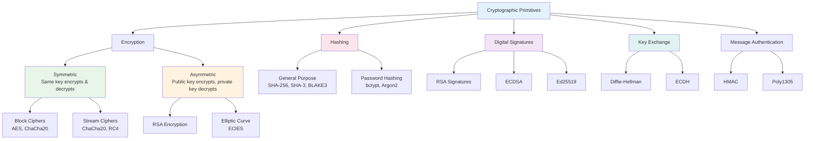
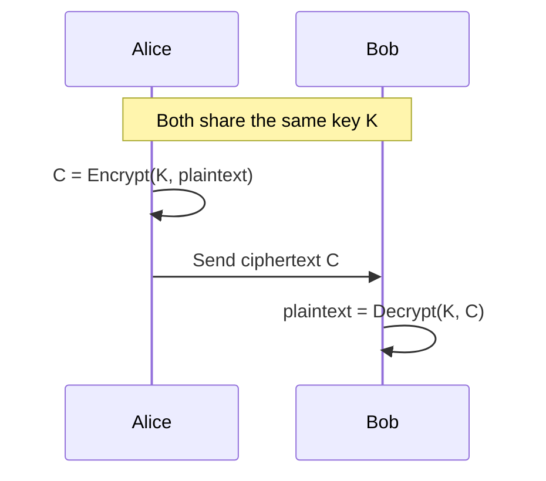
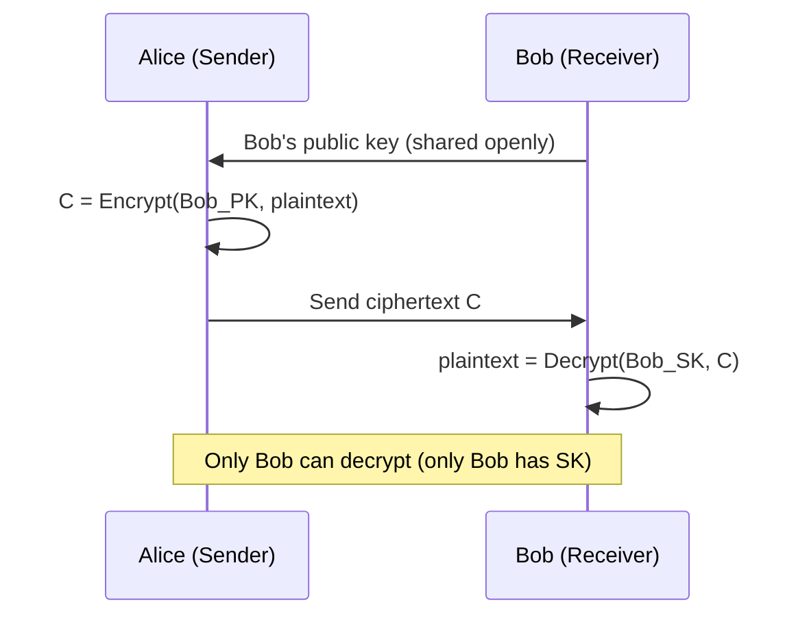
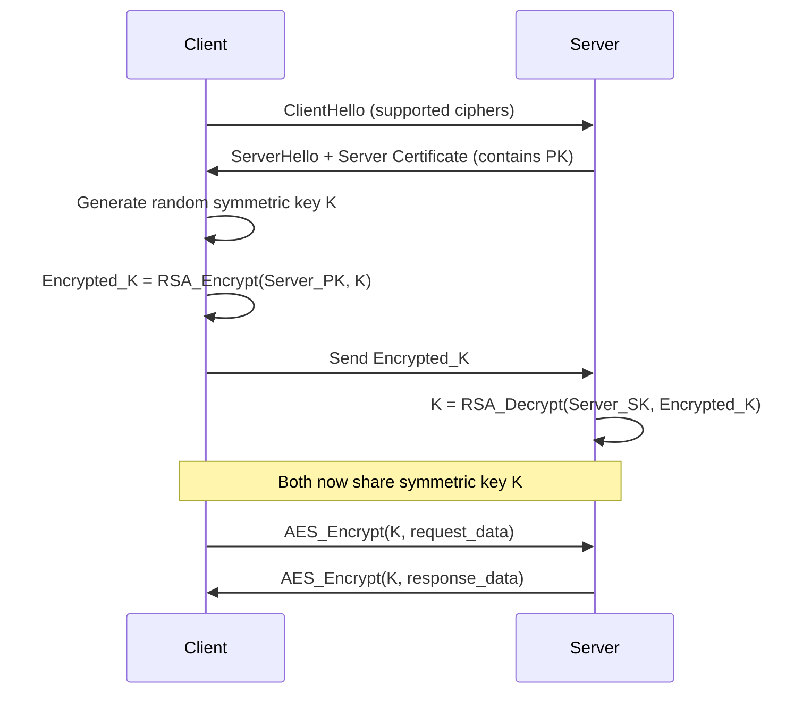
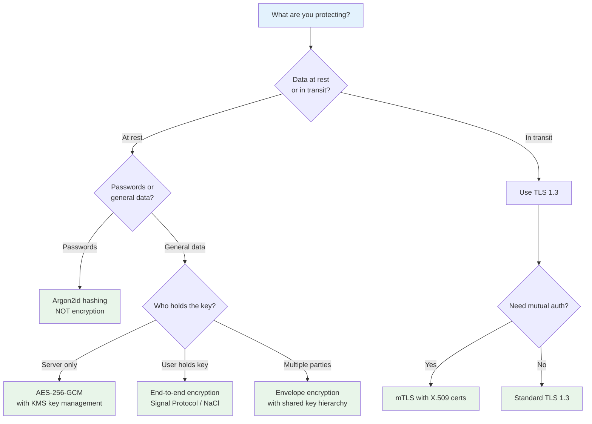

# Encryption Overview

## Why Encryption Exists

Encryption is the mathematical transformation of readable data (plaintext) into unreadable data (ciphertext), reversible only with knowledge of a secret (the key). It exists because digital communication inherently passes through untrusted channels — networks, storage devices, and third-party services where data can be intercepted, read, or modified.

Without encryption, every email, every credit card transaction, every medical record, and every private message would be readable by anyone with network access. The internet as we know it — e-commerce, banking, healthcare, personal communication — would be impossible.

### Historical Context

Cryptography is thousands of years old, but modern encryption began in the 20th century:

| Era | Development | Impact |
|-----|-------------|--------|
| Ancient | Caesar cipher, substitution ciphers | Military communication |
| 1800s | Vigenere cipher, frequency analysis | Breakable by hand |
| 1917 | One-time pad (Vernam cipher) | Information-theoretically secure |
| 1940s | Enigma machine, Colossus (first computer) | WWII outcome changed |
| 1976 | Diffie-Hellman key exchange | Public key cryptography born |
| 1977 | RSA algorithm | Practical asymmetric encryption |
| 1977 | DES (Data Encryption Standard) | First federal standard |
| 2001 | AES (Advanced Encryption Standard) | Replaced DES, still dominant |
| 2005 | SHA-256 family | Secure hashing for Bitcoin and TLS |
| 2011 | Ed25519 (Bernstein) | Modern elliptic curve signatures |
| 2020s | Post-quantum cryptography (NIST PQC) | Preparing for quantum threats |

## First Principles

### The Three Goals of Cryptography

Encryption serves three fundamental security properties (the CIA triad):

$$
\text{Security} = \text{Confidentiality} + \text{Integrity} + \text{Authenticity}
$$

| Property | Question It Answers | Cryptographic Primitive |
|----------|-------------------|----------------------|
| **Confidentiality** | Can anyone else read this data? | Encryption (AES, RSA) |
| **Integrity** | Has this data been modified? | Hashing (SHA-256, HMAC) |
| **Authenticity** | Who created this data? | Digital signatures (ECDSA, Ed25519) |

### Kerckhoffs's Principle

> A cryptosystem should be secure even if everything about the system, except the key, is public knowledge.

This is the foundational principle of modern cryptography. Security must derive from the secrecy of the key, not the secrecy of the algorithm. Proprietary "secret" algorithms are almost always weaker than publicly analyzed ones like AES and ChaCha20.

### The Taxonomy of Cryptographic Primitives



## Core Mechanics

### Symmetric Encryption

In symmetric encryption, the same key is used for both encryption and decryption:

$$
C = E(K, P) \quad \text{and} \quad P = D(K, C)
$$

where $E$ is the encryption function, $D$ is the decryption function, $K$ is the key, $P$ is the plaintext, and $C$ is the ciphertext.



**Key challenge**: How do Alice and Bob share the key securely? This is the **key distribution problem**, solved by asymmetric cryptography.

### Asymmetric Encryption

Asymmetric encryption uses a key pair — a public key for encryption and a private key for decryption:

$$
C = E(PK, P) \quad \text{and} \quad P = D(SK, C)
$$

The public key can be shared openly. Only the holder of the private key can decrypt.



### Hybrid Encryption (How TLS Actually Works)

In practice, asymmetric encryption is too slow for bulk data. Real systems use **hybrid encryption**:

1. Use asymmetric crypto to exchange a symmetric key
2. Use the symmetric key for the actual data



### Hashing vs. Encryption

| Feature | Hashing | Encryption |
|---------|---------|------------|
| **Reversible** | No (one-way) | Yes (with key) |
| **Output size** | Fixed (e.g., 256 bits) | Variable (same as input + overhead) |
| **Key required** | No (or HMAC key) | Yes |
| **Use case** | Integrity verification, passwords | Data confidentiality |
| **Example** | SHA-256("hello") = 2cf24... | AES(key, "hello") = 8f4a... |

## Implementation

### Quick Reference: Node.js Crypto

```typescript
import crypto from 'node:crypto';

// ─── AES-256-GCM Encryption ────────────────────────────────────

function encrypt(plaintext: string, key: Buffer): {
  ciphertext: string;
  iv: string;
  authTag: string;
} {
  const iv = crypto.randomBytes(12); // 96-bit IV for GCM
  const cipher = crypto.createCipheriv('aes-256-gcm', key, iv);

  let encrypted = cipher.update(plaintext, 'utf8', 'base64');
  encrypted += cipher.final('base64');
  const authTag = cipher.getAuthTag();

  return {
    ciphertext: encrypted,
    iv: iv.toString('base64'),
    authTag: authTag.toString('base64'),
  };
}

function decrypt(
  ciphertext: string,
  key: Buffer,
  iv: string,
  authTag: string
): string {
  const decipher = crypto.createDecipheriv(
    'aes-256-gcm',
    key,
    Buffer.from(iv, 'base64')
  );
  decipher.setAuthTag(Buffer.from(authTag, 'base64'));

  let decrypted = decipher.update(ciphertext, 'base64', 'utf8');
  decrypted += decipher.final('utf8');

  return decrypted;
}

// ─── SHA-256 Hashing ──────────────────────────────────────────

function hash(data: string): string {
  return crypto.createHash('sha256').update(data).digest('hex');
}

// ─── HMAC ─────────────────────────────────────────────────────

function hmac(data: string, key: string): string {
  return crypto.createHmac('sha256', key).update(data).digest('hex');
}

// ─── RSA Key Pair Generation ──────────────────────────────────

function generateRSAKeyPair(): {
  publicKey: string;
  privateKey: string;
} {
  const { publicKey, privateKey } = crypto.generateKeyPairSync('rsa', {
    modulusLength: 4096,
    publicKeyEncoding: { type: 'spki', format: 'pem' },
    privateKeyEncoding: { type: 'pkcs8', format: 'pem' },
  });
  return { publicKey, privateKey };
}

// ─── Ed25519 Key Pair ─────────────────────────────────────────

function generateEd25519KeyPair(): {
  publicKey: string;
  privateKey: string;
} {
  const { publicKey, privateKey } = crypto.generateKeyPairSync('ed25519', {
    publicKeyEncoding: { type: 'spki', format: 'pem' },
    privateKeyEncoding: { type: 'pkcs8', format: 'pem' },
  });
  return { publicKey, privateKey };
}

// ─── Digital Signature (Ed25519) ──────────────────────────────

function sign(data: string, privateKey: string): string {
  return crypto.sign(null, Buffer.from(data), privateKey).toString('base64');
}

function verify(data: string, signature: string, publicKey: string): boolean {
  return crypto.verify(
    null,
    Buffer.from(data),
    publicKey,
    Buffer.from(signature, 'base64')
  );
}
```

### Algorithm Selection Guide

```typescript
type UseCase =
  | 'data-at-rest'
  | 'data-in-transit'
  | 'password-storage'
  | 'file-integrity'
  | 'digital-signature'
  | 'key-exchange'
  | 'api-authentication';

function selectAlgorithm(useCase: UseCase): {
  algorithm: string;
  keySize: number;
  rationale: string;
} {
  const recommendations: Record<UseCase, { algorithm: string; keySize: number; rationale: string }> = {
    'data-at-rest': {
      algorithm: 'AES-256-GCM',
      keySize: 256,
      rationale: 'Authenticated encryption, hardware accelerated on most CPUs',
    },
    'data-in-transit': {
      algorithm: 'TLS 1.3 (AES-256-GCM or ChaCha20-Poly1305)',
      keySize: 256,
      rationale: 'TLS 1.3 removes insecure cipher suites, mandatory forward secrecy',
    },
    'password-storage': {
      algorithm: 'Argon2id',
      keySize: 256,
      rationale: 'Memory-hard, resists GPU and ASIC attacks, OWASP recommended',
    },
    'file-integrity': {
      algorithm: 'SHA-256 or BLAKE3',
      keySize: 256,
      rationale: 'SHA-256 is ubiquitous, BLAKE3 is faster for large files',
    },
    'digital-signature': {
      algorithm: 'Ed25519',
      keySize: 256,
      rationale: 'Fast, small keys/signatures, constant-time, no nonce reuse risk',
    },
    'key-exchange': {
      algorithm: 'X25519 (ECDH on Curve25519)',
      keySize: 256,
      rationale: 'Fast, safe defaults, used in TLS 1.3 and Signal Protocol',
    },
    'api-authentication': {
      algorithm: 'HMAC-SHA256',
      keySize: 256,
      rationale: 'Simple, fast, widely supported, good for request signing',
    },
  };

  return recommendations[useCase];
}
```

## Edge Cases & Failure Modes

### Common Cryptographic Mistakes

| Mistake | Impact | Correct Approach |
|---------|--------|-----------------|
| ECB mode | Patterns visible in ciphertext | Use GCM or CTR mode |
| Reusing IVs/nonces | Breaks confidentiality | Random IV per encryption |
| No authentication | Ciphertext can be modified | Use AEAD (GCM, ChaCha20-Poly1305) |
| Hardcoded keys | Key extraction from binary | Use KMS or environment variables |
| MD5/SHA-1 for security | Known collisions | SHA-256 or SHA-3 |
| Custom crypto | Almost always broken | Use established libraries |
| Encrypting passwords | Reversible = leakable | Hash passwords (Argon2id) |

::: danger
**Never implement your own cryptographic algorithms.** Use well-tested libraries like Node.js `crypto`, `libsodium`, or `OpenSSL`. Even subtle implementation bugs (like timing side channels) can completely break security.
:::

### The "Encrypt Everything" Fallacy

Encryption protects confidentiality but not availability or integrity (unless using AEAD). Encrypted data can still be:

- **Deleted** — encryption doesn't prevent destruction
- **Replayed** — old encrypted messages can be resent
- **Analyzed** — metadata (who, when, how much) is visible even with encryption
- **Inaccessible** — lost keys mean permanently lost data

## Performance Characteristics

### Algorithm Speed Comparison

| Algorithm | Type | Throughput (single core) | Key Size | Notes |
|-----------|------|------------------------|----------|-------|
| AES-256-GCM | Symmetric AEAD | 4–6 GB/s (AES-NI) | 256-bit | Hardware accelerated |
| ChaCha20-Poly1305 | Symmetric AEAD | 2–3 GB/s | 256-bit | Fast without AES-NI |
| RSA-4096 encrypt | Asymmetric | ~1,000 ops/s | 4096-bit | Slow for bulk data |
| RSA-4096 decrypt | Asymmetric | ~50 ops/s | 4096-bit | Very slow |
| ECDSA P-256 sign | Signature | ~20,000 ops/s | 256-bit | Moderate |
| ECDSA P-256 verify | Signature | ~10,000 ops/s | 256-bit | Moderate |
| Ed25519 sign | Signature | ~60,000 ops/s | 256-bit | Very fast |
| Ed25519 verify | Signature | ~30,000 ops/s | 256-bit | Fast |
| SHA-256 | Hash | 1–2 GB/s | N/A | Hardware accelerated |
| BLAKE3 | Hash | 5–10 GB/s | N/A | Parallelizable |
| Argon2id | Password hash | ~3 hashes/s | N/A | Intentionally slow |

### Ciphertext Expansion

Encryption adds overhead to the plaintext:

| Algorithm | IV/Nonce | Auth Tag | Total Overhead |
|-----------|----------|----------|---------------|
| AES-256-GCM | 12 bytes | 16 bytes | 28 bytes |
| ChaCha20-Poly1305 | 12 bytes | 16 bytes | 28 bytes |
| RSA-4096 | N/A | N/A | Output = 512 bytes (fixed) |
| AES-256-CBC | 16 bytes | N/A (no auth!) | 16 bytes + padding |

## Mathematical Foundations

### Information-Theoretic vs. Computational Security

**Information-theoretic security** (one-time pad): unbreakable even with infinite computing power.

$$
H(P | C) = H(P) \iff |K| \geq |P|
$$

The key must be at least as long as the message. Impractical for general use.

**Computational security** (AES, RSA): breaking requires computational effort beyond any practical attacker.

$$
\text{Advantage}(A) = |Pr[A \text{ wins}] - \frac{1}{2}| \leq \text{negl}(\lambda)
$$

where $\text{negl}(\lambda)$ is a negligible function of the security parameter $\lambda$.

### AES Security Margin

AES-256 has a theoretical security level of 256 bits. The best known attack (biclique) reduces this to:

$$
2^{254.4} \text{ operations (vs. brute-force } 2^{256}\text{)}
$$

This is a negligible speedup — AES-256 remains unbroken. For reference, the estimated energy to brute-force AES-256:

$$
E = 2^{256} \times E_{\text{op}} \approx 2^{256} \times 10^{-18} \text{ J} \approx 10^{59} \text{ J}
$$

The sun's total energy output over its lifetime is $\sim 10^{44}$ J. Breaking AES-256 by brute force would require $10^{15}$ times the sun's total energy.

### The Random Oracle Model

Many cryptographic proofs assume hash functions behave as "random oracles" — functions that return truly random output for each unique input. While no real hash function is a random oracle, SHA-256 and SHA-3 behave sufficiently close for practical security.

## Real-World War Stories

::: info War Story
**The Heartbleed Bug (2014)**

OpenSSL's implementation of the TLS Heartbeat extension had a buffer over-read vulnerability. An attacker could read up to 64 KB of server memory per heartbeat request, potentially exposing private keys, session tokens, and user data.

The cryptographic algorithms were fine — the bug was in the *implementation*. This demonstrated that even well-designed cryptographic protocols can be undermined by implementation errors.

**Impact**: ~17% of TLS servers were vulnerable. Major services (Yahoo, Cloudflare, Tumblr) had to revoke and re-issue certificates.

**Lesson**: Use memory-safe languages (Rust, Go) for cryptographic implementations when possible. Audit implementations, not just algorithms.
:::

::: info War Story
**The Adobe Password Breach (2013)**

Adobe stored 153 million passwords encrypted with 3DES-ECB (not hashed). Because ECB mode encrypts identical plaintext blocks to identical ciphertext blocks, users with the same password produced the same ciphertext. Combined with password hints stored in plaintext, attackers could deduce passwords by cross-referencing identical ciphertexts with their hints.

**Lesson**: Passwords should be *hashed* (one-way), not *encrypted* (reversible). And ECB mode should never be used for anything — it preserves patterns in the data.
:::

::: info War Story
**The Let's Encrypt Revolution (2015–present)**

Before Let's Encrypt, TLS certificates cost $100–300/year and required manual installation. This meant that ~70% of websites were served over unencrypted HTTP. Let's Encrypt made certificates free and automated, driving HTTPS adoption from ~30% in 2015 to over 95% in 2025.

**Lesson**: Encryption adoption is as much about economics and usability as it is about mathematics. Making the right choice the easy choice has more security impact than any algorithm improvement.
:::

## Decision Framework

### Choosing the Right Encryption Approach



### Compliance Requirements by Regulation

| Regulation | Encryption Requirement | Minimum Standard |
|------------|----------------------|------------------|
| PCI DSS | Encrypt cardholder data at rest and in transit | AES-256, TLS 1.2+ |
| HIPAA | Encrypt PHI (recommended, not mandated) | AES-128+ |
| GDPR | Appropriate technical measures | Not specified (AES-256 recommended) |
| SOC 2 | Encryption for sensitive data | AES-256, TLS 1.2+ |
| FedRAMP | FIPS 140-2 validated modules | FIPS-approved algorithms |

## Advanced Topics

### Post-Quantum Cryptography

Quantum computers running Shor's algorithm can break RSA and ECC in polynomial time:

$$
\text{RSA: } O((\log N)^3) \text{ qubits} \quad | \quad \text{ECC: } O((\log N)^3) \text{ qubits}
$$

NIST has standardized post-quantum algorithms (2024):

| Algorithm | Type | Use Case | Key Size |
|-----------|------|----------|----------|
| ML-KEM (Kyber) | Lattice-based | Key encapsulation | 800–1568 bytes |
| ML-DSA (Dilithium) | Lattice-based | Digital signatures | 1312–2592 bytes |
| SLH-DSA (SPHINCS+) | Hash-based | Digital signatures | 32–64 bytes |
| FN-DSA (FALCON) | Lattice-based | Digital signatures | 897–1793 bytes |

**Timeline concern**: "Harvest now, decrypt later" — adversaries may be storing encrypted traffic today to decrypt when quantum computers become available (estimated 2030–2040). Migrate to hybrid (classical + PQC) encryption now for long-lived secrets.

### Homomorphic Encryption

Perform computations on encrypted data without decrypting it:

$$
E(a) + E(b) = E(a + b) \quad \text{(additive homomorphism)}
$$
$$
E(a) \times E(b) = E(a \times b) \quad \text{(multiplicative homomorphism)}
$$

Fully Homomorphic Encryption (FHE) supports both operations, enabling computation on encrypted databases. Current performance: ~1,000–10,000x slower than plaintext computation, but improving rapidly.

### Zero-Knowledge Proofs

Prove knowledge of a secret without revealing the secret:

$$
\text{Prover } P \text{ convinces Verifier } V \text{ that } P \text{ knows } x \text{ such that } f(x) = y
$$

without revealing $x$. Used in:
- Anonymous authentication
- Private transactions (Zcash)
- Identity verification without data exposure

## Section Index

This section covers encryption in depth across the following pages:

| Page | Topic |
|------|-------|
| [Symmetric vs. Asymmetric](/security/encryption/symmetric-vs-asymmetric) | AES, RSA, ECDSA, Ed25519, practical Node.js implementations |
| [Hashing Algorithms](/security/encryption/hashing-algorithms) | bcrypt, scrypt, Argon2, password hashing strategies |
| [Encryption at Rest](/security/encryption/encryption-at-rest) | Database-level, application-level, full-disk encryption |
| [Encryption in Transit](/security/encryption/encryption-in-transit) | TLS configuration, mTLS, HSTS |
| [Key Management](/security/encryption/key-management) | Key lifecycle, KMS services, key hierarchy design |
| [Envelope Encryption](/security/encryption/envelope-encryption) | Envelope encryption pattern, AWS KMS implementation |

## Cross-References

- [OWASP A02: Cryptographic Failures](/security/owasp/a02-cryptographic-failures) — Common cryptographic vulnerabilities
- [API Key Design](/security/authentication/api-key-design) — Cryptographic key generation for APIs
- [Request Signing](/security/api-security/request-signing) — HMAC-based request authentication
- [Secrets Management](/security/secrets-management/) — Managing cryptographic keys and secrets
- [Zero Trust Principles](/security/zero-trust/principles) — Encryption's role in zero-trust architecture
