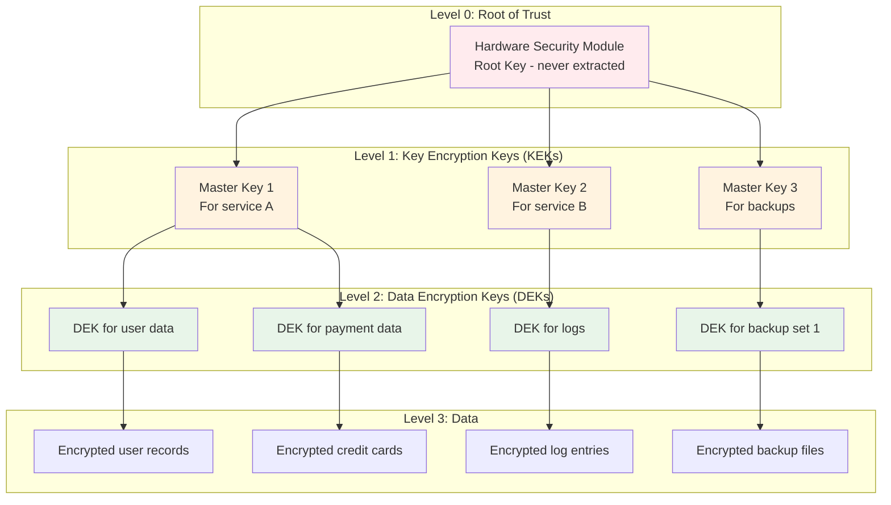
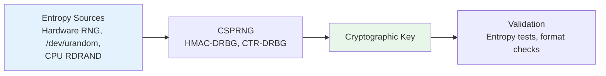
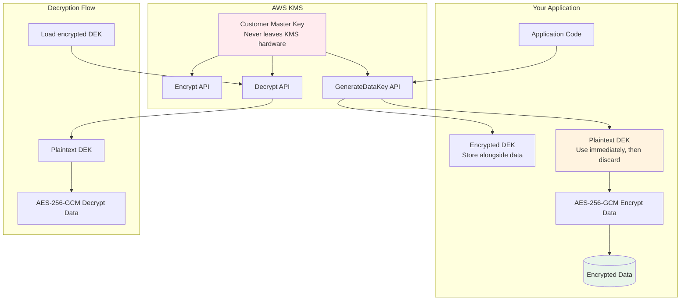
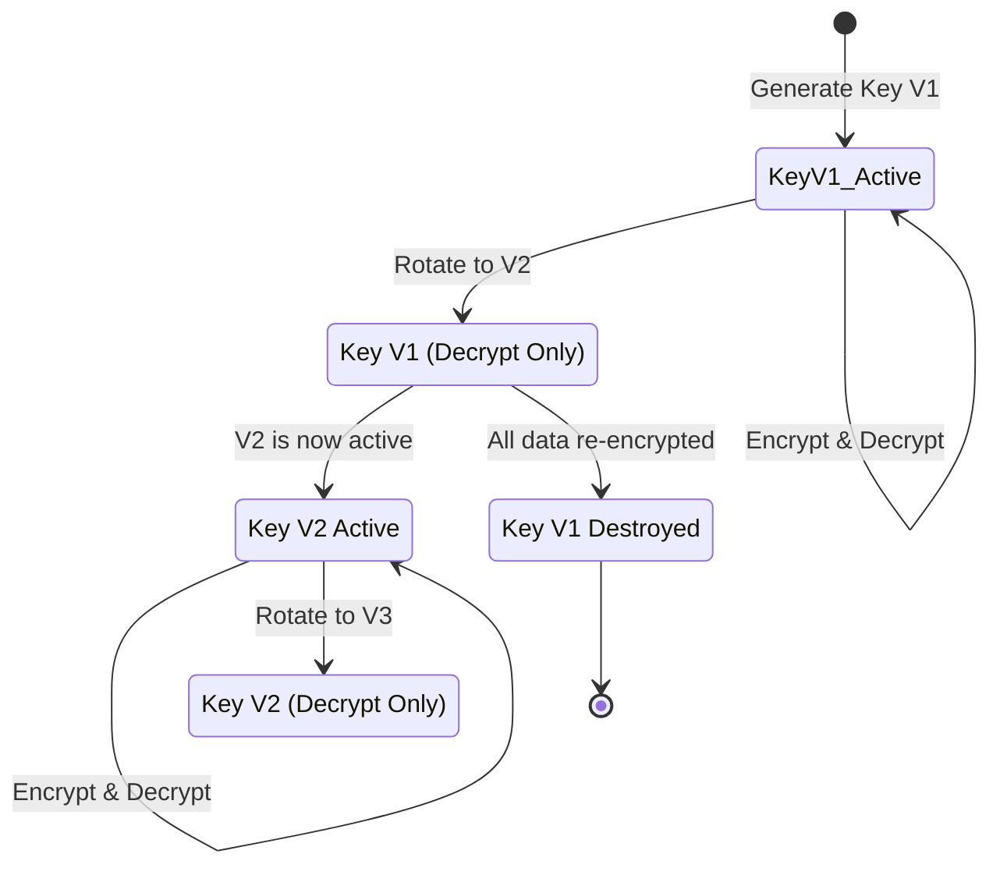

# Key Management

## Why Key Management Exists

Encryption is only as strong as the protection of its keys. A perfectly implemented AES-256 encryption system is worthless if the key is stored in plaintext in a config file, committed to a Git repository, or shared via Slack. Key management is the discipline of generating, storing, distributing, rotating, and destroying cryptographic keys throughout their lifecycle.

The fundamental paradox of key management: **You need encryption to protect data, but you also need to protect the encryption keys — with more encryption.** This recursive problem is solved by a key hierarchy where the root of trust is protected by hardware (HSMs) or managed cloud services (KMS).

### Historical Context

- **1970s**: Military key management — physical key distribution, two-person integrity
- **1990s**: PKI (Public Key Infrastructure) — certificate-based key management
- **2000s**: Hardware Security Modules (HSMs) become commercially available
- **2014**: AWS KMS launched — democratized key management
- **2016**: HashiCorp Vault gains widespread adoption
- **2020s**: KMS services become the default for cloud applications

## First Principles

### The Key Hierarchy

A key hierarchy reduces the blast radius of key compromise and enables efficient key rotation:



### Key Lifecycle

Every key goes through defined stages:

$$
\text{Generate} \rightarrow \text{Distribute} \rightarrow \text{Use} \rightarrow \text{Rotate} \rightarrow \text{Archive} \rightarrow \text{Destroy}
$$

| Stage | Description | Duration | Security Concern |
|-------|-------------|----------|------------------|
| **Generation** | Create with sufficient entropy | Instant | Weak RNG = weak key |
| **Distribution** | Deliver to authorized systems | Minutes to hours | Interception risk |
| **Active use** | Encrypt/decrypt operations | Days to years | Exposure risk |
| **Rotation** | Replace with new key | Minutes | Availability during transition |
| **Archive** | Keep old key for decryption only | Months to years | Unauthorized access to old key |
| **Destruction** | Securely delete all copies | Instant | Incomplete destruction |

### Separation of Duties

No single person or system should have access to:
1. The encrypted data AND the decryption key
2. The ability to create keys AND use them
3. The ability to rotate keys AND destroy old ones

## Core Mechanics

### Key Generation Requirements

Cryptographic keys must be generated from a Cryptographically Secure Pseudo-Random Number Generator (CSPRNG):



Never use:
- `Math.random()` (JavaScript) — not cryptographic
- `random.random()` (Python) — not cryptographic
- `/dev/random` (Linux) — unnecessarily blocking, `/dev/urandom` is sufficient

Always use:
- `crypto.randomBytes()` (Node.js)
- `secrets.token_bytes()` (Python)
- `crypto/rand.Read()` (Go)
- `getrandom()` / `/dev/urandom` (Linux)

### AWS KMS Architecture



### Key Rotation Mechanics

Key rotation replaces the active encryption key while maintaining the ability to decrypt data encrypted with old keys:



## Implementation

### Key Management Service (TypeScript)

```typescript
import crypto from 'node:crypto';
import { Redis } from 'ioredis';

interface ManagedKey {
  id: string;
  version: number;
  algorithm: string;
  keyMaterial: Buffer;  // In production, this comes from KMS
  status: 'active' | 'decrypt-only' | 'destroyed';
  createdAt: Date;
  rotatedAt: Date | null;
  expiresAt: Date | null;
  metadata: Record<string, string>;
}

interface KeyConfig {
  algorithm: 'aes-256-gcm';
  rotationIntervalDays: number;
  maxVersionsToKeep: number;
  autoRotate: boolean;
}

class KeyManagementService {
  private redis: Redis;
  private keyStore: Map<string, ManagedKey[]> = new Map(); // Versioned key store
  private config: KeyConfig;

  constructor(redis: Redis, config: KeyConfig) {
    this.redis = redis;
    this.config = config;
  }

  /**
   * Generate a new managed key.
   */
  async createKey(keyName: string, metadata?: Record<string, string>): Promise<ManagedKey> {
    const key: ManagedKey = {
      id: `${keyName}:v1`,
      version: 1,
      algorithm: this.config.algorithm,
      keyMaterial: crypto.randomBytes(32),
      status: 'active',
      createdAt: new Date(),
      rotatedAt: null,
      expiresAt: this.config.rotationIntervalDays > 0
        ? new Date(Date.now() + this.config.rotationIntervalDays * 86400000)
        : null,
      metadata: metadata ?? {},
    };

    const versions = this.keyStore.get(keyName) ?? [];
    versions.push(key);
    this.keyStore.set(keyName, versions);

    // Cache current version in Redis for fast lookup
    await this.redis.set(
      `key:current:${keyName}`,
      key.version.toString(),
      'EX',
      3600
    );

    this.auditLog('key_created', keyName, key.version);
    return key;
  }

  /**
   * Get the current active key for encryption.
   */
  async getCurrentKey(keyName: string): Promise<ManagedKey> {
    const versions = this.keyStore.get(keyName);
    if (!versions || versions.length === 0) {
      throw new Error(`Key not found: ${keyName}`);
    }

    const activeKey = versions.find((k) => k.status === 'active');
    if (!activeKey) {
      throw new Error(`No active version for key: ${keyName}`);
    }

    // Check if rotation is needed
    if (this.config.autoRotate && activeKey.expiresAt && activeKey.expiresAt < new Date()) {
      return this.rotateKey(keyName);
    }

    return activeKey;
  }

  /**
   * Get a specific key version for decryption.
   */
  async getKeyVersion(keyName: string, version: number): Promise<ManagedKey> {
    const versions = this.keyStore.get(keyName);
    if (!versions) throw new Error(`Key not found: ${keyName}`);

    const key = versions.find((k) => k.version === version);
    if (!key) throw new Error(`Key version not found: ${keyName}:v${version}`);
    if (key.status === 'destroyed') throw new Error(`Key version destroyed: ${keyName}:v${version}`);

    return key;
  }

  /**
   * Rotate a key — create new version, mark old as decrypt-only.
   */
  async rotateKey(keyName: string): Promise<ManagedKey> {
    const versions = this.keyStore.get(keyName);
    if (!versions || versions.length === 0) {
      throw new Error(`Key not found: ${keyName}`);
    }

    // Mark current active key as decrypt-only
    const currentActive = versions.find((k) => k.status === 'active');
    if (currentActive) {
      currentActive.status = 'decrypt-only';
      currentActive.rotatedAt = new Date();
    }

    // Create new version
    const newVersion = (versions[versions.length - 1]?.version ?? 0) + 1;
    const newKey: ManagedKey = {
      id: `${keyName}:v${newVersion}`,
      version: newVersion,
      algorithm: this.config.algorithm,
      keyMaterial: crypto.randomBytes(32),
      status: 'active',
      createdAt: new Date(),
      rotatedAt: null,
      expiresAt: this.config.rotationIntervalDays > 0
        ? new Date(Date.now() + this.config.rotationIntervalDays * 86400000)
        : null,
      metadata: currentActive?.metadata ?? {},
    };

    versions.push(newKey);

    // Enforce max versions
    while (versions.length > this.config.maxVersionsToKeep) {
      const oldest = versions[0];
      if (oldest.status !== 'active') {
        this.destroyKeyMaterial(oldest);
        versions.shift();
      } else {
        break;
      }
    }

    // Update Redis cache
    await this.redis.set(
      `key:current:${keyName}`,
      newKey.version.toString(),
      'EX',
      3600
    );

    this.auditLog('key_rotated', keyName, newVersion);
    return newKey;
  }

  /**
   * Securely destroy key material.
   */
  private destroyKeyMaterial(key: ManagedKey): void {
    // Overwrite key material with zeros
    key.keyMaterial.fill(0);
    key.status = 'destroyed';
    this.auditLog('key_destroyed', key.id, key.version);
  }

  /**
   * Audit logging for all key operations.
   */
  private auditLog(action: string, keyName: string, version: number): void {
    console.log(JSON.stringify({
      timestamp: new Date().toISOString(),
      action,
      keyName,
      version,
      // Never log key material!
    }));
  }
}
```

### AWS KMS Integration (TypeScript)

```typescript
import {
  KMSClient,
  GenerateDataKeyCommand,
  DecryptCommand,
  CreateKeyCommand,
  ScheduleKeyDeletionCommand,
  EnableKeyRotationCommand,
} from '@aws-sdk/client-kms';

class AWSKeyManager {
  private kms: KMSClient;
  private keyCache: Map<string, { key: Buffer; expiresAt: number }> = new Map();

  constructor(region: string) {
    this.kms = new KMSClient({ region });
  }

  /**
   * Create a new CMK (Customer Master Key) in AWS KMS.
   */
  async createMasterKey(description: string): Promise<string> {
    const response = await this.kms.send(new CreateKeyCommand({
      Description: description,
      KeyUsage: 'ENCRYPT_DECRYPT',
      KeySpec: 'SYMMETRIC_DEFAULT', // AES-256-GCM
      Origin: 'AWS_KMS',
      Tags: [
        { TagKey: 'Environment', TagValue: 'production' },
        { TagKey: 'ManagedBy', TagValue: 'key-management-service' },
      ],
    }));

    const keyId = response.KeyMetadata!.KeyId!;

    // Enable automatic annual rotation
    await this.kms.send(new EnableKeyRotationCommand({
      KeyId: keyId,
    }));

    return keyId;
  }

  /**
   * Generate a data encryption key (DEK) using envelope encryption.
   * Returns both the plaintext DEK (for immediate use) and the
   * encrypted DEK (for storage alongside the data).
   */
  async generateDataKey(masterKeyId: string): Promise<{
    plaintextKey: Buffer;
    encryptedKey: Buffer;
  }> {
    const response = await this.kms.send(new GenerateDataKeyCommand({
      KeyId: masterKeyId,
      KeySpec: 'AES_256',
      EncryptionContext: {
        purpose: 'data-encryption',
        service: 'user-data-service',
      },
    }));

    return {
      plaintextKey: Buffer.from(response.Plaintext!),
      encryptedKey: Buffer.from(response.CiphertextBlob!),
    };
  }

  /**
   * Decrypt a previously encrypted DEK.
   * Uses caching to avoid repeated KMS calls.
   */
  async decryptDataKey(encryptedKey: Buffer): Promise<Buffer> {
    const cacheKey = encryptedKey.toString('base64');
    const cached = this.keyCache.get(cacheKey);
    if (cached && cached.expiresAt > Date.now()) {
      return cached.key;
    }

    const response = await this.kms.send(new DecryptCommand({
      CiphertextBlob: encryptedKey,
      EncryptionContext: {
        purpose: 'data-encryption',
        service: 'user-data-service',
      },
    }));

    const plaintextKey = Buffer.from(response.Plaintext!);

    // Cache for 5 minutes
    this.keyCache.set(cacheKey, {
      key: plaintextKey,
      expiresAt: Date.now() + 300000,
    });

    return plaintextKey;
  }

  /**
   * Schedule key deletion with a waiting period.
   */
  async scheduleKeyDeletion(
    keyId: string,
    waitingPeriodDays: number = 30
  ): Promise<Date> {
    const response = await this.kms.send(new ScheduleKeyDeletionCommand({
      KeyId: keyId,
      PendingWindowInDays: waitingPeriodDays,
    }));

    return response.DeletionDate!;
  }
}
```

### Key Wrapping (Envelope Encryption Pattern)

```typescript
import crypto from 'node:crypto';

interface WrappedKey {
  encryptedDEK: Buffer;
  kekId: string;
  algorithm: string;
  iv: Buffer;
  authTag: Buffer;
}

class KeyWrapper {
  /**
   * Wrap (encrypt) a DEK with a KEK.
   */
  static wrap(dek: Buffer, kek: Buffer, kekId: string): WrappedKey {
    const iv = crypto.randomBytes(12);
    const cipher = crypto.createCipheriv('aes-256-gcm', kek, iv);

    const encrypted = Buffer.concat([
      cipher.update(dek),
      cipher.final(),
    ]);

    return {
      encryptedDEK: encrypted,
      kekId,
      algorithm: 'aes-256-gcm',
      iv,
      authTag: cipher.getAuthTag(),
    };
  }

  /**
   * Unwrap (decrypt) a DEK using its KEK.
   */
  static unwrap(wrappedKey: WrappedKey, kek: Buffer): Buffer {
    const decipher = crypto.createDecipheriv(
      'aes-256-gcm',
      kek,
      wrappedKey.iv
    );
    decipher.setAuthTag(wrappedKey.authTag);

    const dek = Buffer.concat([
      decipher.update(wrappedKey.encryptedDEK),
      decipher.final(),
    ]);

    return dek;
  }

  /**
   * Re-wrap a DEK with a new KEK (key rotation without re-encrypting data).
   */
  static rewrap(
    wrappedKey: WrappedKey,
    oldKek: Buffer,
    newKek: Buffer,
    newKekId: string
  ): WrappedKey {
    const dek = this.unwrap(wrappedKey, oldKek);
    const newWrapped = this.wrap(dek, newKek, newKekId);

    // Securely erase the plaintext DEK
    dek.fill(0);

    return newWrapped;
  }
}
```

## Edge Cases & Failure Modes

### Key Loss Scenarios

| Scenario | Data Impact | Prevention |
|----------|------------|------------|
| KMS service outage | Cannot decrypt (temporary) | Cache DEKs, multi-region |
| KMS key deleted | Permanent data loss | Deletion protection, waiting period |
| HSM failure | Cannot access root key | HSM cluster with backup |
| Key corruption | Decryption produces garbage | Integrity checks on wrapped keys |
| Cache poisoning | Wrong key used for decrypt | Verify key ID in ciphertext metadata |

### Key Rotation Race Conditions

During rotation, there is a window where two key versions are both valid:

```
Timeline:
  T0: Key V1 is active
  T1: Rotation starts — Key V2 generated
  T2: Key V1 marked decrypt-only
  T3: In-flight requests using V1 complete
  T4: All new encryptions use V2

Risk window: T1 → T3
  Some services may encrypt with V1 while others use V2
  Some requests may arrive encrypted with V1 after V2 is active
```

**Solution**: Always store the key version alongside the ciphertext. Decryption uses the version metadata to select the correct key.

### Memory Safety

Plaintext keys in memory can be:
- Swapped to disk (OS page swapping)
- Visible in core dumps
- Accessible via `/proc/<pid>/mem`
- Retained after `Buffer.alloc()` if not zeroed

```typescript
// Secure key handling pattern
async function useKeySecurely(getKey: () => Promise<Buffer>): Promise<void> {
  let key: Buffer | null = null;
  try {
    key = await getKey();
    // Use key for encryption/decryption
    performCryptoOperation(key);
  } finally {
    // Securely erase key from memory
    if (key) {
      key.fill(0);
      key = null;
    }
  }
}
```

## Performance Characteristics

### KMS API Costs

| Operation | AWS KMS Cost | Latency (p50) | Latency (p99) |
|-----------|-------------|---------------|---------------|
| Encrypt | $0.03/10K | 5ms | 50ms |
| Decrypt | $0.03/10K | 5ms | 50ms |
| GenerateDataKey | $0.03/10K | 8ms | 60ms |
| CreateKey | Free | 100ms | 500ms |
| Key rotation | Free | N/A | N/A |

**Cost optimization**: With envelope encryption, you call KMS once to decrypt the DEK, then use the DEK locally for all data operations. A service processing 1M records/day makes ~1 KMS call (to decrypt the DEK), not 1M.

### Key Caching Impact

| Strategy | KMS Calls/Day | Cost/Day | Latency |
|----------|--------------|----------|---------|
| No caching | 1,000,000 | $3.00 | +5ms per operation |
| Per-request cache | 1,000 | $0.003 | +5ms first request |
| Session cache (5 min) | ~300 | $0.001 | +5ms every 5 min |
| Startup-only | 1 | $0.000003 | +5ms at startup |

## Mathematical Foundations

### Key Entropy Requirements

A key must have at least as many bits of entropy as the security level it provides:

$$
H(K) \geq \lambda
$$

where $\lambda$ is the security parameter. For AES-256, $\lambda = 256$ bits.

The probability of guessing a 256-bit key:

$$
P(\text{guess}) = \frac{1}{2^{256}} \approx 8.6 \times 10^{-78}
$$

### Key Derivation Function Security

When deriving keys from passwords or shared secrets, the KDF must produce uniform output:

$$
\text{Statistical distance}(\text{KDF}(s), U_n) \leq \epsilon
$$

where $U_n$ is the uniform distribution over $n$-bit strings and $\epsilon$ is negligible.

HKDF achieves this through extract-then-expand:

$$
\text{PRK} = \text{HMAC}(\text{salt}, \text{input key material})
$$
$$
\text{OKM} = \text{HMAC}(\text{PRK}, \text{info} \| \text{counter})
$$

## Real-World War Stories

::: info War Story
**The Google KMS Multi-Region Incident**

Google Cloud KMS experienced a rare multi-region failure in 2019 where key metadata became temporarily inconsistent across regions. Applications attempting cross-region decryption received errors for approximately 12 minutes.

Google's resolution was to cache DEKs locally with a TTL, so applications could continue operating during brief KMS outages. They also implemented a "break-glass" procedure where pre-cached key material in HSMs could be used as a fallback.

**Lesson**: Always design for KMS unavailability. Cache decrypted DEKs locally with appropriate TTLs.
:::

::: info War Story
**Uber's Key Rotation Incident (2016)**

Uber stored encryption keys in a private GitHub repository. When the repository was accessed by attackers (using credentials found on a public GitHub repo), they gained access to the AWS keys that protected rider and driver data for 57 million users.

The root cause was storing keys in source control — a fundamental key management anti-pattern. The keys had not been rotated in over a year, giving the attackers extended access.

**Lesson**: Never store keys in source control. Use KMS or secrets management systems. Rotate keys regularly so that compromised keys have limited useful lifetime.
:::

## Decision Framework

### KMS Service Comparison

| Feature | AWS KMS | GCP Cloud KMS | Azure Key Vault | HashiCorp Vault |
|---------|---------|---------------|-----------------|-----------------|
| HSM backing | Yes (FIPS 140-2 L2) | Yes (L3) | Yes (L2, L3 premium) | Optional |
| Auto rotation | Annual | Configurable | Configurable | Configurable |
| BYOK | Yes | Yes | Yes | N/A (self-hosted) |
| Multi-region | Yes | Yes | Yes | Self-managed |
| Cost | $1/key/month | $0.06/key/month | $0.03/key/month | Free (self-hosted) |
| Audit logging | CloudTrail | Cloud Audit Logs | Azure Monitor | Audit device |
| IAM integration | AWS IAM | GCP IAM | Azure AD | Policies |

### When to Use Each Approach

| Scenario | Recommended Approach |
|----------|---------------------|
| Single cloud provider | Cloud KMS (AWS/GCP/Azure) |
| Multi-cloud | HashiCorp Vault or cloud-agnostic KMS |
| Regulatory (FIPS 140-2 L3) | Cloud HSM or dedicated HSM |
| Small startup | Cloud KMS with sane defaults |
| Financial services | Dedicated HSM + strict audit |
| Development/staging | Software-based KMS or Vault dev mode |

## Advanced Topics

### Shamir's Secret Sharing

Split a key into $n$ shares where $k$ shares are needed to reconstruct:

$$
f(x) = s + a_1 x + a_2 x^2 + \ldots + a_{k-1} x^{k-1} \pmod{p}
$$

where $s$ is the secret, $a_i$ are random coefficients, and shares are $(i, f(i))$ for $i = 1, \ldots, n$.

Any $k$ shares can reconstruct $s$ using Lagrange interpolation. Fewer than $k$ shares reveal nothing about $s$.

```typescript
// Simplified Shamir's Secret Sharing (use a library in production)
import crypto from 'node:crypto';

function splitSecret(
  secret: Buffer,
  totalShares: number,
  threshold: number,
  prime: bigint = BigInt('0xFFFFFFFFFFFFFFC5') // Large prime
): Array<{ x: bigint; y: bigint }> {
  if (threshold > totalShares) throw new Error('Threshold cannot exceed total shares');

  const secretValue = BigInt('0x' + secret.toString('hex'));
  const coefficients = [secretValue];

  // Generate random coefficients
  for (let i = 1; i < threshold; i++) {
    const coeff = BigInt('0x' + crypto.randomBytes(8).toString('hex')) % prime;
    coefficients.push(coeff);
  }

  // Evaluate polynomial at each point
  const shares: Array<{ x: bigint; y: bigint }> = [];
  for (let i = 1; i <= totalShares; i++) {
    const x = BigInt(i);
    let y = 0n;
    for (let j = 0; j < coefficients.length; j++) {
      y = (y + coefficients[j] * x ** BigInt(j)) % prime;
    }
    shares.push({ x, y });
  }

  return shares;
}
```

### Key Escrow and Recovery

For enterprise environments, key escrow ensures business continuity:

```typescript
interface KeyEscrowPolicy {
  escrowType: 'split' | 'backup' | 'custodian';
  splitConfig?: {
    totalShares: number;
    threshold: number;
    custodians: string[];
  };
  backupConfig?: {
    offlineBackupLocation: string;
    encryptionKeyForBackup: string;
  };
  recoveryApprovers: string[];
  approvalThreshold: number;
}
```

### Quantum-Safe Key Management

Prepare for the quantum transition by implementing crypto-agility:

```typescript
interface CryptoAgileKeyMetadata {
  keyId: string;
  classicalAlgorithm: 'AES-256-GCM';
  quantumResistantAlgorithm?: 'ML-KEM-1024';
  hybridMode: boolean; // Use both classical and PQ algorithms
  migrationStatus: 'classical' | 'hybrid' | 'post-quantum';
}
```

## Cross-References

- [Encryption Overview](/security/encryption/) — Cryptographic primitives
- [Envelope Encryption](/security/encryption/envelope-encryption) — Detailed envelope encryption
- [Encryption at Rest](/security/encryption/encryption-at-rest) — Using keys for data protection
- [Vault Deep Dive](/security/secrets-management/vault-deep-dive) — HashiCorp Vault key management
- [AWS Secrets Manager](/security/secrets-management/aws-secrets-manager) — AWS key and secret storage
- [Rotation Automation](/security/secrets-management/rotation-automation) — Automated key rotation
