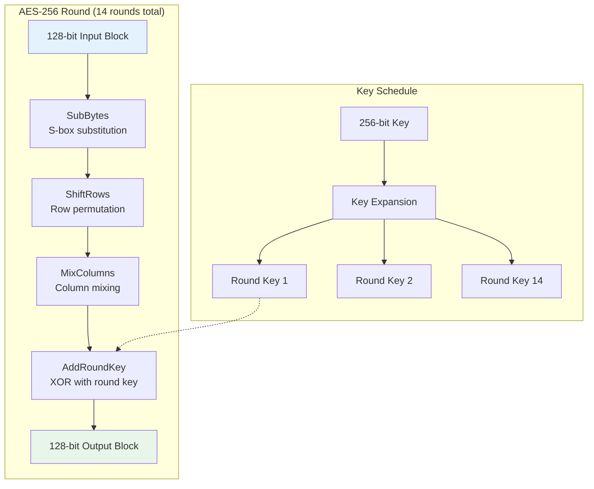
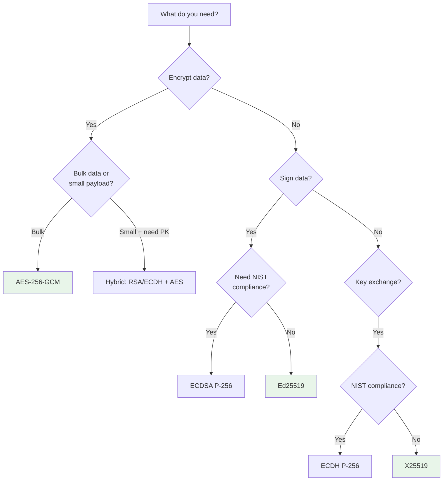

# Symmetric vs Asymmetric Encryption

## Why Both Exist

Symmetric and asymmetric encryption solve different problems. Symmetric encryption is fast but requires sharing a secret key. Asymmetric encryption solves the key distribution problem but is orders of magnitude slower. Modern systems use both together — asymmetric to exchange a key, symmetric to encrypt the data. Understanding both is essential for building secure systems.

### The Key Distribution Problem

Before public-key cryptography (1976), secure communication required sharing a secret key through a secure channel. But if you already have a secure channel, why do you need encryption? This chicken-and-egg problem limited cryptography to governments and militaries who could use physical couriers.

Diffie and Hellman's breakthrough was showing that two parties could agree on a shared secret over an insecure channel using mathematical trapdoor functions — operations easy to compute forward but infeasible to reverse.

## First Principles

### Symmetric Encryption Fundamentals

In symmetric encryption, the same key $K$ is used for encryption and decryption:

$$
C = E_K(P) \quad \text{and} \quad P = D_K(C)
$$

The security requirement is that without knowledge of $K$, the ciphertext $C$ reveals nothing about the plaintext $P$ beyond its length.

### Asymmetric Encryption Fundamentals

Asymmetric encryption uses a key pair $(PK, SK)$ where:

$$
C = E_{PK}(P) \quad \text{and} \quad P = D_{SK}(C)
$$

The public key $PK$ can be freely distributed. Computing $SK$ from $PK$ must be computationally infeasible.

For digital signatures, the roles reverse:

$$
\sigma = \text{Sign}_{SK}(M) \quad \text{and} \quad \text{Verify}_{PK}(M, \sigma) \in \{true, false\}
$$

### The Fundamental Tradeoff

| Property | Symmetric | Asymmetric |
|----------|-----------|------------|
| Speed | Very fast (GB/s) | Very slow (KB/s for RSA) |
| Key size for 128-bit security | 128 bits (AES-128) | 3072 bits (RSA) or 256 bits (ECC) |
| Key distribution | Requires secure channel | Public key can be shared openly |
| Number of keys for N parties | $\frac{N(N-1)}{2}$ | $2N$ |
| Use case | Bulk data encryption | Key exchange, signatures |

For $N = 1000$ parties:
- Symmetric: $\frac{1000 \times 999}{2} = 499{,}500$ keys
- Asymmetric: $2{,}000$ keys

## Core Mechanics

### AES (Advanced Encryption Standard)

AES is a block cipher operating on 128-bit blocks with key sizes of 128, 192, or 256 bits.

#### AES Internal Structure



Each AES round applies four transformations:

1. **SubBytes**: Non-linear substitution using an S-box (confusion)
2. **ShiftRows**: Cyclic shifts of each row (diffusion)
3. **MixColumns**: Matrix multiplication in GF($2^8$) (diffusion)
4. **AddRoundKey**: XOR with the round key derived from the master key

#### Block Cipher Modes

AES alone encrypts one 128-bit block. Modes of operation handle messages of arbitrary length:

| Mode | Parallelizable | Authentication | IV Reuse Impact | Recommendation |
|------|---------------|----------------|-----------------|----------------|
| **ECB** | Yes | No | N/A (no IV) | NEVER use |
| **CBC** | Decrypt only | No | Predictable next block | Legacy only |
| **CTR** | Yes | No | Complete break | Use with MAC |
| **GCM** | Yes | **Yes** (AEAD) | Complete break | **Recommended** |
| **CCM** | No | **Yes** (AEAD) | Reduced security | IoT/constrained |

::: danger
**Never use ECB mode.** It encrypts identical plaintext blocks to identical ciphertext blocks, leaking patterns. The classic example is the "ECB penguin" — an image encrypted with ECB still shows the outline of the original image.
:::

#### AES-GCM Internals

GCM (Galois/Counter Mode) combines CTR mode encryption with GHASH authentication:

$$
C_i = P_i \oplus E_K(\text{IV} \| \text{counter}_i)
$$

$$
T = \text{GHASH}_H(A \| C) \oplus E_K(\text{IV} \| 0^{31} \| 1)
$$

where $H = E_K(0^{128})$ is the hash key, $A$ is the additional authenticated data (AAD), and $T$ is the authentication tag.

### ChaCha20-Poly1305

An alternative to AES-GCM, designed by Daniel Bernstein. Faster than AES on platforms without AES hardware acceleration (ARM mobile devices, older x86).

ChaCha20 operates on a 4x4 matrix of 32-bit words:

$$
\begin{bmatrix} c_0 & c_1 & c_2 & c_3 \\ k_0 & k_1 & k_2 & k_3 \\ k_4 & k_5 & k_6 & k_7 \\ n_0 & n_1 & n_2 & n_3 \end{bmatrix}
$$

where $c$ is a constant ("expand 32-byte k"), $k$ is the 256-bit key, and $n$ contains the counter and nonce.

### RSA

RSA security relies on the difficulty of factoring large semiprimes:

$$
n = p \times q
$$

where $p$ and $q$ are large primes (~1536 bits each for RSA-3072).

**Key generation:**
1. Choose primes $p, q$
2. Compute $n = pq$ and $\phi(n) = (p-1)(q-1)$
3. Choose $e$ (typically 65537)
4. Compute $d = e^{-1} \mod \phi(n)$
5. Public key: $(n, e)$, Private key: $(n, d)$

**Encryption/Decryption:**
$$
C = M^e \mod n \quad \text{(encrypt)}
$$
$$
M = C^d \mod n \quad \text{(decrypt)}
$$

### Elliptic Curve Cryptography (ECC)

ECC operates on points of an elliptic curve:

$$
y^2 = x^3 + ax + b \pmod{p}
$$

The security relies on the Elliptic Curve Discrete Logarithm Problem (ECDLP):

$$
\text{Given } P \text{ and } Q = kP, \text{ find } k
$$

Point multiplication $kP$ is efficient (double-and-add: $O(\log k)$), but finding $k$ from $P$ and $kP$ requires $O(\sqrt{p})$ operations.

#### ECDSA vs Ed25519

| Feature | ECDSA (P-256) | Ed25519 |
|---------|--------------|---------|
| Curve | NIST P-256 (Weierstrass) | Curve25519 (twisted Edwards) |
| Key size | 32 bytes private, 64 bytes public | 32 bytes private, 32 bytes public |
| Signature size | 64 bytes (variable, DER encoded ~72) | 64 bytes (fixed) |
| Nonce | Random (nonce reuse = key leak!) | Deterministic (safe by design) |
| Side-channel resistance | Requires careful implementation | Constant-time by design |
| Speed (sign) | ~20K ops/s | ~60K ops/s |
| Speed (verify) | ~10K ops/s | ~30K ops/s |
| Used in | Bitcoin, TLS, WebAuthn | SSH, Signal, age, WireGuard |

::: warning
**ECDSA nonce reuse leaks the private key.** If the same nonce $k$ is used to sign two different messages, an attacker can compute the private key. This is how the PlayStation 3 signing key was extracted in 2010 — Sony used a static nonce. Ed25519 avoids this entirely by deriving the nonce deterministically from the message and private key.
:::

## Implementation

### AES-256-GCM (Node.js)

```typescript
import crypto from 'node:crypto';

const ALGORITHM = 'aes-256-gcm';
const IV_LENGTH = 12;     // 96 bits — recommended for GCM
const TAG_LENGTH = 16;    // 128-bit auth tag
const KEY_LENGTH = 32;    // 256-bit key

interface EncryptedPayload {
  iv: Buffer;
  ciphertext: Buffer;
  authTag: Buffer;
  aad?: Buffer;
}

/**
 * Encrypt data using AES-256-GCM with authenticated encryption.
 */
function aesEncrypt(
  plaintext: Buffer,
  key: Buffer,
  additionalData?: Buffer
): EncryptedPayload {
  if (key.length !== KEY_LENGTH) {
    throw new Error(`Key must be ${KEY_LENGTH} bytes (${KEY_LENGTH * 8} bits)`);
  }

  // Generate a random IV — NEVER reuse an IV with the same key
  const iv = crypto.randomBytes(IV_LENGTH);

  const cipher = crypto.createCipheriv(ALGORITHM, key, iv, {
    authTagLength: TAG_LENGTH,
  });

  // Add AAD (Additional Authenticated Data) — authenticated but not encrypted
  if (additionalData) {
    cipher.setAAD(additionalData);
  }

  const encrypted = Buffer.concat([
    cipher.update(plaintext),
    cipher.final(),
  ]);

  return {
    iv,
    ciphertext: encrypted,
    authTag: cipher.getAuthTag(),
    aad: additionalData,
  };
}

/**
 * Decrypt AES-256-GCM ciphertext.
 * Throws if the ciphertext has been tampered with (authentication failure).
 */
function aesDecrypt(
  payload: EncryptedPayload,
  key: Buffer
): Buffer {
  const decipher = crypto.createDecipheriv(ALGORITHM, key, payload.iv, {
    authTagLength: TAG_LENGTH,
  });

  decipher.setAuthTag(payload.authTag);

  if (payload.aad) {
    decipher.setAAD(payload.aad);
  }

  try {
    return Buffer.concat([
      decipher.update(payload.ciphertext),
      decipher.final(), // Throws if auth tag doesn't match
    ]);
  } catch (error) {
    throw new Error('Decryption failed: ciphertext has been tampered with');
  }
}

/**
 * Serialize encrypted payload for storage/transmission.
 * Format: [IV (12)] [Auth Tag (16)] [Ciphertext (variable)]
 */
function serialize(payload: EncryptedPayload): Buffer {
  return Buffer.concat([payload.iv, payload.authTag, payload.ciphertext]);
}

function deserialize(data: Buffer): EncryptedPayload {
  return {
    iv: data.subarray(0, IV_LENGTH),
    authTag: data.subarray(IV_LENGTH, IV_LENGTH + TAG_LENGTH),
    ciphertext: data.subarray(IV_LENGTH + TAG_LENGTH),
  };
}

// Usage
const key = crypto.randomBytes(KEY_LENGTH);
const plaintext = Buffer.from('Sensitive data to encrypt');
const aad = Buffer.from('context:user-123'); // Binds ciphertext to context

const encrypted = aesEncrypt(plaintext, key, aad);
const serialized = serialize(encrypted);

console.log('Encrypted (hex):', serialized.toString('hex'));
// Transmit or store `serialized`

const deserialized = deserialize(serialized);
deserialized.aad = aad; // AAD must be provided for decryption
const decrypted = aesDecrypt(deserialized, key);
console.log('Decrypted:', decrypted.toString()); // "Sensitive data to encrypt"
```

### RSA Encryption & Signatures (Node.js)

```typescript
import crypto from 'node:crypto';

// ─── RSA Key Generation ──────────────────────────────────────

async function generateRSAKeys(): Promise<{
  publicKey: string;
  privateKey: string;
}> {
  return new Promise((resolve, reject) => {
    crypto.generateKeyPair(
      'rsa',
      {
        modulusLength: 4096,
        publicKeyEncoding: { type: 'spki', format: 'pem' },
        privateKeyEncoding: {
          type: 'pkcs8',
          format: 'pem',
          // Optionally encrypt the private key at rest
          // cipher: 'aes-256-cbc',
          // passphrase: 'your-passphrase',
        },
      },
      (err, publicKey, privateKey) => {
        if (err) reject(err);
        else resolve({ publicKey, privateKey });
      }
    );
  });
}

// ─── RSA-OAEP Encryption ────────────────────────────────────

function rsaEncrypt(plaintext: Buffer, publicKeyPem: string): Buffer {
  return crypto.publicEncrypt(
    {
      key: publicKeyPem,
      padding: crypto.constants.RSA_PKCS1_OAEP_PADDING,
      oaepHash: 'sha256', // Use SHA-256 for OAEP
    },
    plaintext
  );
}

function rsaDecrypt(ciphertext: Buffer, privateKeyPem: string): Buffer {
  return crypto.privateDecrypt(
    {
      key: privateKeyPem,
      padding: crypto.constants.RSA_PKCS1_OAEP_PADDING,
      oaepHash: 'sha256',
    },
    ciphertext
  );
}

// ─── RSA-PSS Signatures ─────────────────────────────────────

function rsaSign(data: Buffer, privateKeyPem: string): Buffer {
  return crypto.sign('sha256', data, {
    key: privateKeyPem,
    padding: crypto.constants.RSA_PKCS1_PSS_PADDING,
    saltLength: crypto.constants.RSA_PSS_SALTLEN_MAX_SIGN,
  });
}

function rsaVerify(
  data: Buffer,
  signature: Buffer,
  publicKeyPem: string
): boolean {
  return crypto.verify('sha256', data, {
    key: publicKeyPem,
    padding: crypto.constants.RSA_PKCS1_PSS_PADDING,
    saltLength: crypto.constants.RSA_PSS_SALTLEN_MAX_SIGN,
  }, signature);
}

// ─── Usage ──────────────────────────────────────────────────

async function rsaDemo() {
  const { publicKey, privateKey } = await generateRSAKeys();

  // Encryption (limited to ~446 bytes for RSA-4096 with OAEP-SHA256)
  const message = Buffer.from('Secret message for RSA');
  const encrypted = rsaEncrypt(message, publicKey);
  const decrypted = rsaDecrypt(encrypted, privateKey);
  console.log('RSA decrypted:', decrypted.toString());

  // Signature (any message size)
  const document = Buffer.from('Document to sign — can be any length');
  const signature = rsaSign(document, privateKey);
  const isValid = rsaVerify(document, signature, publicKey);
  console.log('RSA signature valid:', isValid); // true
}
```

### Ed25519 Signatures (Node.js)

```typescript
import crypto from 'node:crypto';

// ─── Ed25519 Key Generation ─────────────────────────────────

function generateEd25519Keys(): {
  publicKey: string;
  privateKey: string;
  publicKeyRaw: Buffer;
} {
  const { publicKey, privateKey } = crypto.generateKeyPairSync('ed25519', {
    publicKeyEncoding: { type: 'spki', format: 'pem' },
    privateKeyEncoding: { type: 'pkcs8', format: 'pem' },
  });

  // Also export raw public key for compact storage
  const keyObj = crypto.createPublicKey(publicKey);
  const publicKeyRaw = keyObj.export({ type: 'spki', format: 'der' });

  return { publicKey, privateKey, publicKeyRaw: Buffer.from(publicKeyRaw) };
}

// ─── Ed25519 Sign & Verify ──────────────────────────────────

function ed25519Sign(message: Buffer, privateKeyPem: string): Buffer {
  // Ed25519 doesn't use a hash algorithm parameter (it's built-in)
  return crypto.sign(null, message, privateKeyPem);
}

function ed25519Verify(
  message: Buffer,
  signature: Buffer,
  publicKeyPem: string
): boolean {
  return crypto.verify(null, message, publicKeyPem, signature);
}

// ─── Usage ──────────────────────────────────────────────────

function ed25519Demo() {
  const { publicKey, privateKey } = generateEd25519Keys();

  const message = Buffer.from('Message to sign with Ed25519');
  const signature = ed25519Sign(message, privateKey);

  console.log('Signature (hex):', signature.toString('hex'));
  console.log('Signature length:', signature.length, 'bytes'); // Always 64

  const isValid = ed25519Verify(message, signature, publicKey);
  console.log('Valid:', isValid); // true

  // Tamper detection
  const tampered = Buffer.from('Tampered message');
  const isValidTampered = ed25519Verify(tampered, signature, publicKey);
  console.log('Tampered valid:', isValidTampered); // false
}
```

### ECDH Key Exchange (Node.js)

```typescript
import crypto from 'node:crypto';

/**
 * Demonstrates Elliptic Curve Diffie-Hellman key exchange.
 * Both parties derive the same shared secret without transmitting it.
 */
function ecdhKeyExchange() {
  // Alice generates her key pair
  const alice = crypto.createECDH('prime256v1'); // P-256 curve
  alice.generateKeys();
  const alicePublicKey = alice.getPublicKey();

  // Bob generates his key pair
  const bob = crypto.createECDH('prime256v1');
  bob.generateKeys();
  const bobPublicKey = bob.getPublicKey();

  // Alice computes shared secret using Bob's public key
  const aliceSharedSecret = alice.computeSecret(bobPublicKey);

  // Bob computes shared secret using Alice's public key
  const bobSharedSecret = bob.computeSecret(alicePublicKey);

  // Both arrive at the same shared secret!
  console.log('Secrets match:', aliceSharedSecret.equals(bobSharedSecret)); // true

  // Derive an AES key from the shared secret using HKDF
  const aesKey = crypto.hkdfSync(
    'sha256',
    aliceSharedSecret,
    Buffer.alloc(0),           // salt (empty for simplicity)
    Buffer.from('aes-key'),    // info/context
    32                         // 256-bit output
  );

  return Buffer.from(aesKey);
}
```

### Hybrid Encryption (RSA + AES)

```typescript
import crypto from 'node:crypto';

interface HybridEncryptedData {
  encryptedKey: Buffer;     // RSA-encrypted AES key
  iv: Buffer;               // AES-GCM IV
  authTag: Buffer;          // AES-GCM auth tag
  ciphertext: Buffer;       // AES-encrypted data
}

/**
 * Hybrid encryption: use RSA to encrypt an AES key,
 * then AES to encrypt the actual data.
 */
function hybridEncrypt(
  plaintext: Buffer,
  recipientPublicKey: string
): HybridEncryptedData {
  // Generate a random AES-256 key for this message
  const aesKey = crypto.randomBytes(32);
  const iv = crypto.randomBytes(12);

  // Encrypt the AES key with RSA (recipient's public key)
  const encryptedKey = crypto.publicEncrypt(
    {
      key: recipientPublicKey,
      padding: crypto.constants.RSA_PKCS1_OAEP_PADDING,
      oaepHash: 'sha256',
    },
    aesKey
  );

  // Encrypt the data with AES-256-GCM
  const cipher = crypto.createCipheriv('aes-256-gcm', aesKey, iv);
  const encrypted = Buffer.concat([cipher.update(plaintext), cipher.final()]);
  const authTag = cipher.getAuthTag();

  // Securely erase the AES key from memory
  aesKey.fill(0);

  return { encryptedKey, iv, authTag, ciphertext: encrypted };
}

function hybridDecrypt(
  data: HybridEncryptedData,
  recipientPrivateKey: string
): Buffer {
  // Decrypt the AES key with RSA (recipient's private key)
  const aesKey = crypto.privateDecrypt(
    {
      key: recipientPrivateKey,
      padding: crypto.constants.RSA_PKCS1_OAEP_PADDING,
      oaepHash: 'sha256',
    },
    data.encryptedKey
  );

  // Decrypt the data with AES-256-GCM
  const decipher = crypto.createDecipheriv('aes-256-gcm', aesKey, data.iv);
  decipher.setAuthTag(data.authTag);
  const decrypted = Buffer.concat([
    decipher.update(data.ciphertext),
    decipher.final(),
  ]);

  // Securely erase the AES key
  aesKey.fill(0);

  return decrypted;
}
```

## Edge Cases & Failure Modes

### AES-GCM Nonce Reuse

If the same nonce is used twice with the same key:

$$
C_1 = P_1 \oplus \text{KS}(\text{nonce}) \quad \text{and} \quad C_2 = P_2 \oplus \text{KS}(\text{nonce})
$$
$$
C_1 \oplus C_2 = P_1 \oplus P_2 \quad \text{(XOR of plaintexts revealed)}
$$

Additionally, the GHASH authentication is completely broken, allowing forgery.

::: danger
For AES-GCM: with random 96-bit nonces, limit to $2^{32}$ encryptions per key (birthday bound). After that, the probability of nonce collision exceeds $2^{-32}$. For high-volume encryption, use AES-GCM-SIV (nonce-misuse resistant) or rotate keys frequently.
:::

### RSA Key Size vs Security Level

| RSA Key Size | Equivalent Symmetric Security | Status |
|-------------|------------------------------|--------|
| 1024 bits | ~80 bits | **Broken** (factorable) |
| 2048 bits | ~112 bits | Minimum acceptable (until 2030) |
| 3072 bits | ~128 bits | Recommended |
| 4096 bits | ~152 bits | Conservative choice |
| 8192 bits | ~192 bits | Rarely needed, very slow |

### Timing Side Channels

Non-constant-time operations leak information through execution time:

```typescript
// VULNERABLE: Early return leaks prefix length
function insecureCompare(a: Buffer, b: Buffer): boolean {
  if (a.length !== b.length) return false;
  for (let i = 0; i < a.length; i++) {
    if (a[i] !== b[i]) return false; // Returns early on first difference!
  }
  return true;
}

// SECURE: Constant-time comparison
function secureCompare(a: Buffer, b: Buffer): boolean {
  return crypto.timingSafeEqual(a, b); // Always processes all bytes
}
```

## Performance Characteristics

### Benchmark Results (Node.js 22, x86-64 with AES-NI)

```
AES-256-GCM encrypt 1 KB:     0.005 ms  (200K ops/s)
AES-256-GCM encrypt 1 MB:     0.15 ms   (6.7 GB/s)
AES-256-GCM encrypt 100 MB:   15 ms     (6.7 GB/s)

ChaCha20-Poly1305 encrypt 1 MB: 0.3 ms  (3.3 GB/s)

RSA-2048 encrypt:              0.05 ms   (20K ops/s)
RSA-2048 decrypt:              1.5 ms    (666 ops/s)
RSA-4096 encrypt:              0.1 ms    (10K ops/s)
RSA-4096 decrypt:              8 ms      (125 ops/s)

ECDSA P-256 sign:              0.05 ms   (20K ops/s)
ECDSA P-256 verify:            0.1 ms    (10K ops/s)

Ed25519 sign:                  0.015 ms  (66K ops/s)
Ed25519 verify:                0.035 ms  (28K ops/s)

X25519 key exchange:           0.05 ms   (20K ops/s)
```

Key insight: AES-GCM is **50,000x faster** than RSA for encrypting 1 MB of data. This is why hybrid encryption exists.

### Memory Usage

| Operation | Memory | Notes |
|-----------|--------|-------|
| AES-256-GCM (streaming) | ~1 KB | Constant regardless of plaintext size |
| RSA-4096 key generation | ~10 MB | Prime search is memory-intensive |
| RSA-4096 operation | ~2 KB | Fixed-size modular exponentiation |
| Ed25519 operation | ~200 bytes | Very lightweight |

## Mathematical Foundations

### AES S-Box Construction

The AES S-box is built from two operations in $GF(2^8)$:

1. **Multiplicative inverse**: $S(x) = x^{-1}$ in $GF(2^8)$ (with $0 \mapsto 0$)
2. **Affine transformation**: $b = Ax^{-1} + c$ over $GF(2)$

This provides optimal non-linearity (maximum algebraic degree), which prevents linear and differential cryptanalysis.

### RSA Correctness Proof

To prove that decryption recovers the plaintext, we show $M^{ed} \equiv M \pmod{n}$:

Since $ed \equiv 1 \pmod{\phi(n)}$, we have $ed = 1 + k\phi(n)$ for some integer $k$.

By Euler's theorem, if $\gcd(M, n) = 1$:

$$
M^{ed} = M^{1 + k\phi(n)} = M \cdot (M^{\phi(n)})^k \equiv M \cdot 1^k = M \pmod{n}
$$

### Elliptic Curve Group Law

For two points $P = (x_1, y_1)$ and $Q = (x_2, y_2)$ on the curve $y^2 = x^3 + ax + b$:

**Point addition** ($P \neq Q$):

$$
\lambda = \frac{y_2 - y_1}{x_2 - x_1}, \quad x_3 = \lambda^2 - x_1 - x_2, \quad y_3 = \lambda(x_1 - x_3) - y_1
$$

**Point doubling** ($P = Q$):

$$
\lambda = \frac{3x_1^2 + a}{2y_1}, \quad x_3 = \lambda^2 - 2x_1, \quad y_3 = \lambda(x_1 - x_3) - y_1
$$

Scalar multiplication $kP$ uses the double-and-add algorithm:

$$
kP = \sum_{i: k_i = 1} 2^i P
$$

This runs in $O(\log k)$ point operations, making key generation and signing efficient.

## Real-World War Stories

::: info War Story
**The PlayStation 3 ECDSA Nonce Reuse (2010)**

Sony used ECDSA to sign PS3 firmware updates. But their implementation used a static random number generator seed, producing the same nonce $k$ for every signature. George Hotz and the fail0verflow team computed Sony's private signing key using two signatures with the same nonce:

Given two signatures $(r, s_1)$ and $(r, s_2)$ on messages $m_1$ and $m_2$ with the same $k$:

$$
k = \frac{m_1 - m_2}{s_1 - s_2} \pmod{n}
$$
$$
d = \frac{s_1 k - m_1}{r} \pmod{n}
$$

This allowed running unsigned code on the PS3, breaking the console's entire security model.

**Lesson**: Ed25519's deterministic nonce generation makes this attack impossible.
:::

::: info War Story
**The ROCA Vulnerability (2017)**

Researchers at Masaryk University discovered that RSA keys generated by Infineon's TPM chips had a characteristic structure in the primes. The primes had the form:

$$
p = k \cdot M + (65537^a \bmod M)
$$

where $M$ is the product of small primes. This structure allowed factoring 2048-bit RSA keys in about $2^{52}$ operations (hours on a modern GPU cluster).

An estimated 760,000 Estonian digital ID cards were affected, along with TPM-generated keys in many laptops and security tokens.

**Lesson**: Never trust a single implementation for key generation. Validate that generated keys have sufficient entropy using NIST SP 800-56B tests.
:::

## Decision Framework

### Algorithm Selection Cheat Sheet



## Advanced Topics

### Key Derivation Functions (KDF)

Never use raw shared secrets directly as encryption keys. Use a KDF to extract uniform key material:

```typescript
import crypto from 'node:crypto';

// HKDF: Extract-then-Expand
function deriveKey(
  sharedSecret: Buffer,
  salt: Buffer,
  info: string,
  keyLength: number = 32
): Buffer {
  return Buffer.from(
    crypto.hkdfSync('sha256', sharedSecret, salt, info, keyLength)
  );
}

// Derive multiple keys from one shared secret
function deriveKeyHierarchy(sharedSecret: Buffer, salt: Buffer) {
  return {
    encryptionKey: deriveKey(sharedSecret, salt, 'encryption', 32),
    macKey: deriveKey(sharedSecret, salt, 'mac', 32),
    ivKey: deriveKey(sharedSecret, salt, 'iv', 16),
  };
}
```

### XChaCha20-Poly1305 (Extended Nonce)

Standard ChaCha20-Poly1305 uses a 96-bit nonce (same collision risk as AES-GCM). XChaCha20 extends this to 192 bits, making random nonce generation safe even at high volume:

$$
P(\text{collision with 192-bit nonce after } 2^{64} \text{ messages}) < 2^{-64}
$$

Use `libsodium` for XChaCha20-Poly1305 in Node.js:

```typescript
import sodium from 'sodium-native';

function xchacha20Encrypt(
  plaintext: Buffer,
  key: Buffer
): { ciphertext: Buffer; nonce: Buffer } {
  const nonce = Buffer.alloc(sodium.crypto_aead_xchacha20poly1305_ietf_NPUBBYTES);
  sodium.randombytes_buf(nonce);

  const ciphertext = Buffer.alloc(
    plaintext.length + sodium.crypto_aead_xchacha20poly1305_ietf_ABYTES
  );

  sodium.crypto_aead_xchacha20poly1305_ietf_encrypt(
    ciphertext,
    plaintext,
    null,  // additional data
    null,  // nsec (unused)
    nonce,
    key
  );

  return { ciphertext, nonce };
}
```

### Post-Quantum Hybrid Key Exchange

To protect against "harvest now, decrypt later" attacks, use hybrid key exchange:

$$
\text{SharedSecret} = \text{KDF}(\text{X25519\_shared} \| \text{ML-KEM\_shared})
$$

This ensures security even if either the classical or post-quantum algorithm is broken.

## Cross-References

- [Encryption Overview](/security/encryption/) — High-level encryption taxonomy
- [Hashing Algorithms](/security/encryption/hashing-algorithms) — SHA-256, password hashing
- [Key Management](/security/encryption/key-management) — Key lifecycle and storage
- [Envelope Encryption](/security/encryption/envelope-encryption) — Practical key hierarchy
- [Encryption in Transit](/security/encryption/encryption-in-transit) — TLS cipher suite selection
- [Request Signing](/security/api-security/request-signing) — HMAC and digital signatures in APIs
