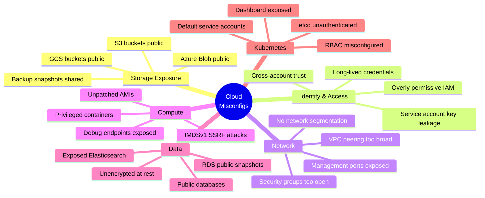
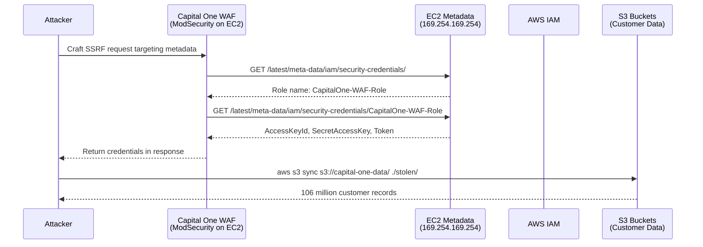
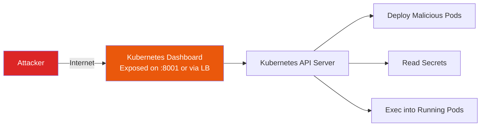
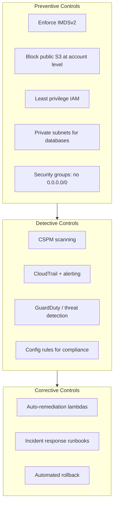

# Cloud Misconfigurations

The vast majority of cloud security incidents are not caused by sophisticated zero-day exploits. They are caused by **misconfigurations** — default settings left unchanged, permissions granted too broadly, services exposed to the public internet, and metadata endpoints accessible from within applications. The Capital One breach ($80 million fine), multiple MongoDB ransom attacks, and countless S3 bucket exposures all trace back to configuration errors.

Cloud misconfigurations are the low-hanging fruit of modern security. Understanding them is essential for any engineer who deploys to AWS, GCP, or Azure.

**Related**: [OWASP A05: Security Misconfiguration](/security/owasp/a05-security-misconfiguration) | [Zero Trust](/security/zero-trust/) | [Container Escapes](/security/exploits/container-escapes)

---

## The Misconfiguration Landscape



---

## S3 Bucket Exposure

### The Capital One Breach (2019)

In July 2019, a former AWS employee exploited an SSRF vulnerability in Capital One's WAF to access the EC2 Instance Metadata Service, steal temporary IAM credentials, and use those credentials to download 106 million customer records from S3 buckets.



### Impact

| Metric | Value |
|--------|-------|
| Records stolen | 106 million (US and Canada) |
| Data included | Names, addresses, credit scores, SSNs, bank account numbers |
| Fine | $80 million (OCC), $190 million (class action settlement) |
| Root cause | SSRF + IMDSv1 + overly permissive IAM role on WAF |

### S3 Bucket Exposure Detection

```bash
# Check if a bucket is publicly accessible
aws s3api get-bucket-acl --bucket my-bucket
aws s3api get-bucket-policy --bucket my-bucket
aws s3api get-public-access-block --bucket my-bucket

# List all public buckets in your account
aws s3api list-buckets --query 'Buckets[].Name' --output text | \
  xargs -I {} sh -c \
  'aws s3api get-public-access-block --bucket {} 2>/dev/null || echo "NO BLOCK: {}"'
```

### S3 Security Configuration

```json
// Bucket policy: DENY all public access
{
  "Version": "2012-10-17",
  "Statement": [
    {
      "Sid": "DenyPublicAccess",
      "Effect": "Deny",
      "Principal": "*",
      "Action": "s3:*",
      "Resource": [
        "arn:aws:s3:::my-bucket",
        "arn:aws:s3:::my-bucket/*"
      ],
      "Condition": {
        "Bool": {
          "aws:SecureTransport": "false"
        }
      }
    }
  ]
}
```

```hcl
# Terraform: Account-level S3 public access block
resource "aws_s3_account_public_access_block" "block_all" {
  block_public_acls       = true    # [!code highlight]
  block_public_policy     = true    # [!code highlight]
  ignore_public_acls      = true    # [!code highlight]
  restrict_public_buckets = true    # [!code highlight]
}

# Terraform: Per-bucket encryption + versioning
resource "aws_s3_bucket_server_side_encryption_configuration" "encrypt" {
  bucket = aws_s3_bucket.data.id
  rule {
    apply_server_side_encryption_by_default {
      sse_algorithm = "aws:kms"
    }
  }
}
```

---

## SSRF to IMDS Credential Theft

The EC2 Instance Metadata Service (IMDS) is available at `169.254.169.254` from within any EC2 instance. IMDSv1 provides credentials via simple HTTP GET requests — if an attacker can make the application send a request to this IP (via SSRF), they can steal the instance's IAM role credentials.

### IMDSv1 Attack (The Capital One Vector)

```bash
# From inside an EC2 instance (or via SSRF):

# Step 1: Get the IAM role name
curl http://169.254.169.254/latest/meta-data/iam/security-credentials/  # [!code error]
# Output: MyAppRole

# Step 2: Get temporary credentials
curl http://169.254.169.254/latest/meta-data/iam/security-credentials/MyAppRole  # [!code error]
# Output:
# {
#   "AccessKeyId": "ASIA...",
#   "SecretAccessKey": "...",
#   "Token": "...",
#   "Expiration": "2026-03-20T12:00:00Z"
# }

# Step 3: Use credentials from anywhere
export AWS_ACCESS_KEY_ID=ASIA...
export AWS_SECRET_ACCESS_KEY=...
export AWS_SESSION_TOKEN=...
aws s3 ls  # Now has the instance's IAM permissions
```

### IMDSv2 Defense

IMDSv2 requires a two-step process with a PUT request to obtain a session token. SSRF vulnerabilities that only support GET requests cannot exploit IMDSv2.

```bash
# IMDSv2: Requires a session token (PUT request)
TOKEN=$(curl -X PUT "http://169.254.169.254/latest/api/token" \         # [!code highlight]
  -H "X-aws-ec2-metadata-token-ttl-seconds: 21600")                     # [!code highlight]

curl -H "X-aws-ec2-metadata-token: $TOKEN" \                            # [!code highlight]
  http://169.254.169.254/latest/meta-data/iam/security-credentials/MyRole
```

```hcl
# Terraform: Enforce IMDSv2 on all EC2 instances
resource "aws_instance" "app" {
  ami           = "ami-abc123"
  instance_type = "t3.medium"

  metadata_options {
    http_endpoint               = "enabled"
    http_tokens                 = "required"   # Forces IMDSv2  # [!code highlight]
    http_put_response_hop_limit = 1            # Prevents container SSRF
  }
}

# Organization-wide: SCP to deny IMDSv1
resource "aws_organizations_policy" "require_imdsv2" {
  name    = "require-imdsv2"
  content = jsonencode({
    Version = "2012-10-17"
    Statement = [{
      Sid       = "RequireIMDSv2"
      Effect    = "Deny"
      Action    = "ec2:RunInstances"
      Resource  = "arn:aws:ec2:*:*:instance/*"
      Condition = {
        StringNotEquals = {
          "ec2:MetadataHttpTokens" = "required"
        }
      }
    }]
  })
}
```

::: danger IMDSv1 Is Still the Default
As of 2026, IMDSv1 is still enabled by default on EC2 instances unless explicitly disabled. Every new instance should be launched with `http_tokens = "required"` and your organization should enforce this via Service Control Policies (SCPs). There is no legitimate reason to use IMDSv1 in new deployments.
:::

---

## Overly Permissive IAM

### The Problem

```json
// DON'T: Overly permissive IAM policy
{
  "Version": "2012-10-17",
  "Statement": [{
    "Effect": "Allow",
    "Action": "*",          // [!code error]
    "Resource": "*"         // [!code error]
  }]
}
// This gives the entity full access to EVERYTHING in the AWS account
// Including IAM itself — they can create new admin users
```

### IAM Least Privilege

```json
// DO: Specific permissions for specific resources
{
  "Version": "2012-10-17",
  "Statement": [
    {
      "Sid": "ReadOwnBucket",
      "Effect": "Allow",
      "Action": [
        "s3:GetObject",                   // [!code highlight]
        "s3:ListBucket"                   // [!code highlight]
      ],
      "Resource": [
        "arn:aws:s3:::my-app-data",       // [!code highlight]
        "arn:aws:s3:::my-app-data/*"      // [!code highlight]
      ]
    },
    {
      "Sid": "WriteToQueue",
      "Effect": "Allow",
      "Action": "sqs:SendMessage",        // [!code highlight]
      "Resource": "arn:aws:sqs:us-east-1:123456789012:my-queue"
    }
  ]
}
```

### IAM Access Analyzer

```bash
# Find unused permissions (IAM Access Analyzer)
aws accessanalyzer list-findings \
  --analyzer-arn arn:aws:access-analyzer:us-east-1:123456789012:analyzer/my-analyzer

# Generate policy based on actual usage (last 90 days)
aws accessanalyzer generate-policy \
  --principal-arn arn:aws:iam::123456789012:role/MyAppRole \
  --cloud-trail-details '{
    "TrailArn": "arn:aws:cloudtrail:us-east-1:123456789012:trail/my-trail",
    "StartTime": "2026-01-01T00:00:00Z",
    "EndTime": "2026-03-20T00:00:00Z"
  }'
```

---

## Publicly Exposed Databases

### The Pattern

Databases left accessible from the internet without authentication have caused massive data breaches:

| Incident | Year | Database | Records Exposed |
|----------|------|----------|-----------------|
| Exactis | 2018 | Elasticsearch | 340 million |
| Verifications.io | 2019 | MongoDB | 763 million |
| Microsoft | 2019 | Elasticsearch | 250 million |
| BlueKai (Oracle) | 2020 | Elasticsearch | Billions of tracking records |
| Multiple MongoDB ransoms | 2017+ | MongoDB | 100,000+ databases wiped |

### Detection and Prevention

```bash
# Check for publicly accessible databases

# MongoDB (default port 27017)
nmap -p 27017 --open -sV your-ip-range

# Elasticsearch (default port 9200)
curl http://your-elasticsearch:9200/_cat/indices    # [!code error]
# If this works from outside your network, it is exposed

# Redis (default port 6379)
redis-cli -h your-redis-host ping                   # [!code error]
# If you get "PONG" from outside, it is exposed
```

```hcl
# Terraform: Security group that restricts database access
resource "aws_security_group" "database" {
  name_prefix = "database-"
  vpc_id      = aws_vpc.main.id

  # Only allow access from application security group
  ingress {
    from_port       = 5432
    to_port         = 5432
    protocol        = "tcp"
    security_groups = [aws_security_group.application.id]  # [!code highlight]
    description     = "PostgreSQL from app tier only"
  }

  # NO ingress from 0.0.0.0/0                              # [!code highlight]

  egress {
    from_port   = 0
    to_port     = 0
    protocol    = "-1"
    cidr_blocks = ["0.0.0.0/0"]
  }
}
```

::: tip Database Security Checklist
1. **Never expose database ports to the internet** — use security groups/firewalls to restrict to application tier only
2. **Always require authentication** — MongoDB and Redis ship without authentication by default
3. **Encrypt at rest** — enable encryption for RDS, DocumentDB, ElastiCache
4. **Encrypt in transit** — require TLS connections
5. **Use private subnets** — databases should not have public IP addresses
6. **Enable audit logging** — CloudTrail, RDS audit logs, MongoDB profiler
:::

---

## Kubernetes Dashboard Exposure

The Kubernetes dashboard, when exposed to the internet without authentication, gives an attacker full cluster access. This was a common misconfiguration in early Kubernetes deployments.



### Tesla Cryptojacking Incident (2018)

Tesla's Kubernetes dashboard was exposed without authentication. Attackers used it to deploy cryptocurrency mining pods that consumed cluster resources. The dashboard also exposed AWS credentials stored as Kubernetes secrets.

### Kubernetes Security Hardening

```yaml
# Restrict dashboard access to authorized users only
apiVersion: rbac.authorization.k8s.io/v1
kind: ClusterRoleBinding
metadata:
  name: dashboard-admin
subjects:
  - kind: ServiceAccount
    name: dashboard-admin
    namespace: kubernetes-dashboard
roleRef:
  kind: ClusterRole
  name: cluster-admin
  apiGroup: rbac.authorization.k8s.io
---
# Use NetworkPolicy to restrict dashboard access
apiVersion: networking.k8s.io/v1
kind: NetworkPolicy
metadata:
  name: dashboard-access
  namespace: kubernetes-dashboard
spec:
  podSelector:
    matchLabels:
      app: kubernetes-dashboard
  ingress:
    - from:
        - namespaceSelector:
            matchLabels:
              name: admin-namespace        # [!code highlight]
      ports:
        - port: 8443
  policyTypes:
    - Ingress
```

---

## Cloud Security Posture Management (CSPM)

CSPM tools continuously scan your cloud environment for misconfigurations against security benchmarks (CIS Benchmarks, AWS Well-Architected Framework).

### Tools Comparison

| Tool | Type | AWS | GCP | Azure | IaC Scanning | Free |
|------|------|-----|-----|-------|-------------|------|
| **AWS Security Hub** | Native | Yes | No | No | No | Partial |
| **Google SCC** | Native | No | Yes | No | No | Partial |
| **Azure Defender** | Native | No | No | Yes | No | Partial |
| **Prowler** | Open source | Yes | Yes | Yes | No | Yes |
| **ScoutSuite** | Open source | Yes | Yes | Yes | No | Yes |
| **Checkov** | Open source | Yes | Yes | Yes | Yes | Yes |
| **tfsec** | Open source | Yes | Yes | Yes | Yes (Terraform) | Yes |
| **Wiz** | Commercial | Yes | Yes | Yes | Yes | No |
| **Prisma Cloud** | Commercial | Yes | Yes | Yes | Yes | No |

### Automated Scanning

```bash
# Prowler — comprehensive AWS security assessment
# Runs 300+ checks against CIS, NIST, PCI-DSS, HIPAA

# Install
pip install prowler

# Run all checks
prowler aws

# Run specific check category
prowler aws --category internet-exposed

# Check for public S3 buckets
prowler aws --check s3_bucket_public_access

# Generate compliance report
prowler aws --compliance cis_2.0_aws --output-formats html json
```

```bash
# Checkov — IaC scanning (catches misconfigs BEFORE deployment)
pip install checkov

# Scan Terraform
checkov -d /path/to/terraform/

# Scan Kubernetes manifests
checkov -d /path/to/k8s-manifests/

# Scan Dockerfiles
checkov --framework dockerfile -d /path/to/dockerfiles/

# Example output:
# FAILED: CKV_AWS_18: "Ensure the S3 bucket has access logging enabled"
# FAILED: CKV_AWS_19: "Ensure the S3 bucket has server-side encryption"
# FAILED: CKV_AWS_145: "Ensure that S3 buckets are encrypted with KMS"
```

---

## Defense Checklist



| Control | Priority | Implementation |
|---------|----------|----------------|
| Block public S3 access (account-level) | Critical | `aws_s3_account_public_access_block` |
| Enforce IMDSv2 | Critical | SCP + launch template default |
| No `*:*` IAM policies | Critical | IAM Access Analyzer + SCPs |
| Databases in private subnets | Critical | VPC architecture |
| Enable CloudTrail in all regions | Critical | Organization trail |
| Run CSPM scanning | High | Prowler, Checkov in CI |
| Enable GuardDuty | High | Organization-wide |
| Scan IaC before deployment | High | Checkov, tfsec in CI pipeline |
| Encrypt everything at rest | High | AWS Config rules |
| Rotate credentials < 90 days | Medium | IAM credential report |
| Enable VPC Flow Logs | Medium | For forensics and anomaly detection |

---

## Key Takeaways

| Lesson | Implication |
|--------|------------|
| Defaults are not secure | Cloud services prioritize ease of use, not security — always review defaults |
| SSRF + IMDS = credential theft | Any SSRF vulnerability in a cloud app can lead to full account compromise |
| IAM is the new perimeter | Overly permissive IAM roles are the cloud equivalent of open firewalls |
| Public databases are epidemic | MongoDB, Redis, and Elasticsearch ship without authentication by default |
| Prevention > detection | Blocking public S3 at the account level is more reliable than monitoring for it |
| IaC scanning catches misconfigs pre-deployment | Shift security left by scanning Terraform/K8s before it reaches production |

---

## Further Reading

- [OWASP A05: Security Misconfiguration](/security/owasp/a05-security-misconfiguration) — the misconfiguration category in OWASP
- [Zero Trust](/security/zero-trust/) — the architectural framework that addresses cloud trust assumptions
- [Container Escapes](/security/exploits/container-escapes) — Kubernetes security hardening
- [OWASP A10: SSRF](/security/owasp/a10-ssrf) — Server-Side Request Forgery deep dive
- [Exploits Overview](/security/exploits/) — taxonomy and context for all exploit case studies
