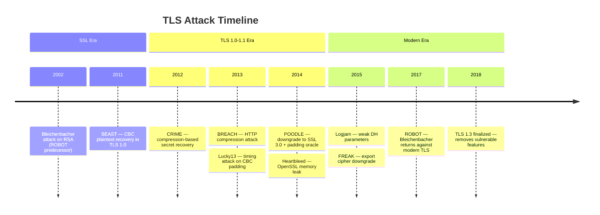
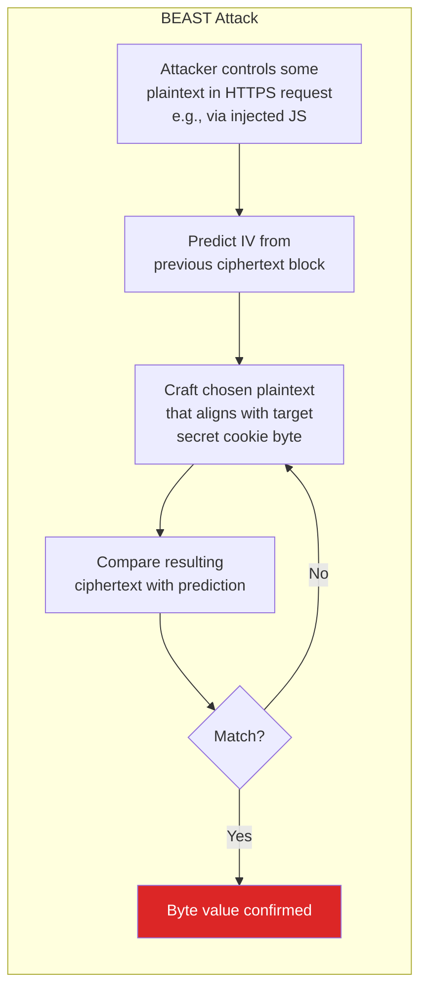
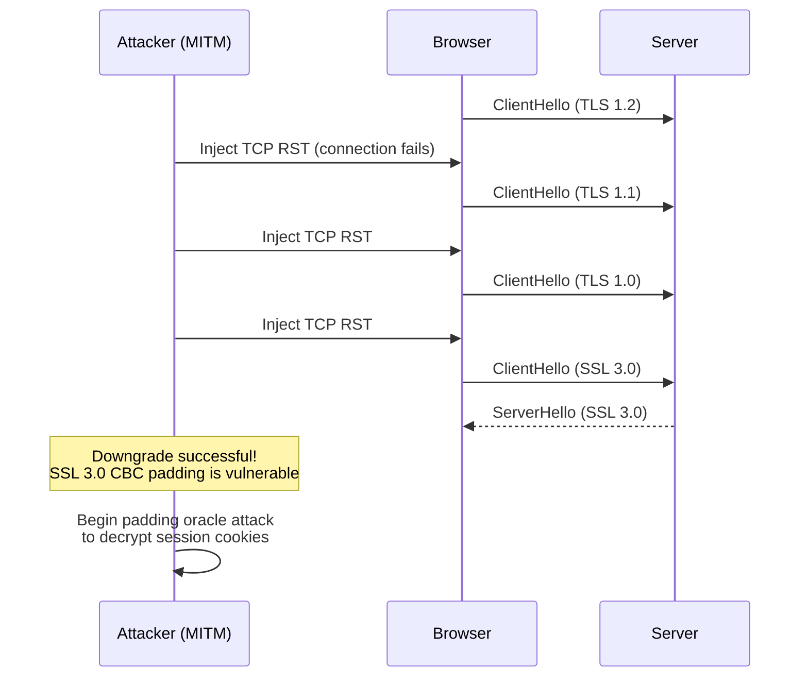
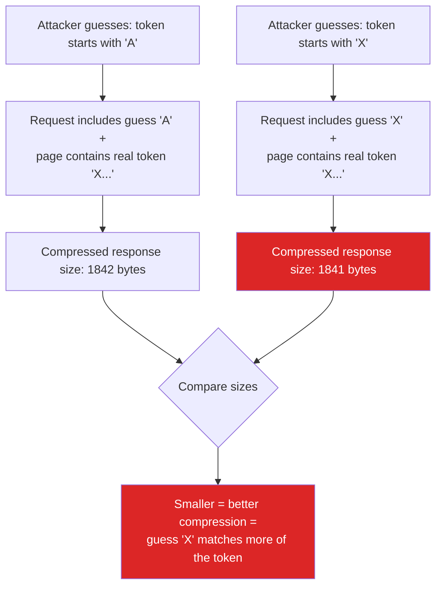
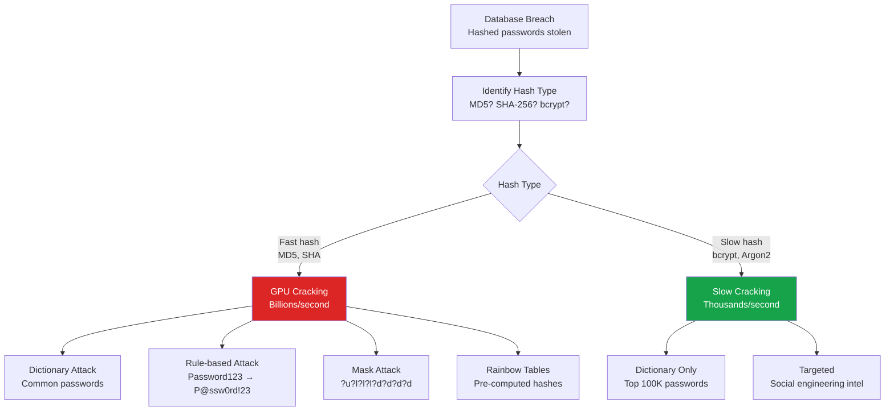
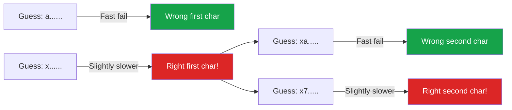
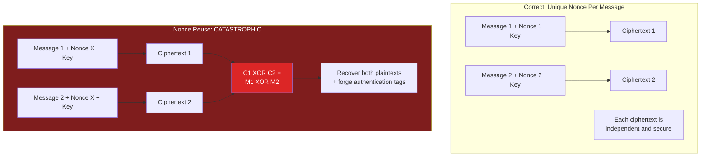

# Cryptographic Attacks

Cryptography is the foundation of internet security — TLS protects data in transit, hashing protects passwords at rest, and digital signatures prove authenticity. But cryptographic protocols and their implementations have a long history of vulnerabilities. Each attack in this page drove real changes to how we use cryptography, and understanding them explains why modern best practices exist.

This is not an academic overview. Every attack here has been exploited in the real world, and the defenses are the direct result of those exploits.

**Related**: [Encryption](/security/encryption/) | [OWASP A02: Cryptographic Failures](/security/owasp/a02-cryptographic-failures) | [Heartbleed](/security/exploits/heartbleed)

---

## TLS Protocol Attacks

Each of these attacks targeted real weaknesses in SSL/TLS, driving the evolution from SSL 3.0 through TLS 1.3.



### BEAST (Browser Exploit Against SSL/TLS) — 2011

BEAST exploits a weakness in CBC mode encryption in TLS 1.0. The initialization vector (IV) for each record is predictable (it is the last ciphertext block of the previous record), allowing chosen-plaintext attacks to decrypt data one byte at a time.



**Defense**: TLS 1.1+ uses explicit IVs (random per record). TLS 1.0 implementations added "1/n-1 record splitting" as a workaround. Modern solution: use TLS 1.2+ with AEAD ciphers (AES-GCM), which are immune to this class of attack.

### POODLE (Padding Oracle On Downgraded Legacy Encryption) — 2014

POODLE forces a protocol downgrade to SSL 3.0 (which has a deterministic padding scheme in CBC mode), then uses a padding oracle to decrypt data byte by byte.



**Defense**: Disable SSL 3.0 entirely. Use TLS_FALLBACK_SCSV to prevent protocol downgrade attacks. Modern solution: only support TLS 1.2 and TLS 1.3.

### CRIME and BREACH — Compression Side Channels

**CRIME** (2012) exploits TLS-level compression. **BREACH** (2013) exploits HTTP-level compression. Both use the same principle: if a secret (like a CSRF token) and attacker-controlled input are compressed together, the attacker can deduce the secret by observing the compressed size.



**Defense against CRIME**: Disable TLS-level compression (now default in all implementations). **Defense against BREACH**: More complex — randomize secrets in responses, use per-request CSRF tokens, separate secrets from user-controlled content, or disable HTTP compression for sensitive responses.

### ROBOT (Return Of Bleichenbacher's Oracle Threat) — 2017

ROBOT revived a 1998 attack against RSA key exchange. Despite 19 years of awareness, many TLS implementations still had subtle padding oracle vulnerabilities in their RSA PKCS#1 v1.5 decryption, allowing attackers to decrypt or sign messages using the server's RSA key.

**Defense**: Use ECDHE key exchange (which provides forward secrecy and is immune to this attack). TLS 1.3 removed RSA key exchange entirely.

---

## Modern TLS Configuration

```nginx
# Nginx: Modern TLS configuration (as of 2026)
server {
    listen 443 ssl http2;

    # Only TLS 1.2 and 1.3
    ssl_protocols TLSv1.2 TLSv1.3;                      # [!code highlight]

    # AEAD ciphers only (no CBC)
    ssl_ciphers ECDHE-ECDSA-AES128-GCM-SHA256:ECDHE-RSA-AES128-GCM-SHA256:ECDHE-ECDSA-AES256-GCM-SHA384:ECDHE-RSA-AES256-GCM-SHA384:ECDHE-ECDSA-CHACHA20-POLY1305:ECDHE-RSA-CHACHA20-POLY1305;
    ssl_prefer_server_ciphers off;                        # Let client choose in TLS 1.3

    # ECDHE for forward secrecy
    ssl_ecdh_curve X25519:secp384r1;                     # [!code highlight]

    # OCSP stapling
    ssl_stapling on;
    ssl_stapling_verify on;

    # HSTS — force HTTPS
    add_header Strict-Transport-Security "max-age=63072000; includeSubDomains; preload";
}
```

::: tip Why TLS 1.3 Removes Most of These Attacks
TLS 1.3 made sweeping changes that eliminated entire classes of vulnerabilities:
- **Removed RSA key exchange** (prevents ROBOT, Bleichenbacher)
- **Removed CBC mode** (prevents BEAST, POODLE, Lucky13)
- **Removed compression** (prevents CRIME)
- **Removed renegotiation** (prevents renegotiation attacks)
- **Only AEAD ciphers** (AES-GCM, ChaCha20-Poly1305)
- **1-RTT handshake** (faster, simpler, fewer state machine bugs)
:::

---

## Password Cracking

### How Passwords Get Cracked



### Hashing Speed Comparison

| Algorithm | GPU Speed (RTX 4090) | Time to Crack 8-char Password | Salted? |
|-----------|---------------------|-------------------------------|---------|
| **MD5** | ~160 billion/sec | Seconds | Often no |
| **SHA-1** | ~40 billion/sec | Minutes | Often no |
| **SHA-256** | ~20 billion/sec | Minutes | Varies |
| **bcrypt (cost 12)** | ~70,000/sec | Centuries | Yes |
| **scrypt** | ~30,000/sec | Centuries | Yes |
| **Argon2id** | ~10,000/sec | Centuries | Yes |

::: danger MD5 and SHA Are Not Password Hashing Functions
MD5 and SHA-family hashes are designed to be **fast**. That is exactly what you do NOT want for password hashing. A modern GPU can compute 160 billion MD5 hashes per second, making brute force trivial. Use purpose-built password hashing functions that are intentionally slow: bcrypt, scrypt, or Argon2id.
:::

### Correct Password Hashing

```javascript
// Node.js: Argon2id (recommended)
import { hash, verify } from 'argon2';

// Hash with Argon2id
const passwordHash = await hash(password, {           // [!code highlight]
  type: 2,           // argon2id                       // [!code highlight]
  memoryCost: 65536, // 64 MB                          // [!code highlight]
  timeCost: 3,       // 3 iterations                   // [!code highlight]
  parallelism: 4,    // 4 threads                      // [!code highlight]
});

// Verify
const isValid = await verify(passwordHash, password);  // [!code highlight]
```

```python
# Python: bcrypt
import bcrypt

# Hash
password_hash = bcrypt.hashpw(
    password.encode('utf-8'),
    bcrypt.gensalt(rounds=12)         # Cost factor 12  # [!code highlight]
)

# Verify
is_valid = bcrypt.checkpw(password.encode('utf-8'), password_hash)
```

### bcrypt vs scrypt vs Argon2

| Feature | bcrypt | scrypt | Argon2id |
|---------|--------|--------|----------|
| **Year** | 1999 | 2009 | 2015 (winner of PHC) |
| **Memory-hard** | No (fixed 4KB) | Yes | Yes |
| **GPU-resistant** | Moderate | High | Highest |
| **ASIC-resistant** | Low | Moderate | High |
| **Configurable** | Cost factor only | CPU + memory + parallelism | Time + memory + parallelism |
| **Recommendation** | Good (widely supported) | Good (memory-hard) | Best (use this for new projects) |

---

## Timing Attacks

Timing attacks exploit the fact that code execution takes different amounts of time depending on the input. For cryptographic operations, even nanosecond differences can leak secret information.

### Vulnerable: String Comparison

```javascript
// VULNERABLE: Standard string comparison for HMAC verification
function verifyHmac(expected, received) {
  return expected === received;       // [!code error]
}
// JavaScript's === compares character by character and returns false
// at the FIRST mismatch. This means:
//   verifyHmac("abc123", "xyz789") — fails fast (0 chars match)
//   verifyHmac("abc123", "abc789") — fails slower (3 chars match)
//   verifyHmac("abc123", "abc123") — takes longest (all match)
// Attacker can determine the correct HMAC one character at a time
```



### Defense: Constant-Time Comparison

```javascript
// SAFE: Constant-time comparison using crypto.timingSafeEqual
import { timingSafeEqual, createHmac } from 'crypto';

function verifyHmac(expected, received) {
  const expectedBuf = Buffer.from(expected, 'hex');
  const receivedBuf = Buffer.from(received, 'hex');

  // Reject if lengths differ (length itself is not secret)
  if (expectedBuf.length !== receivedBuf.length) {
    return false;
  }

  // timingSafeEqual always compares ALL bytes              // [!code highlight]
  // regardless of where the mismatch is                    // [!code highlight]
  return timingSafeEqual(expectedBuf, receivedBuf);         // [!code highlight]
}
```

```python
# Python: use hmac.compare_digest
import hmac

# SAFE: constant-time comparison
is_valid = hmac.compare_digest(expected_hmac, received_hmac)  # [!code highlight]

# DO NOT use == for HMAC/token comparison
is_valid = expected_hmac == received_hmac   # [!code error]
```

::: warning Where Timing Attacks Apply
- HMAC verification (API signatures, webhooks)
- Password comparison (always use bcrypt/Argon2 verify functions)
- Token validation (API keys, session tokens)
- Cryptographic padding validation (the Padding Oracle family of attacks)
- Any conditional logic that depends on secret values
:::

---

## Nonce Reuse in AES-GCM

AES-GCM is the most widely used authenticated encryption mode (used in TLS 1.2 and 1.3). It is fast, parallelizable, and provides both confidentiality and integrity. But it has a critical requirement: the **nonce must never be reused** with the same key.

### What Happens When You Reuse a Nonce



If the same nonce is used twice with the same key:
1. **XOR of ciphertexts = XOR of plaintexts** (keystream cancels out)
2. If one plaintext is known (or guessable), the other is immediately recoverable
3. The authentication tag can be **forged** — an attacker can create valid ciphertexts

```javascript
// WRONG: Sequential counter as nonce (vulnerable to reset after crash)
let counter = 0;
function encrypt(key, plaintext) {
  const nonce = Buffer.alloc(12);
  nonce.writeUInt32BE(counter++);        // [!code error]
  // If the process crashes and restarts, counter resets to 0
  // Same nonces are reused → catastrophic failure
  return aesGcmEncrypt(key, nonce, plaintext);
}

// CORRECT: Random nonce (safe for up to ~2^32 messages per key)
import { randomBytes, createCipheriv } from 'crypto';

function encrypt(key, plaintext) {
  const nonce = randomBytes(12);         // [!code highlight]
  const cipher = createCipheriv('aes-256-gcm', key, nonce);
  const ciphertext = Buffer.concat([
    cipher.update(plaintext),
    cipher.final()
  ]);
  const tag = cipher.getAuthTag();
  // Return nonce + tag + ciphertext (nonce is not secret)
  return Buffer.concat([nonce, tag, ciphertext]);
}
```

::: tip AES-GCM-SIV for Nonce Reuse Resistance
If nonce reuse is a realistic risk (e.g., multi-server systems where coordinating nonces is hard), use **AES-GCM-SIV** (RFC 8452). It provides "nonce misuse resistance" — nonce reuse only leaks whether the same plaintext was encrypted twice, but does not compromise other messages.
:::

---

## Certificate Transparency

Certificate Transparency (CT) is a system for monitoring and auditing TLS certificates. CT logs are append-only, publicly auditable logs of all issued certificates. They were created after incidents where Certificate Authorities (CAs) issued unauthorized certificates.

### Why CT Matters

| Incident | Year | What Happened |
|----------|------|---------------|
| **DigiNotar** | 2011 | CA compromised, fraudulent `*.google.com` cert issued |
| **Symantec** | 2015-17 | Unauthorized test certificates for Google domains |
| **Let's Encrypt + phishing** | Ongoing | Legitimate certs issued to phishing domains |
| **Kazakhstan MITM** | 2019 | Government-mandated root CA for TLS interception |

### Monitoring CT Logs

```bash
# Search CT logs for certificates issued for your domain
# Using crt.sh (Certificate Transparency search engine)
curl "https://crt.sh/?q=%25.example.com&output=json" | \
  jq '.[] | {issuer_name, common_name, not_before, not_after}'

# Monitor for new certificates (detect unauthorized issuance)
# Using certspotter
certspotter --domain example.com --watch

# Using Facebook's CT monitoring tool
# https://developers.facebook.com/tools/ct/
```

```javascript
// Automated CT log monitoring service
import fetch from 'node-fetch';

async function checkNewCerts(domain) {
  const response = await fetch(
    `https://crt.sh/?q=%25.${domain}&output=json`
  );
  const certs = await response.json();

  // Filter for recently issued certificates
  const recent = certs.filter(cert => {
    const issued = new Date(cert.not_before);
    const dayAgo = new Date(Date.now() - 86400000);
    return issued > dayAgo;
  });

  if (recent.length > 0) {
    // Alert: new certificate issued for your domain
    // Verify it was authorized
    await sendAlert(`${recent.length} new certs for ${domain}`,
      recent.map(c => `${c.common_name} by ${c.issuer_name}`)
    );
  }
}
```

::: tip CT Log Monitoring Is Free Security
- Monitor CT logs for your domains to detect unauthorized certificate issuance
- Use CAA DNS records to restrict which CAs can issue certificates for your domains
- Require Certificate Transparency for all certificates (Chrome and Safari already do)
- Set up automated alerts for new certificates — if you did not request it, investigate immediately
:::

---

## Defense Summary

| Attack Class | Defense | Implementation |
|-------------|---------|----------------|
| TLS protocol attacks | Use TLS 1.2+ with AEAD ciphers only | `ssl_protocols TLSv1.2 TLSv1.3` |
| Weak password hashing | Use Argon2id, bcrypt, or scrypt | Never MD5/SHA for passwords |
| Timing attacks | Constant-time comparison | `crypto.timingSafeEqual()`, `hmac.compare_digest()` |
| Nonce reuse | Random nonces or AES-GCM-SIV | `randomBytes(12)` for each encryption |
| Unauthorized certificates | CAA records + CT log monitoring | `crt.sh` monitoring, CAA DNS records |
| Protocol downgrade | HSTS + TLS_FALLBACK_SCSV | `Strict-Transport-Security` header |

---

## Key Takeaways

| Lesson | Implication |
|--------|------------|
| Every TLS attack drove a protocol improvement | TLS 1.3 exists because of BEAST, POODLE, CRIME, ROBOT |
| Fast hashes are not password hashes | MD5/SHA at 160B/sec on GPU vs Argon2 at 10K/sec — 16 million times difference |
| Nanoseconds matter in cryptography | Timing side channels leak secrets through execution time differences |
| Nonce reuse is catastrophic for AES-GCM | A single reuse can compromise all messages encrypted with that key |
| Certificate Transparency is free monitoring | CT logs let you detect unauthorized certificate issuance for your domains |
| Use the highest-level cryptographic APIs | Low-level crypto is easy to misuse — use well-tested libraries and their recommended defaults |

---

## Further Reading

- [Encryption](/security/encryption/) — symmetric vs asymmetric, TLS 1.3 handshake, key management
- [OWASP A02: Cryptographic Failures](/security/owasp/a02-cryptographic-failures) — common cryptographic mistakes in applications
- [Heartbleed](/security/exploits/heartbleed) — the most famous OpenSSL vulnerability
- [Spectre & Meltdown](/security/exploits/spectre-meltdown) — timing and side-channel attacks at the hardware level
- [Exploits Overview](/security/exploits/) — taxonomy and context for all exploit case studies
