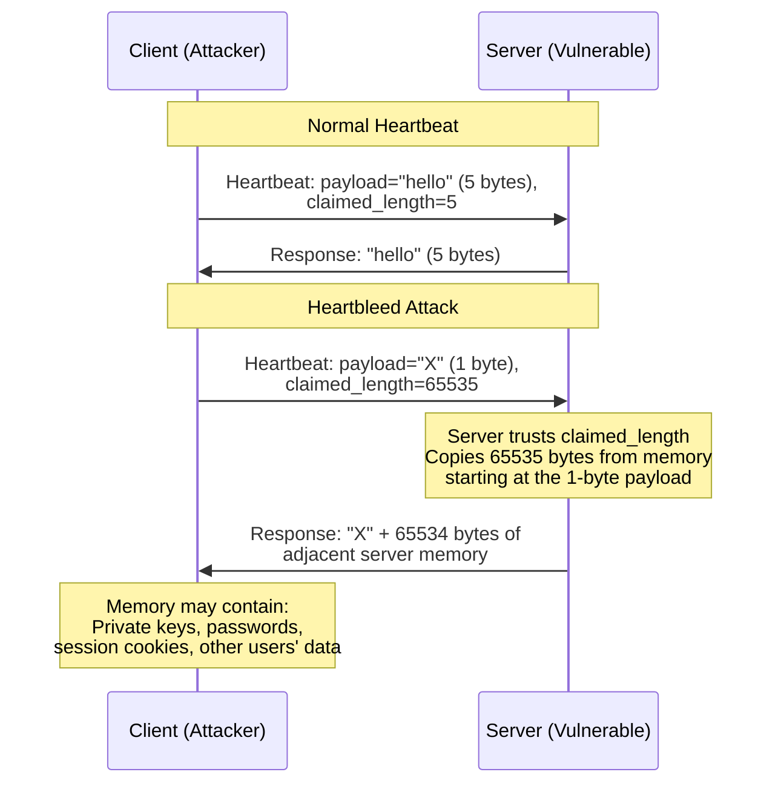
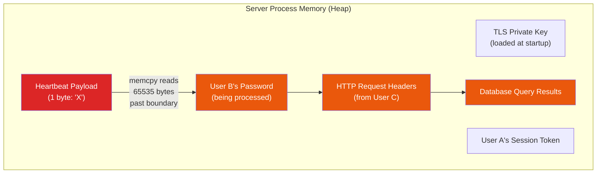
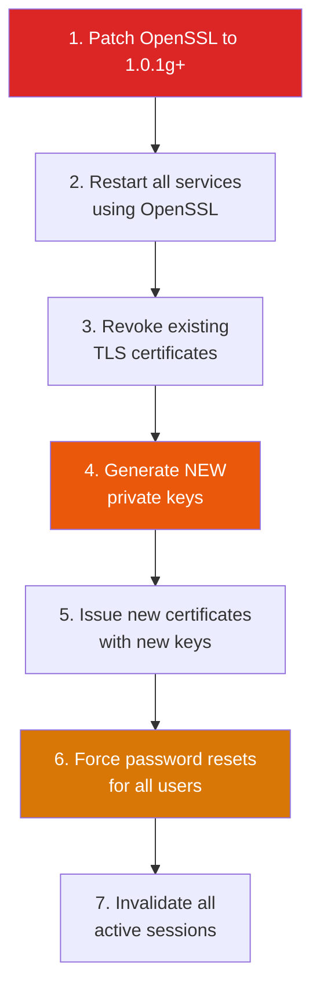
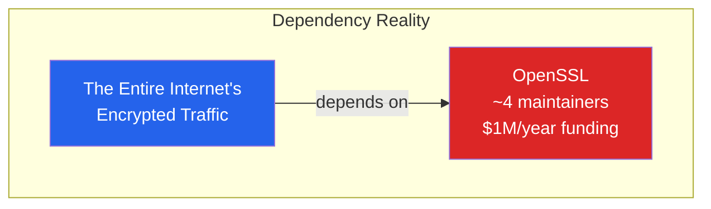

# Heartbleed (CVE-2014-0160)

On April 7, 2014, a vulnerability was disclosed in OpenSSL's implementation of the TLS heartbeat extension that allowed attackers to read up to 64KB of server memory per request. That memory could contain private keys, user passwords, session tokens, and any other data the server was processing. The vulnerability affected an estimated **17% of all SSL-enabled web servers** (approximately 500,000 servers) and had been exploitable for **over two years** before discovery.

Heartbleed is the textbook example of a **buffer over-read vulnerability** — the attacker does not inject code, does not crash the server, and leaves no trace in standard logs. They simply ask the server for more data than it should return, and the server obliges.

**Related**: [Encryption](/security/encryption/) | [OWASP A02: Cryptographic Failures](/security/owasp/a02-cryptographic-failures) | [Security Overview](/security/)

---

## The Vulnerability in Plain Language

The TLS heartbeat extension is a keep-alive mechanism: one side sends a small payload and says "echo this back to me." The flaw is that OpenSSL trusted the sender's claimed payload length without checking it against the actual payload size.



---

## The Code

The vulnerability was in the `dtls1_process_heartbeat()` function in OpenSSL. Here is a simplified version showing the exact flaw:

### Vulnerable Code

```c
// OpenSSL 1.0.1 through 1.0.1f — VULNERABLE
// File: ssl/d1_both.c (simplified)

int dtls1_process_heartbeat(SSL *s)
{
    unsigned char *p = &s->s3->rrec.data[0];
    unsigned short payload_length;
    unsigned char *pl;

    // Read the heartbeat message type (1 byte)
    unsigned int hbtype = *p++;

    // Read the CLAIMED payload length from the request  // [!code error]
    // This is the attacker-controlled value              // [!code error]
    n2s(p, payload_length);                               // [!code error]
    pl = p;  // pl points to actual payload data

    // BUG: No check that payload_length <= actual data received  // [!code error]
    // The server TRUSTS the claimed length                        // [!code error]

    // Allocate response buffer based on claimed length
    unsigned char *buffer = OPENSSL_malloc(1 + 2 + payload_length + 16);
    unsigned char *bp = buffer;

    // Write response type
    *bp++ = TLS1_HB_RESPONSE;
    // Write claimed length
    s2n(payload_length, bp);

    // Copy payload_length bytes starting from pl           // [!code error]
    // If payload_length > actual payload, this reads       // [!code error]
    // BEYOND the payload into adjacent server memory       // [!code error]
    memcpy(bp, pl, payload_length);                         // [!code error]
    bp += payload_length;

    // Send the response (including leaked memory)
    DTLS1_send(s, buffer, bp - buffer);

    OPENSSL_free(buffer);
    return 0;
}
```

### Fixed Code

```c
// OpenSSL 1.0.1g — FIXED
// The fix is a bounds check: verify claimed length against actual data

int dtls1_process_heartbeat(SSL *s)
{
    unsigned char *p = &s->s3->rrec.data[0];
    unsigned short payload_length;
    unsigned char *pl;

    // Ensure we have at least 3 bytes (1 type + 2 length)
    if (s->s3->rrec.length < 3)                    // [!code highlight]
        return 0;  // Silently discard              // [!code highlight]

    unsigned int hbtype = *p++;
    n2s(p, payload_length);
    pl = p;

    // THE FIX: Verify claimed length against actual received data  // [!code highlight]
    if (1 + 2 + payload_length + 16 > s->s3->rrec.length) {        // [!code highlight]
        return 0;  // Claimed length exceeds actual data — reject   // [!code highlight]
    }                                                                // [!code highlight]

    // Safe to proceed — payload_length is verified
    unsigned char *buffer = OPENSSL_malloc(1 + 2 + payload_length + 16);
    unsigned char *bp = buffer;

    *bp++ = TLS1_HB_RESPONSE;
    s2n(payload_length, bp);
    memcpy(bp, pl, payload_length);  // Now safe: length is verified
    bp += payload_length;

    DTLS1_send(s, buffer, bp - buffer);
    OPENSSL_free(buffer);
    return 0;
}
```

::: danger The Entire Fix Was Two Lines
The fix for what may be the most impactful vulnerability in internet history was a **bounds check** — verifying that the claimed length does not exceed the actual data. This is the kind of bug that memory-safe languages (Rust, Go, Java, Python) prevent by default because array accesses are bounds-checked at runtime.
:::

---

## What Leaked

Each Heartbleed request could leak up to **64KB of server memory**. Because the leaked data comes from the process heap, its contents vary, but researchers demonstrated extraction of:

| Data Type | Impact | Demonstrated |
|-----------|--------|-------------|
| **Server private keys** | Complete impersonation; decrypt all past traffic if not using PFS | Yes — extracted within hours of disclosure |
| **Session tokens / cookies** | Account takeover without credentials | Yes |
| **User passwords** | Direct credential theft (when passwords in memory during auth) | Yes |
| **Request data from other users** | Cross-user data leakage | Yes |
| **Encryption keys (symmetric)** | Decrypt ongoing sessions | Yes |

### Memory Layout Explanation



::: warning No Logs, No Traces
Heartbleed exploitation left **no entries in standard web server logs**. The heartbeat exchange happens at the TLS layer, below the HTTP layer. Servers had no way to know they had been exploited unless they were running specialized TLS-layer monitoring (which almost nobody was in 2014).
:::

---

## Scale of Impact

### By the Numbers

| Metric | Value |
|--------|-------|
| Affected OpenSSL versions | 1.0.1 through 1.0.1f |
| Duration of vulnerability | 2 years, 2 months (Dec 31, 2011 — Apr 7, 2014) |
| Percentage of SSL servers affected | ~17% (~500,000 servers) |
| Time to develop exploit after disclosure | < 24 hours |
| Estimated cost of remediation | $500M+ (certificate revocation and reissuance alone) |

### Affected Versions

```
OpenSSL 1.0.1  (Mar 14, 2012) — VULNERABLE
OpenSSL 1.0.1a (Apr 19, 2012) — VULNERABLE
OpenSSL 1.0.1b (Apr 26, 2012) — VULNERABLE
OpenSSL 1.0.1c (May 10, 2012) — VULNERABLE
OpenSSL 1.0.1d (Feb 5, 2013)  — VULNERABLE
OpenSSL 1.0.1e (Feb 11, 2013) — VULNERABLE
OpenSSL 1.0.1f (Jan 6, 2014)  — VULNERABLE
OpenSSL 1.0.1g (Apr 7, 2014)  — FIXED
OpenSSL 1.0.0  (all versions)  — NOT AFFECTED (no heartbeat)
OpenSSL 0.9.8  (all versions)  — NOT AFFECTED (no heartbeat)
```

---

## Detection and Remediation

### Detecting Vulnerable Systems

```bash
# Check OpenSSL version
openssl version
# Vulnerable if 1.0.1 through 1.0.1f

# Test a remote server (using nmap)
nmap -p 443 --script ssl-heartbleed target.com

# Test with a dedicated tool
# https://github.com/FiloSottile/Heartbleed
heartbleed-test target.com:443

# Check if heartbeat extension is enabled
openssl s_client -connect target.com:443 -tlsextdebug 2>&1 | grep heartbeat
```

### Remediation Steps

The fix required more than just patching OpenSSL:



::: tip Why Just Patching Was Not Enough
If an attacker exploited Heartbleed before you patched, they may have extracted your server's private key. Patching stops future exploitation but does not undo the damage. You must assume the private key is compromised and generate new ones.

This is also why **Perfect Forward Secrecy (PFS)** matters: with PFS cipher suites (ECDHE), each session uses a different ephemeral key. Even if the server's long-term private key is compromised, past recorded sessions cannot be decrypted.
:::

---

## The Broader Lessons

### Memory Safety

Heartbleed is an argument for memory-safe languages. In languages with bounds checking, the equivalent code would have crashed (or thrown an exception) instead of leaking data:

::: code-group

```rust
// Rust equivalent — would PANIC instead of leaking memory
fn process_heartbeat(data: &[u8]) -> Vec<u8> {
    let hb_type = data[0];
    let payload_length = u16::from_be_bytes([data[1], data[2]]) as usize;
    let payload = &data[3..];

    // This would panic with "index out of bounds" if payload_length > payload.len()
    let response_payload = &payload[..payload_length];  // [!code highlight]

    let mut response = Vec::new();
    response.push(TLS1_HB_RESPONSE);
    response.extend_from_slice(&(payload_length as u16).to_be_bytes());
    response.extend_from_slice(response_payload);
    response
}
```

```go
// Go equivalent — would panic instead of leaking memory
func processHeartbeat(data []byte) []byte {
    hbType := data[0]
    payloadLength := binary.BigEndian.Uint16(data[1:3])
    payload := data[3:]

    // Go slicing panics if payloadLength > len(payload)
    responsePayload := payload[:payloadLength]  // [!code highlight]

    response := []byte{TLS1_HB_RESPONSE}
    response = append(response, data[1:3]...)
    response = append(response, responsePayload...)
    return response
}
```

:::

### Critical Infrastructure Maintenance

At the time of Heartbleed, OpenSSL was maintained by **fewer than four people**, funded by less than $1 million per year, yet it protected the majority of internet traffic. This mismatch between criticality and resources is a systemic vulnerability.



The Linux Foundation launched the Core Infrastructure Initiative (CII) — later the Open Source Security Foundation (OpenSSF) — directly in response to Heartbleed, to fund critical open source security infrastructure.

---

## Defense Checklist

| Control | Purpose | Priority |
|---------|---------|----------|
| Use memory-safe languages for security-critical code | Prevent entire class of buffer overread/overflow | Strategic |
| Enable Perfect Forward Secrecy (ECDHE cipher suites) | Limit damage if private key is compromised | Critical |
| Automate certificate rotation | Reduce window of exposure from compromised keys | High |
| Monitor for TLS anomalies | Detect unusual heartbeat patterns | Medium |
| Maintain SBOM for cryptographic libraries | Know immediately when a crypto CVE drops | High |
| Test with fuzzing (AFL, libFuzzer) | Find bounds-check bugs before attackers do | Medium |
| Consider BoringSSL or LibreSSL | Smaller, more auditable TLS implementations | Medium |

---

## Key Takeaways

| Lesson | Implication |
|--------|------------|
| Trust but verify — even on declared lengths | Never trust sender-specified sizes without bounds checking |
| Memory-safe languages prevent this class of bug | Rust, Go, Java would have panicked instead of leaking |
| Cryptographic libraries need funding | Under-resourced critical infrastructure is a systemic risk |
| PFS limits blast radius | Even if keys leak, past sessions remain protected |
| Patching is necessary but not sufficient | Must also revoke certificates and rotate keys |
| Silent exploitation is the worst kind | Two years of potential exploitation with no log entries |

---

## Further Reading

- [Encryption](/security/encryption/) — TLS, cipher suites, and Perfect Forward Secrecy
- [OWASP A02: Cryptographic Failures](/security/owasp/a02-cryptographic-failures) — the OWASP category this falls under
- [Cryptographic Attacks](/security/exploits/crypto-attacks) — TLS protocol attacks (BEAST, POODLE, CRIME)
- [Spectre & Meltdown](/security/exploits/spectre-meltdown) — another case where hardware/low-level code leaks data through side channels
- [Exploits Overview](/security/exploits/) — taxonomy and context for all exploit case studies
