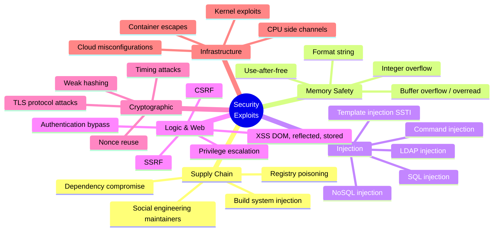
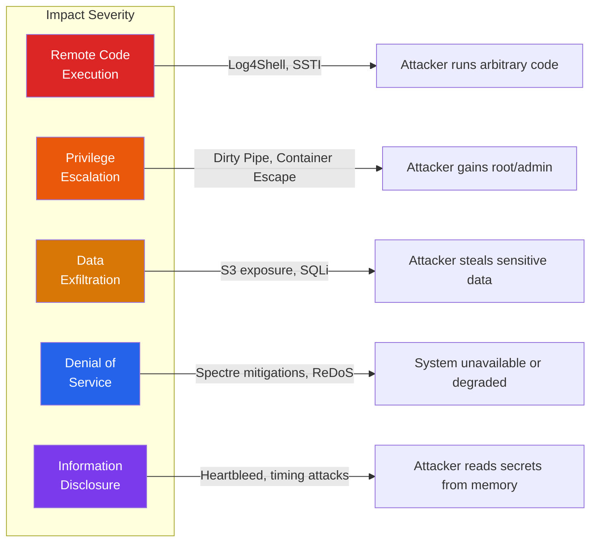
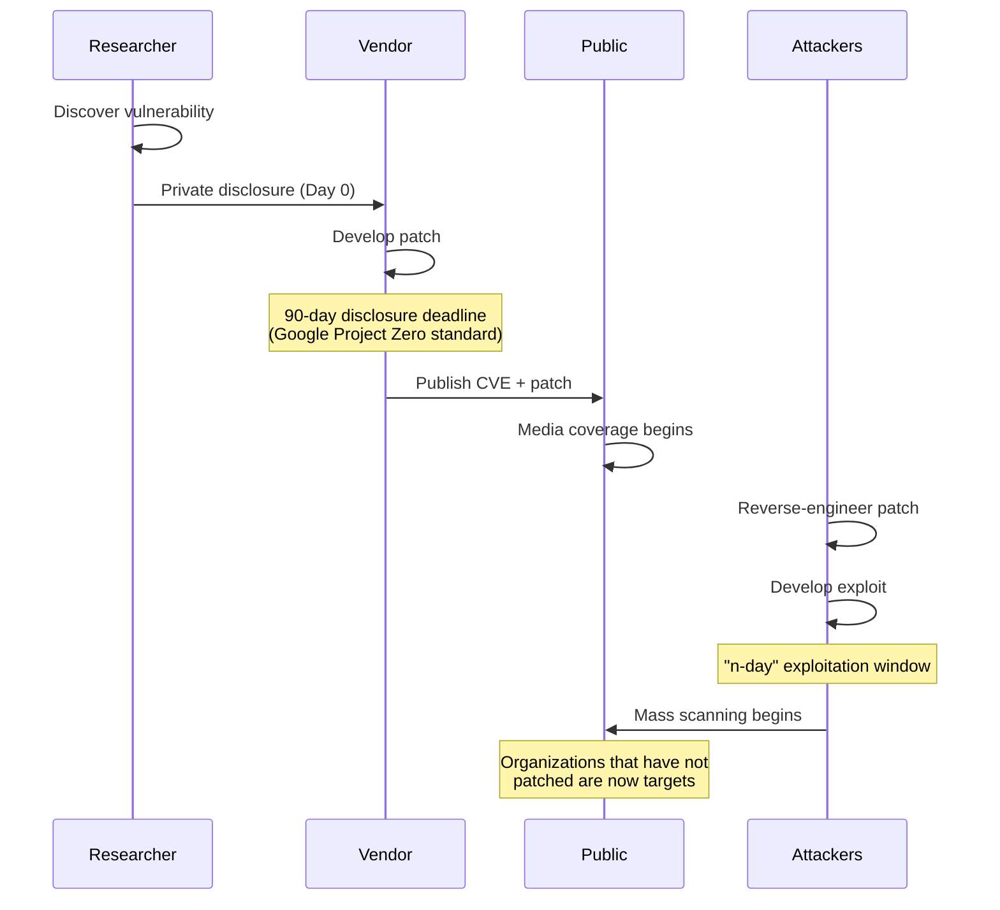

# Security Exploits & Vulnerabilities

You cannot build a wall if you do not know how walls get broken. The best defenders are engineers who understand offensive techniques deeply enough to anticipate how an attacker will approach their systems. This section is not about teaching you to hack — it is about teaching you to think like someone who would, so that your defenses are not theoretical but battle-tested.

Every page in this section follows the same structure: **how the attack works**, then **how to defend against it**. No exploit is presented without its corresponding mitigation.

**Related**: [Security Overview](/security/) | [OWASP Top 10](/security/owasp/) | [Supply Chain Security](/security/supply-chain/)

---

## Why Study Exploits?

::: tip The Defender's Paradox
An attacker needs to find **one** vulnerability. A defender needs to prevent **all** of them. The only way to close the gap is to understand how attackers think, what they look for, and how they chain small weaknesses into devastating breaches.
:::

1. **Threat modeling requires attack knowledge.** You cannot enumerate threats you have never heard of. Studying real exploits builds your threat vocabulary.
2. **Code review becomes sharper.** Once you have seen how a buffer overread leaks private keys (Heartbleed) or how string interpolation enables remote code execution (Log4Shell), you catch similar patterns in your own code.
3. **Architecture decisions improve.** Knowing that containers are not security boundaries by default changes how you design isolation. Understanding supply chain attacks changes how you manage dependencies.
4. **Incident response needs speed.** When a new CVE drops, teams that already understand the attack class can assess impact and deploy mitigations in hours instead of days.

---

## Attack Taxonomy

### By Attack Vector

| Category | What Gets Exploited | Example Incidents | Pages |
|----------|-------------------|-------------------|-------|
| **Supply Chain** | Dependencies, build systems, maintainer trust | XZ backdoor, SolarWinds, Log4Shell | [XZ Backdoor](/security/exploits/xz-backdoor-2024), [SolarWinds](/security/exploits/solarwinds), [Log4Shell](/security/exploits/log4shell) |
| **Memory Safety** | Missing bounds checks, pointer misuse | Heartbleed, Dirty Pipe, Dirty COW | [Heartbleed](/security/exploits/heartbleed), [Dirty Pipe](/security/exploits/dirty-pipe) |
| **Injection** | Untrusted data mixed with code | SQL injection, SSTI, command injection | [Advanced Injection](/security/exploits/injection-advanced) |
| **Web/Logic** | Browser trust model, CSP gaps, DOM manipulation | XSS, mXSS, CSP bypass | [Advanced XSS](/security/exploits/xss-advanced) |
| **Hardware** | CPU speculative execution, microarchitecture | Spectre, Meltdown | [Spectre & Meltdown](/security/exploits/spectre-meltdown) |
| **Infrastructure** | Container isolation, cloud IAM, metadata services | Container escapes, S3 exposure, SSRF to IMDS | [Container Escapes](/security/exploits/container-escapes), [Cloud Misconfigs](/security/exploits/cloud-misconfigs) |
| **Cryptographic** | Protocol weaknesses, implementation flaws | BEAST, POODLE, timing attacks | [Crypto Attacks](/security/exploits/crypto-attacks) |

### By Impact

---

## The Exploit Lifecycle

Every major vulnerability goes through a predictable lifecycle. Understanding this timeline helps you prepare your incident response process.

### Timeline of Exploitation

| Phase | Typical Duration | What Happens |
|-------|-----------------|--------------|
| **0-day** | Unknown to vendor | Only discoverer knows; may be sold on exploit markets ($50K-$2.5M) |
| **Responsible disclosure** | 90 days (standard) | Vendor develops and tests patch in private |
| **Patch release** | Day 0 of public knowledge | CVE published, patch available |
| **n-day window** | 1-30 days | Attackers reverse-engineer patch, develop exploits, mass-scan for unpatched systems |
| **Long tail** | Months to years | Unpatched legacy systems remain vulnerable indefinitely |

::: warning The Patch Gap
The most dangerous period is between patch release and patch deployment. Log4Shell was being mass-exploited within 24 hours of public disclosure. Heartbleed was exploited within hours. Your patching speed is your security posture.
:::

---

## Responsible Disclosure

Responsible (or coordinated) disclosure is the practice of privately reporting vulnerabilities to the vendor before making them public, giving them time to develop and release a fix.

### Disclosure Models

| Model | How It Works | Pros | Cons |
|-------|-------------|------|------|
| **Coordinated disclosure** | Report to vendor, agree on timeline (typically 90 days), publish after patch | Gives vendor time to fix, protects users | Vendor may delay indefinitely |
| **Full disclosure** | Publish immediately, no vendor notification | Forces immediate action, no suppression | Users are exposed before patch exists |
| **Bug bounty** | Report through structured program, receive payment | Financial incentive for researchers, structured process | Scope limitations, triage delays |

### Bug Bounty Programs

Major bug bounty platforms and notable payouts:

| Platform | Notable Programs | Typical Payouts |
|----------|-----------------|-----------------|
| **HackerOne** | US DoD, GitHub, Shopify, Uber | $500 - $100,000+ |
| **Bugcrowd** | Tesla, Mastercard, Atlassian | $500 - $50,000+ |
| **Google VRP** | Chrome, Android, Cloud | Up to $250,000 (Chrome full chain) |
| **Microsoft MSRC** | Windows, Azure, Office 365 | Up to $250,000 (Hyper-V) |
| **Apple Security Research** | iOS, macOS | Up to $2,000,000 (zero-click kernel) |

::: danger Legal Boundaries
Security research without authorization is illegal in most jurisdictions. Always:
- Only test systems you own or have explicit written permission to test
- Use dedicated lab environments or CTF platforms for practice
- Follow the scope rules of any bug bounty program exactly
- Document your methodology — good-faith research is a legal defense, but only if documented
:::

---

## Section Map

| Page | Attack Class | Year | Impact |
|------|------------|------|--------|
| [XZ Utils Backdoor](/security/exploits/xz-backdoor-2024) | Supply chain, social engineering | 2024 | Near-miss: backdoor in core Linux utility |
| [Log4Shell](/security/exploits/log4shell) | Injection, RCE | 2021 | Billions of devices, internet-wide scanning |
| [SolarWinds](/security/exploits/solarwinds) | Supply chain, nation-state | 2020 | 18,000+ organizations including US government |
| [Heartbleed](/security/exploits/heartbleed) | Memory safety | 2014 | 17% of SSL servers, 2 years undetected |
| [Spectre & Meltdown](/security/exploits/spectre-meltdown) | Hardware, side-channel | 2018 | Every modern CPU affected |
| [Dirty Pipe](/security/exploits/dirty-pipe) | Kernel exploit, privilege escalation | 2022 | Linux kernel 5.8+ |
| [Container Escapes](/security/exploits/container-escapes) | Infrastructure, isolation bypass | Ongoing | All major container runtimes |
| [Advanced Injection](/security/exploits/injection-advanced) | Injection | Ongoing | #3 OWASP Top 10 |
| [Advanced XSS](/security/exploits/xss-advanced) | Web, client-side | Ongoing | #7 OWASP Top 10 |
| [Cloud Misconfigurations](/security/exploits/cloud-misconfigs) | Infrastructure, IAM | Ongoing | Capital One ($80M fine), countless others |
| [Cryptographic Attacks](/security/exploits/crypto-attacks) | Cryptography | Ongoing | TLS protocol evolution driven by attacks |

---

## How to Use This Section

1. **Start with the case studies** (XZ Backdoor, Log4Shell, SolarWinds, Heartbleed) — they provide narrative context that makes the technical details memorable.
2. **Move to attack classes** (Injection, XSS, Container Escapes, Cloud Misconfigs) — these generalize the patterns you saw in the case studies.
3. **Study the hardware and crypto attacks** (Spectre/Meltdown, Crypto Attacks) — these challenge your assumptions about what is trustworthy (CPUs, math).
4. **Cross-reference with defensive sections** — every page links back to the relevant [OWASP](/security/owasp/), [encryption](/security/encryption/), [zero trust](/security/zero-trust/), and [supply chain](/security/supply-chain/) pages.

::: tip Building Intuition
Read each case study and ask yourself: "Would I have caught this in code review? Would my CI pipeline have flagged it? Would my monitoring have detected it in production?" If the answer is no, you have found a gap in your defenses.
:::

---

## Further Reading

- [Security Overview](/security/) — threat modeling, security principles, section map
- [OWASP Top 10](/security/owasp/) — the ten most critical web application risks
- [Supply Chain Security](/security/supply-chain/) — SLSA, SBOMs, Sigstore, dependency scanning
- [Encryption](/security/encryption/) — cryptographic fundamentals that underpin many defenses
- [Zero Trust](/security/zero-trust/) — assume breach, verify everything
